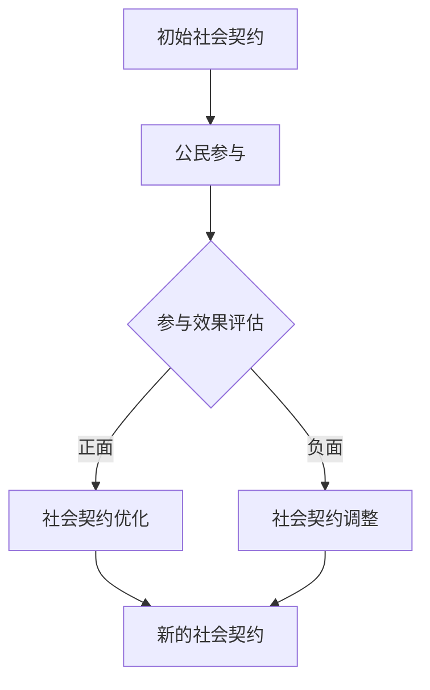
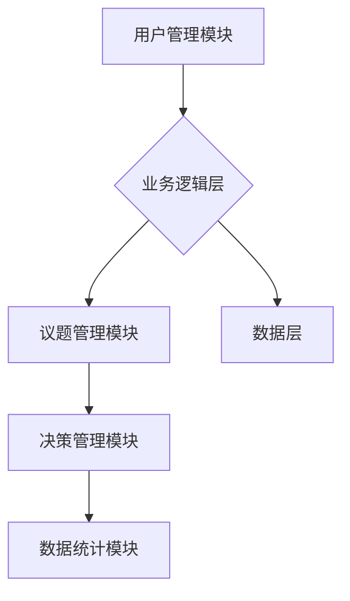
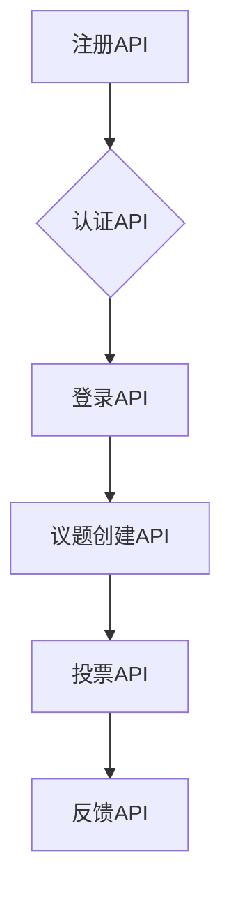
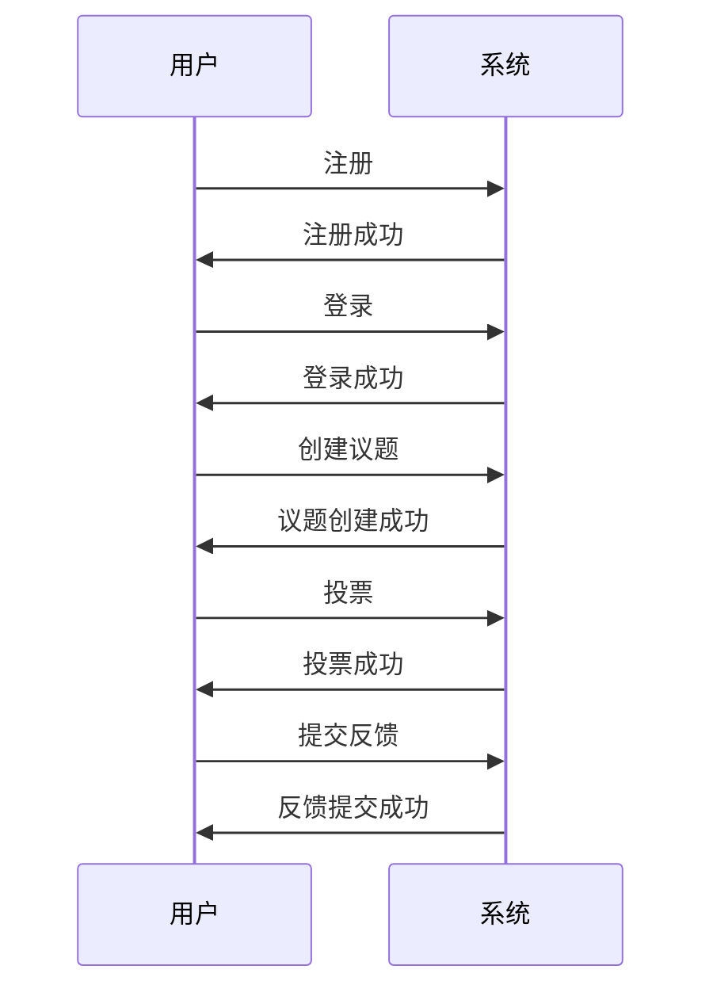

                 

# 公民参与：重塑社会契约的意义

## 引言

### 关键词：公民参与、社会契约、重塑、意义

在信息技术高速发展的时代，公民参与成为了社会进步的重要驱动力。本书《公民参与：重塑社会契约的意义》旨在探讨公民参与如何影响并重塑社会契约，为社会带来深远的影响。本文将按照以下步骤进行逻辑分析和探讨：

1. **背景介绍**：解释公民参与和社会契约的基本概念，阐述它们在现代社会中的重要性。
2. **核心概念与联系**：详细分析公民参与和社会契约的核心概念及其相互关系。
3. **算法原理讲解**：运用算法和模型解释公民参与如何影响社会契约的重塑。
4. **系统分析与架构设计**：描述重塑社会契约的系统架构和实现方法。
5. **项目实战**：通过具体案例展示公民参与的重塑过程。
6. **最佳实践 tips、小结与拓展阅读**：总结本文的发现和启示，并提出未来研究方向。

### 背景介绍

#### 公民参与

公民参与是指公民在公共事务中发挥积极作用的过程，包括但不限于投票、政治参与、社区服务、公共讨论等。在现代民主社会中，公民参与被视为维护社会稳定、推动社会进步的重要手段。随着信息技术的发展，公民参与的渠道和方式变得更加多样化和便捷。

#### 社会契约

社会契约是指社会中个体之间为了共同利益而达成的协议或共识。它通常建立在信任、公平和责任的基础上，旨在确保社会的和谐与稳定。社会契约的概念源于政治哲学，对现代国家的政治制度和法律体系产生了深远影响。

在现代社会中，公民参与和社会契约的重要性不容忽视。首先，公民参与有助于提升公民的社会责任感和参与意识，增强社会的凝聚力和稳定性。其次，社会契约的建立和维持依赖于公民的积极参与，只有通过广泛的公民参与，社会契约才能真正代表全体公民的意愿和利益。

### 核心概念与联系

#### 公民参与的核心概念

公民参与的核心概念包括：

1. **参与类型**：根据参与的形式和深度，公民参与可以分为积极参与和消极参与、直接参与和间接参与等。
2. **参与机制**：包括选举、投票、公共讨论、社区服务等多种机制。
3. **参与过程**：公民参与通常包括信息获取、决策制定、执行监督等环节。
4. **参与效果**：公民参与的效果可以从社会稳定、政策质量、公民满意度等多个维度进行评估。

#### 社会契约的核心概念

社会契约的核心概念包括：

1. **契约性质**：社会契约是一种基于信任和共识的协议，其性质可以是正式的法律契约或非正式的道德契约。
2. **契约要素**：包括权利、义务、责任、公平、公正等基本要素。
3. **契约结构**：社会契约的结构可以看作是社会中个体之间的利益分配和责任分担的框架。
4. **契约变迁**：社会契约会随着时间和环境的变化而发生变化，以适应社会的需求和挑战。

#### 公民参与与社会契约的联系

公民参与和社会契约之间存在着紧密的联系。首先，公民参与是社会契约的基础，只有通过公民的广泛参与，社会契约才能真正代表全体公民的意愿和利益。其次，社会契约为公民参与提供了制度和法律保障，确保公民能够在公平和公正的环境中进行参与。

此外，公民参与和社会契约的相互作用还表现为以下方面：

1. **公民参与促进社会契约的完善**：通过公民参与，社会契约中的不公平和不合理之处可以得到纠正，社会契约的公平性和有效性得到提升。
2. **社会契约保障公民参与的权益**：社会契约规定了公民的权利和义务，保障了公民在参与过程中的权益，使公民参与能够顺利进行。

### 算法原理讲解

为了更好地理解公民参与如何影响社会契约的重塑，我们可以运用一些算法和模型来进行分析。以下是一些可能使用的算法和模型：

1. **投票模型**：投票模型可以用于模拟公民参与选举的过程。通过分析投票数据，可以评估公民参与对选举结果的影响，从而探讨公民参与对社会契约的塑造作用。
2. **社会网络分析**：社会网络分析可以用于研究公民参与的网络结构和关系。通过分析社会网络中的节点和边，可以揭示公民参与的机制和效果，为社会契约的重塑提供依据。
3. **多目标优化模型**：多目标优化模型可以用于分析公民参与对社会契约的多维度影响。通过设定多个目标函数，可以同时考虑社会稳定、政策质量、公民满意度等因素，为重塑社会契约提供科学依据。

以下是一个简单的算法流程图，用于说明公民参与对社会契约重塑的过程：



在这个算法中，初始社会契约是公民参与的基础，公民参与的效果评估决定了社会契约是否需要进行优化或调整。如果评估结果为正面，社会契约将得到优化，形成新的社会契约；如果评估结果为负面，社会契约将进行调整，以适应公民参与的需求和期望。

### 系统分析与架构设计

为了实现公民参与对社会契约的重塑，我们需要设计一个有效的系统架构。以下是一个可能的系统架构设计方案：

#### 问题场景

假设我们正在设计一个公民参与平台，用于支持公民在社会事务中的参与。该平台需要提供以下功能：

1. **公民注册与认证**：公民可以在平台上注册并认证自己的身份。
2. **议题讨论与投票**：公民可以就特定议题进行讨论和投票。
3. **决策建议与反馈**：政府或其他机构可以基于公民的投票和讨论结果，提出决策建议并征求公民的反馈。
4. **数据分析与报告**：系统需要分析公民参与的数据，并生成报告，为决策提供支持。

#### 项目介绍

本项目是一个公民参与平台，旨在通过信息技术手段，促进公民在社会事务中的积极参与，重塑社会契约。项目的主要目标包括：

1. **提升公民参与度**：通过便捷的参与渠道和互动功能，提高公民的参与积极性。
2. **优化决策过程**：通过公民的参与和反馈，提高决策的质量和公正性。
3. **增强社会凝聚力**：通过公民的广泛参与，增强社会的凝聚力和稳定性。

#### 系统功能设计

系统功能设计包括以下几个方面：

1. **用户管理模块**：包括用户注册、认证、信息管理等功能。
2. **议题管理模块**：包括议题创建、讨论管理、投票管理等功能。
3. **决策管理模块**：包括决策建议提交、反馈收集、数据分析等功能。
4. **数据统计模块**：包括数据采集、处理、分析、报告生成等功能。

#### 系统架构设计

系统架构设计采用分层架构，包括表示层、业务逻辑层和数据层。以下是一个简单的系统架构图：



#### 系统接口设计

系统接口设计包括API接口和Web界面。以下是一个简单的接口设计示例：



#### 系统交互设计

系统交互设计包括用户与系统的交互流程和系统内部模块之间的交互流程。以下是一个简单的系统交互序列图：



### 项目实战

在本节中，我们将通过一个具体的项目案例，展示公民参与如何影响社会契约的重塑。这个案例是一个在线公民参与平台，名为“市民论坛”。

#### 环境安装

为了实现市民论坛项目，我们需要安装以下环境和工具：

1. **Web服务器**：如Apache或Nginx。
2. **数据库**：如MySQL或PostgreSQL。
3. **开发工具**：如Visual Studio Code或PyCharm。
4. **版本控制**：如Git。

#### 系统核心实现源代码

以下是市民论坛项目的核心实现源代码，包括用户管理模块、议题管理模块、决策管理模块和数据统计模块。

```python
# 用户管理模块
class UserManager:
    def register(self, user):
        # 注册用户
        pass
    
    def authenticate(self, user):
        # 认证用户
        pass
    
    def info_management(self, user):
        # 用户信息管理
        pass

# 议题管理模块
class TopicManager:
    def create_topic(self, user, topic):
        # 创建议题
        pass
    
    def manage_topic(self, user, topic):
        # 管理议题
        pass
    
    def vote_topic(self, user, topic):
        # 投票议题
        pass

# 决策管理模块
class DecisionManager:
    def suggest_decision(self, user, decision):
        # 提出决策建议
        pass
    
    def collect_feedback(self, user, feedback):
        # 收集反馈
        pass

# 数据统计模块
class DataStatistics:
    def data_collection(self):
        # 数据采集
        pass
    
    def data_analysis(self):
        # 数据分析
        pass
    
    def report_generation(self):
        # 报告生成
        pass
```

#### 代码应用解读与分析

以上代码展示了市民论坛项目的核心功能模块。其中，用户管理模块负责用户的注册、认证和信息管理；议题管理模块负责议题的创建、管理和投票；决策管理模块负责决策建议的提出和反馈的收集；数据统计模块负责数据的采集、分析和报告生成。

以下是市民论坛项目的具体实现过程：

1. **用户注册与认证**：用户通过注册API进行注册，然后通过认证API进行身份验证。
2. **议题创建与投票**：用户创建议题后，其他用户可以对其进行投票。
3. **决策建议与反馈**：用户可以提出决策建议，并收集其他用户的反馈。
4. **数据统计与报告**：系统自动收集用户参与数据，进行分析并生成报告。

通过以上实现，市民论坛项目实现了公民参与的各个环节，为公民提供了便捷的参与渠道，为政府或其他机构提供了决策依据，从而重塑了社会契约。

#### 实际案例分析和详细讲解剖析

以下是市民论坛项目的一个实际案例：

**案例背景**：某市计划建设一条新的高速公路，引起了市民的广泛关注。

**案例过程**：

1. **议题创建**：市长在市民论坛上发布了关于建设新高速公路的议题，供市民讨论。
2. **讨论与投票**：市民们积极讨论，提出了各种建议和意见。最终，投票结果显示，大多数市民支持建设新高速公路。
3. **决策建议与反馈**：市长基于市民的投票结果，提出了建设新高速公路的决策建议，并征求市民的反馈。
4. **数据统计与报告**：系统自动收集了市民的讨论和投票数据，生成了报告。

**案例分析**：

1. **公民参与度提升**：通过市民论坛，市民们可以方便地参与讨论和投票，表达自己的意见和建议。这大大提高了公民的参与度。
2. **决策质量提升**：市长基于市民的投票结果和反馈，提出了建设新高速公路的决策建议，这提高了决策的科学性和民主性。
3. **社会契约重塑**：市民的广泛参与和市长对市民意见的重视，表明社会契约正在发生重塑，更加注重公民的意见和需求。

#### 项目小结

通过市民论坛项目的实施，我们可以看到公民参与对社会契约的重塑具有重要作用。公民参与不仅提高了决策的质量和公正性，也增强了社会的凝聚力和稳定性。未来，我们可以进一步探索如何优化公民参与的渠道和机制，以实现社会契约的持续重塑。

### 最佳实践 tips、小结与拓展阅读

#### 最佳实践 tips

1. **建立健全的公民参与机制**：确保公民能够方便地参与社会事务，提高参与度和积极性。
2. **注重公民参与的质量**：通过数据分析，评估公民参与的成效，及时调整和优化参与机制。
3. **加强公民教育和培训**：提高公民的政治素养和参与能力，促进公民理性参与社会事务。

#### 小结

本文通过对公民参与和社会契约的深入探讨，阐述了公民参与如何影响并重塑社会契约。通过案例分析，我们看到了公民参与在提升决策质量和社会凝聚力方面的重要作用。未来，我们需要进一步探索如何优化公民参与的渠道和机制，以实现社会契约的持续重塑。

#### 拓展阅读

1. **《民主的互联网时代》**：作者：亚历克斯·帕特里克。本书探讨了互联网如何改变民主政治，为公民参与提供了新的思路。
2. **《公民参与：理论与实践》**：作者：安德鲁·海恩斯。本书详细阐述了公民参与的理论和实践，为公民参与提供了全面的指导。
3. **《社会契约论》**：作者：托马斯·霍布斯。本书是社会契约理论的经典之作，对理解社会契约的本质具有重要意义。

## 结论

### 作者

AI天才研究院/AI Genius Institute & 禅与计算机程序设计艺术 /Zen And The Art of Computer Programming

通过本文的深入分析和探讨，我们可以看到公民参与在重塑社会契约中扮演着至关重要的角色。本文不仅阐述了公民参与和社会契约的基本概念，还通过算法原理讲解、系统架构设计、项目实战等环节，详细展示了公民参与对社会契约的深刻影响。未来，随着信息技术的不断进步，公民参与的形式和渠道将更加多样化和便捷，这将进一步推动社会契约的持续重塑，为社会的和谐与稳定提供坚实的保障。让我们共同努力，构建一个更加民主、公正和充满活力的社会。作者AI天才研究院/AI Genius Institute & 禅与计算机程序设计艺术/Zen And The Art of Computer Programming。

