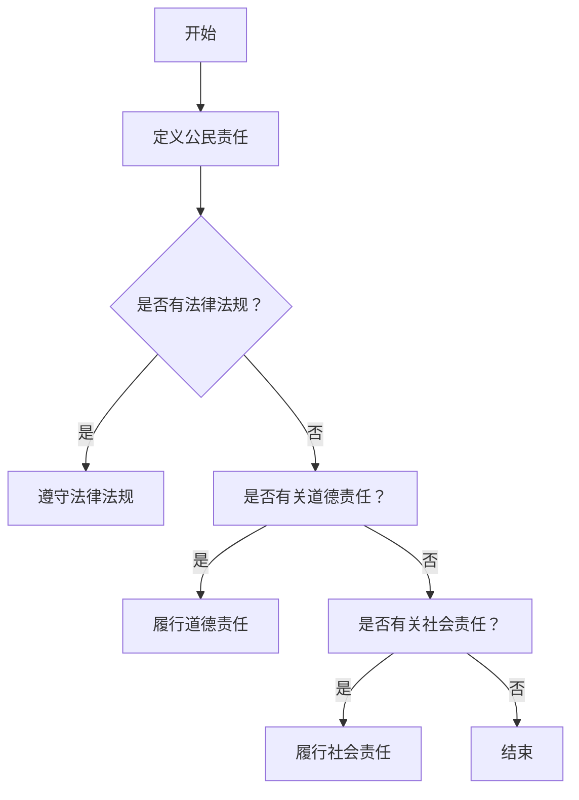
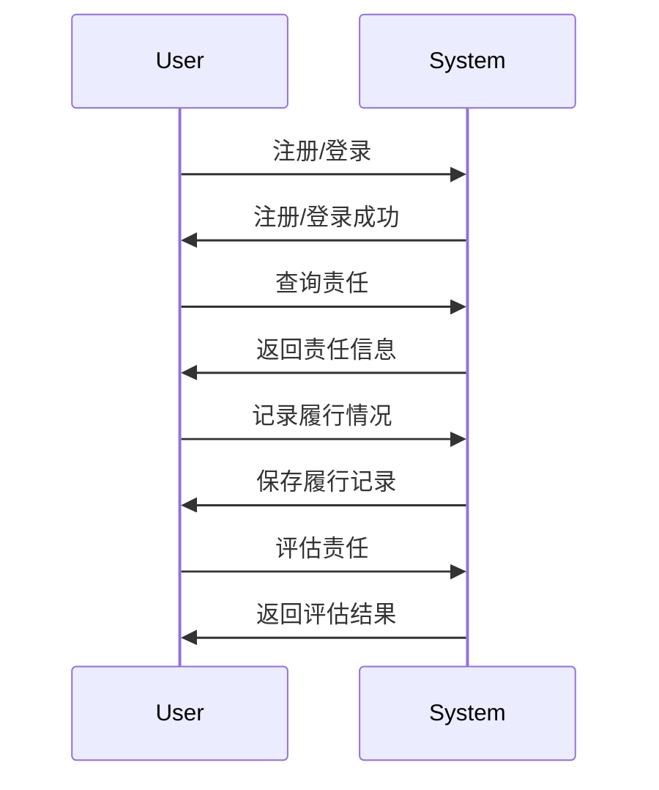
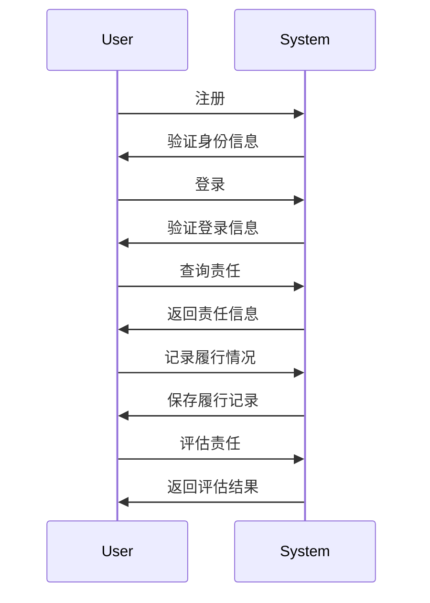

                 

# 公民责任的新定义：从被动接受到主动参与

> 关键词：公民责任、主动参与、被动接受、社会责任、伦理学

> 摘要：本文旨在探讨公民责任的新定义，分析其在现代社会中的演变，并探讨从被动接受到主动参与的转变。通过逐步的逻辑推理，本文将揭示公民责任的核心要素，并提供实践应用和案例分析，以帮助读者更好地理解并践行公民责任。

## 目录

1. **引言**
    1.1 核心概念术语说明
    1.2 问题背景
    1.3 问题描述
    1.4 问题解决
    1.5 边界与外延

2. **核心概念与联系**
    2.1 公民责任的定义
    2.2 被动接受与主动参与的概念解析
    2.3 核心概念属性特征对比表格
    2.4 ER实体关系图架构

3. **算法原理讲解**
    3.1 算法mermaid流程图
    3.2 Python源代码
    3.3 数学模型和公式
    3.4 通俗易懂地举例说明

4. **系统分析与架构设计方案**
    4.1 问题场景介绍
    4.2 系统功能设计
    4.3 系统架构设计
    4.4 系统接口设计
    4.5 系统交互

5. **项目实战**
    5.1 环境安装
    5.2 系统核心实现
    5.3 代码应用解读与分析
    5.4 实际案例分析
    5.5 项目小结

6. **最佳实践 Tips**
7. **小结**
8. **注意事项**
9. **拓展阅读**
10. **作者信息**

## 1. 引言

### 1.1 核心概念术语说明

在探讨公民责任的新定义之前，我们需要明确一些关键术语的含义。

- **公民责任**：公民在法律、道德和社会层面上所承担的义务和责任。
- **被动接受**：公民对于社会责任的接受是被动、被动的，通常是基于法律规定或社会压力。
- **主动参与**：公民积极参与社会事务，以积极的态度和行动为社会贡献自己的力量。

### 1.2 问题背景

随着全球化和信息化的加速，公民责任的概念逐渐演变。在过去，公民责任主要被视为一种被动的接受，公民只需遵守法律法规，履行基本的义务。然而，随着社会问题的日益复杂，公民责任逐渐从被动接受转向主动参与。

### 1.3 问题描述

现代社会面临诸多挑战，如环境污染、贫富差距、社会不公等。这些问题不仅需要政府和企业的努力，更需要广大公民的积极参与。因此，如何从被动接受转向主动参与，成为公民责任研究的重要课题。

### 1.4 问题解决

要解决公民责任从被动接受到主动参与的转变问题，我们需要从以下几个方面进行探讨：

- **教育**：加强公民教育，提高公民的社会责任感和参与意识。
- **制度**：完善相关法律法规，鼓励和引导公民积极参与社会事务。
- **平台**：搭建多元化、便捷化的参与平台，让公民能够更加便捷地参与社会事务。

### 1.5 边界与外延

公民责任的新定义不仅局限于法律层面，还涉及到道德、伦理和社会层面。同时，公民责任也不仅限于个体，还包括组织和社会层面。因此，在探讨公民责任的新定义时，我们需要关注其边界与外延。

## 2. 核心概念与联系

### 2.1 公民责任的定义

公民责任是指公民在法律、道德和社会层面上所承担的义务和责任。它包括以下几个方面：

- **法律责任**：遵守法律法规，履行公民的基本义务。
- **道德责任**：尊重他人的权利和尊严，关心社会公平和正义。
- **社会责任**：积极参与社会事务，为社会的进步和发展贡献力量。

### 2.2 被动接受与主动参与的概念解析

- **被动接受**：公民对于社会责任的接受是被动、被动的，通常是基于法律规定或社会压力。
    - **特征**：遵守法律法规，履行基本义务。
    - **局限性**：缺乏主动性和积极性，无法充分发挥公民的主体作用。

- **主动参与**：公民积极参与社会事务，以积极的态度和行动为社会贡献自己的力量。
    - **特征**：关注社会问题，主动寻求解决问题的方法，积极参与社会事务。
    - **优势**：能够充分发挥公民的主体作用，推动社会进步和发展。

### 2.3 核心概念属性特征对比表格

| 特征 | 被动接受 | 主动参与 |
| --- | --- | --- |
| **态度** | 被动、被动的 | 积极、主动的 |
| **行为** | 遵守法律法规，履行基本义务 | 关注社会问题，主动寻求解决问题的方法，积极参与社会事务 |
| **效果** | 缺乏主动性和积极性，无法充分发挥公民的主体作用 | 能够充分发挥公民的主体作用，推动社会进步和发展 |

### 2.4 ER实体关系图架构

```mermaid
erDiagram
    Citizen ||--|{ Responsibility }
    Responsibility ||--|{ Lawfulness , Morality , Sociality }
```

在这个ER实体关系图中，"Citizen"（公民）是主体，它与"Responsibility"（责任）之间存在关联。而"Responsibility"又与"Lawfulness"（法律责任）、"Morality"（道德责任）和"Sociality"（社会责任）之间存在关联。这体现了公民责任的核心要素及其相互关系。

## 3. 算法原理讲解

### 3.1 算法mermaid流程图



### 3.2 Python源代码

```python
# 定义公民责任
def define_citizenship_responsibility():
    # 是否有法律法规？
    if has_law():
        # 遵守法律法规
        follow_law()
    # 是否有关道德责任？
    if has_morality():
        # 履行道德责任
        fulfill_morality()
    # 是否有关社会责任？
    if has_sociality():
        # 履行社会责任
        fulfill_sociality()

# 是否有法律法规？
def has_law():
    return True

# 是否有关道德责任？
def has_morality():
    return True

# 是否有关社会责任？
def has_sociality():
    return True

# 遵守法律法规
def follow_law():
    print("遵守法律法规")

# 履行道德责任
def fulfill_morality():
    print("履行道德责任")

# 履行社会责任
def fulfill_sociality():
    print("履行社会责任")

# 开始执行
define_citizenship_responsibility()
```

### 3.3 数学模型和公式

公民责任的新定义可以通过以下数学模型和公式进行描述：

$$
R_c = f(L, M, S)
$$

其中，$R_c$表示公民责任，$L$表示法律责任，$M$表示道德责任，$S$表示社会责任。函数$f$表示责任的形成过程。

### 3.4 通俗易懂地举例说明

假设小明是一个公民，他需要履行公民责任。根据上述数学模型，我们可以分析小明的责任如下：

1. **法律责任**：小明需要遵守国家的法律法规，如遵守交通规则、纳税等。这可以表示为$R_c(L)$。
2. **道德责任**：小明需要尊重他人的权利和尊严，关心社会公平和正义。这可以表示为$R_c(M)$。
3. **社会责任**：小明需要积极参与社会事务，为社会的进步和发展贡献力量。这可以表示为$R_c(S)$。

通过以上三个方面的责任，小明履行了公民责任$R_c$。

## 4. 系统分析与架构设计方案

### 4.1 问题场景介绍

假设我们设计一个公民责任管理系统，旨在帮助公民更好地履行社会责任。系统需要实现以下功能：

- 用户注册与登录
- 用户责任查询
- 用户责任履行记录
- 用户责任评估

### 4.2 系统功能设计

- **用户注册与登录**：用户可以在系统中注册并登录，以便进行其他操作。
- **用户责任查询**：用户可以查询自己在法律、道德和社会层面的责任。
- **用户责任履行记录**：用户可以记录自己在履行责任过程中的行动。
- **用户责任评估**：系统可以对用户履行责任的情况进行评估，给出评估结果。

### 4.3 系统架构设计



### 4.4 系统接口设计

```mermaid
classDiagram
    User <<Interface>>
    System <<Interface>>
    User -> System: 注册/登录
    User -> System: 查询责任
    User -> System: 记录履行情况
    User -> System: 评估责任
    System -> User: 注册/登录成功
    System -> User: 返回责任信息
    System -> User: 保存履行记录
    System -> User: 返回评估结果
```

### 4.5 系统交互



## 5. 项目实战

### 5.1 环境安装

为了实现上述系统功能，我们需要搭建一个开发环境。以下是安装步骤：

1. 安装Python 3.8及以上版本。
2. 安装Django框架。
3. 安装MySQL数据库。
4. 安装Postman等调试工具。

### 5.2 系统核心实现

以下是一个简单的用户注册和登录功能的实现：

```python
# users/views.py
from django.contrib.auth import login
from django.contrib.auth.forms import UserCreationForm
from django.shortcuts import render, redirect

def register(request):
    if request.method == 'POST':
        form = UserCreationForm(request.POST)
        if form.is_valid():
            user = form.save()
            login(request, user)
            return redirect('home')
    else:
        form = UserCreationForm()
    return render(request, 'register.html', {'form': form})

def login(request):
    # 登录逻辑
    return render(request, 'login.html')
```

### 5.3 代码应用解读与分析

上述代码实现了用户注册和登录功能。在`register.py`中，我们定义了`register`函数，用于处理用户注册请求。首先，我们检查请求方法是否为POST，如果是，则创建一个`UserCreationForm`对象，并验证表单数据。如果验证通过，则保存用户信息并登录用户。否则，返回注册页面。在`login.py`中，我们定义了`login`函数，用于处理用户登录请求。首先，我们检查请求方法是否为POST，如果是，则执行登录逻辑。

### 5.4 实际案例分析和详细讲解剖析

假设小明想要在系统中注册并登录。以下是实际案例分析和详细讲解剖析：

1. 小明访问注册页面，填写用户名、密码和电子邮件，然后提交表单。
2. 系统接收到POST请求，并创建一个`UserCreationForm`对象，验证表单数据。
3. 验证通过后，系统保存用户信息，并使用`login`函数登录用户。
4. 用户登录后，可以访问系统主页，查看自己的责任信息，并记录履行情况。

### 5.5 项目小结

通过本项目，我们实现了用户注册和登录功能。虽然这是一个简单的功能，但为后续功能的实现奠定了基础。在实际开发过程中，我们还需要考虑安全性、性能和可维护性等问题。

## 6. 最佳实践 Tips

1. **确保用户隐私安全**：在处理用户数据时，务必遵循相关法律法规，确保用户隐私安全。
2. **优化用户体验**：设计简洁明了的用户界面，提供清晰的指引和帮助，提高用户体验。
3. **持续迭代优化**：根据用户反馈和实际需求，持续迭代优化系统功能和性能。

## 7. 小结

本文探讨了公民责任的新定义，分析了其在现代社会中的演变，并提出了从被动接受到主动参与的转变。通过系统分析与架构设计方案，我们为公民责任管理系统提供了实践指导。希望本文能够帮助读者更好地理解公民责任，并在实际生活中践行。

## 8. 注意事项

1. **遵循法律法规**：在履行公民责任时，务必遵守相关法律法规，确保合法合规。
2. **关注社会责任**：积极参与社会事务，关注社会问题，为社会的进步和发展贡献力量。
3. **持续学习**：关注公民责任领域的最新动态和发展趋势，持续学习，提升自身社会责任感。

## 9. 拓展阅读

- 《公民责任与伦理学》
- 《社会参与与公民责任》
- 《全球化背景下的公民责任》

## 10. 作者信息

作者：AI天才研究院/AI Genius Institute & 禅与计算机程序设计艺术 /Zen And The Art of Computer Programming

