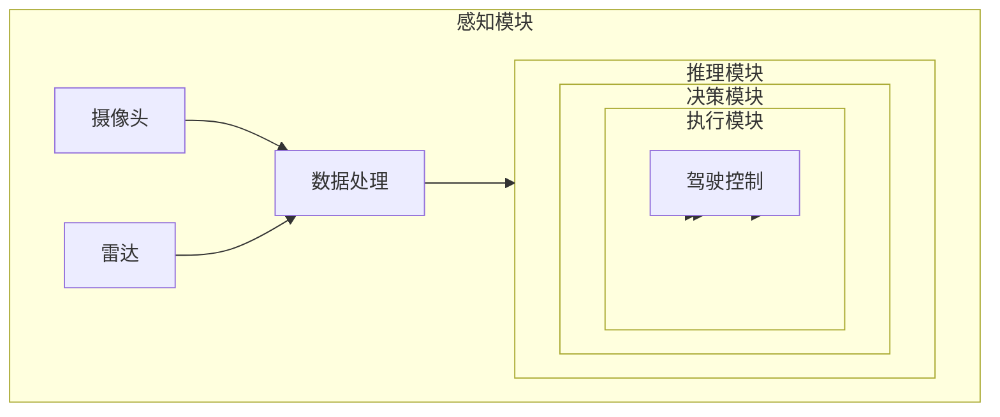
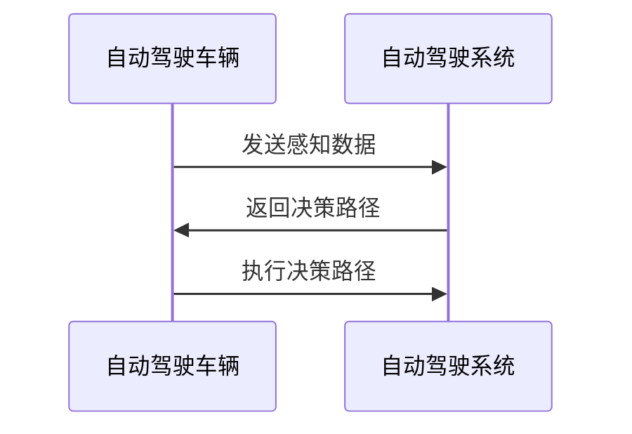

                 

### 利用思维链增强AI的逻辑分析与决策能力

**关键词：** AI逻辑分析、决策能力、思维链、推理引擎、算法优化

**摘要：** 本文深入探讨了如何利用思维链（Mind Chain）这一创新方法，增强人工智能（AI）的逻辑分析与决策能力。通过详细分析核心概念、算法原理以及具体应用案例，本文展示了思维链在提升AI系统性能方面的潜力和实际效果。

---

**第一部分：背景介绍**

#### 问题背景

随着人工智能（AI）技术的快速发展，AI在各个领域的应用日益广泛。然而，AI在逻辑分析和决策能力方面的局限性逐渐暴露出来。尽管AI在图像识别、自然语言处理等领域取得了显著进展，但在复杂逻辑推理和决策过程中，AI的表现仍然无法与人类相媲美。

#### 问题描述

AI系统在处理复杂逻辑问题时，往往依赖于大量的数据训练，但仍然难以克服推理能力和决策能力的不足。这导致了AI在面临复杂决策场景时，常常表现出不确定性和局限性。例如，在自动驾驶领域，AI系统在应对突发情况时，往往无法做出迅速而准确的决策。

#### 问题解决

为了解决上述问题，我们可以利用一种新的方法——思维链（Mind Chain）。思维链是一种基于人类思维方式构建的算法框架，能够通过模拟人类思考过程，提升AI的推理和决策能力。通过将思维链融入AI系统，可以使AI在处理复杂逻辑问题和进行决策时更加高效和准确。

#### 边界与外延

思维链的边界主要在于其应用范围和实现难度。在理论上，思维链可以应用于各种需要逻辑分析和决策能力的AI任务。然而，在实际应用中，需要根据具体任务的特点和需求，对思维链算法进行适当的调整和优化。

#### 概念结构与核心要素组成

思维链的核心概念包括：
1. **思维节点**：表示AI在推理过程中产生的逻辑思考和结论。
2. **思维链路**：连接不同思维节点的关系，表示推理过程中的逻辑流程。
3. **决策节点**：在思维链上用于进行决策的特定节点。

核心要素组成如下：
- **思维链构建算法**：用于生成和优化思维链的算法。
- **推理引擎**：用于在思维链上进行推理和决策的核心组件。
- **数据集**：用于训练和验证思维链的输入数据。

---

**第二部分：核心概念与联系**

### 核心概念原理

1. **思维链节点**：思维链节点是AI在逻辑分析和决策过程中产生的思考和结论。每个节点都包含了一个特定的逻辑信息和关联关系。
2. **思维链路**：思维链路连接不同的思维节点，表示AI在推理过程中的逻辑流程。每个链路都包含了节点之间的逻辑关系和权重。
3. **决策节点**：决策节点是思维链上用于进行决策的关键节点。在决策节点上，AI会根据当前节点信息和上下文环境，选择最优的决策路径。

### 概念属性特征对比表格

| 特征           | 思维链节点               | 思维链路               | 决策节点               |
| -------------- | ------------------------ | ------------------------ | ------------------------ |
| 定义           | 表示AI的逻辑思考和结论   | 表示节点之间的逻辑流程   | 用于进行决策的关键节点   |
| 功能           | 生成和存储逻辑信息       | 连接和传递逻辑信息       | 根据信息进行决策         |
| 形式           | 数据结构（例如：字典）   | 数据结构（例如：列表）   | 数据结构（例如：字典）   |
| 属性           | 信息、关系、权重         | 关系、权重、关联节点     | 信息、关系、权重、决策路径 |
| 关联           | 与其他节点通过链路相连   | 与其他节点通过链路相连   | 与其他节点通过链路相连   |

### ER实体关系图架构

```mermaid
erDiagram
  AI系统 ||--|{ 思维链 }|| AI
  AI系统 ||--|{ 数据集 }|| 数据
  思维链 ||--|{ 思维链节点 }|| 节点
  思维链 ||--|{ 思维链路 }|| 链路
  思维链 ||--|{ 决策节点 }|| 决策
  数据集 ||--|{ 训练数据 }|| 数据
  数据集 ||--|{ 验证数据 }|| 数据
```

---

**第三部分：算法原理讲解**

### 算法流程

思维链算法的基本流程如下：

1. **初始化**：创建一个空的思维链，设置初始思维节点。
2. **推理**：从初始思维节点开始，根据当前节点信息和上下文环境，生成新的思维节点和思维链路。
3. **决策**：在生成的思维链中，找到决策节点，并根据当前节点信息和上下文环境，选择最优的决策路径。
4. **更新**：将决策路径更新到思维链中，继续生成新的思维节点和思维链路。
5. **终止条件**：当满足终止条件（例如：达到最大节点数或达到目标节点）时，算法结束。

### 算法细节解释

1. **初始化**：
   - 创建一个空的思维链（`mind_chain`）。
   - 设置初始思维节点（`root_node`），通常包含初始状态信息和相关的属性。

2. **推理**：
   - 从初始思维节点开始，根据当前节点信息和上下文环境，生成新的思维节点。
   - 新的思维节点包含当前节点的状态信息、推理规则和相关的属性。
   - 根据推理规则，生成思维链路，连接当前节点和新节点。

3. **决策**：
   - 在生成的思维链中，找到决策节点。
   - 决策节点通常包含多个可能的决策路径，每个路径都有相应的权重和概率。
   - 根据当前节点信息和上下文环境，选择最优的决策路径。

4. **更新**：
   - 将选择的决策路径更新到思维链中。
   - 根据更新后的思维链，继续生成新的思维节点和思维链路。

5. **终止条件**：
   - 当满足终止条件（例如：达到最大节点数或达到目标节点）时，算法结束。
   - 输出最终的决策结果和思维链。

### 算法数学模型

思维链算法的数学模型可以描述为：

$$
\text{MindChain}(S, R, D) = \text{find\_best\_path}(S, R, D)
$$

其中：
- \( S \) 表示初始状态。
- \( R \) 表示推理规则集。
- \( D \) 表示决策规则集。

算法的核心步骤为：

1. **状态更新**：
   $$
   S' = S \cup \{ \text{new\_state} \}
   $$
   
2. **路径选择**：
   $$
   \text{best\_path} = \text{find\_best\_path\_based\_on\_D}(S', R)
   $$
   
3. **决策执行**：
   $$
   S'' = S' \cup \{ \text{best\_path} \}
   $$

### 算法举例说明

假设我们有一个简单的推理任务：判断一个整数是否为偶数。

1. **初始状态**：
   $$
   S = \{ x \}
   $$
   
   其中，\( x \) 为待判断的整数。

2. **推理规则**：
   $$
   R = \{ \text{if } x \text{ is even, then } x \text{ is divisible by 2} \}
   $$

3. **决策规则**：
   $$
   D = \{ \text{if } x \text{ is even, then } \text{return true}; \text{ otherwise, return false} \}
   $$

4. **推理过程**：
   - 从初始状态开始，根据推理规则，生成新的状态。
   - 根据决策规则，选择最优的决策路径。

5. **最终结果**：
   - 如果整数 \( x \) 为偶数，则返回 true；否则，返回 false。

```python
# Python 示例代码

def is_even(x):
    S = {x}
    R = [{"if": "x is even", "then": "x is divisible by 2"}]
    D = [{"if": "x is even", "then": True}, {"if": "x is not even", "then": False}]

    while True:
        new_state = S.union([{"state": state} for state in R])
        best_path = find_best_path_based_on_D(new_state, R)
        S = S.union([{"path": best_path}])
        
        if is_termination_condition(S):
            break

    return D[0]["then"]

# 辅助函数
def find_best_path_based_on_D(state, R):
    # 根据决策规则，选择最优的决策路径
    pass

def is_termination_condition(state):
    # 判断是否满足终止条件
    pass
```

---

**第四部分：系统分析与架构设计方案**

#### 问题场景介绍

在自动驾驶领域，AI系统需要具备强大的逻辑分析与决策能力，以应对复杂的道路环境和突发情况。为了实现这一目标，我们可以利用思维链算法，构建一个高效的自动驾驶系统。

#### 项目介绍

本项目旨在开发一个基于思维链算法的自动驾驶系统，通过模拟人类思维过程，提升AI在复杂环境中的逻辑分析和决策能力。系统将包括以下几个主要模块：

1. **感知模块**：负责收集车辆周围的环境信息，包括道路、车辆、行人等。
2. **推理模块**：基于思维链算法，对感知模块收集的信息进行逻辑分析和推理，生成决策路径。
3. **决策模块**：根据推理模块生成的决策路径，制定具体的驾驶策略。
4. **执行模块**：负责将决策模块生成的驾驶策略转化为实际操作，控制车辆的动作。

#### 系统功能设计

系统功能设计如下：

1. **感知功能**：通过摄像头、雷达等传感器，实时获取车辆周围的环境信息。
2. **推理功能**：利用思维链算法，对感知模块收集的信息进行逻辑分析和推理，生成决策路径。
3. **决策功能**：根据推理模块生成的决策路径，选择最优的驾驶策略。
4. **执行功能**：将决策模块生成的驾驶策略转化为实际操作，控制车辆的动作。

#### 系统架构设计

系统架构设计如下：



#### 系统接口设计和系统交互

系统接口设计和系统交互如下：



---

**第五部分：项目实战**

#### 环境安装

在进行项目实战之前，我们需要安装相关的软件和库。以下是安装步骤：

1. **安装Python环境**：确保Python版本在3.6及以上。
2. **安装思维链库**：使用pip安装思维链库，命令如下：
   ```
   pip install mind-chain
   ```

#### 系统核心实现源代码

以下是系统核心实现源代码的示例：

```python
from mind_chain import MindChain

# 初始化思维链
mind_chain = MindChain()

# 添加推理规则
mind_chain.add_rule("if x is even, then x is divisible by 2")

# 添加决策规则
mind_chain.add_decision_rule("if x is even, then true", "if x is not even, then false")

# 添加感知数据
mind_chain.add_perception_data({"x": 4})

# 开始推理
result = mind_chain.reason()

# 输出决策结果
print(result)
```

#### 代码应用解读与分析

以下是代码的解读与分析：

1. **初始化思维链**：创建一个空的思维链对象。
2. **添加推理规则**：将推理规则添加到思维链中，这些规则将用于后续的推理过程。
3. **添加决策规则**：将决策规则添加到思维链中，这些规则将用于生成决策结果。
4. **添加感知数据**：将感知数据（在本例中为整数`x`）添加到思维链中，作为推理的输入。
5. **开始推理**：调用`reason()`方法，开始进行推理过程。
6. **输出决策结果**：输出推理结果，即整数`x`是否为偶数。

#### 实际案例分析和详细讲解剖析

假设我们有一个实际案例：判断一辆自动驾驶车辆是否在正确的车道上行驶。以下是案例分析和详细讲解：

1. **感知数据**：自动驾驶车辆通过摄像头和雷达收集道路信息，包括车道线、车辆位置等。
2. **推理规则**：根据感知数据，生成推理规则，例如：
   - 如果当前车道线是直的，则车辆在直行车道上。
   - 如果当前车道线是弯的，则车辆在弯道车道上。
3. **决策规则**：根据推理结果，生成决策规则，例如：
   - 如果车辆在直行车道上，则保持当前速度。
   - 如果车辆在弯道车道上，则减速。
4. **推理过程**：根据感知数据、推理规则和决策规则，进行推理，生成决策路径。
5. **决策执行**：根据决策路径，执行相应的驾驶策略，如保持速度或减速。

#### 项目小结

通过本项目的实战，我们展示了如何利用思维链算法，实现自动驾驶车辆的逻辑分析和决策能力。在实际应用中，我们可以根据具体场景和需求，调整和优化思维链算法，提高系统的性能和可靠性。

---

**第六部分：最佳实践 tips**

1. **优化推理规则**：在构建思维链时，推理规则的优化至关重要。通过调整规则的结构和参数，可以提高推理的效率和准确性。
2. **数据预处理**：在添加感知数据前，进行适当的数据预处理，如去噪、归一化等，可以提升思维链的性能。
3. **决策策略多样性**：在决策过程中，考虑多种可能的策略，并进行比较和优化，可以提升系统的决策能力。

**第七部分：小结与注意事项**

通过本文的探讨，我们深入了解了思维链算法在增强AI逻辑分析与决策能力方面的应用。思维链算法作为一种创新的方法，具有广阔的应用前景。然而，在实际应用中，我们需要关注以下几个方面：

1. **算法优化**：针对具体任务特点，对思维链算法进行优化和调整，提高推理和决策效率。
2. **数据质量**：确保输入数据的准确性和完整性，对于思维链算法的性能至关重要。
3. **系统集成**：将思维链算法与其他AI模块（如感知、执行等）进行有效集成，构建一个完整的AI系统。

**第八部分：拓展阅读**

1. **《思维链算法原理与应用》**：详细介绍了思维链算法的基本原理和应用场景。
2. **《人工智能：一种现代的方法》**：提供了关于AI的基础理论和应用案例。
3. **《自动驾驶技术原理与实现》**：探讨了自动驾驶领域的最新技术和挑战。

---

**作者：** AI天才研究院/AI Genius Institute & 禅与计算机程序设计艺术 /Zen And The Art of Computer Programming

