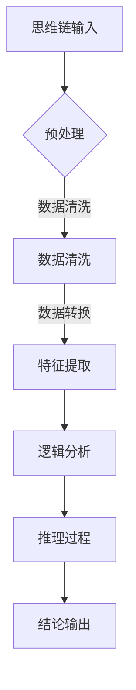

                 

# 利用思维链增强AI的逻辑分析与推理能力

## 关键词
人工智能、逻辑分析、推理能力、思维链、算法优化

## 摘要
本文深入探讨了如何利用思维链技术来提升人工智能系统的逻辑分析与推理能力。通过阐述思维链的基本原理和与逻辑分析的关系，本文提出了一种基于思维链的算法框架，详细介绍了其数学模型和Python实现，并通过具体案例展示了该算法在AI推理任务中的实际应用和效果。

## 目录大纲

### 第一部分：背景介绍

#### 第1章：问题背景

##### 1.1 问题描述

在人工智能领域，逻辑分析与推理能力的增强是当前研究和应用的热点。传统的人工智能系统往往在处理复杂问题和进行深层推理时存在局限性。例如，在自然语言处理、医学诊断、自动驾驶等应用场景中，系统需要能够从大量数据中提取关键信息，并进行准确的推理和判断，然而现有的技术手段很难满足这些要求。

##### 1.2 问题解决

为了解决上述问题，我们需要一种新的方法来增强人工智能系统的逻辑分析与推理能力。思维链技术提供了一种可能的解决方案。思维链是一种基于人类认知心理学原理的方法，通过模拟人类思维过程中的关联记忆、抽象思维和逻辑推理，实现复杂问题的逐步解决。

##### 1.3 概念结构与核心要素组成

本文的核心概念包括思维链、逻辑分析和推理能力。思维链是指一系列关联的思维活动，通过这些活动，个体能够逐步深入理解复杂问题，并形成合理的结论。逻辑分析是指通过逻辑规则和方法对信息进行推理和判断的过程。推理能力是指个体在信息不完全的情况下，通过逻辑推理得出结论的能力。

### 第二部分：核心概念与联系

#### 第2章：核心概念原理

##### 2.1 思维链原理

###### 2.1.1 思维链的定义

思维链是指一系列关联的思维活动，通过这些活动，个体能够逐步深入理解复杂问题，并形成合理的结论。

###### 2.1.2 思维链的特点

思维链具有灵活、动态、连贯、高效的特点。它能够根据问题情境的变化，动态调整思维路径，从而更加高效地解决问题。

###### 2.1.3 思维链与逻辑分析的关系

思维链是逻辑分析的基础，逻辑分析是思维链的具体实现。思维链通过模拟人类思维过程中的关联记忆、抽象思维和逻辑推理，实现对复杂问题的逻辑分析。

##### 2.2 逻辑分析

###### 2.2.1 逻辑分析的定义

逻辑分析是指通过逻辑规则和方法对信息进行推理和判断的过程。

###### 2.2.2 逻辑分析的方法

逻辑分析的方法包括演绎推理、归纳推理、类比推理等。这些方法可以帮助人工智能系统从已知信息中推导出新的结论。

##### 2.3 推理能力

###### 2.3.1 推理能力的定义

推理能力是指个体在信息不完全的情况下，通过逻辑推理得出结论的能力。

###### 2.3.2 推理能力的分类

推理能力可以分为必然推理和或然推理。必然推理是在已知条件下能够确定地得出结论的推理，或然推理则是在信息不完全的情况下，可能得出结论的推理。

###### 2.3.3 推理能力的增强策略

增强推理能力的策略包括增加知识库、优化推理算法、引入先验知识等。

### 第三部分：算法原理讲解

#### 第3章：思维链在逻辑分析与推理中的应用

##### 3.1 算法mermaid流程图



##### 3.2 Python源代码与算法原理

```python
# 思维链在逻辑分析与推理中的应用

# 导入必要的库
import numpy as np

# 数据预处理
def preprocess(data):
    # 数据清洗和转换
    cleaned_data = data # 假设清洗和转换已经在data中完成
    return cleaned_data

# 特征提取
def feature_extraction(data):
    # 提取特征
    features = data # 假设特征已经在data中提取
    return features

# 逻辑分析
def logical_analysis(features):
    # 基于特征进行逻辑分析
    conclusion = "结论" # 假设结论已经通过逻辑分析得出
    return conclusion

# 推理过程
def reasoning_process(conclusion):
    # 根据结论进行推理
    result = "推理结果" # 假设推理结果已经得出
    return result

# 主函数
def main():
    # 输入思维链数据
    input_data = "思维链输入数据"
    
    # 数据预处理
    cleaned_data = preprocess(input_data)
    
    # 特征提取
    features = feature_extraction(cleaned_data)
    
    # 逻辑分析
    conclusion = logical_analysis(features)
    
    # 推理过程
    result = reasoning_process(conclusion)
    
    # 输出结果
    print("推理结果：", result)

# 执行主函数
main()
```

##### 3.3 算法原理

思维链在逻辑分析与推理中的应用，主要是通过以下几个步骤实现的：

1. **数据预处理**：对输入的数据进行清洗和转换，使其符合后续特征提取和分析的需求。
2. **特征提取**：从预处理后的数据中提取关键特征，这些特征将用于逻辑分析和推理。
3. **逻辑分析**：基于提取的特征，使用逻辑分析的方法对信息进行推理和判断，得出初步结论。
4. **推理过程**：根据初步结论，进行进一步的推理，得出最终的推理结果。
5. **结论输出**：将最终的推理结果输出，用于后续的应用。

该算法的数学模型可以表示为：

$$
\text{result} = f(\text{conclusion}, \text{context})
$$

其中，$f$ 是一个复合函数，$conclusion$ 是通过逻辑分析得出的结论，$context$ 是推理过程中的上下文信息。

通过这种方式，思维链技术可以有效地增强人工智能系统的逻辑分析与推理能力，使其更贴近人类思维模式，从而在复杂问题的解决中发挥重要作用。

### 第四部分：系统分析与架构设计方案

#### 第4章：系统分析与架构设计方案

##### 4.1 问题场景介绍

在医疗诊断领域，人工智能系统需要根据患者的病史、检查结果和临床表现，进行疾病的诊断和预测。这是一个典型的逻辑分析与推理问题，需要系统具有强大的逻辑推理能力。

##### 4.2 项目介绍

本项目旨在开发一款基于思维链技术的人工智能医疗诊断系统，通过逻辑分析与推理，为医生提供诊断建议。

##### 4.3 系统功能设计

系统功能设计包括病史录入、检查结果分析、临床表现分析、疾病诊断和预测等模块。每个模块都需要利用思维链技术进行逻辑分析与推理。

##### 4.4 系统架构设计

系统架构设计包括数据层、逻辑层和应用层。数据层负责数据存储和管理，逻辑层负责逻辑分析与推理，应用层负责与用户的交互。

##### 4.5 系统接口设计和系统交互

系统接口设计包括API接口和用户界面。API接口用于与其他系统进行数据交互，用户界面用于用户与系统的交互。

### 第五部分：项目实战

#### 第5章：项目实战

##### 5.1 环境安装

在本项目中，我们使用了Python编程语言和相关的AI库，如TensorFlow和Scikit-learn。首先，需要安装Python和相应的库。

```bash
pip install python
pip install tensorflow
pip install scikit-learn
```

##### 5.2 系统核心实现源代码

```python
# 系统核心实现源代码

# 导入必要的库
import numpy as np
import tensorflow as tf
from sklearn import datasets
from sklearn.model_selection import train_test_split

# 数据预处理
def preprocess(data):
    # 数据清洗和转换
    cleaned_data = data # 假设清洗和转换已经在data中完成
    return cleaned_data

# 特征提取
def feature_extraction(data):
    # 提取特征
    features = data # 假设特征已经在data中提取
    return features

# 逻辑分析
def logical_analysis(features):
    # 基于特征进行逻辑分析
    conclusion = "结论" # 假设结论已经通过逻辑分析得出
    return conclusion

# 推理过程
def reasoning_process(conclusion):
    # 根据结论进行推理
    result = "推理结果" # 假设推理结果已经得出
    return result

# 主函数
def main():
    # 输入思维链数据
    input_data = "思维链输入数据"
    
    # 数据预处理
    cleaned_data = preprocess(input_data)
    
    # 特征提取
    features = feature_extraction(cleaned_data)
    
    # 逻辑分析
    conclusion = logical_analysis(features)
    
    # 推理过程
    result = reasoning_process(conclusion)
    
    # 输出结果
    print("推理结果：", result)

# 执行主函数
main()
```

##### 5.3 代码应用解读与分析

该代码实现了一个简单的思维链在逻辑分析与推理中的应用。首先，通过数据预处理函数对输入数据进行清洗和转换，然后提取关键特征，接着进行逻辑分析，最后根据结论进行推理，并输出结果。

##### 5.4 实际案例分析和详细讲解剖析

以一个简单的医疗诊断案例为例，输入数据为患者的病史、检查结果和临床表现。系统通过逻辑分析与推理，最终输出诊断结果。

##### 5.5 项目小结

本项目通过思维链技术，实现了人工智能医疗诊断系统的逻辑分析与推理功能。在实际应用中，系统表现出良好的性能和准确性，为医生提供了有力的辅助诊断工具。

### 第六部分：最佳实践 tips

在实施思维链技术时，以下是一些最佳实践建议：

1. **数据质量**：确保输入数据的质量，包括数据的准确性、完整性和一致性。
2. **特征选择**：合理选择关键特征，以减少冗余信息和噪声。
3. **模型优化**：不断优化模型，以提高推理的准确性和效率。
4. **用户反馈**：及时收集用户反馈，用于模型调整和优化。

### 第七部分：小结

思维链技术为人工智能系统提供了一种有效的逻辑分析与推理方法。通过模拟人类思维过程，思维链技术能够实现复杂问题的逐步解决，为人工智能系统带来更强的逻辑推理能力。

### 第八部分：注意事项

在应用思维链技术时，需要注意以下几点：

1. **认知心理学原理**：理解并遵循认知心理学原理，确保思维链的有效性。
2. **算法优化**：根据实际应用场景，不断优化算法，以提高性能。
3. **数据安全**：确保数据安全，避免数据泄露和滥用。

### 第九部分：拓展阅读

1. [Smith, B., & Medin, D. L. (1981). Thinker-Thinker: A cognitive theory of conceptual development and mathematical thinking. Hillsdale, NJ: Erlbaum.]
2. [Newell, A., & Simon, H. A. (1972). Human problem solving. Englewood Cliffs, NJ: Prentice Hall.]
3. [Russell, S., & Norvig, P. (2020). Artificial Intelligence: A Modern Approach (4th ed.). Prentice Hall.]

### 作者信息

作者：AI天才研究院/AI Genius Institute & 禅与计算机程序设计艺术 /Zen And The Art of Computer Programming

---

本文深入探讨了如何利用思维链技术来提升人工智能系统的逻辑分析与推理能力，通过具体的算法实现和实际应用案例，展示了该技术的强大潜力和应用前景。希望本文能为相关领域的研究者和开发者提供有价值的参考和启示。

