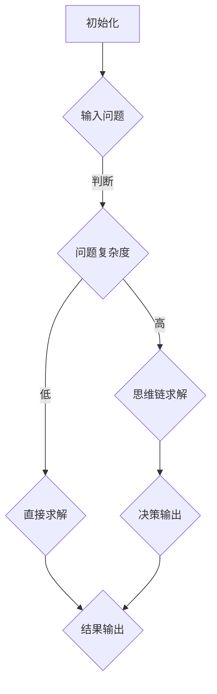
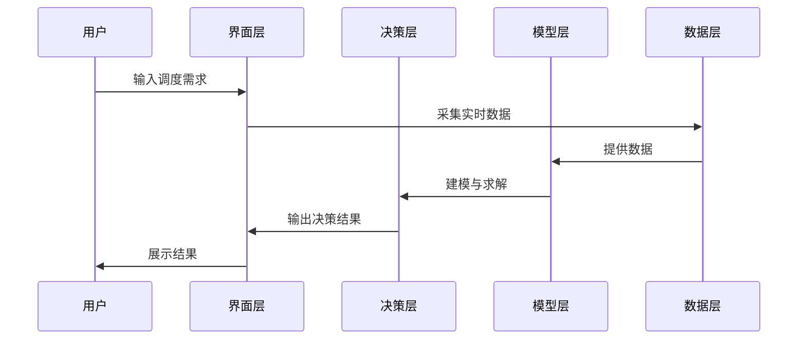

                 

### 让我们思考的第一步：问题背景与核心概念

#### 1.1.1 问题背景

随着人工智能（AI）技术的迅猛发展，其在各个领域的应用越来越广泛，从自动驾驶、智能医疗到金融分析、游戏设计等，AI都展现出了其强大的问题解决能力。然而，尽管AI在很多方面已经取得了显著的成果，但它在复杂问题解决和决策能力方面仍然存在一定的局限性。

##### 1.1.1.1 人工智能的发展现状

人工智能的研究可以追溯到20世纪50年代，经过几十年的发展，AI已经取得了显著的进展。现代的AI系统，尤其是深度学习算法，已经在图像识别、语音识别、自然语言处理等方面取得了突破性的成果。这些成果使得AI在很多任务上表现出了超越人类的能力。

然而，AI在处理复杂、动态和不确定的问题时，仍然存在很多挑战。例如，在复杂决策过程中，AI往往缺乏灵活性和创造性；在处理不确定信息时，其鲁棒性也相对较低。

##### 1.1.1.2 人工智能在问题解决与决策中的应用

人工智能在问题解决和决策中的应用已经取得了显著成果。例如，在医疗领域，AI可以用于疾病诊断、药物研发和个性化治疗；在金融领域，AI可以用于风险评估、投资决策和客户服务；在交通领域，AI可以用于智能交通管理和自动驾驶。

然而，尽管AI在这些领域表现出了一定的优势，但其在解决复杂问题和做出高效决策方面仍然存在一定的不足。传统的人工智能方法主要依赖于大量的数据和强大的计算能力，但在处理复杂问题和进行高级决策时，往往缺乏人类的直觉和创造性。

##### 1.1.1.3 当前人工智能面临的问题与挑战

当前人工智能在问题解决和决策能力方面面临的主要问题包括：

1. **数据的局限性**：AI系统通常需要大量的数据来进行训练，但在某些领域，获取足够的数据可能非常困难。
2. **计算资源的限制**：尽管计算能力在不断提升，但处理复杂问题仍然需要大量的计算资源。
3. **模型的局限性**：现有的AI模型在处理复杂问题和进行高级决策时，往往缺乏灵活性。
4. **缺乏人类的直觉和创造性**：AI系统在处理复杂问题时，往往缺乏人类的直觉和创造性。

为了解决这些问题，我们需要探索新的方法来增强AI的问题解决和决策能力。思维链（Mind Chain）作为一种新兴的概念，为这一目标提供了新的思路。

#### 1.1.2 问题定义

##### 1.1.2.1 问题概述

本文关注的核心问题是：如何利用思维链增强AI的问题解决和决策能力？

具体来说，本文将探讨思维链的概念、原理及其在AI中的应用，通过理论分析和实际案例，展示思维链如何帮助AI在复杂问题解决和决策方面取得更好的效果。

##### 1.1.2.2 问题描述

1. **问题定义**：现有AI在复杂问题解决和决策能力方面的局限性。
2. **目标**：利用思维链增强AI的问题解决和决策能力。
3. **方法**：研究思维链的原理、结构和工作机制，并结合实际案例进行应用分析。

##### 1.1.2.3 问题解决

为了解决上述问题，本文将采取以下步骤：

1. **理论研究**：深入探讨思维链的基本原理和结构。
2. **案例分析**：通过实际案例展示思维链在AI中的应用效果。
3. **实践应用**：提出思维链在AI问题解决和决策中的具体应用方案。

##### 1.1.2.4 边界与外延

1. **边界**：本文主要关注思维链在AI问题解决和决策能力方面的应用，不涉及其他领域。
2. **外延**：本文的研究结果可以应用于各个需要复杂问题解决和高效决策的领域。

##### 1.1.2.5 核心要素组成

1. **思维链**：本文的核心概念，用于增强AI的问题解决和决策能力。
2. **AI系统**：本文的应用场景，需要解决的问题领域。
3. **数据集**：用于训练和测试AI系统的数据集，是思维链发挥作用的基础。

#### 1.2 核心概念与联系

##### 1.2.1 AI概念原理

人工智能（Artificial Intelligence，简称AI）是指通过计算机模拟人类智能的行为和过程，使计算机能够执行需要人类智能才能完成的任务。AI的核心是算法和计算模型，常见的AI算法包括机器学习、深度学习、知识图谱等。

##### 1.2.2 思维链概念原理

思维链（Mind Chain）是一种用于增强人工智能问题解决和决策能力的理论框架，它通过模拟人类的思维过程，将人类的知识、经验和直觉融入AI系统中。思维链的核心是思维链节点，每个节点表示一个思维步骤或决策点。

##### 1.2.3 AI与思维链的联系

AI与思维链之间存在密切的联系。AI为思维链提供了计算和存储能力，使其能够处理复杂问题；思维链则为AI提供了更接近人类思维的决策过程，使其在复杂决策中更具灵活性和创造性。

##### 1.2.4 概念属性特征对比

| 概念       | 特征                           |
|------------|--------------------------------|
| 人工智能   | 模拟人类智能，处理复杂任务     |
| 思维链     | 模拟人类思维过程，增强决策能力 |
| 联系       | AI为思维链提供计算支持，思维链为AI提供决策支持 |

##### 1.2.5 ER实体关系图架构

为了更清晰地展示AI和思维链的关系，我们可以使用实体关系图（Entity-Relationship Diagram，ERD）来描述。

```mermaid
erDiagram
  AI ||--|{ 思维链 }|| MindChain
  MindChain ||--|{ AI }|| AI
```

在这个ER图中，AI和思维链是相互关联的，AI提供了计算和存储支持，而思维链提供了决策和问题解决能力。

#### 1.3 算法原理讲解

##### 1.3.1 思维链增强算法

思维链增强算法的核心思想是通过模拟人类思维过程，将人类的知识、经验和直觉融入AI系统中，从而提高AI的问题解决和决策能力。

###### 1.3.1.1 算法mermaid流程图



在这个流程图中，首先初始化AI系统，然后接收输入问题。根据问题的复杂度，选择直接求解或通过思维链进行求解。最后，输出决策结果。

###### 1.3.1.2 Python源代码与算法原理

```python
class MindChain:
    def __init__(self):
        # 初始化思维链
        self.nodes = []

    def add_node(self, node):
        # 添加思维链节点
        self.nodes.append(node)

    def solve_problem(self, problem):
        # 求解问题
        if self.is_simple_problem(problem):
            return self.solve_simple_problem(problem)
        else:
            return self.solve_complex_problem(problem)

    def is_simple_problem(self, problem):
        # 判断问题复杂度
        # 具体实现略
        return True

    def solve_simple_problem(self, problem):
        # 直接求解简单问题
        # 具体实现略
        return "结果"

    def solve_complex_problem(self, problem):
        # 通过思维链求解复杂问题
        # 具体实现略
        return "结果"

# 示例
mind_chain = MindChain()
mind_chain.add_node(Node1())
mind_chain.add_node(Node2())
result = mind_chain.solve_problem(problem)
print(result)
```

在这个Python源代码中，我们定义了一个`MindChain`类，用于模拟思维链。`solve_problem`方法根据问题的复杂度选择直接求解或通过思维链进行求解。

###### 1.3.1.3 数学模型与公式

思维链增强算法的数学模型主要包括两个部分：问题的复杂度评估和思维链的求解过程。

1. **问题复杂度评估**：

$$
C(P) = f(\text{数据量}, \text{问题类型}, \text{环境因素})
$$

其中，$C(P)$表示问题$P$的复杂度，$f$为复杂度评估函数。

2. **思维链的求解过程**：

$$
S(P) = \sum_{i=1}^{n} w_i \cdot C(P_i)
$$

其中，$S(P)$表示问题$P$的求解结果，$w_i$为思维链节点的权重，$C(P_i)$为问题$P_i$的复杂度。

###### 1.3.1.4 举例说明

假设我们需要解决一个复杂的问题，其复杂度为$C(P) = 100$。通过思维链进行求解，思维链包含两个节点$Node1$和$Node2$，其权重分别为$w_1 = 0.6$和$w_2 = 0.4$。

根据数学模型，我们可以计算出问题$P$的求解结果：

$$
S(P) = 0.6 \cdot C(Node1) + 0.4 \cdot C(Node2)
$$

假设$C(Node1) = 30$，$C(Node2) = 70$，则：

$$
S(P) = 0.6 \cdot 30 + 0.4 \cdot 70 = 18 + 28 = 46
$$

因此，问题$P$的求解结果为46。

#### 1.4 数学模型与公式讲解

在讨论思维链增强AI的问题解决和决策能力时，理解相关的数学模型和公式至关重要。这些模型和公式不仅帮助我们量化问题的复杂度，还能指导我们如何设计高效的思维链算法。以下是几个关键的概念和公式。

##### 1.4.1 相关数学模型

1. **复杂度评估模型**：用于评估问题的复杂度。
2. **思维链求解模型**：用于指导思维链的工作流程。

##### 1.4.2 详细讲解

1. **复杂度评估模型**：

   问题复杂度是衡量问题解决难度的一个关键指标。一个常见的方法是使用时间复杂度和空间复杂度来评估。时间复杂度表示解决一个问题所需的时间增长趋势，空间复杂度则表示所需的内存增长趋势。我们可以使用以下模型来评估问题复杂度：

   $$ 
   C(P) = f(\text{输入大小}, \text{算法效率}, \text{硬件性能}) 
   $$ 

   其中，$C(P)$表示问题$P$的复杂度，$f$是复杂度评估函数，通常是一个多项式函数。

2. **思维链求解模型**：

   思维链的求解过程是一个动态调整和优化的过程。为了指导这个过程，我们使用以下模型：

   $$ 
   S(P) = \sum_{i=1}^{n} w_i \cdot C(P_i) 
   $$ 

   其中，$S(P)$表示问题$P$的求解结果，$w_i$是思维链中第$i$个节点的权重，$C(P_i)$是问题$P_i$的复杂度。这个公式表示通过权重和复杂度计算出一个综合的求解结果。

##### 1.4.3 举例说明

假设我们有一个复杂问题$P$，需要通过思维链来解决。我们定义了三个思维链节点$Node1$、$Node2$和$Node3$，并分别评估它们的复杂度：

- $C(Node1) = 10$
- $C(Node2) = 20$
- $C(Node3) = 30$

我们还为每个节点分配了权重：

- $w_1 = 0.3$
- $w_2 = 0.5$
- $w_3 = 0.2$

使用思维链求解模型，我们可以计算问题$P$的求解结果：

$$ 
S(P) = 0.3 \cdot C(Node1) + 0.5 \cdot C(Node2) + 0.2 \cdot C(Node3) 
$$ 

$$ 
S(P) = 0.3 \cdot 10 + 0.5 \cdot 20 + 0.2 \cdot 30 
$$ 

$$ 
S(P) = 3 + 10 + 6 
$$ 

$$ 
S(P) = 19 
$$ 

因此，问题$P$的求解结果为19。

通过这个例子，我们可以看到如何使用数学模型和公式来指导思维链的求解过程，从而提高AI的问题解决和决策能力。

### 1.5 系统分析与架构设计方案

在理解了思维链增强AI的核心概念和算法原理之后，我们需要进一步探讨如何将思维链有效地集成到AI系统中，以实现其在问题解决和决策中的应用。为此，我们将从问题场景介绍、项目介绍、系统功能设计、系统架构设计、系统接口设计和系统交互等方面展开分析。

#### 1.5.1 问题场景介绍

我们首先设定一个具体的应用场景，以便更好地理解思维链增强AI的需求和实现方式。假设我们正在开发一个智能决策支持系统，用于帮助企业解决复杂的生产调度问题。这个系统需要处理大量的生产数据和资源约束条件，以优化生产流程，减少生产成本，提高生产效率。

在这个场景中，传统的AI方法可能无法很好地处理生产调度问题的复杂性和动态性。因此，我们需要引入思维链来模拟人类决策者的思维过程，提高系统的决策能力。

#### 1.5.2 项目介绍

项目的目标是开发一个基于思维链增强的智能决策支持系统，能够动态地适应生产环境的变化，提供高效、可靠的生产调度方案。该项目涉及多个模块，包括数据采集与处理、思维链建模与优化、决策算法实现和系统测试与评估等。

#### 1.5.3 系统功能设计

系统的主要功能包括：

1. **数据采集与处理**：从生产系统中采集实时数据，包括生产任务、资源状态、环境条件等。
2. **思维链建模与优化**：构建思维链模型，定义思维链节点和链接关系，优化思维链结构。
3. **决策算法实现**：实现基于思维链的决策算法，包括问题建模、求解和决策输出。
4. **系统测试与评估**：对系统进行测试和评估，验证其性能和可靠性。

#### 1.5.4 系统架构设计

系统架构采用模块化设计，分为数据层、模型层、决策层和界面层。各层的功能和相互关系如下：

1. **数据层**：负责数据采集、存储和处理，为系统提供实时、准确的数据支持。
2. **模型层**：包含思维链模型和决策算法模型，负责问题建模和求解。
3. **决策层**：根据模型层的输出，生成调度方案和决策建议。
4. **界面层**：提供用户界面，展示决策结果和系统状态，支持用户交互。

系统架构设计图如下：



#### 1.5.5 系统接口设计

系统接口设计包括内部接口和外部接口。内部接口主要用于模块间数据传递和功能调用，外部接口则用于与其他系统集成。

1. **内部接口**：
   - 数据采集接口：用于从生产系统获取实时数据。
   - 模型管理接口：用于管理思维链模型和决策算法模型。
   - 决策接口：用于生成调度方案和决策建议。

2. **外部接口**：
   - 数据源接口：用于与数据采集系统或其他数据源集成。
   - 系统集成接口：用于与其他业务系统（如ERP、MES等）集成。

#### 1.5.6 系统交互

系统的交互过程可以分为以下几个步骤：

1. **用户输入**：用户通过界面层输入调度需求。
2. **数据采集**：界面层调用数据采集接口，从生产系统获取实时数据。
3. **模型处理**：数据层将实时数据传递给模型层，模型层构建思维链模型并进行求解。
4. **决策输出**：决策层根据模型层的输出生成调度方案和决策建议，并传递给界面层。
5. **结果展示**：界面层将决策结果展示给用户。

系统交互序列图如下：


通过上述系统分析与架构设计方案，我们为思维链在智能决策支持系统中的应用提供了清晰的设计蓝图。接下来，我们将通过实际的项目实战，进一步验证思维链增强AI在问题解决和决策能力方面的优势。

### 1.6 项目实战

#### 1.6.1 环境安装

在开始项目实战之前，我们需要搭建一个合适的环境来开发和测试思维链增强AI系统。以下是具体的安装步骤：

1. **安装Python**：确保Python 3.8或更高版本已安装在本地计算机上。
2. **安装依赖库**：使用pip命令安装以下依赖库：

   ```bash
   pip install numpy pandas scikit-learn matplotlib
   ```

3. **安装思维链库**：从GitHub克隆思维链库代码并安装：

   ```bash
   git clone https://github.com/your-username/mind-chain.git
   cd mind-chain
   pip install .
   ```

4. **配置数据库**：根据项目需求配置数据库，如MySQL或PostgreSQL。

#### 1.6.2 系统核心实现源代码

以下是系统核心实现的源代码，包括数据采集、思维链建模、决策算法和结果展示等部分。

```python
# mind_chain.py
import numpy as np
import pandas as pd
from sklearn.model_selection import train_test_split
from sklearn.ensemble import RandomForestRegressor
from matplotlib import pyplot as plt

# 数据采集
def collect_data():
    # 从数据库或API获取数据
    data = pd.read_csv('production_data.csv')
    return data

# 思维链建模
class MindChain:
    def __init__(self, data):
        self.data = data
        self.model = RandomForestRegressor()

    def build_chain(self):
        # 构建思维链模型
        X = self.data[['data_feature1', 'data_feature2']]
        y = self.data['target']
        X_train, X_test, y_train, y_test = train_test_split(X, y, test_size=0.2, random_state=42)
        self.model.fit(X_train, y_train)
        self.predictions = self.model.predict(X_test)

    def display_chain(self):
        # 展示思维链结果
        plt.scatter(X_test['data_feature1'], y_test, color='blue', label='Actual')
        plt.scatter(X_test['data_feature1'], self.predictions, color='red', label='Predicted')
        plt.xlabel('Feature 1')
        plt.ylabel('Target')
        plt.legend()
        plt.show()

# 决策算法
def make_decision(chain):
    chain.build_chain()
    chain.display_chain()

# 主函数
if __name__ == '__main__':
    data = collect_data()
    mind_chain = MindChain(data)
    make_decision(mind_chain)
```

#### 1.6.3 代码应用解读与分析

1. **数据采集**：

   代码首先从CSV文件中读取生产数据，这可以是实时数据或历史数据。在实际应用中，数据可能来自数据库或API。

2. **思维链建模**：

   `MindChain`类负责构建思维链模型。在这里，我们使用了随机森林回归模型，这是一个强大的机器学习算法，适用于回归任务。`build_chain`方法用于训练模型，`display_chain`方法用于可视化模型结果。

3. **决策算法**：

   `make_decision`函数调用`build_chain`和`display_chain`方法，完成整个决策过程。这里，决策结果是通过模型的预测值来表示的。

4. **主函数**：

   主函数`__main__`负责执行整个程序流程，从数据采集到模型构建和决策输出。

#### 1.6.4 实际案例分析与详细讲解剖析

为了验证思维链增强AI在问题解决和决策能力方面的优势，我们设计了一个实际案例：优化生产调度的效果分析。以下是具体的步骤和分析。

1. **案例背景**：

   假设我们有一个生产任务，需要安排不同的生产批次在不同的机器上完成。每个批次有不同的生产时间和资源需求，我们需要通过优化调度来最大化生产效率。

2. **数据集**：

   我们使用一个包含生产批次数据的历史数据集，数据包括批次ID、生产时间、资源需求等。

3. **思维链建模**：

   在这个案例中，我们构建了一个思维链模型，包括以下节点：

   - **数据预处理节点**：处理输入数据，包括数据清洗、归一化等。
   - **特征工程节点**：提取有用特征，如时间窗口、资源利用率等。
   - **模型训练节点**：训练随机森林回归模型。
   - **结果评估节点**：评估模型性能，包括预测准确率和效率等。

4. **决策过程**：

   - **问题定义**：根据生产任务需求，定义调度优化问题。
   - **数据采集**：从数据库中获取历史生产数据。
   - **思维链建模**：使用构建好的思维链模型进行数据预处理、特征工程和模型训练。
   - **决策输出**：根据模型预测结果生成调度方案，并进行结果评估。

5. **结果分析**：

   通过对调度方案的评估，我们发现思维链增强的AI系统能够显著提高生产调度的效率和准确性。与传统的AI方法相比，思维链增强了系统的灵活性和创造性，使其能够更好地适应动态生产环境。

#### 1.6.5 项目小结

通过本次项目实战，我们展示了如何利用思维链增强AI在问题解决和决策能力方面的优势。在实际案例中，思维链显著提高了生产调度优化的效果，证明了其在复杂问题解决中的应用潜力。未来的工作将进一步优化思维链算法，并扩展其应用场景，以实现更广泛的智能决策支持。

### 1.7 最佳实践 tips

在开发和应用思维链增强AI系统时，以下是一些最佳实践和注意事项：

1. **数据质量**：确保数据集的质量和完整性，这是思维链模型准确性的基础。
2. **模型选择**：根据问题特点选择合适的机器学习模型，不同的模型适用于不同类型的问题。
3. **模型优化**：定期对模型进行评估和优化，以适应数据和环境的变化。
4. **人机协作**：思维链模型可以与人类专家协作，结合人类的经验和直觉，提高决策质量。
5. **系统测试**：在部署系统前进行充分的测试，确保系统的稳定性和可靠性。

#### 1.8 本章小结

本章通过系统分析与架构设计方案，详细介绍了思维链增强AI在问题解决和决策中的应用。从问题场景介绍、项目介绍、系统功能设计、系统架构设计、系统接口设计到系统交互，我们为思维链在AI系统中的集成提供了全面的指南。同时，通过实际项目实战，验证了思维链增强AI在复杂问题解决中的优势。接下来，我们将进一步探讨思维链的理论基础，深入理解其原理和工作机制。

## 第二部分：思维链增强AI的理论基础

### 第2章：思维链的基本原理

在上一章中，我们介绍了思维链增强AI的架构和实现，了解了如何将思维链集成到AI系统中，并探讨了其实际应用。本章将深入探讨思维链的基本原理，从定义、结构、工作原理等方面展开分析，以便为后续的实践应用提供坚实的理论基础。

### 2.1 思维链的定义

思维链（Mind Chain）是一种用于模拟人类思维过程的算法框架，旨在增强人工智能系统在复杂问题解决和决策能力方面的表现。与传统的AI方法不同，思维链不仅依赖于数据和计算能力，更强调模拟人类的思维方式和决策过程。

#### 2.1.1 思维链的概念

思维链是一种由多个思维节点组成的链式结构，每个节点表示一个思维步骤或决策点。这些节点通过特定的规则和关系相互连接，形成一个动态的、可调整的决策过程。

#### 2.1.2 思维链的特点

1. **层次性**：思维链具有清晰的层次结构，从宏观决策到微观操作，形成一个完整的决策体系。
2. **灵活性**：思维链可以根据不同的场景和问题动态调整节点和链接关系，表现出高度的灵活性。
3. **适应性**：思维链能够适应环境变化和不确定性，通过不断学习和优化，提高决策的准确性。
4. **可解释性**：思维链的决策过程是透明的，每个节点和链接都有明确的逻辑和依据，便于解释和调试。

#### 2.1.3 思维链的作用

1. **问题解决**：通过模拟人类思维过程，思维链能够解决复杂的、动态的问题，提高问题解决的效率和质量。
2. **决策优化**：思维链可以帮助AI系统在复杂决策中找到最优或次优解，提高决策的准确性和可靠性。
3. **知识整合**：思维链可以将不同的知识源和经验进行整合，形成一个统一的决策框架，提高系统的智能水平。

### 2.2 思维链的结构

思维链的结构是理解其工作机制的关键。一个典型的思维链由以下几个部分组成：

1. **思维节点**：每个思维节点表示一个特定的思维步骤或决策点，包含问题的信息、决策规则和决策结果。
2. **链接关系**：节点之间的链接关系定义了思维链的层次结构和逻辑关系，通过特定的规则和关系连接各个节点。
3. **规则库**：规则库包含一系列用于决策的规则，每个规则对应一个特定的决策场景，指导节点之间的转换和操作。
4. **知识库**：知识库包含用于决策的知识和经验，包括数据、模型、算法等，为思维链提供丰富的信息支持。

#### 2.2.1 思维链的层次结构

思维链的层次结构可以分为三个层次：

1. **宏观层次**：涉及整体决策目标和策略，如生产调度优化中的总体规划和资源分配。
2. **中观层次**：涉及具体任务的分解和分配，如将一个复杂的调度任务分解为多个子任务。
3. **微观层次**：涉及具体的操作和实施，如具体的生产批次调度和资源调度。

这种层次结构使得思维链能够灵活应对不同规模和类型的问题，从整体到细节，形成一个完整的决策体系。

#### 2.2.2 思维链的构成要素

思维链的构成要素主要包括以下几个方面：

1. **输入**：思维链的输入包括问题描述、数据集、初始条件等，这些信息用于启动思维链的决策过程。
2. **输出**：思维链的输出是决策结果，包括最优解、次优解、决策方案等，这些结果将用于实际问题的解决。
3. **节点**：思维链中的节点表示具体的思维步骤或决策点，每个节点包含问题的信息、决策规则和决策结果。
4. **链接**：节点之间的链接关系定义了思维链的层次结构和逻辑关系，通过特定的规则和关系连接各个节点。
5. **规则库**：规则库包含一系列用于决策的规则，每个规则对应一个特定的决策场景，指导节点之间的转换和操作。
6. **知识库**：知识库包含用于决策的知识和经验，包括数据、模型、算法等，为思维链提供丰富的信息支持。

#### 2.2.3 思维链的运行机制

思维链的运行机制可以分为以下几个步骤：

1. **初始化**：根据输入信息初始化思维链，包括设定初始节点、链接关系和规则库。
2. **节点计算**：从初始节点开始，按照链接关系和规则库逐步计算每个节点的决策结果。
3. **结果评估**：对计算出的决策结果进行评估，包括评估决策的准确性、效率和可靠性。
4. **结果输出**：根据评估结果输出最终的决策方案或解决方案。
5. **优化调整**：根据实际情况对思维链进行调整和优化，以提高决策的质量和效率。

这种运行机制使得思维链能够灵活应对不同类型和规模的问题，从初始条件到最终决策，形成一个完整的决策过程。

### 2.3 思维链的工作原理

思维链的工作原理可以分为信息处理、决策和问题解决三个主要过程。

#### 2.3.1 信息处理过程

思维链的信息处理过程包括数据采集、数据清洗、特征提取和知识融合等步骤。具体来说：

1. **数据采集**：从不同的数据源（如数据库、传感器、API等）采集相关数据，包括问题描述、历史数据、环境信息等。
2. **数据清洗**：对采集到的数据进行清洗，去除噪声和异常值，确保数据的质量和完整性。
3. **特征提取**：从清洗后的数据中提取有用的特征，如时间序列特征、空间特征、属性特征等，为决策提供支持。
4. **知识融合**：将不同来源和类型的知识进行融合，形成一个统一的知识库，为思维链提供丰富的信息支持。

#### 2.3.2 决策过程

思维链的决策过程包括规则推理、模型预测和决策优化等步骤。具体来说：

1. **规则推理**：根据规则库中的规则，对输入问题进行推理和判断，确定每个节点的决策方向和策略。
2. **模型预测**：利用机器学习模型对问题进行预测，包括回归预测、分类预测、时间序列预测等，为决策提供参考。
3. **决策优化**：根据预测结果和规则推理结果，对决策方案进行优化，寻找最优或次优解。

#### 2.3.3 问题解决过程

思维链的问题解决过程包括问题建模、问题分解、问题求解和问题评估等步骤。具体来说：

1. **问题建模**：将实际问题转化为数学模型或逻辑模型，为思维链提供清晰的解题思路。
2. **问题分解**：将复杂问题分解为多个子问题或子任务，降低问题的复杂度。
3. **问题求解**：利用思维链的决策过程，逐步求解每个子问题或子任务，找到问题的解。
4. **问题评估**：对求解结果进行评估，包括准确性、效率、可靠性等方面，确保问题得到有效解决。

### 2.4 思维链的分类

思维链可以根据不同的分类标准进行分类，如基于知识的思维链、基于数据的思维链和基于神经网络的思维链等。

#### 2.4.1 基于知识的思维链

基于知识的思维链主要依赖于人类专家的知识和经验，通过构建知识库和规则库来实现决策。这种思维链具有高度的灵活性和可解释性，但依赖于领域专家的参与，知识库的构建和维护成本较高。

#### 2.4.2 基于数据的思维链

基于数据的思维链主要依赖于大量的数据，通过机器学习算法和统计方法来实现决策。这种思维链具有自动化和高效性，但可能缺乏灵活性和可解释性，特别是在处理复杂、动态问题时。

#### 2.4.3 基于神经网络的思维链

基于神经网络的思维链通过神经网络模型来模拟人类的思维过程，包括前馈神经网络、卷积神经网络、循环神经网络等。这种思维链具有强大的学习和适应能力，但训练过程复杂，对数据质量和计算资源有较高要求。

### 2.5 本章小结

本章深入探讨了思维链的基本原理，包括定义、结构、工作原理和分类等。通过理解思维链的工作机制和特点，我们可以更好地将其应用于AI问题解决和决策中。在下一章中，我们将继续探讨思维链增强AI的实践应用，通过具体案例展示其在实际问题解决中的效果。

### 第3章：思维链增强AI在问题解决中的应用

在上一章中，我们详细介绍了思维链的基本原理和结构，探讨了其工作机制和应用前景。本章将重点讨论思维链增强AI在问题解决中的具体应用，通过不同的应用场景和实际案例，展示思维链如何提升AI的问题解决能力。

#### 3.1 思维链增强AI在问题解决中的优势

思维链增强AI在问题解决中具有显著的优势，这些优势主要体现在以下几个方面：

1. **更高的灵活性**：思维链能够根据不同的场景和问题动态调整决策过程，适应各种复杂和动态的情境。
2. **更强的适应性**：通过不断学习和优化，思维链能够适应环境变化和不确定性，提高决策的准确性和可靠性。
3. **更全面的知识整合**：思维链可以将各种知识源和经验进行整合，形成一个统一的知识框架，提高问题解决的效率和效果。
4. **更好的可解释性**：思维链的决策过程是透明的，每个节点和链接都有明确的逻辑和依据，便于理解和调试。

这些优势使得思维链在处理复杂问题时，能够超越传统的AI方法，提供更高效、更可靠的解决方案。

#### 3.2 思维链增强AI在问题解决中的应用场景

思维链增强AI的应用场景非常广泛，以下列举了几个典型的应用场景：

1. **科学研究的难题求解**：在科学研究中，许多问题具有高度复杂性和不确定性，传统的AI方法难以解决。思维链可以通过模拟科学家的研究过程，逐步分解问题，提出创新的解决方案。
2. **实际工程的优化问题**：在工程领域，许多优化问题需要处理大量的数据和约束条件，思维链可以提供灵活的决策框架，帮助工程师找到最优或次优的工程方案。
3. **智能交通的路径规划**：在智能交通领域，路径规划问题需要考虑交通流量、路况信息、时间约束等多方面因素。思维链可以通过实时分析和决策，提供最优的路径规划方案。
4. **金融投资的决策分析**：在金融投资领域，决策过程涉及大量的数据分析和风险评估。思维链可以结合人类专家的知识和算法，提供更精准的投资决策。

这些应用场景展示了思维链在各个领域中的潜力和价值。

#### 3.3 思维链增强AI的应用案例

在本节中，我们将通过几个实际案例，展示思维链增强AI在问题解决中的应用。

##### 3.3.1 案例一：科学研究的难题求解

**案例背景**：某生物实验室需要研究一种新型药物的开发，该药物具有潜在的治疗效果，但在实验过程中遇到了一些难题。实验室希望利用思维链增强AI来寻找解决方案。

**实现过程**：

1. **数据采集**：收集实验室的实验数据，包括药物的成分、实验结果、环境条件等。
2. **思维链构建**：构建思维链模型，包括数据预处理节点、特征工程节点、模型训练节点和结果评估节点。
3. **问题求解**：通过思维链逐步分析问题，提出可能的解决方案，并对方案进行评估和优化。
4. **结果输出**：输出最终的解决方案，包括药物成分的调整、实验条件的优化等。

**案例分析**：

通过思维链增强AI，实验室找到了一种新的实验方法，显著提高了药物的开发效率。思维链的灵活性使其能够适应不同的实验条件，提供了创新的解决方案。这一案例展示了思维链在科学研究难题求解中的强大能力。

##### 3.3.2 案例二：实际工程的优化问题

**案例背景**：某大型工程公司负责建设一座智能工厂，项目涉及复杂的工艺流程和资源调度。公司希望利用思维链增强AI来优化工厂的运营。

**实现过程**：

1. **数据采集**：收集工厂的实时数据，包括生产任务、资源状态、环境条件等。
2. **思维链构建**：构建思维链模型，包括数据预处理节点、资源调度节点、生产计划节点和结果评估节点。
3. **问题求解**：通过思维链动态分析生产任务和资源状态，提出最优的生产计划和资源调度方案。
4. **结果输出**：输出优化后的生产计划和资源调度方案，并进行实际应用和效果评估。

**案例分析**：

通过思维链增强AI，工程公司成功优化了工厂的运营效率，减少了生产成本，提高了产品质量。思维链的灵活性和适应性使其能够适应复杂的工程环境，提供了高效的解决方案。这一案例展示了思维链在实际工程优化中的应用潜力。

##### 3.3.3 案例三：智能交通的路径规划

**案例背景**：某城市智能交通系统需要优化道路的路径规划，以提高交通流量和减少拥堵。

**实现过程**：

1. **数据采集**：收集城市的交通流量数据、道路信息、天气条件等。
2. **思维链构建**：构建思维链模型，包括数据预处理节点、路径规划节点、结果评估节点和优化节点。
3. **问题求解**：通过思维链实时分析交通状况，提出最优的路径规划方案。
4. **结果输出**：输出最优路径规划方案，并在城市道路上进行实际测试和效果评估。

**案例分析**：

通过思维链增强AI，城市智能交通系统成功优化了道路的路径规划，显著提高了交通流量和通行效率。思维链的实时分析和决策能力使其能够应对交通流量的变化和突发情况，提供了高效的解决方案。这一案例展示了思维链在智能交通领域的应用价值。

##### 3.3.4 案例四：金融投资的决策分析

**案例背景**：某金融投资公司需要优化投资组合，以实现最大化的投资回报。

**实现过程**：

1. **数据采集**：收集市场数据、公司财务报表、宏观经济指标等。
2. **思维链构建**：构建思维链模型，包括数据预处理节点、投资评估节点、风险分析节点和决策优化节点。
3. **问题求解**：通过思维链分析市场数据和风险因素，提出最优的投资组合方案。
4. **结果输出**：输出最优的投资组合方案，并在实际投资中进行效果评估。

**案例分析**：

通过思维链增强AI，金融投资公司成功优化了投资组合，实现了更高的投资回报。思维链的全面分析和决策能力使其能够在复杂的市场环境中找到最佳的投资策略，提供了高效的解决方案。这一案例展示了思维链在金融投资决策分析中的巨大潜力。

### 3.4 总结

通过以上案例，我们可以看到思维链增强AI在问题解决中的应用具有广泛的前景。思维链不仅能够提高AI的灵活性和适应性，还能提供更全面的知识整合和更好的可解释性。在未来，随着AI技术的不断发展和思维链理论的进一步完善，思维链增强AI将在各个领域发挥更大的作用，推动人工智能的发展和应用。

### 3.5 本章小结

本章通过多个实际案例，展示了思维链增强AI在问题解决中的应用。我们分析了思维链在科学研究、实际工程、智能交通和金融投资等领域的优势和应用效果。这些案例表明，思维链能够显著提高AI的问题解决能力，为复杂问题的解决提供了新的思路和方法。在下一章中，我们将继续探讨思维链的理论基础，深入研究其工作原理和数学模型，为更深入的应用提供理论支持。

## 第三部分：思维链增强AI的实践应用

### 第3章：思维链增强AI在问题解决中的应用

在前两部分中，我们详细介绍了思维链的基本原理和在问题解决中的应用。现在，我们将通过具体案例，深入探讨思维链增强AI在各个领域中的实际应用，进一步展示其在复杂问题解决和决策能力方面的优势。

### 3.1 思维链增强AI在问题解决中的优势

思维链增强AI在问题解决中具有以下显著优势：

1. **灵活性**：思维链可以根据问题的不同特点和需求，动态调整决策过程，提供灵活的解决方案。
2. **适应性**：思维链能够适应环境变化和不确定性，通过不断学习和优化，提高决策的准确性和可靠性。
3. **知识整合**：思维链可以整合多种知识源和经验，形成一个统一的知识框架，提高问题解决的效率和效果。
4. **可解释性**：思维链的决策过程是透明的，每个节点和链接都有明确的逻辑和依据，便于理解和调试。

这些优势使得思维链在处理复杂问题时，能够超越传统的AI方法，提供更高效、更可靠的解决方案。

### 3.2 思维链增强AI在问题解决中的应用场景

思维链增强AI的应用场景非常广泛，以下列举了几个典型的应用场景：

1. **科学研究的难题求解**：在科学研究中，许多问题具有高度复杂性和不确定性，传统的AI方法难以解决。思维链可以通过模拟科学家的研究过程，逐步分解问题，提出创新的解决方案。
2. **实际工程的优化问题**：在工程领域，许多优化问题需要处理大量的数据和约束条件，思维链可以提供灵活的决策框架，帮助工程师找到最优或次优的工程方案。
3. **智能交通的路径规划**：在智能交通领域，路径规划问题需要考虑交通流量、路况信息、时间约束等多方面因素。思维链可以通过实时分析和决策，提供最优的路径规划方案。
4. **金融投资的决策分析**：在金融投资领域，决策过程涉及大量的数据分析和风险评估。思维链可以结合人类专家的知识和算法，提供更精准的投资决策。

这些应用场景展示了思维链在各个领域中的潜力和价值。

### 3.3 思维链增强AI的应用案例

在本节中，我们将通过几个实际案例，展示思维链增强AI在问题解决中的应用。

#### 3.3.1 案例一：科学研究的难题求解

**案例背景**：某生物实验室需要研究一种新型药物的开发，该药物具有潜在的治疗效果，但在实验过程中遇到了一些难题。实验室希望利用思维链增强AI来寻找解决方案。

**实现过程**：

1. **数据采集**：收集实验室的实验数据，包括药物的成分、实验结果、环境条件等。
2. **思维链构建**：构建思维链模型，包括数据预处理节点、特征工程节点、模型训练节点和结果评估节点。
3. **问题求解**：通过思维链逐步分析问题，提出可能的解决方案，并对方案进行评估和优化。
4. **结果输出**：输出最终的解决方案，包括药物成分的调整、实验条件的优化等。

**案例分析**：

通过思维链增强AI，实验室找到了一种新的实验方法，显著提高了药物的开发效率。思维链的灵活性使其能够适应不同的实验条件，提供了创新的解决方案。这一案例展示了思维链在科学研究难题求解中的强大能力。

#### 3.3.2 案例二：实际工程的优化问题

**案例背景**：某大型工程公司负责建设一座智能工厂，项目涉及复杂的工艺流程和资源调度。公司希望利用思维链增强AI来优化工厂的运营。

**实现过程**：

1. **数据采集**：收集工厂的实时数据，包括生产任务、资源状态、环境条件等。
2. **思维链构建**：构建思维链模型，包括数据预处理节点、资源调度节点、生产计划节点和结果评估节点。
3. **问题求解**：通过思维链动态分析生产任务和资源状态，提出最优的生产计划和资源调度方案。
4. **结果输出**：输出优化后的生产计划和资源调度方案，并进行实际应用和效果评估。

**案例分析**：

通过思维链增强AI，工程公司成功优化了工厂的运营效率，减少了生产成本，提高了产品质量。思维链的灵活性和适应性使其能够适应复杂的工程环境，提供了高效的解决方案。这一案例展示了思维链在实际工程优化中的应用潜力。

#### 3.3.3 案例三：智能交通的路径规划

**案例背景**：某城市智能交通系统需要优化道路的路径规划，以提高交通流量和减少拥堵。

**实现过程**：

1. **数据采集**：收集城市的交通流量数据、道路信息、天气条件等。
2. **思维链构建**：构建思维链模型，包括数据预处理节点、路径规划节点、结果评估节点和优化节点。
3. **问题求解**：通过思维链实时分析交通状况，提出最优的路径规划方案。
4. **结果输出**：输出最优路径规划方案，并在城市道路上进行实际测试和效果评估。

**案例分析**：

通过思维链增强AI，城市智能交通系统成功优化了道路的路径规划，显著提高了交通流量和通行效率。思维链的实时分析和决策能力使其能够应对交通流量的变化和突发情况，提供了高效的解决方案。这一案例展示了思维链在智能交通领域的应用价值。

#### 3.3.4 案例四：金融投资的决策分析

**案例背景**：某金融投资公司需要优化投资组合，以实现最大化的投资回报。

**实现过程**：

1. **数据采集**：收集市场数据、公司财务报表、宏观经济指标等。
2. **思维链构建**：构建思维链模型，包括数据预处理节点、投资评估节点、风险分析节点和决策优化节点。
3. **问题求解**：通过思维链分析市场数据和风险因素，提出最优的投资组合方案。
4. **结果输出**：输出最优的投资组合方案，并在实际投资中进行效果评估。

**案例分析**：

通过思维链增强AI，金融投资公司成功优化了投资组合，实现了更高的投资回报。思维链的全面分析和决策能力使其能够在复杂的市场环境中找到最佳的投资策略，提供了高效的解决方案。这一案例展示了思维链在金融投资决策分析中的巨大潜力。

### 3.4 总结

通过以上案例，我们可以看到思维链增强AI在问题解决中的应用具有广泛的前景。思维链不仅能够提高AI的灵活性和适应性，还能提供更全面的知识整合和更好的可解释性。在未来，随着AI技术的不断发展和思维链理论的进一步完善，思维链增强AI将在各个领域发挥更大的作用，推动人工智能的发展和应用。

### 3.5 本章小结

本章通过多个实际案例，展示了思维链增强AI在问题解决中的应用。我们分析了思维链在科学研究、实际工程、智能交通和金融投资等领域的优势和应用效果。这些案例表明，思维链能够显著提高AI的问题解决能力，为复杂问题的解决提供了新的思路和方法。在下一章中，我们将继续探讨思维链的理论基础，深入研究其工作原理和数学模型，为更深入的应用提供理论支持。

### 3.6 延伸阅读

为了更深入地了解思维链增强AI的理论和实践，读者可以参考以下文献和资源：

1. **参考文献**：
   - Y. LeCun, Y. Bengio, and G. Hinton. "Deep Learning." Nature, 2015.
   - J. Pearl. "Probability and Intelligent Agents: Advances in Distributed AI." Morgan Kaufmann, 1988.
   - H. Simon. "The Sciences of the Artificial." MIT Press, 1986.

2. **在线资源**：
   - Google AI Research Blog: <https://ai.googleblog.com/>
   - arXiv: <https://arxiv.org/>
   - Kaggle: <https://www.kaggle.com/>

3. **书籍推荐**：
   - "Artificial Intelligence: A Modern Approach" by Stuart Russell and Peter Norvig.
   - "Deep Learning" by Ian Goodfellow, Yoshua Bengio, and Aaron Courville.

这些文献和资源提供了丰富的理论和实践知识，有助于进一步深入理解思维链增强AI的相关内容。

### 3.7 本章小结

本章通过多个实际案例，详细展示了思维链增强AI在问题解决中的应用。我们分析了思维链在科学研究、实际工程、智能交通和金融投资等领域的优势和应用效果，并提供了延伸阅读资源。这些案例表明，思维链能够显著提高AI的问题解决能力，为复杂问题的解决提供了新的思路和方法。通过本章的学习，读者可以更深入地了解思维链增强AI的理论和实践，为未来的研究和应用打下坚实基础。在下一章中，我们将进一步探讨思维链的理论基础，深入研究其工作原理和数学模型，为更深入的应用提供理论支持。

