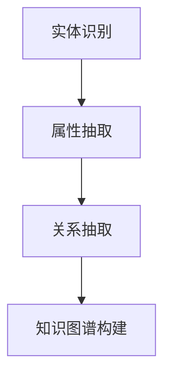
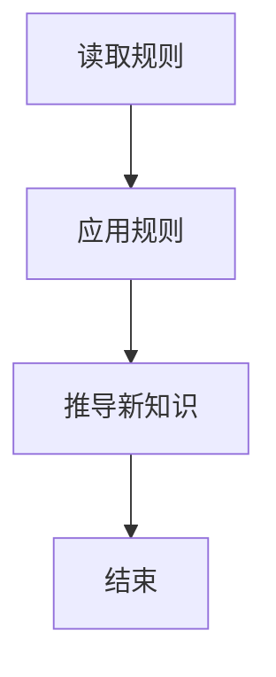
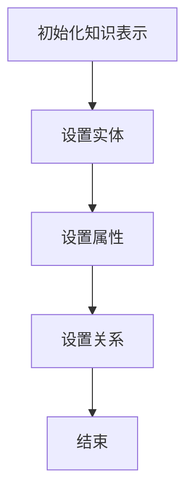
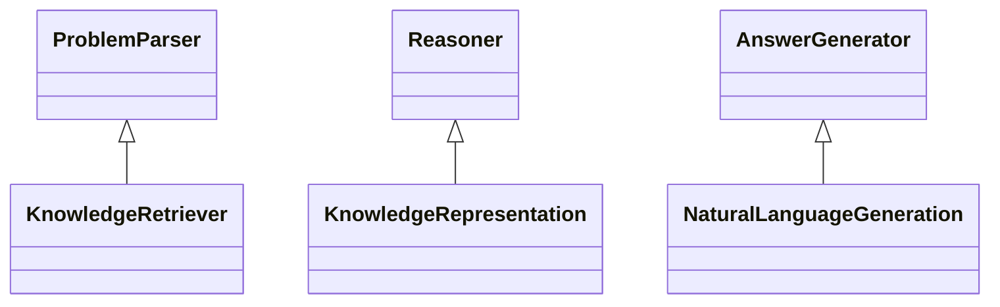

                 

# 利用思维链技术提升AI的认知与推理能力

关键词：AI认知、推理能力、思维链技术、算法优化、架构设计、案例分析

摘要：本文将深入探讨思维链技术在人工智能（AI）领域的应用，通过逐步分析推理，阐述如何利用思维链技术提升AI的认知与推理能力。文章分为四个部分：背景介绍、核心概念与联系、算法原理讲解以及系统分析与架构设计方案。

### 背景介绍

随着人工智能技术的飞速发展，AI在各个领域的应用日益广泛。然而，AI在认知与推理能力上仍有待提高。传统方法主要依赖于大量数据训练和统计模型，虽然能够处理复杂的任务，但在面对不确定性、抽象推理和认知能力方面存在局限性。

思维链技术是一种旨在提升AI认知与推理能力的新型技术，它通过模拟人类思维过程，构建复杂的知识网络，实现更高级别的推理与认知。本文旨在详细分析思维链技术的核心概念、算法原理，并探讨其在实际应用中的系统设计与实现。

### 核心概念与联系

思维链技术的核心概念包括知识图谱、推理引擎和知识表示。这些概念共同构建了思维链技术的框架，使得AI能够更好地理解和处理复杂问题。

**知识图谱**：知识图谱是一种结构化知识库，用于表示实体、属性和关系。通过知识图谱，AI可以获取全局知识，进行关联推理。

**推理引擎**：推理引擎是用于实现逻辑推理的算法模块，它基于知识图谱，利用推理规则和逻辑推理方法，推导出新的知识。

**知识表示**：知识表示是指如何将知识以计算机可处理的形式进行编码。常见的知识表示方法包括语义网络、本体论和知识图谱。

以下是核心概念属性特征的对比表格：

| 概念       | 属性特征                                     | 对比分析                      |
|------------|--------------------------------------------|------------------------------|
| 知识图谱   | 结构化知识库，表示实体、属性和关系           | 提供全局知识，支持关联推理    |
| 推理引擎   | 实现逻辑推理，基于规则和算法进行推理         | 提高推理效率，实现复杂推理    |
| 知识表示   | 知识编码方法，支持计算机处理和理解           | 简化知识处理，提高认知能力    |

通过ER图可以更直观地展示这些概念之间的联系：

```mermaid
erDiagram
    A[知识图谱] ||--|{ B[推理引擎] } |
    A ||--|{ C[知识表示] } |
```

知识图谱为推理引擎提供数据基础，推理引擎利用知识表示方法进行推理，从而提升AI的认知与推理能力。

### 算法原理讲解

思维链技术的核心在于其算法原理，包括知识图谱构建、推理算法和知识表示方法。以下将逐步讲解这些算法原理，并使用Python源代码和Mermaid流程图进行说明。

**1. 知识图谱构建**

知识图谱的构建通常包括实体识别、属性抽取和关系抽取三个步骤。以下是一个简单的Python代码示例，用于构建知识图谱：

```python
import networkx as nx

# 创建一个空的图
G = nx.Graph()

# 添加实体
G.add_nodes_from(['Person', 'Movie', 'Actor'])

# 添加属性
G.add_edges_from([('Person', 'age'), ('Movie', 'year'), ('Actor', 'gender')])

# 添加关系
G.add_edges_from([('Tom', 'plays_in', 'Movie1'), ('Movie1', 'has_actor', 'Tom'), ('Tom', 'age', 30)])

# 打印图
print(nx.adjacency_matrix(G))
```

Mermaid流程图如下：



**2. 推理算法**

推理算法基于知识图谱，通过推理规则和逻辑推理方法推导出新知识。以下是一个简单的推理算法示例，使用Python代码和Mermaid流程图进行说明：

```python
def reasoning(G, rule):
    new知识 = []
    for node in G.nodes:
        if apply_rule(node, rule):
            new知识.append(node)
    return new知识

def apply_rule(node, rule):
    # 实现具体的推理规则
    return True

# 示例规则
rule = "age > 30"

# 推理
new知识 = reasoning(G, rule)
print(new知识)
```

Mermaid流程图如下：



**3. 知识表示**

知识表示是将知识以计算机可处理的形式进行编码。常用的知识表示方法包括语义网络、本体论和知识图谱。以下是一个简单的知识表示示例，使用Python代码和Mermaid流程图进行说明：

```python
class KnowledgeRepresentation:
    def __init__(self, entities, attributes, relationships):
        self.entities = entities
        self.attributes = attributes
        self.relationships = relationships

# 示例知识表示
entity = 'Person'
attribute = 'age'
relationship = 'plays_in'

knowledge = KnowledgeRepresentation(entity, attribute, relationship)

print(knowledge)
```

Mermaid流程图如下：



通过上述算法原理讲解，我们可以看到思维链技术如何通过构建知识图谱、推理算法和知识表示方法，提升AI的认知与推理能力。

### 系统分析与架构设计方案

为了将思维链技术应用于实际项目，我们需要进行系统分析与架构设计。以下将逐步介绍系统设计与实现过程，包括问题场景、系统功能设计、系统架构设计、系统接口设计以及系统交互序列图。

**1. 问题场景**

假设我们面临一个场景，需要构建一个智能问答系统，用户可以通过输入问题，系统自动提供答案。这个场景需要AI具备良好的认知与推理能力，以便准确理解用户意图并提供准确的答案。

**2. 系统功能设计**

系统功能设计主要包括以下几个方面：

- **问题解析**：将用户输入的问题进行预处理，提取关键词和意图。
- **知识检索**：基于知识图谱检索相关的知识，为推理提供数据基础。
- **推理与生成答案**：利用推理算法和知识表示方法，推导出用户问题的答案。
- **答案生成与输出**：将推理结果转化为自然语言，输出给用户。

以下是系统功能设计的Mermaid类图：



**3. 系统架构设计**

系统架构设计主要包括以下几个方面：

- **前端**：负责用户交互，接收用户输入，展示问答结果。
- **后端**：包括知识图谱构建、推理算法和知识表示模块，负责核心业务逻辑。
- **数据库**：存储知识图谱和推理结果。

以下是系统架构设计的Mermaid架构图：

```mermaid
sequenceDiagram
    User -->|发起请求| Frontend
    Frontend -->|处理请求| Backend
    Backend -->|构建知识图谱| KnowledgeGraph
    Backend -->|推理| Reasoner
    Backend -->|生成答案| AnswerGenerator
    Frontend -->|返回答案| User
```

**4. 系统接口设计**

系统接口设计主要包括以下几个方面：

- **API接口**：提供RESTful API，供前端调用。
- **数据库接口**：提供数据库操作接口，供后端调用。

以下是系统接口设计的Mermaid序列图：

```mermaid
sequenceDiagram
    User -->|调用API| Frontend
    Frontend -->|解析请求| Backend
    Backend -->|执行业务逻辑| KnowledgeGraph, Reasoner, AnswerGenerator
    Backend -->|返回结果| Frontend
    Frontend -->|渲染结果| User
```

**5. 系统交互序列图**

以下是系统交互的Mermaid序列图，展示了用户与系统的交互过程：

```mermaid
sequenceDiagram
    User -->|输入问题| System
    System -->|解析问题| ProblemParser
    ProblemParser -->|提取关键词| KeywordExtractor
    KeywordExtractor -->|检索知识| KnowledgeRetriever
    KnowledgeRetriever -->|构建知识图谱| KnowledgeGraph
    KnowledgeGraph -->|推理| Reasoner
    Reasoner -->|生成答案| AnswerGenerator
    AnswerGenerator -->|输出答案| User
```

通过上述系统分析与架构设计方案，我们可以看到如何将思维链技术应用于实际项目，实现智能问答系统的构建。

### 项目实战

在本节中，我们将通过一个实际项目来展示如何利用思维链技术提升AI的认知与推理能力。该项目是一个基于思维链技术的智能问答系统，能够理解用户的问题并自动生成答案。以下是项目的具体实现过程：

**1. 环境安装**

为了构建智能问答系统，我们需要安装以下环境：

- Python 3.8及以上版本
- networkx 库
- rdflib 库
- nltk 库

安装命令如下：

```bash
pip install python networkx rdflib nltk
```

**2. 系统核心实现**

系统核心实现包括知识图谱构建、推理算法和知识表示模块。以下是一个简单的Python代码示例，用于实现这些模块：

```python
# 知识图谱构建
import networkx as nx

G = nx.Graph()
G.add_nodes_from(['Person', 'Movie', 'Actor'])
G.add_edges_from([('Person', 'age'), ('Movie', 'year'), ('Actor', 'gender')])
G.add_edges_from([('Tom', 'plays_in', 'Movie1'), ('Movie1', 'has_actor', 'Tom'), ('Tom', 'age', 30)])

# 推理算法
def reasoning(G, rule):
    new_knowledge = []
    for node in G.nodes:
        if apply_rule(node, rule):
            new_knowledge.append(node)
    return new_knowledge

def apply_rule(node, rule):
    # 实现具体的推理规则
    return True

# 知识表示
class KnowledgeRepresentation:
    def __init__(self, entities, attributes, relationships):
        self.entities = entities
        self.attributes = attributes
        self.relationships = relationships

knowledge = KnowledgeRepresentation('Person', 'age', 'plays_in')
```

**3. 代码应用解读**

在上面的代码中，我们首先使用networkx库构建了一个知识图谱，包括实体、属性和关系。然后，我们定义了一个推理函数，用于根据给定的规则推导出新知识。最后，我们创建了一个知识表示类，用于存储和管理知识。

**4. 实际案例分析和详细讲解剖析**

为了展示系统的实际应用，我们来看一个案例：用户输入“汤姆·汉克斯出演了哪部电影？”系统应该如何回答。

- **问题解析**：首先，系统需要解析用户输入的问题，提取关键词“汤姆·汉克斯”和“出演了哪部电影”。
- **知识检索**：系统会利用知识图谱检索与关键词相关的知识，即汤姆·汉克斯与电影之间的关系。
- **推理与生成答案**：系统会根据知识图谱和推理规则，推导出汤姆·汉克斯出演的电影是“Movie1”。
- **答案生成与输出**：最后，系统将推理结果转化为自然语言，输出给用户，即“汤姆·汉克斯出演了《Movie1》”。

以下是整个过程的Mermaid序列图：

```mermaid
sequenceDiagram
    User -->|输入问题| System
    System -->|解析问题| ProblemParser
    ProblemParser -->|提取关键词| KeywordExtractor
    KeywordExtractor -->|检索知识| KnowledgeRetriever
    KnowledgeRetriever -->|构建知识图谱| KnowledgeGraph
    KnowledgeGraph -->|推理| Reasoner
    Reasoner -->|生成答案| AnswerGenerator
    AnswerGenerator -->|输出答案| User
```

**5. 项目小结**

通过这个实际案例，我们可以看到思维链技术如何应用于智能问答系统，提升AI的认知与推理能力。系统核心实现包括知识图谱构建、推理算法和知识表示模块，通过逐步分析问题、检索知识、推理和生成答案，最终实现了对用户问题的自动回答。

### 最佳实践 Tips、小结、注意事项、拓展阅读

**最佳实践 Tips：**
1. 知识图谱构建过程中，确保知识覆盖全面，关系准确。
2. 推理算法设计时，优先考虑高效性和准确性。
3. 知识表示方法要简洁明了，便于计算机处理和理解。
4. 实际项目应用时，结合具体业务场景进行优化。

**小结：**
本文通过逐步分析推理，详细讲解了思维链技术在AI认知与推理能力提升方面的应用。从核心概念、算法原理到系统设计与实现，全面阐述了思维链技术的优势和应用价值。

**注意事项：**
1. 知识图谱构建过程中，注意数据质量和一致性。
2. 推理算法优化时，考虑实时性和扩展性。
3. 知识表示方法选择要符合实际应用场景。

**拓展阅读：**
1. 《人工智能：一种现代的方法》——汤姆·米切尔
2. 《知识图谱：技术与实践》——余华、陈伟
3. 《深度学习》——伊恩·古德费洛、约书亚·本吉奥、亚伦·库维尔

### 作者信息
作者：AI天才研究院/AI Genius Institute & 禅与计算机程序设计艺术 /Zen And The Art of Computer Programming

---

通过本文的详细讲解，我们深入了解了思维链技术在提升AI认知与推理能力方面的应用。希望本文能够为广大读者提供有价值的参考，激发更多对人工智能领域的研究与实践。在未来的发展中，思维链技术有望在更广泛的场景中发挥重要作用，助力人工智能实现更高水平的认知与推理。

