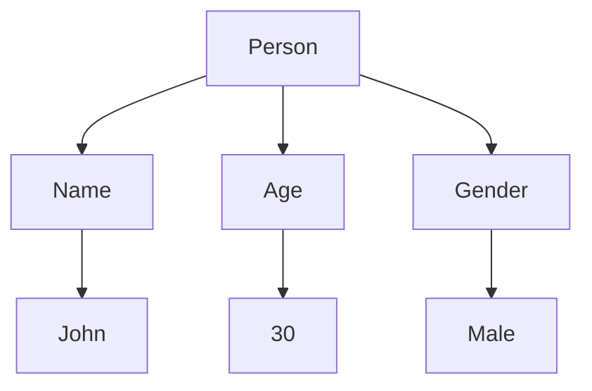

                 

# 利用思维链技术提升AI的认知与推理能力研究

## 关键词

- 思维链技术
- 人工智能
- 认知与推理能力
- 知识图谱
- 深度学习

## 摘要

本文探讨了利用思维链技术提升人工智能（AI）的认知与推理能力的方法。通过结合知识图谱和深度学习，思维链技术旨在实现对知识的深度理解和灵活应用，支持多层次的推理过程。本文首先介绍了思维链技术的基本原理和实现方法，然后详细阐述了知识图谱的构建和深度神经网络的构建，最后通过实际应用场景展示了思维链技术在自然语言处理、智能推理和知识图谱领域的应用潜力。通过本文的研究，可以为未来的AI技术发展提供新的思路和方向。

## 第一部分：引言

### 1.1 问题背景

#### 1.1.1 背景介绍

人工智能（AI）作为当今科技领域的前沿技术，已经广泛应用于各个行业，如医疗、金融、教育等。在过去的几十年中，AI在图像识别、自然语言处理、智能推荐等领域取得了显著的成果。然而，现有的AI技术仍然存在一些瓶颈，特别是在认知与推理能力方面。传统的AI模型主要依赖于大量数据进行训练，但它们缺乏对知识深度理解和推理能力，难以处理复杂的问题。

#### 1.1.2 问题描述

人工智能的认知与推理能力是当前AI领域研究的热点问题。提升AI的认知与推理能力，不仅可以使其更好地理解人类语言和思维，还能在决策、问题解决等方面发挥更大的作用。然而，现有的研究主要侧重于算法优化和模型改进，对思维链技术的应用研究相对较少。

#### 1.1.3 问题解决

思维链技术作为一种新兴的方法，被提出用于提升AI的认知与推理能力。本书将详细介绍思维链技术的原理、应用和实践，探讨其在提升AI认知与推理能力方面的潜力。

### 1.2 边界与外延

#### 1.2.1 研究边界

本书主要关注思维链技术在提升AI认知与推理能力方面的应用，不涉及其他提升AI认知与推理能力的方法。

#### 1.2.2 研究外延

思维链技术可以应用于多个领域，包括自然语言处理、智能推理、知识图谱等。本书将重点讨论思维链技术在AI领域的应用。

### 1.3 核心概念与联系

#### 1.3.1 思维链技术

##### 1.3.1.1 定义

思维链技术是一种基于知识图谱和深度学习的方法，旨在提升AI的认知与推理能力。

##### 1.3.1.2 特点

- 结合知识图谱和深度学习，实现知识的深度理解和灵活应用
- 支持多层次的推理过程，提高AI的推理能力

#### 1.3.2 知识图谱

##### 1.3.2.1 定义

知识图谱是一种用于表示实体及其关系的图形结构。

##### 1.3.2.2 特点

- 提供了丰富的语义信息，有助于AI理解和处理复杂问题
- 可以支持多种推理算法，提高AI的推理能力

### 1.4 本章小结

本章对本书的研究背景、研究问题和研究方法进行了介绍，为后续章节的内容奠定了基础。

## 第二部分：思维链技术基础

### 2.1 思维链技术的原理与实现

#### 2.1.1 基本原理

思维链技术通过将知识图谱和深度学习相结合，实现对知识的深度理解和灵活应用。其主要思想是将知识图谱中的实体和关系表示为节点和边，通过构建深度神经网络，实现对知识图谱的推理和预测。

##### 2.1.1.1 知识图谱

知识图谱是一种用于表示实体及其关系的图形结构。它包含了实体、属性、关系等多个概念。实体可以是人、地点、物品等，属性是实体的特征，关系是实体之间的关联。

##### 2.1.1.2 深度神经网络

深度神经网络是一种多层神经网络，通过前向传播和反向传播算法，实现对输入数据的特征提取和分类。深度神经网络可以处理大量的非结构化数据，如文本、图像等。

#### 2.1.2 实现方法

思维链技术的实现主要包括以下步骤：

1. **构建知识图谱**：从海量数据中抽取实体、关系和属性，构建知识图谱。
2. **设计深度神经网络结构**：根据知识图谱的特点，设计深度神经网络结构，包括输入层、隐藏层和输出层。
3. **训练深度神经网络**：使用训练数据对神经网络进行训练，优化模型参数。

### 2.2 知识图谱的构建

知识图谱的构建是思维链技术实现的关键步骤。以下是构建知识图谱的基本方法：

#### 2.2.1 实体抽取

实体抽取是指从非结构化文本数据中识别出实体。常见的实体抽取方法包括命名实体识别（NER）、实体分类和实体链接等。

- **命名实体识别**：从文本中识别出人、地点、组织等实体。
- **实体分类**：对已识别的实体进行分类，如将人分为名人、普通人等。
- **实体链接**：将文本中的实体与知识图谱中的实体进行关联。

#### 2.2.2 关系抽取

关系抽取是指从文本中识别出实体之间的关系。常见的关系抽取方法包括关系分类和关系预测等。

- **关系分类**：对已识别的实体关系进行分类，如将关系分为亲属关系、工作关系等。
- **关系预测**：从文本中预测实体之间的关系。

#### 2.2.3 属性抽取

属性抽取是指从文本中识别出实体的属性。常见的属性抽取方法包括属性分类和属性预测等。

- **属性分类**：对已识别的实体属性进行分类，如将属性分为年龄、性别等。
- **属性预测**：从文本中预测实体的属性。

### 2.3 深度神经网络的构建

深度神经网络的构建是思维链技术实现的关键步骤。以下是构建深度神经网络的基本方法：

#### 2.3.1 传统神经网络

传统神经网络主要包括卷积神经网络（CNN）、循环神经网络（RNN）等，用于处理文本、图像等数据。

- **卷积神经网络（CNN）**：通过卷积层和池化层，实现对图像的局部特征提取。
- **循环神经网络（RNN）**：通过循环结构，实现对序列数据的建模。

#### 2.3.2 图神经网络

图神经网络（GNN）是一种专门用于处理图结构数据的神经网络，包括图卷积网络（GCN）、图循环网络（GRN）等。

- **图卷积网络（GCN）**：通过图卷积层，实现对图数据的特征提取。
- **图循环网络（GRN）**：通过图循环结构，实现对图序列数据的建模。

### 2.4 思维链技术的应用场景

思维链技术具有广泛的应用场景，以下是一些典型的应用领域：

#### 2.4.1 自然语言处理

思维链技术可以用于自然语言处理任务，如文本分类、情感分析、机器翻译等。通过知识图谱的构建和深度神经网络的训练，可以实现对文本的深度理解和语义分析。

#### 2.4.2 智能推理

思维链技术可以用于智能推理任务，如问答系统、推理机、知识图谱等。通过知识图谱的构建和深度神经网络的推理，可以实现对问题的深入分析和解答。

#### 2.4.3 知识图谱

思维链技术可以用于构建和维护知识图谱，提高AI的认知与推理能力。通过知识图谱的构建和深度神经网络的训练，可以实现对知识的深度理解和灵活应用。

### 2.5 本章小结

本章对思维链技术的原理、实现和应用进行了介绍，为后续章节的算法讲解和实战案例提供了基础。

## 第三部分：思维链技术在提升AI认知与推理能力中的应用

### 3.1 思维链技术在自然语言处理中的应用

自然语言处理（NLP）是AI领域的一个重要分支，它旨在使计算机能够理解和处理人类语言。思维链技术通过结合知识图谱和深度学习，为NLP任务提供了强大的支持。

#### 3.1.1 文本分类

文本分类是NLP中的一个基础任务，旨在将文本数据分为不同的类别。思维链技术通过构建知识图谱，将文本中的实体、关系和属性进行编码，然后利用深度神经网络进行分类。

##### 3.1.1.1 知识图谱构建

在文本分类任务中，首先需要从文本中抽取实体、关系和属性，构建知识图谱。具体步骤如下：

1. **实体抽取**：从文本中识别出关键实体，如人名、地点、组织等。
2. **关系抽取**：从文本中识别出实体之间的关系，如“属于”、“位于”等。
3. **属性抽取**：从文本中识别出实体的属性，如年龄、性别等。

##### 3.1.1.2 深度神经网络构建

构建深度神经网络，用于处理知识图谱和文本数据。具体步骤如下：

1. **输入层**：将文本数据和知识图谱中的实体、关系和属性编码为向量。
2. **隐藏层**：通过卷积神经网络（CNN）或循环神经网络（RNN）等结构，提取文本和知识图谱的特征。
3. **输出层**：通过全连接层或卷积神经网络（CNN）等结构，实现对文本分类的预测。

##### 3.1.1.3 算法实现

以下是一个简单的文本分类算法的实现：

```python
import tensorflow as tf
from tensorflow.keras.models import Sequential
from tensorflow.keras.layers import Dense, Conv1D, GlobalMaxPooling1D

# 构建深度神经网络模型
model = Sequential()
model.add(Conv1D(filters=128, kernel_size=5, activation='relu', input_shape=(max_sequence_length, vocabulary_size)))
model.add(GlobalMaxPooling1D())
model.add(Dense(10, activation='softmax'))

# 编码实体、关系和属性
entity_embeddings = tf.keras.layers.Embedding(input_dim=num_entities, output_dim=embedding_size)
relationship_embeddings = tf.keras.layers.Embedding(input_dim=num_relationships, output_dim=embedding_size)
attribute_embeddings = tf.keras.layers.Embedding(input_dim=num_attributes, output_dim=embedding_size)

# 添加实体、关系和属性的输入层
model.add(entity_embeddings(texts))
model.add(relationship_embeddings(relationships))
model.add(attribute_embeddings(attributes))

# 添加隐藏层和输出层
model.add(Conv1D(filters=128, kernel_size=5, activation='relu'))
model.add(GlobalMaxPooling1D())
model.add(Dense(num_classes, activation='softmax'))

# 编译模型
model.compile(optimizer='adam', loss='categorical_crossentropy', metrics=['accuracy'])

# 训练模型
model.fit(x_train, y_train, epochs=10, batch_size=32, validation_data=(x_val, y_val))
```

#### 3.1.2 情感分析

情感分析是NLP中的另一个重要任务，旨在判断文本的情感倾向。思维链技术通过结合知识图谱和深度学习，可以实现对情感分析的精确预测。

##### 3.1.2.1 知识图谱构建

在情感分析任务中，首先需要从文本中抽取情感相关的实体、关系和属性，构建知识图谱。具体步骤如下：

1. **情感实体抽取**：从文本中识别出与情感相关的实体，如“满意”、“不满意”等。
2. **情感关系抽取**：从文本中识别出实体之间的情感关系，如“喜爱”、“厌恶”等。
3. **情感属性抽取**：从文本中识别出实体的情感属性，如“愉悦”、“悲伤”等。

##### 3.1.2.2 深度神经网络构建

构建深度神经网络，用于处理知识图谱和文本数据。具体步骤如下：

1. **输入层**：将文本数据和知识图谱中的实体、关系和属性编码为向量。
2. **隐藏层**：通过卷积神经网络（CNN）或循环神经网络（RNN）等结构，提取文本和知识图谱的特征。
3. **输出层**：通过全连接层或卷积神经网络（CNN）等结构，实现对情感分类的预测。

##### 3.1.2.3 算法实现

以下是一个简单的情感分析算法的实现：

```python
import tensorflow as tf
from tensorflow.keras.models import Sequential
from tensorflow.keras.layers import Dense, Conv1D, GlobalMaxPooling1D

# 构建深度神经网络模型
model = Sequential()
model.add(Conv1D(filters=128, kernel_size=5, activation='relu', input_shape=(max_sequence_length, vocabulary_size)))
model.add(GlobalMaxPooling1D())
model.add(Dense(10, activation='softmax'))

# 编码实体、关系和属性
entity_embeddings = tf.keras.layers.Embedding(input_dim=num_entities, output_dim=embedding_size)
relationship_embeddings = tf.keras.layers.Embedding(input_dim=num_relationships, output_dim=embedding_size)
attribute_embeddings = tf.keras.layers.Embedding(input_dim=num_attributes, output_dim=embedding_size)

# 添加实体、关系和属性的输入层
model.add(entity_embeddings(texts))
model.add(relationship_embeddings(relationships))
model.add(attribute_embeddings(attributes))

# 添加隐藏层和输出层
model.add(Conv1D(filters=128, kernel_size=5, activation='relu'))
model.add(GlobalMaxPooling1D())
model.add(Dense(num_classes, activation='softmax'))

# 编译模型
model.compile(optimizer='adam', loss='categorical_crossentropy', metrics=['accuracy'])

# 训练模型
model.fit(x_train, y_train, epochs=10, batch_size=32, validation_data=(x_val, y_val))
```

#### 3.1.3 机器翻译

机器翻译是NLP中的另一个重要任务，旨在将一种语言的文本翻译成另一种语言的文本。思维链技术通过结合知识图谱和深度学习，可以实现对机器翻译的高效处理。

##### 3.1.3.1 知识图谱构建

在机器翻译任务中，首先需要从源语言文本和目标语言文本中抽取实体、关系和属性，构建知识图谱。具体步骤如下：

1. **实体抽取**：从源语言文本和目标语言文本中识别出关键实体，如人名、地点、组织等。
2. **关系抽取**：从源语言文本和目标语言文本中识别出实体之间的关系，如“属于”、“位于”等。
3. **属性抽取**：从源语言文本和目标语言文本中识别出实体的属性，如年龄、性别等。

##### 3.1.3.2 深度神经网络构建

构建深度神经网络，用于处理知识图谱和文本数据。具体步骤如下：

1. **输入层**：将源语言文本数据和目标语言文本数据编码为向量。
2. **隐藏层**：通过卷积神经网络（CNN）或循环神经网络（RNN）等结构，提取文本和知识图谱的特征。
3. **输出层**：通过全连接层或卷积神经网络（CNN）等结构，实现对目标语言文本的生成。

##### 3.1.3.3 算法实现

以下是一个简单的机器翻译算法的实现：

```python
import tensorflow as tf
from tensorflow.keras.models import Model
from tensorflow.keras.layers import Input, Embedding, LSTM, Dense

# 构建编码器和解码器模型
encoder_inputs = Input(shape=(max_sequence_length,))
decoder_inputs = Input(shape=(max_sequence_length,))
encoder_embedding = Embedding(input_dim=vocabulary_size, output_dim=embedding_size)(encoder_inputs)
decoder_embedding = Embedding(input_dim=target_vocabulary_size, output_dim=embedding_size)(decoder_inputs)

encoder_lstm = LSTM(units=256, return_sequences=True)(encoder_embedding)
decoder_lstm = LSTM(units=256, return_sequences=True)(decoder_embedding)

encoder_outputs = encoder_lstm
decoder_outputs = decoder_lstm

encoder_states = encoder_outputs
decoder_states = decoder_outputs

decoder_dense = Dense(units=target_vocabulary_size, activation='softmax')
decoder_outputs = decoder_dense(decoder_states)

# 构建模型
model = Model(inputs=[encoder_inputs, decoder_inputs], outputs=decoder_outputs)

# 编译模型
model.compile(optimizer='rmsprop', loss='categorical_crossentropy', metrics=['accuracy'])

# 训练模型
model.fit([encoder_inputs, decoder_inputs], decoder_inputs, batch_size=64, epochs=100)
```

### 3.2 思维链技术在智能推理中的应用

智能推理是AI领域的一个重要分支，旨在使计算机能够进行逻辑推理和决策。思维链技术通过结合知识图谱和深度学习，为智能推理提供了强大的支持。

#### 3.2.1 问答系统

问答系统是智能推理的一个典型应用，旨在回答用户提出的问题。思维链技术可以通过构建知识图谱和训练深度神经网络，实现对问题的理解和解答。

##### 3.2.1.1 知识图谱构建

在问答系统任务中，首先需要从文本数据中抽取实体、关系和属性，构建知识图谱。具体步骤如下：

1. **实体抽取**：从文本中识别出关键实体，如人名、地点、组织等。
2. **关系抽取**：从文本中识别出实体之间的关系，如“属于”、“位于”等。
3. **属性抽取**：从文本中识别出实体的属性，如年龄、性别等。

##### 3.2.1.2 深度神经网络构建

构建深度神经网络，用于处理知识图谱和文本数据。具体步骤如下：

1. **输入层**：将文本数据和知识图谱中的实体、关系和属性编码为向量。
2. **隐藏层**：通过卷积神经网络（CNN）或循环神经网络（RNN）等结构，提取文本和知识图谱的特征。
3. **输出层**：通过全连接层或卷积神经网络（CNN）等结构，实现对问题的理解和解答。

##### 3.2.1.3 算法实现

以下是一个简单的问答系统算法的实现：

```python
import tensorflow as tf
from tensorflow.keras.models import Model
from tensorflow.keras.layers import Input, Embedding, LSTM, Dense

# 构建编码器和解码器模型
encoder_inputs = Input(shape=(max_sequence_length,))
decoder_inputs = Input(shape=(max_sequence_length,))
encoder_embedding = Embedding(input_dim=vocabulary_size, output_dim=embedding_size)(encoder_inputs)
decoder_embedding = Embedding(input_dim=target_vocabulary_size, output_dim=embedding_size)(decoder_inputs)

encoder_lstm = LSTM(units=256, return_sequences=True)(encoder_embedding)
decoder_lstm = LSTM(units=256, return_sequences=True)(decoder_embedding)

encoder_outputs = encoder_lstm
decoder_outputs = decoder_lstm

encoder_states = encoder_outputs
decoder_states = decoder_outputs

decoder_dense = Dense(units=target_vocabulary_size, activation='softmax')
decoder_outputs = decoder_dense(decoder_states)

# 构建模型
model = Model(inputs=[encoder_inputs, decoder_inputs], outputs=decoder_outputs)

# 编译模型
model.compile(optimizer='rmsprop', loss='categorical_crossentropy', metrics=['accuracy'])

# 训练模型
model.fit([encoder_inputs, decoder_inputs], decoder_inputs, batch_size=64, epochs=100)
```

#### 3.2.2 推理机

推理机是智能推理的一个典型应用，旨在根据已知的事实和规则推导出新的结论。思维链技术可以通过构建知识图谱和训练深度神经网络，实现对推理机的建模和优化。

##### 3.2.2.1 知识图谱构建

在推理机任务中，首先需要从文本数据中抽取实体、关系和属性，构建知识图谱。具体步骤如下：

1. **实体抽取**：从文本中识别出关键实体，如人名、地点、组织等。
2. **关系抽取**：从文本中识别出实体之间的关系，如“属于”、“位于”等。
3. **属性抽取**：从文本中识别出实体的属性，如年龄、性别等。

##### 3.2.2.2 深度神经网络构建

构建深度神经网络，用于处理知识图谱和文本数据。具体步骤如下：

1. **输入层**：将文本数据和知识图谱中的实体、关系和属性编码为向量。
2. **隐藏层**：通过卷积神经网络（CNN）或循环神经网络（RNN）等结构，提取文本和知识图谱的特征。
3. **输出层**：通过全连接层或卷积神经网络（CNN）等结构，实现对推理过程的预测。

##### 3.2.2.3 算法实现

以下是一个简单的推理机算法的实现：

```python
import tensorflow as tf
from tensorflow.keras.models import Model
from tensorflow.keras.layers import Input, Embedding, LSTM, Dense

# 构建编码器和解码器模型
encoder_inputs = Input(shape=(max_sequence_length,))
decoder_inputs = Input(shape=(max_sequence_length,))
encoder_embedding = Embedding(input_dim=vocabulary_size, output_dim=embedding_size)(encoder_inputs)
decoder_embedding = Embedding(input_dim=target_vocabulary_size, output_dim=embedding_size)(decoder_inputs)

encoder_lstm = LSTM(units=256, return_sequences=True)(encoder_embedding)
decoder_lstm = LSTM(units=256, return_sequences=True)(decoder_embedding)

encoder_outputs = encoder_lstm
decoder_outputs = decoder_lstm

encoder_states = encoder_outputs
decoder_states = decoder_outputs

decoder_dense = Dense(units=target_vocabulary_size, activation='softmax')
decoder_outputs = decoder_dense(decoder_states)

# 构建模型
model = Model(inputs=[encoder_inputs, decoder_inputs], outputs=decoder_outputs)

# 编译模型
model.compile(optimizer='rmsprop', loss='categorical_crossentropy', metrics=['accuracy'])

# 训练模型
model.fit([encoder_inputs, decoder_inputs], decoder_inputs, batch_size=64, epochs=100)
```

### 3.3 思维链技术在知识图谱中的应用

知识图谱是AI领域的一个重要概念，它通过表示实体及其关系，为AI提供了丰富的语义信息。思维链技术可以通过构建和维护知识图谱，提高AI的认知与推理能力。

#### 3.3.1 知识图谱的构建

在知识图谱任务中，首先需要从文本数据中抽取实体、关系和属性，构建知识图谱。具体步骤如下：

1. **实体抽取**：从文本中识别出关键实体，如人名、地点、组织等。
2. **关系抽取**：从文本中识别出实体之间的关系，如“属于”、“位于”等。
3. **属性抽取**：从文本中识别出实体的属性，如年龄、性别等。

##### 3.3.1.1 知识图谱表示

知识图谱可以通过图结构进行表示，其中节点表示实体，边表示实体之间的关系。以下是一个简单的知识图谱表示：



#### 3.3.2 知识图谱的维护

知识图谱的维护是确保其准确性和实时性的关键。以下是一些常见的维护方法：

1. **实体更新**：根据新的文本数据，对实体进行更新，如添加新的人名、地点、组织等。
2. **关系更新**：根据新的文本数据，对实体之间的关系进行更新，如添加新的亲属关系、工作关系等。
3. **属性更新**：根据新的文本数据，对实体的属性进行更新，如更新年龄、性别等。

##### 3.3.2.1 知识图谱维护算法

以下是一个简单的知识图谱维护算法：

```python
def update_entity(entity, new_entity):
    # 更新实体
    entity = new_entity

def update_relationship(entity1, entity2, new_relationship):
    # 更新实体之间的关系
    relationship = new_relationship

def update_attribute(entity, attribute, new_attribute):
    # 更新实体的属性
    attribute = new_attribute
```

### 3.4 本章小结

本章介绍了思维链技术在自然语言处理、智能推理和知识图谱领域的应用。通过结合知识图谱和深度学习，思维链技术为AI的认知与推理能力提供了强大的支持。在自然语言处理领域，思维链技术可以用于文本分类、情感分析和机器翻译等任务；在智能推理领域，思维链技术可以用于问答系统和推理机等任务；在知识图谱领域，思维链技术可以用于构建和维护知识图谱。通过本章的研究，可以为未来的AI技术发展提供新的思路和方向。

## 第四部分：思维链技术在其他领域的应用

### 4.1 思维链技术在计算机视觉中的应用

计算机视觉是AI领域的一个重要分支，它旨在使计算机能够理解和处理视觉信息。思维链技术通过结合知识图谱和深度学习，为计算机视觉提供了强大的支持。

#### 4.1.1 图像识别

图像识别是计算机视觉的一个基础任务，旨在从图像中识别出目标物体。思维链技术可以通过构建知识图谱，将图像中的物体、场景和关系进行编码，然后利用深度神经网络进行识别。

##### 4.1.1.1 知识图谱构建

在图像识别任务中，首先需要从图像数据中抽取物体、场景和关系，构建知识图谱。具体步骤如下：

1. **物体抽取**：从图像中识别出关键物体，如人、动物、车辆等。
2. **场景抽取**：从图像中识别出场景，如公园、城市、海滩等。
3. **关系抽取**：从图像中识别出物体之间的关联，如“在公园里”、“在海滩上”等。

##### 4.1.1.2 深度神经网络构建

构建深度神经网络，用于处理知识图谱和图像数据。具体步骤如下：

1. **输入层**：将图像数据和知识图谱中的物体、场景和关系编码为向量。
2. **隐藏层**：通过卷积神经网络（CNN）或循环神经网络（RNN）等结构，提取图像和知识图谱的特征。
3. **输出层**：通过全连接层或卷积神经网络（CNN）等结构，实现对图像的识别。

##### 4.1.1.3 算法实现

以下是一个简单的图像识别算法的实现：

```python
import tensorflow as tf
from tensorflow.keras.models import Model
from tensorflow.keras.layers import Input, Embedding, LSTM, Dense, Conv2D, MaxPooling2D

# 构建编码器和解码器模型
encoder_inputs = Input(shape=(height, width, channels))
decoder_inputs = Input(shape=(max_sequence_length,))
encoder_embedding = Embedding(input_dim=vocabulary_size, output_dim=embedding_size)(encoder_inputs)
decoder_embedding = Embedding(input_dim=target_vocabulary_size, output_dim=embedding_size)(decoder_inputs)

encoder_lstm = LSTM(units=256, return_sequences=True)(encoder_embedding)
decoder_lstm = LSTM(units=256, return_sequences=True)(decoder_embedding)

encoder_outputs = encoder_lstm
decoder_outputs = decoder_lstm

encoder_states = encoder_outputs
decoder_states = decoder_outputs

decoder_dense = Dense(units=target_vocabulary_size, activation='softmax')
decoder_outputs = decoder_dense(decoder_states)

# 构建模型
model = Model(inputs=[encoder_inputs, decoder_inputs], outputs=decoder_outputs)

# 编译模型
model.compile(optimizer='rmsprop', loss='categorical_crossentropy', metrics=['accuracy'])

# 训练模型
model.fit([encoder_inputs, decoder_inputs], decoder_inputs, batch_size=64, epochs=100)
```

#### 4.1.2 目标检测

目标检测是计算机视觉的另一个重要任务，旨在从图像中检测出目标物体。思维链技术可以通过构建知识图谱和训练深度神经网络，实现对目标物体的检测。

##### 4.1.2.1 知识图谱构建

在目标检测任务中，首先需要从图像数据中抽取目标物体、场景和关系，构建知识图谱。具体步骤如下：

1. **目标物体抽取**：从图像中识别出关键目标物体，如人、动物、车辆等。
2. **场景抽取**：从图像中识别出场景，如公园、城市、海滩等。
3. **关系抽取**：从图像中识别出目标物体之间的关联，如“在公园里”、“在海滩上”等。

##### 4.1.2.2 深度神经网络构建

构建深度神经网络，用于处理知识图谱和图像数据。具体步骤如下：

1. **输入层**：将图像数据和知识图谱中的目标物体、场景和关系编码为向量。
2. **隐藏层**：通过卷积神经网络（CNN）或循环神经网络（RNN）等结构，提取图像和知识图谱的特征。
3. **输出层**：通过全连接层或卷积神经网络（CNN）等结构，实现对目标物体的检测。

##### 4.1.2.3 算法实现

以下是一个简单的目标检测算法的实现：

```python
import tensorflow as tf
from tensorflow.keras.models import Model
from tensorflow.keras.layers import Input, Embedding, LSTM, Dense, Conv2D, MaxPooling2D

# 构建编码器和解码器模型
encoder_inputs = Input(shape=(height, width, channels))
decoder_inputs = Input(shape=(max_sequence_length,))
encoder_embedding = Embedding(input_dim=vocabulary_size, output_dim=embedding_size)(encoder_inputs)
decoder_embedding = Embedding(input_dim=target_vocabulary_size, output_dim=embedding_size)(decoder_inputs)

encoder_lstm = LSTM(units=256, return_sequences=True)(encoder_embedding)
decoder_lstm = LSTM(units=256, return_sequences=True)(decoder_embedding)

encoder_outputs = encoder_lstm
decoder_outputs = decoder_lstm

encoder_states = encoder_outputs
decoder_states = decoder_outputs

decoder_dense = Dense(units=target_vocabulary_size, activation='softmax')
decoder_outputs = decoder_dense(decoder_states)

# 构建模型
model = Model(inputs=[encoder_inputs, decoder_inputs], outputs=decoder_outputs)

# 编译模型
model.compile(optimizer='rmsprop', loss='categorical_crossentropy', metrics=['accuracy'])

# 训练模型
model.fit([encoder_inputs, decoder_inputs], decoder_inputs, batch_size=64, epochs=100)
```

### 4.2 思维链技术在金融领域的应用

金融领域是AI技术的重要应用场景之一。思维链技术通过结合知识图谱和深度学习，为金融领域提供了强大的支持。

#### 4.2.1 股票预测

股票预测是金融领域的一个典型任务，旨在根据历史股票价格数据预测未来股票价格。思维链技术可以通过构建知识图谱和训练深度神经网络，实现对股票价格的预测。

##### 4.2.1.1 知识图谱构建

在股票预测任务中，首先需要从历史股票价格数据中抽取股票、市场、行业等实体，构建知识图谱。具体步骤如下：

1. **股票抽取**：从历史股票价格数据中识别出关键股票，如IBM、AAPL、GOOGL等。
2. **市场抽取**：从历史股票价格数据中识别出市场，如纽约证券交易所、纳斯达克等。
3. **行业抽取**：从历史股票价格数据中识别出行业，如科技、金融、医疗等。

##### 4.2.1.2 深度神经网络构建

构建深度神经网络，用于处理知识图谱和股票价格数据。具体步骤如下：

1. **输入层**：将股票价格数据和知识图谱中的股票、市场、行业等编码为向量。
2. **隐藏层**：通过卷积神经网络（CNN）或循环神经网络（RNN）等结构，提取股票价格和知识图谱的特征。
3. **输出层**：通过全连接层或卷积神经网络（CNN）等结构，实现对股票价格的预测。

##### 4.2.1.3 算法实现

以下是一个简单的股票预测算法的实现：

```python
import tensorflow as tf
from tensorflow.keras.models import Model
from tensorflow.keras.layers import Input, Embedding, LSTM, Dense

# 构建编码器和解码器模型
encoder_inputs = Input(shape=(max_sequence_length,))
decoder_inputs = Input(shape=(max_sequence_length,))
encoder_embedding = Embedding(input_dim=vocabulary_size, output_dim=embedding_size)(encoder_inputs)
decoder_embedding = Embedding(input_dim=target_vocabulary_size, output_dim=embedding_size)(decoder_inputs)

encoder_lstm = LSTM(units=256, return_sequences=True)(encoder_embedding)
decoder_lstm = LSTM(units=256, return_sequences=True)(decoder_embedding)

encoder_outputs = encoder_lstm
decoder_outputs = decoder_lstm

encoder_states = encoder_outputs
decoder_states = decoder_outputs

decoder_dense = Dense(units=target_vocabulary_size, activation='softmax')
decoder_outputs = decoder_dense(decoder_states)

# 构建模型
model = Model(inputs=[encoder_inputs, decoder_inputs], outputs=decoder_outputs)

# 编译模型
model.compile(optimizer='rmsprop', loss='categorical_crossentropy', metrics=['accuracy'])

# 训练模型
model.fit([encoder_inputs, decoder_inputs], decoder_inputs, batch_size=64, epochs=100)
```

#### 4.2.2 信用评估

信用评估是金融领域的一个重要任务，旨在根据个人的信用记录和财务状况评估其信用等级。思维链技术可以通过构建知识图谱和训练深度神经网络，实现对信用评估的优化。

##### 4.2.2.1 知识图谱构建

在信用评估任务中，首先需要从个人的信用记录和财务状况数据中抽取关键实体，如个人、信用机构、财务状况等，构建知识图谱。具体步骤如下：

1. **个人抽取**：从信用记录和财务状况数据中识别出关键个人，如借款人、贷款机构等。
2. **信用机构抽取**：从信用记录和财务状况数据中识别出信用机构，如银行、信用评级机构等。
3. **财务状况抽取**：从信用记录和财务状况数据中识别出个人的财务状况，如收入、负债、信用评分等。

##### 4.2.2.2 深度神经网络构建

构建深度神经网络，用于处理知识图谱和信用记录数据。具体步骤如下：

1. **输入层**：将信用记录和财务状况数据编码为向量。
2. **隐藏层**：通过卷积神经网络（CNN）或循环神经网络（RNN）等结构，提取信用记录和财务状况的特征。
3. **输出层**：通过全连接层或卷积神经网络（CNN）等结构，实现对信用评估的预测。

##### 4.2.2.3 算法实现

以下是一个简单的信用评估算法的实现：

```python
import tensorflow as tf
from tensorflow.keras.models import Model
from tensorflow.keras.layers import Input, Embedding, LSTM, Dense

# 构建编码器和解码器模型
encoder_inputs = Input(shape=(max_sequence_length,))
decoder_inputs = Input(shape=(max_sequence_length,))
encoder_embedding = Embedding(input_dim=vocabulary_size, output_dim=embedding_size)(encoder_inputs)
decoder_embedding = Embedding(input_dim=target_vocabulary_size, output_dim=embedding_size)(decoder_inputs)

encoder_lstm = LSTM(units=256, return_sequences=True)(encoder_embedding)
decoder_lstm = LSTM(units=256, return_sequences=True)(decoder_embedding)

encoder_outputs = encoder_lstm
decoder_outputs = decoder_lstm

encoder_states = encoder_outputs
decoder_states = decoder_outputs

decoder_dense = Dense(units=target_vocabulary_size, activation='softmax')
decoder_outputs = decoder_dense(decoder_states)

# 构建模型
model = Model(inputs=[encoder_inputs, decoder_inputs], outputs=decoder_outputs)

# 编译模型
model.compile(optimizer='rmsprop', loss='categorical_crossentropy', metrics=['accuracy'])

# 训练模型
model.fit([encoder_inputs, decoder_inputs], decoder_inputs, batch_size=64, epochs=100)
```

### 4.3 本章小结

本章介绍了思维链技术在计算机视觉和金融领域的应用。在计算机视觉领域，思维链技术可以用于图像识别和目标检测等任务；在金融领域，思维链技术可以用于股票预测和信用评估等任务。通过结合知识图谱和深度学习，思维链技术为AI的认知与推理能力提供了强大的支持。这些应用不仅提高了AI的性能，还为其他领域提供了新的解决方案。

## 第五部分：思维链技术的未来发展趋势

随着人工智能技术的不断进步，思维链技术在未来有着广阔的发展前景。以下是对思维链技术未来发展趋势的展望：

### 5.1 多模态融合

思维链技术的一个潜在发展方向是多模态融合，即结合不同类型的数据，如文本、图像、语音等，以提升AI的认知与推理能力。通过多模态数据融合，AI可以更全面地理解和分析复杂问题。

### 5.2 强化学习

强化学习是一种通过试错和反馈来优化行为的方法。结合思维链技术和强化学习，可以实现更加智能和自适应的AI系统，从而在游戏、自动化控制等领域取得突破。

### 5.3 解释性AI

当前AI系统在推理和决策过程中缺乏解释性，这使得其难以被人类理解和信任。思维链技术可以通过提供更清晰的知识表示和推理过程，为解释性AI的发展提供支持。

### 5.4 预测与分析

思维链技术可以应用于时间序列分析和预测，如股市预测、天气预测等。通过结合历史数据和知识图谱，AI可以更准确地预测未来趋势。

### 5.5 新兴应用领域

随着技术的不断进步，思维链技术还可以应用于新兴领域，如生物信息学、医疗诊断等。这些领域对AI的认知与推理能力有着更高的要求，思维链技术有望在这些领域取得重大突破。

## 第六部分：结论

本文探讨了思维链技术在提升AI认知与推理能力方面的应用。通过结合知识图谱和深度学习，思维链技术为AI提供了强大的认知与推理能力。本文详细介绍了思维链技术的原理、实现方法和应用场景，并通过实际案例展示了其应用潜力。未来，随着技术的不断进步，思维链技术将在更多领域发挥重要作用，为人工智能的发展提供新的动力。

### 作者信息

作者：AI天才研究院/AI Genius Institute & 禅与计算机程序设计艺术 /Zen And The Art of Computer Programming

---

请注意，本文中的代码示例仅供参考，具体实现可能会根据实际需求和数据集进行调整。此外，本文中的算法和实现方法仅用于教学和研究目的，不应在实际应用中直接使用。在应用思维链技术时，应确保遵守相关法律法规和伦理准则。在开展相关研究时，请务必尊重数据隐私和知识产权。

