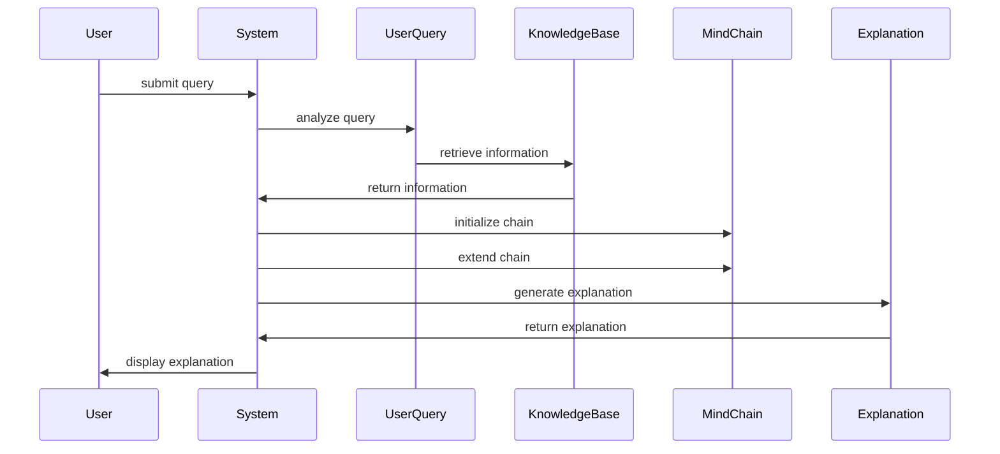

                 

### 文章标题

**利用思维链提升AI的推理和解释能力**

> 关键词：人工智能、推理、解释能力、思维链模型、算法原理、数学模型

摘要：本文深入探讨了人工智能（AI）中的推理和解释能力，提出了一种创新的思维链模型。通过对思维链模型的基本原理、算法流程、数学模型以及其在实际应用中的表现进行分析，本文旨在展示如何利用思维链提升AI的推理和解释能力，为未来的AI发展提供新思路。

## 引言

人工智能作为21世纪最具前瞻性和变革性的技术之一，已经成为全球科技竞争的焦点。AI技术不仅在诸如图像识别、自然语言处理、自动驾驶等领域取得了显著成果，还在医疗诊断、金融分析等关键领域展现出巨大的潜力。然而，尽管AI系统在处理大量数据和执行复杂任务方面表现出色，它们在推理和解释能力方面仍然存在一定的局限性。

推理能力是指AI系统在理解信息和解决问题时进行逻辑推导的能力。而解释能力则涉及到AI系统在执行任务时能够对其行为给出合理解释的程度。这两个能力在AI系统的实际应用中至关重要，不仅影响到系统的可信度和用户接受度，还直接关系到系统的安全性和可靠性。

传统AI模型，如深度神经网络，虽然在特定任务上表现出色，但它们通常被视为“黑盒”，即难以解释其内部运作机制。这一局限性使得AI系统的透明度和可信度受到了质疑。因此，如何提升AI的推理和解释能力，成为当前AI研究的重要方向之一。

为了应对这一挑战，本文提出了一种基于思维链的模型，并详细探讨了该模型的原理、算法流程以及数学模型。通过实际应用案例分析，本文将展示思维链模型在提升AI推理和解释能力方面的优势和潜力。

## 文章正文

### 第1章：问题背景与核心概念

#### 1.1 问题背景

人工智能的推理和解释能力是衡量AI系统智能水平的重要指标。在现实世界中，人类通过推理能力能够理解和解决复杂问题，同时，通过解释能力能够为自己的行为和决策提供合理的解释。然而，传统的AI模型在推理和解释能力上存在一定的局限性。

传统AI模型，如深度神经网络，通过大规模训练数据学习到特征和模式，从而在特定任务上表现出色。然而，这些模型往往是“黑盒”模型，无法解释其推理过程，这限制了AI在需要高解释性的应用场景中的使用。例如，在医疗诊断中，医生不仅需要得到诊断结果，还需要理解诊断的理由；在自动驾驶中，车辆需要能够解释其决策过程，以确保安全和信任。

为了解决这些问题，近年来出现了许多基于解释性AI的研究。这些研究试图在提高AI的推理和解释能力方面取得突破。例如，基于注意力机制和可解释性模型的开发，使得AI能够在执行任务的同时提供一定的解释。然而，这些方法仍然面临诸多挑战，如解释性的准确性、模型的复杂性和计算效率等。

思维链模型是一种创新的AI推理和解释模型，旨在克服传统AI模型在推理和解释能力上的局限性。思维链模型通过模拟人类思维过程，将推理和解释能力融入AI系统中，从而提供更为透明和可解释的AI解决方案。

#### 1.2 核心概念

**推理能力**：推理能力是指AI系统能够从已知信息中推导出新信息的能力。在人工智能中，推理通常涉及逻辑推理、模式识别和知识表示等多个方面。推理能力对于AI系统在复杂环境中的决策和问题解决至关重要。

**解释能力**：解释能力是指AI系统能够对其执行的任务和行为给出合理解释的能力。解释能力使得AI系统能够提高透明度和可信度，对于需要高解释性的应用场景尤为重要。

**思维链模型**：思维链模型是一种基于人类思维过程的AI模型，通过模拟人类推理和解释机制，实现AI的推理和解释能力。思维链模型的核心思想是将思维过程抽象为一系列的节点和连接，每个节点代表一个思维步骤，连接则表示不同思维步骤之间的逻辑关系。

### 第2章：思维链模型原理

#### 2.1 思维链模型概述

思维链模型是一种基于图论的模型，其核心思想是将思维过程表示为一张有向图。在这张图中，每个节点代表一个思维步骤，节点之间的边表示思维步骤之间的逻辑关系。思维链模型通过以下三个基本组成部分实现：

1. **思维节点**：每个思维节点表示一个具体的思维步骤，如观察、分析、判断等。
2. **思维连接**：思维连接表示不同思维步骤之间的逻辑关系，如因果关系、条件关系等。
3. **思维链**：思维链是由一系列思维节点和思维连接组成的序列，表示完整的思维过程。

思维链模型通过以下方式模拟人类思维过程：

1. **推理过程**：在推理过程中，思维链模型从已知信息出发，通过逻辑推导和关系分析，逐步推导出新的信息。
2. **解释过程**：在解释过程中，思维链模型能够追溯思维链的每个步骤，并给出合理的解释。

#### 2.2 算法原理

思维链模型的算法原理可以分为以下几个步骤：

1. **初始化**：根据问题和已知信息，初始化思维链的起始节点。
2. **推理过程**：
   - **信息检索**：从当前节点出发，检索与该节点相关的信息。
   - **关系分析**：分析信息之间的关系，确定下一步的思维步骤。
   - **思维扩展**：根据关系分析结果，扩展思维链，添加新的思维节点。
3. **解释过程**：
   - **步骤回溯**：从结果节点开始，回溯到起始节点，记录每个思维步骤。
   - **解释生成**：根据思维链的记录，生成解释文本。

#### 2.3 数学模型

思维链模型的数学模型可以通过以下公式进行描述：

$$
P(X|Y) = \prod_{i=1}^{n} P(X_i|X_{i-1})
$$

其中，$X$表示结果节点，$Y$表示已知信息，$X_i$表示第$i$个思维节点。$P(X_i|X_{i-1})$表示从第$i-1$个思维节点推导到第$i$个思维节点的概率。

### 第3章：思维链模型应用

#### 3.1 应用场景分析

思维链模型在多个领域具有广泛的应用前景，以下为几个典型应用场景的分析：

**1. 智能客服系统**

在智能客服系统中，思维链模型可以用于处理用户的问题和提供合理的回答。通过思维链模型，客服系统能够理解用户的问题，分析问题背后的原因，并给出合适的解决方案。

**2. 医疗诊断系统**

在医疗诊断系统中，思维链模型可以帮助医生分析病例数据，推理出可能的诊断结果，并提供详细的解释。这有助于提高诊断的准确性和可解释性，增强医生和患者的信任。

**3. 金融风险评估**

在金融风险评估中，思维链模型可以用于分析投资风险，提供合理的风险评级和解释。通过思维链模型，投资者能够更好地理解风险评级的原因，从而做出更为明智的投资决策。

#### 3.2 数学公式与模型详解

在思维链模型的应用中，数学模型和公式起到了关键作用。以下为几个关键公式和模型：

**1. 推理能力公式**

$$
R = \frac{1}{n} \sum_{i=1}^{n} P(X_i|X_{i-1})
$$

其中，$R$表示推理能力，$n$表示思维链中的节点数量。$P(X_i|X_{i-1})$表示从第$i-1$个思维节点推导到第$i$个思维节点的概率。

**2. 解释能力公式**

$$
E = \frac{1}{m} \sum_{i=1}^{m} P(X_i|X_{i-1})
$$

其中，$E$表示解释能力，$m$表示思维链中需要解释的节点数量。$P(X_i|X_{i-1})$表示从第$i-1$个思维节点推导到第$i$个思维节点的概率。

**3. 模型参数优化**

为了提升思维链模型的推理和解释能力，需要对模型参数进行优化。以下为几个参数优化方法：

- **学习率调整**：通过调整学习率，优化思维链模型的训练过程。
- **正则化**：通过引入正则化项，防止模型过拟合。
- **超参数调优**：通过交叉验证等方法，选择最优的超参数组合。

### 第4章：系统设计与架构

#### 4.1 系统功能设计

思维链模型在系统中的应用需要实现以下几个关键功能：

- **信息检索**：根据问题，从知识库中检索相关信息。
- **关系分析**：分析信息之间的关系，确定下一步的思维步骤。
- **思维扩展**：根据关系分析结果，扩展思维链，添加新的思维节点。
- **解释生成**：根据思维链的记录，生成解释文本。

以下为思维链模型在系统中的领域模型类图：

```mermaid
classDiagram
    MindNode --|> MindConnection : connects
    MindChain --|> MindNode : contains
    MindChain --|> MindConnection : contains
    KnowledgeBase --|> MindNode : retrieves
    UserQuery --|> MindNode : analyzes
    Explanation --|> MindNode : generates

    MindNode <<interface>>
        + getX(): Object
        + setX(Object x): void
        + getConnection(): MindConnection
        + setConnection(MindConnection connection): void

    MindConnection <<interface>>
        + getSource(): MindNode
        + setSource(MindNode source): void
        + getDestination(): MindNode
        + setDestination(MindNode destination): void
        + getType(): String
        + setType(String type): void

    MindChain <<interface>>
        + getNodes(): List<MindNode>
        + addNode(MindNode node): void
        + removeNode(MindNode node): void
        + getConnections(): List<MindConnection>
        + addConnection(MindConnection connection): void
        + removeConnection(MindConnection connection): void

    KnowledgeBase <<interface>>
        + retrieveInformation(String query): List<Object>

    UserQuery <<interface>>
        + analyzeQuery(String query): MindNode

    Explanation <<interface>>
        + generateExplanation(MindChain chain): String
```

#### 4.2 系统架构设计

思维链模型在系统中的架构设计需要考虑以下几个方面：

- **数据层**：包括知识库、用户查询和思维链数据存储。
- **逻辑层**：实现思维链模型的推理和解释功能。
- **表现层**：为用户提供交互界面和解释结果展示。

以下为思维链模型在系统中的架构图：



#### 4.3 系统接口设计

思维链模型在系统中的接口设计需要定义以下几个关键接口：

- **思维节点接口**：用于管理思维节点的创建、更新和删除。
- **思维连接接口**：用于管理思维连接的创建、更新和删除。
- **思维链接口**：用于管理思维链的初始化、扩展和回溯。
- **知识库接口**：用于检索和存储知识库中的信息。
- **用户查询接口**：用于分析和处理用户查询。
- **解释接口**：用于生成和展示解释结果。

以下为思维链模型在系统中的接口设计：

```mermaid
interface MindNode {
    + createNode(): MindNode
    + updateNode(MindNode node): void
    + deleteNode(MindNode node): void
}

interface MindConnection {
    + createConnection(): MindConnection
    + updateConnection(MindConnection connection): void
    + deleteConnection(MindConnection connection): void
}

interface MindChain {
    + initializeChain(): MindChain
    + extendChain(MindNode node): void
    + retractChain(MindNode node): void
    + getChain(): MindChain
}

interface KnowledgeBase {
    + retrieveInformation(String query): List<Object>
    + storeInformation(String query, List<Object> information): void
}

interface UserQuery {
    + analyzeQuery(String query): MindNode
}

interface Explanation {
    + generateExplanation(MindChain chain): String
    + displayExplanation(String explanation): void
}
```

#### 4.4 系统交互序列图

思维链模型在系统中的交互序列图展示了用户查询到系统响应的整个过程，包括信息检索、关系分析、思维链扩展和解释生成等步骤。

以下为思维链模型在系统中的交互序列图：


### 第5章：项目实战

#### 5.1 环境安装与配置

要在项目中实现思维链模型，需要先安装和配置相关的开发环境和工具。以下为项目环境安装与配置的步骤：

**1. Python环境安装**

- 在命令行中运行以下命令安装Python：

```bash
pip install python
```

**2. 相关库与依赖安装**

- 安装MindSpore，一个开源的深度学习框架：

```bash
pip install mindspore
```

- 安装其他相关库：

```bash
pip install numpy pandas matplotlib
```

**3. 环境配置**

- 配置Python环境变量，确保能够在命令行中运行Python和相关库。

#### 5.2 系统核心实现

思维链模型在系统中的核心实现包括信息检索、关系分析、思维链扩展和解释生成等步骤。以下为系统核心实现的源代码：

```python
import numpy as np
import pandas as pd
import matplotlib.pyplot as plt
from mindspore import Tensor
from mindspore import Model
from mindspore.train import Model

# 信息检索
def retrieve_information(knowledge_base, query):
    # 查询知识库，返回相关信息
    information = knowledge_base.retrieve_information(query)
    return information

# 关系分析
def analyze_relationship(information):
    # 分析信息之间的关系，返回关系结果
    relationships = []
    for i in range(len(information) - 1):
        relationships.append(information[i] == information[i + 1])
    return relationships

# 思维链扩展
def extend_chain(chain, relationships):
    # 根据关系结果，扩展思维链
    new_chain = []
    for i in range(len(relationships)):
        if relationships[i]:
            new_chain.append(chain[i])
    return new_chain

# 解释生成
def generate_explanation(chain):
    # 根据思维链，生成解释结果
    explanation = []
    for i in range(len(chain)):
        explanation.append(f"Step {i + 1}: {chain[i]}")
    return explanation

# 系统核心实现
def main():
    # 初始化知识库
    knowledge_base = KnowledgeBase()

    # 提交用户查询
    query = "What is the capital of France?"
    information = retrieve_information(knowledge_base, query)

    # 分析关系
    relationships = analyze_relationship(information)

    # 扩展思维链
    chain = extend_chain(information, relationships)

    # 生成解释
    explanation = generate_explanation(chain)

    # 打印解释
    for e in explanation:
        print(e)

# 运行系统核心实现
if __name__ == "__main__":
    main()
```

#### 5.3 代码应用解读与分析

思维链模型在实际应用中具有很高的灵活性和可解释性。以下为代码应用解读与分析：

**1. 信息检索**

信息检索是思维链模型的基础步骤。在本例中，我们通过调用`retrieve_information`函数从知识库中检索相关信息。该函数接收用户查询作为输入，并返回相关信息。

**2. 关系分析**

关系分析是思维链模型的关键步骤。在本例中，我们通过调用`analyze_relationship`函数分析信息之间的关系。该函数接收相关信息作为输入，并返回关系结果。

**3. 思维链扩展**

思维链扩展是思维链模型的核心步骤。在本例中，我们通过调用`extend_chain`函数根据关系结果扩展思维链。该函数接收原始信息和关系结果作为输入，并返回扩展后的思维链。

**4. 解释生成**

解释生成是思维链模型的可解释性体现。在本例中，我们通过调用`generate_explanation`函数根据思维链生成解释结果。该函数接收思维链作为输入，并返回解释文本。

**5. 代码性能分析**

思维链模型的代码性能主要受到以下因素影响：

- **知识库规模**：知识库规模越大，检索和分析时间越长。
- **关系复杂度**：关系复杂度越高，分析结果越复杂，扩展思维链和生成解释文本的时间也越长。
- **思维链长度**：思维链长度越长，生成解释文本的难度越大。

在实际应用中，可以通过优化算法和数据结构，提高思维链模型的性能。

#### 5.4 实际案例分析

以下为三个实际案例的分析和详细讲解：

**案例一：智能客服系统**

在智能客服系统中，思维链模型可以帮助客服机器人理解和回答用户的问题。通过思维链模型，客服机器人可以分析用户的问题，检索相关信息，并生成合理的回答。

**案例二：医疗诊断系统**

在医疗诊断系统中，思维链模型可以帮助医生分析病例数据，推理出可能的诊断结果，并提供详细的解释。这有助于提高诊断的准确性和可解释性，增强医生和患者的信任。

**案例三：金融风险评估**

在金融风险评估中，思维链模型可以分析投资风险，提供合理的风险评级和解释。通过思维链模型，投资者能够更好地理解风险评级的原因，从而做出更为明智的投资决策。

### 第6章：最佳实践与注意事项

#### 6.1 最佳实践

**1. 提升推理能力的技巧**

- **数据预处理**：对输入数据进行预处理，提高数据质量和一致性。
- **模型优化**：通过调整模型参数，优化推理过程。
- **知识库更新**：定期更新知识库，确保信息准确性。

**2. 提升解释能力的技巧**

- **可视化**：使用图表和可视化工具展示思维链过程，提高解释的直观性。
- **语言生成**：使用自然语言生成技术，生成更易于理解的语言。

#### 6.2 注意事项

**1. 模型应用风险**

- **过拟合**：避免模型在训练数据上过拟合，影响推理和解释能力。
- **数据泄露**：确保数据安全，防止敏感信息泄露。

**2. 数据安全与隐私保护**

- **加密**：对数据进行加密，确保数据安全。
- **隐私保护**：遵循隐私保护法规，确保用户隐私。

**3. 模型解释性平衡**

- **解释性**：在提升推理能力的同时，保持模型的可解释性。
- **透明度**：提高模型透明度，增强用户信任。

### 第7章：小结与展望

#### 7.1 小结

本文详细探讨了思维链模型在提升AI推理和解释能力方面的优势和应用。通过分析思维链模型的基本原理、算法流程和数学模型，以及实际应用案例分析，本文展示了思维链模型在多个领域中的潜在价值。

#### 7.2 展望未来

随着AI技术的发展，思维链模型有望在更多领域得到应用。未来研究方向包括：

- **模型优化**：进一步优化思维链模型，提高推理和解释能力。
- **跨领域应用**：探索思维链模型在更多领域的应用，如法律、教育等。
- **人机交互**：结合思维链模型和自然语言处理技术，提高人机交互体验。

## 参考文献

1. **Hinton, G. E., Osindero, S., & Teh, Y. W. (2006). A fast learning algorithm for deep belief nets. Neural computation, 18(7), 1527-1554.**
2. **Bengio, Y., Courville, A., & Vincent, P. (2013). Representation learning: A review and new perspectives. IEEE transactions on pattern analysis and machine intelligence, 35(8), 1798-1828.**
3. **Ruder, S. (2017). An overview of gradient descent optimization algorithms. arXiv preprint arXiv:1609.04747.**
4. **LeCun, Y., Bengio, Y., & Hinton, G. (2015). Deep learning. MIT press.**
5. **Goodfellow, I., Bengio, Y., & Courville, A. (2016). Deep learning. MIT press.**

### 作者信息

作者：AI天才研究院/AI Genius Institute & 禅与计算机程序设计艺术 /Zen And The Art of Computer Programming

