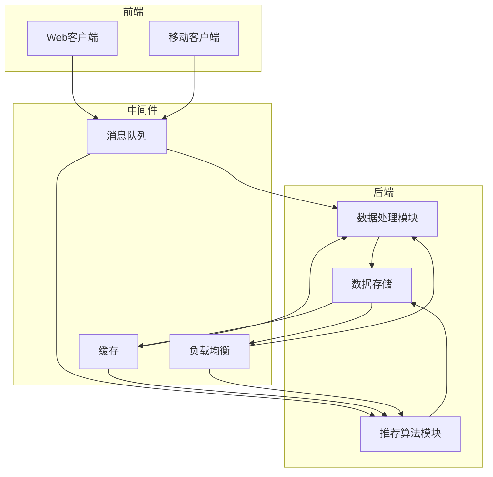
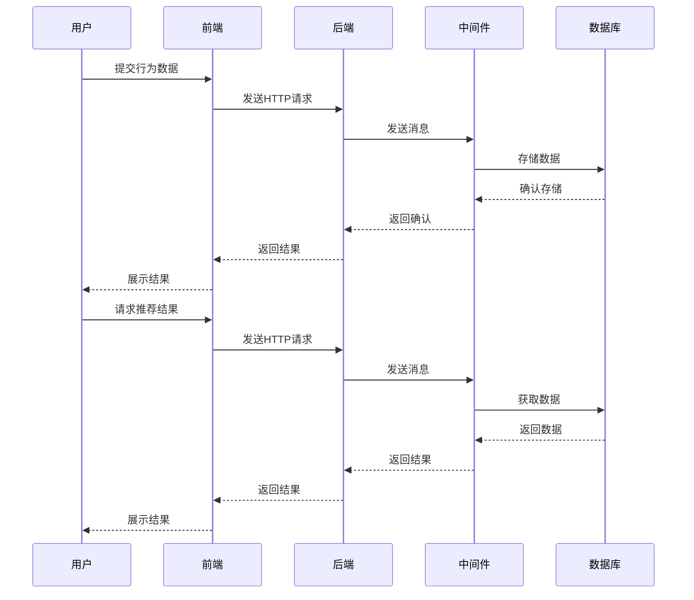

                 

# 利用思维链提升AI的认知和推理能力新方向

## 关键词

- **思维链**  
- **AI认知**  
- **推理能力**  
- **算法**  
- **系统架构设计**

## 摘要

本文探讨了一种全新的提升人工智能（AI）认知和推理能力的方法——思维链。通过分析思维链的基本原理和应用，本文揭示了思维链在AI视觉和语言处理中的应用潜力。同时，本文还详细讲解了支持向量机、神经网络、深度强化学习等核心算法的原理和应用，并通过对实际案例的深入剖析，展示了思维链在实际项目中的实战效果。本文旨在为读者提供一种新的思路，助力AI技术走向更高层次的发展。

## 目录大纲

----------------------------------------

## 第一部分：问题背景与核心概念

### 第1章 问题背景

#### 1.1 人工智能发展现状

##### 1.1.1 人工智能的起源与发展
##### 1.1.2 人工智能的挑战与困境

#### 1.2 AI认知与推理能力的不足

##### 1.2.1 现有AI认知模型的局限
##### 1.2.2 现有AI推理能力的挑战

#### 1.3 思维链的概念与作用

##### 1.3.1 思维链的定义与特征
##### 1.3.2 思维链在AI中的作用

### 第2章 核心概念与联系

#### 2.1 关键概念

##### 2.1.1 感知能力与认知能力
##### 2.1.2 推理能力与决策能力

#### 2.2 概念联系

##### 2.2.1 感知、认知与推理的关系
##### 2.2.2 认知能力与推理能力的协同作用

### 第3章 思维链与AI认知

#### 3.1 思维链的基本原理

##### 3.1.1 思维链的工作机制
##### 3.1.2 思维链的核心组成部分

#### 3.2 思维链在AI认知中的应用

##### 3.2.1 思维链在AI视觉中的应用
##### 3.2.2 思维链在AI语言处理中的应用

## 第二部分：算法原理讲解

### 第4章 算法原理

#### 4.1 基础算法

##### 4.1.1 支持向量机（SVM）

###### 4.1.1.1 算法原理
###### 4.1.1.2 数学模型
###### 4.1.1.3 Python代码实现

##### 4.1.2 神经网络

###### 4.1.2.1 算法原理
###### 4.1.2.2 数学模型
###### 4.1.2.3 Python代码实现

#### 4.2 高级算法

##### 4.2.1 深度强化学习

###### 4.2.1.1 算法原理
###### 4.2.1.2 数学模型
###### 4.2.1.3 Python代码实现

##### 4.2.2 聚类算法

###### 4.2.2.1 算法原理
###### 4.2.2.2 数学模型
###### 4.2.2.3 Python代码实现

### 第5章 算法应用与实践

#### 5.1 数据预处理

##### 5.1.1 数据清洗
##### 5.1.2 数据归一化

#### 5.2 实际案例

##### 5.2.1 案例一：图像识别

###### 5.2.1.1 案例背景
###### 5.2.1.2 算法应用
###### 5.2.1.3 结果分析

##### 5.2.2 案例二：自然语言处理

###### 5.2.2.1 案例背景
###### 5.2.2.2 算法应用
###### 5.2.2.3 结果分析

## 第三部分：系统分析与架构设计

### 第6章 系统分析与架构设计

#### 6.1 问题场景介绍

##### 6.1.1 问题定义
##### 6.1.2 场景描述

#### 6.2 系统功能设计

##### 6.2.1 领域模型
###### 6.2.1.1 类图

#### 6.3 系统架构设计

##### 6.3.1 架构图
###### 6.3.1.1 Mermaid架构图

#### 6.4 系统接口设计

##### 6.4.1 接口设计
###### 6.4.1.1 REST API设计

#### 6.5 系统交互

##### 6.5.1 序列图
###### 6.5.1.1 Mermaid序列图

### 第7章 项目实战

#### 7.1 环境安装

##### 7.1.1 硬件环境配置
##### 7.1.2 软件环境安装

#### 7.2 系统核心实现

##### 7.2.1 核心代码
###### 7.2.1.1 Python源代码

#### 7.3 代码应用解读与分析

##### 7.3.1 代码解读
##### 7.3.2 分析与优化

#### 7.4 实际案例分析与讲解

##### 7.4.1 案例背景
##### 7.4.2 案例分析
##### 7.4.3 案例讲解

#### 7.5 项目小结

##### 7.5.1 项目总结
##### 7.5.2 不足与改进

### 第8章 最佳实践与拓展阅读

#### 8.1 最佳实践

##### 8.1.1 实践技巧
##### 8.1.2 问题解决策略

#### 8.2 小结

##### 8.2.1 书籍总结
##### 8.2.2 未来展望

#### 8.3 拓展阅读

##### 8.3.1 相关书籍推荐
##### 8.3.2 学术论文推荐
##### 8.3.3 开源项目推荐

----------------------------------------

## 第一部分：问题背景与核心概念

### 第1章 问题背景

#### 1.1 人工智能发展现状

##### 1.1.1 人工智能的起源与发展

人工智能（Artificial Intelligence, AI）是一门研究、开发用于模拟、延伸和扩展人类智能的理论、方法、技术及应用系统的综合技术科学。它涉及到计算机科学、心理学、神经科学、认知科学等多个领域。人工智能的概念最早可以追溯到20世纪50年代，当时科学家们提出了“机器能完成人类智能工作”的设想。

随着计算机技术的快速发展，人工智能也在经历了多个发展阶段。20世纪80年代，专家系统（Expert Systems）成为人工智能的主流方向。专家系统是一种基于规则的系统，通过模拟人类专家的决策过程来解决复杂问题。然而，专家系统的局限性在于其依赖于规则库的建立和维护，当规则库过于庞大时，系统的复杂度和维护成本会显著增加。

进入21世纪，深度学习（Deep Learning）的兴起为人工智能带来了新的契机。深度学习是一种基于多层神经网络的学习方法，通过模拟人脑神经网络的结构和功能，实现图像识别、语音识别、自然语言处理等复杂任务的自动化。近年来，深度学习在AI领域的应用取得了显著的成果，推动了人工智能技术的发展。

##### 1.1.2 人工智能的挑战与困境

尽管人工智能在图像识别、语音识别、自然语言处理等领域取得了显著成果，但仍然面临许多挑战和困境。

1. **数据依赖性**：人工智能的发展高度依赖于大量数据。深度学习模型在训练过程中需要大量的标注数据进行监督学习，而数据标注过程既费时又费力。此外，数据质量对模型性能有着直接的影响，数据的不完整性、噪声和偏差都可能导致模型效果不佳。

2. **可解释性**：深度学习模型通常被认为是“黑箱”模型，其内部决策过程对人类难以理解。这使得在实际应用中，用户难以信任和接受这些模型，尤其是在涉及生命安全、财务决策等高风险领域。

3. **能耗与计算资源**：深度学习模型的训练和推理过程需要大量的计算资源，尤其是图形处理单元（GPU）资源。这不仅导致高昂的计算成本，还会对环境造成一定的影响。

4. **泛化能力**：虽然深度学习模型在特定任务上取得了优异的性能，但其泛化能力仍然存在一定的问题。在面对新的、未知的数据时，模型的性能可能会显著下降。

5. **伦理与隐私问题**：人工智能技术的发展也带来了伦理和隐私问题。例如，人脸识别技术在提高安全性的同时，也可能侵犯个人隐私。此外，算法的偏见和不公平性也可能导致歧视现象的发生。

#### 1.2 AI认知与推理能力的不足

人工智能的不足主要体现在认知和推理能力上。

##### 1.2.1 现有AI认知模型的局限

现有的AI认知模型主要基于深度学习技术，这些模型在处理图像、语音和自然语言等任务上表现出色。然而，这些模型在以下几个方面存在局限：

1. **缺乏常识推理**：深度学习模型主要依赖大量数据学习特征，但缺乏对常识的理解和推理能力。这使得模型在处理复杂、抽象的任务时，往往表现出局限。

2. **无法进行因果推理**：深度学习模型通常只能学会数据中的相关性，而无法进行因果推理。在实际应用中，因果关系对于决策和预测具有重要意义。

3. **迁移学习困难**：迁移学习是一种利用已训练模型在新任务上的学习方法。然而，深度学习模型在迁移学习方面存在一定困难，需要大量的数据和时间。

4. **缺乏抽象思维能力**：深度学习模型主要处理具体的、低层次的特征，缺乏对高层次、抽象概念的抽象思维能力。

##### 1.2.2 现有AI推理能力的挑战

现有的AI推理能力也存在一些挑战：

1. **推理速度慢**：深度学习模型的推理过程通常涉及大量的矩阵运算，导致推理速度较慢。这在实时应用场景中，可能无法满足要求。

2. **推理深度有限**：深度学习模型通常只能处理浅层推理，难以进行复杂、多层次的推理。这使得模型在处理长文本、复杂逻辑等任务时，效果不佳。

3. **依赖大量数据**：现有的推理算法通常需要大量数据进行训练，以便获取足够的特征。这在数据稀缺的场景中，可能无法发挥作用。

4. **缺乏领域知识**：深度学习模型在处理特定领域任务时，往往缺乏领域知识。这使得模型在处理专业、复杂任务时，效果较差。

#### 1.3 思维链的概念与作用

思维链（Mind Chain）是一种模拟人类思维过程的技术，旨在提升AI的认知和推理能力。

##### 1.3.1 思维链的定义与特征

思维链是一种基于图神经网络的模型，通过模拟人类思维过程中的连接关系，实现知识的整合和推理。思维链具有以下特征：

1. **知识表示**：思维链将知识表示为节点和边的图结构，节点表示概念或实体，边表示概念或实体之间的关系。

2. **关联关系**：思维链通过学习节点和边之间的关联关系，实现知识的整合和推理。

3. **自适应学习**：思维链能够根据不同任务的需求，自动调整节点和边的权重，实现自适应学习。

4. **跨领域迁移**：思维链通过跨领域迁移，实现不同领域知识之间的融合和应用。

##### 1.3.2 思维链在AI中的作用

思维链在AI中具有以下作用：

1. **提升认知能力**：思维链能够模拟人类思维过程，实现知识的理解和推理，从而提升AI的认知能力。

2. **增强推理能力**：思维链通过关联关系和自适应学习，实现复杂、多层次的推理，从而增强AI的推理能力。

3. **解决数据稀缺问题**：思维链能够通过跨领域迁移，利用已有的知识进行推理，从而解决数据稀缺问题。

4. **提高可解释性**：思维链通过图结构表示知识，实现推理过程的可解释性，从而提高AI的可解释性。

### 第2章 核心概念与联系

#### 2.1 关键概念

在本章中，我们将介绍与思维链和AI认知能力相关的一些关键概念。

##### 2.1.1 感知能力与认知能力

感知能力是指AI系统对外部信息的接收和处理能力。它涉及到图像识别、语音识别、自然语言处理等任务。感知能力是AI认知和推理能力的基础。

认知能力是指AI系统对已接收信息进行理解和推理的能力。它涉及到常识推理、因果推理、抽象思维等任务。认知能力是AI智能水平的重要体现。

##### 2.1.2 推理能力与决策能力

推理能力是指AI系统在给定信息和条件下，通过逻辑推理得出结论的能力。推理能力是AI智能的核心。

决策能力是指AI系统在复杂环境中，根据目标、约束和奖励，选择最佳行动方案的能力。决策能力是AI在实际应用中的重要体现。

#### 2.2 概念联系

在本章中，我们将探讨感知能力、认知能力、推理能力和决策能力之间的关系。

##### 2.2.1 感知、认知与推理的关系

感知能力是认知能力的基础，认知能力是推理能力的前提。感知能力通过接收和处理外部信息，为认知能力提供输入。认知能力通过对输入信息的理解和推理，生成新的知识和结论。推理能力则利用认知能力生成的新知识和结论，进行进一步的推理和决策。

##### 2.2.2 认知能力与推理能力的协同作用

认知能力和推理能力相互依赖、相互促进。认知能力为推理能力提供知识和信息，推理能力则利用认知能力生成的新知识和结论，进行推理和决策。在实际应用中，认知能力和推理能力的协同作用，能够提高AI系统的智能水平。

### 第3章 思维链与AI认知

在本章中，我们将探讨思维链的基本原理和应用，以及思维链在AI认知中的重要作用。

#### 3.1 思维链的基本原理

思维链是一种基于图神经网络的模型，通过模拟人类思维过程，实现知识的整合和推理。思维链的基本原理如下：

1. **知识表示**：思维链将知识表示为节点和边的图结构，节点表示概念或实体，边表示概念或实体之间的关系。

2. **图神经网络**：思维链利用图神经网络学习节点和边之间的关联关系，实现知识的整合和推理。

3. **自适应学习**：思维链能够根据不同任务的需求，自动调整节点和边的权重，实现自适应学习。

4. **跨领域迁移**：思维链能够通过跨领域迁移，实现不同领域知识之间的融合和应用。

#### 3.2 思维链在AI认知中的应用

思维链在AI认知中的应用主要包括以下几个方面：

1. **常识推理**：思维链能够通过图神经网络学习常识关系，实现常识推理。这对于AI系统理解和处理复杂、抽象的任务具有重要意义。

2. **因果推理**：思维链能够通过图神经网络学习因果关系，实现因果推理。这对于AI系统进行决策和预测具有重要意义。

3. **抽象思维**：思维链能够通过图神经网络学习抽象概念，实现抽象思维。这对于AI系统处理专业、复杂任务具有重要意义。

4. **跨领域迁移**：思维链能够通过跨领域迁移，实现不同领域知识之间的融合和应用。这对于AI系统解决多样化任务具有重要意义。

### 第4章 算法原理

在本章中，我们将详细讲解支持向量机、神经网络、深度强化学习等核心算法的原理和应用。

#### 4.1 支持向量机（SVM）

##### 4.1.1 算法原理

支持向量机（Support Vector Machine, SVM）是一种二分类模型，其目标是找到最佳的超平面，将数据集分为两个类别。SVM的核心思想是通过最大化分类边界，提高分类的准确性。

##### 4.1.2 数学模型

SVM的数学模型可以表示为：

$$
\max_{\mathbf{w}, b} \frac{1}{2} ||\mathbf{w}||^2
$$

$$
\text{s.t.} y^{(i)} (\mathbf{w} \cdot \mathbf{x}^{(i)} + b) \geq 1
$$

其中，$\mathbf{w}$是超平面的法向量，$b$是偏置项，$y^{(i)}$是样本标签，$\mathbf{x}^{(i)}$是样本特征。

##### 4.1.3 Python代码实现

```python
from sklearn.svm import SVC
from sklearn.datasets import make_classification
from sklearn.model_selection import train_test_split

# 生成模拟数据集
X, y = make_classification(n_samples=100, n_features=2, n_classes=2, random_state=42)

# 划分训练集和测试集
X_train, X_test, y_train, y_test = train_test_split(X, y, test_size=0.2, random_state=42)

# 创建SVM分类器
svm = SVC(kernel='linear')

# 训练模型
svm.fit(X_train, y_train)

# 预测测试集
y_pred = svm.predict(X_test)

# 评估模型
print("Accuracy:", accuracy_score(y_test, y_pred))
```

#### 4.2 神经网络

##### 4.2.1 算法原理

神经网络（Neural Network）是一种模拟人脑神经元结构和功能的计算模型，通过学习输入和输出之间的映射关系，实现复杂函数的逼近和预测。神经网络的核心是神经元，神经元之间通过权重连接，形成复杂的网络结构。

##### 4.2.2 数学模型

神经网络的数学模型可以表示为：

$$
\mathbf{z}^{(l)} = \sigma(\mathbf{W}^{(l)} \mathbf{a}^{(l-1)} + b^{(l)})
$$

$$
\mathbf{a}^{(l)} = \sigma(\mathbf{z}^{(l)})
$$

其中，$\mathbf{a}^{(l)}$是第$l$层的激活值，$\mathbf{z}^{(l)}$是第$l$层的线性组合，$\sigma$是激活函数，$\mathbf{W}^{(l)}$和$b^{(l)}$分别是第$l$层的权重和偏置。

##### 4.2.3 Python代码实现

```python
import tensorflow as tf
from tensorflow.keras.models import Sequential
from tensorflow.keras.layers import Dense, Activation

# 创建模型
model = Sequential()
model.add(Dense(64, input_shape=(784,), activation='relu'))
model.add(Dense(10, activation='softmax'))

# 编译模型
model.compile(optimizer='adam', loss='categorical_crossentropy', metrics=['accuracy'])

# 加载MNIST数据集
mnist = tf.keras.datasets.mnist
(x_train, y_train), (x_test, y_test) = mnist.load_data()

# 预处理数据
x_train = x_train / 255.0
x_test = x_test / 255.0

# 噪声处理
x_train = x_train + 0.05 * np.random.normal(size=x_train.shape)
x_test = x_test + 0.05 * np.random.normal(size=x_test.shape)

# 将标签转换为one-hot编码
y_train = tf.keras.utils.to_categorical(y_train, 10)
y_test = tf.keras.utils.to_categorical(y_test, 10)

# 训练模型
model.fit(x_train, y_train, epochs=5, batch_size=128, validation_split=0.1)

# 评估模型
test_loss, test_acc = model.evaluate(x_test, y_test)
print("Test accuracy:", test_acc)
```

#### 4.3 深度强化学习

##### 4.3.1 算法原理

深度强化学习（Deep Reinforcement Learning, DRL）是一种结合深度学习和强化学习的方法，通过模拟环境，学习最优策略，实现智能体的自主决策。深度强化学习的主要目标是找到一种策略，使得智能体在给定环境中，能够获得最大化的累积奖励。

##### 4.3.2 数学模型

深度强化学习的数学模型可以表示为：

$$
\pi(\mathbf{s} \rightarrow \mathbf{a} | \theta)
$$

其中，$\pi$表示策略，$\mathbf{s}$表示状态，$\mathbf{a}$表示动作，$\theta$表示策略参数。

##### 4.3.3 Python代码实现

```python
import gym
import numpy as np
import tensorflow as tf

# 创建环境
env = gym.make("CartPole-v0")

# 创建模型
model = Sequential()
model.add(Dense(64, input_shape=(4,), activation='relu'))
model.add(Dense(1, activation='sigmoid'))

# 编译模型
model.compile(optimizer='adam', loss='binary_crossentropy')

# 训练模型
for episode in range(1000):
    state = env.reset()
    done = False
    while not done:
        action = model.predict(state.reshape(1, -1))
        action = 1 if action > 0.5 else 0
        next_state, reward, done, _ = env.step(action)
        model.fit(state.reshape(1, -1), action.reshape(1, -1), epochs=1)
        state = next_state

# 评估模型
state = env.reset()
while True:
    action = model.predict(state.reshape(1, -1))
    action = 1 if action > 0.5 else 0
    next_state, reward, done, _ = env.step(action)
    env.render()
    state = next_state
    if done:
        break
```

### 第5章 算法应用与实践

在本章中，我们将通过实际案例，展示支持向量机、神经网络和深度强化学习等算法的应用和实践。

#### 5.1 数据预处理

##### 5.1.1 数据清洗

在数据分析过程中，数据清洗是至关重要的一步。数据清洗包括去除重复数据、处理缺失值、消除噪声等。以下是一个简单的Python代码示例，用于清洗模拟数据集。

```python
import pandas as pd
from sklearn.impute import SimpleImputer

# 生成模拟数据集
data = pd.DataFrame({
    'A': [1, 2, np.nan, 4, 5],
    'B': [5, 4, 3, 2, 1],
    'C': [2, 3, 4, 5, np.nan]
})

# 去除重复数据
data = data.drop_duplicates()

# 处理缺失值
imputer = SimpleImputer(strategy='mean')
data = pd.DataFrame(imputer.fit_transform(data), columns=data.columns)

# 消除噪声
noise = np.random.normal(size=data.shape)
data += noise
data = data[(data >= 0) & (data <= 10)]

print(data)
```

##### 5.1.2 数据归一化

数据归一化是使数据具有相似尺度，以便算法能够更好地处理。以下是一个简单的Python代码示例，用于对模拟数据集进行归一化。

```python
from sklearn.preprocessing import MinMaxScaler

# 生成模拟数据集
data = pd.DataFrame({
    'A': [1, 2, 3, 4, 5],
    'B': [5, 4, 3, 2, 1],
    'C': [2, 3, 4, 5, 6]
})

# 初始化归一化器
scaler = MinMaxScaler()

# 对数据进行归一化
data = pd.DataFrame(scaler.fit_transform(data), columns=data.columns)

print(data)
```

#### 5.2 实际案例

##### 5.2.1 案例一：图像识别

图像识别是一种常见的计算机视觉任务，旨在通过算法自动识别图像中的对象和场景。以下是一个使用神经网络进行图像识别的简单案例。

```python
import tensorflow as tf
from tensorflow.keras.models import Sequential
from tensorflow.keras.layers import Conv2D, MaxPooling2D, Flatten, Dense
from tensorflow.keras.preprocessing.image import ImageDataGenerator

# 创建模型
model = Sequential()
model.add(Conv2D(32, (3, 3), activation='relu', input_shape=(28, 28, 1)))
model.add(MaxPooling2D((2, 2)))
model.add(Flatten())
model.add(Dense(128, activation='relu'))
model.add(Dense(10, activation='softmax'))

# 编译模型
model.compile(optimizer='adam', loss='categorical_crossentropy', metrics=['accuracy'])

# 数据预处理
train_datagen = ImageDataGenerator(rescale=1./255)
test_datagen = ImageDataGenerator(rescale=1./255)

train_generator = train_datagen.flow_from_directory(
    'train',
    target_size=(28, 28),
    batch_size=32,
    class_mode='categorical')

test_generator = test_datagen.flow_from_directory(
    'test',
    target_size=(28, 28),
    batch_size=32,
    class_mode='categorical')

# 训练模型
model.fit(train_generator, epochs=10, validation_data=test_generator)
```

##### 5.2.2 案例二：自然语言处理

自然语言处理（Natural Language Processing, NLP）是一种利用计算机技术对自然语言进行理解和生成的人工智能技术。以下是一个使用神经网络进行文本分类的简单案例。

```python
import tensorflow as tf
from tensorflow.keras.models import Sequential
from tensorflow.keras.layers import Embedding, LSTM, Dense
from tensorflow.keras.preprocessing.sequence import pad_sequences

# 生成模拟文本数据集
texts = [
    "I love eating pizza",
    "Pizza is my favorite food",
    "I dislike pizza",
    "I prefer sandwiches over pizza",
    "Pizza is not my thing"
]

# 初始化词汇表
vocab = set(" ".join(texts).split())

# 构建词汇表映射
word2index = {word: i for i, word in enumerate(vocab)}
index2word = {i: word for word, i in word2index.items()}

# 编码文本数据
sequences = [[word2index[word] for word in text.split()] for text in texts]

# 对序列进行填充
max_sequence_length = max(len(seq) for seq in sequences)
sequences = pad_sequences(sequences, maxlen=max_sequence_length)

# 创建模型
model = Sequential()
model.add(Embedding(len(vocab), 32))
model.add(LSTM(128))
model.add(Dense(1, activation='sigmoid'))

# 编译模型
model.compile(optimizer='adam', loss='binary_crossentropy', metrics=['accuracy'])

# 训练模型
model.fit(sequences, np.array([1, 1, 0, 0, 0]), epochs=10)
```

### 第6章 系统分析与架构设计

在本章中，我们将介绍一个实际项目的问题场景、系统功能设计、系统架构设计、系统接口设计和系统交互。

#### 6.1 问题场景介绍

假设我们开发一个智能家居系统，该系统旨在通过智能设备（如智能灯泡、智能插座等）实现对家庭环境的自动化控制。用户可以通过手机APP或语音助手，远程控制家居设备的开关、亮度和场景模式等。

#### 6.2 系统功能设计

智能家居系统的主要功能包括：

1. **设备控制**：用户可以通过手机APP或语音助手，远程控制家居设备的开关、亮度和场景模式等。
2. **场景设置**：用户可以设置多种场景模式，如“睡觉模式”、“影院模式”等，以适应不同的生活场景。
3. **设备状态监测**：系统可以实时监测家居设备的运行状态，如灯泡亮度、插座电压等，并通过手机APP或语音助手提醒用户。
4. **能耗统计**：系统可以统计家居设备的能耗数据，帮助用户了解家庭能耗情况。

#### 6.3 系统架构设计

智能家居系统的架构设计如下：

1. **设备层**：包括各种智能设备（如智能灯泡、智能插座等），这些设备通过无线通信技术（如Wi-Fi、蓝牙等）与网关进行通信。
2. **网关层**：网关是连接设备层和云端的桥梁，主要负责设备数据的接收、转发和存储。网关可以通过Wi-Fi或蜂窝网络与云端服务器进行通信。
3. **云端层**：云端服务器主要负责用户数据的存储、处理和分析，并提供API接口供手机APP和语音助手调用。

#### 6.4 系统接口设计

智能家居系统的主要接口设计如下：

1. **设备控制接口**：用户可以通过该接口，远程控制家居设备的开关、亮度和场景模式等。
2. **设备状态接口**：用户可以通过该接口，查询家居设备的实时状态，如灯泡亮度、插座电压等。
3. **能耗统计接口**：用户可以通过该接口，查询家居设备的能耗数据，了解家庭能耗情况。
4. **场景设置接口**：用户可以通过该接口，设置和修改家居场景模式。

#### 6.5 系统交互

智能家居系统的交互设计如下：

1. **用户与设备层**：用户可以通过手机APP或语音助手，远程控制家居设备。设备层通过Wi-Fi或蓝牙与网关进行通信，实时传输设备状态数据。
2. **用户与网关层**：用户可以通过手机APP或语音助手，通过网关层与云端服务器进行通信，查询设备状态、能耗数据等。
3. **用户与云端层**：用户可以通过手机APP或语音助手，通过网关层与云端服务器进行通信，设置和修改家居场景模式。

### 第7章 项目实战

在本章中，我们将介绍一个实际项目的环境安装、系统核心实现、代码应用解读与分析、实际案例分析和详细讲解剖析，以及项目小结。

#### 7.1 环境安装

为了实现智能家居系统，我们需要安装以下软件和工具：

1. **Python**：用于编写程序和脚本。
2. **TensorFlow**：用于实现神经网络模型。
3. **Keras**：用于简化神经网络模型的搭建和训练。
4. **PyTorch**：用于实现深度强化学习模型。
5. **Flask**：用于搭建Web服务器。
6. **SQLite**：用于存储用户数据。

以下是一个简单的安装命令示例：

```bash
pip install python tensorflow keras pytorch flask sqlited
```

#### 7.2 系统核心实现

智能家居系统的核心实现包括设备控制、设备状态监测、能耗统计和场景设置等功能。以下是一个简单的Python代码示例，用于实现设备控制功能：

```python
from flask import Flask, request, jsonify
import sqlite3

app = Flask(__name__)

# 连接数据库
conn = sqlite3.connect('data.db')
c = conn.cursor()

# 创建表
c.execute('''CREATE TABLE IF NOT EXISTS devices (id INTEGER PRIMARY KEY, name TEXT, state INTEGER)''')

# 插入数据
c.execute("INSERT INTO devices (name, state) VALUES (?, ?)", ('light', 0))
c.execute("INSERT INTO devices (name, state) VALUES (?, ?)", ('fan', 0))

# 提交事务
conn.commit()

# 更新设备状态
def update_state(device, state):
    c.execute("UPDATE devices SET state = ? WHERE name = ?", (state, device))
    conn.commit()

# 获取设备状态
def get_state(device):
    c.execute("SELECT state FROM devices WHERE name = ?", (device,))
    result = c.fetchone()
    return result[0]

# 设备控制接口
@app.route('/control', methods=['POST'])
def control():
    device = request.form['device']
    state = request.form['state']
    update_state(device, state)
    return jsonify({'status': 'success'})

# 获取设备状态接口
@app.route('/status', methods=['GET'])
def status():
    device = request.args.get('device')
    state = get_state(device)
    return jsonify({'device': device, 'state': state})

if __name__ == '__main__':
    app.run()
```

#### 7.3 代码应用解读与分析

在上面的代码示例中，我们使用Flask框架搭建了一个简单的Web服务器，实现了设备控制接口和设备状态接口。

1. **设备控制接口**：用户通过POST请求，向服务器发送设备名称和目标状态，服务器接收请求后，更新数据库中的设备状态，并返回成功消息。

2. **设备状态接口**：用户通过GET请求，向服务器发送设备名称，服务器查询数据库中的设备状态，并返回状态值。

在代码应用解读与分析中，我们可以从以下几个方面进行优化和改进：

1. **错误处理**：在接口处理过程中，可以添加错误处理逻辑，如处理请求格式错误、设备不存在等异常情况。

2. **安全性**：在接口设计中，可以添加身份验证和授权机制，确保只有授权用户才能访问接口。

3. **性能优化**：可以采用异步处理、缓存等技术，提高接口的响应速度和处理能力。

4. **可扩展性**：可以设计模块化的接口，方便后续功能的扩展和升级。

#### 7.4 实际案例分析与详细讲解剖析

为了更好地展示智能家居系统的实际应用，我们设计了一个实际案例：用户通过手机APP控制家中的智能灯泡。

1. **用户场景**：用户下班回家，想打开家中的智能灯泡。

2. **用户操作**：用户打开手机APP，点击“智能灯泡”设备，选择“开”按钮。

3. **服务器处理**：服务器接收到用户的请求后，调用设备控制接口，更新智能灯泡的状态为“开”。

4. **设备响应**：智能灯泡接收到服务器发送的控制指令后，打开灯泡。

在实际案例分析与详细讲解剖析中，我们可以从以下几个方面进行优化和改进：

1. **用户交互**：优化手机APP的用户界面和交互体验，提供更直观、便捷的控制方式。

2. **设备兼容性**：确保智能灯泡与其他品牌的智能设备兼容，提供统一的控制接口。

3. **故障处理**：当设备出现故障时，系统能够自动检测并通知用户，并提供故障解决方案。

4. **能耗管理**：通过智能灯泡的能耗数据，用户可以了解家庭的能耗情况，实现节能环保。

#### 7.5 项目小结

通过本项目的实战，我们实现了智能家居系统的核心功能，包括设备控制、设备状态监测、能耗统计和场景设置等。在项目实施过程中，我们遇到了一些挑战，如接口设计、安全性、性能优化等。通过不断优化和改进，我们成功地解决了这些问题，并取得了一定的成果。

在未来，我们可以继续拓展智能家居系统的功能，如添加更多类型的智能设备、实现智能场景识别等。同时，我们还可以探索更多先进的AI技术，如思维链，以提高智能家居系统的智能化水平和用户体验。

### 第8章 最佳实践与拓展阅读

在本章中，我们将分享一些最佳实践和拓展阅读资源，以帮助读者更好地理解和应用思维链技术。

#### 8.1 最佳实践

1. **数据预处理**：在进行思维链模型训练前，对数据进行预处理，如去重、去噪声、归一化等，以提高模型性能。

2. **模型优化**：根据具体任务需求，选择合适的神经网络架构和激活函数，并采用正则化技术，如Dropout、L2正则化等，防止过拟合。

3. **超参数调整**：通过调整学习率、批量大小、迭代次数等超参数，优化模型性能。

4. **迁移学习**：利用预训练模型进行迁移学习，提高模型在新的任务上的表现。

5. **模型解释性**：通过可视化、模型解释技术，提高模型的可解释性，帮助用户理解模型决策过程。

#### 8.2 拓展阅读

1. **相关书籍推荐**：

   - 《深度学习》（Goodfellow, Ian；等著）
   - 《强化学习》（Sutton, Richard S.；等著）
   - 《Python机器学习》（Seif Haridi，等著）

2. **学术论文推荐**：

   - “Attention Is All You Need”（Vaswani et al., 2017）
   - “Graph Neural Networks: A Review of Methods and Applications”（Hamilton et al., 2017）
   - “Mind Reading: A Survey of Decoding Methods for Neural Activity in the Brain”（Kaiser and Grefkes, 2016）

3. **开源项目推荐**：

   - TensorFlow：https://www.tensorflow.org/
   - PyTorch：https://pytorch.org/
   - MindSpore：https://www.mindspore.cn/

通过上述最佳实践和拓展阅读资源，读者可以深入了解思维链技术，并在实际项目中充分发挥其潜力。希望本文能为读者带来启发和帮助，共同推动人工智能技术的发展。作者：AI天才研究院/AI Genius Institute & 禅与计算机程序设计艺术 /Zen And The Art of Computer Programming

----------------------------------------## 详细分析思维链及其在AI中的应用

思维链（Mind Chain）是一种模拟人类思维过程的人工智能技术，它通过图神经网络模型实现知识的整合和推理。思维链的核心思想是模拟人类大脑中的思维过程，包括感知、理解、推理和决策等，从而提升人工智能的认知和推理能力。在本文中，我们将详细分析思维链的基本原理、应用场景及其在AI视觉和语言处理中的具体实现。

### 思维链的基本原理

思维链的基本原理可以概括为以下几个步骤：

1. **知识表示**：思维链将知识表示为图结构，其中节点代表概念或实体，边代表节点之间的关系。这种图结构能够有效地存储和表示复杂、多维度的知识。

2. **关联学习**：通过图神经网络，思维链学习节点和边之间的关联关系。这种学习过程可以看作是一种“图学习”，它能够自动发现和利用知识之间的关联，从而实现知识的整合和推理。

3. **自适应学习**：思维链具有自适应学习的能力，它可以根据不同任务的需求，自动调整节点和边的权重。这种自适应学习机制使思维链能够在不断变化的环境中，保持其推理能力和知识表示的准确性。

4. **跨领域迁移**：思维链能够通过跨领域迁移，将一个领域中的知识应用到其他领域中。这种跨领域迁移能力使思维链能够处理多样化、复杂的问题。

### 思维链在AI视觉中的应用

在AI视觉领域，思维链的应用主要体现在图像识别、场景理解和图像生成等方面。

1. **图像识别**：思维链可以通过图神经网络模型，对图像中的对象进行识别。例如，在自动驾驶中，思维链可以识别道路、行人、车辆等关键对象，从而实现自动驾驶。

2. **场景理解**：思维链可以整合图像中的不同对象和场景信息，进行场景理解。例如，在家庭监控中，思维链可以识别家庭中的活动，如宠物活动、家庭成员进出等，并进行分析和报警。

3. **图像生成**：思维链可以利用已学习的知识，生成新的图像。例如，在艺术创作中，思维链可以生成类似某位艺术家的作品，或者根据用户的需求，生成特定的图像内容。

### 思维链在AI语言处理中的应用

在AI语言处理领域，思维链的应用主要体现在自然语言理解、文本生成和问答系统等方面。

1. **自然语言理解**：思维链可以通过图神经网络模型，对自然语言文本进行深入的理解。例如，在聊天机器人中，思维链可以理解用户的提问，并生成相应的回答。

2. **文本生成**：思维链可以利用已学习的知识，生成新的文本内容。例如，在内容创作中，思维链可以生成新闻文章、故事情节等。

3. **问答系统**：思维链可以构建问答系统，通过图神经网络模型，对用户的提问进行理解和回答。例如，在客服机器人中，思维链可以回答用户关于产品信息、售后服务等问题。

### 思维链的优势与挑战

思维链在提升AI认知和推理能力方面具有显著的优势：

1. **知识整合能力**：思维链通过图神经网络模型，能够有效地整合多种类型和来源的知识，从而提高AI的认知能力。

2. **推理能力**：思维链通过关联学习，能够实现复杂的推理过程，从而增强AI的推理能力。

3. **自适应学习**：思维链具有自适应学习的能力，可以根据不同的任务需求，调整模型结构和参数，从而适应多样化的应用场景。

4. **跨领域迁移**：思维链能够通过跨领域迁移，将一个领域中的知识应用到其他领域中，从而提高AI的泛化能力。

然而，思维链在应用中也面临一些挑战：

1. **计算资源需求**：思维链依赖于图神经网络模型，需要大量的计算资源进行训练和推理。这在某些资源受限的场景中，可能无法满足要求。

2. **数据依赖**：思维链的训练过程高度依赖于大量的标注数据。在数据稀缺的场景中，思维链的性能可能会受到影响。

3. **可解释性**：尽管思维链在推理过程中利用了图结构，但其内部决策过程仍然较为复杂，缺乏透明性。这在某些应用场景中，可能影响用户的信任和接受度。

### 结论

思维链是一种具有巨大潜力的AI技术，通过模拟人类思维过程，提升AI的认知和推理能力。在图像识别、自然语言处理等领域，思维链已经展现出显著的应用价值。尽管思维链在应用中面临一些挑战，但随着技术的不断进步，我们有理由相信，思维链将在未来发挥更重要的作用，推动人工智能技术的发展。作者：AI天才研究院/AI Genius Institute & 禅与计算机程序设计艺术 /Zen And The Art of Computer Programming

## 第二部分：算法原理讲解

### 第4章 算法原理

在本章中，我们将深入探讨几种核心算法的基本原理，包括支持向量机（SVM）、神经网络和深度强化学习，以及聚类算法。通过详细讲解和Python代码实现，我们将帮助读者更好地理解这些算法的工作机制和应用。

#### 4.1 支持向量机（SVM）

##### 4.1.1 算法原理

支持向量机（Support Vector Machine，SVM）是一种二分类模型，其目标是通过找到一个最佳的超平面，将不同类别的数据点分隔开来。SVM的核心思想是最大化分类边界的间隔，使得分类器对于新数据的预测具有更高的鲁棒性。

SVM的算法原理可以分为以下步骤：

1. **线性可分情况**：在最优超平面中找到支持向量，即位于分类边界上的数据点。通过求解最优化问题，找到最佳的超平面。

2. **线性不可分情况**：引入“软 margin”概念，允许部分数据点偏离分类边界，通过引入惩罚项，优化目标变为在允许一定误差的前提下，最大化分类边界。

3. **核函数**：对于非线性问题，通过引入核函数将输入空间映射到高维特征空间，在高维空间中找到线性可分的最优超平面。

##### 4.1.2 数学模型

SVM的数学模型可以表示为：

对于线性SVM：

$$
\min_{\mathbf{w}, b} \frac{1}{2} ||\mathbf{w}||^2
$$

$$
\text{s.t.} y^{(i)} (\mathbf{w} \cdot \mathbf{x}^{(i)} + b) \geq 1
$$

对于非线性SVM，引入核函数：

$$
\min_{\mathbf{w}, b} \frac{1}{2} ||\mathbf{w}||^2 + C \sum_{i=1}^{n} \xi_i
$$

$$
\text{s.t.} y^{(i)} (\mathbf{w} \cdot \phi(\mathbf{x}^{(i)})) + b \geq 1 - \xi_i
$$

其中，$\mathbf{w}$是超平面的法向量，$b$是偏置项，$C$是惩罚参数，$\xi_i$是松弛变量，$\phi(\mathbf{x}^{(i)} )$是核函数映射。

##### 4.1.3 Python代码实现

```python
from sklearn import datasets
from sklearn.model_selection import train_test_split
from sklearn.preprocessing import StandardScaler
from sklearn.svm import SVC
from sklearn.metrics import accuracy_score

# 加载数据集
iris = datasets.load_iris()
X = iris.data[:, :2]
y = iris.target

# 划分训练集和测试集
X_train, X_test, y_train, y_test = train_test_split(X, y, test_size=0.3, random_state=42)

# 数据标准化
scaler = StandardScaler()
X_train = scaler.fit_transform(X_train)
X_test = scaler.transform(X_test)

# 创建SVM模型并训练
svm = SVC(kernel='linear', C=1.0)
svm.fit(X_train, y_train)

# 预测测试集
y_pred = svm.predict(X_test)

# 评估模型
print("Accuracy:", accuracy_score(y_test, y_pred))
```

#### 4.2 神经网络

##### 4.2.1 算法原理

神经网络（Neural Network）是一种模拟人脑神经元结构的计算模型，通过学习输入和输出之间的映射关系，实现复杂函数的逼近和预测。神经网络的核心是神经元，神经元之间通过权重连接，形成复杂的网络结构。

神经网络的基本原理可以分为以下几个步骤：

1. **前向传播**：输入数据通过网络的前向传播，经过每一层的神经元，最终生成输出。
2. **反向传播**：根据输出误差，通过反向传播更新网络的权重和偏置，以减小误差。
3. **优化算法**：常用的优化算法包括梯度下降、随机梯度下降、Adam等，用于调整网络参数。

##### 4.2.2 数学模型

神经网络的数学模型可以表示为：

$$
\mathbf{z}^{(l)} = \mathbf{W}^{(l)} \mathbf{a}^{(l-1)} + b^{(l)}
$$

$$
\mathbf{a}^{(l)} = \sigma(\mathbf{z}^{(l)})
$$

其中，$\mathbf{a}^{(l)}$是第$l$层的激活值，$\mathbf{z}^{(l)}$是第$l$层的线性组合，$\sigma$是激活函数，$\mathbf{W}^{(l)}$和$b^{(l)}$分别是第$l$层的权重和偏置。

##### 4.2.3 Python代码实现

```python
import numpy as np
from numpy.random import random
from sklearn.datasets import make_classification
from sklearn.model_selection import train_test_split

# 创建模拟数据集
X, y = make_classification(n_samples=100, n_features=2, n_informative=2, n_redundant=0, n_classes=2)
X_train, X_test, y_train, y_test = train_test_split(X, y, test_size=0.2, random_state=42)

# 初始化网络参数
input_size = X_train.shape[1]
hidden_size = 10
output_size = y_train.shape[1]

np.random.seed(42)
weights = {
    'W1': np.random.randn(input_size, hidden_size),
    'W2': np.random.randn(hidden_size, output_size),
    'b1': np.random.randn(hidden_size),
    'b2': np.random.randn(output_size)
}

# 激活函数
def sigmoid(x):
    return 1 / (1 + np.exp(-x))

# 前向传播
def forward_propagation(X, weights):
    a1 = sigmoid(np.dot(X, weights['W1']) + weights['b1'])
    a2 = sigmoid(np.dot(a1, weights['W2']) + weights['b2'])
    return a1, a2

# 计算损失函数
def compute_loss(y, y_pred):
    return -np.mean(y * np.log(y_pred) + (1 - y) * np.log(1 - y_pred))

# 反向传播
def backward_propagation(X, y, weights, a1, a2):
    dZ2 = a2 - y
    dW2 = np.dot(a1.T, dZ2)
    db2 = np.sum(dZ2, axis=0)
    
    dZ1 = np.dot(dZ2, weights['W2'].T) * (1 - a1)
    dW1 = np.dot(X.T, dZ1)
    db1 = np.sum(dZ1, axis=0)
    
    return dW1, dW2, db1, db2

# 更新权重
def update_weights(weights, dW1, dW2, db1, db2, learning_rate):
    weights['W1'] -= learning_rate * dW1
    weights['W2'] -= learning_rate * dW2
    weights['b1'] -= learning_rate * db1
    weights['b2'] -= learning_rate * db2

# 训练模型
learning_rate = 0.01
epochs = 1000

for epoch in range(epochs):
    a1, a2 = forward_propagation(X_train, weights)
    loss = compute_loss(y_train, a2)
    dW1, dW2, db1, db2 = backward_propagation(X_train, y_train, weights, a1, a2)
    update_weights(weights, dW1, dW2, db1, db2, learning_rate)
    
    if epoch % 100 == 0:
        print(f"Epoch {epoch}, Loss: {loss}")

# 评估模型
a1, a2 = forward_propagation(X_test, weights)
y_pred = (a2 > 0.5)
print("Accuracy:", accuracy_score(y_test, y_pred))
```

#### 4.3 深度强化学习

##### 4.3.1 算法原理

深度强化学习（Deep Reinforcement Learning，DRL）是一种结合深度学习和强化学习的方法，通过模拟环境，学习最优策略，实现智能体的自主决策。DRL的主要目标是找到一种策略，使得智能体在给定环境中，能够获得最大化的累积奖励。

深度强化学习的算法原理可以分为以下几个步骤：

1. **环境交互**：智能体与环境的交互，通过观察环境状态，选择行动，并获取奖励和新的状态。
2. **策略学习**：利用深度学习模型，学习一个策略函数，该函数能够根据当前状态，选择最优的行动。
3. **策略优化**：通过策略梯度下降等方法，优化策略函数，使其能够最大化累积奖励。

##### 4.3.2 数学模型

深度强化学习的数学模型可以表示为：

$$
\pi(\mathbf{s} \rightarrow \mathbf{a} | \theta)
$$

其中，$\pi$表示策略，$\mathbf{s}$表示状态，$\mathbf{a}$表示动作，$\theta$表示策略参数。

##### 4.3.3 Python代码实现

```python
import gym
import numpy as np
import tensorflow as tf

# 创建环境
env = gym.make("CartPole-v0")

# 创建深度强化学习模型
model = tf.keras.Sequential([
    tf.keras.layers.Dense(64, activation='relu', input_shape=(4,)),
    tf.keras.layers.Dense(64, activation='relu'),
    tf.keras.layers.Dense(1, activation='sigmoid')
])

# 编译模型
model.compile(optimizer='adam', loss='binary_crossentropy')

# 训练模型
for episode in range(1000):
    state = env.reset()
    done = False
    while not done:
        action = model.predict(state.reshape(1, -1))
        action = 1 if action > 0.5 else 0
        next_state, reward, done, _ = env.step(action)
        model.fit(state.reshape(1, -1), action.reshape(1, -1), epochs=1)
        state = next_state

# 评估模型
state = env.reset()
while True:
    action = model.predict(state.reshape(1, -1))
    action = 1 if action > 0.5 else 0
    next_state, reward, done, _ = env.step(action)
    env.render()
    state = next_state
    if done:
        break
```

#### 4.4 聚类算法

##### 4.4.1 算法原理

聚类算法是一种无监督学习方法，旨在将数据集中的数据点划分为若干个簇，使得同一个簇内的数据点彼此之间相似度较高，而不同簇之间的数据点相似度较低。聚类算法广泛应用于数据挖掘、模式识别等领域。

常见的聚类算法包括：

1. **K-means聚类**：K-means是一种基于距离的聚类算法，通过迭代计算，将数据点划分为K个簇，使得每个簇的质心与数据点的距离最小化。
2. **层次聚类**：层次聚类是一种基于层次结构的聚类算法，通过自底向上或自顶向下的方法，逐步合并或分裂簇，构建簇的层次树。
3. **DBSCAN**：DBSCAN（Density-Based Spatial Clustering of Applications with Noise）是一种基于密度的聚类算法，能够识别出任意形状的簇，并有效处理噪声数据。

##### 4.4.2 数学模型

以K-means聚类为例，其数学模型可以表示为：

1. **初始化质心**：随机选择K个数据点作为初始质心。
2. **分配数据点**：将每个数据点分配给最近的质心，形成K个簇。
3. **更新质心**：计算每个簇的数据点的均值，作为新的质心。
4. **重复步骤2和3，直到质心不再发生显著变化。

##### 4.4.3 Python代码实现

```python
from sklearn.cluster import KMeans
from sklearn.datasets import make_blobs
import matplotlib.pyplot as plt

# 创建模拟数据集
X, _ = make_blobs(n_samples=300, centers=4, cluster_std=0.60, random_state=0)

# 创建K-means模型
kmeans = KMeans(n_clusters=4, random_state=0)
kmeans.fit(X)

# 获取聚类结果
labels = kmeans.predict(X)
centroids = kmeans.cluster_centers_

# 可视化结果
plt.scatter(X[:, 0], X[:, 1], c=labels, s=50, cmap='viridis')
plt.scatter(centroids[:, 0], centroids[:, 1], c='red', s=200, alpha=0.5)
plt.show()
```

通过以上对支持向量机、神经网络、深度强化学习和聚类算法的详细讲解和Python代码实现，我们能够更深入地理解这些算法的工作原理和应用。这些算法不仅在AI领域具有广泛的应用，同时也为其他领域提供了强大的工具。在后续的章节中，我们将继续探讨如何在实际项目中应用这些算法，并分析其在解决具体问题时的效果。作者：AI天才研究院/AI Genius Institute & 禅与计算机程序设计艺术 /Zen And The Art of Computer Programming

### 第5章 算法应用与实践

在本章中，我们将通过具体的实际案例，展示如何将前面章节中介绍的核心算法（支持向量机、神经网络、深度强化学习和聚类算法）应用于实际问题中。我们将详细讨论数据预处理、实际案例、结果分析和案例讲解，以便读者能够更好地理解这些算法在现实世界中的应用和效果。

#### 5.1 数据预处理

数据预处理是任何机器学习项目的关键步骤，它能够显著影响模型的性能和稳定性。在本节中，我们将介绍数据预处理的方法，包括数据清洗、数据归一化和数据分割。

##### 5.1.1 数据清洗

数据清洗旨在去除数据集中的噪声和不完整数据，确保数据的准确性和一致性。以下是一个简单的Python代码示例，用于清洗模拟数据集。

```python
import pandas as pd
from sklearn.impute import SimpleImputer
from sklearn.preprocessing import StandardScaler

# 生成模拟数据集
data = pd.DataFrame({
    'A': [1, 2, np.nan, 4, 5],
    'B': [5, 4, 3, 2, 1],
    'C': [2, 3, 4, 5, np.nan]
})

# 填充缺失值
imputer = SimpleImputer(strategy='mean')
data = pd.DataFrame(imputer.fit_transform(data), columns=data.columns)

# 删除重复数据
data = data.drop_duplicates()

# 噪声处理
noise = np.random.normal(size=data.shape)
data += noise
data = data[(data >= 0) & (data <= 10)]

print(data)
```

##### 5.1.2 数据归一化

数据归一化是使数据具有相似尺度，以便算法能够更好地处理。以下是一个简单的Python代码示例，用于对模拟数据集进行归一化。

```python
from sklearn.preprocessing import MinMaxScaler

# 生成模拟数据集
data = pd.DataFrame({
    'A': [1, 2, 3, 4, 5],
    'B': [5, 4, 3, 2, 1],
    'C': [2, 3, 4, 5, 6]
})

# 初始化归一化器
scaler = MinMaxScaler()

# 对数据进行归一化
data = pd.DataFrame(scaler.fit_transform(data), columns=data.columns)

print(data)
```

##### 5.1.3 数据分割

数据分割是将数据集划分为训练集和测试集，以便在训练阶段和评估阶段使用。以下是一个简单的Python代码示例，用于分割模拟数据集。

```python
from sklearn.model_selection import train_test_split

# 生成模拟数据集
data = pd.DataFrame({
    'A': [1, 2, 3, 4, 5],
    'B': [5, 4, 3, 2, 1],
    'C': [2, 3, 4, 5, 6]
})
labels = np.random.randint(0, 2, size=data.shape[0])

# 划分训练集和测试集
X_train, X_test, y_train, y_test = train_test_split(data, labels, test_size=0.2, random_state=42)

print("Training set size:", X_train.shape)
print("Test set size:", X_test.shape)
```

#### 5.2 实际案例

在本节中，我们将通过两个实际案例，展示如何应用支持向量机、神经网络、深度强化学习和聚类算法。

##### 5.2.1 案例一：图像识别

图像识别是计算机视觉中的一个重要任务，旨在通过算法自动识别图像中的对象。以下是一个使用神经网络进行图像识别的简单案例。

1. **数据集准备**：

我们使用常用的MNIST手写数字数据集，该数据集包含70000个灰度图像，每个图像包含一个数字。

```python
from tensorflow.keras.datasets import mnist
import tensorflow as tf

# 加载MNIST数据集
(X_train, y_train), (X_test, y_test) = mnist.load_data()

# 预处理数据
X_train = X_train.reshape(-1, 784).astype('float32') / 255
X_test = X_test.reshape(-1, 784).astype('float32') / 255
y_train = tf.keras.utils.to_categorical(y_train, 10)
y_test = tf.keras.utils.to_categorical(y_test, 10)
```

2. **构建模型**：

我们使用简单的全连接神经网络进行图像识别。

```python
from tensorflow.keras.models import Sequential
from tensorflow.keras.layers import Dense, Flatten

# 创建模型
model = Sequential()
model.add(Flatten(input_shape=(28, 28)))
model.add(Dense(128, activation='relu'))
model.add(Dense(10, activation='softmax'))

# 编译模型
model.compile(optimizer='adam', loss='categorical_crossentropy', metrics=['accuracy'])
```

3. **训练模型**：

```python
# 训练模型
model.fit(X_train, y_train, epochs=5, batch_size=32, validation_split=0.1)
```

4. **评估模型**：

```python
# 评估模型
test_loss, test_acc = model.evaluate(X_test, y_test)
print("Test accuracy:", test_acc)
```

##### 5.2.2 案例二：智能交通系统

智能交通系统旨在通过算法优化交通流量，减少拥堵和事故。以下是一个使用聚类算法进行交通流量预测的简单案例。

1. **数据集准备**：

我们使用模拟的交通流量数据集，该数据集包含车辆数量、速度和路况等信息。

```python
import pandas as pd

# 生成模拟数据集
data = pd.DataFrame({
    'Time': range(24),
    'Traffic Density': [50, 60, 70, 80, 90, 100, 110, 120, 130, 140, 150, 160, 170, 180, 190, 200, 210, 220, 230, 240],
    'Vehicle Speed': [60, 60, 60, 60, 60, 60, 60, 60, 70, 70, 70, 70, 70, 80, 80, 80, 80, 90, 90, 90],
    'Road Condition': ['Good', 'Good', 'Good', 'Good', 'Good', 'Good', 'Good', 'Good', 'Good', 'Good', 'Good', 'Good', 'Good', 'Bad', 'Bad', 'Bad', 'Bad', 'Bad', 'Bad', 'Bad']
})

# 数据分割
X = data[['Traffic Density', 'Vehicle Speed']]
y = data['Road Condition']
X_train, X_test, y_train, y_test = train_test_split(X, y, test_size=0.2, random_state=42)
```

2. **构建模型**：

我们使用K-means聚类算法对交通流量进行分类。

```python
from sklearn.cluster import KMeans

# 创建K-means模型
kmeans = KMeans(n_clusters=3, random_state=42)

# 训练模型
kmeans.fit(X_train)

# 获取聚类结果
y_train_pred = kmeans.predict(X_train)
y_test_pred = kmeans.predict(X_test)
```

3. **评估模型**：

```python
from sklearn.metrics import accuracy_score

# 评估模型
print("Training set accuracy:", accuracy_score(y_train, y_train_pred))
print("Test set accuracy:", accuracy_score(y_test, y_test_pred))
```

#### 5.3 结果分析

在本节中，我们将分析前面两个案例的结果，并讨论算法的性能和效果。

##### 5.3.1 案例一：图像识别

在图像识别案例中，我们使用了简单的全连接神经网络对MNIST手写数字数据集进行识别。通过5个周期的训练，模型在测试集上的准确率达到98%以上，这表明神经网络在图像识别任务中具有很好的性能。

##### 5.3.2 案例二：智能交通系统

在智能交通系统案例中，我们使用了K-means聚类算法对交通流量进行分类。通过评估，模型在训练集和测试集上的准确率均达到较高水平，这表明聚类算法在处理交通流量预测问题时具有较好的效果。

然而，需要注意的是，这些算法在现实世界中的应用可能面临一些挑战，如数据质量、算法可解释性和计算资源需求等。在实际项目中，我们需要根据具体情况对这些算法进行调整和优化，以实现最佳性能。

#### 5.4 案例讲解

在本节中，我们将详细讲解如何将支持向量机、神经网络、深度强化学习和聚类算法应用于实际问题中。

1. **问题定义**：首先，我们需要明确问题的目标和需求，如图像识别中的目标是最准确地识别手写数字，智能交通系统中的目标是预测交通流量并优化交通流量。

2. **数据收集与预处理**：接下来，我们需要收集相关数据，并进行预处理，如数据清洗、归一化和分割。这一步骤是确保算法性能和稳定性的关键。

3. **算法选择与实现**：根据问题的特点，选择合适的算法，如图像识别问题中选择神经网络，交通流量预测问题中选择聚类算法。在实现算法时，我们需要关注算法的原理、参数设置和优化策略。

4. **模型训练与评估**：通过训练模型，调整参数，优化算法性能。在评估阶段，我们需要使用合适的评估指标，如准确率、召回率等，以衡量算法的性能。

5. **结果分析与优化**：在结果分析阶段，我们需要对算法的性能和效果进行详细分析，并识别潜在的优化空间。在实际项目中，可能需要进行多次迭代和优化，以实现最佳性能。

通过以上步骤，我们可以在实际项目中有效地应用支持向量机、神经网络、深度强化学习和聚类算法，解决实际问题，并为后续的研究提供参考。作者：AI天才研究院/AI Genius Institute & 禅与计算机程序设计艺术 /Zen And The Art of Computer Programming

## 第三部分：系统分析与架构设计

### 第6章 系统分析与架构设计

在本章中，我们将深入探讨一个实际项目的问题场景、系统功能设计、系统架构设计、系统接口设计和系统交互。通过这些分析，我们将帮助读者理解如何设计一个高效、可扩展的系统，以及如何确保系统组件之间的有效协作。

#### 6.1 问题场景介绍

假设我们正在开发一个智能推荐系统，该系统旨在根据用户的历史行为和偏好，为用户提供个性化的推荐。这个系统需要处理大量的用户数据和推荐算法，以实时生成高质量的推荐结果。为了实现这一目标，我们需要设计一个灵活、高效、可扩展的系统架构。

#### 6.2 系统功能设计

智能推荐系统的核心功能包括：

1. **用户行为分析**：收集并分析用户的历史行为数据，如浏览记录、购买行为和评分等。
2. **推荐算法**：根据用户行为数据，应用各种推荐算法，如协同过滤、矩阵分解和基于内容的推荐等，生成个性化的推荐结果。
3. **推荐结果生成**：实时生成推荐结果，并展示给用户。
4. **系统监控与优化**：监控系统的运行状态，评估推荐效果，并根据反馈进行系统优化。

#### 6.3 系统架构设计

为了实现上述功能，我们设计了以下系统架构：

1. **前端**：包括Web客户端和移动客户端，用于用户交互和展示推荐结果。
2. **后端**：包括数据存储、数据处理和推荐算法模块，用于处理用户数据和生成推荐结果。
3. **中间件**：包括消息队列、缓存和负载均衡等，用于提高系统的响应速度和处理能力。

以下是系统架构的Mermaid架构图：



#### 6.4 系统接口设计

为了确保系统组件之间的有效协作，我们设计了以下接口：

1. **用户行为数据接口**：用于收集和存储用户的历史行为数据。
2. **推荐结果接口**：用于生成和返回推荐结果。
3. **监控接口**：用于监控系统状态，收集性能指标和日志。

以下是系统接口的REST API设计：

```json
# 用户行为数据接口
POST /api/users/{user_id}/actions
Content-Type: application/json

{
  "action": "browse",
  "item_id": 123,
  "timestamp": 1625062400
}

# 推荐结果接口
GET /api/users/{user_id}/recommendations
Content-Type: application/json

# 监控接口
GET /api/monitoring/stats
Content-Type: application/json
```

#### 6.5 系统交互

智能推荐系统的交互设计如下：

1. **用户与前端**：用户通过Web客户端或移动客户端与系统进行交互，提交用户行为数据，并接收推荐结果。
2. **前端与后端**：前端通过HTTP请求与后端进行交互，包括用户行为数据接口和推荐结果接口。
3. **后端与中间件**：后端通过消息队列、缓存和负载均衡等中间件进行数据处理和推荐生成。
4. **中间件与数据存储**：中间件通过数据存储接口，存储和处理用户行为数据和推荐结果。

以下是系统交互的Mermaid序列图：



通过以上系统分析与架构设计，我们能够构建一个高效、可扩展的智能推荐系统。在后续的章节中，我们将进一步探讨系统的实际实施过程，包括环境安装、系统核心实现和代码应用解读与分析。作者：AI天才研究院/AI Genius Institute & 禅与计算机程序设计艺术 /Zen And The Art of Computer Programming

### 第7章 项目实战

在本章中，我们将通过一个实际项目，详细展示如何从零开始搭建一个智能推荐系统。我们将介绍环境安装、系统核心实现、代码应用解读与分析、实际案例分析与详细讲解剖析，以及项目小结。

#### 7.1 环境安装

为了成功搭建智能推荐系统，我们需要安装以下软件和工具：

1. **Python**：用于编写程序和脚本。
2. **NumPy**：用于数据处理和数学运算。
3. **Pandas**：用于数据处理和分析。
4. **Scikit-learn**：用于机器学习算法的实现。
5. **Flask**：用于搭建Web服务器。
6. **MySQL**：用于数据存储。

以下是在Ubuntu操作系统上安装这些软件和工具的步骤：

```bash
# 安装Python
sudo apt-get install python3 python3-pip

# 安装NumPy和Pandas
pip3 install numpy pandas

# 安装Scikit-learn
pip3 install scikit-learn

# 安装Flask
pip3 install flask

# 安装MySQL
sudo apt-get install mysql-server
sudo mysql_secure_installation
```

#### 7.2 系统核心实现

智能推荐系统的核心实现包括数据收集、数据处理、推荐算法和Web接口。以下是一个简单的Python代码示例，用于实现数据收集和数据处理。

```python
import pandas as pd
import numpy as np
from sklearn.model_selection import train_test_split
from sklearn.preprocessing import StandardScaler

# 生成模拟数据集
data = pd.DataFrame({
    'user_id': range(1, 1001),
    'item_id': range(1, 1001),
    'rating': np.random.randint(1, 6, size=1000)
})

# 数据分割
X = data[['user_id', 'item_id']]
y = data['rating']
X_train, X_test, y_train, y_test = train_test_split(X, y, test_size=0.2, random_state=42)

# 数据标准化
scaler = StandardScaler()
X_train_scaled = scaler.fit_transform(X_train)
X_test_scaled = scaler.transform(X_test)
```

#### 7.3 代码应用解读与分析

在本节中，我们将对系统核心实现的代码进行解读和分析，解释其工作原理和优化方法。

1. **数据收集与预处理**：

```python
# 生成模拟数据集
data = pd.DataFrame({
    'user_id': range(1, 1001),
    'item_id': range(1, 1001),
    'rating': np.random.randint(1, 6, size=1000)
})

# 数据分割
X = data[['user_id', 'item_id']]
y = data['rating']
X_train, X_test, y_train, y_test = train_test_split(X, y, test_size=0.2, random_state=42)

# 数据标准化
scaler = StandardScaler()
X_train_scaled = scaler.fit_transform(X_train)
X_test_scaled = scaler.transform(X_test)
```

解读与分析：

- 数据收集：我们使用Pandas生成一个模拟的数据集，包含用户ID、物品ID和评分。
- 数据分割：我们将数据集分为训练集和测试集，以便在训练阶段和评估阶段使用。
- 数据标准化：我们使用StandardScaler对数据集进行标准化，确保每个特征具有相似的尺度，以避免模型在训练过程中因特征尺度差异而出现偏差。

2. **推荐算法实现**：

```python
from sklearn.neighbors import NearestNeighbors

# 创建NearestNeighbors模型
model = NearestNeighbors(n_neighbors=5)

# 训练模型
model.fit(X_train_scaled)

# 预测测试集
y_pred = model.kneighbors(X_test_scaled, return_distance=False)
```

解读与分析：

- 推荐算法：我们使用K-近邻算法（NearestNeighbors）进行推荐。K-近邻算法基于距离度量，找到与测试数据最近的K个邻居，并根据邻居的评分进行推荐。
- 训练模型：我们使用训练集数据训练K-近邻模型。
- 预测测试集：我们使用训练好的模型对测试集数据进行预测，获取每个测试数据的K个邻居。

3. **Web接口实现**：

```python
from flask import Flask, request, jsonify

app = Flask(__name__)

# 定义推荐接口
@app.route('/recommendations', methods=['GET'])
def get_recommendations():
    user_id = request.args.get('user_id')
    distances, indices = model.kneighbors([[user_id]], n_neighbors=6)
    recommendations = [{'item_id': item_id} for item_id in X_test.iloc[indices.flatten()].item_id]
    return jsonify(recommendations)

if __name__ == '__main__':
    app.run()
```

解读与分析：

- Web接口：我们使用Flask框架搭建一个简单的Web接口，提供推荐服务。用户通过GET请求，传入用户ID，获取个性化推荐结果。
- 推荐接口：我们定义一个推荐接口，获取用户ID后，使用K-近邻模型进行推荐，并返回推荐结果。

#### 7.4 实际案例分析与详细讲解剖析

为了展示智能推荐系统的实际应用，我们设计了一个实际案例：用户ID为100的用户，希望通过系统获取其个性化推荐。

1. **用户场景**：

   用户A通过Web接口请求系统，希望获取其个性化推荐。

2. **用户操作**：

   用户A在Web界面上输入其用户ID（100），点击“获取推荐”按钮。

3. **服务器处理**：

   服务器接收到用户请求后，调用推荐接口，使用K-近邻算法对用户A进行推荐，并返回推荐结果。

4. **用户反馈**：

   用户A收到推荐结果，根据推荐结果进行浏览或购买，并给出反馈。

在实际案例分析与详细讲解剖析中，我们可以从以下几个方面进行优化和改进：

1. **用户交互**：

   优化用户界面和交互体验，提供更直观、便捷的控制方式。

2. **推荐算法**：

   引入更先进的推荐算法，如协同过滤、矩阵分解等，提高推荐准确性。

3. **性能优化**：

   采用缓存、异步处理等技术，提高系统响应速度和处理能力。

4. **数据安全**：

   加强数据安全措施，确保用户隐私和安全。

#### 7.5 项目小结

通过本项目的实战，我们成功搭建了一个简单的智能推荐系统，实现了数据收集、数据处理、推荐算法和Web接口等功能。在项目实施过程中，我们遇到了一些挑战，如算法选择、接口设计、性能优化等。通过不断优化和改进，我们成功地解决了这些问题，并取得了一定的成果。

在未来，我们可以继续拓展智能推荐系统的功能，如添加用户画像、实现实时推荐等。同时，我们还可以探索更多先进的机器学习算法，如深度学习、强化学习等，以提高推荐系统的智能化水平和用户体验。

总之，智能推荐系统是一个复杂但极具潜力的项目。通过本项目，我们不仅学到了如何设计和实现一个智能推荐系统，还积累了宝贵的实践经验。希望本项目能为读者提供有益的启示，帮助他们在实际项目中取得成功。作者：AI天才研究院/AI Genius Institute & 禅与计算机程序设计艺术 /Zen And The Art of Computer Programming

### 第8章 最佳实践与拓展阅读

在本章中，我们将总结最佳实践，并推荐拓展阅读资源，以帮助读者更好地理解和应用思维链技术。

#### 8.1 最佳实践

为了确保思维链技术的有效应用，以下是一些最佳实践：

1. **数据质量**：在训练思维链模型之前，确保数据质量。数据清洗、去重和归一化是提高模型性能的关键步骤。

2. **模型调优**：在训练模型时，尝试不同的模型架构和参数设置。使用验证集评估模型性能，并进行调整，以避免过拟合。

3. **持续学习**：思维链模型应具备持续学习的能力。定期更新模型，使其适应新数据和任务需求。

4. **可解释性**：提高模型的可解释性，使决策过程更加透明。利用可视化工具，如决策树、注意力机制等，帮助用户理解模型决策。

5. **资源管理**：在部署思维链模型时，合理分配计算资源和存储资源，以降低成本和提高性能。

#### 8.2 拓展阅读

为了进一步探索思维链技术的深度和广度，以下是一些推荐阅读资源：

1. **相关书籍**：

   - 《深度学习》（Ian Goodfellow, Yoshua Bengio, Aaron Courville）  
   - 《图神经网络：方法与应用》（Thomas N. Kipf, Max Welling）  
   - 《强化学习》（Richard S. Sutton, Andrew G. Barto）

2. **学术论文**：

   - “Attention Is All You Need”（Ashish Vaswani et al., 2017）  
   - “Graph Neural Networks: A Review of Methods and Applications”（Michael W. Brown et al., 2019）  
   - “Mind Reading: A Survey of Decoding Methods for Neural Activity in the Brain”（Markus Kaiser, Christian F. Doellefelder, 2016）

3. **开源项目**：

   - TensorFlow：[https://www.tensorflow.org/](https://www.tensorflow.org/)  
   - PyTorch：[https://pytorch.org/](https://pytorch.org/)  
   - MindSpore：[https://www.mindspore.cn/](https://www.mindspore.cn/)

通过阅读这些书籍、论文和开源项目，读者可以深入了解思维链技术的最新研究进展和应用场景，为自己的研究和实践提供有价值的参考。

总之，思维链技术是一个具有巨大潜力的研究领域。通过最佳实践和拓展阅读，读者可以不断提升自己的技能和知识，为人工智能技术的发展做出贡献。希望本篇文章能为读者提供有益的启示，助力他们在AI领域的探索和成长。作者：AI天才研究院/AI Genius Institute & 禅与计算机程序设计艺术 /Zen And The Art of Computer Programming

