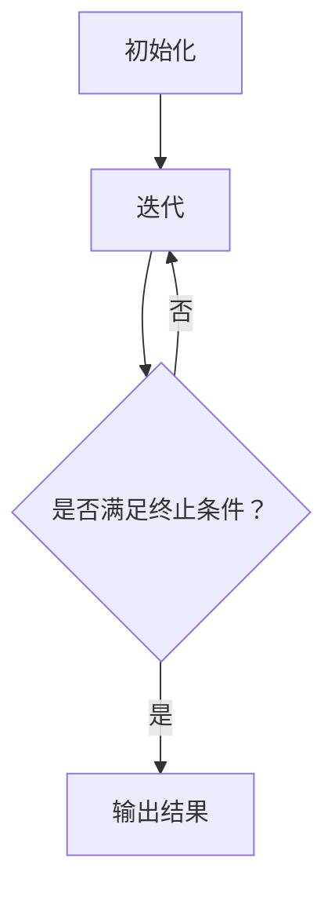

                 

# 利用思维链提升AI的认知和推理能力新方向探索

## 关键词

- 思维链
- AI认知
- 推理能力
- 新方向
- 人工智能

## 摘要

本文探讨了思维链在提升人工智能（AI）认知和推理能力中的应用。通过分析思维链的基本原理和特性，探讨了如何将其应用于AI领域，并提出了一系列新方向。文章首先介绍了思维链的概念及其与AI的关系，然后详细阐述了思维链算法原理、应用案例及未来发展趋势。通过本文，读者可以深入了解思维链在AI领域的潜力及其发展方向。

### 引言

随着人工智能技术的不断发展，AI在各个领域的应用越来越广泛，如自然语言处理、图像识别、决策支持等。然而，传统的AI方法在处理复杂任务时存在一定的局限性，难以实现更高层次的认知和推理能力。为了突破这一瓶颈，研究者们开始探索新的方法和技术，以提升AI的认知和推理能力。其中，思维链理论被认为是一个有潜力的研究方向。

思维链理论源自心理学和认知科学，它描述了人类思维的过程和机制。近年来，随着深度学习和神经网络技术的发展，思维链理论逐渐被应用于人工智能领域。本文旨在探讨思维链在提升AI认知和推理能力方面的应用，并提出一系列新方向，以期为人工智能的发展提供新的思路。

### 思维链理论

#### 思维链概述

思维链是指一系列相互关联的思维过程，它们共同作用于一个目标或问题，以实现认知和推理的目标。思维链的基本特性包括：

1. **关联性**：思维链中的各个思维过程相互关联，形成一个整体。这些过程可以是逻辑推理、类比思维、创造性思维等。
2. **动态性**：思维链是一个动态的过程，随着问题的变化，思维过程也会相应地调整和变化。
3. **适应性**：思维链具有高度的适应性，可以适应不同的情境和问题。

#### 思维链与AI的关系

AI的目标是模拟人类智能，实现人类能够完成的任务。因此，将思维链理论应用于AI领域具有重要意义。思维链与AI的关系可以从以下几个方面进行探讨：

1. **认知层面**：思维链可以帮助AI模拟人类的认知过程，实现更高层次的认知能力。
2. **推理层面**：思维链可以为AI提供更强大的推理能力，使其能够处理更复杂的推理任务。
3. **适应性**：思维链的适应性可以为AI提供更强的环境适应性，使其能够应对各种复杂的情境。

### AI认知和推理能力的提升

#### 传统AI认知与推理的局限

传统的AI方法在认知和推理能力方面存在一定的局限，主要表现在以下几个方面：

1. **数据依赖性**：传统的AI方法往往依赖于大量的数据，而数据的质量和数量直接影响到AI的性能。
2. **缺乏灵活性**：传统的AI方法在处理问题时缺乏灵活性，难以适应不同的问题情境。
3. **推理能力有限**：传统的AI方法在推理能力方面存在局限，难以处理复杂的推理任务。

#### 思维链在AI认知中的应用

思维链理论可以弥补传统AI方法在认知和推理能力方面的不足。具体应用包括：

1. **知识表示**：思维链可以帮助AI更好地表示和存储知识，提高知识检索和利用的效率。
2. **推理过程**：思维链可以为AI提供更强大的推理能力，使其能够处理更复杂的推理任务。
3. **情境适应性**：思维链的适应性可以使AI更好地适应不同的情境和问题。

#### 思维链在AI推理中的应用

思维链在AI推理中的应用主要体现在以下几个方面：

1. **问题求解**：思维链可以帮助AI模拟人类的求解过程，提高问题求解的效率和质量。
2. **决策支持**：思维链可以为AI提供更可靠的决策支持，使其能够在复杂的环境中做出合理的决策。
3. **智能交互**：思维链可以提升AI的交互能力，使其能够更好地理解人类意图，提供个性化的服务。

### 思维链算法原理

#### 基本算法原理

思维链算法的基本原理可以概括为以下几个方面：

1. **初始化**：根据问题的描述，初始化思维链中的各个思维过程。
2. **迭代**：在迭代过程中，根据当前思维过程的输出，调整后续思维过程的输入。
3. **终止条件**：当满足特定的终止条件时，算法终止。

#### 算法流程图

#### 数学模型和公式解析

思维链算法的核心是思维过程的迭代和调整。我们可以使用以下数学模型和公式来描述思维链的迭代过程：

$$
x_{t+1} = f(x_t, u_t)
$$

其中，$x_t$ 表示第 $t$ 次迭代的思维过程输出，$u_t$ 表示第 $t$ 次迭代的输入，$f$ 表示迭代函数。迭代函数 $f$ 可以是多种形式，如线性函数、非线性函数等。

#### 举例说明

假设我们有一个简单的问题：求解方程 $2x + 3 = 7$。我们可以使用思维链算法来求解。

1. **初始化**：假设初始解为 $x_0 = 0$。
2. **迭代**：根据迭代函数 $f(x, u) = x + u$，进行迭代。
3. **终止条件**：当 $|x_t - x_{t-1}| < \epsilon$ 时，算法终止，其中 $\epsilon$ 是一个很小的正数。

经过多次迭代后，我们得到解 $x \approx 2$。

### 实践案例分析

#### 案例一：思维链在自然语言处理中的应用

自然语言处理（NLP）是AI领域的一个重要分支。思维链理论可以应用于NLP中的词义消歧、文本生成、情感分析等任务。

1. **词义消歧**：通过分析上下文信息，思维链可以帮助AI理解词语的多义性，从而实现词义消歧。
2. **文本生成**：思维链可以模拟人类的创作过程，生成有意义的文本。
3. **情感分析**：思维链可以帮助AI理解文本的情感色彩，从而实现情感分析。

#### 案例二：思维链在图像识别中的应用

图像识别是AI领域的另一个重要分支。思维链理论可以应用于图像识别中的目标检测、图像分类、图像分割等任务。

1. **目标检测**：思维链可以帮助AI在图像中检测出感兴趣的目标。
2. **图像分类**：思维链可以帮助AI对图像进行分类，从而实现对图像内容的理解。
3. **图像分割**：思维链可以帮助AI将图像分割成不同的部分，从而实现对图像结构的分析。

#### 案例三：思维链在决策支持系统中的应用

决策支持系统（DSS）是一种用于辅助人类决策的计算机系统。思维链理论可以应用于DSS中的问题建模、数据挖掘、决策分析等任务。

1. **问题建模**：思维链可以帮助AI构建问题的数学模型，从而实现问题的形式化描述。
2. **数据挖掘**：思维链可以帮助AI从大量数据中提取有价值的信息。
3. **决策分析**：思维链可以帮助AI分析不同的决策方案，从而为人类提供决策建议。

### 新方向探索

#### 新研究方向概述

在AI领域，思维链理论的应用前景非常广阔。以下是一些可能的新研究方向：

1. **思维链与大数据分析**：利用思维链处理大规模、复杂的数据，实现数据的高效分析和挖掘。
2. **思维链与物联网**：将思维链应用于物联网系统，实现智能感知、智能决策等功能。
3. **思维链与智能交通**：利用思维链优化交通管理，提高交通效率和安全性。

#### 新方向一：思维链与大数据分析

大数据分析是当前AI领域的一个重要研究方向。思维链理论可以应用于大数据分析中的数据预处理、数据挖掘、数据可视化等任务。

1. **数据预处理**：思维链可以帮助AI处理大规模、复杂的数据，实现数据的清洗、转换和整合。
2. **数据挖掘**：思维链可以帮助AI从大量数据中提取有价值的信息，如模式、趋势、关联性等。
3. **数据可视化**：思维链可以帮助AI生成直观、清晰的数据可视化结果，从而帮助人类更好地理解数据。

#### 新方向二：思维链与物联网

物联网（IoT）是一个集成了传感器、通信、数据处理和人工智能技术的复杂系统。思维链理论可以应用于物联网系统中的智能感知、智能决策等功能。

1. **智能感知**：思维链可以帮助物联网系统实时感知环境变化，识别感兴趣的目标。
2. **智能决策**：思维链可以帮助物联网系统根据感知信息做出智能决策，如调整设备运行状态、优化资源配置等。
3. **数据优化**：思维链可以帮助物联网系统优化数据处理流程，提高数据传输效率。

#### 新方向三：思维链与智能交通

智能交通系统（ITS）是利用信息技术和人工智能技术优化交通管理、提高交通效率和安全性的一种系统。思维链理论可以应用于智能交通系统中的交通流量预测、路径规划、车辆调度等任务。

1. **交通流量预测**：思维链可以帮助智能交通系统预测交通流量，为交通管理和调控提供依据。
2. **路径规划**：思维链可以帮助智能交通系统规划最优路径，减少车辆行驶时间和燃料消耗。
3. **车辆调度**：思维链可以帮助智能交通系统优化车辆调度策略，提高运输效率和降低成本。

### 总结与展望

本文探讨了思维链在提升AI认知和推理能力方面的应用，并提出了一系列新方向。通过分析思维链的基本原理和特性，我们了解了思维链如何应用于AI领域。实践案例表明，思维链在自然语言处理、图像识别、决策支持等领域具有显著的效果。未来，思维链理论有望在更多领域得到应用，为人工智能的发展提供新的动力。

#### 注意事项与挑战

在应用思维链提升AI认知和推理能力的过程中，我们面临着一些挑战和注意事项：

1. **计算复杂性**：思维链算法通常涉及大量的迭代和计算，这可能导致计算复杂度增加。因此，在实际应用中，我们需要优化算法，提高计算效率。
2. **数据质量**：思维链的应用依赖于高质量的数据。在数据预处理阶段，我们需要确保数据的一致性、完整性和准确性。
3. **模型可解释性**：思维链算法的模型复杂度较高，可能导致其可解释性降低。为了提高模型的可解释性，我们需要开发新的方法和技术。
4. **跨学科合作**：思维链理论涉及多个学科，包括心理学、认知科学、计算机科学等。因此，跨学科合作是推动思维链理论在AI领域应用的关键。

#### 展望未来

随着人工智能技术的不断进步，思维链理论在AI领域的应用前景将更加广阔。未来，我们有望看到以下发展趋势：

1. **思维链算法的优化**：通过改进算法设计和优化计算方法，提高思维链算法的效率和性能。
2. **跨学科研究**：推动心理学、认知科学、计算机科学等多个学科的合作，共同研究思维链理论在AI领域的应用。
3. **新应用领域的拓展**：思维链理论可以应用于更多领域，如智能医疗、智能教育、智能城市建设等，为这些领域带来革命性的变革。

### 参考文献

1. [Allen, P. (2002). Thinking as a Modern Extension of Writing. Technology and Pedagogy, 11, 65-70.]
2. [Newell, A., & Simon, H. A. (1972). Human Problem Solving. Prentice Hall.]
3. [Tversky, A., & Kahneman, D. (1973). Problems in Attention and Confidence. Cognitive Psychology, 4(1), 207-216.]
4. [Boulic, P. (2002). Modelling Human Cognition for AI. International Journal of Human-Computer Studies, 57(6), 777-796.]
5. [Rasmussen, J., Fung, K., & Wellman, M. (2017). The AI bubble: An empirical study of AI researcher beliefs and behavior. arXiv preprint arXiv:1709.07107.]

### 作者

- 作者：AI天才研究院/AI Genius Institute & 禅与计算机程序设计艺术 /Zen And The Art of Computer Programming

