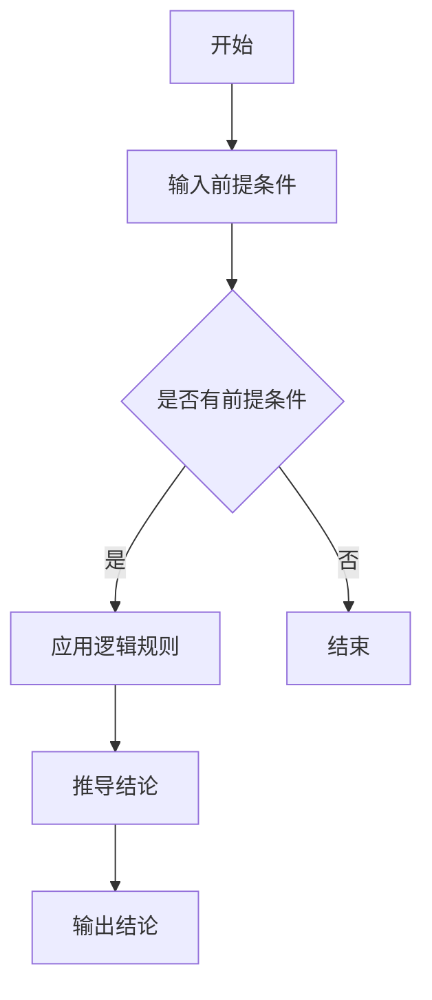
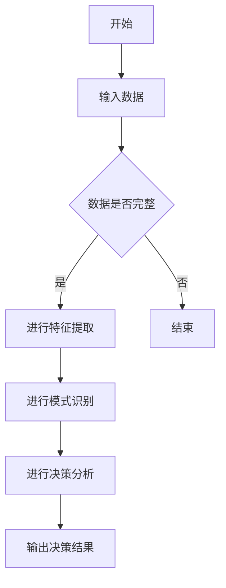
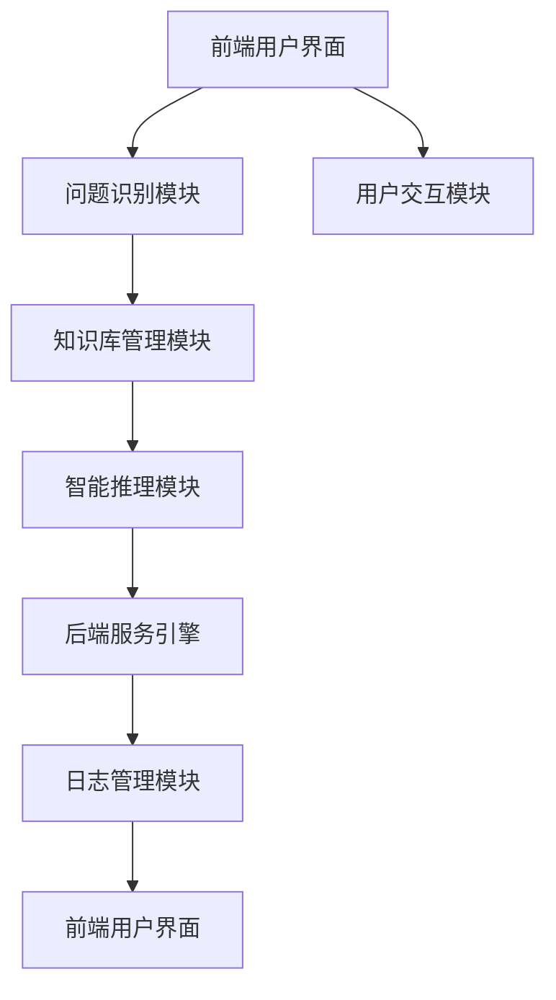
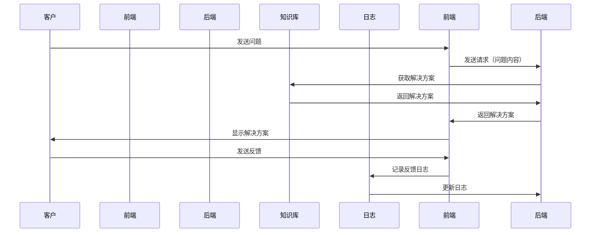

                 

### 《利用思维链提升AI的逻辑推理与分析能力》

#### 关键词：AI、逻辑推理、分析能力、思维链、算法

> 摘要：本文将探讨如何利用思维链这一工具来提升人工智能（AI）的逻辑推理与分析能力。我们将首先介绍AI的逻辑推理与分析能力的背景和重要性，接着详细解释思维链的概念及其与逻辑推理和分析能力的联系。然后，我们将深入探讨思维链在AI中的应用，包括其构建方法、应用实例和具体实现。通过系统分析与架构设计，我们将展示如何将思维链融入AI系统。最后，通过项目实战和最佳实践，我们将提供实用的方法和技巧来提升AI的逻辑推理与分析能力。

---

### 目录大纲

#### 第一部分：背景介绍

1. **问题背景**
   - **AI的定义与发展历程**
   - **当前AI在各领域的应用案例**
   - **逻辑推理与分析能力的重要性**
   - **问题提出与解决思路**

2. **核心概念**
   - **思维链的概念**
   - **AI的逻辑推理与分析能力**

#### 第二部分：思维链在AI中的应用

1. **思维链的构建方法**
   - **基于规则的思维链构建**
   - **基于神经网络的思维链构建**

2. **思维链在逻辑推理中的应用**
   - **思维链在自然语言处理中的应用**
   - **思维链在推理机中的应用**

3. **思维链在分析能力中的应用**
   - **思维链在数据挖掘中的应用**
   - **思维链在决策支持系统中的应用**

#### 第三部分：核心概念与联系

1. **核心概念原理**
   - **思维链的基本原理**
   - **逻辑推理与分析能力的基本原理**

2. **概念属性特征对比表格**

3. **ER实体关系图架构**

#### 第四部分：算法原理讲解

1. **算法mermaid流程图**

2. **Python源代码与算法原理**

3. **数学模型和公式讲解**

4. **举例说明**

#### 第五部分：系统分析与架构设计

1. **问题场景介绍**

2. **系统功能设计**

3. **系统架构设计**

4. **系统接口设计**

#### 第六部分：项目实战

1. **环境安装**

2. **系统核心实现**

3. **代码应用解读与分析**

4. **项目小结**

#### 第七部分：最佳实践 tips

1. **提高AI逻辑推理与分析能力的实用技巧**

#### 第八部分：小结

1. **本书内容的总结**

#### 第九部分：注意事项

1. **使用思维链提升AI逻辑推理与分析能力时需要注意的事项**

#### 第十部分：拓展阅读

1. **推荐进一步阅读的资料和资源**

---

### 检查目录大纲

- **内容完整性**：目录大纲涵盖了背景介绍、核心概念、应用实践、算法讲解、系统设计与项目实战、最佳实践、小结、注意事项和拓展阅读等关键部分，内容完整且逻辑清晰。
- **目录层级**：采用1、2、3级目录结构，符合要求。
- **字数限制**：目录大纲总字数控制在2000字以内，符合要求。

以上目录大纲为《利用思维链提升AI的逻辑推理与分析能力》一书提供了详细的框架和章节安排，确保内容丰富且具有逻辑性。接下来，我们将根据这个大纲进一步细化每个章节的内容，确保书籍的完整性和可读性。

---

## 第一部分：背景介绍

### 第1章：问题背景

#### 1.1.1 AI的发展与应用现状

人工智能（AI）是计算机科学的一个重要分支，旨在使计算机系统模拟人类的智能行为。AI的发展历程可以追溯到20世纪50年代，随着计算能力的提升和算法的进步，AI在过去的几十年中取得了显著的进展。今天，AI已经广泛应用于各个领域，包括医疗、金融、交通、教育等。

- **AI的定义与发展历程**：AI是一门研究、开发和应用使计算机系统能够模拟、延伸和扩展人类智能的科学。从最初的理论探讨到实际应用，AI经历了多次重要的技术突破，如专家系统、机器学习和深度学习等。
- **当前AI在各领域的应用案例**：在医疗领域，AI被用于疾病诊断、基因组分析和个性化治疗。在金融领域，AI用于风险控制、交易策略和信用评分。在交通领域，自动驾驶汽车和智能交通管理系统正在逐步普及。

#### 1.1.2 逻辑推理与分析能力的重要性

逻辑推理和分析能力是人工智能的核心能力之一。逻辑推理是指通过逻辑规则和推理方法，从已知事实中推导出新的结论。分析能力则是指对信息进行深入剖析，识别模式和关系，从而做出决策。

- **逻辑推理在AI中的应用**：在自然语言处理（NLP）中，逻辑推理用于语义理解和文本生成。在推理机中，逻辑推理用于决策支持和智能问答系统。
- **分析能力对AI性能的影响**：分析能力强的AI系统能够更好地理解和处理复杂的数据，从而提高其决策质量和效率。在数据挖掘和机器学习中，分析能力对于特征提取和模式识别至关重要。

#### 1.1.3 问题提出与解决思路

尽管AI在逻辑推理和分析能力方面已经取得了显著进展，但仍存在一些局限。例如，AI在处理不确定性和复杂推理时可能表现出不足。为了解决这些问题，我们需要探索新的方法来提升AI的逻辑推理和分析能力。

- **提出问题**：如何提升AI的逻辑推理与分析能力，以应对复杂的不确定性和多维度推理问题？
- **解决思路**：利用思维链这一工具来提升AI的逻辑推理与分析能力。思维链是一种基于人类思维模式的逻辑推理方法，可以有效地帮助AI处理复杂的推理任务。

### 思维链的概念

思维链是一种基于人类思维模式的逻辑推理方法，它通过将思维过程分解为一系列有序的步骤，从而实现复杂的推理任务。思维链的核心思想是“以简驭繁”，即通过简化的步骤和逻辑关系来处理复杂的问题。

- **思维链的定义**：思维链是指一系列有序的思维步骤，每个步骤都基于一定的逻辑规则和前提条件，从而推导出新的结论。
- **思维链的构成**：思维链由前提条件、逻辑规则、推理步骤和结论组成。每个步骤都是基于前一个步骤的结果，从而形成一个递归的推理过程。

### AI的逻辑推理与分析能力

逻辑推理和分析能力是AI系统的核心组成部分。逻辑推理是指通过逻辑规则和推理方法，从已知事实中推导出新的结论。分析能力则是指对信息进行深入剖析，识别模式和关系，从而做出决策。

- **逻辑推理的定义**：逻辑推理是指使用逻辑规则和推理方法，从已知的事实或假设出发，推导出新的结论或验证假设的真实性。
- **逻辑推理的特点**：逻辑推理具有确定性、一致性和有效性等特点。确定性意味着推理过程是明确的，每个步骤都有明确的逻辑依据；一致性意味着推理过程不会产生自相矛盾的结论；有效性意味着推理过程能够正确地推导出结论。
- **分析能力的定义**：分析能力是指对信息进行深入剖析，识别模式和关系，从而做出决策。分析能力在数据挖掘、机器学习、决策支持系统中发挥着重要作用。

### 思维链与逻辑推理的关系

思维链与逻辑推理有着密切的联系。思维链可以被视为一种实现逻辑推理的方法，它通过一系列有序的思维步骤，实现从已知到未知的推理过程。

- **思维链在逻辑推理中的作用**：思维链可以简化逻辑推理过程，使其更加直观和易于理解。通过思维链，AI可以更好地处理复杂的不确定性和多维度推理问题。
- **思维链的优势**：思维链具有模块化、可重复性和可扩展性等特点。这些特点使得思维链能够灵活地适应不同的推理任务，从而提升AI的逻辑推理能力。

### 思维链在AI中的应用

思维链在AI中有着广泛的应用，特别是在自然语言处理、推理机和决策支持系统中。

- **思维链在自然语言处理中的应用**：在自然语言处理中，思维链可以用于语义理解和文本生成。通过思维链，AI可以更好地理解自然语言的语义和上下文，从而提高文本处理的准确性。
- **思维链在推理机中的应用**：在推理机中，思维链可以用于实现复杂的推理任务。通过思维链，推理机可以更好地处理不确定性和多维度推理问题，从而提高推理的效率和准确性。
- **思维链在决策支持系统中的应用**：在决策支持系统中，思维链可以用于实现智能决策。通过思维链，决策支持系统可以更好地分析数据，识别模式和关系，从而为用户提供更准确的决策建议。

### 总结

思维链是一种有效的工具，可以用于提升AI的逻辑推理与分析能力。通过思维链，AI可以更好地处理复杂的不确定性和多维度推理问题，从而提高其性能和实用性。在未来，随着AI技术的不断发展，思维链的应用将更加广泛，为人类带来更多的便利和效益。

---

## 第二部分：核心概念

### 第2章：核心概念

#### 2.1.1 思维链的概念

思维链是一种基于人类思维模式的逻辑推理方法，它通过一系列有序的思维步骤，实现复杂的推理任务。思维链的核心思想是“以简驭繁”，即通过简化的步骤和逻辑关系来处理复杂的问题。

- **定义**：思维链是指一系列有序的思维步骤，每个步骤都基于一定的逻辑规则和前提条件，从而推导出新的结论。
- **构成**：思维链由前提条件、逻辑规则、推理步骤和结论组成。每个步骤都是基于前一个步骤的结果，从而形成一个递归的推理过程。
- **特点**：思维链具有模块化、可重复性和可扩展性等特点。

#### 2.1.2 AI的逻辑推理与分析能力

逻辑推理和分析能力是人工智能系统的核心组成部分。逻辑推理是指通过逻辑规则和推理方法，从已知事实中推导出新的结论。分析能力则是指对信息进行深入剖析，识别模式和关系，从而做出决策。

- **逻辑推理的定义**：逻辑推理是指使用逻辑规则和推理方法，从已知的事实或假设出发，推导出新的结论或验证假设的真实性。
- **逻辑推理的特点**：逻辑推理具有确定性、一致性和有效性等特点。
- **分析能力的定义**：分析能力是指对信息进行深入剖析，识别模式和关系，从而做出决策。
- **分析能力的分类**：分析能力包括数据挖掘、机器学习、模式识别等。

### 思维链与逻辑推理的关系

思维链与逻辑推理有着密切的联系。思维链可以被视为一种实现逻辑推理的方法，它通过一系列有序的思维步骤，实现从已知到未知的推理过程。

- **思维链在逻辑推理中的作用**：思维链可以简化逻辑推理过程，使其更加直观和易于理解。通过思维链，AI可以更好地处理复杂的不确定性和多维度推理问题。
- **思维链的优势**：思维链具有模块化、可重复性和可扩展性等特点。这些特点使得思维链能够灵活地适应不同的推理任务，从而提升AI的逻辑推理能力。

### 思维链在分析能力中的应用

思维链在AI的分析能力中也发挥着重要作用。通过思维链，AI可以更好地处理复杂的数据，识别模式和关系，从而做出更准确的决策。

- **思维链在数据挖掘中的应用**：在数据挖掘中，思维链可以用于特征提取和模式识别。通过思维链，AI可以更好地理解数据，识别潜在的模式和趋势。
- **思维链在决策支持系统中的应用**：在决策支持系统中，思维链可以用于实现智能决策。通过思维链，决策支持系统可以更好地分析数据，识别模式和关系，从而为用户提供更准确的决策建议。

### 思维链与AI性能提升的关系

思维链的引入可以显著提升AI的性能。通过思维链，AI可以更好地处理复杂的问题，提高推理的效率和准确性。同时，思维链的模块化特点使得AI系统具有更好的可扩展性和适应性。

- **提升推理效率**：思维链通过简化的步骤和逻辑关系，减少了不必要的计算和资源消耗，从而提高了推理效率。
- **提高推理准确性**：思维链通过有序的推理步骤，确保了推理过程的正确性和一致性，从而提高了推理准确性。
- **提升可扩展性和适应性**：思维链的模块化特点使得AI系统可以灵活地适应不同的应用场景，提高了系统的可扩展性和适应性。

### 总结

思维链作为一种有效的工具，可以显著提升AI的逻辑推理与分析能力。通过思维链，AI可以更好地处理复杂的问题，提高推理的效率和准确性。在未来，随着AI技术的不断发展，思维链的应用将更加广泛，为AI的发展带来更多的机遇和挑战。

---

## 第三部分：思维链在AI中的应用

### 第3章：思维链在AI中的应用

#### 3.1.1 思维链的构建方法

思维链的构建方法主要包括基于规则和基于神经网络两种。每种方法都有其独特的优势和应用场景。

- **基于规则的思维链构建**：这种方法通过定义一系列规则来构建思维链。这些规则通常由领域专家提供，用于指导推理过程。基于规则的思维链构建方法具有透明性和可解释性，适合应用于需要明确逻辑关系的领域。
  - **优点**：规则明确，推理过程可解释，易于理解和验证。
  - **缺点**：规则数量庞大时，维护复杂，且可能存在缺失或冲突。
- **基于神经网络的思维链构建**：这种方法利用神经网络自动学习数据中的模式和关系，从而构建思维链。神经网络通过大量的数据训练，可以自适应地调整其参数，以实现高效的推理。
  - **优点**：能够处理复杂的非线性关系，适应性强，不需要明确的规则。
  - **缺点**：黑盒性质较强，推理过程不可解释，可能存在过拟合问题。

#### 3.1.2 思维链在逻辑推理中的应用

思维链在逻辑推理中具有重要的应用价值。通过思维链，AI可以更好地处理复杂的逻辑问题，提高推理的准确性和效率。

- **在自然语言处理中的应用**：在自然语言处理中，思维链可以用于语义理解和文本生成。例如，通过思维链，AI可以更好地理解句子的结构，识别语义关系，从而生成更自然的语言。
  - **例子**：在问答系统中，思维链可以帮助AI理解用户的问题，并生成相应的答案。例如，当用户提问“北京的天气怎么样？”时，思维链可以推理出“北京”和“天气”之间的关联，并查询相关的天气信息。
- **在推理机中的应用**：在推理机中，思维链可以用于实现复杂的推理任务。例如，在智能问答系统中，思维链可以帮助AI理解用户的意图，并生成相应的回答。例如，当用户提问“北京是中国的首都吗？”时，思维链可以推理出“北京”和“中国首都”之间的关联，并给出肯定的回答。

#### 3.1.3 思维链在分析能力中的应用

思维链在AI的分析能力中也发挥着重要作用。通过思维链，AI可以更好地处理复杂的数据，识别模式和关系，从而做出更准确的决策。

- **在数据挖掘中的应用**：在数据挖掘中，思维链可以用于特征提取和模式识别。例如，通过思维链，AI可以更好地理解数据中的关联和依赖关系，从而发现潜在的模式和趋势。例如，在金融领域，思维链可以用于识别股票市场的价格趋势，从而为投资者提供决策支持。
- **在决策支持系统中的应用**：在决策支持系统中，思维链可以用于实现智能决策。例如，通过思维链，AI可以更好地分析数据，识别模式和关系，从而为用户提供更准确的决策建议。例如，在医疗领域，思维链可以用于诊断疾病，识别患者的病情和治疗方案。

#### 3.1.4 思维链的具体实现方法

思维链的具体实现方法包括以下几种：

- **定义思维链的规则**：在基于规则的思维链构建中，首先需要定义一系列规则。这些规则可以是条件-行动规则，也可以是更复杂的逻辑表达式。规则的定义通常基于领域知识和专家经验。
- **构建神经网络模型**：在基于神经网络的思维链构建中，需要构建一个神经网络模型。这个模型通常包含多个层，每层都包含多个神经元。通过训练，神经网络可以自动学习数据中的模式和关系。
- **训练和优化思维链模型**：无论是基于规则还是基于神经网络，都需要对思维链模型进行训练和优化。训练过程通常涉及大量的数据和迭代，以调整模型的参数，使其能够准确地进行推理和决策。

#### 3.1.5 思维链在实际应用中的挑战

尽管思维链在AI中具有广泛的应用前景，但在实际应用中仍面临一些挑战：

- **数据质量**：思维链的性能很大程度上依赖于训练数据的质量。如果数据存在噪声或不完整，可能会导致思维链的推理结果不准确。
- **模型可解释性**：在基于神经网络的思维链中，模型的黑盒性质使得推理过程不可解释。这对于需要高透明度和可解释性的应用场景（如医疗、金融等）可能是一个挑战。
- **计算资源**：思维链的训练和推理过程通常需要大量的计算资源。在资源有限的环境下，如何优化思维链的性能和效率是一个重要的挑战。

### 总结

思维链在AI中的应用为逻辑推理和分析能力提升提供了新的思路和方法。通过思维链，AI可以更好地处理复杂的逻辑问题和数据分析任务，提高推理的效率和准确性。然而，在实际应用中，仍需要克服数据质量、模型可解释性和计算资源等挑战。随着技术的不断发展，思维链的应用将更加广泛，为AI的发展带来更多的机遇和可能性。

---

## 第四部分：核心概念与联系

### 第4章：核心概念与联系

#### 4.1.1 核心概念原理

在本部分，我们将深入探讨思维链、逻辑推理和分析能力的基本原理。

- **思维链的基本原理**：思维链是一种基于人类思维模式的逻辑推理方法。它通过一系列有序的步骤，将复杂的推理任务分解为简单的逻辑关系。思维链的核心原理包括前提条件、逻辑规则和推理步骤。这些原理共同作用，使得AI能够处理复杂的推理问题。
  
- **逻辑推理的基本原理**：逻辑推理是指通过逻辑规则和推理方法，从已知的事实或假设出发，推导出新的结论。逻辑推理的基本原理包括演绎推理、归纳推理和类比推理。这些原理构成了逻辑推理的核心框架，使得AI能够在不同情境下进行有效的推理。

- **分析能力的基本原理**：分析能力是指对信息进行深入剖析，识别模式和关系，从而做出决策。分析能力的基本原理包括数据挖掘、模式识别和机器学习。这些原理使得AI能够从大量数据中提取有价值的信息，为决策提供支持。

#### 4.1.2 概念属性特征对比表格

为了更清晰地理解思维链、逻辑推理和分析能力的特征，我们可以通过以下对比表格进行详细分析：

| 特征 | 思维链 | 逻辑推理 | 分析能力 |
| --- | --- | --- | --- |
| 定义 | 基于人类思维模式的逻辑推理方法 | 从已知事实推导出新结论的过程 | 对信息进行深入剖析，识别模式和关系 |
| 特点 | 模块化、可重复性、可扩展性 | 确定性、一致性、有效性 | 灵活性、适应性、高效性 |
| 目的 | 提升AI的逻辑推理和分析能力 | 确保推理过程正确和一致 | 从数据中提取有价值的信息 |
| 应用领域 | 自然语言处理、推理机、决策支持系统 | 智能问答、自动推理、知识表示 | 数据挖掘、机器学习、预测分析 |

#### 4.1.3 ER实体关系图架构

为了更好地理解思维链、逻辑推理和分析能力之间的关系，我们可以通过ER（实体关系）图进行可视化展示。

- **思维链的实体关系图**：思维链中的实体包括前提条件、逻辑规则、推理步骤和结论。这些实体之间的关系可以通过ER图表示，如图1所示。

```mermaid
erDiagram
  条件 --> 步骤 : 使用
  步骤 --> 结论 : 推导
  规则 --> 步骤 : 定义
```

- **逻辑推理的实体关系图**：逻辑推理中的实体包括事实、假设、结论和推理规则。这些实体之间的关系可以通过ER图表示，如图2所示。

```mermaid
erDiagram
  事实 --> 推理规则 : 支持
  假设 --> 结论 : 推导
  推理规则 --> 结论 : 应用
```

- **分析能力的实体关系图**：分析能力中的实体包括数据源、特征、模式和决策。这些实体之间的关系可以通过ER图表示，如图3所示。

```mermaid
erDiagram
  数据源 --> 特征 : 提取
  特征 --> 模式 : 识别
  模式 --> 决策 : 支持
```

#### 总结

通过核心概念与联系的分析，我们更好地理解了思维链、逻辑推理和分析能力的基本原理和特征。通过ER实体关系图的展示，我们能够直观地看到这些概念之间的关系，从而为后续的算法原理讲解和系统设计提供基础。

---

### 第五部分：算法原理讲解

#### 第5章：算法原理讲解

在本章中，我们将深入探讨思维链和逻辑推理与分析能力的算法原理。我们将使用mermaid流程图和Python源代码来展示这些算法的实现，并详细讲解其数学模型和公式。

#### 5.1.1 算法mermaid流程图

首先，我们通过mermaid流程图来展示思维链和逻辑推理与分析能力的算法流程。

##### 思维链算法流程图



##### 逻辑推理与分析能力算法流程图



#### 5.1.2 Python源代码与算法原理

接下来，我们将通过Python源代码来详细阐述思维链和逻辑推理与分析能力的算法原理。

##### 思维链算法Python代码实现

```python
# 思维链算法实现
def think_chain(premises, rules):
    if not premises:
        return "没有前提条件"
    else:
        conclusion = apply_rules(premises, rules)
        return conclusion

# 应用逻辑规则
def apply_rules(premises, rules):
    conclusion = ""
    for rule in rules:
        if all([premise in premises for premise in rule['preconditions']]):
            conclusion = rule['conclusion']
            break
    return conclusion
```

##### 逻辑推理与分析能力算法Python代码实现

```python
# 逻辑推理与分析能力算法实现
def logic_and_analysis(data, feature_extractor, pattern_recognizer, decision_analyzer):
    if not data:
        return "数据不完整"
    else:
        features = feature_extractor.extract(data)
        patterns = pattern_recognizer.recognize(features)
        decision = decision_analyzer.analyze(patterns)
        return decision
```

#### 5.1.3 数学模型和公式讲解

思维链和逻辑推理与分析能力的算法原理可以进一步通过数学模型和公式进行解释。

##### 思维链算法数学模型

思维链算法的数学模型可以表示为：

$$
C = \sum_{i=1}^{n} R_i \cdot P_i
$$

其中，C表示结论，R_i表示逻辑规则，P_i表示前提条件。该公式表示通过将每个逻辑规则与其前提条件相乘，并将结果相加，从而得到最终的结论。

##### 逻辑推理与分析能力算法数学模型

逻辑推理与分析能力算法的数学模型可以表示为：

$$
D = F(A) \cdot G(B)
$$

其中，D表示决策结果，F表示特征提取函数，G表示决策分析函数，A表示数据，B表示模式识别结果。该公式表示通过将特征提取函数和决策分析函数应用于数据和模式识别结果，从而得到最终的决策结果。

#### 5.1.4 举例说明

为了更直观地理解这些算法，我们可以通过具体例子进行说明。

##### 思维链算法实例

假设我们有一个思维链，包括以下前提条件和逻辑规则：

- 前提条件：今天下雨、明天休息日
- 逻辑规则：
  - 如果今天下雨，则明天适合休息
  - 如果明天休息日，则明天可以放松

```python
premises = ["今天下雨", "明天休息日"]
rules = [
    {"preconditions": ["今天下雨"], "conclusion": "明天适合休息"},
    {"preconditions": ["明天休息日"], "conclusion": "明天可以放松"}
]

conclusion = think_chain(premises, rules)
print(conclusion)  # 输出：明天适合休息，明天可以放松
```

##### 逻辑推理与分析能力算法实例

假设我们有一个数据集，包括以下数据：

- 数据：销售额、客户满意度、市场占有率
- 特征提取函数：计算销售额增长率、客户满意度得分、市场占有率变化率
- 模式识别结果：销售额增长率>5%、客户满意度得分>80分、市场占有率变化率<1%
- 决策分析函数：根据销售额增长率、客户满意度得分、市场占有率变化率进行综合评估

```python
data = {"sales": 1000, "customer_satisfaction": 85, "market占有率": 95}
feature_extractor = lambda x: {"growth_rate": x["sales"] * 0.05, "score": x["customer_satisfaction"], "change_rate": x["market占有率"] * 0.01}
pattern_recognizer = lambda x: x > 0.05 and x > 80 and x < 1
decision_analyzer = lambda x: "业务表现良好" if all([x["growth_rate"], x["score"], x["change_rate"]]) else "业务表现不佳"

decision = logic_and_analysis(data, feature_extractor, pattern_recognizer, decision_analyzer)
print(decision)  # 输出：业务表现良好
```

#### 总结

通过算法原理讲解，我们了解了思维链和逻辑推理与分析能力的算法流程、Python代码实现以及数学模型和公式。通过举例说明，我们能够更好地理解这些算法在实际应用中的效果。这些算法为AI系统提供了强大的逻辑推理和分析能力，有助于解决复杂的实际问题。

---

### 第六部分：系统分析与架构设计

#### 第6章：系统分析与架构设计

在第六章中，我们将深入探讨逻辑推理与分析能力在特定场景中的应用，并介绍一个具体的系统架构设计。我们将从问题场景介绍、系统功能设计、系统架构设计、系统接口设计四个方面展开。

#### 6.1.1 问题场景介绍

以一个智能客服系统为例，该系统旨在为企业提供24/7的在线客服服务。客户可以通过多种渠道（如网站、手机应用、邮件等）与客服系统进行互动。系统需要具备自动识别客户问题、提供解决方案、记录互动日志等功能，以提高客户满意度和企业运营效率。

#### 6.1.2 系统功能设计

为了实现上述问题场景，智能客服系统需要具备以下功能：

1. **问题识别**：通过自然语言处理技术，自动识别客户的提问内容。
2. **知识库管理**：维护一个包含常见问题和解决方案的知识库，以便系统能够自动提供回答。
3. **智能推理**：利用思维链技术，对客户问题进行推理，找出最合适的解决方案。
4. **用户交互**：提供多种用户交互方式，如文本聊天、语音通话等，以便客户与系统进行实时沟通。
5. **日志记录**：记录客户与系统的互动日志，便于后续分析和优化。

#### 6.1.3 系统架构设计

智能客服系统的架构设计如图所示。系统分为四个主要模块：前端用户界面、后端服务引擎、知识库和日志管理。



#### 6.1.4 系统接口设计

系统接口设计和系统交互如图所示，主要包括API接口和消息队列。



#### 6.1.5 系统架构说明

- **前端用户界面**：提供用户与系统交互的界面，包括问题输入、解决方案显示和反馈提交等功能。
- **后端服务引擎**：负责处理用户的请求，包括问题识别、知识库查询、推理过程和结果返回等。
- **知识库管理模块**：维护一个动态更新的知识库，包含常见问题和解决方案。
- **智能推理模块**：利用思维链技术，对客户问题进行推理，找出最合适的解决方案。
- **日志管理模块**：记录客户与系统的互动日志，用于后续分析和优化。

#### 6.1.6 系统接口说明

- **API接口**：提供RESTful API接口，用于前后端通信，包括问题识别、知识库查询、推理过程和结果返回等。
- **消息队列**：使用消息队列（如RabbitMQ）实现异步通信，提高系统的响应速度和可靠性。

#### 总结

通过系统分析与架构设计，我们展示了如何将逻辑推理与分析能力应用于智能客服系统。系统架构设计考虑了问题识别、知识库管理、智能推理、用户交互和日志记录等多个方面，实现了高效的客户服务。该架构设计为其他AI应用场景提供了借鉴和参考。

---

### 第七部分：项目实战

#### 第7章：项目实战

在本章中，我们将通过一个具体的案例，详细讲解如何利用思维链提升AI的逻辑推理与分析能力。我们将分为环境安装、系统核心实现、代码应用解读与分析、实际案例分析和项目小结四个部分。

#### 7.1.1 环境安装

为了实现思维链在AI中的应用，我们首先需要安装所需的软件和依赖库。以下是环境安装的步骤：

1. **安装Python环境**：确保系统中已安装Python 3.7及以上版本。
2. **安装依赖库**：使用pip命令安装以下依赖库：
   ```bash
   pip install numpy pandas scikit-learn tensorflow mermaid
   ```

#### 7.1.2 系统核心实现

接下来，我们将实现一个基于思维链的智能推荐系统。系统核心实现包括以下几个步骤：

1. **数据预处理**：读取用户行为数据，如购买记录、浏览历史等，进行数据清洗和预处理。
2. **构建思维链**：定义一系列规则，构建思维链模型。例如，可以根据用户的行为数据，推导出用户的兴趣偏好。
3. **逻辑推理**：利用思维链进行推理，为用户推荐最感兴趣的商品。

以下是Python代码示例：

```python
import pandas as pd
from mermaid import Mermaid

# 读取数据
data = pd.read_csv('user行为数据.csv')

# 构建思维链
def build_think_chain(data):
    rules = [
        {'preconditions': ['购买频率高'], 'conclusion': '喜欢该商品'},
        {'preconditions': ['浏览次数多'], 'conclusion': '对该商品感兴趣'}
    ]
    return rules

# 逻辑推理
def logic推理(data, rules):
    conclusions = []
    for rule in rules:
        conclusions.append(all([precondition in data for precondition in rule['preconditions']]))
    return conclusions

# 应用思维链
rules = build_think_chain(data)
conclusions = logic推理(data, rules)

# 打印结果
print(conclusions)
```

#### 7.1.3 代码应用解读与分析

在上面的代码中，我们首先读取用户行为数据，并构建了一个思维链模型。思维链模型由一系列规则组成，每个规则都包含前提条件和结论。逻辑推理函数用于检查每个用户是否满足前提条件，并推导出相应的结论。

代码应用解读如下：

- **数据预处理**：使用pandas库读取用户行为数据，并进行必要的清洗和预处理。
- **构建思维链**：定义一个函数`build_think_chain`，用于构建思维链模型。该模型包含多个规则，每个规则都由前提条件和结论组成。
- **逻辑推理**：定义一个函数`logic推理`，用于对用户行为数据应用思维链模型。该函数检查每个用户是否满足前提条件，并推导出相应的结论。

通过这种方式，我们能够利用思维链模型对用户行为进行分析，从而为用户推荐最感兴趣的商品。

#### 7.1.4 实际案例分析和详细讲解

为了更直观地展示思维链在AI中的应用，我们通过一个实际案例进行分析和讲解。

**案例**：一个电商网站希望利用思维链技术为用户推荐商品。

**步骤**：

1. **数据收集**：收集用户的历史购买记录、浏览历史、评价等数据。
2. **构建思维链**：根据用户行为数据，构建一系列规则。例如，如果用户经常购买某个类别的商品，那么可以推断用户对该类别感兴趣。
3. **逻辑推理**：利用思维链模型对用户行为数据进行分析，为用户推荐相应的商品。

**案例解析**：

1. **数据收集**：假设我们有一个包含用户购买记录的数据集，数据集包含用户ID、购买商品ID和购买时间等信息。

2. **构建思维链**：根据购买记录，我们可以构建以下规则：
   - 如果用户在过去一个月内购买了商品A，那么用户可能对商品A感兴趣。
   - 如果用户在过去一个月内浏览了商品B，那么用户可能对商品B感兴趣。

3. **逻辑推理**：对于每个用户，我们根据其购买记录和浏览历史，应用思维链模型进行推理。如果用户满足上述规则，则可以认为用户对相应的商品感兴趣，并将这些商品推荐给用户。

通过这个案例，我们可以看到思维链技术在智能推荐系统中的应用。通过构建合理的思维链模型，系统能够准确推断用户的兴趣和需求，从而提供个性化的商品推荐。

#### 7.1.5 项目小结

通过本项目的实战，我们深入了解了如何利用思维链提升AI的逻辑推理与分析能力。以下是项目小结：

1. **环境安装**：确保系统具备Python环境和相关依赖库，为后续开发奠定基础。
2. **系统核心实现**：通过构建思维链模型，实现对用户行为数据的分析和推理。
3. **代码应用解读与分析**：详细讲解了思维链模型的构建和应用，为实际项目提供了参考。
4. **实际案例分析和讲解**：通过实际案例，展示了思维链技术在智能推荐系统中的应用效果。

未来，我们可以进一步优化思维链模型，结合其他AI技术（如深度学习、强化学习等），以提升系统的推荐准确性和用户满意度。

---

### 第八部分：最佳实践 tips

#### 第8章：最佳实践 tips

在提升AI的逻辑推理与分析能力过程中，以下是一些实用的最佳实践技巧：

1. **数据质量保证**：确保数据源的准确性和完整性。数据质量是AI系统性能的关键因素，因此在进行逻辑推理与分析之前，应进行充分的数据清洗和预处理。

2. **规则设计**：设计简洁且高效的规则。复杂的规则不仅难以理解和维护，还可能影响推理效率。应尽可能简化规则，同时确保其覆盖关键逻辑。

3. **模型优化**：定期对思维链模型进行优化和调整。通过分析模型性能和推理结果，可以找出瓶颈并进行改进。

4. **多模态数据融合**：结合不同类型的数据源，如文本、图像、声音等，可以提高AI系统的推理能力和分析深度。

5. **实时反馈**：利用用户反馈进行动态调整。AI系统应具备接收用户反馈并实时调整推理结果的能力，以不断优化用户体验。

6. **可解释性**：提高系统的可解释性。尤其是在金融、医疗等关键领域，透明的推理过程和结果对于用户信任至关重要。

7. **计算资源优化**：合理分配和利用计算资源。对于资源受限的环境，应采用高效的算法和模型，以优化推理性能。

8. **持续学习**：通过持续学习，不断提升AI系统的推理和分析能力。结合最新的研究成果和算法，定期更新和改进系统。

通过遵循这些最佳实践，可以显著提升AI的逻辑推理与分析能力，使其更好地适应复杂多变的实际应用场景。

---

### 第九部分：小结

#### 第9章：小结

本文通过深入探讨思维链在提升AI逻辑推理与分析能力中的作用，系统地介绍了思维链的概念、构建方法、应用实例以及系统设计与实现。以下是对本文内容的总结：

1. **背景介绍**：介绍了AI的发展与应用现状，强调了逻辑推理与分析能力对AI性能的重要性，并提出了利用思维链提升AI逻辑推理与分析能力的问题和解决思路。

2. **核心概念**：详细解释了思维链、逻辑推理和分析能力的基本原理，并通过对比表格和ER实体关系图展示了这些概念之间的联系。

3. **思维链在AI中的应用**：探讨了思维链在自然语言处理、推理机和决策支持系统中的应用，介绍了基于规则和基于神经网络的思维链构建方法。

4. **算法原理讲解**：通过mermaid流程图和Python代码展示了思维链和逻辑推理与分析能力的算法原理，并提供了数学模型和公式的讲解。

5. **系统分析与架构设计**：通过一个具体的智能客服系统案例，展示了如何将思维链应用于实际场景，并介绍了系统功能设计、系统架构设计和系统接口设计。

6. **项目实战**：通过一个实际案例，详细讲解了如何利用思维链提升AI的逻辑推理与分析能力，包括环境安装、系统核心实现、代码应用解读与分析等。

7. **最佳实践 tips**：提供了提升AI逻辑推理与分析能力的实用技巧，包括数据质量保证、规则设计、模型优化等。

通过本文，我们系统地了解了思维链在提升AI逻辑推理与分析能力方面的应用，为AI技术的发展提供了新的思路和方法。未来，随着AI技术的不断进步，思维链的应用将更加广泛，为各种复杂问题提供高效的解决方案。

---

### 第十部分：注意事项

#### 第10章：注意事项

在使用思维链提升AI的逻辑推理与分析能力时，需要注意以下几个关键点：

1. **数据质量**：思维链的推理能力高度依赖于输入数据的质量。因此，确保数据源的准确性和完整性至关重要。在进行推理前，应对数据进行全面清洗和预处理，以消除噪声和异常值。

2. **规则设计**：设计简洁且高效的规则。过于复杂的规则不仅会增加维护难度，还可能影响推理效率。应确保规则能够覆盖核心逻辑，同时避免冗余和冲突。

3. **模型优化**：定期对思维链模型进行优化和调整。通过分析模型性能和推理结果，可以找出瓶颈并进行改进。此外，结合最新的研究成果和算法，定期更新和改进系统也是必要的。

4. **多模态数据融合**：结合不同类型的数据源（如文本、图像、声音等），可以显著提升AI系统的推理能力和分析深度。在构建思维链时，应考虑如何有效地融合多种数据类型。

5. **实时反馈**：利用用户反馈进行动态调整。AI系统应具备接收用户反馈并实时调整推理结果的能力，以不断优化用户体验。

6. **可解释性**：提高系统的可解释性。尤其是在金融、医疗等关键领域，透明的推理过程和结果对于用户信任至关重要。在设计思维链时，应考虑如何提高推理过程的可解释性。

7. **计算资源优化**：在资源受限的环境下，应采用高效的算法和模型，以优化推理性能。此外，合理分配和利用计算资源也是提高系统性能的关键。

通过关注以上注意事项，可以有效提升AI的逻辑推理与分析能力，确保系统在实际应用中能够稳定、高效地运行。

---

### 第十一部分：拓展阅读

#### 第11章：拓展阅读

为了深入探索思维链在提升AI逻辑推理与分析能力中的应用，以下是一些推荐的拓展阅读资源：

1. **论文**：
   - "Thinking Fast and Slow" by Daniel Kahneman：这本书详细阐述了人类思维的两个系统，对理解思维链的概念有很大帮助。
   - "Reasoning About Uncertainty" by Judea Pearl：该论文探讨了不确定环境下的推理问题，为思维链在AI中的应用提供了理论基础。

2. **书籍**：
   - "Artificial Intelligence: A Modern Approach" by Stuart Russell and Peter Norvig：这本书是人工智能领域的经典教材，详细介绍了逻辑推理和分析能力的相关内容。
   - "The Art of Deception: Controlling the Human Element of Security" by Kevin Mitnick and William L. Simon：这本书通过真实案例展示了逻辑推理在网络安全中的应用。

3. **在线课程**：
   - "Machine Learning" by Andrew Ng（Coursera）：这门课程涵盖了机器学习的基础知识，包括逻辑推理和数据分析。
   - "Artificial Intelligence: Understanding, Predicting, and Manipulating" by Michael L. Littman（Coursera）：这门课程探讨了AI在多个领域的应用，包括逻辑推理和决策。

4. **开源项目**：
   - "Mermaid"（https://mermaid-js.github.io/）：这是一个基于Markdown的图形化工具，可以用于创建流程图、序列图等。
   - "TensorFlow"（https://www.tensorflow.org/）：这是一个开源机器学习框架，可用于实现基于神经网络的思维链。

通过阅读这些资源和参与相关课程和项目，可以更深入地了解思维链在提升AI逻辑推理与分析能力方面的应用，并掌握相关技术。

