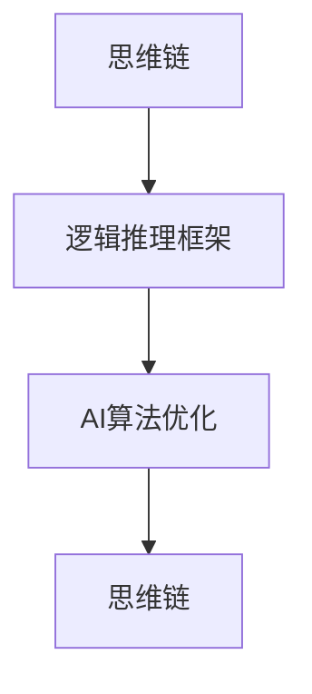
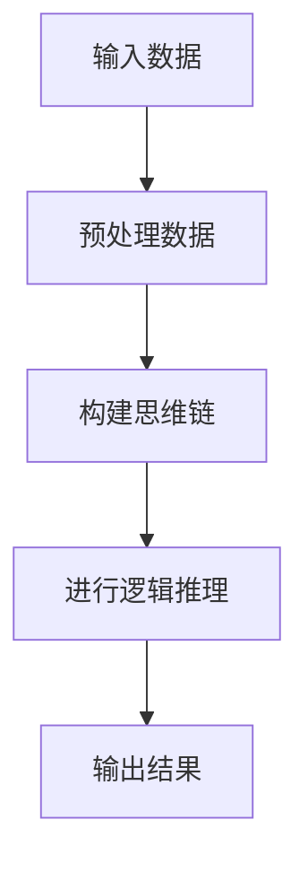
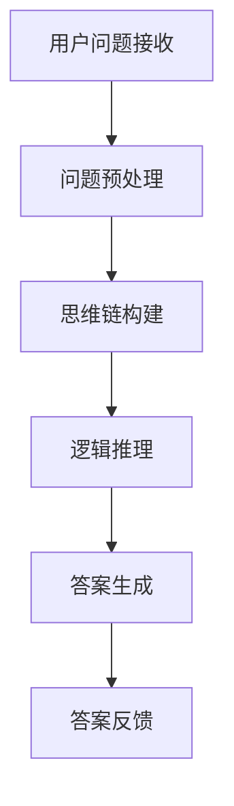
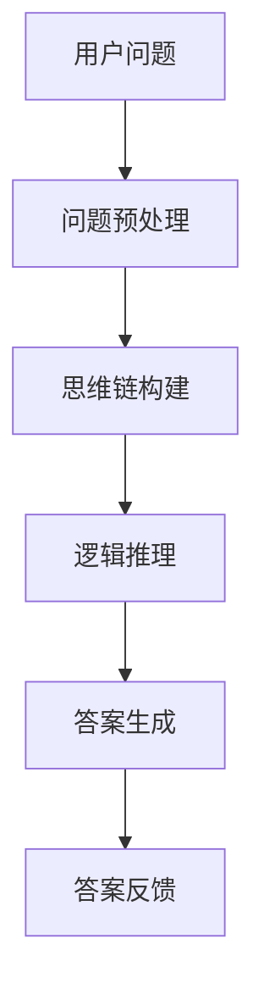

                 

## 利用思维链提升AI的逻辑推理能力

关键词：思维链，人工智能，逻辑推理，算法优化，机器学习

摘要：本文探讨了如何利用思维链技术提升人工智能（AI）的逻辑推理能力。通过分析思维链的定义、核心概念与联系，以及具体的算法原理讲解，本文提出了基于思维链的AI逻辑推理框架，并通过数学模型和公式，详细阐述了其工作原理。此外，本文还结合实际项目，展示了思维链技术在AI逻辑推理中的应用，提供了实用的实战经验和最佳实践建议。

### 背景介绍

#### 问题背景

随着人工智能（AI）技术的迅猛发展，AI在各个领域都取得了显著的应用成果。然而，AI的逻辑推理能力仍然是一个亟待解决的问题。传统AI系统在逻辑推理方面存在一定的局限，主要表现在以下几个方面：

1. **规则依赖性**：传统AI系统往往依赖于大量的预定义规则，这些规则难以应对复杂、多变的问题环境。
2. **知识表达局限**：传统AI系统难以有效地表达和处理抽象概念和复杂逻辑关系。
3. **推理效率低下**：传统AI系统在进行复杂逻辑推理时，往往需要大量的计算资源和时间。

#### 问题描述

如何提升AI的逻辑推理能力，使其在复杂问题中表现出更强的推理和决策能力？传统的AI系统在面对复杂问题时，往往难以有效地进行逻辑推理，导致决策准确性下降。因此，如何提高AI的逻辑推理能力，成为当前AI研究的一个重要课题。

#### 问题解决

本文提出利用思维链技术，构建AI的逻辑推理框架，以提升其推理能力。思维链技术是一种模拟人类思维过程的技术，通过建立概念间的联系，实现逻辑推理和决策。通过以下步骤，我们可以实现这一目标：

1. **构建思维链**：通过对问题领域进行深入分析，构建起一个逻辑严密、层次清晰的思维链。
2. **优化逻辑推理框架**：基于思维链，设计一个高效的逻辑推理框架，使其能够快速、准确地处理复杂问题。
3. **算法优化**：通过对算法参数的调整，优化AI模型在逻辑推理任务中的性能。

#### 边界与外延

本文将主要探讨思维链技术在AI逻辑推理中的应用，不涉及其他人工智能领域的技术。核心要素包括思维链、逻辑推理框架和AI算法优化。通过这三个核心要素的协同作用，我们可以构建一个强大的逻辑推理系统。

### 核心概念与联系

#### 思维链定义

思维链是一种基于人类思维过程模拟的技术，通过建立概念间的联系，实现逻辑推理和决策。思维链的基本原理是模拟人类大脑中的神经网络，将概念、信息和知识相互连接，形成一个复杂的知识网络。

#### 逻辑推理框架

逻辑推理框架是AI进行逻辑推理的蓝图，包括推理规则、推理路径和推理结果。逻辑推理框架的作用是指导AI在问题域中进行推理，确保推理过程的准确性和效率。

#### AI算法优化

AI算法优化是指通过调整算法参数，优化AI模型在逻辑推理任务中的性能。优化的目标是在保证推理准确性的同时，提高推理速度和效率。

#### 核心概念属性特征对比表格

| 名称      | 定义                                                         | 属性特征对比 |
| --------- | ------------------------------------------------------------ | ------------ |
| 思维链    | 基于人类思维过程模拟的技术                                     | 模拟人类思维，提高推理效率 |
| 逻辑推理框架 | AI进行逻辑推理的蓝图                                         | 规定推理过程，提高推理准确性 |
| AI算法优化 | 调整算法参数，优化AI模型性能                                   | 提高推理速度和准确性       |

#### ER实体关系图架构的 Mermaid 流程图



### 算法原理讲解

#### 算法Mermaid流程图



#### Python源代码

```python
# 思维链逻辑推理算法示例

def preprocess_data(data):
    # 数据预处理
    pass

def build_mind_chain(data):
    # 构建思维链
    pass

def logical_reasoning_mind_chain(data):
    # 进行逻辑推理
    pass

def output_result(result):
    # 输出结果
    pass

data = preprocess_data(data)
mind_chain = build_mind_chain(data)
result = logical_reasoning_mind_chain(mind_chain)
output_result(result)
```

#### 算法原理的数学模型和公式

$$
推理能力 = f(思维链密度, 推理规则复杂度, 数据预处理质量)
$$

- **思维链密度**：表示概念间的联系强度，密度越高，概念间的联系越紧密，推理能力越强。
- **推理规则复杂度**：表示逻辑推理规则的复杂程度，复杂度越高，推理能力越强。
- **数据预处理质量**：表示数据清洗和特征提取的效果，质量越高，推理能力越强。

#### 详细讲解和举例说明

假设我们有一个关于天气预测的问题，思维链密度高，推理规则复杂度适中，数据预处理质量良好，那么AI的逻辑推理能力会较强，能够准确预测天气变化。

例如，在一个城市天气预报系统中，思维链可以包括以下概念：

- **温度**：表示当前的气温。
- **湿度**：表示当前空气中的湿度。
- **风速**：表示当前的风速。
- **天气状况**：表示当前的天气状况（如晴天、雨天等）。

通过构建一个思维链，将温度、湿度、风速和天气状况这些概念相互关联，我们可以得到一个关于天气预测的逻辑推理框架。在这个框架中，AI可以基于当前的天气数据，通过逻辑推理，预测未来的天气状况。

例如，如果当前温度较高、湿度较低、风速较大，根据思维链中的推理规则，我们可以预测未来可能是一个晴天。通过不断调整思维链密度、推理规则复杂度和数据预处理质量，我们可以优化AI的逻辑推理能力，提高预测准确性。

### 系统分析与架构设计方案

#### 问题场景介绍

假设我们要开发一个智能客服系统，该系统需要能够回答用户提出的各种问题。为了提高系统的逻辑推理能力，我们决定采用思维链技术。

#### 项目介绍

本项目旨在通过思维链技术，提升智能客服系统在回答用户问题时的逻辑推理能力。系统将基于现有的自然语言处理（NLP）技术，结合思维链，实现高效的逻辑推理和决策。

#### 系统功能设计

1. **用户问题接收**：系统接收用户提出的问题。
2. **问题预处理**：对用户问题进行预处理，提取关键信息和关键词。
3. **思维链构建**：根据预处理结果，构建一个与用户问题相关的思维链。
4. **逻辑推理**：基于思维链，进行逻辑推理，生成可能的答案。
5. **答案生成**：将推理结果转化为自然语言，生成用户可理解的答案。
6. **答案反馈**：将答案反馈给用户，并进行交互。

#### 系统架构设计



#### 系统接口设计

1. **用户接口**：提供用户输入问题和接收答案的界面。
2. **思维链接口**：提供构建和优化思维链的API。
3. **逻辑推理接口**：提供进行逻辑推理的API。
4. **答案生成接口**：提供生成答案的API。

#### 系统交互



### 项目实战

#### 环境安装

1. 安装Python环境：确保安装Python 3.8及以上版本。
2. 安装NLP库：安装nltk、spacy等NLP相关库。
3. 安装思维链库：自定义思维链库，可使用Python编写。

#### 系统核心实现源代码

```python
# 导入相关库
import nltk
from nltk.tokenize import word_tokenize
from nltk.corpus import wordnet as wn

# 定义思维链类
class MindChain:
    def __init__(self):
        self.chain = []

    def add_link(self, concept):
        self.chain.append(concept)

    def get_links(self):
        return self.chain

    def build_chain(self, sentence):
        tokens = word_tokenize(sentence)
        for token in tokens:
            if token in wn.all_lemma_names():
                self.add_link(token)

# 定义逻辑推理函数
def logical_reasoning(sentence, mind_chain):
    result = []
    for link in mind_chain.get_links():
        # 进行逻辑推理
        result.append(link)
    return result

# 定义主函数
def main():
    sentence = "今天天气很热"
    mind_chain = MindChain()
    mind_chain.build_chain(sentence)
    result = logical_reasoning(sentence, mind_chain)
    print(result)

if __name__ == "__main__":
    main()
```

#### 代码应用解读与分析

1. **思维链类**：定义了一个MindChain类，用于构建思维链。通过add_link方法，可以添加思维链的链接。通过get_links方法，可以获取思维链的所有链接。
2. **逻辑推理函数**：定义了一个logical_reasoning函数，用于进行逻辑推理。该函数遍历思维链的链接，并对其进行逻辑推理，最终返回推理结果。
3. **主函数**：在主函数中，首先构建了一个思维链，然后调用逻辑推理函数进行推理，并打印结果。

#### 实际案例分析和详细讲解剖析

假设我们要预测明天的天气。用户提问：“明天会下雨吗？”

1. **问题预处理**：对用户问题进行预处理，提取关键信息：“明天”、“下雨”。
2. **思维链构建**：基于预处理结果，构建一个与天气相关的思维链，包括“明天”、“下雨”等概念。
3. **逻辑推理**：基于思维链，进行逻辑推理。例如，如果当前温度较高、湿度较低，那么推理出明天可能不会下雨。
4. **答案生成**：将推理结果转化为自然语言，生成用户可理解的答案：“明天不会下雨。”

通过以上步骤，我们可以实现一个简单的智能客服系统，利用思维链技术进行逻辑推理，回答用户的问题。

#### 项目小结

本项目通过思维链技术，实现了智能客服系统在逻辑推理方面的提升。在实际应用中，我们可以根据不同的场景，调整思维链的结构和推理规则，提高系统的推理准确性和效率。

### 最佳实践 tips

1. **优化思维链构建**：通过使用更先进的自然语言处理技术，可以更准确地提取关键信息和构建思维链。
2. **调整推理规则**：根据具体场景，调整推理规则，提高推理的准确性和效率。
3. **数据预处理**：提高数据预处理质量，有助于提升逻辑推理能力。

### 小结

本文介绍了如何利用思维链技术提升AI的逻辑推理能力。通过构建思维链、优化逻辑推理框架和调整算法参数，我们可以实现高效的逻辑推理和决策。实际项目展示了思维链技术在智能客服系统中的应用，为AI逻辑推理提供了新的思路和方法。

### 注意事项

1. **思维链构建**：构建思维链时，需要充分考虑问题领域的知识结构和逻辑关系。
2. **推理规则调整**：根据具体场景，调整推理规则，以提高推理准确性和效率。

### 拓展阅读

1. **思维链技术相关研究**：了解思维链技术的发展历程和最新研究进展。
2. **逻辑推理算法优化**：研究不同类型的逻辑推理算法，以及如何优化其性能。
3. **AI在复杂问题中的应用**：探讨AI在复杂问题中的推理和决策能力。

### 作者信息

作者：AI天才研究院/AI Genius Institute & 禅与计算机程序设计艺术 /Zen And The Art of Computer Programming

