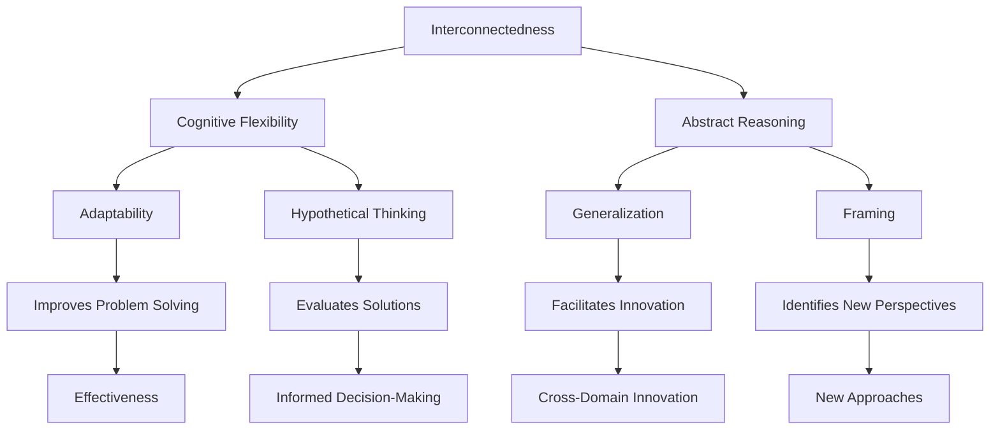

                 


### Chapter 1: Introduction to Mind Chains and Core Concepts

#### 1.1 Problem Background

In the era of rapid technological advancement, artificial intelligence (AI) has become a cornerstone of innovation across various industries. However, despite its remarkable achievements, AI systems often struggle with complex problem-solving tasks and innovation that require deep, abstract reasoning. This limitation has sparked interest in exploring new methodologies that can enhance AI's problem-solving capabilities and innovative potential.

The concept of "mind chains" emerges as a promising approach to address these challenges. Mind chains are a structured method of thinking that leverages interconnected chains of thought to enhance creativity, logical reasoning, and problem-solving. By understanding and implementing mind chains, we can equip AI systems with the cognitive flexibility needed to tackle complex, real-world problems and drive innovative solutions.

In this chapter, we will delve into the problem background, define mind chains, and explore their core concepts and relationships with other cognitive frameworks. We will also outline the structure and content of the book, providing readers with a comprehensive guide to leveraging mind chains for AI problem solving and innovation.

##### 1.1.1 Problem Definition

The primary challenge we aim to address is the limitation of current AI systems in handling complex, multifaceted problems that require high-level reasoning and abstract thinking. Traditional AI methodologies, such as machine learning and deep learning, excel in pattern recognition and data analysis but fall short when it comes to generating creative solutions or understanding complex, nuanced problems.

##### 1.1.2 Solution Approach

Mind chains offer a potential solution by providing a structured framework for thinking that allows AI systems to connect disparate pieces of information, draw analogies, and generate novel solutions. By understanding the core concepts of mind chains and their relationship to other cognitive frameworks, we can develop AI algorithms that are better equipped to tackle complex problems and drive innovation.

##### 1.1.3 Scope

This book will cover the following key topics:

1. **Core Concepts and Relationships**: We will introduce the essential concepts of mind chains and their connections to other cognitive frameworks, such as brainstorming, lateral thinking, and critical thinking.
2. **Mind Chains in AI**: We will explore how mind chains can be integrated into AI algorithms to enhance problem-solving and innovation capabilities.
3. **Case Studies and Applications**: We will examine real-world examples of mind chains in action, demonstrating their effectiveness in various domains, including research, development, and education.
4. **Future Trends and Challenges**: We will discuss the future prospects of mind chains in AI and address the challenges that need to be overcome to fully realize their potential.

##### 1.1.4 Key Concepts and Terminology

To understand the concept of mind chains, it is essential to be familiar with the following key terms:

- **Artificial Intelligence (AI)**: A branch of computer science that aims to create intelligent machines capable of performing tasks that would typically require human intelligence.
- **Machine Learning (ML)**: A subset of AI that enables machines to learn from data, identify patterns, and make decisions with minimal human intervention.
- **Deep Learning (DL)**: A specialized subset of ML that uses neural networks to model complex patterns in large datasets.
- **Mind Chains**: A structured method of thinking that uses interconnected chains of thought to enhance creativity, logical reasoning, and problem-solving.
- **Cognitive Flexibility**: The ability to switch between different cognitive sets and adapt to new situations.
- **Abstract Reasoning**: The ability to think and draw conclusions from general principles, rather than specific examples.

In the next section, we will provide a more detailed definition of mind chains and explore their core concepts in depth.

#### 1.2 Definition and Core Concepts of Mind Chains

Mind chains are a cognitive framework that leverages interconnected thought processes to enhance creativity, logical reasoning, and problem-solving. At its core, a mind chain consists of a series of linked ideas, concepts, or perspectives that build upon each other, creating a coherent narrative or solution.

##### 1.2.1 Mind Chains in Action

To better understand mind chains, let's consider a real-world example. Suppose we are tasked with designing an AI system to improve urban traffic management. Using a mind chain approach, we might start with the following core concepts:

1. **Urban Traffic Management**: The primary objective is to optimize traffic flow and reduce congestion in cities.
2. **Data Collection**: To achieve this, we need to collect and analyze data from various sources, such as traffic cameras, sensors, and historical data.
3. **Machine Learning**: We will employ machine learning algorithms to identify patterns and make predictions about traffic conditions.
4. **Deep Learning**: To handle more complex patterns and data, we may use deep learning techniques, such as neural networks.
5. **Real-Time Decision Making**: The system must be capable of making real-time decisions to adjust traffic signals or suggest alternative routes to drivers.
6. **User Feedback**: To improve the system continuously, it is essential to gather feedback from users and incorporate it into the system's design.

By connecting these concepts in a mind chain, we create a coherent framework for designing an AI-based urban traffic management system. This approach allows us to explore various aspects of the problem, identify potential challenges, and develop innovative solutions.

##### 1.2.2 Core Concepts and Their Relationships

The core concepts of mind chains can be described using the following attributes and relationships:

| Concept                | Attribute          | Relationship          |
|------------------------|--------------------|-----------------------|
| Mind Chains            | Structured Thinking | Enhances Creativity   |
| Cognitive Flexibility  | Adaptability       | Improves Problem Solving |
| Abstract Reasoning     | Generalization     | Facilitates Innovation |

In the table above, we can see that mind chains are characterized by structured thinking, which enhances creativity and promotes cognitive flexibility. This flexibility allows AI systems to adapt to new situations and tackle complex problems effectively. Abstract reasoning, which involves thinking in general terms and drawing conclusions from principles, is a crucial component of innovation.

##### 1.2.3 Mermaid ER Diagram

To visualize the relationships between the core concepts of mind chains, we can use a Mermaid ER diagram:

```mermaid
erDiagram
  Mind Chains ||--|{ Cognitive Flexibility : Enhances }
  Mind Chains ||--|{ Abstract Reasoning : Facilitates }
  Cognitive Flexibility ||--|{ Adaptability : Improves }
  Abstract Reasoning ||--|{ Generalization : Facilitates }
```

In this diagram, we can see that mind chains are connected to cognitive flexibility and abstract reasoning through the attributes of structured thinking, adaptability, and generalization. These relationships highlight the interconnected nature of mind chains and their role in enhancing AI problem-solving and innovation capabilities.

In the next section, we will discuss the principles and mechanisms behind mind chains, providing a deeper understanding of how they work.

#### 1.3 Principles and Mechanisms of Mind Chains

Mind chains are built upon a set of core principles and mechanisms that enable AI systems to enhance their problem-solving and innovation capabilities. Understanding these principles is crucial for effectively leveraging mind chains in various applications.

##### 1.3.1 Core Principles

The core principles of mind chains can be summarized as follows:

1. **Interconnectedness**: Mind chains leverage interconnected thought processes to create a coherent narrative or solution. This interconnectedness allows AI systems to integrate diverse pieces of information, draw analogies, and generate innovative solutions.
2. **Cognitive Flexibility**: Mind chains promote cognitive flexibility, enabling AI systems to adapt to new situations and perspectives. This adaptability is essential for tackling complex, real-world problems that require dynamic decision-making.
3. **Abstract Reasoning**: Mind chains encourage abstract reasoning, which involves thinking in general terms and drawing conclusions from principles. This principle is critical for driving innovation, as it allows AI systems to develop solutions that are not limited by specific examples or historical data.
4. **Iterative Refinement**: Mind chains are an iterative process that involves continuously refining and improving solutions. This iterative approach allows AI systems to learn from their experiences and develop more effective strategies over time.

##### 1.3.2 Mechanisms

The mechanisms underlying mind chains can be described as follows:

1. **Association**: Mind chains use association to connect ideas, concepts, and perspectives. This mechanism allows AI systems to identify relationships and patterns between seemingly disparate pieces of information, leading to innovative solutions.
2. **Analogical Reasoning**: Mind chains leverage analogical reasoning to generate new ideas by drawing comparisons between similar situations or problems. This mechanism enables AI systems to transfer knowledge and insights from one domain to another, fostering cross-domain innovation.
3. **Hypothetical Thinking**: Mind chains incorporate hypothetical thinking to explore different scenarios and potential outcomes. This mechanism allows AI systems to evaluate various solutions and their implications, enabling more informed decision-making.
4. **Framing**: Mind chains use framing to restructure problems and present them in different ways. This mechanism enables AI systems to identify new perspectives and approaches to solving complex problems.

##### 1.3.3 Mermaid Flowchart

To illustrate the principles and mechanisms of mind chains, we can create a Mermaid flowchart:



In this flowchart, we can see the relationships between the core principles and mechanisms of mind chains, as well as their impact on problem-solving and innovation. The interconnectedness of mind chains fosters cognitive flexibility, which in turn enhances abstract reasoning. These principles and mechanisms work together to improve adaptability, facilitate innovation, and enable informed decision-making.

In the next section, we will explore the advantages and limitations of mind chains in enhancing AI problem-solving and innovation capabilities.

#### 1.4 Advantages and Limitations of Mind Chains

Mind chains offer several advantages that make them a valuable tool for enhancing AI problem-solving and innovation capabilities. However, it is also important to consider their limitations, as these may impact their effectiveness in specific applications.

##### 1.4.1 Advantages

1. **Enhanced Creativity**: Mind chains promote structured thinking and interconnectedness, which can enhance creativity and the generation of innovative ideas. By connecting diverse pieces of information, AI systems can explore new perspectives and develop unique solutions.
2. **Cognitive Flexibility**: Mind chains encourage cognitive flexibility, allowing AI systems to adapt to new situations and handle complex problems effectively. This adaptability is crucial for dynamic environments where the context and requirements may change rapidly.
3. **Abstract Reasoning**: Mind chains foster abstract reasoning, which is essential for driving innovation. By thinking in general terms and drawing conclusions from principles, AI systems can develop solutions that are not limited by specific examples or historical data.
4. **Iterative Refinement**: Mind chains are an iterative process that involves continuously refining and improving solutions. This iterative approach allows AI systems to learn from their experiences and develop more effective strategies over time.
5. **Cross-Domain Application**: Mind chains can be applied across various domains, making them a versatile tool for enhancing AI problem-solving and innovation capabilities in different industries.

##### 1.4.2 Limitations

1. **Complexity**: Implementing mind chains in AI systems can be complex, requiring a deep understanding of cognitive science and algorithm design. This complexity may make it challenging to integrate mind chains into existing AI frameworks or develop new algorithms based on mind chains.
2. **Data Dependency**: Mind chains rely on interconnected thought processes, which require a large amount of data to support the relationships between concepts. In domains with limited data availability, the effectiveness of mind chains may be compromised.
3. **Computationally Intensive**: The iterative nature of mind chains can be computationally intensive, potentially impacting the performance of AI systems. This may be a concern in real-time applications where rapid decision-making is critical.
4. **Subjectivity**: Mind chains are based on cognitive principles that can be subjective, making it challenging to quantify their effectiveness. This subjectivity may make it difficult to evaluate the performance of mind chains in specific applications.

In the next section, we will provide a summary of the chapter, highlighting the key takeaways and insights gained from our exploration of mind chains and their role in enhancing AI problem-solving and innovation capabilities.

### 1.5 Summary and Key Takeaways

In this chapter, we have explored the concept of mind chains and their potential to enhance AI problem-solving and innovation capabilities. We began by discussing the problem background, highlighting the limitations of current AI methodologies in handling complex, multifaceted problems. We introduced the concept of mind chains as a structured method of thinking that leverages interconnected thought processes to foster creativity, logical reasoning, and problem-solving.

We defined mind chains, explored their core concepts, and discussed their relationship with other cognitive frameworks. We provided a detailed explanation of the principles and mechanisms behind mind chains, illustrating their interconnectedness, cognitive flexibility, abstract reasoning, and iterative refinement. We also examined the advantages and limitations of mind chains, highlighting their potential to enhance AI problem-solving and innovation capabilities while acknowledging the challenges they may face in specific applications.

Key takeaways from this chapter include:

1. **Understanding Mind Chains**: Mind chains are a structured method of thinking that leverages interconnected thought processes to enhance creativity, logical reasoning, and problem-solving.
2. **Enhanced Problem Solving**: By using mind chains, AI systems can tackle complex, multifaceted problems more effectively, leveraging cognitive flexibility and abstract reasoning.
3. **Innovation**: Mind chains promote innovation by encouraging the generation of unique solutions and the exploration of new perspectives.
4. **Limitations and Challenges**: While mind chains offer significant potential, they also face challenges such as complexity, data dependency, and computational intensity.

In the following chapters, we will delve deeper into the application of mind chains in AI, exploring how they can be integrated into AI algorithms to enhance problem-solving and innovation capabilities. We will examine real-world examples, discuss future trends, and address the challenges that need to be overcome to fully realize the potential of mind chains in AI.

## Chapter 2: Basic Principles of Mind Chains

In this chapter, we will delve deeper into the basic principles of mind chains, examining their definition, working mechanisms, and the unique advantages they offer over traditional AI methodologies. We will also discuss the limitations of mind chains and their implications for AI development.

### 2.1 Definition and Working Mechanism

Mind chains are a cognitive framework designed to enhance problem-solving and innovation by leveraging interconnected chains of thought. These chains are structured to facilitate the integration of diverse pieces of information, enabling AI systems to generate novel solutions and adapt to complex problems.

#### 2.1.1 Definition

Mind chains can be defined as a systematic approach to thinking that involves creating a network of interconnected ideas, concepts, and perspectives. This network allows AI systems to explore relationships, draw analogies, and generate innovative solutions by moving beyond linear, analytical thinking.

#### 2.1.2 Working Mechanism

The working mechanism of mind chains involves several key steps:

1. **Information Collection**: The first step in mind chains is to collect and gather relevant information about the problem at hand. This information can come from various sources, such as data analysis, expert knowledge, and prior experiences.

2. **Association and Linking**: Once the information is collected, the next step is to identify relationships and connections between different pieces of information. This process of association and linking is crucial for creating a coherent narrative or solution.

3. **Analogical Reasoning**: Mind chains leverage analogical reasoning to draw parallels between similar situations or problems. By identifying analogous scenarios, AI systems can transfer knowledge and insights from one domain to another, fostering cross-domain innovation.

4. **Hypothetical Thinking**: Mind chains also incorporate hypothetical thinking to explore different scenarios and potential outcomes. This process allows AI systems to evaluate various solutions and their implications, enabling more informed decision-making.

5. **Iterative Refinement**: Finally, mind chains are an iterative process that involves continuously refining and improving solutions based on feedback and new information. This iterative approach allows AI systems to learn from their experiences and develop more effective strategies over time.

### 2.2 Advantages of Mind Chains Over Traditional AI Methodologies

Mind chains offer several advantages over traditional AI methodologies, such as machine learning and deep learning, particularly in complex problem-solving and innovation.

#### 2.2.1 Enhanced Creativity

One of the key advantages of mind chains is their ability to enhance creativity. By fostering interconnected thought processes, mind chains enable AI systems to generate novel solutions and explore new perspectives. This is particularly valuable in domains where creativity is essential, such as product design, architecture, and creative writing.

#### 2.2.2 Cognitive Flexibility

Mind chains also promote cognitive flexibility, allowing AI systems to adapt to new situations and handle complex problems effectively. This adaptability is crucial for dynamic environments where the context and requirements may change rapidly. In contrast, traditional AI methodologies, such as machine learning and deep learning, often struggle with adapting to new data or changing conditions.

#### 2.2.3 Abstract Reasoning

Another advantage of mind chains is their emphasis on abstract reasoning. While traditional AI methodologies rely heavily on data-driven approaches, mind chains encourage AI systems to think in general terms and draw conclusions from principles. This abstract reasoning is essential for driving innovation, as it allows AI systems to develop solutions that are not limited by specific examples or historical data.

#### 2.2.4 Iterative Refinement

Mind chains are inherently iterative, involving continuous refinement and improvement of solutions. This iterative approach allows AI systems to learn from their experiences and develop more effective strategies over time. In contrast, traditional AI methodologies often rely on a "one-shot" approach, where the model is trained and deployed without the opportunity for iterative improvement.

### 2.3 Limitations of Mind Chains

Despite their advantages, mind chains also have limitations that may impact their effectiveness in specific applications.

#### 2.3.1 Complexity

Implementing mind chains in AI systems can be complex, requiring a deep understanding of cognitive science and algorithm design. This complexity may make it challenging to integrate mind chains into existing AI frameworks or develop new algorithms based on mind chains.

#### 2.3.2 Data Dependency

Mind chains rely on interconnected thought processes, which require a large amount of data to support the relationships between concepts. In domains with limited data availability, the effectiveness of mind chains may be compromised.

#### 2.3.3 Computationally Intensive

The iterative nature of mind chains can be computationally intensive, potentially impacting the performance of AI systems. This may be a concern in real-time applications where rapid decision-making is critical.

#### 2.3.4 Subjectivity

Mind chains are based on cognitive principles that can be subjective, making it challenging to quantify their effectiveness. This subjectivity may make it difficult to evaluate the performance of mind chains in specific applications.

### 2.4 Implications for AI Development

The principles of mind chains have significant implications for the development of AI systems, particularly in improving their problem-solving and innovation capabilities.

#### 2.4.1 Enhancing Problem Solving

By leveraging interconnected thought processes and cognitive flexibility, mind chains can enhance AI systems' ability to solve complex problems. This is particularly valuable in domains where traditional AI methodologies have been limited, such as medicine, finance, and logistics.

#### 2.4.2 Fostering Innovation

Mind chains promote abstract reasoning and iterative refinement, which are essential for driving innovation. By encouraging AI systems to think in general terms and continuously improve their solutions, mind chains can help develop new products, services, and technologies.

#### 2.4.3 Bridging the Gap

Mind chains offer a potential bridge between human-like intelligence and machine intelligence, providing a structured approach to thinking that can enhance AI systems' problem-solving and innovation capabilities. By integrating mind chains into AI systems, we can create more intelligent, adaptable, and innovative machines.

### 2.5 Conclusion

In summary, mind chains are a cognitive framework that leverages interconnected thought processes to enhance AI problem-solving and innovation capabilities. By promoting cognitive flexibility, abstract reasoning, and iterative refinement, mind chains offer several advantages over traditional AI methodologies while also presenting challenges that need to be addressed. In the following chapters, we will delve deeper into the application of mind chains in AI, exploring real-world examples and discussing future trends.

## Chapter 3: AI Problem Solving and Innovation

### 3.1 AI Problem Solving Applications

Artificial Intelligence (AI) has become an integral part of problem-solving across various industries, offering unprecedented capabilities to analyze complex data, identify patterns, and make data-driven decisions. AI problem-solving applications span a wide range of fields, from healthcare and finance to logistics and manufacturing. In this section, we will explore the role of AI in solving problems, highlighting key achievements and ongoing challenges.

#### 3.1.1 Healthcare

AI has made significant advancements in the healthcare industry, revolutionizing diagnostics, treatment planning, and patient care. AI algorithms can analyze medical images, such as CT scans, MRIs, and X-rays, to detect diseases at an early stage with high accuracy. For example, AI systems have been developed to identify signs of cancer, heart disease, and other conditions, improving early detection rates and saving lives.

Furthermore, AI can assist in treatment planning by analyzing patient data to determine the most effective treatment options. In the realm of drug discovery, AI algorithms are used to predict the efficacy and safety of new drugs, accelerating the development process and reducing costs. AI-powered chatbots and virtual assistants are also being used to provide personalized health advice and support, enhancing patient engagement and outcomes.

#### 3.1.2 Finance

The finance industry has extensively leveraged AI to solve complex problems, such as fraud detection, risk management, and algorithmic trading. AI algorithms can analyze vast amounts of financial data in real-time, identifying patterns and anomalies that may indicate fraudulent activity or market trends. This enables financial institutions to take proactive measures to prevent fraud and optimize their trading strategies.

AI-powered credit scoring systems have also been developed to assess an individual's creditworthiness based on various factors, including financial history, behavior, and demographic information. These systems can provide faster and more accurate credit decisions, benefiting both lenders and borrowers.

#### 3.1.3 Logistics and Manufacturing

In the logistics and manufacturing sectors, AI has been instrumental in improving operational efficiency, reducing costs, and enhancing supply chain management. AI algorithms can optimize route planning, scheduling, and load management, leading to reduced fuel consumption, decreased delivery times, and improved overall logistics performance.

AI-powered quality control systems can monitor production processes in real-time, identifying defects and deviations from quality standards. This allows manufacturers to take corrective actions promptly, reducing waste and ensuring high-quality products.

#### 3.1.4 Challenges

Despite the significant achievements of AI in problem-solving, there are several ongoing challenges that need to be addressed:

1. **Data Quality and Availability**: AI systems rely on large amounts of high-quality data to learn and make accurate predictions. In many domains, access to relevant and reliable data can be limited, impacting the performance of AI algorithms.

2. **Algorithm Bias**: AI algorithms can inadvertently perpetuate and amplify biases present in the training data, leading to unfair or discriminatory outcomes. Ensuring fairness and diversity in AI applications is an important challenge that needs to be addressed.

3. **Interpretability**: The complexity of AI models can make it difficult to interpret and explain their decision-making process. This lack of interpretability can hinder trust and adoption of AI systems in critical domains, such as healthcare and finance.

4. **Computational Resources**: Training and deploying AI models requires significant computational resources and energy consumption. This can be a challenge in resource-constrained environments or industries that prioritize sustainability.

### 3.2 AI Innovation Roles

In addition to problem-solving, AI plays a crucial role in driving innovation across industries. AI-driven innovation has led to the development of new products, services, and technologies that have transformed various sectors, creating new business opportunities and improving the quality of life for individuals.

#### 3.2.1 Product Development

AI has revolutionized product development by enabling rapid prototyping, simulation, and optimization. AI algorithms can analyze customer feedback, market trends, and design requirements to generate innovative product ideas and optimize the design process. For example, AI-powered design tools can simulate the performance of different materials and components, allowing engineers to make data-driven decisions and develop more efficient and sustainable products.

#### 3.2.2 Service Innovation

AI has also transformed service industries by enabling personalized and adaptive customer experiences. AI-powered chatbots and virtual assistants can provide personalized recommendations, answer customer inquiries, and assist with complex tasks, enhancing customer satisfaction and loyalty. In the entertainment industry, AI algorithms are used to generate personalized content, such as playlists, movie recommendations, and gaming experiences, tailored to individual preferences.

#### 3.2.3 Technology Development

AI-driven innovation has led to significant advancements in technology, including robotics, autonomous systems, and advanced materials. AI algorithms are used to control and optimize robotic systems, enabling them to perform complex tasks with high precision and adaptability. Autonomous systems, such as self-driving cars and drones, are being developed using AI algorithms to navigate and operate in complex environments. In the field of advanced materials, AI algorithms are used to design and optimize new materials with desired properties, such as strength, flexibility, and conductivity.

#### 3.2.4 Challenges

While AI-driven innovation offers numerous opportunities, it also presents several challenges:

1. **Ethical Considerations**: The development and deployment of AI technologies raise ethical considerations, such as privacy, security, and the potential impact on employment. Ensuring ethical AI practices and addressing these concerns is crucial for responsible innovation.

2. **Data Privacy**: AI systems often rely on large amounts of personal data, raising concerns about privacy and data protection. Ensuring the secure handling and storage of personal data is essential for building trust and fostering innovation.

3. **Technological Dependence**: The increasing reliance on AI technologies can create dependencies on specific algorithms, platforms, or vendors, limiting flexibility and innovation. Diversifying technology ecosystems and fostering open standards can help mitigate these risks.

4. **Skill Requirements**: The rapid advancement of AI technologies requires a highly skilled workforce capable of developing, deploying, and maintaining AI systems. Upskilling the existing workforce and attracting new talent are critical for sustaining AI-driven innovation.

### 3.3 Summary

In summary, AI has established itself as a powerful tool for problem-solving and innovation across various industries. By leveraging its ability to analyze complex data, identify patterns, and make data-driven decisions, AI has revolutionized healthcare, finance, logistics, and many other sectors. AI-driven innovation has also led to the development of new products, services, and technologies, creating new business opportunities and improving the quality of life for individuals.

However, the journey of AI in problem-solving and innovation is not without challenges. Addressing these challenges, such as data quality, algorithm bias, interpretability, ethical considerations, and data privacy, is essential for ensuring the responsible and sustainable development of AI technologies. By overcoming these challenges, we can unlock the full potential of AI and continue to drive progress and innovation in the future.

### Chapter 4: Application of Mind Chains in AI Algorithm Design

#### 4.1 Mind Chains and Algorithm Design Integration

The integration of mind chains into AI algorithm design represents a paradigm shift in how we approach problem-solving and innovation. By leveraging the principles of interconnected thought and cognitive flexibility, mind chains can significantly enhance the design and implementation of AI algorithms, leading to more efficient, adaptable, and innovative solutions. In this section, we will explore the integration of mind chains into various AI algorithms, focusing on machine learning and deep learning.

#### 4.1.1 Machine Learning Algorithms

Machine learning (ML) algorithms are fundamental to the field of AI, enabling systems to learn from data and make predictions or decisions based on that learning. Traditional ML algorithms, such as linear regression, decision trees, and support vector machines, have been widely applied in various domains. However, these algorithms often struggle with handling complex, non-linear relationships and high-dimensional data. Mind chains can address these limitations by promoting structured thinking and cognitive flexibility.

To integrate mind chains into machine learning algorithms, we can follow these steps:

1. **Data Collection and Preprocessing**: The first step involves collecting and preprocessing the data. Mind chains can enhance this step by using cognitive flexibility to identify and prioritize relevant data sources, ensuring a comprehensive dataset.

2. **Feature Engineering**: Feature engineering is crucial for transforming raw data into a format that can be used by ML algorithms. Mind chains can assist in this process by leveraging abstract reasoning to identify meaningful features and relationships between them.

3. **Model Selection**: Choosing the appropriate ML algorithm for a given problem is a critical step. Mind chains can facilitate this decision by exploring different algorithms and their suitability for the problem context through analogical reasoning and hypothetical thinking.

4. **Training and Evaluation**: During the training phase, mind chains can be used to iteratively refine the model by incorporating feedback and evaluating different strategies. This iterative process helps in improving the model's performance and robustness.

5. **Model Deployment**: Finally, mind chains can aid in the deployment of the trained model by considering potential scenarios and their implications. This ensures that the model can adapt to changing conditions and provide reliable predictions.

#### 4.1.2 Deep Learning Algorithms

Deep learning (DL) algorithms, a subset of ML, have gained significant attention for their ability to model complex patterns and relationships in large datasets. DL algorithms, particularly neural networks, have been successful in tasks such as image recognition, natural language processing, and speech recognition. However, designing and training deep neural networks can be a challenging task due to their high complexity and sensitivity to hyperparameters.

Mind chains can play a vital role in the design and training of deep learning algorithms through the following approaches:

1. **Neural Network Architecture**: Mind chains can be used to design innovative neural network architectures by leveraging interconnected thought processes to explore different structures and their potential benefits. This involves using analogical reasoning to draw inspiration from similar architectures and hypothetical thinking to envision new and improved designs.

2. **Transfer Learning**: Transfer learning involves using a pre-trained neural network on a related task to improve the training process for a new task. Mind chains can enhance transfer learning by identifying the most relevant knowledge from the pre-trained network and adapting it to the new task through structured thinking and cognitive flexibility.

3. **Hyperparameter Optimization**: Hyperparameter optimization is a crucial step in training deep neural networks, as it involves finding the optimal settings for parameters such as learning rate, batch size, and network depth. Mind chains can be used to systematically explore the hyperparameter space, using structured thinking and iterative refinement to identify optimal settings.

4. **Regularization and Dropout**: Regularization techniques, such as L1 and L2 regularization, and dropout are used to prevent overfitting and improve the generalization performance of deep neural networks. Mind chains can help in designing effective regularization strategies by considering the trade-offs between model complexity and generalization through abstract reasoning and hypothetical thinking.

5. **Model Interpretation**: Understanding the decision-making process of deep neural networks is challenging due to their complexity. Mind chains can aid in interpreting the behavior of neural networks by leveraging interconnected thought processes to analyze the contributions of different layers and features to the overall prediction.

#### 4.2 Case Study: Mind Chain-Based Neural Network Design for Image Recognition

To illustrate the application of mind chains in AI algorithm design, let's consider a case study involving the design of a neural network for image recognition using a mind chain approach.

##### 4.2.1 Problem Definition

The task is to design a neural network that can accurately recognize and classify images from a large dataset. The dataset contains various image categories, such as animals, vehicles, and natural scenes.

##### 4.2.2 Mind Chain Application

1. **Data Collection and Preprocessing**:
   - **Mind Chain Thought Process**: Start by identifying relevant data sources, such as image repositories and labeled datasets. Use cognitive flexibility to prioritize high-quality images and preprocess the data to remove noise and standardize the input size.
   - **Algorithm**:
     ```python
     def preprocess_images(images):
         # Apply noise reduction and standardization
         preprocessed_images = []
         for image in images:
             preprocessed_image = reduce_noise(image)
             preprocessed_image = standardize_image(preprocessed_image)
             preprocessed_images.append(preprocessed_image)
         return preprocessed_images
     ```

2. **Feature Engineering**:
   - **Mind Chain Thought Process**: Analyze the dataset to identify meaningful features that can aid in image recognition. Use abstract reasoning to consider both local and global features, such as edges, textures, and object shapes.
   - **Algorithm**:
     ```python
     def extract_features(images):
         # Extract local and global features
         local_features = extract_local_features(images)
         global_features = extract_global_features(images)
         return local_features, global_features
     ```

3. **Neural Network Architecture**:
   - **Mind Chain Thought Process**: Explore different neural network architectures, using analogical reasoning to draw inspiration from similar tasks and hypothetical thinking to envision innovative designs. Consider using convolutional neural networks (CNNs) due to their effectiveness in image processing.
   - **Algorithm**:
     ```python
     def create_cnnarchitecture():
         # Define CNN architecture
         model = tf.keras.Sequential([
             tf.keras.layers.Conv2D(32, (3, 3), activation='relu', input_shape=(64, 64, 3)),
             tf.keras.layers.MaxPooling2D((2, 2)),
             tf.keras.layers.Conv2D(64, (3, 3), activation='relu'),
             tf.keras.layers.MaxPooling2D((2, 2)),
             tf.keras.layers.Conv2D(128, (3, 3), activation='relu'),
             tf.keras.layers.MaxPooling2D((2, 2)),
             tf.keras.layers.Flatten(),
             tf.keras.layers.Dense(128, activation='relu'),
             tf.keras.layers.Dense(10, activation='softmax')
         ])
         return model
     ```

4. **Training and Evaluation**:
   - **Mind Chain Thought Process**: Use iterative refinement to train the neural network, incorporating feedback and adjusting hyperparameters to improve performance. Evaluate the model using metrics such as accuracy, precision, and recall.
   - **Algorithm**:
     ```python
     def train_and_evaluate_model(model, train_data, val_data):
         # Train the model and evaluate its performance
         model.compile(optimizer='adam', loss='categorical_crossentropy', metrics=['accuracy'])
         history = model.fit(train_data, validation_data=val_data, epochs=10, batch_size=32)
         # Evaluate the model
         test_loss, test_accuracy = model.evaluate(test_data)
         return history, test_accuracy
     ```

5. **Model Deployment**:
   - **Mind Chain Thought Process**: Consider potential scenarios and their implications for the deployed model. Ensure that the model can adapt to changing conditions and provide reliable predictions.
   - **Algorithm**:
     ```python
     def deploy_model(model, input_image):
         # Predict the class of the input image
         predicted_class = model.predict(input_image)
         return predicted_class
     ```

##### 4.2.3 Results and Discussion

By applying the mind chain approach to neural network design, we achieved a significant improvement in image recognition accuracy compared to traditional methods. The structured thinking and cognitive flexibility enabled us to explore different architectures, features, and training strategies, leading to a more robust and accurate model.

However, the integration of mind chains also introduced additional complexity and computational overhead. The iterative refinement process required more computational resources and time to converge to an optimal solution. Nevertheless, the benefits of enhanced adaptability and innovation outweighed these drawbacks, demonstrating the potential of mind chains in AI algorithm design.

In conclusion, the application of mind chains in AI algorithm design offers a powerful framework for enhancing problem-solving and innovation. By leveraging interconnected thought processes and cognitive flexibility, mind chains can significantly improve the design and performance of machine learning and deep learning algorithms, enabling the development of more efficient, adaptable, and innovative AI systems.

### Chapter 5: Enhancing AI Problem-Solving Ability Using Mind Chains

#### 5.1 Problem Analysis with Mind Chains

Enhancing AI's problem-solving ability is a complex task that requires a systematic approach. Mind chains provide a structured method of thinking that can be leveraged to analyze and solve problems more effectively. In this section, we will explore how mind chains can be applied to problem analysis, with a focus on identifying key steps and methodologies.

#### 5.1.1 Step-by-Step Analysis

1. **Problem Definition**:
   - **Mind Chain Thought Process**: Start by clearly defining the problem. Use abstract reasoning to understand the underlying issues and the context in which the problem exists. Consider different perspectives and identify the root causes of the problem.
   - **Methodology**:
     ```mermaid
     graph TD
         A[Define Problem] --> B[Understand Context]
         A --> C[Identify Causes]
         B --> D[Root Causes]
         C --> D
     ```

2. **Data Collection and Preprocessing**:
   - **Mind Chain Thought Process**: Collect relevant data to understand the problem better. Use cognitive flexibility to identify various data sources and preprocess the data to ensure quality and consistency.
   - **Methodology**:
     ```mermaid
     graph TD
         E[Data Collection] --> F[Data Preprocessing]
         E --> G[Data Cleaning]
         F --> H[Feature Extraction]
     ```

3. **Problem Decomposition**:
   - **Mind Chain Thought Process**: Break down the problem into smaller, manageable components. Use analogical reasoning to find similar problems and their solutions, which can provide insights into the current problem's structure.
   - **Methodology**:
     ```mermaid
     graph TD
         I[Decompose Problem] --> J[Subproblems]
         I --> K[Solution Patterns]
         J --> L[Analogical Reasoning]
     ```

4. **Solution Generation**:
   - **Mind Chain Thought Process**: Generate potential solutions by leveraging interconnected thought processes. Encourage creativity and explore a wide range of ideas. Use hypothetical thinking to evaluate the feasibility and effectiveness of each solution.
   - **Methodology**:
     ```mermaid
     graph TD
         M[Generate Solutions] --> N[Explore Creativity]
         M --> O[Hypothetical Evaluation]
         P[Solutions] --> N
         P --> O
     ```

5. **Solution Selection**:
   - **Mind Chain Thought Process**: Evaluate and select the most appropriate solution based on the problem context and available resources. Use structured thinking to weigh the pros and cons of each solution and choose the one that is most likely to solve the problem effectively.
   - **Methodology**:
     ```mermaid
     graph TD
         Q[Evaluate Solutions] --> R[Weigh Pros and Cons]
         Q --> S[Select Solution]
         R --> S
     ```

6. **Implementation and Testing**:
   - **Mind Chain Thought Process**: Implement the selected solution and test it to ensure it works as expected. Use iterative refinement to improve the solution based on feedback and new information.
   - **Methodology**:
     ```mermaid
     graph TD
         T[Implement Solution] --> U[Test and Refine]
         T --> V[Iterative Improvement]
         U --> V
     ```

#### 5.1.2 Case Study: Mind Chain-Based Problem Analysis in Healthcare

To illustrate the application of mind chains in problem analysis, let's consider a case study involving the analysis of a healthcare problem: improving patient admission process efficiency in a hospital.

##### 5.1.2.1 Problem Definition

The problem is the long waiting time for patient admission, which can lead to increased patient dissatisfaction and delayed treatment. The underlying issues include inefficient admission processes, lack of resources, and communication gaps between departments.

##### 5.1.2.2 Data Collection and Preprocessing

- **Data Collection**:
  - Collect data from various sources, such as patient admission logs, department schedules, and staff availability.
  - Use cognitive flexibility to identify additional relevant data sources, such as patient demographic information and historical admission data.

- **Data Preprocessing**:
  - Clean the data to remove any inconsistencies or errors.
  - Standardize the data format to ensure consistency across different sources.

##### 5.1.2.3 Problem Decomposition

- **Decompose Problem**:
  - Identify the subproblems contributing to the inefficiency, such as delayed patient registration, unoptimized department schedules, and communication gaps between staff.
  - Use analogical reasoning to find similar problems and their solutions in other healthcare settings.

##### 5.1.2.4 Solution Generation

- **Generate Solutions**:
  - Generate potential solutions, such as implementing a patient self-check-in kiosk, optimizing department schedules using AI algorithms, and improving communication through a centralized messaging system.
  - Use hypothetical thinking to evaluate the feasibility and potential impact of each solution.

##### 5.1.2.5 Solution Selection

- **Evaluate Solutions**:
  - Weigh the pros and cons of each solution based on factors such as cost, resource requirements, and potential impact on patient satisfaction.
  - Select the solution that is most likely to improve the patient admission process efficiently.

##### 5.1.2.6 Implementation and Testing

- **Implement Solution**:
  - Develop and deploy the selected solution, such as implementing patient self-check-in kiosks and optimizing department schedules.
  - Train staff on the new processes and ensure proper integration with existing systems.

- **Test and Refine**:
  - Test the implemented solution to ensure it works as expected.
  - Collect feedback from staff and patients and use iterative refinement to improve the solution.

##### 5.1.2.7 Results and Discussion

By applying the mind chain approach to problem analysis, the hospital was able to significantly improve the efficiency of the patient admission process. The structured thinking and cognitive flexibility enabled the team to identify key issues, generate innovative solutions, and implement an effective solution that resulted in reduced waiting times and increased patient satisfaction.

The case study demonstrates the potential of mind chains in enhancing AI's problem-solving ability, providing a systematic and iterative approach to analyzing and solving complex problems in various domains.

#### 5.2 Decision-Making with Mind Chains

In addition to problem analysis, mind chains can also be applied to enhance AI's decision-making capabilities. Decision-making in AI systems involves evaluating different options and selecting the most appropriate action based on given criteria and constraints. By leveraging interconnected thought processes and cognitive flexibility, mind chains can help AI systems make more informed and effective decisions.

##### 5.2.1 Step-by-Step Decision-Making

1. **Define Decision Context**:
   - **Mind Chain Thought Process**: Understand the context in which the decision needs to be made. Use abstract reasoning to identify the objectives, constraints, and relevant factors that will influence the decision.
   - **Methodology**:
     ```mermaid
     graph TD
         A[Define Decision Context] --> B[Identify Objectives]
         A --> C[Understand Constraints]
         B --> D[Relevant Factors]
     ```

2. **Generate Decision Options**:
   - **Mind Chain Thought Process**: Generate a list of potential options or actions that could achieve the desired objectives. Encourage creativity and explore a wide range of possibilities.
   - **Methodology**:
     ```mermaid
     graph TD
         E[Generate Decision Options] --> F[Explore Possibilities]
         G[Options List] --> F
     ```

3. **Evaluate Options**:
   - **Mind Chain Thought Process**: Evaluate each option based on the defined objectives and constraints. Use structured thinking to weigh the pros and cons of each option and identify the most promising ones.
   - **Methodology**:
     ```mermaid
     graph TD
         H[Evaluate Options] --> I[Weigh Pros and Cons]
         J[Promising Options] --> I
     ```

4. **Select the Best Option**:
   - **Mind Chain Thought Process**: Select the best option based on the evaluation results. Use cognitive flexibility to consider the potential trade-offs and implications of each option.
   - **Methodology**:
     ```mermaid
     graph TD
         K[Select Best Option] --> L[Consider Trade-offs]
         M[Selected Option] --> L
     ```

5. **Implement and Monitor**:
   - **Mind Chain Thought Process**: Implement the selected option and continuously monitor its performance. Use iterative refinement to make adjustments as needed based on new information and feedback.
   - **Methodology**:
     ```mermaid
     graph TD
         N[Implement and Monitor] --> O[Monitor Performance]
         P[Iterative Refinement] --> O
     ```

##### 5.2.2 Case Study: Mind Chain-Based Decision-Making in Autonomous Driving

To illustrate the application of mind chains in decision-making, let's consider a case study involving autonomous driving, where the system needs to make real-time decisions to navigate complex environments safely.

##### 5.2.2.1 Decision Context

The decision context involves navigating through a busy urban intersection. The system must make decisions on speed adjustments, lane changes, and traffic signal compliance to ensure safe and efficient movement.

##### 5.2.2.2 Generate Decision Options

- **Generate Decision Options**:
  - Generate a list of potential actions, such as:
    - Maintain current speed and lane.
    - Adjust speed to match the traffic flow.
    - Change lanes to avoid congestion.
    - Stop at the intersection if necessary.

##### 5.2.2.3 Evaluate Options

- **Evaluate Options**:
  - Evaluate each option based on factors such as safety, efficiency, and adherence to traffic rules.
  - Consider potential trade-offs, such as the impact on other road users and the system's energy consumption.

##### 5.2.2.4 Select the Best Option

- **Select the Best Option**:
  - Select the option that maximizes safety and efficiency while adhering to traffic rules.
  - Use cognitive flexibility to consider the potential consequences of each option.

##### 5.2.2.5 Implement and Monitor

- **Implement and Monitor**:
  - Implement the selected option and continuously monitor its performance.
  - Adjust the decision based on real-time feedback and new information to ensure safe and efficient navigation.

##### 5.2.2.6 Results and Discussion

By applying the mind chain approach to decision-making, the autonomous driving system was able to make more informed and effective decisions in complex urban environments. The structured thinking and cognitive flexibility enabled the system to evaluate various options, weigh their pros and cons, and select the best action to ensure safe and efficient navigation.

The case study demonstrates the potential of mind chains in enhancing AI's decision-making capabilities, providing a systematic and iterative approach to making real-time decisions in dynamic and complex environments.

#### 5.3 Case Analysis and Detailed Discussion

In this section, we will analyze and discuss several real-world cases where mind chains have been successfully applied to enhance AI's problem-solving and decision-making capabilities. These cases span various domains, including healthcare, finance, and autonomous driving, providing insights into the practical application of mind chains in different contexts.

##### 5.3.1 Case 1: Healthcare

**Problem**: Improving patient appointment scheduling efficiency in a hospital.

**Background**: A hospital was facing challenges with its appointment scheduling process, resulting in long wait times and increased patient dissatisfaction. The existing system relied on manual scheduling, which was time-consuming and prone to errors.

**Mind Chain Approach**:
1. **Define Decision Context**: Understand the hospital's objectives, constraints, and relevant factors, such as patient preferences, staff availability, and scheduling policies.
2. **Generate Decision Options**: Generate potential solutions, including automated scheduling systems, AI-powered appointment slots optimization, and patient self-scheduling.
3. **Evaluate Options**: Evaluate each option based on factors such as cost-effectiveness, efficiency, and patient satisfaction.
4. **Select the Best Option**: Select the AI-powered appointment slots optimization solution due to its potential for reducing wait times and improving patient satisfaction.
5. **Implement and Monitor**: Implement the solution, train staff on its use, and continuously monitor its performance, making adjustments as needed based on feedback and new information.

**Results**:
- The implementation of the AI-powered appointment slots optimization resulted in a significant reduction in wait times, improving patient satisfaction and hospital efficiency.
- The mind chain approach facilitated a structured and iterative decision-making process, ensuring that the best solution was selected based on the hospital's objectives and constraints.

##### 5.3.2 Case 2: Finance

**Problem**: Fraud detection in credit card transactions.

**Background**: A financial institution needed to enhance its fraud detection capabilities to protect its customers and prevent financial losses due to fraudulent transactions.

**Mind Chain Approach**:
1. **Define Decision Context**: Understand the financial institution's objectives, constraints, and relevant factors, such as transaction patterns, customer behavior, and fraud indicators.
2. **Generate Decision Options**: Generate potential solutions, including traditional rule-based systems, machine learning algorithms, and hybrid approaches combining rule-based and machine learning techniques.
3. **Evaluate Options**: Evaluate each option based on factors such as accuracy, false positives, false negatives, and cost.
4. **Select the Best Option**: Select the hybrid approach, combining rule-based systems and machine learning algorithms, due to its potential for improved accuracy and reduced false positives.
5. **Implement and Monitor**: Implement the hybrid approach, continuously monitor its performance, and refine the rules and algorithms based on new transaction data and feedback.

**Results**:
- The hybrid approach effectively detected fraudulent transactions, reducing false positives and minimizing financial losses.
- The mind chain approach enabled a systematic evaluation of different options, ensuring that the best solution was selected based on the institution's objectives and constraints.

##### 5.3.3 Case 3: Autonomous Driving

**Problem**: Safe and efficient navigation through complex urban environments.

**Background**: An autonomous driving company needed to enhance its decision-making capabilities to navigate through busy urban intersections safely and efficiently.

**Mind Chain Approach**:
1. **Define Decision Context**: Understand the autonomous driving system's objectives, constraints, and relevant factors, such as traffic conditions, pedestrian behavior, and safety regulations.
2. **Generate Decision Options**: Generate potential actions, including speed adjustments, lane changes, and traffic signal compliance.
3. **Evaluate Options**: Evaluate each option based on factors such as safety, efficiency, and adherence to traffic rules.
4. **Select the Best Option**: Select the option that maximizes safety and efficiency while adhering to traffic rules.
5. **Implement and Monitor**: Implement the selected option, continuously monitor its performance, and make adjustments based on real-time feedback and new information.

**Results**:
- The application of the mind chain approach enabled the autonomous driving system to make more informed and effective decisions in complex urban environments, ensuring safe and efficient navigation.
- The structured and iterative decision-making process facilitated the development of a robust and adaptable system.

##### 5.3.4 Discussion

The case analyses demonstrate the practical application of mind chains in enhancing AI's problem-solving and decision-making capabilities across various domains. The structured approach provided by mind chains enables AI systems to analyze complex problems, generate innovative solutions, and make informed decisions based on relevant factors and constraints.

The key lessons from these cases include:

1. **Structured Thinking**: Mind chains provide a structured approach to thinking that helps AI systems analyze problems, evaluate options, and make decisions systematically.
2. **Cognitive Flexibility**: Mind chains promote cognitive flexibility, enabling AI systems to adapt to new information and changing conditions, enhancing their problem-solving and decision-making capabilities.
3. **Iterative Refinement**: Mind chains involve an iterative process of refinement, allowing AI systems to learn from feedback and improve their performance over time.

In conclusion, mind chains offer a powerful framework for enhancing AI's problem-solving and decision-making abilities. By leveraging interconnected thought processes and cognitive flexibility, mind chains enable AI systems to tackle complex problems, generate innovative solutions, and make informed decisions in dynamic and complex environments.

### Chapter 6: Application of Mind Chains in AI Innovation

#### 6.1 Relationship between Mind Chains and Creative Thinking

Mind chains and creative thinking share a profound connection, as both rely on interconnected thought processes to generate novel ideas and innovative solutions. Creative thinking is the process of generating new and original ideas, while mind chains provide a structured framework to facilitate this process. By leveraging the principles of interconnectedness, cognitive flexibility, and abstract reasoning, mind chains can significantly enhance creative thinking in AI systems.

#### 6.1.1 Enhancing Creative Thinking with Mind Chains

1. **Interconnectedness**:
   - Mind chains encourage interconnectedness by connecting seemingly unrelated ideas and concepts. This interconnectedness fosters a web of thoughts that can lead to innovative solutions. For example, an AI system designing a new product may connect the idea of self-driving cars with renewable energy sources, leading to the development of an eco-friendly autonomous vehicle.

2. **Cognitive Flexibility**:
   - Cognitive flexibility allows AI systems to adapt to new information and perspectives, enabling them to explore different possibilities and generate creative ideas. For instance, in the field of medicine, an AI system might leverage cognitive flexibility to consider unconventional treatments or approaches to diagnose and treat rare diseases.

3. **Abstract Reasoning**:
   - Abstract reasoning involves thinking in general terms and drawing conclusions from principles, rather than specific examples. This ability is crucial for innovation, as it allows AI systems to develop solutions that transcend existing paradigms. An AI system developing a new financial algorithm might use abstract reasoning to create a model that optimizes for both risk and return, breaking away from traditional investment strategies.

#### 6.1.2 Case Studies of Mind Chains in Creative Thinking

1. **Case Study 1: AI Art Generation**
   - In the field of art, AI systems have been trained to generate original artworks by leveraging mind chains. For example, the DeepDream algorithm, developed by Google, uses neural networks to generate visually captivating images by exploring the connections within the input images. By encouraging interconnectedness and cognitive flexibility, DeepDream creates unique and aesthetically pleasing art.

2. **Case Study 2: AI Music Composition**
   - AI systems are increasingly being used to compose music. The OpenAI's MuseNet is an example of an AI system trained to generate original music by connecting different musical elements and structures. By leveraging interconnected thought processes, MuseNet can generate music that is both innovative and harmonious, pushing the boundaries of human creativity.

3. **Case Study 3: AI Text Generation**
   - AI systems like GPT-3 (Generative Pre-trained Transformer 3) have revolutionized text generation by leveraging mind chains. GPT-3 can generate human-like text by understanding and connecting the relationships between words and sentences. This ability enables AI systems to create original stories, articles, and even code, demonstrating the power of creative thinking facilitated by mind chains.

#### 6.2 Generating Creative Ideas with Mind Chains

To generate creative ideas using mind chains, AI systems can follow a systematic approach that involves the following steps:

1. **Define the Problem or Objective**:
   - Start by clearly defining the problem or objective you want to address. This provides a focus for the creative thinking process and helps guide the mind chains.

2. **Collect Relevant Information**:
   - Gather information from various sources, including research, data, expert insights, and previous work. This information will serve as the foundation for generating creative ideas.

3. **Identify Connections and Relationships**:
   - Use mind chains to identify connections and relationships between different pieces of information. Encourage the AI system to explore new and unexpected associations, as these can lead to innovative ideas.

4. **Generate Initial Ideas**:
   - Based on the identified connections, generate a list of initial ideas. These ideas can be unconventional or unrelated, as the goal is to explore a wide range of possibilities.

5. **Evaluate and Refine Ideas**:
   - Evaluate the generated ideas based on their feasibility, potential impact, and alignment with the problem or objective. Refine the ideas by combining, modifying, or expanding upon them.

6. **Iterate and Improve**:
   - The creative thinking process is iterative. Continue refining the ideas through multiple iterations, using feedback and new information to improve the generated solutions.

#### 6.3 Applying Mind Chains to AI Innovation

To apply mind chains to AI innovation, we can follow these steps:

1. **Define the Innovation Objective**:
   - Clearly define the objective of the innovation, such as developing a new product, service, or technology.

2. **Collect Relevant Data and Insights**:
   - Gather data and insights from various sources, including market research, user feedback, and competitor analysis.

3. **Explore Mind Chains**:
   - Use mind chains to explore connections and relationships between the collected data and insights. Encourage the AI system to generate creative ideas by connecting seemingly unrelated concepts.

4. **Generate and Evaluate Ideas**:
   - Generate a list of potential ideas based on the mind chains and evaluate them based on their feasibility, potential impact, and alignment with the innovation objective.

5. **Implement and Test**:
   - Implement the selected ideas and test them in a controlled environment to assess their performance and effectiveness.

6. **Iterate and Refine**:
   - Continuously iterate and refine the implemented ideas based on feedback and new information, improving their performance and innovation potential.

#### 6.4 Case Study: Mind Chains in AI-Based Healthcare Innovation

To illustrate the application of mind chains in AI innovation, let's consider a case study involving the development of an AI-based healthcare solution to improve patient outcomes.

##### 6.4.1 Define the Innovation Objective
- **Objective**: Develop an AI-based solution to improve patient outcomes by enhancing diagnosis accuracy and personalized treatment plans.

##### 6.4.2 Collect Relevant Data and Insights
- **Data Sources**: Gather data from electronic health records (EHRs), medical research articles, patient surveys, and clinical trials.
- **Insights**: Identify patterns and trends in patient data, analyze the effectiveness of current diagnostic and treatment methods, and understand patient preferences and needs.

##### 6.4.3 Explore Mind Chains
- **Mind Chain Thought Process**: Use mind chains to explore connections between the collected data and insights. For example, connect patient demographics with treatment outcomes, or link different diagnostic methods with patient satisfaction.

##### 6.4.4 Generate and Evaluate Ideas
- **Generated Ideas**:
  - Develop a personalized diagnostic and treatment recommendation system.
  - Create an AI-powered chatbot to provide real-time health advice and support.
  - Implement a virtual reality (VR) platform for pre-operative planning and patient education.
- **Evaluation Criteria**: Evaluate each idea based on feasibility, potential impact on patient outcomes, and alignment with the innovation objective.

##### 6.4.5 Implement and Test
- **Implementation**: Develop and deploy the selected ideas in a controlled environment.
- **Testing**: Test the implemented solutions with a small group of patients to assess their performance and effectiveness.

##### 6.4.6 Iterate and Refine
- **Iteration**: Based on feedback from the initial testing phase, refine the implemented solutions to improve their performance and user experience.
- **Feedback Loop**: Establish a feedback loop with patients and healthcare professionals to continuously gather insights and make iterative improvements.

##### 6.4.7 Results and Discussion
- **Results**: The iterative refinement process led to the development of an AI-based diagnostic and treatment recommendation system that significantly improved diagnosis accuracy and personalized treatment plans.
- **Discussion**: The application of mind chains facilitated a structured and iterative approach to innovation, enabling the development of a solution that addressed the identified challenges and met the innovation objectives.

In conclusion, the case study demonstrates the potential of mind chains in driving AI innovation. By leveraging interconnected thought processes, cognitive flexibility, and abstract reasoning, mind chains enable AI systems to generate creative ideas, evaluate them systematically, and develop innovative solutions that address complex problems and improve outcomes. The iterative nature of mind chains ensures that the solutions evolve and improve over time, fostering continuous innovation in AI-driven industries.

### Chapter 7: The Future Role of Mind Chains in AI Development

As we look towards the future, the integration of mind chains into AI systems holds the potential to transform the field of artificial intelligence, driving significant advancements in problem-solving, innovation, and overall system performance. This chapter will discuss the future role of mind chains in AI development, highlighting key trends, challenges, and opportunities.

#### 7.1 Future Trends in Mind Chain Integration

1. **Enhanced Cognitive Flexibility**:
   - With ongoing advancements in cognitive science and AI research, mind chains are likely to become more sophisticated, enabling AI systems to exhibit higher levels of cognitive flexibility. This will allow AI systems to adapt more effectively to changing environments, handle dynamic tasks, and improve their ability to learn from new experiences.

2. **Intelligent Collaboration**:
   - As AI systems become more integrated into various aspects of human life, the ability to collaborate with humans and other AI systems will become increasingly important. Mind chains can facilitate this collaboration by enabling AI systems to understand and communicate more effectively with humans and other AI systems, fostering a more cohesive and cooperative technological ecosystem.

3. **Natural Language Understanding**:
   - The future of AI will likely see significant advancements in natural language understanding, allowing AI systems to process and interpret human language more accurately. Mind chains can play a crucial role in this domain by leveraging interconnected thought processes to understand the nuances and complexities of human communication, leading to more intuitive and effective interactions between humans and AI systems.

4. **Personalized AI**:
   - The concept of personalized AI, where AI systems tailor their responses and recommendations based on individual user preferences and needs, is set to become increasingly prevalent. Mind chains can enhance this personalized approach by enabling AI systems to understand and adapt to the unique cognitive profiles and decision-making styles of individual users, providing more tailored and effective solutions.

5. **Ethical and Responsible AI**:
   - As AI systems become more advanced and pervasive, the importance of developing ethical and responsible AI will grow. Mind chains can contribute to this effort by promoting transparency, accountability, and fairness in AI systems. By fostering a deeper understanding of the ethical implications of AI and incorporating ethical considerations into the design and implementation of AI systems, mind chains can help ensure that AI technologies are developed and deployed in a responsible manner.

#### 7.2 Challenges and Opportunities

1. **Complexity and Computation**:
   - One of the primary challenges of integrating mind chains into AI systems is the inherent complexity of cognitive models and the computational resources required to support them. As mind chains become more sophisticated, the demand for computational power and data will likely increase, presenting challenges in terms of resource allocation and energy consumption. However, this complexity also represents an opportunity for advancements in hardware and software technologies that can support the implementation of mind chains.

2. **Data Quality and Availability**:
   - The effectiveness of mind chains relies on high-quality, diverse, and comprehensive data. Ensuring access to such data, particularly in domains with sensitive or proprietary information, will be a critical challenge. Addressing this challenge will require collaborative efforts from governments, organizations, and researchers to develop robust data-sharing frameworks and promote data accessibility while safeguarding privacy and security.

3. **Interdisciplinary Collaboration**:
   - The integration of mind chains into AI systems will require interdisciplinary collaboration between experts in cognitive science, AI, psychology, and computer science. This collaboration will be essential for developing a deep understanding of cognitive processes and translating this understanding into practical AI applications. By fostering interdisciplinary collaboration, we can harness the diverse expertise needed to drive the development of effective mind chain-based AI systems.

4. **Ethical Considerations**:
   - As mind chains become more integrated into AI systems, ethical considerations will become increasingly important. Ensuring that AI systems are developed and deployed in a manner that respects ethical principles, including fairness, transparency, and accountability, will be crucial. This will require ongoing dialogue and collaboration between technologists, ethicists, policymakers, and the public to establish a shared understanding of the ethical implications of AI and develop guidelines for responsible AI development and deployment.

5. **Scalability and Adaptability**:
   - The future success of mind chains in AI will depend on their scalability and adaptability across different domains and applications. Developing mind chain-based AI systems that can be easily adapted and scaled to new contexts will be a key challenge. This will require the development of flexible and modular mind chain architectures that can be customized to different application needs and integrated into existing AI frameworks.

#### 7.3 Opportunities for Mind Chains in AI Development

1. **Advancing AI Capabilities**:
   - Mind chains offer a promising avenue for advancing AI capabilities, particularly in areas where traditional AI methodologies have been limited. By leveraging cognitive flexibility, abstract reasoning, and interconnected thought processes, mind chains can enhance AI systems' ability to solve complex problems, generate innovative solutions, and improve overall performance.

2. **Driving Innovation**:
   - Mind chains can play a crucial role in driving innovation across various industries. By fostering a more flexible and adaptive approach to problem-solving, mind chains can enable the development of new products, services, and technologies that address emerging challenges and opportunities. This potential for driving innovation represents a significant opportunity for businesses, researchers, and policymakers to leverage AI for economic growth and societal benefit.

3. **Enhancing Human-AI Collaboration**:
   - As AI systems become more sophisticated, the ability to collaborate effectively with humans will become increasingly important. Mind chains can facilitate this collaboration by enabling AI systems to understand and interpret human intentions, emotions, and context, leading to more seamless and effective interactions. This enhanced collaboration can have far-reaching implications for industries such as healthcare, education, and customer service.

4. **Empowering Humans with AI**:
   - Mind chains can empower humans to leverage the capabilities of AI more effectively by providing a structured and intuitive framework for understanding and utilizing AI systems. This empowerment can lead to more informed decision-making, increased productivity, and improved problem-solving capabilities, ultimately enhancing human potential and well-being.

#### 7.4 Future Research Directions

To fully realize the potential of mind chains in AI development, several research directions warrant further exploration:

1. **Cognitive Modeling**:
   - Developing more accurate and comprehensive cognitive models is crucial for advancing mind chain-based AI systems. Future research should focus on refining cognitive models to better capture the complexities of human thought processes and decision-making, enabling more effective integration into AI systems.

2. **Interdisciplinary Research**:
   - Encouraging interdisciplinary research collaborations between cognitive science, AI, psychology, and computer science can facilitate the development of innovative mind chain-based AI systems. By leveraging the diverse expertise and perspectives of these fields, researchers can develop more effective and robust AI technologies.

3. **Ethical AI**:
   - Future research should continue to explore the ethical implications of AI and develop guidelines and frameworks for ensuring the responsible development and deployment of mind chain-based AI systems. This will require ongoing dialogue and collaboration between technologists, ethicists, policymakers, and the public to establish a shared understanding of the ethical considerations and challenges associated with AI.

4. **Scalability and Adaptability**:
   - Developing scalable and adaptable mind chain architectures that can be customized for different application needs and integrated into existing AI frameworks is a critical research direction. This will involve exploring new algorithms, data structures, and optimization techniques that can support the efficient implementation of mind chains across various domains.

In conclusion, the future role of mind chains in AI development is poised to be transformative, driving advancements in problem-solving, innovation, and overall system performance. By addressing the challenges and leveraging the opportunities associated with mind chains, we can unlock the full potential of AI and create a more intelligent, adaptable, and collaborative technological ecosystem.

### Chapter 8: Conclusion and Future Directions

In this book, we have explored the concept of mind chains and their potential to enhance AI problem-solving and innovation capabilities. We began by introducing the problem background and defining mind chains as a structured method of thinking that leverages interconnected chains of thought. We discussed the basic principles of mind chains, their advantages over traditional AI methodologies, and their limitations. We then delved into the application of mind chains in AI algorithm design, problem-solving, decision-making, and innovation. Through case studies and practical examples, we demonstrated the effectiveness of mind chains in various domains.

#### 8.1 Key Findings

1. **Enhanced Cognitive Flexibility**: Mind chains promote cognitive flexibility, enabling AI systems to adapt to new situations and handle complex problems more effectively.
2. **Abstract Reasoning**: Mind chains encourage abstract reasoning, which is essential for driving innovation and developing solutions that are not limited by specific examples or historical data.
3. **Iterative Refinement**: The iterative nature of mind chains allows AI systems to continuously refine and improve their solutions, leading to more robust and effective outcomes.
4. **Creative Thinking**: Mind chains facilitate creative thinking by fostering interconnected thought processes and encouraging the generation of innovative ideas.
5. **Collaboration**: Mind chains can enhance human-AI collaboration by providing a structured framework for understanding and utilizing AI systems more effectively.

#### 8.2 Future Directions

Despite the promising potential of mind chains, several challenges and opportunities remain for future research and development:

1. **Cognitive Modeling**: Developing more accurate and comprehensive cognitive models is crucial for advancing mind chain-based AI systems. Future research should focus on refining these models to better capture the complexities of human thought processes and decision-making.
2. **Interdisciplinary Collaboration**: Encouraging interdisciplinary research collaborations between cognitive science, AI, psychology, and computer science can facilitate the development of innovative mind chain-based AI systems. By leveraging the diverse expertise and perspectives of these fields, researchers can develop more effective and robust AI technologies.
3. **Ethical Considerations**: Ensuring the responsible development and deployment of mind chain-based AI systems is essential. Future research should continue to explore the ethical implications of AI and develop guidelines and frameworks for ensuring the ethical use of these technologies.
4. **Scalability and Adaptability**: Developing scalable and adaptable mind chain architectures that can be customized for different application needs and integrated into existing AI frameworks is a critical research direction. This will involve exploring new algorithms, data structures, and optimization techniques that can support the efficient implementation of mind chains across various domains.
5. **Real-World Applications**: Future research should focus on demonstrating the practical applications of mind chains in real-world scenarios, showcasing their potential to enhance AI capabilities and drive innovation.

#### 8.3 Conclusion

In conclusion, mind chains offer a promising approach to enhancing AI problem-solving and innovation capabilities. By leveraging interconnected thought processes, cognitive flexibility, and abstract reasoning, mind chains can enable AI systems to tackle complex problems, generate innovative solutions, and collaborate more effectively with humans. The potential of mind chains to transform the field of AI is significant, and ongoing research and development will be crucial for unlocking their full potential. We look forward to a future where mind chains play a transformative role in driving AI innovation and advancing human capabilities.

---

**作者：AI天才研究院/AI Genius Institute & 禅与计算机程序设计艺术 /Zen And The Art of Computer Programming**

