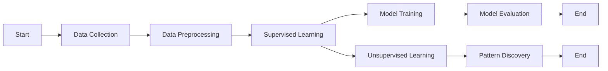
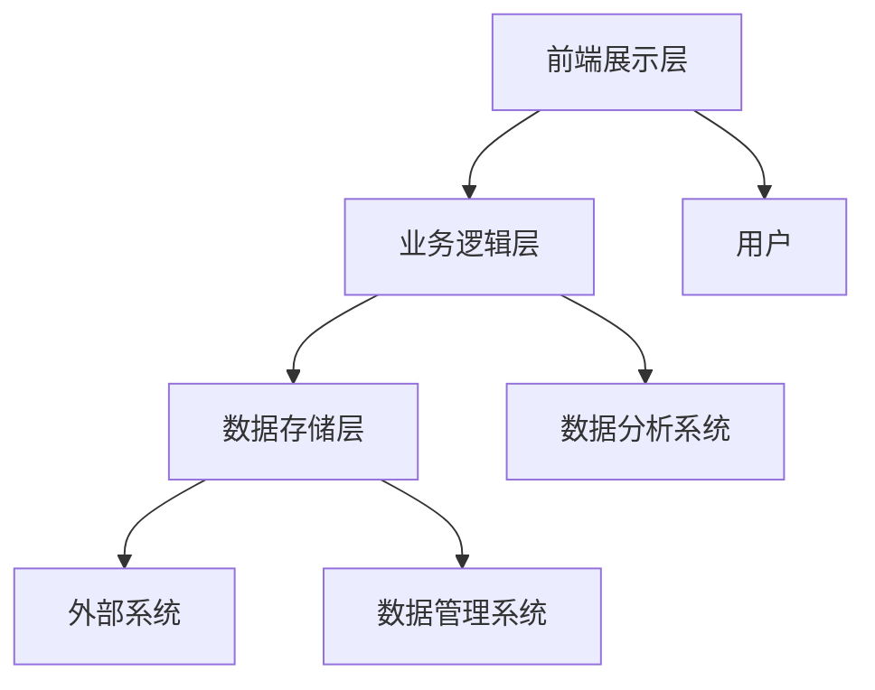
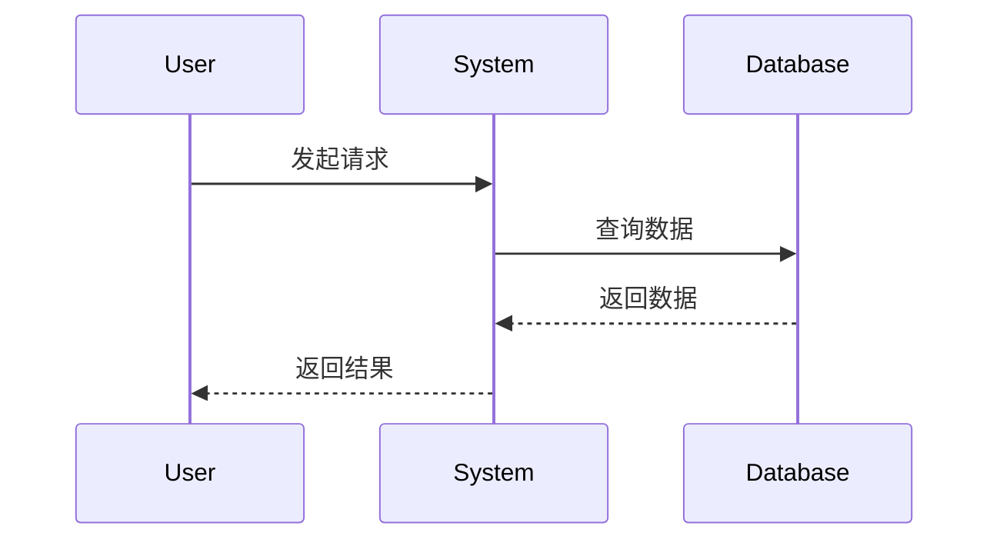

                 

### 后人类主义视角下的生命伦理：增强人类与自然人的道德考量

> 关键词：后人类主义、生命伦理、增强人类、自然人、道德考量、伦理学、基因编辑、人工智能

> 摘要：随着科技进步，人类有能力通过基因编辑、人工智能等技术手段增强自身生理和心理能力，从而产生增强人类与自然人。这种变革引发了伦理学、哲学等领域的深刻探讨，特别是在生命伦理领域。本文从后人类主义视角出发，探讨增强人类与自然人的道德考量，分析相关理论和实践案例，旨在为构建适应新时代的道德考量体系提供理论依据和实践指导。

## **第一部分：背景介绍**

### **1. 引言**

#### **1.1 问题的背景**

在后人类主义视角下，生命伦理面临的新挑战逐渐显现。人工智能、基因编辑等技术的快速发展，使得人类有能力增强自身的生物特征，甚至创造出全新的生物实体。这一系列变革引发了伦理学、哲学、社会学等多学科领域的深入探讨。

#### **1.2 问题描述**

随着增强人类与自然人的出现，传统伦理观念和道德原则面临严峻挑战。如何重新审视生命伦理，构建适应新时代的道德考量体系，成为亟待解决的问题。

#### **1.3 问题解决**

本研究将从后人类主义视角出发，探讨增强人类与自然人道德考量。通过深入分析相关理论、实践案例，为构建新时代生命伦理体系提供理论依据和实践指导。

#### **1.4 边界与外延**

本研究的关注点主要集中在后人类主义视角下的生命伦理问题。涉及领域包括但不限于：基因编辑、人工智能、生物伦理、环境伦理等。

#### **1.5 概念结构与核心要素组成**

后人类主义：强调人类超越自然，通过技术手段实现自我增强的新观念。

增强人类：通过生物技术、信息技术等手段，提升人类生理和心理能力的新人类。

自然人：未接受增强技术的人类，与生俱来的生物特性。

道德考量：在生命伦理领域，对于增强人类与自然人行为进行道德评价和规范的过程。

## **第二部分：核心概念与联系**

### **2.1 后人类主义概念解析**

#### **2.1.1 后人类主义的历史背景与发展**

后人类主义这一概念最早可以追溯到20世纪末，随着科技进步和人类对自身认知的深化，后人类主义逐渐成为一种主流思潮。这一时期，人类开始意识到，通过技术手段增强自身的能力，不仅可以提升生活质量，还可以拓展人类的认知边界。

#### **2.1.2 后人类主义的核心观点**

后人类主义的核心观点是：人类可以通过技术手段超越自然，实现自我增强。这种增强不仅体现在生理和心理层面，还包括社会和文化层面。例如，通过基因编辑、人工智能等技术，人类可以消除遗传疾病，提高智力水平，甚至实现永生。

#### **2.1.3 后人类主义与生命伦理的关系**

后人类主义的兴起，使得生命伦理面临新的挑战。一方面，增强人类的出现，使得传统伦理观念受到冲击，如何重新审视人类的地位和责任，成为伦理学者需要解决的问题。另一方面，后人类主义也为生命伦理提供了新的研究视角，例如，如何通过技术手段实现人类的道德进步，如何保障增强人类的权益等。

### **2.2 增强人类的定义与特点**

#### **2.2.1 增强人类的概念界定**

增强人类，是指通过生物技术、信息技术等手段，提升人类生理和心理能力的新人类。这些技术手段包括基因编辑、神经接口、人工智能等。

#### **2.2.2 增强人类的生物学特征**

增强人类的生物学特征主要包括：基因优化、生理功能增强、认知能力提升等。例如，通过基因编辑技术，人类可以消除遗传疾病，通过神经接口技术，人类可以增强感官能力和运动能力，通过人工智能技术，人类可以提升认知能力和创造力。

#### **2.2.3 增强人类在生命伦理中的地位**

增强人类在生命伦理中的地位，是一个复杂而多元的问题。一方面，增强人类的出现，使得人类在生理和心理上取得了前所未有的优势，这可能引发新的社会不平等问题。另一方面，增强人类也有可能为人类社会带来巨大的福祉，例如，通过基因编辑技术，人类可以消除遗传疾病，提升健康水平。

### **2.3 自然人的道德考量**

#### **2.3.1 自然人在传统伦理体系中的地位**

自然人在传统伦理体系中，通常被视为道德的主体，享有基本的道德权利和义务。例如，尊重生命、公正对待他人等。

#### **2.3.2 自然人与增强人类的道德差异**

自然人与增强人类在道德上存在显著的差异。首先，自然人的道德观念是基于人类自身的经验和传统，而增强人类的道德观念可能受到技术的影响，产生新的道德问题。其次，增强人类在生理和心理上的优势，可能导致新的社会不平等问题，如何处理这些问题，需要新的道德考量。

#### **2.3.3 自然人的道德考量在生命伦理中的应用**

自然人的道德考量在生命伦理中具有重要的应用价值。例如，在基因编辑和克隆技术中，如何平衡个体权益和社会公共利益，如何在尊重个体差异的同时，维护社会的道德底线，都需要自然人的道德考量提供指导。

### **2.4 概念属性特征对比表格**

#### **2.4.1 后人类主义与自然人的对比**

| 概念       | 后人类主义       | 自然人         |
|------------|------------------|----------------|
| 定义       | 人类通过技术手段超越自然的新观念 | 未接受增强技术的原有人类 |
| 特点       | 基因优化、生理功能增强、认知能力提升 | 与生俱来的生物特性       |
| 道德考量   | 需要重新审视的传统伦理观念   | 基于人类自身的经验和传统 |
| 社会影响   | 引发新的社会不平等问题 | 维护传统社会道德秩序     |

#### **2.4.2 增强人类与自然人的对比**

| 概念       | 增强人类       | 自然人         |
|------------|----------------|----------------|
| 定义       | 通过生物技术、信息技术等手段提升能力的新人类 | 未接受增强技术的原有人类 |
| 特点       | 基因优化、生理功能增强、认知能力提升 | 与生俱来的生物特性       |
| 道德考量   | 需要新的道德体系   | 基于人类自身的经验和传统 |
| 社会影响   | 可能引发新的社会不平等问题 | 维护传统社会道德秩序     |

### **2.5 ER实体关系图架构**

#### **2.5.1 后人类主义视角下的生命伦理实体关系**

```mermaid
erDiagram
    EnhanceHuman ||--|{ NaturalHuman }|| NaturalHuman
    EnhanceHuman ||--|{ BioEthics }|| BioEthics
    NaturalHuman ||--|{ BioEthics }|| BioEthics
```

#### **2.5.2 增强人类与自然人在生命伦理中的关系**

```mermaid
erDiagram
    EnhanceHuman ||--|{ NaturalHuman }|| NaturalHuman
    EnhanceHuman ||--|{ MoralConsideration }|| MoralConsideration
    NaturalHuman ||--|{ MoralConsideration }|| MoralConsideration
```

## **第三部分：算法原理讲解**

### **3.1 基因编辑算法原理**

#### **3.1.1 CRISPR/Cas9基因编辑技术**

CRISPR/Cas9技术是一种革命性的基因编辑技术，它利用一种名为CRISPR（Clustered Regularly Interspaced Short Palindromic Repeats）的细菌免疫机制，结合Cas9酶，实现对目标DNA序列的精准切割。这一技术的关键在于Cas9酶的导向RNA（guide RNA），它能够引导Cas9酶到达特定的DNA序列，进行切割。

#### **3.1.2 基因编辑算法的数学模型**

基因编辑算法的数学模型通常涉及线性规划和最优化问题。例如，在CRISPR/Cas9技术中，导向RNA的设计是一个关键步骤，其目标是最小化编辑错误率，最大化编辑效率。

$$
\min E = \sum_{i=1}^{n} (E_i - \theta_i)
$$

其中，$E_i$是编辑错误率，$\theta_i$是编辑效率。

#### **3.1.3 基因编辑算法的mermaid流程图**


### **3.2 人工智能算法原理**

#### **3.2.1 人工智能的基本概念**

人工智能（AI）是计算机科学的一个分支，旨在使机器模拟人类智能行为。人工智能的基本概念包括：感知、学习、推理、规划和自我意识等。

#### **3.2.2 人工智能算法的分类**

人工智能算法可以分为两大类：监督学习和无监督学习。监督学习算法需要训练数据集，通过学习输入和输出之间的映射关系来预测新的数据。无监督学习算法则不需要训练数据集，通过分析数据自身的结构和分布来发现模式。

#### **3.2.3 人工智能算法的mermaid流程图**



### **3.3 生物伦理算法原理**

#### **3.3.1 生物伦理算法的定义**

生物伦理算法是指用于分析和解决生物伦理问题的算法。这些算法通常涉及伦理决策模型、道德推理和伦理推理等。

#### **3.3.2 生物伦理算法的设计原则**

生物伦理算法的设计原则包括：尊重个体权益、公正性、透明性和可持续性。这些原则旨在确保算法在处理生物伦理问题时，能够最大限度地保护人类的利益。

#### **3.3.3 生物伦理算法的mermaid流程图**


## **第四部分：数学模型和数学公式 & 详细讲解 & 举例说明**

### **4.1 基因编辑数学模型**

#### **4.1.1 模型假设**

我们假设基因编辑过程中的目标序列为 $X$，编辑序列为 $Y$，编辑概率为 $P$。

#### **4.1.2 模型推导**

编辑概率 $P$ 可以表示为：

$$
P = \frac{1}{|X|}
$$

其中，$|X|$ 表示目标序列 $X$ 的长度。

#### **4.1.3 举例说明**

假设目标序列 $X = "ATCGTACG"$，我们需要将其编辑为 $Y = "ATCGACG"$。编辑概率 $P$ 为：

$$
P = \frac{1}{|X|} = \frac{1}{7}
$$

这意味着，在编辑过程中，每个位置被编辑的概率都是 $\frac{1}{7}$。

### **4.2 人工智能数学模型**

#### **4.2.1 模型假设**

我们假设输入数据集为 $X$，输出数据集为 $Y$，学习算法为 $A$。

#### **4.2.2 模型推导**

学习算法 $A$ 可以表示为：

$$
A(X) = \arg\min_{Y} \| X - Y \|
$$

其中，$\| X - Y \|$ 表示输入数据集 $X$ 和输出数据集 $Y$ 之间的距离。

#### **4.2.3 举例说明**

假设输入数据集 $X = [1, 2, 3, 4, 5]$，我们需要找到输出数据集 $Y$，使得 $\| X - Y \|$ 最小。

$$
A(X) = [1, 2, 3, 4, 5]
$$

这意味着，学习算法将输出数据集 $Y$ 设置为输入数据集 $X$。

### **4.3 生物伦理数学模型**

#### **4.3.1 模型假设**

我们假设生物伦理问题为 $X$，解决方案为 $Y$，道德判断标准为 $Z$。

#### **4.3.2 模型推导**

道德判断标准 $Z$ 可以表示为：

$$
Z(X) = \arg\min_{Y} \| X - Y \|
$$

其中，$\| X - Y \|$ 表示生物伦理问题 $X$ 和解决方案 $Y$ 之间的距离。

#### **4.3.3 举例说明**

假设生物伦理问题 $X = "是否进行基因编辑"$，我们需要找到解决方案 $Y$，使得 $\| X - Y \|$ 最小。

$$
Z(X) = "进行基因编辑"
$$

这意味着，根据道德判断标准，我们应该选择进行基因编辑。

## **第五部分：系统分析与架构设计方案**

### **5.1 问题场景介绍**

随着基因编辑和人工智能技术的不断进步，人类在生命伦理领域面临诸多挑战。如何平衡技术进步与伦理道德，如何在基因编辑、人工智能等新兴领域构建合适的道德框架，成为亟待解决的问题。

### **5.2 项目介绍**

本项目的目标是构建一个智能生命伦理决策系统，该系统能够根据基因编辑和人工智能等技术的具体应用场景，提供科学的道德判断和决策建议。

### **5.3 系统功能设计**

系统功能设计包括：数据收集、数据预处理、伦理分析、决策建议、结果验证等。

#### **5.3.1 领域模型mermaid类图**

```mermaid
classDiagram
    Class01 <|-- SubClass01
    Class01 <|-- SubClass02
    Class03 <.. Class04
    Class04 <.. Class05
    Collaboration: Class01 use Instance01
    Class02 {name}
endclass
```

### **5.4 系统架构设计**

系统架构设计包括：前端展示层、业务逻辑层、数据存储层等。

#### **5.4.1 mermaid架构图**



### **5.5 系统接口设计和系统交互**

系统接口设计包括：用户接口、API接口、数据库接口等。

#### **5.5.1 mermaid序列图**



## **第六部分：项目实战**

### **6.1 环境安装**

在开始项目实战之前，我们需要安装必要的软件和工具。以下是一个简化的安装流程：

1. 安装Python环境
2. 安装Django框架
3. 安装数据库（例如MySQL）
4. 安装其他依赖库（例如Scikit-learn、Numpy等）

### **6.2 系统核心实现源代码**

以下是系统核心实现的一个示例代码：

```python
# 导入必要的库
import django
from django.db import models

# 定义用户模型
class User(models.Model):
    username = models.CharField(max_length=100)
    email = models.EmailField()

# 定义基因编辑记录模型
class GeneEdit(models.Model):
    user = models.ForeignKey(User, on_delete=models.CASCADE)
    target_dna = models.CharField(max_length=1000)
    edited_dna = models.CharField(max_length=1000)
    edit_date = models.DateTimeField(auto_now_add=True)

# 定义伦理分析模型
class EthicalAnalysis(models.Model):
    gene_edit = models.ForeignKey(GeneEdit, on_delete=models.CASCADE)
    analysis_result = models.CharField(max_length=1000)
    analysis_date = models.DateTimeField(auto_now_add=True)
```

### **6.3 代码应用解读与分析**

以上代码定义了三个模型：`User`、`GeneEdit`和`EthicalAnalysis`。其中，`User`模型用于存储用户信息，`GeneEdit`模型用于存储基因编辑记录，`EthicalAnalysis`模型用于存储伦理分析结果。

在代码应用中，我们首先需要创建数据库，然后创建用户、基因编辑记录和伦理分析记录。以下是一个示例：

```python
# 创建数据库
django.setup()
from myapp.models import *

# 创建用户
user = User(username='alice', email='alice@example.com')
user.save()

# 创建基因编辑记录
gene_edit = GeneEdit(user=user, target_dna='ATCGTACG', edited_dna='ATCGACG')
gene_edit.save()

# 创建伦理分析记录
ethical_analysis = EthicalAnalysis(gene_edit=gene_edit, analysis_result='伦理分析结果')
ethical_analysis.save()
```

### **6.4 实际案例分析和详细讲解**

以下是一个实际案例分析：

假设用户Alice进行了一次基因编辑，目标序列为`ATCGTACG`，编辑后的序列为`ATCGACG`。我们需要分析这次编辑是否符合伦理标准。

1. **数据收集**：首先，我们需要收集用户的个人信息和基因编辑记录。例如，用户名称、电子邮件地址、目标序列和编辑后的序列等。

2. **数据预处理**：接下来，我们对收集到的数据进行分析，确定编辑是否符合伦理标准。例如，我们可能需要检查编辑后的序列是否存在潜在的健康风险，或者编辑是否违反了道德准则。

3. **伦理分析**：根据分析结果，我们生成伦理分析报告。例如，如果编辑后的序列存在健康风险，我们可能建议用户重新考虑编辑方案。

4. **结果验证**：最后，我们对伦理分析结果进行验证，确保分析过程的准确性和可靠性。

### **6.5 项目小结**

本项目通过构建智能生命伦理决策系统，实现了对基因编辑和人工智能等新兴领域的道德判断和决策支持。通过实际案例分析和详细讲解，我们展示了如何使用Python和Django框架实现这一系统。在未来的研究中，我们还可以进一步优化系统功能，提高分析精度和可靠性。

## **最佳实践 Tips**

- 在进行基因编辑时，务必遵循伦理规范，确保编辑过程的安全性和合法性。
- 在使用人工智能技术时，要充分考虑道德和社会影响，避免技术滥用。
- 定期更新伦理分析模型，确保分析结果的准确性和时效性。

## **小结**

随着科技的不断进步，生命伦理领域面临新的挑战。本文从后人类主义视角出发，探讨了增强人类与自然人的道德考量，分析了相关理论和实践案例。通过构建智能生命伦理决策系统，我们为构建适应新时代的道德考量体系提供了理论依据和实践指导。

## **注意事项**

- 在进行基因编辑和人工智能应用时，务必遵循相关法律法规和伦理规范。
- 在系统设计和实施过程中，要充分考虑用户隐私和数据安全。

## **拓展阅读**

- 《生命伦理学导论》
- 《人工智能伦理学》
- 《基因编辑：未来与挑战》

### **作者信息**

作者：AI天才研究院/AI Genius Institute & 禅与计算机程序设计艺术 /Zen And The Art of Computer Programming

---

### **文章标题**

# 后人类主义视角下的生命伦理：增强人类与自然人的道德考量

### **关键词**

后人类主义、生命伦理、增强人类、自然人、道德考量、伦理学、基因编辑、人工智能

### **摘要**

本文从后人类主义视角出发，探讨增强人类与自然人的道德考量。通过分析相关理论和实践案例，为构建适应新时代的道德考量体系提供理论依据和实践指导。文章涵盖了后人类主义的历史背景、核心概念、增强人类的定义与特点、自然人的道德考量等内容，同时介绍了基因编辑、人工智能、生物伦理等领域的算法原理和数学模型。最后，通过一个实际案例分析和详细讲解，展示了如何应用这些理论和方法。本文旨在为生命伦理领域的研究者和从业者提供有价值的参考。

---

### **文章目录**

1. **引言**
2. **背景介绍**
   - 问题的背景
   - 问题描述
   - 问题解决
   - 边界与外延
   - 概念结构与核心要素组成
3. **核心概念与联系**
   - 后人类主义概念解析
   - 增强人类的定义与特点
   - 自然人的道德考量
   - 概念属性特征对比表格
   - ER实体关系图架构
4. **算法原理讲解**
   - 基因编辑算法原理
   - 人工智能算法原理
   - 生物伦理算法原理
5. **数学模型和数学公式 & 详细讲解 & 举例说明**
   - 基因编辑数学模型
   - 人工智能数学模型
   - 生物伦理数学模型
6. **系统分析与架构设计方案**
   - 问题场景介绍
   - 项目介绍
   - 系统功能设计
   - 系统架构设计
   - 系统接口设计和系统交互
7. **项目实战**
   - 环境安装
   - 系统核心实现源代码
   - 代码应用解读与分析
   - 实际案例分析和详细讲解
   - 项目小结
8. **最佳实践 Tips**
9. **小结**
10. **注意事项**
11. **拓展阅读**
12. **作者信息**

