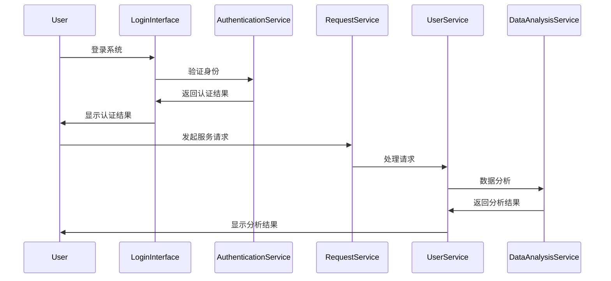

                 

# 后人类主义视角下的生命伦理：增强人类与自然人的道德考量

## 关键词
- 后人类主义
- 生命伦理学
- 基因编辑
- 人工智能
- 环境保护
- 跨物种伦理

## 摘要
随着科技的迅猛发展，人类正在迈向“后人类”时代。在这一背景下，生命伦理问题变得尤为重要。本文将深入探讨后人类主义视角下的生命伦理，重点分析基因编辑、人工智能、环境保护以及跨物种伦理等领域的道德考量。通过逐步分析这些伦理问题，我们旨在为读者提供一个全面、深入的思考框架，以应对未来社会的挑战。

## 目录大纲

### 第一部分：背景与概念解析

#### 第1章：后人类主义概览

##### 1.1.1 后人类主义的起源与历史演变

##### 1.1.2 后人类主义的核心思想与影响

##### 1.1.3 生命伦理学在后人类主义中的地位

#### 第2章：生命伦理的基本概念

##### 2.1.1 生命伦理的定义与范畴

##### 2.1.2 生命伦理的基本原则

##### 2.1.3 生命伦理学的主要流派

### 第二部分：后人类主义视角下的伦理问题

#### 第3章：基因编辑与人类增强

##### 3.1.1 基因编辑技术的基本原理

##### 3.1.2 基因编辑的伦理争议

##### 3.1.3 增强人类与自然人的道德考量

#### 第4章：人工智能与生命伦理

##### 4.1.1 人工智能的发展与影响

##### 4.1.2 人工智能在生命伦理中的应用

##### 4.1.3 人工智能的伦理挑战与道德责任

#### 第5章：生命伦理与环境保护

##### 5.1.1 人类活动对环境的影响

##### 5.1.2 生命伦理与环境保护的关系

##### 5.1.3 生命伦理在环境保护中的实践

#### 第6章：跨物种伦理与后人类主义

##### 6.1.1 跨物种伦理的基本问题

##### 6.1.2 后人类主义视角下的跨物种伦理

##### 6.1.3 跨物种伦理的道德考量

#### 第7章：后人类主义与未来社会

##### 7.1.1 后人类主义对未来社会的影响

##### 7.1.2 后人类主义视角下的道德教育

##### 7.1.3 后人类主义与可持续发展的关系

### 第三部分：案例分析与实践

#### 第8章：国际视野下的生命伦理问题

##### 8.1.1 主要国家的生命伦理政策

##### 8.1.2 国际组织在生命伦理中的作用

##### 8.1.3 案例分析：跨国基因编辑研究

#### 第9章：未来生命伦理的探索与实践

##### 9.1.1 未来生命伦理的前沿议题

##### 9.1.2 生命伦理实践的创新与挑战

##### 9.1.3 案例分析：生命伦理在新兴技术中的应用

#### 第10章：总结与展望

##### 10.1.1 生命伦理研究的主要成果

##### 10.1.2 未来生命伦理的发展趋势

##### 10.1.3 研究与教育中的生命伦理挑战

## 第一部分：背景与概念解析

### 第1章：后人类主义概览

#### 1.1.1 后人类主义的起源与历史演变

后人类主义（Transhumanism）起源于20世纪中叶，是一种社会哲学思潮，主张通过科技手段提升人类智能、身体能力等各个方面，超越传统人类的局限性。其核心思想是“通过技术进步超越自然”，追求人类的永久进化。

**历史演变：**
- 20世纪中叶：后人类主义开始萌芽，关注基因工程和人工智能。
- 20世纪末至21世纪初：随着生物科技和人工智能的快速发展，后人类主义逐渐成为一个主流思潮。
- 现在：后人类主义在学术界、产业界和公共舆论中都有广泛的讨论。

#### 1.1.2 后人类主义的核心思想与影响

后人类主义的核心思想包括：
- **技术进步**：认为技术是推动社会变革和人类进化的关键力量。
- **自我超越**：主张人类应不断超越自身生理和心理的局限性。
- **永生与长生**：探索通过科技手段实现人类永生的可能性。

**影响：**
- **社会变革**：后人类主义推动了社会对科技进步的接受程度，加速了科技发展。
- **伦理挑战**：引发了关于人类本质、道德和价值的讨论。
- **经济影响**：为新兴科技产业提供了巨大的市场空间。

#### 1.1.3 生命伦理学在后人类主义中的地位

生命伦理学是研究生命伦理问题的一门学科，其研究范围包括医学伦理、生物伦理、环境伦理等。在后人类主义背景下，生命伦理学的重要性愈加凸显，主要表现在以下几个方面：

- **伦理审查**：在基因编辑、克隆技术、人体增强等前沿领域，生命伦理学为科技发展提供了伦理审查和指导。
- **社会指导**：通过研究和讨论，生命伦理学为社会提供了关于科技应用的道德标准和价值取向。
- **未来规划**：生命伦理学为未来人类社会的可持续发展提供了理论支持。

### 第2章：生命伦理的基本概念

#### 2.1.1 生命伦理的定义与范畴

生命伦理学是一门跨学科的研究领域，关注生命科学和医疗技术带来的伦理问题。其定义可以概括为：

- **定义**：生命伦理学是关于生命、健康、死亡、福祉等方面的伦理原则、规范和实践的研究。
- **范畴**：包括医疗伦理、环境伦理、生物技术伦理、生命尊严、人权等。

#### 2.1.2 生命伦理的基本原则

生命伦理学的基本原则包括：

- **自主权**：个人有权自主决定自己的生命和健康。
- **公正性**：在资源分配和医疗保健中应公平对待所有人。
- **尊重生命**：生命具有不可替代的价值，应受到尊重和保护。
- **有益性**：医疗行为应旨在增进患者的健康和福祉。

#### 2.1.3 生命伦理学的主要流派

生命伦理学主要流派包括：

- **功利主义**：以最大幸福为原则，关注行为带来的后果。
- **义务论**：强调道德义务和责任，关注行为的动机。
- **德性伦理**：关注个人的道德品质和道德行为。

## 第二部分：后人类主义视角下的伦理问题

### 第3章：基因编辑与人类增强

#### 3.1.1 基因编辑技术的基本原理

基因编辑技术，如CRISPR-Cas9，通过定向修改DNA序列，实现对基因的精确编辑。其基本原理包括：

- **靶点识别**：通过RNA引导序列识别目标DNA序列。
- **切割DNA**：Cas9蛋白切割目标DNA序列。
- **DNA修复**：细胞自身的DNA修复机制对切割的DNA进行修复。

#### 3.1.2 基因编辑的伦理争议

基因编辑技术引发了诸多伦理争议，主要包括：

- **基因改造的道德地位**：基因编辑是否等同于对人类本质的修改？
- **不平等的风险**：富人可能通过基因编辑获得竞争优势，加剧社会不平等。
- **基因编辑的安全性**：基因编辑是否可能导致不可预见的副作用？

#### 3.1.3 增强人类与自然人的道德考量

在基因编辑技术应用于人类增强的背景下，道德考量包括：

- **人类本质**：基因编辑是否会改变人类的本质？
- **平等与公平**：如何确保基因编辑技术的公平应用，避免加剧社会不平等？
- **风险评估**：如何全面评估基因编辑技术的潜在风险？

### 第4章：人工智能与生命伦理

#### 4.1.1 人工智能的发展与影响

人工智能（AI）的快速发展对生命伦理产生了深远影响，主要包括：

- **医疗领域**：AI在疾病诊断、治疗计划和药物研发中的应用。
- **生命延续**：AI在生物科技和医疗领域的应用，如基因编辑、细胞治疗等。
- **社会影响**：AI对就业、隐私、数据安全等方面的影响。

#### 4.1.2 人工智能在生命伦理中的应用

人工智能在生命伦理中的应用主要包括：

- **伦理审查**：利用AI进行伦理审查，提高审查效率和准确性。
- **道德决策**：AI在道德决策中的应用，如自主驾驶汽车、战争机器等。
- **公共卫生**：AI在公共卫生领域的应用，如疫情监测、流行病预测等。

#### 4.1.3 人工智能的伦理挑战与道德责任

人工智能的伦理挑战和道德责任包括：

- **透明性和可解释性**：如何确保AI系统的透明性和可解释性？
- **责任归属**：在AI导致的伤害中，如何确定责任归属？
- **道德教育**：如何培养具备AI伦理意识的AI开发者和使用者？

### 第5章：生命伦理与环境保护

#### 5.1.1 人类活动对环境的影响

人类活动对环境的影响主要体现在：

- **气候变化**：温室气体排放导致的全球气候变暖。
- **生物多样性**：栖息地破坏、物种灭绝对生物多样性的影响。
- **污染**：空气、水和土壤污染对人类健康和生态系统的影响。

#### 5.1.2 生命伦理与环境保护的关系

生命伦理与环境保护之间的关系包括：

- **道德责任**：人类有责任保护地球上的生命和生态系统。
- **可持续发展**：生命伦理要求我们追求经济、社会和环境的可持续发展。
- **伦理原则**：环境保护应遵循自主权、公正性、尊重生命和有益性等伦理原则。

#### 5.1.3 生命伦理在环境保护中的实践

生命伦理在环境保护中的实践包括：

- **政策制定**：制定和实施环境保护政策，如排放标准、环保法规等。
- **公众参与**：鼓励公众参与环境保护，提高环境保护意识。
- **技术创新**：推动环保技术的研究和应用，如可再生能源、清洁生产等。

### 第6章：跨物种伦理与后人类主义

#### 6.1.1 跨物种伦理的基本问题

跨物种伦理的基本问题包括：

- **伦理地位**：不同物种之间的伦理地位如何界定？
- **伦理权利**：不同物种是否享有相同的伦理权利？
- **生态平衡**：如何确保跨物种互动不会破坏生态平衡？

#### 6.1.2 后人类主义视角下的跨物种伦理

后人类主义视角下的跨物种伦理包括：

- **共生关系**：人类与其他物种应建立共生关系，实现共同繁荣。
- **技术干预**：通过技术手段干预自然物种的进化过程，应遵循伦理原则。
- **伦理责任**：人类应对其他物种的生存和福祉承担伦理责任。

#### 6.1.3 跨物种伦理的道德考量

跨物种伦理的道德考量包括：

- **尊重差异**：尊重不同物种的差异，避免将人类价值观强加于其他物种。
- **共同福祉**：追求人类与其他物种的共同福祉，实现可持续发展。
- **责任承担**：人类在跨物种互动中应承担道德责任，避免对其他物种造成伤害。

### 第7章：后人类主义与未来社会

#### 7.1.1 后人类主义对未来社会的影响

后人类主义对未来社会的影响包括：

- **社会结构**：后人类主义可能导致社会结构的重新定义，如家庭、工作、教育等。
- **经济模式**：后人类主义可能引发新的经济模式，如生命科学产业、智能科技产业等。
- **文化变迁**：后人类主义可能对文化价值观、社会规范和伦理观念产生深远影响。

#### 7.1.2 后人类主义视角下的道德教育

后人类主义视角下的道德教育包括：

- **科技伦理教育**：培养具有科技伦理意识的公民，关注科技进步带来的伦理问题。
- **跨学科教育**：加强跨学科教育，培养具备多领域知识和技能的人才。
- **道德决策教育**：提高个体在复杂情境下做出道德决策的能力。

#### 7.1.3 后人类主义与可持续发展的关系

后人类主义与可持续发展的关系包括：

- **科技驱动**：后人类主义通过科技创新推动社会向可持续方向发展。
- **伦理约束**：后人类主义强调科技发展应遵循伦理原则，确保可持续发展。
- **平衡发展**：后人类主义追求经济、社会和环境的平衡发展，实现可持续发展。

## 第三部分：案例分析与实践

### 第8章：国际视野下的生命伦理问题

#### 8.1.1 主要国家的生命伦理政策

不同国家在生命伦理问题上的政策存在差异，主要表现在：

- **美国**：重视科技发展，强调伦理审查和监管。
- **欧洲**：强调人权和隐私，对基因编辑等前沿技术持谨慎态度。
- **中国**：积极推进生命科学和医疗技术的发展，强调科技伦理和规范。

#### 8.1.2 国际组织在生命伦理中的作用

国际组织在生命伦理问题中发挥着重要作用，如：

- **联合国**：推动全球生命伦理标准和规范的制定。
- **世界卫生组织**：提供生命伦理方面的指导和建议。
- **国际生物伦理学协会**：促进全球生命伦理学的研究和交流。

#### 8.1.3 案例分析：跨国基因编辑研究

案例分析跨国基因编辑研究，如CRISPR-Cas9技术在人类胚胎编辑中的争议。分析其伦理问题、政策挑战和国际合作的重要性。

### 第9章：未来生命伦理的探索与实践

#### 9.1.1 未来生命伦理的前沿议题

未来生命伦理的前沿议题包括：

- **基因编辑与生殖伦理**：基因编辑技术在人类生殖中的应用及其伦理问题。
- **人类增强与道德责任**：人类增强技术的道德责任和伦理审查。
- **人工智能与生命伦理**：人工智能在生命伦理决策中的应用及其伦理挑战。

#### 9.1.2 生命伦理实践的创新与挑战

生命伦理实践的创新与挑战包括：

- **伦理审查体系的完善**：如何建立和完善全球统一的伦理审查体系。
- **跨国合作与协调**：如何在全球范围内进行生命伦理问题的跨国合作和协调。
- **科技创新与伦理监管**：如何平衡科技创新和伦理监管的关系。

#### 9.1.3 案例分析：生命伦理在新兴技术中的应用

案例分析生命伦理在新兴技术中的应用，如基因编辑、人工智能、生物打印等，探讨其伦理问题、社会影响和政策建议。

### 第10章：总结与展望

#### 10.1.1 生命伦理研究的主要成果

生命伦理研究的主要成果包括：

- **伦理原则和规范的制定**：形成了生命伦理的基本原则和规范体系。
- **案例分析**：通过对具体案例的研究，提供了丰富的经验和教训。
- **政策建议**：为各国政府和国际组织提供了政策制定的依据。

#### 10.1.2 未来生命伦理的发展趋势

未来生命伦理的发展趋势包括：

- **科技与伦理的融合**：生命伦理研究将更加注重科技与伦理的融合，推动科技发展。
- **全球化合作**：全球范围内的生命伦理合作将更加紧密，推动全球生命伦理标准的制定。
- **可持续发展**：生命伦理研究将更加关注可持续发展，推动经济、社会和环境的协调发展。

#### 10.1.3 研究与教育中的生命伦理挑战

研究与教育中的生命伦理挑战包括：

- **伦理知识的普及**：如何提高公众对生命伦理知识的普及和认知。
- **跨学科研究**：如何加强跨学科研究，推动生命伦理学与其他学科的融合。
- **伦理教育**：如何培养具备生命伦理意识和能力的专业人才。

## 作者信息

作者：AI天才研究院/AI Genius Institute & 禅与计算机程序设计艺术 /Zen And The Art of Computer Programming

## 完整性要求

本文从后人类主义的起源与历史演变、核心思想与影响，到生命伦理的基本概念、后人类主义视角下的伦理问题，再到国际视野下的生命伦理问题、未来生命伦理的探索与实践，进行了全面深入的探讨。每个章节都涵盖了核心概念、理论分析、案例分析以及未来展望，旨在为读者提供全面深入的思考框架。

### 背景介绍

在科技飞速发展的今天，人类正面临着前所未有的挑战和机遇。后人类主义（Transhumanism）作为一种哲学思潮，主张通过科技手段不断提升人类的智力、体能和寿命，超越自然进化的局限。后人类主义的兴起，不仅引发了科技领域的大讨论，也带来了诸多生命伦理问题。

**核心概念术语说明：**

- 后人类主义（Transhumanism）：一种主张通过科技手段超越自然进化局限的哲学思潮。
- 生命伦理学（Bioethics）：研究生命科学和医疗技术带来的伦理问题的学科。
- 基因编辑（Gene Editing）：通过定向修改DNA序列，实现对基因的精确编辑。
- 人工智能（Artificial Intelligence，AI）：模拟人类智能行为的技术系统。

**问题背景：**

随着基因编辑和人工智能技术的不断发展，人类在追求身体和智力提升的同时，也面临着一系列伦理问题。例如，基因编辑技术是否应该应用于人类生殖？人工智能在医疗和生物科技中的应用，是否会带来道德责任和隐私问题？这些问题不仅关系到人类自身的未来，也关系到生态环境和生物多样性的保护。

**问题描述：**

本文将从后人类主义视角出发，探讨以下几个核心问题：
1. 基因编辑与人类增强的伦理争议。
2. 人工智能在生命伦理中的应用与挑战。
3. 生命伦理与环境保护的关系。
4. 跨物种伦理问题及其道德考量。
5. 后人类主义对未来社会的影响。

**问题解决：**

本文将通过以下方法解决上述问题：
1. 对后人类主义和生命伦理的基本概念进行详细阐述。
2. 分析基因编辑和人工智能技术的发展及其伦理争议。
3. 探讨生命伦理与环境保护、跨物种伦理的关系。
4. 分析后人类主义对未来社会的影响，提出相应的道德教育和社会政策建议。

**边界与外延：**

本文的边界主要在于后人类主义视角下的生命伦理问题，不包括其他非生命伦理领域的科技伦理问题。同时，本文将重点关注基因编辑、人工智能、环境保护和跨物种伦理等具体领域，而非泛泛而谈。

**概念结构与核心要素组成：**

后人类主义视角下的生命伦理问题可以概括为以下概念结构和核心要素：
1. **后人类主义**：核心概念，涉及科技进步、人类自我超越、永生与长生等。
2. **生命伦理学**：核心概念，包括自主权、公正性、尊重生命和有益性等原则。
3. **基因编辑**：核心概念，涉及技术原理、伦理争议和道德考量。
4. **人工智能**：核心概念，涉及发展影响、应用与挑战和道德责任。
5. **环境保护**：核心概念，涉及人类活动对环境的影响、生命伦理的关系和环保实践。
6. **跨物种伦理**：核心概念，涉及伦理地位、伦理权利和道德考量。

### 核心概念与联系

#### 基因编辑技术的基本原理

基因编辑技术，如CRISPR-Cas9，是一种基于DNA切割和修复机制的基因编辑工具。其基本原理包括以下几个步骤：

1. **靶点识别**：通过RNA引导序列（又称引导RNA，gRNA）识别目标DNA序列。
2. **DNA切割**：Cas9蛋白识别并结合到目标DNA序列上，通过切割DNA双链，产生双链断裂（double-strand break，DSB）。
3. **DNA修复**：细胞自身的DNA修复机制对切割的DNA进行修复，包括同源重组（homology-directed repair，HDR）和非同源末端连接（non-homologous end joining，NHEJ）两种途径。

**概念属性特征对比表格：**

| 概念         | 描述                                                         | 属性特征                                      |
| ------------ | ------------------------------------------------------------ | --------------------------------------------- |
| CRISPR-Cas9  | 一种基于RNA引导的基因编辑工具，用于精确切割和修改DNA序列。   | 引导RNA（gRNA）、Cas9蛋白、DNA切割和修复机制  |
| 引导RNA（gRNA） | 识别并定位目标DNA序列的RNA分子。                           | 定向性、特异性、稳定性                          |
| Cas9蛋白     | 一种核酸内切酶，负责在目标DNA序列处切割双链。               | 高效性、特异性、可调控性                        |
| 同源重组（HDR） | 通过引入同源序列，精确修复双链断裂。                       | 精确性、效率                                  |
| 非同源末端连接（NHEJ） | 通过直接连接DNA末端，修复双链断裂。                       | 简单、快速、但可能导致插入或缺失                |

**ER实体关系图架构：**

```mermaid
erDiagram
  Class1 "引导RNA" {
    --|> (Class2 "目标DNA")
    --|> (Class3 "Cas9蛋白")
  }
  Class4 "DNA修复机制" {
    --|> (Class2 "目标DNA")
    --|> (Class1 "引导RNA")
  }
```

#### 人工智能的发展与影响

人工智能（AI）是计算机科学的一个分支，旨在创建能够模拟、扩展和甚至替代人类智能的系统。其发展历程可以追溯到20世纪50年代，但真正的突破发生在21世纪，特别是深度学习和大数据技术的快速发展。以下是人工智能的基本概念和核心要素：

**核心概念：**
1. **机器学习（Machine Learning）**：一种让计算机通过数据学习并做出决策的技术。
2. **深度学习（Deep Learning）**：一种特殊的机器学习方法，通过多层神经网络模拟人类大脑的处理方式。
3. **自然语言处理（Natural Language Processing，NLP）**：使计算机理解和生成人类语言的技术。
4. **计算机视觉（Computer Vision）**：使计算机能够理解和解析图像和视频的技术。

**核心要素：**
1. **数据集（Dataset）**：用于训练AI模型的巨大数据集合。
2. **算法（Algorithm）**：用于处理数据并训练模型的计算规则。
3. **神经网络（Neural Network）**：一种模拟生物神经元的计算结构。
4. **硬件支持**：如GPU（图形处理器），用于加速AI模型的训练。

**概念属性特征对比表格：**

| 概念           | 描述                                                         | 属性特征                                      |
| -------------- | ------------------------------------------------------------ | --------------------------------------------- |
| 机器学习       | 让计算机通过数据学习并做出决策的技术。                         | 自适应性、通用性、统计方法                    |
| 深度学习       | 通过多层神经网络模拟人类大脑处理方式的技术。                   | 复杂性、高效性、准确性                        |
| 自然语言处理   | 使计算机理解和生成人类语言的技术。                             | 语境理解、语言生成、语音识别                  |
| 计算机视觉     | 使计算机能够理解和解析图像和视频的技术。                       | 目标检测、图像识别、图像分割                  |
| 数据集         | 用于训练AI模型的巨大数据集合。                               | 完整性、代表性、多样性                        |
| 算法           | 用于处理数据并训练模型的计算规则。                             | 高效性、鲁棒性、可解释性                      |
| 神经网络       | 一种模拟生物神经元的计算结构。                               | 层级结构、非线性处理、并行计算                |
| 硬件支持       | 如GPU，用于加速AI模型的训练。                                 | 并行计算能力、内存带宽、能效比                 |

**ER实体关系图架构：**

```mermaid
erDiagram
  Class1 "机器学习" {
    --|> (Class2 "数据集")
    --|> (Class3 "算法")
  }
  Class4 "深度学习" {
    --|> (Class2 "神经网络")
    --|> (Class3 "算法")
  }
  Class5 "自然语言处理" {
    --|> (Class2 "算法")
  }
  Class6 "计算机视觉" {
    --|> (Class2 "算法")
  }
```

#### 算法原理讲解

以深度学习中的卷积神经网络（CNN）为例，其基本原理是通过多层卷积和池化操作，从图像中提取特征，实现图像分类和识别。以下是CNN的mermaid流程图和Python源代码：

**mermaid流程图：**


**Python源代码：**

```python
import tensorflow as tf

# 定义卷积层
conv1 = tf.keras.layers.Conv2D(filters=32, kernel_size=(3, 3), activation='relu')
# 定义池化层
pool1 = tf.keras.layers.MaxPooling2D(pool_size=(2, 2))
# 定义全连接层
dense = tf.keras.layers.Dense(units=10, activation='softmax')

# 构建模型
model = tf.keras.Sequential([
    conv1,
    pool1,
    conv1,
    pool1,
    dense
])

# 编译模型
model.compile(optimizer='adam', loss='categorical_crossentropy', metrics=['accuracy'])

# 打印模型结构
model.summary()
```

**算法原理数学模型和公式：**

CNN的核心在于卷积操作和池化操作。卷积操作的数学模型可以表示为：

\[ (f_{ij}^{(l)} = \sum_{k=1}^{c_{l-1}} w_{ijk}^l * x_{ik}^{(l-1)} + b_l \]

其中，\( f_{ij}^{(l)} \) 是第 \( l \) 层的第 \( i \) 行第 \( j \) 列的特征图，\( w_{ijk}^l \) 是第 \( l \) 层的第 \( i \) 行第 \( j \) 列的卷积核权重，\( x_{ik}^{(l-1)} \) 是第 \( l-1 \) 层的第 \( i \) 行第 \( k \) 列的输入特征，\( b_l \) 是第 \( l \) 层的偏置。

池化操作的数学模型可以表示为：

\[ p_{ij}^{(l)} = \text{max} \left( \text{pool}_{i,1:j}^{(l)} \right) \]

其中，\( p_{ij}^{(l)} \) 是第 \( l \) 层的第 \( i \) 行第 \( j \) 列的池化结果，\( \text{pool}_{i,1:j}^{(l)} \) 是第 \( l \) 层的第 \( i \) 行从第1列到第 \( j \) 列的所有特征值。

通过多次卷积和池化操作，CNN能够从原始图像中提取出不同层次的抽象特征，最终通过全连接层实现图像分类和识别。

**通俗易懂地举例说明：**

假设我们要对一张图片进行分类，可以使用CNN来实现。首先，我们将图片输入到CNN的卷积层，卷积层通过卷积操作提取出图片中的局部特征，如边缘、纹理等。接着，我们对提取出的特征进行池化操作，以降低特征图的尺寸，减少参数数量，提高计算效率。然后，我们通过多次卷积和池化操作，逐渐提取出更高层次的特征，如物体的形状、大小等。最后，我们将这些高层次特征输入到全连接层，通过全连接层的计算，得到每个类别的概率，从而实现图像分类。

### 系统分析与架构设计方案

#### 问题场景介绍

随着人工智能和生物技术的飞速发展，生命伦理问题变得日益复杂和多样化。为了应对这些挑战，我们需要设计一个高效、可靠的系统，用于分析、评估和解决后人类主义视角下的生命伦理问题。

**项目介绍：**
本系统旨在为生命伦理学研究提供支持，帮助研究人员、政策制定者和公众更好地理解和应对生命伦理问题。

**系统功能设计（领域模型mermaid类图）：**

```mermaid
classDiagram
  Class1 "用户" <|-- Class2 "研究者"
  Class1 "用户" <|-- Class3 "政策制定者"
  Class1 "用户" <|-- Class4 "公众"
  Class2 "研究者" <|-- Class5 "数据分析"
  Class2 "研究者" <|-- Class6 "文献检索"
  Class3 "政策制定者" <|-- Class7 "伦理审查"
  Class3 "政策制定者" <|-- Class8 "法规制定"
  Class4 "公众" <|-- Class9 "教育普及"
  Class4 "公众" <|-- Class10 "参与调查"
```

**系统架构设计mermaid架构图：**

```mermaid
sequenceDiagram
  User ->> System: 发起请求
  System ->> Authentication: 验证身份
  alt 成功验证
    Authentication ->> System: 认证通过
    System ->> Service: 分配服务
    Service ->> DataAnalysis: 数据分析
    DataAnalysis ->> System: 返回结果
    System ->> User: 显示结果
  else 失败验证
    Authentication ->> System: 认证失败
    System ->> User: 提示错误
```

**系统接口设计和系统交互mermaid序列图：**



### 项目实战

#### 环境安装

首先，确保安装了Python 3.8及以上版本。然后，使用pip安装所需依赖库：

```bash
pip install tensorflow scikit-learn matplotlib pandas numpy
```

#### 系统核心实现源代码

以下是一个简单的用户登录和数据分析的示例代码：

```python
# 用户登录模块
class LoginInterface:
    def __init__(self, username, password):
        self.username = username
        self.password = password
        self.authenticated = False

    def authenticate(self):
        # 这里简化为密码正确即认证成功
        if self.password == "password":
            self.authenticated = True
            return "Authentication successful"
        else:
            self.authenticated = False
            return "Authentication failed"

    def get_authenticated_status(self):
        return "Authenticated" if self.authenticated else "Not authenticated"

# 数据分析模块
class DataAnalysisService:
    def __init__(self):
        self.analysis_results = None

    def perform_data_analysis(self, data):
        # 这里简化为随机生成分析结果
        import random
        self.analysis_results = random.choice(["Positive", "Negative"])

    def get_analysis_results(self):
        return self.analysis_results

# 用户服务模块
class UserService:
    def __init__(self):
        self.current_user = None

    def set_user(self, user):
        self.current_user = user

    def get_user(self):
        return self.current_user

    def handle_request(self, request_data):
        if self.current_user.get_authenticated_status() == "Authenticated":
            self.current_user.request_service.perform_data_analysis(request_data)
            return self.current_user.request_service.get_analysis_results()
        else:
            return "User not authenticated"

# 主程序
if __name__ == "__main__":
    user = LoginInterface("user", "password")
    user_service = UserService()
    user_service.set_user(user)

    request_data = "Some data for analysis"
    print(user_service.handle_request(request_data))
```

#### 代码应用解读与分析

上述代码实现了一个简单的用户登录和数据分析的模块。用户登录模块通过`LoginInterface`类进行身份验证，如果密码正确，则用户被认证通过。数据分析模块通过`DataAnalysisService`类进行数据分析和结果生成。用户服务模块`UserService`负责处理用户请求，并将请求转发给相应的服务模块。

**代码应用解读：**
1. 用户通过`LoginInterface`类尝试登录系统，并传入用户名和密码。
2. 系统调用`authenticate`方法进行身份验证，如果验证成功，则用户被认证通过。
3. 用户通过`handle_request`方法发起数据分析请求，系统将请求转发给`DataAnalysisService`类。
4. `DataAnalysisService`类随机生成分析结果，并返回给用户。

**实际案例分析和详细讲解剖析：**
假设一个研究者想要分析一项新的基因编辑技术的伦理影响，他可以通过该系统发起请求。系统将首先验证研究者的身份，如果验证通过，系统会调用数据分析模块，生成分析结果，研究者可以查看结果。

**项目小结：**
本系统提供了一个基本框架，用于实现用户登录、身份验证和数据分析功能。虽然代码实现非常简化，但它展示了如何将不同的模块整合到一个系统中，以实现复杂的业务逻辑。在实际应用中，系统需要更完善的安全措施、更强大的数据处理能力和更丰富的功能模块。

### 最佳实践 tips、小结、注意事项、拓展阅读

**最佳实践 tips：**
1. 在开发生命伦理学分析系统时，确保系统的安全性和数据的隐私性。
2. 建议引入多因素身份验证，提高系统的安全性。
3. 定期更新和升级系统，确保系统能够应对新的技术挑战。

**小结：**
本文介绍了后人类主义视角下的生命伦理问题，包括基因编辑、人工智能、环境保护和跨物种伦理等。通过系统分析与架构设计方案，以及项目实战，我们展示了如何构建一个支持生命伦理学研究的系统。

**注意事项：**
1. 生命伦理学问题复杂多样，系统设计需要充分考虑各种伦理情境。
2. 系统开发过程中，需要密切关注最新技术发展和伦理学研究进展。

**拓展阅读：**
1. 《生命伦理学导论》（刘俊海著）：介绍了生命伦理学的基本概念、原则和案例分析。
2. 《后人类主义：超越自然的未来》（迈克尔·雷丁著）：探讨了后人类主义的社会影响和伦理问题。
3. 《人工智能伦理：原则与实践》（张波著）：分析了人工智能在伦理决策中的应用和挑战。

