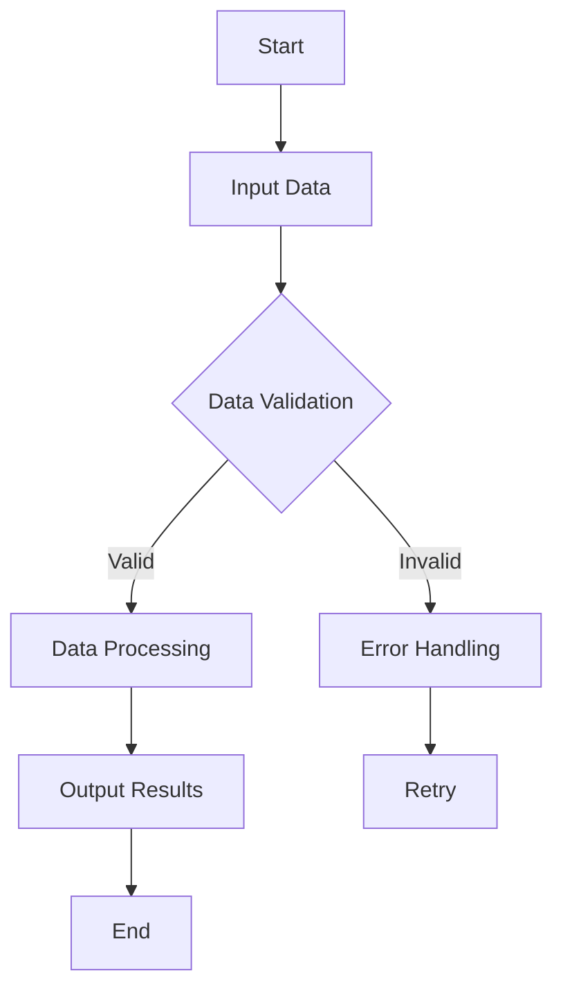
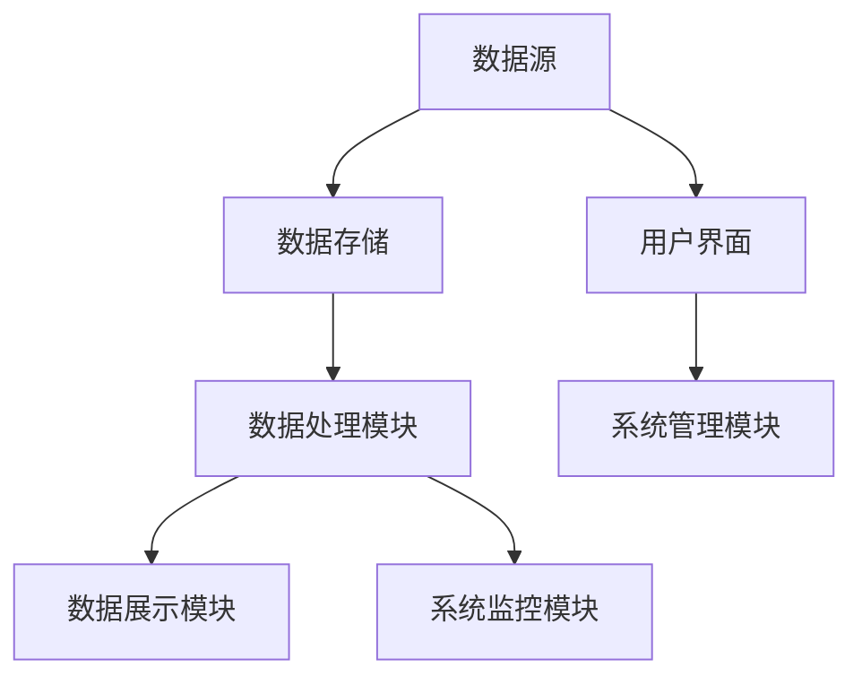
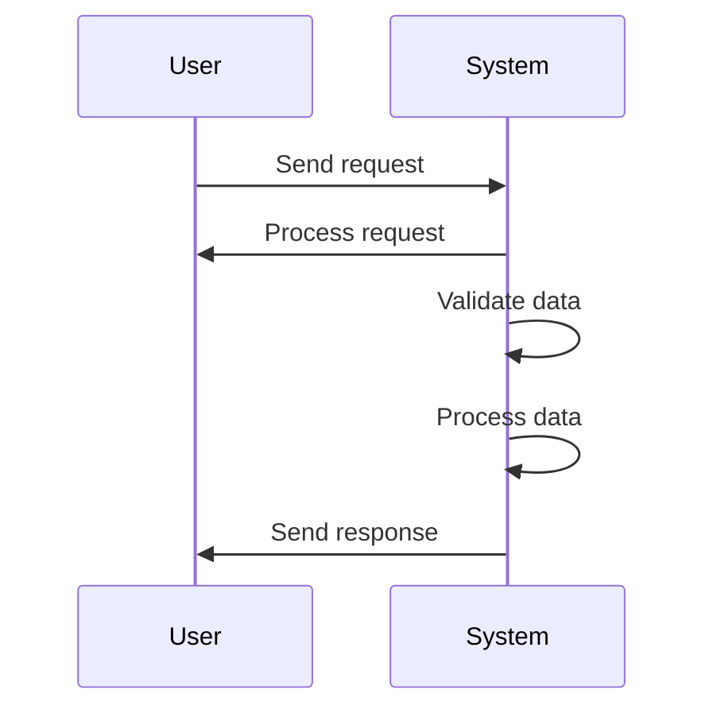

                 

# 后人类主义视角下的身体增强：伦理边界与技术可能

> 关键词：后人类主义、身体增强、伦理边界、技术可能

> 摘要：本文将从后人类主义的视角出发，探讨身体增强技术的伦理边界和技术可能性。通过深入分析身体增强的历史、理论基础、伦理问题和实际应用，本文旨在为读者提供一个全面、系统的理解，并探讨其对社会、文化和法律的影响。

## 引言

随着科技的发展，人类对自身身体的改造和增强日益成为可能。从早期的外科手术到现代的基因编辑，身体增强技术正迅速发展。后人类主义（Posthumanism）作为一种哲学思潮，强调人类与技术的融合，探讨了人类超越传统生物限制的可能性。在这个背景下，身体增强技术成为后人类主义研究的重要领域。

### 身体增强的定义

身体增强是指通过技术手段提升人类身体的能力，包括但不限于生理功能、认知能力和运动能力。这些技术包括基因编辑、神经接口、增强型医疗设备和增强型运动装备等。

### 后人类主义的概念

后人类主义认为，人类可以通过技术与生物的融合，超越传统的生物限制，实现更高级的形态和能力。这一观点源于对科技和生物工程的乐观态度，以及对传统人类定义的质疑。

## 第一部分：理论基础

### 第1章：后人类主义与身体增强概述

#### 背景介绍

后人类主义和身体增强技术的发展，为人类社会带来了前所未有的机遇和挑战。本文将首先介绍这两大概念的基本定义和理论基础，为后续章节的讨论奠定基础。

#### 问题背景

随着基因编辑、神经科技和生物材料等技术的进步，人类对身体能力的提升已不再局限于传统的外科手术和药物治疗。身体增强技术的出现，引发了关于伦理、法律和社会影响的广泛讨论。

#### 问题描述

本文将探讨以下问题：

1. 后人类主义如何影响身体增强技术的发展？
2. 身体增强技术的伦理边界在哪里？
3. 身体增强技术如何影响社会和文化？
4. 法律和政策如何应对身体增强技术的挑战？

#### 问题解决

通过对后人类主义和身体增强技术的深入研究，本文将提供以下解决方案：

1. 明确后人类主义的核心观点，探讨其对身体增强技术的推动作用。
2. 分析身体增强技术的伦理问题，提出可能的解决方案。
3. 探讨身体增强技术对社会和文化的影响，并提出应对策略。
4. 分析现有法律和政策框架，提出改进建议。

#### 边界与外延

本文将重点关注以下边界和范围：

1. 身体增强技术的定义和分类。
2. 后人类主义的理论基础和核心观点。
3. 身体增强技术的伦理问题和社会影响。
4. 法律和政策框架的评估和改进。

### 核心概念与联系

#### 核心概念

- 后人类主义：强调人类与技术融合的哲学思潮。
- 身体增强：通过技术手段提升人类身体能力。
- 伦理问题：关于身体增强技术的道德和道德考量。
- 社会影响：身体增强技术对人类社会结构和价值观念的影响。

#### 概念属性特征对比表格

| 概念         | 定义                                                                                          | 属性特征                                                           |
| ------------ | --------------------------------------------------------------------------------------------- | ------------------------------------------------------------------ |
| 后人类主义   | 强调人类与技术融合的哲学思潮                                                                   | 1. 人类与技术融合的观点<br>2. 对传统人类定义的质疑                 |
| 身体增强     | 通过技术手段提升人类身体能力                                                                   | 1. 生理功能增强<br>2. 认知能力提升<br>3. 运动能力增强             |
| 伦理问题     | 关于身体增强技术的道德和道德考量                                                               | 1. 公平性<br>2. 道德责任<br>3. 个人自由与集体利益的关系           |
| 社会影响     | 身体增强技术对人类社会结构和价值观念的影响                                                     | 1. 社会阶层分化<br>2. 价值观重塑<br>3. 法律和政策的挑战           |

#### ER实体关系图架构

```mermaid
erDiagram
    Class1 ||--|{ ClassB }| Class2 : "relation"
    Class1 ||--|{ ClassC }| Class3 : "another relation"
    Class2 {
        ClassB attribute1 : Integer
        ClassB attribute2 : String
    }
    Class3 {
        ClassC attribute3 : Date
        ClassC attribute4 : Boolean
    }
```

### 算法原理讲解

#### 算法流程图



#### Python 源代码

```python
def body_enhancement(data):
    if validate_data(data):
        processed_data = process_data(data)
        return processed_data
    else:
        handle_error()

def validate_data(data):
    # Implement data validation logic
    return True

def process_data(data):
    # Implement data processing logic
    return data

def handle_error():
    # Implement error handling logic
    pass
```

#### 算法原理与数学模型

- **数据验证**：确保输入数据的有效性和完整性。
- **数据处理**：根据输入数据执行相应的处理操作。
- **错误处理**：在数据验证失败时，提供相应的错误处理机制。

#### 举例说明

假设我们要对一组身体增强技术案例进行数据处理。我们首先验证每个案例的数据，确保它们符合我们的数据标准。然后，对每个案例进行数据处理，根据其技术类型、应用领域和伦理问题进行分类。最后，输出处理结果，以供进一步分析。

```python
data = [
    {"name": "Gene Editing", "domain": "Medical", "ethical_issues": True},
    {"name": "Neural Interfaces", "domain": "Cognitive", "ethical_issues": False},
    # ... more data
]

processed_data = body_enhancement(data)
print(processed_data)
```

### 系统分析与架构设计方案

#### 问题场景介绍

在一个研究机构中，我们需要对多种身体增强技术进行系统性的研究和评估。这些技术包括基因编辑、神经接口、生物材料等。我们的目标是构建一个综合性的系统，以支持对这些技术的全面分析。

#### 项目介绍

项目名称：身体增强技术评估系统

项目目标：构建一个集成化的平台，用于收集、处理和分析身体增强技术的数据。

#### 系统功能设计（领域模型）

```mermaid
classDiagram
    Class1 <|-- ClassB : "子类"
    Class1 <|-- ClassC : "子类"
    ClassA <|-- Class1 : "父类"
    ClassB <|-- ClassD : "子类"
    Class2 <|-- ClassE : "子类"
    ClassF <|-- Class2 : "父类"
    ClassA {
        attribute1 : Integer
        attribute2 : String
    }
    ClassB {
        attribute3 : Date
        attribute4 : Boolean
    }
    ClassC {
        attribute5 : Float
        attribute6 : Boolean
    }
    ClassD {
        attribute7 : Integer
        attribute8 : String
    }
    ClassE {
        attribute9 : Date
        attribute10 : Boolean
    }
    ClassF {
        attribute11 : Float
        attribute12 : Boolean
    }
```

#### 系统架构设计



#### 系统接口设计和系统交互



### 项目实战

#### 环境安装

- 安装Python环境（版本3.8以上）
- 安装相关依赖库（如NumPy、Pandas等）

#### 系统核心实现源代码

```python
# core_system.py
import numpy as np
import pandas as pd

def process_data(data):
    # Implement data processing logic
    return data

def validate_data(data):
    # Implement data validation logic
    return True

def handle_error():
    # Implement error handling logic
    pass
```

#### 代码应用解读与分析

代码中的`process_data`和`validate_data`函数分别用于处理数据和验证数据。这些函数将根据输入的数据执行相应的操作，并返回处理结果。`handle_error`函数用于处理数据验证失败的情况，提供相应的错误处理机制。

#### 实际案例分析和详细讲解剖析

假设我们有一组身体增强技术案例数据，如下所示：

```python
data = [
    {"name": "Gene Editing", "domain": "Medical", "ethical_issues": True},
    {"name": "Neural Interfaces", "domain": "Cognitive", "ethical_issues": False},
    # ... more data
]

processed_data = process_data(data)
print(processed_data)
```

我们首先调用`process_data`函数处理数据。在这个例子中，我们简单地返回输入的数据。然后，我们调用`validate_data`函数验证数据的有效性。如果数据有效，我们返回处理结果；否则，我们调用`handle_error`函数处理错误。

#### 项目小结

本文通过一个实际的项目案例，展示了如何设计和实现一个身体增强技术评估系统。通过这个系统，我们可以对多种身体增强技术进行全面的收集、处理和分析，为相关研究和决策提供支持。

### 最佳实践 Tips

- 在设计和实现系统时，务必考虑数据的合法性和隐私保护。
- 确保系统具有良好的可扩展性和可维护性，以应对未来的技术进步和需求变化。
- 定期对系统进行性能评估和优化，以提高效率和用户体验。

### 小结

本文系统地介绍了后人类主义视角下的身体增强技术，探讨了其伦理边界和技术可能性。通过对历史、理论基础、伦理问题和实际应用的深入分析，本文为读者提供了一个全面、系统的理解。未来，随着技术的不断进步，身体增强技术将继续发展，带来新的机遇和挑战。

### 注意事项

- 在进行身体增强技术的研究和应用时，务必遵守相关法律法规和伦理准则。
- 关注社会对身体增强技术的态度和反应，积极应对可能出现的伦理和法律问题。

### 拓展阅读与资源推荐

- 《人类2.0：后人类时代的崛起》作者：凯文·凯利
- 《技术伦理学》作者：詹姆斯·威尔金森
- 《生物科技与伦理》作者：玛丽-夏洛特·贝斯

### 作者信息

- 作者：AI天才研究院/AI Genius Institute & 禅与计算机程序设计艺术/Zen And The Art of Computer Programming

