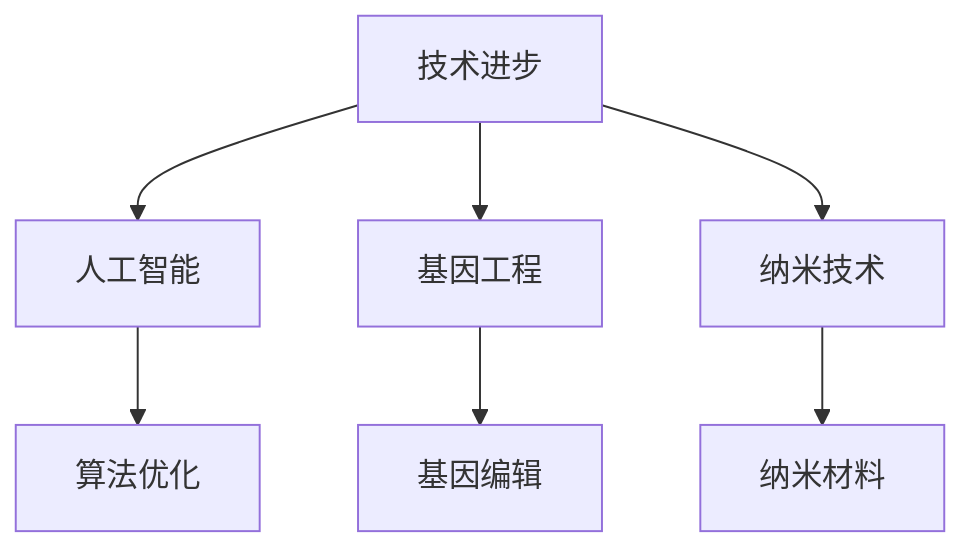
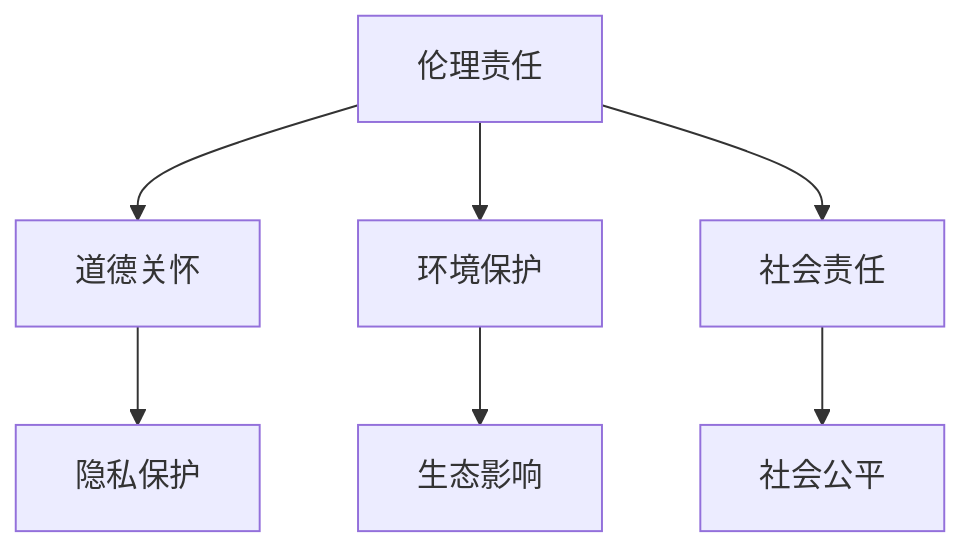
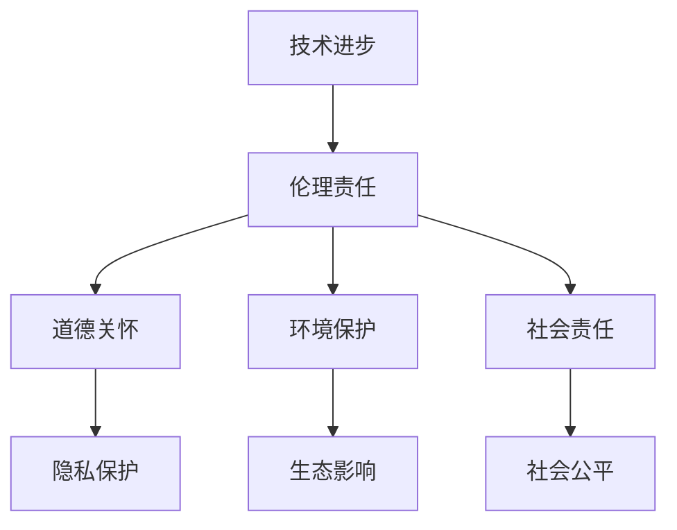

                 

###  后人类伦理学：技术发展中的道德思考

#### 关键词：后人类伦理学、技术发展、道德思考、人工智能、基因工程、纳米技术

> 摘要：随着技术的飞速发展，我们正迈入一个后人类的时代。人工智能、基因工程和纳米技术等前沿科技不仅带来了巨大便利，也引发了深刻的伦理问题。本文将探讨这些技术背后的道德思考，提出一个多维度的伦理决策框架，以期为科技发展提供道德指引。

----------------------------------------------------------------

#### 1. 背景介绍

##### 1.1 问题背景

在21世纪的今天，科技的迅猛发展正以前所未有的速度改变着我们的生活方式。尤其是人工智能（AI）、基因工程和纳米技术的突破，正推动我们迈向一个全新的“后人类”时代。这个时代意味着人类的能力将被技术所超越，从而引发一系列深刻的伦理和社会问题。

##### 1.2 问题描述

**人工智能**：AI的广泛应用，从自动驾驶到智能医疗，极大地提升了效率和便利性。然而，这也引发了对机器是否应该拥有自主权、隐私保护以及道德责任的担忧。

**基因工程**：基因编辑技术的出现，如CRISPR-Cas9，使得人类有能力改变自身的遗传信息。这虽然为治疗遗传病和改善人类健康提供了新的可能性，但也带来了伦理争议，如基因编辑的道德界限、基因改造的遗传不平等问题等。

**纳米技术**：纳米技术有望在医疗、环境、能源等领域带来革命性变化，但其潜在风险也不容忽视，包括纳米材料对生物体的毒性、对生态系统的破坏等。

##### 1.3 问题解决

要解决上述伦理问题，我们需要建立一个多维度的伦理决策框架。这个框架应当包括但不限于以下要素：

1. **透明性和责任**：科技研发和应用过程需透明，确保公众对技术的影响有充分的了解。同时，明确责任归属，确保在出现问题时，责任可以被追究。

2. **伦理教育和培训**：科技工作者需要接受系统的伦理教育，了解技术伦理的复杂性，以便在研发和应用过程中做出正确的道德决策。

3. **伦理审查和监管**：建立独立的伦理审查委员会，对重大科技项目进行伦理评估，确保其符合道德标准。

4. **社会参与和对话**：鼓励公众参与科技伦理讨论，通过多 stakeholder 的对话，形成共识，为科技发展提供道德指引。

##### 1.4 边界与外延

本文的焦点在于人工智能、基因工程和纳米技术等前沿科技所引发的伦理问题，但提出的伦理决策框架具有广泛适用性，可扩展到其他技术领域。

##### 1.5 核心概念与结构

**核心概念**：

- **技术进步**：科技的持续发展及其对人类社会的影响。
- **伦理责任**：科技工作者在研发和应用技术时，所承担的道德义务。
- **伦理决策框架**：用于指导科技伦理决策的理论和方法。

**结构**：

- **引言**：介绍后人类伦理学的重要性。
- **核心概念与关系**：详细探讨核心概念及其相互关系。
- **案例研究**：分析具体技术案例的伦理问题。
- **伦理决策框架**：构建多维度的伦理决策框架。
- **结论**：总结主要观点，提出未来研究方向。

----------------------------------------------------------------

#### 2. 核心概念与关系

##### 2.1 核心概念

###### 2.1.1 技术进步

技术进步指的是在某一领域内，通过科学研究和工程实践，不断提高产品或服务的性能、可靠性和可用性。在人工智能、基因工程和纳米技术等领域，技术进步表现为算法的优化、设备的升级和新材料的发现。

**属性特征对比表格**：

| 特征 | 人工智能 | 基因工程 | 纳米技术 |
| --- | --- | --- | --- |
| 性质 | 计算机科学 | 生物工程 | 材料科学 |
| 目标 | 提升智能化水平 | 治疗和预防疾病 | 提升材料和能源效率 |
| 风险 | 道德和隐私问题 | 基因编辑伦理争议 | 纳米材料毒性 |

**ER实体关系图架构**：

###### 2.1.2 伦理责任

伦理责任是指科技工作者在研发和应用技术时，应当承担的道德义务。这包括对人类福祉的关怀、对环境的保护以及对社会责任的承担。

**属性特征对比表格**：

| 特征 | 人工智能 | 基因工程 | 纳米技术 |
| --- | --- | --- | --- |
| 内容 | 道德和隐私问题 | 基因编辑伦理争议 | 纳米材料毒性 |
| 形式 | 责任声明 | 道德规范 | 安全标准 |
| 影响 | 社会公平 | 人类健康 | 环境影响 |

**ER实体关系图架构**：

##### 2.2 核心概念之间的关系

技术进步和伦理责任之间存在着密切的联系。技术进步不仅带来了新的机遇，也带来了新的伦理挑战。例如，人工智能的发展引发了隐私保护和道德责任的问题；基因工程则涉及人类尊严和生态平衡的伦理考量；纳米技术则需要在性能提升和环境影响之间寻找平衡。

这种关系可以用以下ER实体关系图来表示：

通过这种关系图，我们可以清晰地看到技术进步如何影响伦理责任，以及各个责任领域之间的相互作用。

----------------------------------------------------------------

#### 3. 案例研究

##### 3.1 人工智能伦理问题

**案例**：自动驾驶汽车的道德决策

自动驾驶汽车是一种结合了人工智能和机械工程的技术，它能够自主导航和驾驶。然而，这种技术的出现也引发了一系列伦理问题。

**问题分析**：

- **隐私保护**：自动驾驶汽车需要收集和分析大量的个人数据，如行驶路线、速度、时间等。这引发了关于隐私保护的伦理争议。
- **道德决策**：当自动驾驶汽车面临潜在的道德困境时，如车辆在紧急情况下是否应该选择保护乘客还是行人，如何做出道德决策成为了一个重要问题。

**伦理决策框架应用**：

- **透明性和责任**：自动驾驶汽车的研发和应用需要透明，确保公众了解其工作原理和数据收集方式。同时，明确责任归属，确保在发生事故时，责任可以被追究。
- **伦理教育和培训**：自动驾驶汽车的研发团队需要接受系统的伦理教育，了解技术伦理的复杂性。
- **伦理审查和监管**：建立独立的伦理审查委员会，对自动驾驶汽车进行伦理评估。

##### 3.2 基因工程伦理问题

**案例**：基因编辑婴儿事件

2018年，中国科学家贺建奎宣布成功基因编辑双胞胎基因，使其具有抵抗艾滋病的特性。这一事件引发了全球范围内的伦理争议。

**问题分析**：

- **基因编辑伦理争议**：基因编辑技术的道德界限在哪里？是否应该在人类胚胎上进行基因编辑？
- **遗传不平等**：基因编辑技术的商业化可能加剧社会遗传不平等。

**伦理决策框架应用**：

- **伦理教育和培训**：基因编辑技术的研发者需要接受系统的伦理教育，了解技术伦理的复杂性。
- **伦理审查和监管**：建立独立的伦理审查委员会，对基因编辑项目进行严格审查。
- **社会参与和对话**：鼓励公众参与基因编辑技术的讨论，形成共识。

##### 3.3 纳米技术伦理问题

**案例**：纳米材料的环境影响

纳米材料因其独特的物理和化学性质，在医疗、环境、能源等领域具有广泛的应用前景。然而，它们也对环境和人类健康带来了潜在的风险。

**问题分析**：

- **纳米材料毒性**：纳米材料可能对生物体产生毒性，影响生态系统的平衡。
- **环境影响**：纳米材料的生产和废弃可能对环境造成污染。

**伦理决策框架应用**：

- **环境保护**：在纳米材料的应用和废弃过程中，需要考虑其对环境的影响。
- **社会责任**：纳米技术的研发者需要承担对环境和社会的责任。
- **伦理审查和监管**：建立独立的伦理审查委员会，对纳米技术应用进行严格监管。

----------------------------------------------------------------

#### 4. 伦理决策框架

在面对技术进步带来的伦理挑战时，我们需要一个多维度的伦理决策框架，以指导我们的决策和行为。这个框架应包括以下关键要素：

##### 4.1 透明性和责任

- **透明性**：技术进步的过程和结果应该对公众透明，确保公众了解技术的潜在影响。
- **责任归属**：在技术应用过程中，明确责任归属，确保在出现问题时，责任可以被追究。

##### 4.2 伦理教育和培训

- **伦理教育**：科技工作者应接受系统的伦理教育，了解技术伦理的复杂性。
- **培训**：通过培训和持续学习，提高科技工作者在研发和应用技术时的道德素养。

##### 4.3 伦理审查和监管

- **伦理审查**：建立独立的伦理审查委员会，对重大科技项目进行伦理评估。
- **监管**：通过立法和监管机构，确保技术进步符合伦理标准。

##### 4.4 社会参与和对话

- **社会参与**：鼓励公众参与科技伦理讨论，形成共识。
- **对话**：通过多 stakeholder 的对话，为科技发展提供道德指引。

这个伦理决策框架的核心在于将技术进步与伦理责任相结合，确保科技发展不仅带来便利，也符合道德和伦理标准。

----------------------------------------------------------------

#### 5. 结论

本文探讨了后人类伦理学的重要性和技术发展中的道德思考。我们提出了一个多维度的伦理决策框架，以应对人工智能、基因工程和纳米技术等前沿科技带来的伦理挑战。通过案例研究，我们展示了这一框架的实际应用。未来，随着技术的不断进步，我们需要不断更新和完善这一框架，以引导科技发展走向一个更加道德和可持续的未来。

----------------------------------------------------------------

#### 参考文献

1. National Academies of Sciences, Engineering, and Medicine. (2016). *Rising Above the Noise: Addressing Ethical Concerns About Emerging Biomedical Technologies*. Washington, DC: The National Academies Press.
2. Harari, Y. N. (2015). *Homo Deus: A Brief History of Tomorrow*. HarperCollins.
3. Merali, Z. (2015). *A Gene Editing Revolution: How CRISPR is Changing the World of Biology*. Nature.
4. Bostrom, N. (2013). *Superintelligence: Paths, Dangers, Strategies*. Oxford University Press.
5. National Research Council. (2011). *Ensuring the Integrity, Availability, and Resilience of National Cyberinfrastructure*. Washington, DC: The National Academies Press.

作者：AI天才研究院/AI Genius Institute & 禅与计算机程序设计艺术 /Zen And The Art of Computer Programming

----------------------------------------------------------------

### 附录：相关术语解释

**后人类（Post-human）**：指在技术进步推动下，人类能力得到极大提升，甚至可能超越自然人类界限的个体或群体。

**人工智能（Artificial Intelligence, AI）**：指由计算机实现的智能系统，能够在特定领域内模拟人类智能行为。

**基因工程（Genetic Engineering）**：指利用生物技术手段，对生物体的遗传物质进行改造的技术。

**纳米技术（Nanotechnology）**：指在纳米尺度（1到100纳米）上操控物质和制造设备的技术。

**伦理责任（Ethical Responsibility）**：指科技工作者在研发和应用技术时，应当承担的道德义务。

**透明性（Transparency）**：指技术进步的过程和结果对公众的透明程度。

**隐私保护（Privacy Protection）**：指保护个人数据不被未经授权的第三方获取和使用的措施。

**社会参与（Social Participation）**：指公众在科技决策过程中的参与和影响。

**伦理审查（Ethical Review）**：指对科技项目的道德合法性进行的审查过程。

**监管（Regulation）**：指通过立法和行政手段，对技术进步进行管理和控制。

