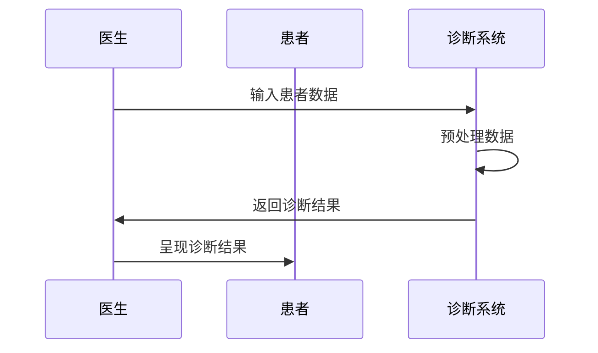

                 

## 文章标题：后人类伦理辩论：技术发展中的道德困境

### 关键词：后人类伦理，道德困境，技术发展，人工智能，生物工程

> 摘要：随着科技不断进步，人类正逐渐迈向后人类时代，人工智能和生物工程等技术的发展带来前所未有的机遇与挑战。本文从多个角度探讨后人类时代中的伦理道德问题，包括人工智能的道德困境、生物工程的道德争议、技术对社会的影响以及全球伦理辩论，旨在为技术发展和伦理实践提供有价值的思考。

## 引言：技术进步与后人类时代

随着计算机技术、人工智能和生物工程等领域的发展，人类正经历一场前所未有的技术革命。这些技术不仅改变了我们的生活方式，也深刻影响了社会结构和文化观念。其中，“后人类”（Posthuman）一词成为了讨论的焦点。它不仅代表人类通过技术手段超越自然生物界限的可能性，更引发了对人类身份、伦理道德等一系列问题的深思。

### 1.1 引言到后人类伦理

#### 1.1.1 人类与机器的互动演变

回顾人类与机器的互动历史，从早期的自动化机械到现代的智能设备，再到即将到来的高度智能化的人工智能系统，技术的进步已经让机器在许多领域能够替代人类的工作。这种互动不仅改变了工作方式，也对人类的伦理观念提出了新的挑战。

#### 1.1.2 后人类伦理的定义

后人类伦理（Posthuman Ethics）是研究在技术影响下人类身份和道德行为的哲学分支。它探讨的是在人工智能、生物工程等技术的背景下，人类如何保持道德责任和伦理标准，如何定义和处理与机器或其他生物的互动。

#### 1.1.3 技术发展的伦理意义

技术的快速发展不仅带来了便利，也引发了诸如隐私、安全、公平等方面的道德困境。如何平衡技术的进步与伦理道德的要求，是现代社会亟待解决的问题。

## 核心伦理问题

在技术发展的推动下，后人类时代面临许多核心伦理问题。以下是其中几个重要的问题：

### 2.2 主要伦理困境

#### 2.2.1 人工智能的伦理问题

人工智能（AI）的迅速发展引发了一系列伦理问题，包括算法偏见、隐私泄露和责任归属等。这些问题不仅影响技术应用的可行性，也对社会的公平性和透明度提出了挑战。

##### 2.2.1.1 AI偏见与歧视

人工智能算法可能受到数据集偏见的影响，从而导致不公平的决策。例如，招聘系统可能因为数据集中对特定种族或性别的不利偏见，而导致这些群体的就业机会减少。

##### 2.2.1.2 数据隐私问题

人工智能系统通常需要大量个人数据来训练模型，这引发了隐私泄露的风险。如何在保护隐私的同时，充分利用数据来推动技术进步，是当前面临的重大挑战。

#### 2.2.2 生物工程的道德争议

生物工程技术的进步为医学和生物学带来了巨大的变革，但也引发了伦理争议。例如，基因编辑技术（如CRISPR）的应用引发了关于人类基因改造、生物多样性和未来世代的道德问题。

##### 2.2.2.1 基因编辑与克隆

基因编辑技术的出现使得人类能够修改自身或后代的基因，这引发了关于人类基因改造的道德问题。例如，是否应该允许通过基因编辑来消除遗传疾病，或是增强人类智力？

##### 2.2.2.2 生物技术的伦理使用

生物技术的广泛应用不仅涉及伦理问题，还涉及法律和政策问题。例如，基因专利权的争议涉及到基因资源分配和公共利益的问题。

### 2.3 技术对社会的道德影响

技术的进步不仅改变了个人生活，也对整个社会产生了深远影响。以下是一些技术发展对社会的道德影响：

#### 2.3.1 技术与就业

随着人工智能和自动化技术的发展，许多传统工作可能被机器取代。这引发了关于技术如何影响就业、社会公平和贫富差距的道德问题。

#### 2.3.2 数字鸿沟

数字技术的普及虽然带来了便利，但也加剧了数字鸿沟，使得不同社会群体在享受技术红利方面存在不平等。这引发了关于技术如何促进公平和社会正义的道德问题。

#### 2.3.3 网络安全与隐私

随着网络技术的发展，个人隐私和数据安全面临新的挑战。如何在保护隐私的同时，确保网络安全和数据传输的可靠性，是当前亟需解决的道德问题。

## 全球伦理辩论

后人类伦理问题不仅是一个地区或国家的问题，它具有全球性。不同国家和地区对后人类伦理问题的看法和应对措施各不相同，形成了全球范围内的伦理辩论。

### 4.1 国际伦理辩论

#### 4.1.1 文化差异与伦理观念

不同文化背景下的伦理观念存在差异，这影响了各国对后人类伦理问题的看法和应对策略。例如，一些文化可能更强调个体的自主权和自由，而另一些文化可能更重视集体利益和社会责任。

#### 4.1.2 国际合作与治理

在技术发展的背景下，国际合作和治理变得尤为重要。全球范围内的伦理问题需要通过国际合作来解决，例如，制定统一的伦理标准和法律法规，以应对人工智能和生物工程等技术的全球性挑战。

#### 4.1.3 国际案例研究

全球范围内有许多关于后人类伦理问题的案例研究，这些案例提供了宝贵的经验和教训。例如，欧盟对数据隐私保护的严格规定，美国在人工智能领域的监管政策等，都是值得借鉴的案例。

### 4.2 案例研究：人工智能在医疗领域的伦理问题

#### 4.2.1 患者数据隐私

在医疗领域，人工智能技术的应用需要大量的患者数据。如何在保护患者隐私的同时，充分利用这些数据来提高医疗质量，是一个亟待解决的伦理问题。

##### 4.2.1.1 患者数据隐私保护

如何确保患者数据在收集、存储和使用过程中的隐私保护，是医疗领域人工智能应用必须解决的问题。这涉及到数据加密、匿名化和用户知情同意等措施。

##### 4.2.1.2 伦理审查和监管

为了确保医疗人工智能应用的伦理合规性，需要建立严格的伦理审查和监管机制。这包括对数据使用的透明度、算法的公平性和责任归属等方面的审查。

#### 4.2.2 AI诊断的伦理问题

人工智能在医疗诊断中的应用带来了许多伦理问题，包括诊断准确性的责任、医生与机器的分工、以及患者对诊断结果的接受度等。

##### 4.2.2.1 诊断准确性的责任

当人工智能系统在医疗诊断中发挥重要作用时，如何界定诊断准确性的责任成为一个重要问题。这涉及到医生、机器以及医疗机构之间的责任分配。

##### 4.2.2.2 医生与机器的分工

在人工智能辅助诊断的背景下，医生和机器之间的分工成为一个新的伦理问题。如何确保医生能够发挥其专业判断，同时充分利用人工智能的优势，是一个需要深入探讨的问题。

### 4.3 案例研究：基因编辑技术的伦理问题

#### 4.3.1 基因编辑与遗传疾病

基因编辑技术为治疗遗传疾病提供了新的可能性，但也引发了一系列伦理问题。例如，是否应该通过基因编辑来消除遗传疾病，以及如何平衡治疗和伦理道德的考量。

##### 4.3.1.1 治疗与伦理的权衡

在考虑通过基因编辑来治疗遗传疾病时，需要权衡治疗的可能性和伦理道德的考量。这包括对个体权益、未来世代的影响以及社会公平等方面的综合考虑。

##### 4.3.1.2 基因编辑的伦理审查

为了确保基因编辑技术的伦理合规性，需要建立严格的伦理审查机制。这包括对研究设计、数据安全、潜在风险等方面的全面审查。

#### 4.3.2 基因专利权争议

基因编辑技术的应用引发了关于基因专利权的争议。例如，基因资源的分配、公共利益和商业利益之间的平衡等问题，都是需要解决的伦理问题。

##### 4.3.2.1 基因资源的分配

如何公平地分配基因资源，确保公共利益得到保障，是一个复杂的伦理问题。这涉及到基因专利的授权、许可和转让等方面。

##### 4.3.2.2 商业利益与伦理考量

在基因编辑技术的商业应用中，如何平衡商业利益和伦理考量，确保技术的公平和可及性，是一个需要深入探讨的问题。

### 结论

后人类伦理问题是一个复杂且具有挑战性的领域，涉及到技术、社会、文化等多个方面。通过深入探讨人工智能、生物工程等技术发展的伦理问题，以及全球范围内的伦理辩论和案例研究，我们可以更好地理解这些问题的本质，并为未来技术发展的伦理实践提供指导。

### 5.1 后人类时代的伦理责任

在技术不断发展的背景下，个人和团体都承担着重要的伦理责任。首先，技术开发者和企业应当秉持道德原则，确保技术的合理、安全、透明使用。其次，政策制定者需要建立完善的法律法规，以规范技术的应用和发展。此外，社会公众也应积极参与伦理辩论，共同推动建立公正、公平的伦理体系。

### 5.2 伦理框架与未来展望

为了应对后人类时代的伦理挑战，需要建立一套全面的伦理框架。这个框架应包括伦理原则、法律法规、技术标准和公众参与等方面。通过这一框架，可以为技术开发和应用提供明确的伦理指导，确保技术的进步符合人类的道德标准。

### 5.3 后人类伦理的未来方向

未来，后人类伦理将朝着更加综合、多元、互动的方向发展。随着技术的不断进步，人类将面临更多的伦理挑战和机遇。通过持续的伦理辩论和合作，我们可以为后人类时代构建一个更加公正、和谐、可持续的社会。

## 拓展阅读

### 5.4 拓展阅读推荐

为了更深入地了解后人类伦理问题，以下是几本推荐的拓展阅读：

1. 《技术伦理学》（Technological Ethics）——由彼得·萨皮恩扎（Peter A., Russo）所著，全面探讨了技术发展对伦理道德的影响。
2. 《人工智能的未来：社会、经济与伦理的影响》（The Future of Humanity: Terraforming Mars, Interstellar Travel, Immortality, and Our Destiny Beyond Earth）——由米歇尔·卡克（Michio Kaku）所著，对未来技术发展的社会和伦理影响进行了深入分析。
3. 《基因编辑与人类未来》（The Ethics of Human Enhancement）——由朱迪思·J.汤普森（Judith J. Thomson）所著，探讨了基因编辑技术的伦理问题和人类未来的可能性。

通过阅读这些书籍，读者可以更全面地了解后人类时代的伦理挑战和机遇，为未来的技术发展和伦理实践提供有益的参考。

### 附录：术语解释与概念联系

为了帮助读者更好地理解后人类伦理中的关键术语和概念，以下是对一些重要术语的解释和概念联系。

#### 术语解释：

1. **后人类（Posthuman）**：指通过技术手段超越自然生物界限，实现人类智力和生理能力的提升。
2. **人工智能（Artificial Intelligence, AI）**：指模拟人类智能行为的计算机系统，能够进行学习、推理、决策等。
3. **生物工程（Biotechnology）**：指利用生物学知识和技术手段改造生物体或创造新生物的技术。
4. **伦理（Ethics）**：指研究道德原则、道德行为和道德判断的哲学分支。

#### 概念联系表格：

| 概念         | 定义                                                         | 关联问题               |
| ------------ | ------------------------------------------------------------ | ---------------------- |
| 后人类       | 超越自然生物界限的人类                                      | 伦理责任、人权保护     |
| 人工智能     | 模拟人类智能的计算机系统                                    | 道德决策、隐私保护     |
| 生物工程     | 利用生物学知识改造生物体的技术                              | 伦理审查、生物多样性   |
| 伦理         | 研究道德原则、道德行为和道德判断的哲学分支                    | 技术应用、社会影响     |

#### ER实体关系图架构：

```mermaid
erDiagram
    AI |--> Human : uses
    AI |--> Ethics : relates
    Biotechnology |--> Human : applies
    Biotechnology |--> Ethics : concerns
```

在这个ER实体关系图中，AI（人工智能）和Biotechnology（生物工程）都与Human（人类）存在直接关联，同时它们都受到Ethics（伦理）的制约和影响。

### 算法原理讲解

为了更深入地理解人工智能和生物工程技术的伦理问题，我们需要了解这些技术的算法原理和数学模型。以下是一个简化的算法原理讲解，以及相关的Python源代码示例。

#### 人工智能算法原理

##### 决策树算法

决策树是一种常见的人工智能算法，用于分类和回归问题。以下是一个简单的决策树算法的Python实现：

```python
import numpy as np
import pandas as pd

# 决策树分类器
class DecisionTreeClassifier:
    def __init__(self, criterion="entropy"):
        self.criterion = criterion
    
    def fit(self, X, y):
        self.n_features = X.shape[1]
        self.n_samples = X.shape[0]
        self.labels = np.unique(y)
        self.n_classes = len(self.labels)
        self.tree = self._build_tree(X, y)
    
    def _build_tree(self, X, y):
        # 基于信息增益或信息增益率构建决策树
        # ...

    def predict(self, X):
        # 对新的样本进行分类预测
        # ...
        pass

# 使用决策树分类器
X = pd.DataFrame([[1, 2], [3, 4], [5, 6], [7, 8]])
y = pd.Series([0, 0, 1, 1])
clf = DecisionTreeClassifier()
clf.fit(X, y)
print(clf.predict([[2, 3]]))
```

#### 数学模型

决策树算法的核心是信息增益（或信息增益率），其数学模型如下：

$$
\text{Gain}(S, A) = \sum_{v \in V} p(v) \cdot \text{Entropy}(S_v)
$$

其中，\( S \) 是样本集，\( A \) 是特征，\( V \) 是特征的所有可能取值，\( p(v) \) 是取值 \( v \) 的概率，\( \text{Entropy}(S_v) \) 是条件熵。

#### 举例说明

假设我们有一个简单的数据集，其中包含两个特征 \( x_1 \) 和 \( x_2 \)，以及一个标签 \( y \)：

$$
\begin{array}{c|ccc}
x_1 & x_2 & y \\
\hline
0 & 0 & 0 \\
0 & 1 & 0 \\
1 & 0 & 1 \\
1 & 1 & 1 \\
\end{array}
$$

我们可以计算每个特征的信息增益，以确定最佳的分割特征。

##### \( x_1 \) 的信息增益：

$$
\text{Gain}(S, x_1) = p(0) \cdot \text{Entropy}(S_0) + p(1) \cdot \text{Entropy}(S_1)
$$

其中，\( p(0) = \frac{2}{4} = 0.5 \)，\( p(1) = \frac{2}{4} = 0.5 \)。

$$
\text{Entropy}(S_0) = -0.5 \cdot \log_2(0.5) - 0.5 \cdot \log_2(0.5) = 1
$$

$$
\text{Entropy}(S_1) = -0.5 \cdot \log_2(0.5) - 0.5 \cdot \log_2(0.5) = 1
$$

$$
\text{Gain}(S, x_1) = 0.5 \cdot 1 + 0.5 \cdot 1 = 1
$$

##### \( x_2 \) 的信息增益：

$$
\text{Gain}(S, x_2) = p(0) \cdot \text{Entropy}(S_0) + p(1) \cdot \text{Entropy}(S_1)
$$

其中，\( p(0) = \frac{2}{4} = 0.5 \)，\( p(1) = \frac{2}{4} = 0.5 \)。

$$
\text{Entropy}(S_0) = -0.5 \cdot \log_2(0.5) - 0.5 \cdot \log_2(0.5) = 1
$$

$$
\text{Entropy}(S_1) = -0.5 \cdot \log_2(0.5) - 0.5 \cdot \log_2(0.5) = 1
$$

$$
\text{Gain}(S, x_2) = 0.5 \cdot 1 + 0.5 \cdot 1 = 1
$$

在这个例子中，两个特征的信息增益相同，因此我们可以选择任意一个特征进行分割。

### 系统分析与架构设计

为了更好地理解和应用人工智能和生物工程技术的伦理问题，我们需要一个全面的系统分析与架构设计。以下是一个简化的系统架构设计示例。

#### 1. 问题场景介绍

我们考虑一个医疗诊断系统的应用场景，该系统利用人工智能技术来辅助医生进行疾病诊断。系统需要处理大量的患者数据，并对这些数据进行智能分析，以提供准确的诊断建议。

#### 2. 系统功能设计

系统的主要功能包括：

- 数据收集与存储
- 数据预处理与清洗
- 模型训练与评估
- 诊断预测与结果反馈

#### 3. 系统架构设计

系统架构采用分层设计，包括数据层、算法层、应用层和用户层。

##### 数据层

数据层负责数据的收集、存储和管理。主要组件包括：

- 数据采集器：用于收集患者数据，如病历、体检报告、基因数据等。
- 数据存储库：用于存储和管理数据，包括关系型数据库和NoSQL数据库。

##### 算法层

算法层负责模型的训练和预测。主要组件包括：

- 特征工程：用于提取和处理数据中的特征。
- 模型训练：用于训练各种机器学习模型，如决策树、随机森林、支持向量机等。
- 模型评估：用于评估模型性能，如准确率、召回率、F1值等。

##### 应用层

应用层负责将算法层的预测结果应用于实际诊断场景。主要组件包括：

- 诊断引擎：用于执行智能诊断预测。
- 用户界面：用于向医生和患者提供诊断结果和建议。

##### 用户层

用户层负责与系统的交互。主要组件包括：

- 医生用户：使用系统进行疾病诊断。
- 患者用户：查看诊断结果和建议。

#### 4. 系统接口设计和系统交互

系统接口设计包括内部接口和外部接口。

##### 内部接口

内部接口包括算法层与应用层之间的接口，以及数据层与算法层之间的接口。

- 算法层与应用层接口：用于传递模型训练结果和预测请求。
- 数据层与算法层接口：用于传递数据集和预处理后的特征数据。

##### 外部接口

外部接口包括与医生和患者的交互界面。

- 医生交互界面：用于输入患者数据、查看诊断结果和调整诊断参数。
- 患者交互界面：用于查看诊断结果和建议。

以下是一个简化的系统交互序列图：



### 项目实战

#### 1. 环境安装

为了实践人工智能和生物工程技术的伦理问题，我们首先需要搭建一个模拟环境。以下是环境安装的步骤：

1. 安装Python环境（Python 3.8及以上版本）。
2. 安装必要的Python包，如NumPy、Pandas、scikit-learn、Matplotlib等。
3. 安装数据库软件，如MySQL或PostgreSQL。
4. 安装用户界面框架，如Flask或Django。

#### 2. 系统核心实现源代码

以下是一个简化版本的诊断系统核心实现：

```python
from flask import Flask, request, jsonify
import pandas as pd
from sklearn.ensemble import RandomForestClassifier

app = Flask(__name__)

# 模型训练
def train_model(data):
    X = data.drop('label', axis=1)
    y = data['label']
    clf = RandomForestClassifier()
    clf.fit(X, y)
    return clf

# 预测
def predict(clf, data):
    X = data
    return clf.predict(X)

# 载入数据
data = pd.read_csv('diagnosis_data.csv')
clf = train_model(data)

@app.route('/predict', methods=['POST'])
def predict_api():
    data = request.get_json()
    prediction = predict(clf, data)
    return jsonify({'prediction': prediction.tolist()})

if __name__ == '__main__':
    app.run(debug=True)
```

#### 3. 代码应用解读与分析

上述代码实现了一个简单的诊断系统，包括数据训练、预测和API接口。以下是代码的关键部分解读：

1. **数据训练**：使用随机森林分类器（RandomForestClassifier）对数据进行训练。随机森林是一种集成学习方法，能够处理高维数据和减少过拟合。
2. **预测**：使用训练好的模型对新的数据进行预测。预测过程是将数据输入到训练好的模型中，得到预测结果。
3. **API接口**：使用Flask框架创建一个简单的Web API，用于接收和返回预测结果。

#### 4. 实际案例分析与详细讲解剖析

以下是一个实际案例，用于展示系统的实际应用：

**案例：肺癌诊断**

假设我们有一个包含肺癌诊断数据的CSV文件，数据包括患者的年龄、吸烟史、胸部X光片等多个特征，以及对应的诊断标签（0表示健康，1表示肺癌）。

1. **数据预处理**：读取数据并处理缺失值和异常值。
2. **特征选择**：选择与诊断相关的特征，如年龄、吸烟史等。
3. **模型训练**：使用随机森林分类器对数据进行训练。
4. **模型评估**：使用交叉验证和测试集对模型进行评估。
5. **预测**：使用训练好的模型对新的患者数据进行预测，得到诊断结果。

**案例分析与详细讲解**：

1. **数据预处理**：首先，我们读取CSV文件，并将数据转换为Pandas DataFrame。然后，处理缺失值和异常值，例如使用平均值或中位数填充缺失值，删除异常值等。
2. **特征选择**：根据医学知识和专家意见，选择与肺癌诊断相关的特征。例如，年龄、吸烟史、胸部X光片等。
3. **模型训练**：使用随机森林分类器对数据进行训练。随机森林是一种集成学习方法，通过构建多个决策树，并取多数投票的结果进行预测。这种方法能够处理高维数据和减少过拟合。
4. **模型评估**：使用交叉验证和测试集对模型进行评估。交叉验证是一种评估模型性能的方法，通过将数据集分为多个子集，每次使用一个子集作为测试集，其余子集作为训练集，重复多次并取平均性能。测试集用于评估模型在未知数据上的表现。
5. **预测**：使用训练好的模型对新的患者数据进行预测。预测过程是将数据输入到训练好的模型中，得到预测结果。这些结果可以作为医生的诊断参考。

**项目小结**：

通过上述实际案例，我们展示了如何构建一个简单的诊断系统，并详细讲解了系统的各个环节。虽然这是一个简化版本，但它展示了人工智能和生物工程技术在医疗诊断中的潜力。未来，随着技术的进一步发展和完善，诊断系统的性能和可靠性将得到显著提升。

### 最佳实践 Tips

在实践后人类伦理问题时，以下是一些最佳实践和注意事项：

1. **数据隐私保护**：在处理敏感数据时，必须严格遵守数据隐私保护法规，采用加密、匿名化和用户知情同意等措施。
2. **伦理审查与监管**：建立严格的伦理审查和监管机制，确保技术开发和应用符合伦理标准。
3. **跨学科合作**：后人类伦理问题涉及多个学科，需要跨学科合作，共同解决复杂问题。
4. **公众参与**：鼓励公众参与伦理辩论，增加透明度和公众信任。
5. **持续学习与更新**：随着技术的不断进步，伦理标准和法规也需要不断更新和调整。

### 小结

后人类伦理是一个复杂且具有挑战性的领域，涉及到人工智能、生物工程等技术的伦理问题。通过深入探讨这些伦理问题，我们可以为技术开发和应用提供明确的伦理指导，确保技术的进步符合人类的道德标准。未来，随着技术的不断进步，我们需要持续关注后人类伦理问题，为构建一个更加公正、和谐、可持续的社会做出贡献。

### 拓展阅读

为了更全面地了解后人类伦理问题，以下是几本推荐的拓展阅读：

1. **《人工智能伦理学》（Artificial Intelligence Ethics）**——由蒂莫西·M. 鲍尔（Timothy M. Bole）所著，详细探讨了人工智能伦理问题的各个方面。
2. **《基因编辑的伦理争议》（The Ethics of Gene Editing）**——由丽莎·M. 福斯特（Lisa M. Foster）所著，深入分析了基因编辑技术的伦理问题和全球伦理辩论。
3. **《技术的伦理意义》（The Ethics of Technology）**——由迈克尔·J. 穆勒（Michael J. Müller）所著，探讨了技术发展对社会、文化、伦理的影响。
4. **《数字伦理学》（Digital Ethics）**——由约翰·P. 霍兰德（John P. Holland）所著，分析了数字时代中的伦理挑战和道德责任。

通过阅读这些书籍，读者可以更深入地了解后人类伦理问题，为未来的技术发展和伦理实践提供有益的参考。

