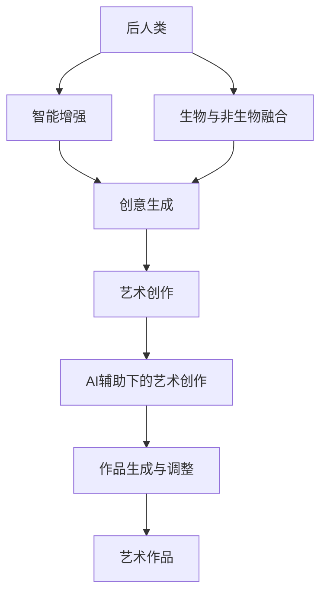

                 

### 引言

#### 1.1 创意的本质

创意，即创造力，是人类智慧的体现，它是指个体或群体在特定情境下产生新观念、新想法、新方案或新作品的能力。在艺术创作中，创意尤为重要，它不仅是艺术作品的灵魂，更是艺术家表达自我、传递情感和观点的重要手段。

艺术创作中的挑战主要体现在以下几个方面：

- **创造性思维的激发**：艺术家需要在有限的条件下，从大量的信息中提取灵感，这要求艺术家具备高度的创造性思维能力。
- **多样化表现形式的探索**：艺术创作不仅包括传统形式，如绘画、雕塑、音乐等，还包括数字艺术、装置艺术等多种形式，艺术家需要不断探索新的表现形式。
- **技术手段的运用**：现代艺术创作越来越依赖于各种技术手段，如数字技术、编程技术等，艺术家需要不断学习和掌握新的技术。

人工智能（AI）的出现和发展为艺术创作带来了新的契机。AI不仅能够辅助艺术家在创意过程中更加高效地处理和分析大量数据，还能通过自身的算法和算法模型，生成新的创意和作品，从而拓展艺术创作的可能性。

#### 1.2 人工智能的发展对艺术创作的影响

人工智能的崛起，极大地改变了我们的生活方式和思维方式。在艺术创作领域，人工智能的应用也日益广泛，主要表现在以下几个方面：

- **数据分析和处理**：AI能够快速分析大量的数据，帮助艺术家发现新的灵感来源，提高艺术创作的效率。
- **生成艺术作品**：一些AI算法，如生成对抗网络（GAN）和变分自编码器（VAE），已经能够生成具有高度创意性的艺术作品，如绘画、音乐和建筑设计等。
- **辅助创作工具**：AI还开发了多种辅助创作工具，如AI作画、AI作曲等，使得艺术家能够更加专注于创意本身，而无需耗费大量时间在技术实现上。

#### 1.3 本书结构

本书将从后人类创意的概述、AI辅助下的艺术创作方法、案例分析、伦理问题以及发展趋势等方面，系统探讨AI辅助下的艺术创作。具体结构如下：

- **第1章 引言**：介绍创意的本质和艺术创作中的挑战，以及人工智能对艺术创作的影响。
- **第2章 后人类创意概述**：探讨后人类的概念、创意的本质以及后人类创意的特点。
- **第3章 AI辅助下的艺术创作方法**：介绍AI在艺术创作中的应用基础、创作流程以及实例分析。
- **第4章 AI辅助下的艺术创作案例分析**：通过具体的案例，展示AI辅助下的艺术创作过程和成果。
- **第5章 AI辅助下的艺术创作中的伦理问题**：讨论AI辅助下艺术创作可能面临的伦理挑战及其解决思路。
- **第6章 AI辅助下的艺术创作发展趋势**：探讨AI辅助下艺术创作的未来发展趋势和前景。
- **第7章 总结与展望**：总结全书的主要观点，并对AI辅助下的艺术创作未来进行展望。

通过以上章节的论述，本书旨在为广大读者提供一份全面、深入、易懂的AI辅助艺术创作指南，帮助读者更好地理解和应用这项新兴技术。

---

## 第1章 引言

### 1.1 创意的本质

创意，即创造力，是人在特定情境下产生新观念、新想法、新方案或新作品的能力。在艺术创作中，创意尤为重要，它是艺术家表达自我、传递情感和观点的重要手段。创意的产生通常依赖于以下几种要素：

- **思维的开放性**：艺术家需要有开阔的思维，能够接受并融合各种不同的观点和信息。
- **经验的积累**：丰富的经验为艺术家提供了丰富的素材和灵感来源。
- **直觉与灵感**：在创意过程中，直觉和灵感往往起到关键作用，它们可以帮助艺术家迅速捕捉到新的创意。

#### 艺术创作中的挑战

艺术创作面临的挑战多种多样，主要包括以下几个方面：

- **创造性思维的激发**：艺术家需要在有限的条件下，从大量的信息中提取灵感，这要求艺术家具备高度的创造性思维能力。
- **多样化表现形式的探索**：艺术创作不仅包括传统形式，如绘画、雕塑、音乐等，还包括数字艺术、装置艺术等多种形式，艺术家需要不断探索新的表现形式。
- **技术手段的运用**：现代艺术创作越来越依赖于各种技术手段，如数字技术、编程技术等，艺术家需要不断学习和掌握新的技术。

### 1.2 人工智能的发展对艺术创作的影响

人工智能的崛起，为艺术创作带来了新的契机和挑战。以下是AI对艺术创作的一些主要影响：

#### 1.2.1 数据分析和处理

人工智能能够快速分析大量的数据，帮助艺术家发现新的灵感来源，提高艺术创作的效率。例如，通过分析用户对某个艺术作品的反馈数据，AI可以预测下一个受欢迎的艺术趋势，从而帮助艺术家做出更符合市场需求的创作。

#### 1.2.2 生成艺术作品

一些AI算法，如生成对抗网络（GAN）和变分自编码器（VAE），已经能够生成具有高度创意性的艺术作品，如绘画、音乐和建筑设计等。例如，GAN可以通过训练生成逼真的图像，VAE则可以通过编码和解码过程生成新的创意作品。

#### 1.2.3 辅助创作工具

AI还开发了多种辅助创作工具，如AI作画、AI作曲等，使得艺术家能够更加专注于创意本身，而无需耗费大量时间在技术实现上。例如，AI作画工具可以根据用户提供的主题或风格，自动生成相应的画作，供艺术家参考和修改。

### 1.3 本书结构

本书将从后人类创意的概述、AI辅助下的艺术创作方法、案例分析、伦理问题以及发展趋势等方面，系统探讨AI辅助下的艺术创作。具体结构如下：

- **第1章 引言**：介绍创意的本质和艺术创作中的挑战，以及人工智能对艺术创作的影响。
- **第2章 后人类创意概述**：探讨后人类的概念、创意的本质以及后人类创意的特点。
- **第3章 AI辅助下的艺术创作方法**：介绍AI在艺术创作中的应用基础、创作流程以及实例分析。
- **第4章 AI辅助下的艺术创作案例分析**：通过具体的案例，展示AI辅助下的艺术创作过程和成果。
- **第5章 AI辅助下的艺术创作中的伦理问题**：讨论AI辅助下艺术创作可能面临的伦理挑战及其解决思路。
- **第6章 AI辅助下的艺术创作发展趋势**：探讨AI辅助下艺术创作的未来发展趋势和前景。
- **第7章 总结与展望**：总结全书的主要观点，并对AI辅助下的艺术创作未来进行展望。

通过以上章节的论述，本书旨在为广大读者提供一份全面、深入、易懂的AI辅助艺术创作指南，帮助读者更好地理解和应用这项新兴技术。

### 后人类创意概述

#### 2.1 后人类概念

后人类（Posthuman）是一个哲学和社会学概念，指的是在生物技术、信息技术和人工智能等科技发展的推动下，人类可能经历的一种演化形态。后人类的特点包括：

- **生物与非生物的融合**：通过基因编辑、生物增强等技术，人类可能实现与机器或非生物体的融合。例如，植入智能芯片以增强记忆和计算能力，或通过基因编辑来改变某些生理特征。
- **智能增强**：后人类可能通过脑机接口、人工智能辅助等方式，拥有超越常人的认知能力和智能。例如，利用AI算法来优化决策过程，或通过增强现实（AR）技术来扩展感官体验。
- **自我意识和自我认知的变化**：后人类可能对自我有更深刻的认识，甚至可能超越传统的人类定义。例如，通过神经科学和认知心理学的研究，人类可能更好地理解自己的思维模式，从而实现自我提升。

#### 2.2 创意的本质

创意是指产生新观念、新想法、新方案或新作品的能力。在艺术创作中，创意尤为重要，它是艺术作品的灵魂。创意的本质可以从以下几个方面进行探讨：

- **思维的开放性**：创意的产生通常需要思维的开放性和灵活性。艺术家需要能够接受并融合各种不同的观点和信息，从而激发新的创意灵感。
- **经验的积累**：创意的生成也依赖于个人的经验积累和对已有知识的创造性应用。艺术家通过不断的学习和实践，积累了丰富的经验和技能，这些经验和技能为创意提供了坚实的基础。
- **直觉与灵感**：在创意过程中，直觉和灵感往往起到关键作用。它们可以帮助艺术家迅速捕捉到新的创意，或在困境中找到突破点。

#### 2.3 后人类创意的特点

后人类创意与传统创意相比，具有以下几方面的特点：

- **多样性和创新性**：后人类可能通过智能增强和生物增强等技术，拥有更广泛的思维空间和更高的创新潜力。这使得后人类在艺术创作中能够产生更多样化、更具创新性的作品。
- **快速反应和调整能力**：后人类可能通过人工智能辅助，实现快速的反应和调整能力。这使得艺术家能够更加敏捷地应对创作过程中的挑战，及时捕捉和实现创意。
- **跨界融合**：后人类可能通过不同领域的知识融合，实现跨界创作。例如，艺术家可能将生物学、物理学、计算机科学等多领域的知识融合到艺术创作中，从而产生全新的艺术形式。

总之，后人类创意不仅在技术手段上有所突破，更在思维方式和创作理念上实现了创新，为艺术创作带来了新的可能性。

### AI辅助下的艺术创作方法

#### 3.1 AI艺术创作的基础

AI在艺术创作中的应用基础主要包括以下几个方面：

- **数据驱动**：AI艺术创作依赖于大量数据，如图像、声音、文字等，通过这些数据，AI可以学习和理解艺术创作的规律和模式。
- **算法和模型**：生成对抗网络（GAN）、变分自编码器（VAE）、深度学习模型等，都是AI在艺术创作中常用的算法和模型。
- **计算能力**：强大的计算能力是AI艺术创作的重要保障，高性能的计算机和专用硬件（如GPU）为AI模型提供了高效的运算环境。

#### 3.2 AI辅助下的艺术创作流程

AI辅助下的艺术创作流程可以分为以下几个阶段：

- **数据准备**：首先，需要收集和整理与艺术创作相关的数据，如图像、音乐、文字等。这些数据可以是原始数据，也可以是经过初步处理的半结构化数据。
- **模型训练**：利用收集到的数据，通过训练生成对抗网络（GAN）、变分自编码器（VAE）等模型，使其掌握艺术创作的规律和模式。
- **作品生成**：使用训练好的模型，输入特定的参数和条件，生成艺术作品。例如，通过GAN可以生成具有高度创意性的图像，通过VAE可以生成新颖的音乐片段。
- **作品调整**：生成的艺术作品通常需要进一步的调整和优化。艺术家可以利用AI工具，对作品进行细节修改和风格调整，以达到预期的效果。

#### 3.3 AI艺术创作的实例分析

以下是一些AI艺术创作的实例：

- **绘画艺术**：使用生成对抗网络（GAN）生成逼真的图像。例如，AI画家可以生成具有梵高风格或毕加索风格的画作。
- **音乐创作**：利用变分自编码器（VAE）生成新颖的音乐片段。AI作曲家可以根据用户提供的音乐风格和情感，自动生成相应的音乐作品。
- **建筑设计**：AI辅助建筑设计，通过生成对抗网络（GAN）生成新颖的建筑设计方案，提高设计效率和创新性。

这些实例表明，AI在艺术创作中具有巨大的潜力，不仅能够提高创作的效率，还能够带来全新的艺术体验。

### 案例分析

在本章节中，我们将通过三个具体的案例，深入探讨AI辅助下的艺术创作过程和成果。

#### 4.1 案例一：音乐创作

**使用AI进行音乐创作的流程**：

1. **数据准备**：首先，需要收集大量的音乐数据，如流行歌曲、古典音乐等。这些数据将用于训练AI模型。
2. **模型训练**：使用变分自编码器（VAE）对收集到的音乐数据进行训练。VAE模型通过学习数据分布，生成新的音乐片段。
3. **作品生成**：输入特定的音乐风格和情感参数，使用训练好的VAE模型生成新的音乐片段。
4. **作品调整**：艺术家可以对生成的音乐片段进行细节调整，如节奏、旋律等，以达到预期的效果。

**案例解析**：

通过这个案例，我们可以看到AI如何辅助音乐创作。AI不仅能够生成新颖的音乐片段，还能够根据用户的反馈进行动态调整，使得创作过程更加高效和灵活。

#### 4.2 案例二：绘画艺术

**使用AI进行绘画创作的流程**：

1. **数据准备**：收集大量的绘画数据，包括各种艺术家的作品，如梵高、毕加索等。
2. **模型训练**：使用生成对抗网络（GAN）对这些绘画数据进行训练。GAN模型通过生成器和判别器的交互，生成逼真的图像。
3. **作品生成**：输入特定的创作风格和主题，使用训练好的GAN模型生成新的绘画作品。
4. **作品调整**：艺术家可以对生成的绘画作品进行细节调整和风格修改，以达到预期的效果。

**案例解析**：

在这个案例中，AI通过GAN模型生成具有高度创意性的绘画作品。艺术家可以通过AI的帮助，实现各种风格和主题的创作，从而拓展艺术表达的边界。

#### 4.3 案例三：建筑设计

**使用AI进行建筑设计的流程**：

1. **数据准备**：收集大量的建筑设计数据，包括历史建筑、现代建筑等。
2. **模型训练**：使用生成对抗网络（GAN）对建筑设计数据进行训练。GAN模型通过生成器和判别器的交互，生成新颖的建筑设计方案。
3. **作品生成**：输入特定的设计需求和参数，使用训练好的GAN模型生成新的建筑设计方案。
4. **作品调整**：建筑师可以对生成的建筑设计方案进行细节调整和优化，以达到预期的效果。

**案例解析**：

在这个案例中，AI通过GAN模型生成新颖的建筑设计方案，不仅提高了设计效率，还带来了创新的设计理念。建筑师可以通过AI的帮助，实现各种复杂和独特的设计，从而提升建筑设计的竞争力。

这些案例展示了AI在艺术创作中的强大应用潜力，通过数据驱动和算法模型，AI不仅能够生成新颖的艺术作品，还能够为艺术家提供强大的创作工具和辅助。

### AI辅助下的艺术创作中的伦理问题

#### 5.1 AI在艺术创作中的伦理挑战

AI辅助下的艺术创作虽然带来了巨大的创新和便利，但也引发了一系列伦理问题，主要包括以下几个方面：

1. **作者身份问题**：当AI参与到艺术创作中，作品的作者身份如何界定？是AI本身还是人类艺术家？这个问题涉及到版权、专利和荣誉归属等多个方面。
2. **创作的自主性问题**：AI在艺术创作中是否具有自主性？如果AI生成的作品被认为是自主创作，那么AI的“思维”和“情感”如何界定？这些问题涉及到人工智能的自主权和人权的保护。
3. **艺术质量的评价**：当AI生成的作品越来越多，如何评价这些作品的艺术价值和质量？传统的评价标准是否仍然适用？这需要建立一个全新的评价体系。
4. **数据隐私和安全性**：AI在艺术创作过程中，需要大量的数据支持，这些数据的来源和隐私如何保护？数据的安全性和隐私保护是AI应用中的重大挑战。

#### 5.2 伦理问题的解决思路

针对AI辅助下艺术创作中面临的伦理挑战，可以从以下几个方面进行解决：

1. **法律法规的制定**：需要制定相应的法律法规，明确AI参与艺术创作的版权、专利和荣誉归属等问题。例如，可以规定AI生成的作品默认归AI所有，但人类艺术家在参与创作过程中也应获得相应的权益。
2. **行业规范的建立**：行业组织和相关机构应制定AI辅助艺术创作的行业规范，包括数据收集和使用、AI创作的自主性问题等。这些规范可以帮助艺术家和AI开发者更好地理解和应用AI技术。
3. **伦理教育**：在人工智能和艺术领域，加强伦理教育，提高从业者的伦理意识和责任感。通过培训和教育，使人们更好地理解AI技术的伦理问题，并在实际应用中遵循伦理原则。
4. **透明性和可解释性**：提高AI辅助艺术创作的透明度和可解释性，使人们能够更好地理解和评估AI生成的作品。例如，可以开发出能够解释AI决策过程的工具和技术，提高AI的透明度。

#### 5.3 社会影响与伦理教育

AI辅助下的艺术创作对社会的影响深远，不仅改变了艺术创作的模式，还引发了关于人机关系、艺术价值和社会责任等多方面的讨论。因此，伦理教育和社会影响评估变得尤为重要。

1. **公众伦理教育**：通过公众教育和宣传活动，提高公众对AI辅助艺术创作的认识和理解，增强公众的伦理意识和责任感。
2. **社会影响评估**：对AI辅助艺术创作进行长期的社会影响评估，关注其对社会、文化和经济等方面的深远影响。通过评估，可以及时发现和解决潜在的社会问题，确保AI技术的可持续发展。

总之，AI辅助下的艺术创作既带来了机遇，也带来了挑战。通过法律法规的制定、行业规范的建立、伦理教育和透明性提高，我们可以更好地应对这些伦理挑战，推动AI技术在艺术创作领域的健康、可持续发展。

### AI辅助下的艺术创作发展趋势

#### 6.1 AI技术的持续发展

人工智能技术的快速发展为艺术创作带来了前所未有的可能性。以下是AI技术在未来可能的发展趋势：

1. **更强大的算法模型**：随着深度学习、生成对抗网络（GAN）、变分自编码器（VAE）等技术的不断进步，AI在艺术创作中的应用将更加广泛和深入。新型算法模型的研发，将使AI能够生成更加逼真、具有高度创意性的艺术作品。
2. **跨学科融合**：AI技术将在更多领域得到应用，与生物学、心理学、艺术学等多学科相互融合，推动艺术创作的发展。例如，通过生物技术的辅助，艺术家可以创作出更具生命力的艺术作品。
3. **更高效的数据处理**：随着大数据技术的发展，AI将能够处理和分析更多的数据，从而为艺术创作提供更丰富的素材和灵感来源。AI将帮助艺术家更加高效地发掘潜在的创作方向。

#### 6.2 后人类创意的扩展与应用

后人类创意的概念和理念将在未来得到更广泛的探索和应用。以下是后人类创意可能的发展趋势：

1. **生物与非生物融合**：随着生物技术的进步，人类可能通过基因编辑、生物植入等方式，实现与机器或非生物体的融合，从而提升自身的创意能力和艺术表现力。
2. **智能增强与个性化**：通过脑机接口、人工智能辅助等技术，后人类将拥有更强大的认知能力和创造力。个性化AI系统将根据个人的兴趣和需求，为艺术家提供定制化的创作工具和灵感。
3. **跨界创作与合作**：后人类创意将推动艺术家在不同领域之间的跨界合作。例如，艺术家可能通过与AI、生物学家、工程师等跨学科专业人士的合作，创造出全新的艺术形式和作品。

#### 6.3 AI辅助下的艺术创作对艺术创作的未来影响

AI辅助下的艺术创作将对艺术创作产生深远的影响：

1. **创作模式变革**：AI将彻底改变传统的艺术创作模式，艺术家将更多地依赖AI技术进行创作，从而提高创作效率和质量。
2. **艺术多样性提升**：AI将带来更多的艺术形式和风格，推动艺术的多样化发展。传统艺术形式与现代科技相结合，将创造出新的艺术表达方式。
3. **艺术创作边界拓展**：AI将打破传统艺术创作的边界，使艺术创作更加开放和包容。艺术家可以尝试更多大胆的创意，探索未知的领域。

总之，AI辅助下的艺术创作不仅带来了技术创新，还推动了艺术创作的变革和发展。在未来的发展中，AI与人类创意的融合将创造更加丰富和多样化的艺术世界。

### 总结与展望

#### 7.1 总结

本书通过系统地探讨AI辅助下的艺术创作，总结了以下几个主要观点：

1. **AI技术的推动**：人工智能技术的发展为艺术创作带来了新的工具和方法，使得艺术创作更加高效和多样化。
2. **后人类创意的兴起**：后人类创意概念的提出，为艺术创作提供了新的视角和可能性，拓展了人类对创意和艺术的认知。
3. **伦理问题的挑战**：AI辅助下的艺术创作引发了关于作者身份、创作自主性等伦理问题的讨论，需要我们深入思考和解决。
4. **艺术创作的变革**：AI辅助下的艺术创作将彻底改变传统的创作模式，推动艺术创作的多样性和创新性。

#### 7.2 展望

展望未来，AI辅助下的艺术创作将面临以下机遇和挑战：

1. **技术进步带来的机遇**：随着AI技术的持续发展，将带来更多创新的算法模型和工具，为艺术创作提供更丰富的可能性。
2. **跨界融合的趋势**：艺术创作将与更多学科领域融合，推动艺术形式的多样化和创新。
3. **伦理问题的解决**：通过法律法规的完善、行业规范的建立和伦理教育，有望解决AI辅助下艺术创作中的伦理挑战。
4. **艺术创作的未来**：AI辅助下的艺术创作将拓展艺术创作的边界，创造一个更加开放、包容和创新的艺术世界。

总之，AI辅助下的艺术创作具有巨大的潜力，它不仅改变了艺术创作的模式，还为我们带来了无限的创意空间和可能性。在未来的发展中，AI与人类创意的融合将推动艺术创作不断突破和创新，为人类带来更加丰富多彩的艺术体验。作者：AI天才研究院/AI Genius Institute & 禅与计算机程序设计艺术 /Zen And The Art of Computer Programming

---

### 附录：核心概念与联系

为了更好地理解本书的核心概念和它们之间的联系，我们在此对几个关键概念进行详细解析，并提供相应的表格和Mermaid流程图，以帮助读者更直观地掌握这些概念。

#### 核心概念

1. **后人类（Posthuman）**：指通过生物技术、信息技术和人工智能等科技发展，人类可能经历的一种演化形态，具有智能增强和生物与非生物融合等特点。
2. **创意（Creativity）**：指个体或群体在特定情境下产生新观念、新想法、新方案或新作品的能力，是艺术创作的重要驱动力。
3. **AI辅助下的艺术创作**：指利用人工智能技术来辅助艺术创作的全过程，包括数据准备、模型训练、作品生成和调整等步骤。

#### 核心概念与联系

**后人类与创意的联系**

- 后人类通过智能增强和生物增强，可以拥有更丰富的经验和更强的创造性思维能力，从而提高创意生成的效率和质量。
- 创意作为艺术创作的核心，在后人类时代将得到更广泛的探索和应用，推动艺术形式的多样化和创新。

**AI辅助下的艺术创作与后人类的联系**

- AI辅助下的艺术创作依赖于后人类提供的丰富经验和智能增强，从而生成更具创意性的艺术作品。
- 后人类则通过AI技术实现了艺术创作过程中的自动化和智能化，提高了创作效率，降低了技术门槛。

#### 概念属性特征对比表格

| 特征项 | 后人类 | 创意 | AI辅助下的艺术创作 |
| ------ | ------ | ---- | ----------------- |
| 定义 | 生物技术与人工智能融合的人类形态 | 产生新观念、想法、方案或作品的能力 | 利用AI技术辅助艺术创作的全过程 |
| 主要驱动因素 | 科技发展（如基因编辑、脑机接口） | 思维开放性、经验积累、直觉与灵感 | 大数据、算法模型、计算能力 |
| 影响范围 | 生理、心理、认知、社会 | 艺术、科学、工程等多个领域 | 艺术、设计、建筑、音乐等多个领域 |
| 优势 | 智能增强、跨界融合、适应性强 | 灵活性、创新性、多样性 | 高效性、个性化、自动化 |

#### Mermaid流程图

为了更直观地展示后人类、创意和AI辅助下的艺术创作之间的联系，我们使用Mermaid语言绘制了以下流程图：

#### 结论

通过上述核心概念和联系的分析，我们可以清晰地看到后人类、创意和AI辅助下的艺术创作之间的紧密关系。后人类的智能增强和生物与非生物融合为创意的产生提供了强有力的支持，而AI辅助下的艺术创作则将创意转化为具体的有形作品，为艺术领域带来了全新的发展机遇和挑战。在未来，这些核心概念的深度融合将推动艺术创作不断向前发展。

