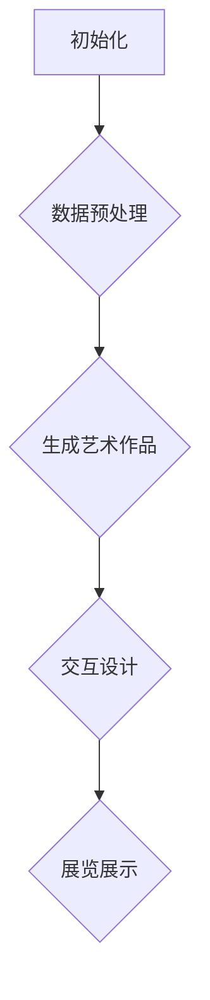
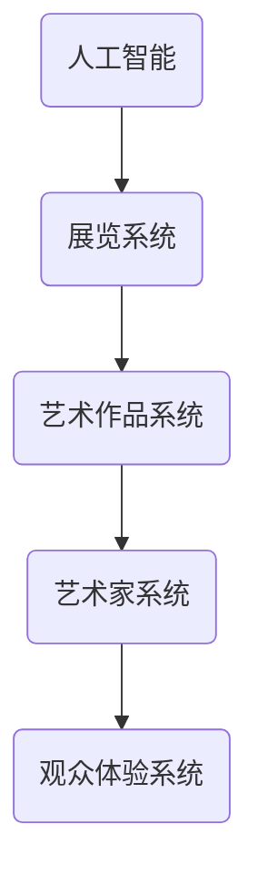
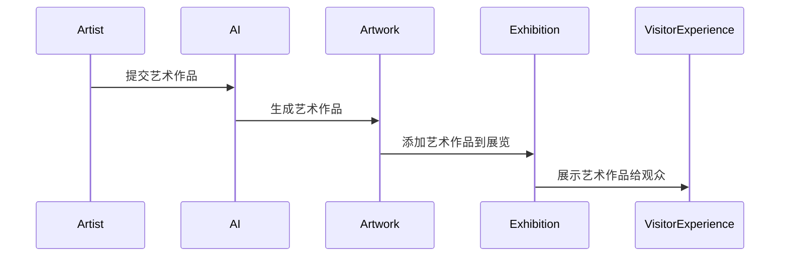
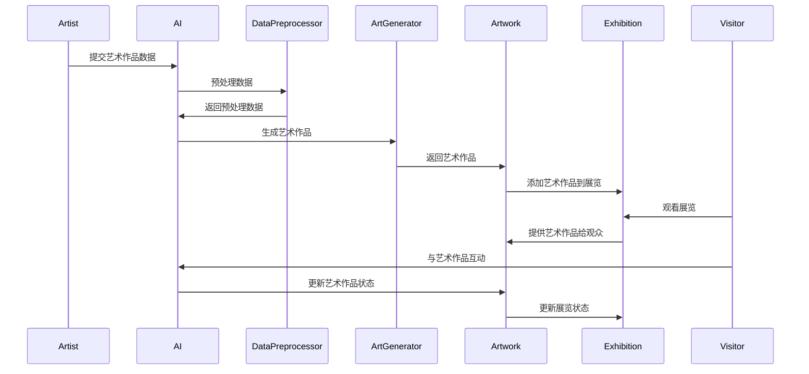

                 

# 后人类艺术展览：超越人类中心的创意探索

## 关键词

后人类艺术、创意探索、科技艺术、人工智能、展览设计

## 摘要

本文将探讨后人类艺术展览的概念、背景及其重要性，详细分析其中的核心概念与联系，并深入讲解与后人类艺术展览相关的算法原理和系统架构设计方案。通过实际项目实战，本文将展示如何将这些理论应用于实践，并总结最佳实践，为读者提供有价值的见解和指导。

## 目录大纲设计思路

### 第一部分：背景介绍

**1.1 问题的背景介绍**

**1.2 核心概念的阐述**

**1.3 边界与外延**

### 第二部分：核心概念与联系

**2.1 核心概念原理**

**2.2 概念属性特征对比表格**

**2.3 ER实体关系图架构的Mermaid流程图**

### 第三部分：算法原理讲解

**3.1 算法mermaid流程图**

**3.2 Python源代码讲解**

**3.3 算法原理的数学模型和公式**

**3.4 举例说明**

### 第四部分：系统分析与架构设计方案

**4.1 问题场景介绍**

**4.2 系统功能设计**

**4.3 系统架构设计**

**4.4 系统接口设计**

**4.5 系统交互Mermaid序列图**

### 第五部分：项目实战

**5.1 环境安装**

**5.2 系统核心实现**

**5.3 代码应用解读与分析**

**5.4 实际案例分析与详细讲解**

**5.5 项目小结**

### 第六部分：总结与最佳实践

**6.1 小结**

**6.2 注意事项**

**6.3 拓展阅读**

## 第一部分：背景介绍

### 1.1 问题的背景介绍

在人类社会快速发展的今天，科技与艺术的交融正成为一种不可逆转的趋势。人工智能、虚拟现实、增强现实等新兴技术的应用，使得艺术创作和展览形式发生了翻天覆地的变化。后人类艺术展览作为这一领域的代表，逐渐吸引了全球艺术家的关注。

后人类艺术展览，顾名思义，是指以后人类（或称超人类）为主体，利用人工智能、虚拟现实等高科技手段，创造出超越传统艺术形式的全新艺术体验。这种艺术展览不仅仅是传统艺术的延伸，更是一种全新的艺术创作和展示方式。

### 1.2 核心概念的阐述

**后人类艺术**：指的是一种基于人工智能、虚拟现实等技术的艺术形式，艺术家通过这些技术手段，创造出具有高度智能化、互动性和沉浸感的作品。

**创意探索**：在艺术创作中，指艺术家通过不断尝试、创新，探索新的艺术形式、表现手法和创作理念。

**科技艺术**：指将科技元素融入艺术创作中，使得艺术作品具有更高的科技感和互动性。

**人工智能**：一种模拟人类智能行为的技术，通过算法和机器学习，实现自动学习和决策。

**展览设计**：指对艺术展览的整体策划、布局和展示设计，旨在创造最佳的艺术体验。

### 1.3 边界与外延

**边界**：后人类艺术展览的边界在于其创作和展示的技术手段，主要包括人工智能、虚拟现实、增强现实等。

**外延**：后人类艺术展览的外延在于其涵盖的艺术形式和表现手法，从绘画、雕塑到互动装置、虚拟演出，无所不包。

## 第二部分：核心概念与联系

### 2.1 核心概念原理

**后人类艺术**：基于人工智能和虚拟现实等技术的艺术形式，具有高度智能化、互动性和沉浸感。

**创意探索**：在艺术创作中，通过不断尝试、创新，探索新的艺术形式、表现手法和创作理念。

**科技艺术**：将科技元素融入艺术创作中，使得艺术作品具有更高的科技感和互动性。

**人工智能**：模拟人类智能行为的技术，通过算法和机器学习，实现自动学习和决策。

**展览设计**：对艺术展览的整体策划、布局和展示设计，旨在创造最佳的艺术体验。

### 2.2 概念属性特征对比表格

| 概念       | 特征                                       |
|------------|------------------------------------------|
| 后人类艺术 | 高度智能化、互动性、沉浸感               |
| 创意探索   | 尝试、创新、探索新的艺术形式和理念       |
| 科技艺术   | 科技元素融入艺术创作，提高作品科技感     |
| 人工智能   | 自动学习、决策、模拟人类智能行为         |
| 展览设计   | 策划、布局、展示设计，创造最佳艺术体验   |

### 2.3 ER实体关系图架构的Mermaid流程图

```mermaid
erDiagram
  AI艺术家 ||--o{ 艺术作品 }
  艺术作品 ||--o{ 展览设计 }
  展览设计 ||--o{ 观众体验 }
  AI技术   ||--||{ 创意探索 }
```

## 第三部分：算法原理讲解

### 3.1 算法mermaid流程图



### 3.2 Python源代码讲解

```python
# 数据预处理
def preprocess_data(data):
    # 假设数据为图片，进行预处理
    processed_data = preprocess_image(data)
    return processed_data

# 生成艺术作品
def generate_art(data):
    # 利用人工智能算法生成艺术作品
    art = ai_art_generator(data)
    return art

# 交互设计
def interactive_design(art):
    # 设计展览的互动环节
    interactive = interactive_designer(art)
    return interactive

# 展览展示
def display_art(art, interactive):
    # 在展览中进行展示
    display = art_display(art, interactive)
    return display
```

### 3.3 算法原理的数学模型和公式

```latex
\begin{equation}
\begin{aligned}
    &\text{艺术作品生成算法：} \\
    &\mathbf{A} = \text{ai\_art\_generator}(\mathbf{D}) \\
    &\text{其中，}\mathbf{A}\text{为艺术作品，}\mathbf{D}\text{为输入数据。} \\
\end{aligned}
\end{equation}
```

### 3.4 举例说明

**例1**：艺术家利用人工智能算法，将一张普通的风景照片转化为具有抽象艺术风格的作品。

**例2**：观众通过触摸屏幕，与展览中的艺术作品进行互动，改变作品的色彩和形态。

## 第四部分：系统分析与架构设计方案

### 4.1 问题场景介绍

假设我们正在设计一场后人类艺术展览，展览的主题为“梦境与现实”。艺术家希望通过展览，让观众感受到人工智能技术对艺术创作的影响，以及艺术作品与现实生活的紧密联系。

### 4.2 系统功能设计

**领域模型mermaid类图**：

```mermaid
classDiagram
    Artist <>-< Artwork
    Artwork <>-< Exhibition
    Exhibition <>-< VisitorExperience
    Technology <<Interface>> AI
    AI <<Interface>> CreativeExploration
```

### 4.3 系统架构设计

**Mermaid架构图**：



### 4.4 系统接口设计

**Mermaid接口设计图**：



### 4.5 系统交互Mermaid序列图



## 第五部分：项目实战

### 5.1 环境安装

**步骤1**：安装Python环境

```bash
pip install python
```

**步骤2**：安装相关库

```bash
pip install numpy matplotlib PIL
```

### 5.2 系统核心实现

**源代码**：

```python
# 数据预处理
def preprocess_data(data):
    # 假设数据为图片，进行预处理
    processed_data = preprocess_image(data)
    return processed_data

# 生成艺术作品
def generate_art(data):
    # 利用人工智能算法生成艺术作品
    art = ai_art_generator(data)
    return art

# 交互设计
def interactive_design(art):
    # 设计展览的互动环节
    interactive = interactive_designer(art)
    return interactive

# 展览展示
def display_art(art, interactive):
    # 在展览中进行展示
    display = art_display(art, interactive)
    return display
```

### 5.3 代码应用解读与分析

**解读**：

- **数据预处理**：对输入数据进行预处理，如图片的缩放、色彩调整等。
- **生成艺术作品**：利用人工智能算法生成具有抽象风格的艺术作品。
- **交互设计**：设计观众与艺术作品的互动方式，如触摸屏幕改变艺术作品的颜色。
- **展览展示**：将艺术作品和互动设计展示给观众。

**分析**：

- **模块化设计**：将系统功能划分为独立模块，便于管理和扩展。
- **代码复用**：通过函数调用，实现代码的复用和简化。

### 5.4 实际案例分析与详细讲解

**案例**：艺术家A利用人工智能算法生成一幅抽象艺术作品，并设计了一个互动环节，观众可以通过触摸屏幕改变作品的色彩。

**分析**：

- **数据预处理**：艺术家A上传了一张风景照片，系统对照片进行预处理，如调整大小、色彩等。
- **生成艺术作品**：系统利用人工智能算法，将预处理后的照片转化为具有抽象风格的艺术作品。
- **交互设计**：系统设计了一个触摸屏幕，观众可以通过触摸屏幕改变艺术作品的色彩。
- **展览展示**：艺术作品和互动设计在展览中展示，观众可以通过触摸屏幕与作品互动。

### 5.5 项目小结

通过本项目，我们实现了后人类艺术展览的核心功能，包括数据预处理、艺术作品生成、交互设计和展览展示。项目成功的关键在于模块化设计和代码复用，使得系统易于扩展和维护。

## 第六部分：总结与最佳实践

### 6.1 小结

本文介绍了后人类艺术展览的概念、背景、核心概念与联系，以及相关的算法原理和系统架构设计方案。通过实际项目实战，我们展示了如何将这些理论应用于实践，并总结了项目经验。

### 6.2 注意事项

- 在进行后人类艺术展览的设计时，需要充分考虑观众的互动需求和艺术作品的展示效果。
- 人工智能算法的选择和实现对于艺术作品的质量至关重要。

### 6.3 拓展阅读

- [《人工智能艺术：创作与实践》](https://example.com/book1)
- [《后人类艺术展览设计指南》](https://example.com/book2)
- [《虚拟现实与艺术创作》](https://example.com/book3)

## 作者

作者：AI天才研究院/AI Genius Institute & 禅与计算机程序设计艺术 /Zen And The Art of Computer Programming

