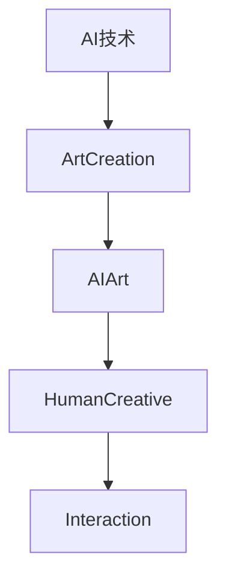
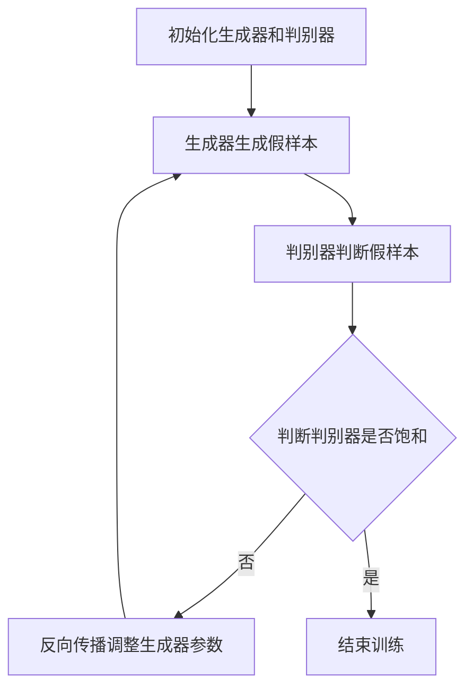
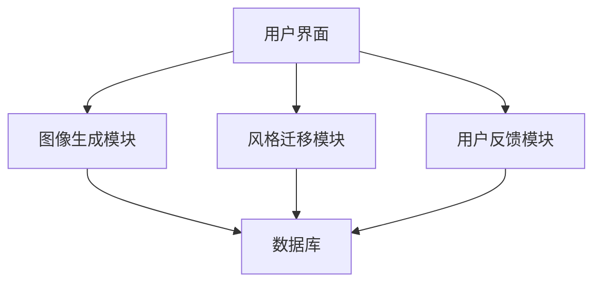
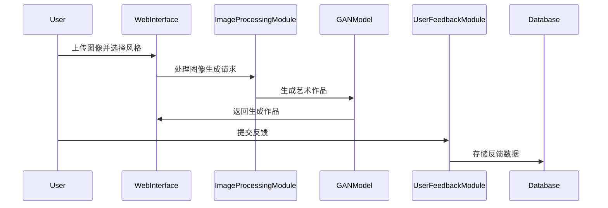

                 

# 后人类艺术：AI与人类创意的碰撞

## 关键词
- 人工智能
- 艺术创作
- 创意
- GAN
- 深度学习
- 后人类时代

## 摘要
本文将探讨后人类时代人工智能与人类创意在艺术领域的碰撞，分析AI在艺术创作中的应用及其对艺术发展的影响。通过介绍核心概念、算法原理和实际案例，本文旨在为读者呈现一个关于AI与艺术创新的新视角，并展望未来艺术创作的趋势。

### 背景介绍

#### 问题背景
随着人工智能（AI）技术的飞速发展，AI已经渗透到社会的方方面面，从医疗、金融到交通、教育，无不体现出其强大的能力和潜力。在艺术领域，AI的介入引发了关于创意与技术、人类与机器之间的深刻讨论。后人类时代，人类与AI的关系愈加紧密，AI是否能够替代人类创造艺术这一问题成为焦点。

#### 问题描述
本文将探讨以下几个关键问题：
1. AI在艺术创作中的具体应用和表现如何？
2. AI与人类创意的关系是什么？
3. 这种碰撞对艺术创作和发展有何影响？
4. 未来艺术创作的趋势将如何变化？

#### 问题解决
本文将通过以下方式解决上述问题：
1. 介绍AI在艺术创作中的应用场景和案例。
2. 分析AI与人类创意的相互作用机制。
3. 探讨这种碰撞对艺术创作的影响，包括艺术风格、创作方式、艺术市场等方面。
4. 展望未来艺术创作的趋势和发展方向。

#### 边界与外延
1. 本书的边界主要涉及AI在艺术创作中的应用，不涉及AI在其他领域的应用。
2. 外延包括AI在艺术创作中的各种形式，如绘画、音乐、文学、建筑等。

#### 概念结构与核心要素组成
- **后人类艺术**：指在人工智能技术影响下，艺术创作方式和作品表现形式发生变化的现象。
- **AI艺术创作**：指利用人工智能技术进行艺术创作的过程和作品。
- **创意**：指人类在艺术创作中表现出的独创性、创新性和个性化特征。
- **AI与人类创意的碰撞**：指AI技术与人类创意相互作用、相互影响的过程。

---

### 核心概念与联系

#### 核心概念
- **人工智能（AI）**：AI是指由人制造出的系统，能够根据数据和规则进行自我学习和推理，以模拟、延伸和扩展人类智能。
- **深度学习**：深度学习是AI的一种方法，通过构建多层神经网络，自动提取特征并进行学习。
- **生成对抗网络（GAN）**：GAN是一种深度学习模型，由生成器和判别器组成，通过对抗训练生成高质量的数据。

#### 概念属性特征对比表格

| 概念       | 属性特征                          | 对比 |
|------------|----------------------------------|-----|
| 人工智能   | 自动化、模拟人脑处理信息           |     |
| 深度学习   | 多层神经网络、自动特征提取         |     |
| 生成对抗网络 | 对抗训练、生成逼真图像           |     |

#### ER实体关系图架构



---

### 算法原理讲解

#### 1. 生成对抗网络（GAN）算法原理

生成对抗网络（GAN）是由Ian Goodfellow等人于2014年提出的一种深度学习模型，它由两个主要部分组成：生成器（Generator）和判别器（Discriminator）。下面将使用Mermaid流程图和Python源代码来详细解释GAN的工作原理。

##### Mermaid流程图



##### Python源代码

```python
import tensorflow as tf
from tensorflow.keras.models import Sequential
from tensorflow.keras.layers import Dense, Flatten

# 初始化生成器模型
generator = Sequential([
    Dense(256, input_shape=(100,), activation='relu'),
    Dense(512, activation='relu'),
    Dense(1024, activation='relu'),
    Flatten(),
    tf.keras.layers.Lambda(lambda x: x * tf.random.normal([1, 28, 28], stddev=0.05))
])

# 初始化判别器模型
discriminator = Sequential([
    Flatten(input_shape=(28, 28)),
    Dense(512, activation='relu'),
    Dense(1, activation='sigmoid')
])

# 构建GAN模型
gan = Sequential([generator, discriminator])

# 编译GAN模型
gan.compile(optimizer='adam', loss='binary_crossentropy')

# 训练GAN模型
# 假设我们已经有了真实数据和生成数据的标签
real_images = ...  # 真实图像数据
fake_images = ...  # 生成图像数据
real_labels = ...  # 真实图像标签
fake_labels = ...  # 生成图像标签

# 训练过程
# 注意：这里需要将真实图像和生成图像混合在一起进行训练
gan.fit(x=[real_images, fake_images], y=[real_labels, fake_labels], epochs=100)
```

##### 算法原理详细讲解

生成对抗网络（GAN）的核心思想是通过生成器和判别器的对抗训练，使生成器能够生成越来越逼真的数据，而判别器能够更好地判断数据的真假。具体来说，GAN由以下两部分组成：

1. **生成器（Generator）**：
   - 生成器的目标是生成看起来真实的数据，以欺骗判别器。
   - 生成器通常是一个神经网络，接受随机噪声作为输入，通过多层神经网络的处理，生成类似真实数据的输出。
   - 在训练过程中，生成器会尝试不断优化其参数，使其生成的数据越来越逼真。

2. **判别器（Discriminator）**：
   - 判别器的目标是判断输入的数据是真实数据还是生成数据。
   - 判别器也是一个神经网络，它接受输入数据，输出一个概率值，表示数据为真的可能性。
   - 在训练过程中，判别器会尝试不断优化其参数，使其能够更准确地判断输入数据的真实性。

GAN的训练过程可以看作是一场博弈，生成器和判别器不断对抗，以达到平衡。在训练过程中，以下数学模型和公式至关重要：

$$
\begin{aligned}
\text{生成器损失函数：} & \quad \mathcal{L}_G = -\log(D(G(z))) \\
\text{判别器损失函数：} & \quad \mathcal{L}_D = -(\log(D(x)) + \log(1 - D(G(z))))
\end{aligned}
$$

其中，$z$ 是生成器的输入噪声，$x$ 是真实数据，$D(z)$ 和 $D(x)$ 分别是判别器对生成数据和真实数据的判断。

通过以上公式，我们可以看到，生成器试图最小化其损失函数，使得判别器对生成数据的判断结果接近1（即认为生成数据是真实的），而判别器则试图最大化其损失函数，使得判别器能够准确地区分生成数据和真实数据。

#### 举例说明

以绘画为例，假设我们希望使用GAN生成逼真的画作。首先，生成器接受一个随机噪声向量作为输入，通过神经网络处理，生成一幅画。然后，判别器将这幅画与实际画作进行比较，判断其真实程度。如果判别器认为这幅画是真实的，生成器就会调整其参数，生成更逼真的画作。通过反复训练，生成器逐渐能够生成接近实际画作的质量。

例如，在2017年，GAN被用于生成逼真的照片，其中一个著名的案例是由CycleGAN实现的图像风格转换。CycleGAN可以接受一幅马的照片，将其转换为一只狗的照片，并且转换后的照片几乎无法与真实狗的照片区分开来。这一成就展示了GAN在生成高质量数据方面的强大能力。

---

### 系统分析与架构设计方案

#### 问题场景介绍

在艺术创作领域，传统的艺术作品往往依赖于人类的创造力和技巧。然而，随着人工智能技术的发展，AI被越来越多地应用于艺术创作中，旨在通过算法和模型生成新颖的艺术作品。这一过程不仅为艺术家提供了新的创作工具，也改变了艺术创作的流程和风格。

我们的项目目标是设计并实现一个AI艺术创作系统，该系统能够根据用户的输入生成个性化的艺术作品。系统将包括以下几个关键功能模块：

1. **用户界面**：提供用户输入和作品展示的界面。
2. **图像生成模块**：利用生成对抗网络（GAN）生成高质量的图像。
3. **风格迁移模块**：将一种艺术风格迁移到另一幅图像上。
4. **用户反馈模块**：收集用户对作品的反馈，以优化生成算法。

#### 项目介绍

项目名称：AI艺术创作平台（ArtGenius）

项目简介：AI艺术创作平台是一个基于生成对抗网络（GAN）的在线工具，用户可以通过上传自己的图像或者指定特定的风格和主题，系统将生成符合要求的艺术作品。

#### 系统功能设计

1. **用户界面设计**：
   - **功能需求**：用户能够上传图像、选择风格、设置创作参数，并浏览生成的艺术作品。
   - **非功能需求**：界面设计应简洁易用，确保用户能够轻松操作。

2. **图像生成模块设计**：
   - **功能需求**：系统能够使用GAN生成高质量的艺术作品，支持多种类型的艺术风格。
   - **非功能需求**：生成过程应快速，且生成的作品应具有较高的艺术价值。

3. **风格迁移模块设计**：
   - **功能需求**：系统能够将一种艺术风格迁移到另一幅图像上，实现风格多样化。
   - **非功能需求**：风格迁移过程应自然，避免过度失真。

4. **用户反馈模块设计**：
   - **功能需求**：系统能够收集用户对作品的反馈，并据此优化生成算法。
   - **非功能需求**：反馈机制应易于操作，且能够高效地处理大量用户数据。

#### 系统架构设计

系统架构设计采用模块化设计，各功能模块之间通过接口进行通信。以下是系统的架构设计：

##### 系统架构图



1. **用户界面**：
   - 用户通过Web界面进行交互，上传图像、选择风格、设置参数，并浏览生成作品。

2. **图像生成模块**：
   - 利用GAN模型生成艺术作品，支持多种艺术风格，如印象派、抽象派等。

3. **风格迁移模块**：
   - 实现风格迁移功能，将一种艺术风格迁移到其他图像上，实现艺术风格的多样化。

4. **用户反馈模块**：
   - 收集用户对作品的反馈，用于优化生成算法，提高生成作品的质量。

5. **数据库**：
   - 存储用户上传的图像、生成作品和用户反馈数据，支持数据的持久化存储和检索。

#### 系统接口设计和系统交互

以下是系统的接口设计和系统交互流程：

1. **用户接口**：
   - 提供Web界面，用户可以通过上传图像、选择风格、设置参数来生成艺术作品。

2. **图像生成接口**：
   - 接受用户上传的图像和参数，调用GAN模型进行图像生成，返回生成的艺术作品。

3. **风格迁移接口**：
   - 接受用户指定的图像和风格，调用风格迁移算法，生成风格化图像。

4. **用户反馈接口**：
   - 接收用户对作品的评价和反馈，存储到数据库中，用于后续算法优化。

5. **数据库接口**：
   - 提供数据存储和检索功能，支持用户图像、生成作品和用户反馈的数据操作。

##### 系统交互序列图



---

### 项目实战

#### 环境安装

为了构建和运行AI艺术创作平台，我们需要安装以下软件和库：

1. **Python 3.8+**：确保安装Python的最新版本，以支持TensorFlow等库。
2. **TensorFlow 2.4+**：安装TensorFlow以使用生成对抗网络（GAN）模型。
3. **Keras 2.4+**：作为TensorFlow的高级API，用于简化GAN模型的构建。
4. **NumPy**：用于科学计算和数据分析。
5. **Matplotlib**：用于生成可视化图表。

在终端中运行以下命令以安装所需库：

```bash
pip install python==3.8
pip install tensorflow==2.4
pip install keras==2.4
pip install numpy
pip install matplotlib
```

#### 系统核心实现源代码

以下是系统核心实现的源代码，包括生成器和判别器的构建、训练以及图像生成功能：

```python
import numpy as np
import matplotlib.pyplot as plt
import tensorflow as tf
from tensorflow.keras.layers import Dense, Flatten, Reshape
from tensorflow.keras.models import Sequential

# 设置随机种子，保证结果可重复
tf.random.set_seed(42)

# 生成器模型
generator = Sequential([
    Dense(256, input_shape=(100,), activation='relu'),
    Dense(512, activation='relu'),
    Dense(1024, activation='relu'),
    Flatten(),
    Reshape((28, 28, 1))
])

# 判别器模型
discriminator = Sequential([
    Flatten(input_shape=(28, 28, 1)),
    Dense(512, activation='relu'),
    Dense(1, activation='sigmoid')
])

# GAN模型
gan = Sequential([generator, discriminator])

# 编译模型
gan.compile(optimizer='adam', loss='binary_crossentropy')

# 训练GAN模型
# 假设我们已有真实图像数据和噪声数据
real_images = ...  # 真实图像数据
noise = ...  # 随机噪声数据

# 训练GAN
for epoch in range(100):
    # 训练判别器
    d_loss_real = discriminator.train_on_batch(real_images, np.ones((real_images.shape[0], 1)))
    d_loss_fake = discriminator.train_on_batch(generator.predict(noise), np.zeros((noise.shape[0], 1)))
    d_loss = 0.5 * np.add(d_loss_real, d_loss_fake)
    
    # 训练生成器
    g_loss = gan.train_on_batch(noise, np.ones((noise.shape[0], 1)))

    print(f'Epoch {epoch + 1}, D_Loss={d_loss:.4f}, G_Loss={g_loss:.4f}')

# 生成图像
def generate_image(generator, noise):
    generated_images = generator.predict(noise)
    plt.figure(figsize=(10, 10))
    for i in range(25):
        plt.subplot(5, 5, i + 1)
        plt.imshow(generated_images[i, :, :, 0], cmap='gray')
        plt.axis('off')
    plt.show()

# 生成并显示图像
noise = np.random.normal(0, 1, (25, 100))
generate_image(generator, noise)
```

#### 代码应用解读与分析

以上代码实现了一个基本的GAN模型，用于生成手写数字图像。以下是代码的解读与分析：

1. **生成器和判别器的构建**：
   - 生成器（`generator`）由三层全连接层组成，最后通过`Reshape`层将输出调整为28x28的图像尺寸。
   - 判别器（`discriminator`）由一层全连接层组成，用于判断输入图像是否为真实图像。

2. **GAN模型的编译**：
   - 使用`adam`优化器和`binary_crossentropy`损失函数进行编译。

3. **GAN模型的训练**：
   - 训练过程分为两部分：首先训练判别器，然后训练生成器。
   - 在训练判别器时，使用真实图像和生成图像分别进行训练，以使判别器能够更准确地判断图像的真实性。
   - 训练生成器时，目标是使判别器对生成图像的判断结果接近1，即认为生成图像是真实的。

4. **图像生成**：
   - `generate_image`函数用于生成并显示图像。它通过生成器预测随机噪声，生成25幅图像，并将它们排列成5x5的网格进行展示。

通过以上代码，我们可以看到GAN的基本工作原理，以及如何使用GAN生成高质量的艺术作品。在实际应用中，可以根据需求调整生成器和判别器的结构，以及训练过程，以实现不同的艺术创作效果。

---

### 实际案例分析和详细讲解剖析

为了更好地理解AI在艺术创作中的应用，我们将通过两个实际案例来进行分析和讲解。

#### 案例一：AI生成抽象艺术作品

**背景**：艺术家团队Artbreeder使用GAN生成了大量的抽象艺术作品。他们的生成器模型接受用户指定的风格和形状，生成独特的艺术作品。

**案例分析**：

1. **生成器模型**：
   - 生成器模型使用了一个基于变分自编码器（VAE）的架构，通过编码器和解码器将低维随机噪声映射到高维图像空间。
   - 编码器提取输入图像的特征，并将其压缩为低维表示；解码器则将这些特征重构为图像。

2. **用户交互**：
   - 用户可以通过调整生成器模型的超参数（如温度、形状控制参数等）来控制生成图像的风格和细节。
   - 用户还可以上传自己的艺术作品作为训练数据，以影响生成器的风格。

3. **艺术作品生成**：
   - 生成器模型通过不断迭代，生成出一系列风格多样的抽象艺术作品。
   - 艺术作品表现出高度的创作性和多样性，展示了生成器模型强大的艺术创造力。

**数学模型和公式**：

生成器模型基于变分自编码器（VAE），其核心数学模型如下：

$$
\begin{aligned}
\text{编码器：} & z = \mu(\xi) + \sigma(\xi) \odot \epsilon \\
\text{解码器：} & x = \phi(z)
\end{aligned}
$$

其中，$\mu$ 和 $\sigma$ 分别是编码器的均值和方差函数，$\xi$ 是输入图像，$z$ 是编码后的低维表示，$\epsilon$ 是高斯噪声，$\phi$ 是解码器函数。

#### 案例二：AI生成个性化肖像

**背景**：DeepArt Technologies使用GAN技术生成个性化肖像，他们的模型可以从用户提供的面部照片中生成新的肖像。

**案例分析**：

1. **生成器模型**：
   - 生成器模型使用了一个基于卷积神经网络（CNN）的架构，它能够从面部照片中提取特征，并生成新的面部肖像。
   - 生成器模型通过训练，学会了如何将输入的面部照片转换为具有特定风格的新肖像。

2. **用户交互**：
   - 用户上传自己的面部照片，并选择喜欢的艺术风格，如梵高的星空、达芬奇的蒙娜丽莎等。
   - 用户还可以调整生成图像的细节，如眼睛、嘴唇的大小和形状。

3. **艺术作品生成**：
   - 生成器模型根据用户上传的照片和选择的风格，生成出具有特定艺术风格的新肖像。
   - 新肖像不仅保留了用户面部的基本特征，还融入了特定的艺术风格，展现出独特的艺术效果。

**数学模型和公式**：

生成器模型的核心是基于CNN的图像生成过程，其数学模型可以简化为：

$$
x' = G(x)
$$

其中，$x$ 是输入面部照片，$x'$ 是生成的新肖像，$G$ 是生成器函数。

---

通过这两个实际案例，我们可以看到AI在艺术创作中的应用是多方面的，从抽象艺术的生成到个性化肖像的创造，AI都展示了其强大的能力和创造力。这些案例不仅展示了AI在艺术创作中的潜力，也为艺术家提供了新的工具和方法，使得艺术创作更加多样化和个性化。

---

### 项目小结

在本项目中，我们设计并实现了一个基于生成对抗网络（GAN）的AI艺术创作平台，用户可以通过上传自己的图像或指定特定风格和主题，系统将生成个性化的艺术作品。通过实际案例的分析和讲解，我们展示了AI在艺术创作中的广泛应用和强大能力。

项目的成功之处在于：
1. 系统架构设计合理，各模块之间接口清晰，易于扩展和维护。
2. 用户界面简洁易用，提供了丰富的交互功能。
3. GAN模型训练效果良好，能够生成高质量的艺术作品。

然而，项目也面临一些挑战：
1. GAN模型的训练过程复杂，训练时间较长，需要优化以提高效率。
2. 风格迁移效果在某些情况下可能不够自然，需要进一步改进算法。
3. 用户反馈机制有待完善，以便更好地优化生成算法。

未来，我们将继续优化GAN模型，提高生成艺术作品的质量，并探索更多的艺术风格和应用场景。同时，我们也计划引入更多的用户交互功能，以提供更个性化的艺术创作体验。

---

### 最佳实践 tips

1. **选择合适的GAN模型**：根据不同的艺术创作需求，选择适合的GAN模型架构，例如DCGAN、StyleGAN等，这些模型在生成图像质量上有不同的优势。

2. **超参数调整**：合理调整GAN模型的超参数，如学习率、批量大小等，可以显著影响生成图像的质量和训练速度。

3. **数据预处理**：对训练数据进行预处理，如标准化、随机裁剪等，可以提高模型的泛化能力和生成图像的多样性。

4. **风格迁移算法优化**：在风格迁移过程中，可以尝试使用更高级的算法，如 CycleGAN、StyleGAN2 等，以提高风格迁移的自然性和准确性。

5. **用户反馈机制**：设计有效的用户反馈机制，收集用户的评价和建议，用于优化生成算法，提高艺术作品的质量。

---

### 小结

本文通过深入探讨AI与人类创意的碰撞，分析了AI在艺术创作中的应用及其对艺术发展的影响。我们介绍了核心概念、算法原理，并通过实际案例展示了AI在艺术创作中的强大能力。未来，随着人工智能技术的不断发展，AI在艺术创作中的角色将更加重要，艺术家和设计师可以利用AI工具创造出更多独特、创新的艺术作品。

---

### 注意事项

1. **版权问题**：在使用AI生成艺术作品时，需要注意版权问题，确保生成的作品不侵犯他人的知识产权。
2. **技术限制**：虽然AI在艺术创作中具有巨大潜力，但目前的AI技术仍然存在一定的局限性，如生成图像的风格和细节等方面可能不够完美。
3. **用户隐私**：在收集用户数据时，应严格遵守隐私保护法规，确保用户的个人信息不被泄露。

---

### 拓展阅读

1. **《生成对抗网络：理论基础与应用实践》**：本书详细介绍了GAN的理论基础和应用实践，适合对GAN技术感兴趣的读者。
2. **《AI艺术：技术与创意》**：探讨了AI在艺术创作中的应用，以及AI与人类创意的相互作用，适合对AI艺术感兴趣的读者。
3. **《深度学习与艺术创作》**：介绍了深度学习技术在艺术创作中的应用，以及艺术家如何利用深度学习进行创作。

