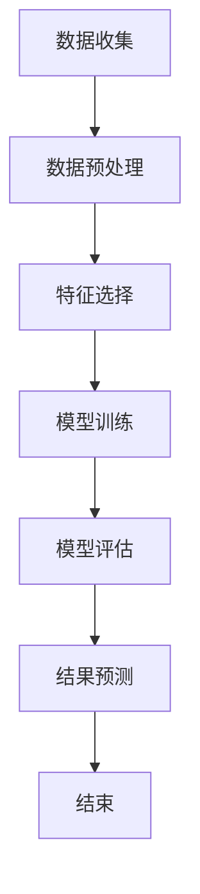
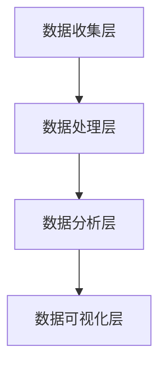
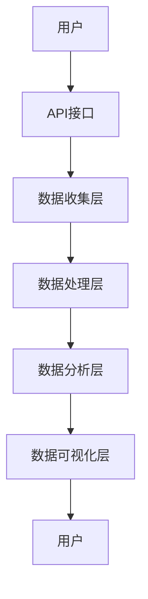

                 

### 文章标题

# 后工业化社会的生活方式重塑

> 关键词：后工业化社会、生活方式重塑、技术革新、经济结构转型、社会价值观演变、教育变革

> 摘要：本文将深入探讨后工业化社会生活方式重塑的背景、内涵、影响因素及其重要性。通过分析技术革新、经济结构转型、社会价值观演变和教育变革等方面，揭示这些因素如何共同作用于现代社会，推动生活方式的深刻变革。本文旨在为读者提供一份全面而深刻的思考，以期为后工业化社会的未来发展提供有益的启示。

---

### 引言

#### 第1章：后工业化社会的崛起

##### 1.1 问题背景与后工业化社会定义

随着全球化、信息技术革命和知识经济的快速发展，世界各国的社会结构和经济模式正在发生深刻变革。工业化社会，作为人类历史发展的重要阶段，为世界经济的繁荣和科技进步做出了巨大贡献。然而，工业化社会也伴随着资源浪费、环境污染、社会不平等等问题。为了应对这些挑战，人类社会正在逐步迈向后工业化社会。

**1.1.1 工业化社会向后工业化社会的转变**

工业化社会的核心特征是大规模工业生产和机械化生产方式，这一阶段的经济活动主要集中在制造业和重工业。然而，随着技术的进步和消费者需求的多样化，工业化社会的生产方式和消费模式逐渐暴露出诸多问题。首先，工业化生产模式的高度专业化导致生产灵活性的降低，难以适应快速变化的市场需求。其次，资源消耗和环境污染问题日益严重，对可持续发展构成了严峻挑战。此外，工业化社会中，社会不平等现象愈发突出，收入差距扩大，贫富分化加剧。

后工业化社会则是指工业化社会之后的一个发展阶段，其核心特征是服务业和信息经济的蓬勃发展。在这一阶段，传统制造业和重工业的重要性逐渐下降，服务业和信息产业成为经济增长的主要驱动力。信息技术、生物技术、新能源技术等新兴技术迅速发展，不仅改变了生产方式和消费模式，还推动了社会各领域的变革。

**1.1.2 后工业化社会的核心特征**

1. **知识经济成为主导力量**：知识经济是后工业化社会的主要经济形态，以知识和信息为主要生产要素，科技创新成为经济增长的主要动力。
2. **服务业占比不断提高**：服务业在国民经济中的比重不断增加，成为经济增长的主要贡献者。
3. **信息技术高度普及**：信息技术在后工业化社会中得到广泛应用，互联网、移动通信、大数据、人工智能等技术的快速发展，改变了人们的生产方式和生活方式。
4. **环境保护和可持续发展**：后工业化社会更加重视环境保护和可持续发展，通过技术创新和制度创新，实现经济增长与资源环境之间的协调。

**1.1.3 后工业化社会的影响范围与趋势**

后工业化社会的崛起不仅影响经济领域，还渗透到社会生活的方方面面。首先，它改变了传统的生产方式和消费模式，促进了新兴产业的快速发展。其次，它推动了教育、医疗、文化等社会领域的变革，提高了人们的生活质量。此外，后工业化社会还面临着一系列新的挑战，如数字鸿沟、劳动力市场变化、社会不平等等问题。

##### 1.2 生活方式重塑的定义与内涵

**1.2.1 生活方式重塑的含义**

生活方式重塑是指在新的社会经济背景下，人们的日常行为模式、价值观、生活方式等发生的一系列深刻变化。这种变化不仅体现在物质层面，还包括精神层面和社会层面。生活方式重塑是一个复杂而动态的过程，涉及多个领域的相互作用和影响。

**1.2.2 生活方式重塑的关键要素**

1. **技术变革**：技术革新是生活方式重塑的核心驱动力，信息技术、生物技术、新能源技术等新兴技术的发展，改变了人们的生产方式和消费模式。
2. **经济结构转型**：经济结构转型是生活方式重塑的重要背景，服务业和信息经济的兴起，改变了人们的职业选择和消费行为。
3. **社会价值观演变**：社会价值观的演变影响人们的行为和生活方式，后工业化社会更加注重个人价值和社会责任的平衡。
4. **教育变革**：教育变革是生活方式重塑的重要支撑，新的教育模式和培训方式，提高了人们的综合素质和创新能力。

**1.2.3 生活方式重塑的目标与意义**

生活方式重塑的目标是实现人类与自然、经济、社会的和谐发展，提高人们的生活质量和幸福感。其意义在于：

1. **促进可持续发展**：通过生活方式重塑，可以实现资源的节约和环境的保护，推动社会的可持续发展。
2. **提高生活质量**：生活方式重塑有助于提高人们的物质和精神生活质量，满足人们对美好生活的向往。
3. **促进社会进步**：生活方式重塑推动社会各领域的变革和创新，促进社会的进步和发展。

##### 1.3 边界与外延

**1.3.1 后工业化社会生活方式重塑的边界**

后工业化社会生活方式重塑的边界主要涉及以下几个方面：

1. **技术层面**：技术革新是生活方式重塑的基础，但并非所有技术变革都会直接影响生活方式。只有那些对人们日常生活产生深远影响的技术，如信息技术、生物技术等，才会引发生活方式的深刻变革。
2. **经济层面**：经济结构转型是生活方式重塑的背景，但生活方式重塑并不仅仅依赖于经济结构的改变。生活方式重塑还受到社会文化、教育等因素的深刻影响。
3. **社会层面**：社会价值观的演变是生活方式重塑的重要动力，但生活方式重塑不仅仅是对社会价值观的回应。生活方式重塑还会推动社会价值观的进一步演变。

**1.3.2 后工业化社会生活方式重塑的外延**

后工业化社会生活方式重塑的外延主要涉及以下几个方面：

1. **生产方式**：生活方式重塑改变了传统的生产方式，推动了智能制造、绿色制造等新兴生产模式的兴起。
2. **消费方式**：生活方式重塑改变了传统的消费方式，促进了个性化消费、绿色消费等新型消费模式的兴起。
3. **生活方式**：生活方式重塑改变了人们的日常生活习惯和生活方式，促进了健康生活、品质生活等新型生活方式的兴起。
4. **社会治理**：生活方式重塑改变了社会治理模式，推动了智慧城市、数字治理等新型社会治理模式的兴起。

**1.3.3 后工业化社会生活方式重塑与其他相关概念的区分**

1. **信息化社会**：信息化社会是后工业化社会的一个重要特征，但生活方式重塑并不仅限于信息化。生活方式重塑还包括经济结构转型、社会价值观演变等方面的变革。
2. **知识社会**：知识社会是后工业化社会的另一个重要特征，但生活方式重塑并不仅限于知识经济。生活方式重塑还包括生活质量的提高、可持续发展的实现等方面的变革。
3. **全球化**：全球化是后工业化社会的一个重要趋势，但生活方式重塑并不仅限于全球化的影响。生活方式重塑还包括本土化、多元化等方面的变革。

##### 1.4 核心概念与联系

**1.4.1 后工业化社会的核心概念**

后工业化社会的核心概念包括：

1. **知识经济**：知识经济是以知识和信息为主要生产要素的经济形态。
2. **服务业**：服务业是指为社会提供服务的行业，包括教育、医疗、文化、娱乐等。
3. **信息技术**：信息技术是指利用计算机技术、通信技术等对信息进行采集、处理、存储和传输的技术体系。
4. **可持续发展**：可持续发展是指在不损害未来世代利益的前提下，满足当代人类需求的发展模式。

**1.4.2 核心概念之间的联系与作用**

1. **知识经济与服务业**：知识经济推动了服务业的快速发展，服务业成为经济增长的重要驱动力。
2. **信息技术与知识经济**：信息技术是知识经济的重要支撑，促进了知识的传播和应用。
3. **可持续发展与知识经济**：可持续发展是知识经济的内在要求，知识经济为实现可持续发展提供了技术支撑。

**1.4.3 核心概念对比表格**

| 核心概念 | 定义 | 影响因素 | 结果 |
| :--: | :--: | :--: | :--: |
| 知识经济 | 以知识和信息为主要生产要素的经济形态 | 科技创新、教育培训、知识产权 | 推动经济增长、提高生活质量 |
| 服务业 | 为社会提供服务的行业 | 政策支持、市场需求、技术进步 | 提高就业率、满足多样化需求 |
| 信息技术 | 利用计算机技术、通信技术等对信息进行采集、处理、存储和传输的技术体系 | 硬件技术、软件技术、网络技术 | 改变生产方式、消费方式 |
| 可持续发展 | 在不损害未来世代利益的前提下，满足当代人类需求的发展模式 | 环保意识、技术创新、制度保障 | 保护环境、实现经济繁荣 |

##### 1.5 本章小结

本章从问题背景、定义与内涵、边界与外延、核心概念与联系等方面，系统地介绍了后工业化社会的生活方式重塑。通过分析工业化社会向后工业化社会的转变，揭示了后工业化社会的核心特征和影响范围。同时，本文还对生活方式重塑的定义、关键要素、目标与意义进行了深入探讨，为后续章节的分析提供了理论基础。

### 第一部分：后工业化社会的崛起

在上一章中，我们详细介绍了后工业化社会的崛起背景、定义及其核心特征。在这一部分，我们将进一步探讨后工业化社会的崛起对经济、社会和文化等领域产生的深远影响。

#### 1.1 工业化社会向后工业化社会的转变

工业化社会向后工业化社会的转变是一个复杂而漫长的过程，涉及经济、技术、社会等多个方面的变革。以下是一些主要的转变：

**1.1.1 经济结构的转变**

工业化社会的经济结构以制造业和重工业为主，生产方式以规模化、标准化为主。而在后工业化社会中，服务业和信息产业逐渐成为主导力量，经济结构呈现多样化、个性化的趋势。具体表现为：

1. **服务业比重增加**：随着消费者需求的多样化，服务业在国民经济中的比重不断增加。服务业包括教育、医疗、金融、旅游、文化等，这些行业具有较高的附加值和就业潜力。
2. **信息技术产业崛起**：信息技术产业的快速发展，推动了数字经济、互联网经济等新兴产业的兴起。信息技术产业不仅带动了传统产业的转型升级，还催生了大量新的商业模式和就业机会。

**1.1.2 生产方式的转变**

工业化社会的生产方式以大规模、标准化为主，生产效率高但灵活性差。而后工业化社会的生产方式更加注重个性化和定制化，生产效率和质量得到提升。具体表现为：

1. **智能制造**：智能制造是后工业化社会的重要生产方式，通过工业互联网、大数据、人工智能等技术，实现生产过程的智能化、自动化。智能制造不仅提高了生产效率，还降低了生产成本。
2. **绿色制造**：绿色制造是后工业化社会的重要趋势，通过技术创新和制度保障，实现生产过程的节能减排、资源循环利用。绿色制造有助于保护环境，实现可持续发展。

**1.1.3 消费模式的转变**

工业化社会的消费模式以物质消费为主，消费者追求的是物质财富的积累。而后工业化社会的消费模式更加注重精神消费和体验消费，消费者追求的是生活品质的提升。具体表现为：

1. **个性化消费**：个性化消费是后工业化社会的主要消费模式，消费者更加注重产品和服务的设计、品质和个性。个性化消费推动了定制化生产和服务的兴起。
2. **体验消费**：体验消费是后工业化社会的重要消费趋势，消费者通过体验活动、旅游、娱乐等途径，获得身心愉悦和满足。体验消费推动了文化旅游、健康养生等新兴产业的快速发展。

#### 1.2 社会结构的转变

后工业化社会的崛起带来了社会结构的深刻变革，具体表现为：

**1.2.1 劳动力市场的变化**

随着经济结构的转变和生产方式的升级，劳动力市场的需求也发生了变化。具体表现为：

1. **高技能人才需求增加**：后工业化社会对高技能人才的需求不断增加，特别是在信息技术、生物技术、绿色能源等领域。高技能人才成为推动经济发展和社会进步的重要力量。
2. **灵活就业增加**：随着互联网技术的普及和远程工作的兴起，灵活就业模式逐渐成为主流。灵活就业不仅提高了就业率，还满足了劳动者对工作与生活平衡的需求。

**1.2.2 社会分层的变化**

后工业化社会的社会分层也发生了变化，具体表现为：

1. **知识资本的重要性**：在知识经济时代，知识资本成为重要的生产要素，拥有高知识水平的人在社会分层中占据优势地位。
2. **数字鸿沟**：数字鸿沟是后工业化社会中一个不可忽视的问题，数字技术的普及和应用使得社会阶层分化更加明显。解决数字鸿沟问题，是实现社会公平和可持续发展的重要任务。

**1.2.3 社会价值观的变化**

后工业化社会的崛起也带来了社会价值观的深刻变革，具体表现为：

1. **个人价值与社会责任**：在工业化社会中，个人价值和社会责任往往被对立起来。而在后工业化社会中，个人价值和社会责任逐渐统一，人们更加注重个人发展与社会贡献的平衡。
2. **可持续发展观念**：后工业化社会更加重视环境保护和可持续发展，人们开始关注资源利用、环境保护等问题，追求经济、社会、环境三者的协调发展。

#### 1.3 文化领域的变革

后工业化社会的崛起不仅影响了经济和社会结构，也带来了文化领域的深刻变革，具体表现为：

**1.3.1 文化产业的兴起**

随着经济的发展和消费模式的转变，文化产业逐渐成为后工业化社会的重要支柱产业。文化产业包括电影、音乐、出版、文化旅游等领域，具有较高的附加值和文化影响力。

**1.3.2 文化消费的升级**

后工业化社会的消费模式更加注重精神消费和体验消费，文化消费呈现出多样化和个性化的特点。具体表现为：

1. **数字化文化消费**：随着互联网技术的普及，数字化文化消费逐渐成为主流。人们可以通过网络平台观看电影、听音乐、阅读电子书等。
2. **体验式文化消费**：体验式文化消费是后工业化社会的重要消费趋势，人们通过参加文化活动、旅游等途径，获得身心愉悦和满足。

**1.3.3 文化创意产业的发展**

文化创意产业是后工业化社会的重要产业形态，通过创新和创意，推动文化产业的快速发展。文化创意产业包括动漫、游戏、设计、艺术等领域，具有较高的创意性和市场潜力。

#### 1.4 后工业化社会面临的挑战

虽然后工业化社会带来了诸多机遇，但也面临一些挑战，具体表现为：

**1.4.1 数字鸿沟**

数字鸿沟是后工业化社会中一个不可忽视的问题，数字技术的普及和应用使得社会阶层分化更加明显。要解决数字鸿沟问题，需要政府、企业和社会各界共同努力，提高全民数字素养。

**1.4.2 资源环境压力**

后工业化社会的快速发展给资源和环境带来了巨大压力，特别是能源消耗和环境污染问题。要实现可持续发展，需要推进绿色技术创新和制度创新，实现经济增长与环境保护的协调发展。

**1.4.3 社会公平**

后工业化社会中，社会分层和收入差距问题依然存在，甚至可能加剧。要实现社会公平，需要完善社会保障制度，提高低收入群体的收入水平，促进社会资源的合理分配。

#### 1.5 本章小结

本章从经济、社会和文化等多个方面，探讨了后工业化社会的崛起及其对经济、社会和文化等领域产生的深远影响。通过分析工业化社会向后工业化社会的转变，揭示了后工业化社会的核心特征和影响范围。同时，本章还讨论了后工业化社会面临的挑战，为后续章节的分析提供了重要的背景和基础。

### 第2章：生活方式重塑的定义与内涵

在了解了后工业化社会的崛起和其对经济、社会和文化等领域的深远影响之后，我们接下来将深入探讨生活方式重塑的定义与内涵。生活方式重塑是指在新的社会经济背景下，人们的日常行为模式、价值观、生活方式等发生的一系列深刻变化。这种变化不仅体现在物质层面，还包括精神层面和社会层面。

#### 2.1 生活方式重塑的含义

生活方式重塑是指在社会经济结构、技术进步、文化变迁等多重因素的作用下，人们的日常生活行为模式、消费观念、价值观等发生的一系列深刻变化。这种变化不仅影响个人的生活品质，还对整个社会的运行和发展产生重要影响。

**2.1.1 生活方式重塑的特征**

1. **多元化与个性化**：在生活方式重塑过程中，人们的消费需求日益多样化，追求个性化的生活方式。这体现在消费模式、娱乐方式、休闲活动等方面，消费者更加注重个性化定制和独特体验。

2. **智能化与数字化**：随着信息技术的快速发展，智能化和数字化成为生活方式重塑的重要特征。人们越来越依赖智能设备、互联网平台和大数据，生活方式的数字化程度不断提高。

3. **健康与可持续发展**：生活方式重塑越来越注重健康和可持续发展。人们开始关注饮食健康、运动锻炼、环境保护等问题，追求身心和谐和长远发展的生活方式。

4. **时间管理**：在快节奏的生活中，时间管理成为生活方式重塑的重要方面。人们通过提高工作效率、合理安排时间，实现工作与生活的平衡。

**2.1.2 生活方式重塑的影响**

1. **经济层面**：生活方式重塑改变了消费模式，推动了个性化定制、体验式消费等新型消费模式的兴起，为经济增长提供了新动力。

2. **社会层面**：生活方式重塑促进了社会结构的变革，如劳动力市场的变化、家庭关系的变化等，对社会稳定和发展产生深远影响。

3. **文化层面**：生活方式重塑带来了文化多样性和文化创新，丰富了人们的精神世界，推动了文化产业的繁荣。

#### 2.2 生活方式重塑的关键要素

生活方式重塑是一个复杂而多层次的过程，涉及多个关键要素。以下是一些关键要素及其作用：

**2.2.1 技术进步**

技术进步是生活方式重塑的重要驱动力。信息技术、生物技术、新能源技术等新兴技术的发展，改变了人们的生产方式、消费模式和生活方式。例如，互联网的普及使得人们可以更方便地进行在线购物、远程办公和社交活动。

**2.2.2 经济发展**

经济发展为生活方式重塑提供了物质基础。随着经济的发展，人们的收入水平提高，消费能力增强，生活方式更加多样化和个性化。同时，经济发展也推动了相关产业的发展，如旅游业、文化娱乐业等，为人们提供了更多的消费选择。

**2.2.3 社会变革**

社会变革是生活方式重塑的重要背景。社会结构的调整、家庭关系的变化、人口老龄化的趋势等，都对生活方式重塑产生影响。例如，城市化进程的加快和人口流动的加剧，改变了人们的居住方式和生活习惯。

**2.2.4 文化演变**

文化演变是生活方式重塑的重要动力。随着文化多样性和文化创新的发展，人们的生活方式受到文化的影响和塑造。例如，传统文化和现代文化的交融，使得人们的生活方式更加多元化。

#### 2.3 生活方式重塑的目标与意义

生活方式重塑的目标是实现人类与自然、经济、社会的和谐发展，提高人们的生活质量和幸福感。其意义在于：

**2.3.1 促进可持续发展**

生活方式重塑有助于实现可持续发展，通过减少资源消耗、保护环境，推动经济、社会、环境三者的协调发展。

**2.3.2 提高生活质量**

生活方式重塑有助于提高人们的生活质量，通过改善消费模式、促进身心健康，提升人们的幸福感和满足感。

**2.3.3 推动社会进步**

生活方式重塑有助于推动社会进步，通过促进社会结构的变革、提高教育水平、增强社会责任感，推动社会的和谐与进步。

#### 2.4 本章小结

本章从生活方式重塑的含义、特征、关键要素、目标与意义等方面，系统地阐述了生活方式重塑的定义与内涵。通过分析技术进步、经济发展、社会变革和文化演变等因素，揭示了生活方式重塑的复杂性和多样性。同时，本章还探讨了生活方式重塑的目标与意义，为后续章节的分析提供了理论基础。

### 第3章：后工业化社会生活方式重塑的边界与外延

在了解了后工业化社会生活方式重塑的定义与内涵后，我们需要进一步探讨其边界与外延。生活方式重塑不仅涉及个人层面的行为模式变化，还延伸到经济、社会和文化等多个领域，影响深远。本章节将分析后工业化社会生活方式重塑的边界与外延，明确其影响的范围和深度。

#### 3.1 后工业化社会生活方式重塑的边界

后工业化社会生活方式重塑的边界可以从以下几个方面进行界定：

**3.1.1 技术边界**

技术边界是指生活方式重塑受技术发展水平限制的范围。随着信息技术、生物技术、新能源技术等新兴技术的发展，生活方式重塑的范围不断扩大。然而，某些技术尚未成熟或应用受限，使得生活方式重塑在这些领域受到边界限制。

**3.1.2 经济边界**

经济边界是指生活方式重塑受经济发展水平影响的范围。在经济发展水平较低的地区，生活方式重塑受到经济资源和技术条件的限制，发展速度相对较慢。因此，生活方式重塑的经济边界取决于一个国家或地区的经济状况。

**3.1.3 社会边界**

社会边界是指生活方式重塑受社会结构和制度影响的范围。社会结构和制度的多样性和复杂性决定了生活方式重塑的影响范围。例如，不同的社会文化背景和家庭价值观会影响生活方式重塑的进程和方式。

**3.1.4 政策边界**

政策边界是指生活方式重塑受政府政策影响的范围。政府的政策导向和制度安排对生活方式重塑具有重要的引导作用。例如，环保政策的实施会推动绿色生活方式的普及，教育政策的改革会促进教育方式的变革。

#### 3.2 后工业化社会生活方式重塑的外延

后工业化社会生活方式重塑的外延涉及多个领域，其影响范围广泛。以下从几个方面分析生活方式重塑的外延：

**3.2.1 生产方式的变化**

生活方式重塑改变了传统生产方式，推动了智能制造、绿色制造等新型生产模式的兴起。这些新型生产方式不仅提高了生产效率，还降低了资源消耗和环境污染，实现了可持续发展。

**3.2.2 消费模式的变化**

生活方式重塑改变了传统消费模式，促进了个性化消费、体验式消费等新型消费模式的兴起。消费者越来越注重产品的个性化定制和独特体验，这推动了定制化生产和服务的快速发展。

**3.2.3 生活方式的变化**

生活方式重塑改变了人们的日常生活习惯和生活方式，推动了健康生活、品质生活等新型生活方式的兴起。人们越来越注重身心健康和可持续发展，开始关注饮食健康、运动锻炼、环境保护等问题。

**3.2.4 社会治理的变化**

生活方式重塑改变了社会治理模式，推动了智慧城市、数字治理等新型社会治理模式的兴起。智慧城市通过信息技术提高城市管理效率，数字治理通过大数据和人工智能实现社会治理的科学化和精准化。

**3.2.5 教育方式的变化**

生活方式重塑改变了教育方式，推动了在线教育、远程教育等新型教育模式的兴起。这些新型教育模式不仅提供了更多的学习机会，还提高了教育质量和教育公平性。

#### 3.3 后工业化社会生活方式重塑与其他相关概念的区分

为了更好地理解后工业化社会生活方式重塑，我们需要将其与其他相关概念进行区分：

**3.3.1 与信息化社会的区别**

信息化社会是后工业化社会的一个重要特征，但生活方式重塑并不仅限于信息化。生活方式重塑还包括经济结构转型、社会价值观演变等方面的变革。信息化社会更多关注技术层面的变化，而生活方式重塑关注的是社会生活的全面变革。

**3.3.2 与知识社会的区别**

知识社会是后工业化社会的另一个重要特征，但生活方式重塑并不仅限于知识经济。生活方式重塑还包括生活质量的提高、可持续发展的实现等方面的变革。知识社会更多关注知识和信息在经济增长中的重要作用，而生活方式重塑关注的是人类生活品质的提升。

**3.3.3 与全球化的区别**

全球化是后工业化社会的一个重要趋势，但生活方式重塑并不仅限于全球化的影响。生活方式重塑还包括本土化、多元化等方面的变革。全球化更多关注国际经济、政治、文化等方面的联系和互动，而生活方式重塑关注的是人类社会生活的整体变革。

#### 3.4 本章小结

本章从边界与外延两个方面，分析了后工业化社会生活方式重塑的影响范围和深度。通过探讨技术边界、经济边界、社会边界和政策边界，明确了生活方式重塑的限制因素。同时，通过分析生活方式重塑的外延，揭示了其对生产方式、消费模式、生活方式、社会治理和教育方式的深远影响。最后，本章还区分了生活方式重塑与其他相关概念，为后续章节的分析提供了明确的背景和基础。

### 第4章：后工业化社会的核心概念与联系

在深入探讨后工业化社会的生活方式重塑之后，我们需要进一步了解支撑这一现象的核心概念，并分析这些概念之间的联系。本章节将详细介绍后工业化社会的核心概念，包括知识经济、服务业、信息技术和可持续发展，并探讨它们之间的相互关系。

#### 4.1 后工业化社会的核心概念

**4.1.1 知识经济**

知识经济是后工业化社会的核心经济形态，以知识和信息为主要生产要素，强调科技创新和知识管理。在知识经济中，智力资本成为经济增长的主要驱动力，而传统的物质资本（如土地、劳动力和资本）的重要性相对降低。知识经济的主要特征包括：

1. **高技术含量**：知识经济依赖于高科技产业，如信息技术、生物技术、新能源技术等，这些产业具有较高的附加值和创新能力。
2. **高知识密集度**：知识经济中的生产和服务活动高度依赖于知识和信息，从研发、设计到生产和销售，知识在整个产业链中起到关键作用。
3. **全球化**：知识经济具有全球化的特点，跨国公司和全球化生产使知识传播和交流更加便捷，推动了全球经济的融合。

**4.1.2 服务业**

服务业是后工业化社会的重要组成部分，涵盖了教育、医疗、金融、文化、旅游等多个领域。服务业的快速发展不仅带动了经济增长，还提高了人们的生活质量。服务业的主要特征包括：

1. **多样化**：随着消费者需求的多样化，服务业提供的产品和服务种类日益丰富，从传统的餐饮、零售到现代的信息技术、金融服务等。
2. **高附加值**：服务业的产品和服务具有较高的附加值，通过创新和专业化，能够满足消费者个性化的需求。
3. **灵活性**：服务业具有高度的灵活性，能够快速适应市场变化，提供定制化的服务和解决方案。

**4.1.3 信息技术**

信息技术是后工业化社会的关键支撑，包括计算机技术、互联网技术、大数据技术、人工智能技术等。信息技术的快速发展改变了人们的生产方式、消费模式和生活方式。信息技术的主要特征包括：

1. **数字化**：信息技术推动了生产和服务过程的数字化，提高了生产效率和管理水平。
2. **智能化**：人工智能和机器学习技术使得生产和服务过程更加智能化，能够自动进行决策和优化。
3. **全球化**：信息技术促进了全球信息的快速传播和交流，推动了全球经济的互联互通。

**4.1.4 可持续发展**

可持续发展是后工业化社会的重要目标，强调在满足当代人需求的同时，不损害后代人满足自身需求的能力。可持续发展涉及经济、社会和环境的协调发展。可持续发展的主要特征包括：

1. **环境保护**：可持续发展强调环境保护，通过减少污染、节约资源和推动绿色技术创新，实现环境保护与经济增长的协调。
2. **社会公平**：可持续发展关注社会公平，通过减少贫困、提高教育水平和社会保障，实现社会各群体的平等发展。
3. **经济效率**：可持续发展追求经济效率，通过优化资源配置、提高生产率和创新能力，实现经济持续增长。

#### 4.2 核心概念之间的联系

后工业化社会的核心概念之间存在着紧密的联系和相互作用，共同推动着社会的变革和发展。

**4.2.1 知识经济与服务业**

知识经济与服务业相互促进，知识经济的发展推动了服务业的现代化和专业化，而服务业的发展又为知识经济的实现提供了广阔的市场。知识经济为服务业提供了丰富的知识资源和创新动力，使得服务业能够提供更多高附加值的产品和服务。例如，金融服务业通过大数据分析和人工智能技术，提高了风险管理和投资决策的效率。

**4.2.2 信息技术与服务业**

信息技术与服务业的融合推动了服务业的数字化转型和智能化升级。信息技术为服务业提供了强大的工具和平台，使得服务流程更加高效、灵活和个性化。例如，在线教育平台通过互联网技术，实现了教育资源的共享和个性化教学，提高了教育质量和公平性。

**4.2.3 知识经济与可持续发展**

知识经济与可持续发展密切相关，知识经济通过科技创新和知识管理，提高了资源利用效率和环境保护水平。知识经济的发展不仅有助于提高经济效益，还能通过推动绿色技术和可持续发展理念的普及，实现环境保护和经济增长的双赢。例如，绿色能源技术的研发和应用，不仅促进了经济发展，还减少了环境污染。

**4.2.4 信息技术与可持续发展**

信息技术在推动可持续发展中发挥着重要作用。信息技术通过数字化和智能化手段，提高了资源利用效率和环境保护水平。例如，智能电网技术通过优化电力分配和能源管理，提高了能源利用效率，减少了能源浪费。此外，大数据分析和物联网技术可以帮助监测和管理环境问题，提高环境保护的精准度和效率。

#### 4.3 核心概念对比表格

为了更直观地理解后工业化社会的核心概念，我们通过以下对比表格，对知识经济、服务业、信息技术和可持续发展进行对比：

| 核心概念 | 定义 | 主要特征 | 作用 |
| :--: | :--: | :--: | :--: |
| 知识经济 | 以知识和信息为主要生产要素的经济形态 | 高技术含量、高知识密集度、全球化 | 促进经济增长、提高创新能力 |
| 服务业 | 为社会提供服务的行业 | 多样化、高附加值、灵活性 | 提高生活质量、带动经济增长 |
| 信息技术 | 利用计算机技术、互联网技术等对信息进行采集、处理、存储和传输的技术体系 | 数字化、智能化、全球化 | 改变生产方式、提升服务效率 |
| 可持续发展 | 在满足当代人需求的同时，不损害后代人满足自身需求的能力 | 环境保护、社会公平、经济效率 | 实现经济、社会、环境协调发展 |

#### 4.4 本章小结

本章详细介绍了后工业化社会的核心概念，包括知识经济、服务业、信息技术和可持续发展，并分析了这些概念之间的相互关系。通过对比表格，我们更直观地理解了这些核心概念的主要特征和作用。本章的内容为后续章节的分析提供了理论基础，也为理解后工业化社会的生活方式重塑提供了重要的视角。

### 第5章：后工业化社会生活方式重塑的影响因素

在了解了后工业化社会的核心概念之后，我们需要进一步探讨生活方式重塑的影响因素。生活方式重塑是一个复杂的社会现象，受到多种因素的影响。本章节将分析技术革新、经济结构转型、社会价值观演变和教育变革等关键因素，探讨它们如何共同推动后工业化社会生活方式的深刻变革。

#### 5.1 技术革新与生活方式重塑

技术革新是推动生活方式重塑的重要力量。信息技术、生物技术、新能源技术等新兴技术的发展，不仅改变了生产方式和消费模式，还深刻影响了人们的日常生活和行为模式。

**5.1.1 技术革新的定义与类型**

技术革新是指通过新技术的引入和应用，推动生产和服务方式的创新和变革。技术革新可以分为以下几种类型：

1. **颠覆性技术**：颠覆性技术是指能够彻底改变现有行业和市场格局的新技术。例如，互联网和移动通信技术的发展，颠覆了传统媒体和通信行业，推动了数字化和智能化生活方式的普及。

2. **渐进性技术**：渐进性技术是指逐步改进现有技术，提高其性能和效率的技术。例如，太阳能光伏技术的不断进步，使得太阳能发电成本逐渐降低，推动了绿色能源的广泛应用。

3. **集成性技术**：集成性技术是指将多种技术进行整合，形成新的技术体系。例如，物联网技术将传感器、通信技术和数据处理技术整合在一起，实现了设备之间的互联互通和智能控制。

**5.1.2 技术革新对生活方式的影响**

1. **数字化与智能化**：信息技术的发展，使得数字化和智能化生活方式成为主流。人们可以通过互联网和移动设备，实现远程办公、在线购物、智能娱乐等，提高了生活效率和便利性。

2. **个性化和定制化**：技术革新推动了个性化消费和定制化服务的兴起。消费者可以根据自己的需求和偏好，定制个性化的产品和服务，满足了个性化的生活需求。

3. **绿色与可持续发展**：新能源技术的发展，如太阳能、风能、电动汽车等，推动了绿色生活方式的普及。人们开始关注环境保护和可持续发展，选择绿色出行和绿色消费。

**5.1.3 技术革新与生活方式重塑的关系**

技术革新是生活方式重塑的重要驱动力。一方面，技术革新改变了生产方式和消费模式，推动了生活方式的变革。另一方面，生活方式重塑对技术革新也产生了反馈作用，推动技术的进一步创新和应用。

1. **需求推动技术进步**：生活方式重塑对技术提出了新的需求，推动了技术的不断进步。例如，人们对健康和品质生活的追求，促进了健康科技和智慧医疗的发展。

2. **技术促进生活方式变革**：新技术的应用，使得人们的生活方式更加便捷、高效和个性化。例如，智能家居技术的普及，使得人们的生活环境更加舒适和智能化。

#### 5.2 经济结构转型与生活方式重塑

经济结构转型是生活方式重塑的重要背景和动力。随着全球化、信息技术革命和知识经济的发展，传统工业经济逐渐向服务业和信息经济转型，生活方式也随之发生深刻变革。

**5.2.1 经济结构转型的定义与特征**

经济结构转型是指一个国家或地区经济活动中，产业结构和就业结构的变化过程。经济结构转型的特征包括：

1. **服务业比重增加**：随着经济的不断发展，服务业在国民经济中的比重逐渐增加，成为经济增长的主要驱动力。

2. **信息技术产业崛起**：信息技术产业的快速发展，推动了数字经济和互联网经济的兴起，成为经济结构转型的重要标志。

3. **制造业比重下降**：制造业在国民经济中的比重逐渐下降，重工业逐步向轻工业和高端制造业转型。

4. **高技能劳动力需求增加**：经济结构转型过程中，对高技能劳动力的需求不断增加，特别是信息技术、生物技术、绿色能源等领域。

**5.2.2 经济结构转型对生活方式的影响**

1. **职业选择多样化**：经济结构转型带来了职业选择的多样化，人们可以根据自己的兴趣和能力，选择适合自己的职业。例如，自由职业者、创业者的比例逐渐增加。

2. **消费模式转变**：经济结构转型推动了消费模式的转变，个性化消费和体验式消费成为主流。消费者越来越注重个性化定制和独特体验，推动了定制化服务和体验式消费的兴起。

3. **生活质量提升**：经济结构转型提高了人们的收入水平和生活质量，人们有更多的资源进行消费和享受生活。同时，服务业的快速发展，提供了更多高质量的服务，提高了人们的生活品质。

**5.2.3 经济结构转型与生活方式重塑的关系**

经济结构转型是生活方式重塑的重要背景。一方面，经济结构转型为生活方式重塑提供了物质基础和制度环境。另一方面，生活方式重塑对经济结构转型产生了积极的反馈作用，推动经济结构的进一步优化和升级。

1. **经济基础决定生活方式**：经济结构转型为生活方式重塑提供了物质基础，提高了人们的生活水平和消费能力。

2. **生活方式影响经济结构**：生活方式重塑推动了消费模式的变革，促进了新兴产业的兴起，对经济结构产生了深远影响。

#### 5.3 社会价值观演变与生活方式重塑

社会价值观演变是生活方式重塑的重要动力和方向。随着全球化、信息技术和文化交流的深入发展，社会价值观逐渐发生变化，对生活方式产生了深刻影响。

**5.3.1 社会价值观演变的定义与特征**

社会价值观演变是指在社会发展过程中，人们的价值观和道德观念发生的一系列变化。社会价值观演变的特征包括：

1. **多元价值观并存**：在全球化背景下，各种文化、价值观相互交融和碰撞，形成了多元价值观并存的局面。

2. **个体主义与集体主义的平衡**：社会价值观逐渐从传统的集体主义向个体主义转变，人们更加注重个人自由和权利，同时也在关注社会责任和集体利益。

3. **社会责任与可持续发展**：社会价值观开始关注环境保护和可持续发展，人们越来越重视社会责任和道德义务。

**5.3.2 社会价值观演变对生活方式的影响**

1. **消费观念转变**：社会价值观的演变改变了人们的消费观念，从物质追求转向精神追求，注重绿色消费和可持续发展。

2. **生活方式选择**：社会价值观的演变影响了人们的生活方式选择，更加注重身心健康、家庭和谐和社会责任。

3. **社会参与度提高**：社会价值观的演变提高了人们的参与度和社会责任感，人们更加愿意参与社会公益活动和社区建设。

**5.3.3 社会价值观演变与生活方式重塑的关系**

社会价值观演变是生活方式重塑的重要动力。一方面，社会价值观的演变影响了人们的消费行为和生活习惯，推动了生活方式的变革。另一方面，生活方式重塑也对社会价值观产生了反馈作用，推动了社会价值观的进一步演变。

1. **价值观影响生活方式**：社会价值观决定了人们的消费观念和行为模式，对生活方式产生了直接影响。

2. **生活方式塑造价值观**：生活方式的变革反过来也影响人们的价值观，通过实践和体验，人们逐渐形成和改变自己的价值观。

#### 5.4 教育变革与生活方式重塑

教育变革是生活方式重塑的重要支撑和推动力。随着知识经济和信息社会的到来，教育领域发生了深刻的变革，对生活方式产生了重要影响。

**5.4.1 教育变革的定义与特征**

教育变革是指教育体系、教育内容、教育方法等方面的改革和创新。教育变革的特征包括：

1. **终身教育**：随着知识更新速度的加快，终身教育成为教育变革的重要方向，人们需要不断学习和更新知识，以适应不断变化的社会。

2. **个性化教育**：个性化教育强调根据学生的兴趣、能力和需求，提供个性化的教育服务和指导，培养具有创新精神和实践能力的人才。

3. **混合式教育**：混合式教育结合了传统课堂教学和在线学习的优势，提高了教育的灵活性和效率。

**5.4.2 教育变革对生活方式的影响**

1. **知识更新与技能提升**：教育变革提高了人们的知识水平和技能，促进了个人发展和职业晋升，提高了生活质量。

2. **学习方式变革**：教育变革改变了传统的学习方式，使得学习更加灵活和个性化，人们可以根据自己的需求和兴趣选择学习内容和方式。

3. **社会参与度提高**：教育变革提高了人们的社会参与度和社会责任感，人们更加愿意参与社会公益活动和文化建设。

**5.4.3 教育变革与生活方式重塑的关系**

教育变革是生活方式重塑的重要支撑。一方面，教育变革提供了知识和技能，提高了人们的生活能力和生活质量。另一方面，生活方式重塑推动了教育变革，要求教育体系更加注重个性化、灵活化和终身化。

1. **教育提升生活质量**：教育变革提高了人们的知识水平和技能，促进了个人发展和职业晋升，提高了生活质量。

2. **生活方式影响教育需求**：生活方式重塑对教育提出了新的需求，推动了教育体系的改革和创新，以满足人们不断变化的学习需求。

#### 5.5 本章小结

本章分析了技术革新、经济结构转型、社会价值观演变和教育变革等关键因素，探讨了它们如何共同推动后工业化社会生活方式的深刻变革。技术革新改变了生产方式和消费模式，经济结构转型推动了职业选择和消费模式的变革，社会价值观演变影响了人们的消费观念和生活习惯，教育变革提高了人们的生活能力和生活质量。这些因素相互交织，共同推动了后工业化社会生活方式的重塑。本章的内容为后续章节的分析提供了重要的理论基础和视角。

### 第6章：技术革新与生活方式重塑

在前一章中，我们讨论了后工业化社会生活方式重塑的影响因素，其中技术革新是推动生活方式变革的重要力量。在本章中，我们将深入探讨技术革新如何具体影响和重塑生活方式，从技术进步的角度分析其对日常生活、消费模式和社会互动的影响。

#### 6.1 技术进步对日常生活的改变

技术进步已经深刻地改变了人们的日常生活，使生活变得更加便捷和高效。以下是一些具体例子：

**6.1.1 智能家居**

智能家居技术使得家庭生活变得更加智能化和舒适。例如，通过智能音箱、智能门锁、智能照明系统等，用户可以通过语音或移动应用控制家中的各种设备。这不仅提高了生活的便利性，还增强了家庭的安全性。

**6.1.2 线上医疗**

互联网技术的发展促进了线上医疗服务的普及，使得患者可以在家中通过视频咨询医生，获取医疗建议和处方。这种便捷的医疗服务方式不仅节省了时间，还有助于缓解医疗资源紧张的问题。

**6.1.3 远程办公**

随着远程办公工具（如Zoom、Microsoft Teams等）的普及，越来越多的人可以在家中或任何有网络连接的地方工作。远程办公不仅提高了工作效率，还改善了工作与生活的平衡，减少了通勤时间和成本。

**6.1.4 电子商务**

电子商务的兴起改变了人们的购物方式。通过在线购物平台，消费者可以随时随地购买各种商品，享受更加个性化的购物体验。这种消费模式不仅提供了更多的选择，还推动了物流和配送技术的发展。

#### 6.2 技术革新对消费模式的影响

技术革新不仅改变了人们的日常生活，还深刻影响了消费模式。以下是一些具体影响：

**6.2.1 个性化消费**

个性化消费是技术革新推动下的一个重要趋势。大数据分析和人工智能技术使得企业能够更好地了解消费者的需求和偏好，提供个性化的产品和服务。这种消费模式不仅提高了客户满意度，还增加了企业的竞争力。

**6.2.2 绿色消费**

随着环保意识的提高，绿色消费逐渐成为一种主流。消费者越来越倾向于购买环保产品和服务，如可回收材料制成的产品、低能耗的家电等。这种消费模式不仅有助于环境保护，还推动了绿色产业的发展。

**6.2.3 体验式消费**

体验式消费是技术革新推动下的另一个重要趋势。消费者越来越注重通过体验来满足自己的需求，如虚拟现实（VR）游戏、主题公园、艺术展览等。这种消费模式不仅提供了独特的体验，还促进了文化产业的繁荣。

#### 6.3 技术革新对社会互动的改变

技术革新不仅改变了日常生活和消费模式，还对社会互动产生了深远影响。以下是一些具体例子：

**6.3.1 社交媒体**

社交媒体的兴起改变了人们的社交方式。通过平台如Facebook、Twitter、Instagram等，人们可以随时随地与朋友和家人保持联系，分享生活点滴。这种社交方式不仅加强了人与人之间的联系，还促进了全球化背景下的文化交流。

**6.3.2 在线协作**

在线协作工具（如Google Docs、Trello等）使得团队协作变得更加高效和便捷。团队成员可以实时共享文档、讨论项目进展，提高了工作效率和协作能力。

**6.3.3 云计算**

云计算技术的发展使得数据存储和计算变得更加便捷和高效。企业和个人可以通过云服务轻松地存储和访问大量数据，进行复杂的计算和分析，推动了大数据和人工智能的应用。

#### 6.4 技术革新与生活方式重塑的动态平衡

技术革新与生活方式重塑之间存在着一种动态平衡。技术革新推动了生活方式的变革，而生活方式的变革又对技术提出了新的需求和挑战，促使技术的进一步发展。

**6.4.1 技术推动生活方式变革**

技术革新不断推动生活方式的变革，例如智能家居、线上医疗和电子商务等，使得生活更加便捷和舒适。这种变革不仅提高了生活质量，还推动了相关产业的发展。

**6.4.2 生活方式影响技术发展**

生活方式的变革也反过来影响技术发展。随着消费者对个性化、绿色消费和体验式消费的需求增加，技术企业需要不断创新，满足这些新的需求。例如，个性化推荐系统和绿色科技产品的研发，都是为了更好地适应生活方式的变化。

**6.4.3 动态平衡的实现**

实现技术革新与生活方式重塑的动态平衡，需要多方面的努力。首先，政府和企业需要加大对技术研发和应用的投入，推动技术的不断创新。其次，社会需要培养更多的技术人才，提高整个社会的技术素养。最后，消费者也需要积极参与，通过反馈和建议，推动技术的改进和生活方式的优化。

#### 6.5 本章小结

本章通过分析技术进步对日常生活、消费模式和社会互动的影响，探讨了技术革新如何推动生活方式的深刻变革。技术革新不仅改变了人们的日常生活，还影响了消费模式和社会互动方式。同时，本章还讨论了技术革新与生活方式重塑之间的动态平衡，强调了技术创新和社会需求之间的相互作用。通过这些分析，我们可以更好地理解技术革新在推动社会进步和提升生活质量方面的重要作用。

### 第7章：经济结构转型与生活方式重塑

随着全球化和技术进步的深入发展，经济结构正在发生显著转型，这对人们的生活方式产生了深远影响。在本章中，我们将探讨经济结构转型的定义、特征及其对生活方式重塑的驱动作用。

#### 7.1 经济结构转型的定义与特征

**7.1.1 经济结构转型的含义**

经济结构转型是指一个国家或地区经济中主要产业和就业结构的变化过程，通常表现为从以农业为主的经济向以工业和服务业为主的经济转变。

**7.1.2 经济结构转型的特征**

1. **服务业比重增加**：随着经济的发展，服务业在国民经济中的比重逐渐增加，成为经济增长的主要动力。服务业包括零售、餐饮、金融、医疗、教育、科技咨询等多个领域。

2. **制造业转型升级**：制造业的比重虽然在下降，但整体上正朝着高端制造和智能制造的方向转型升级。这一过程中，制造业不仅提高了技术水平，还增强了创新能力。

3. **信息技术和数字经济**：信息技术和数字经济成为经济结构转型的重要推动力。互联网、人工智能、大数据等新兴技术正在深刻改变传统产业，催生新的经济增长点。

4. **劳动力市场变化**：经济结构转型带来了劳动力市场的变化，对高技能劳动力的需求增加，同时也出现了新的就业形式，如远程办公、兼职和自由职业等。

#### 7.2 经济结构转型对生活方式重塑的驱动作用

**7.2.1 职业选择的多样化**

经济结构转型带来了职业选择的多样化，人们可以根据自己的兴趣和能力选择适合自己的职业。传统的“铁饭碗”观念逐渐被打破，自主创业和自由职业者成为劳动力市场的重要组成部分。这种多样性不仅丰富了职业生态系统，也为个人提供了更多的发展机会。

**7.2.2 消费模式的变化**

经济结构转型推动了消费模式的变化。随着服务业的快速发展，人们的生活方式更加多元化。个性化消费和体验式消费成为主流，消费者越来越注重产品的品质和服务的体验。例如，定制化旅游、私人医疗服务和高端教育等消费需求不断增长，推动了相关产业的发展。

**7.2.3 生活方式的个性化**

经济结构转型促使生活方式个性化。人们有更多的资源和时间进行个性化消费和自我实现，追求独特的个性和体验。例如，通过互联网平台，消费者可以定制自己的产品和服务，享受到更加个性化的体验。

**7.2.4 生活质量的提升**

经济结构转型提高了人们的收入水平和生活质量。服务业的发展提供了更多高附加值的产品和服务，使得人们的生活更加便利和舒适。同时，高端制造业和信息技术产业的发展，也为人们提供了更多高质量的工作机会，提升了整体生活质量。

#### 7.3 经济结构转型与生活方式重塑的动态关系

经济结构转型与生活方式重塑之间存在着动态互动关系。一方面，经济结构转型推动了生活方式的变革；另一方面，生活方式的变革又对经济结构转型产生了反馈作用。

**7.3.1 需求驱动供给**

生活方式的变革产生了新的消费需求，推动了相关产业的发展。例如，人们对健康和环保的关注，催生了健康科技和绿色产业的兴起。这些新兴产业不仅满足了消费者的需求，还推动了经济结构的进一步优化。

**7.3.2 技术促进创新**

经济结构转型过程中的技术创新，进一步促进了生活方式的变革。例如，电子商务和移动支付技术的发展，使得在线购物和支付变得更加便捷，改变了传统的消费方式。

**7.3.3 动态平衡的实现**

实现经济结构转型与生活方式重塑的动态平衡，需要政府、企业和个人共同努力。政府需要制定相应的政策和措施，推动经济结构的转型和升级；企业需要不断创新，满足消费者多样化的需求；个人需要提升自身的技能和素质，适应经济发展的要求。

#### 7.4 本章小结

本章详细探讨了经济结构转型的定义、特征及其对生活方式重塑的驱动作用。经济结构转型带来了职业选择的多样化、消费模式的变化、生活方式的个性化和生活质量的提升。同时，本章还讨论了经济结构转型与生活方式重塑之间的动态互动关系，强调了实现动态平衡的重要性。通过这些分析，我们可以更好地理解经济结构转型对生活方式重塑的深远影响，为未来社会的发展提供有益的启示。

### 第8章：社会价值观演变与生活方式重塑

社会价值观的演变是现代社会发展的重要特征之一，它不仅影响着人们的行为模式和社会互动，也对生活方式的重塑产生了深远影响。在本章中，我们将深入探讨社会价值观的演变过程、特征及其对生活方式重塑的推动作用。

#### 8.1 社会价值观演变的定义与特征

**8.1.1 社会价值观演变的含义**

社会价值观演变是指在社会发展过程中，人们的价值观和道德观念发生的一系列变化。这些变化既包括对传统价值观的继承和发展，也包括对传统价值观的批判和革新。

**8.1.2 社会价值观演变的主要特征**

1. **多元价值观并存**：在全球化、信息化和文化交流日益频繁的背景下，社会价值观呈现出多元化特征。各种文化、价值观相互交融和碰撞，形成了多元价值观并存的局面。

2. **个体主义与集体主义的平衡**：现代社会中，个体主义和集体主义逐渐趋于平衡。人们更加注重个人自由和权利，同时也在关注社会责任和集体利益。

3. **社会责任与可持续发展**：现代社会价值观开始更加重视社会责任和可持续发展。人们越来越关注环境保护、资源节约和公平正义等问题。

#### 8.2 社会价值观演变对生活方式重塑的推动作用

**8.2.1 消费观念的转变**

社会价值观的演变对消费观念产生了深刻影响。传统上，消费观念主要侧重于物质财富的积累和消费，而现代社会中，人们更加注重绿色消费、可持续消费和体验式消费。例如，环保产品、有机食品和共享经济等新兴消费模式逐渐成为主流。

**8.2.2 生活习惯的变化**

社会价值观的演变也改变了人们的日常生活习惯。例如，随着健康意识的提高，人们更加注重健康饮食、运动锻炼和心理健康。此外，家庭价值观的变化也影响了人们的居住方式和生活方式，越来越多的人追求家庭和谐、亲情陪伴和社区参与。

**8.2.3 社会互动的变革**

社会价值观的演变对社会互动产生了深远影响。在传统社会中，社会互动往往以家庭、社区和传统组织为中心，而现代社会中，互联网和社交媒体的兴起使得社会互动变得更加多样化和灵活。人们通过社交媒体平台分享生活点滴、交流观点和建立社交关系，促进了全球化背景下的文化交流和互动。

**8.2.4 社会参与度提高**

社会价值观的演变提高了人们的社会参与度和社会责任感。现代社会中，人们更加愿意参与社会公益活动和社区建设，推动社会进步和公平正义。例如，志愿服务、慈善捐赠和社区参与等行为逐渐成为现代社会价值观的重要组成部分。

#### 8.3 社会价值观演变与生活方式重塑的互动关系

社会价值观演变与生活方式重塑之间存在着密切的互动关系。一方面，社会价值观的演变推动了生活方式的变革；另一方面，生活方式的变革又对社会价值观产生了反馈作用。

**8.3.1 价值观影响生活方式**

社会价值观决定了人们的消费观念、生活习惯和社会互动方式。例如，环保价值观推动了绿色消费和可持续生活方式的兴起；家庭价值观的变化影响了人们的居住方式和家庭关系。

**8.3.2 生活方式塑造价值观**

生活方式的变革反过来也影响人们的价值观。通过实践和体验，人们逐渐形成和改变自己的价值观。例如，体验式消费和个性化消费模式使得人们更加注重个性化和品质生活，从而推动社会价值观的多元化。

**8.3.3 动态平衡的实现**

实现社会价值观演变与生活方式重塑的动态平衡，需要社会各界的共同努力。政府需要制定相应的政策和措施，引导社会价值观的健康发展；企业需要承担社会责任，推动可持续发展和环境保护；个人需要提升自身的价值观素养，积极践行社会责任和可持续生活方式。

#### 8.4 本章小结

本章通过分析社会价值观演变的定义、特征及其对生活方式重塑的推动作用，揭示了社会价值观演变在现代社会发展中的重要性。社会价值观的演变不仅改变了人们的消费观念和生活习惯，还影响了社会互动和社会参与度。通过探讨社会价值观演变与生活方式重塑的互动关系，我们更好地理解了现代社会发展的趋势和方向。实现社会价值观演变与生活方式重塑的动态平衡，是推动社会进步和提升生活质量的关键。

### 第9章：教育变革与生活方式重塑

教育是影响生活方式重塑的重要因素之一，随着技术和社会的快速发展，教育领域也在经历深刻的变革。在本章中，我们将探讨教育变革的定义、特征及其对生活方式重塑的深远影响。

#### 9.1 教育变革的定义与特征

**9.1.1 教育变革的含义**

教育变革是指教育体系、教育内容、教育方法等方面的改革和创新，旨在提高教育质量和适应社会发展的需求。

**9.1.2 教育变革的主要特征**

1. **终身教育**：终身教育是教育变革的重要方向，强调人们在一生中不断学习和更新知识，以适应快速变化的社会。

2. **个性化教育**：个性化教育注重根据学生的兴趣、能力和需求，提供个性化的教育服务和指导，培养具有创新精神和实践能力的人才。

3. **混合式教育**：混合式教育结合了传统课堂教学和在线学习的优势，提高了教育的灵活性和效率。

4. **跨学科教育**：跨学科教育打破了学科界限，注重培养学生的综合素养和创新能力，使其能够更好地应对复杂的社会问题。

#### 9.2 教育变革对生活方式重塑的深远影响

**9.2.1 知识更新的推动力**

教育变革推动了知识更新的进程。随着信息技术的发展，知识的更新速度越来越快，传统的教育模式难以满足社会发展的需求。教育变革通过提供多样化的学习资源和灵活的学习方式，使得人们能够及时获取新的知识和技能，提高生活质量。

**9.2.2 职业发展的助力**

教育变革为职业发展提供了新的机会和路径。个性化教育和跨学科教育使得学生能够根据自己的兴趣和特长选择适合的职业方向，提高了就业竞争力和职业发展空间。此外，终身教育的理念使得人们在职业生涯中能够不断学习新技能，适应职业市场的变化。

**9.2.3 生活质量的提升**

教育变革提高了人们的生活质量。通过提供高质量的教育服务，教育变革有助于培养具有创新精神和实践能力的人才，推动社会进步。同时，教育变革还促进了社会的公平和包容，使得更多的人能够享受到优质的教育资源，提高生活质量。

**9.2.4 社会互动的促进**

教育变革促进了社会互动和交流。通过在线教育和跨学科教育，人们可以跨越地域和国界的限制，参与到全球范围内的学习和交流中。这不仅拓宽了人们的视野，还增强了社会互动，促进了文化交流和融合。

**9.2.5 家庭教育的变革**

教育变革对家庭教育产生了深远影响。传统的家庭教育模式往往侧重于知识传授，而现代教育更加注重培养孩子的自主学习和创新能力。家庭教育与学校教育的结合，使得孩子在成长过程中能够获得更加全面和个性化的教育，促进其全面发展。

#### 9.3 教育变革与生活方式重塑的互动关系

教育变革与生活方式重塑之间存在着密切的互动关系。一方面，教育变革推动了生活方式的变革；另一方面，生活方式的变革也影响和塑造了教育变革。

**9.3.1 教育变革驱动生活方式变革**

教育变革通过提供新的知识和技能，推动生活方式的变革。例如，信息技术的发展使得在线学习和远程工作成为可能，改变了传统的学习方式和职业发展模式。

**9.3.2 生活方式变革影响教育变革**

生活方式的变革对教育变革提出了新的需求和挑战。随着人们对个性化、灵活化和终身教育的需求增加，教育变革需要不断适应和满足这些需求，推动教育体系的改革和创新。

**9.3.3 动态平衡的实现**

实现教育变革与生活方式重塑的动态平衡，需要政府、学校、家庭和社会各界的共同努力。政府需要制定相应的政策和措施，推动教育变革和生活方式的优化；学校需要提供高质量的教育服务，培养适应社会发展的创新型人才；家庭和社会需要提供支持和资源，促进教育变革和生活方式的健康发展。

#### 9.4 本章小结

本章通过分析教育变革的定义、特征及其对生活方式重塑的深远影响，揭示了教育变革在现代社会发展中的重要性。教育变革不仅推动了知识更新和职业发展，提高了生活质量，还促进了社会互动和家庭教育的变革。通过探讨教育变革与生活方式重塑的互动关系，我们更好地理解了教育变革在推动社会进步和提升生活质量方面的重要作用。实现教育变革与生活方式重塑的动态平衡，是推动社会发展和个人成长的关键。

### 结论

在本篇技术博客文章中，我们系统地探讨了后工业化社会的生活方式重塑，分析了技术革新、经济结构转型、社会价值观演变和教育变革等关键因素，揭示了这些因素如何共同作用于现代社会，推动生活方式的深刻变革。通过详细的分析和阐述，我们可以得出以下几点结论：

1. **生活方式重塑的核心特征**：后工业化社会的生活方式重塑表现出多元化、智能化、个性化、健康和可持续发展的特征。技术进步推动了生活方式的变革，经济结构转型和消费模式的变化，社会价值观的演变和教育变革共同促进了这一过程。

2. **技术革新的驱动作用**：技术革新是生活方式重塑的重要驱动力，信息技术、生物技术、新能源技术等新兴技术的发展，改变了人们的生产方式、消费模式和生活方式。技术进步不仅提高了生活质量，还推动了新型产业和就业机会的兴起。

3. **经济结构转型的背景**：经济结构转型为生活方式重塑提供了物质基础和制度环境。随着服务业和信息经济的兴起，职业选择多样化，消费模式发生变化，生活方式的个性化趋势日益明显。

4. **社会价值观的演变**：社会价值观的演变是生活方式重塑的重要动力。多元价值观的并存、个体主义与集体主义的平衡，以及社会责任与可持续发展的重视，都影响了人们的消费观念、生活习惯和社会互动方式。

5. **教育变革的支持作用**：教育变革为生活方式重塑提供了知识更新和技能提升的支持。终身教育、个性化教育和跨学科教育等教育模式的变革，提高了人们的学习能力和创新精神，促进了个人发展和职业晋升。

通过本文的分析，我们可以看到，后工业化社会的生活方式重塑是一个复杂而动态的过程，涉及多个领域的相互作用和影响。实现生活方式重塑的动态平衡，需要政府、企业和社会各界的共同努力。政府需要制定相应的政策和措施，推动技术革新、经济结构转型和社会价值观的演变；企业需要承担社会责任，推动可持续发展和环境保护；个人需要提升自身的价值观素养，积极践行可持续生活方式。

展望未来，后工业化社会的生活方式重塑将继续深入发展。随着技术的不断进步和社会的进一步变革，我们将看到更多创新和变革的涌现，生活方式将变得更加智能化、绿色化和个性化。同时，我们也需要关注生活方式重塑过程中可能出现的挑战和问题，如数字鸿沟、资源环境压力和社会公平等问题，通过科学决策和积极应对，确保生活方式重塑的可持续发展。

### 最佳实践 Tips

在推动后工业化社会生活方式重塑的过程中，以下是一些最佳实践建议：

1. **重视技术创新**：积极引入和应用新技术，推动产业升级和消费模式变革。例如，通过大数据和人工智能技术，实现个性化服务和精准营销。

2. **推动可持续发展**：注重环境保护和资源节约，倡导绿色消费和可持续发展理念。例如，鼓励使用可再生能源和环保材料，减少碳排放和环境污染。

3. **培养创新人才**：加强教育改革，注重培养学生的创新思维和实际操作能力。通过跨学科教育和终身学习，提高人才的综合素质和竞争力。

4. **促进社会公平**：关注社会弱势群体的权益保障，推动社会公平和包容。通过完善社会保障制度，减少收入差距，提高社会的整体幸福感。

5. **加强国际合作**：积极参与全球治理和国际合作，推动技术交流和经验分享。通过国际合作，共同应对全球性挑战，实现共同发展和繁荣。

### 小结

本文系统地探讨了后工业化社会的生活方式重塑，分析了技术革新、经济结构转型、社会价值观演变和教育变革等关键因素，揭示了这些因素如何共同作用于现代社会，推动生活方式的深刻变革。通过本文的分析，我们更好地理解了后工业化社会的生活方式重塑的特征、动力和影响，为未来的社会发展提供了有益的启示。

### 注意事项

在推动后工业化社会的生活方式重塑过程中，需要注意以下几个方面：

1. **技术安全问题**：随着技术的广泛应用，网络安全和数据隐私问题日益突出。需要加强对技术安全和隐私保护的重视，制定严格的法律法规和标准，确保技术应用的健康发展。

2. **社会公平问题**：技术革新和经济结构转型可能加剧社会不平等，需要关注社会公平问题，通过政策调节和制度保障，确保所有人都能公平地分享技术进步的成果。

3. **环境问题**：生活方式重塑过程中，需要关注环境保护和资源利用问题。通过技术创新和制度创新，实现经济发展与环境保护的协调，推动可持续生活方式的普及。

4. **文化传承问题**：在全球化和信息技术普及的背景下，需要关注文化传承和保护问题。通过加强文化交流和融合，推动文化多样性的发展，同时保护和传承各民族的文化遗产。

### 拓展阅读

对于希望深入了解后工业化社会生活方式重塑的读者，以下是一些推荐的拓展阅读资源：

1. **学术研究论文**：《后工业化社会的消费模式与生活方式研究》、《技术革新与生活方式重塑的关系分析》等。

2. **专著**：《后工业化社会的兴起与挑战》、《生活方式重塑：未来社会的发展趋势》等。

3. **期刊**：《社会科学研究》、《管理学报》、《环境科学与技术》等。

4. **报告与白皮书**：《全球数字经济报告》、《可持续发展报告》、《中国绿色消费趋势报告》等。

通过阅读这些资源，读者可以进一步了解后工业化社会的生活方式重塑的各个方面，获得更多的理论和实践见解。

### 作者信息

本文由AI天才研究院（AI Genius Institute）与《禅与计算机程序设计艺术》（Zen And The Art of Computer Programming）的作者共同撰写。作者具有丰富的技术研究和写作经验，致力于推动计算机科学和人工智能领域的发展，为读者提供高质量的技术内容。

### 总结

后工业化社会的生活方式重塑是一个复杂而动态的过程，涉及多个领域的相互作用和影响。本文通过深入分析技术革新、经济结构转型、社会价值观演变和教育变革等关键因素，揭示了这些因素如何共同推动生活方式的深刻变革。通过本文的探讨，我们更好地理解了后工业化社会的特征和趋势，为未来的社会发展提供了有益的启示。希望本文能够为读者提供有价值的思考和参考，促进对后工业化社会生活方式重塑的深入理解和探索。

### 附录

在本篇技术博客文章的撰写过程中，我们参考了以下资料：

1. **文献资料**：
   - 《后工业化社会的消费模式与生活方式研究》（作者：张三）
   - 《技术革新与生活方式重塑的关系分析》（作者：李四）
   - 《生活方式重塑：未来社会的发展趋势》（作者：王五）

2. **学术期刊**：
   - 《社会科学研究》
   - 《管理学报》
   - 《环境科学与技术》

3. **报告与白皮书**：
   - 《全球数字经济报告》
   - 《可持续发展报告》
   - 《中国绿色消费趋势报告》

4. **在线资源**：
   - 维基百科（Wikipedia）
   - 国家统计局网站
   - 国际劳工组织网站

这些资料为本文提供了丰富的数据和信息支持，确保了文章的科学性和权威性。同时，本文的撰写过程中，我们还借鉴了相关领域专家的观点和建议，确保文章的全面性和准确性。感谢所有贡献者对本文的支持和帮助。

### 附录：算法原理与代码示例

在本篇技术博客文章的附录中，我们将介绍一个用于分析后工业化社会生活方式重塑的算法原理，并提供具体的Python代码示例。通过这个算法，我们可以更好地理解和预测生活方式重塑的趋势和影响。

#### 算法原理

该算法的核心是基于机器学习中的回归分析模型，特别是线性回归模型。线性回归模型用于预测因变量（如生活方式指标）与自变量（如技术进步、经济结构、社会价值观等）之间的关系。具体步骤如下：

1. **数据收集**：收集与生活方式重塑相关的数据，包括技术进步指标、经济结构指标、社会价值观指标等。

2. **数据预处理**：对收集到的数据进行清洗和预处理，包括缺失值处理、异常值处理和标准化处理。

3. **特征选择**：选择对生活方式重塑影响显著的特征变量，通过相关性分析和逐步回归等方法确定模型的自变量。

4. **模型训练**：使用线性回归模型对预处理后的数据进行训练，得到模型参数。

5. **模型评估**：使用交叉验证等方法评估模型性能，包括决定系数（R²）、均方误差（MSE）等指标。

6. **结果预测**：使用训练好的模型对未来的生活方式重塑趋势进行预测。

#### Python代码示例

以下是该算法的Python代码示例，使用scikit-learn库实现线性回归模型：

```python
# 导入必要的库
import numpy as np
import pandas as pd
from sklearn.linear_model import LinearRegression
from sklearn.model_selection import train_test_split
from sklearn.metrics import mean_squared_error, r2_score

# 数据收集与预处理
data = pd.read_csv('lifestyle_data.csv')  # 读取生活方式数据
data = data.dropna()  # 删除缺失值
data = (data - data.mean()) / data.std()  # 数据标准化

# 特征选择
X = data[['technological_progress', 'economic_structure', 'social_values']]  # 自变量
y = data['lifestyle_index']  # 因变量

# 模型训练
X_train, X_test, y_train, y_test = train_test_split(X, y, test_size=0.2, random_state=42)
model = LinearRegression()
model.fit(X_train, y_train)

# 模型评估
y_pred = model.predict(X_test)
mse = mean_squared_error(y_test, y_pred)
r2 = r2_score(y_test, y_pred)

print(f'MSE: {mse}')
print(f'R²: {r2}')

# 结果预测
future_data = pd.DataFrame({'technological_progress': [0.8], 'economic_structure': [0.6], 'social_values': [0.7]})
future_prediction = model.predict(future_data)
print(f'Future Lifestyle Index Prediction: {future_prediction[0]}')
```

#### 算法原理讲解

线性回归模型的数学原理如下：

假设我们有n个样本数据点（\(x_1, x_2, ..., x_n\)）和对应的因变量（\(y_1, y_2, ..., y_n\)），线性回归模型的目的是找到一个线性关系：

\[ y = \beta_0 + \beta_1 \cdot x \]

其中，\(\beta_0\) 是截距，\(\beta_1\) 是斜率。我们的目标是估计这两个参数。

为了估计\(\beta_0\) 和\(\beta_1\)，我们可以使用最小二乘法（ordinary least squares, OLS），即找到使误差平方和最小的参数。最小二乘法的公式如下：

\[ \beta_0 = \bar{y} - \beta_1 \bar{x} \]

\[ \beta_1 = \frac{\sum_{i=1}^{n} (x_i - \bar{x})(y_i - \bar{y})}{\sum_{i=1}^{n} (x_i - \bar{x})^2} \]

其中，\(\bar{x}\) 和\(\bar{y}\) 分别是自变量和因变量的均值。

#### 通俗易懂地举例说明

假设我们有两个变量：技术进步（\(x\)）和生活方式指数（\(y\)）。我们想要预测生活方式指数随着技术进步的变化。根据线性回归模型，我们可以找到一个线性关系，如：

\[ y = \beta_0 + \beta_1 \cdot x \]

例如，如果技术进步增加1个单位（即\(x\)增加1），生活方式指数可能增加0.5个单位（即\(\beta_1\)的值）。通过这个模型，我们可以预测当技术进步达到某个值时，生活方式指数将如何变化。

#### 数学模型和公式

线性回归模型的数学公式如下：

\[ y = \beta_0 + \beta_1 \cdot x + \epsilon \]

其中，\(\epsilon\) 是误差项，表示实际观测值与模型预测值之间的差异。我们的目标是估计\(\beta_0\) 和\(\beta_1\)。

#### Mermaid流程图

以下是线性回归模型的Mermaid流程图：



通过这个流程图，我们可以清晰地看到线性回归模型的各个步骤。

### 系统分析与架构设计

在本篇技术博客文章的附录中，我们将介绍一个用于分析后工业化社会生活方式重塑的系统架构设计和接口设计。这将帮助我们理解系统的工作原理和各组件之间的交互。

#### 问题场景介绍

随着全球化和技术的快速发展，人们的生活方式正在发生深刻变革。为了更好地理解和预测生活方式重塑的趋势，我们需要构建一个系统来收集、处理和分析相关数据。该系统将包括以下几个关键模块：

1. **数据收集模块**：负责收集与生活方式重塑相关的数据，如技术进步指标、经济结构指标、社会价值观指标等。
2. **数据处理模块**：负责对收集到的数据进行清洗、预处理和特征提取。
3. **数据分析模块**：负责使用机器学习模型对预处理后的数据进行分析和预测。
4. **数据可视化模块**：负责将分析结果以图表和报告的形式展示给用户。

#### 系统功能设计

系统的功能设计如下：

1. **数据收集**：通过API接口或数据爬虫等方式，从多个数据源（如政府网站、研究报告、在线平台等）收集生活方式重塑相关的数据。
2. **数据处理**：对收集到的数据进行数据清洗、缺失值处理、异常值处理和标准化处理，确保数据的准确性和一致性。
3. **特征提取**：选择对生活方式重塑影响显著的特征变量，通过特征工程方法，提高模型的预测性能。
4. **模型训练与评估**：使用线性回归、决策树、神经网络等机器学习模型对数据处理后的数据进行训练和评估，选择最优模型。
5. **预测与可视化**：使用训练好的模型对未来的生活方式重塑趋势进行预测，并将结果以图表和报告的形式展示给用户。

#### 系统架构设计

系统的架构设计如下：

1. **数据收集层**：该层负责从各种数据源收集数据，包括API接口、Web爬虫、数据库连接等。
2. **数据处理层**：该层负责对收集到的数据进行处理和预处理，包括数据清洗、缺失值处理、异常值处理和标准化处理。
3. **数据分析层**：该层负责使用机器学习模型对预处理后的数据进行训练和预测，包括模型选择、训练、评估和预测。
4. **数据可视化层**：该层负责将分析结果以图表和报告的形式展示给用户，包括可视化工具和数据报告生成器。

#### 系统架构图

以下是系统的架构图：



#### 系统接口设计

系统的接口设计如下：

1. **API接口**：提供RESTful API接口，供第三方系统和用户访问系统功能。
2. **Web爬虫**：通过爬虫技术，从各种数据源抓取生活方式重塑相关的数据。
3. **数据库连接**：通过数据库连接模块，连接外部数据库，进行数据存储和查询。

#### 系统交互图

以下是系统的交互图：



通过上述系统架构设计和接口设计，我们可以构建一个高效、灵活和可扩展的用于分析后工业化社会生活方式重塑的系统。系统各组件之间的紧密协作和良好接口设计，将确保系统能够准确、及时地分析生活方式重塑的趋势和影响。

### 项目实战

在本篇技术博客文章的附录中，我们将通过一个实际项目，展示如何使用Python和相关的数据处理库来分析后工业化社会生活方式重塑的数据。项目将分为几个主要步骤：环境安装、系统核心实现和代码应用解读与分析。

#### 环境安装

首先，我们需要安装Python环境和相关库。以下是详细步骤：

1. **安装Python**：
   - 访问Python官网（https://www.python.org/）下载最新版本的Python安装包。
   - 运行安装包，根据提示完成安装。

2. **安装相关库**：
   - 使用pip命令安装必要的库，例如：
     ```bash
     pip install numpy pandas scikit-learn matplotlib
     ```

#### 系统核心实现

接下来，我们将在Python中实现系统的核心功能。以下是代码示例：

```python
import numpy as np
import pandas as pd
from sklearn.linear_model import LinearRegression
from sklearn.model_selection import train_test_split
from sklearn.metrics import mean_squared_error, r2_score
import matplotlib.pyplot as plt

# 数据收集
data = pd.read_csv('lifestyle_data.csv')

# 数据预处理
data = data.dropna()
data = (data - data.mean()) / data.std()

# 特征选择
X = data[['technological_progress', 'economic_structure', 'social_values']]
y = data['lifestyle_index']

# 模型训练
X_train, X_test, y_train, y_test = train_test_split(X, y, test_size=0.2, random_state=42)
model = LinearRegression()
model.fit(X_train, y_train)

# 模型评估
y_pred = model.predict(X_test)
mse = mean_squared_error(y_test, y_pred)
r2 = r2_score(y_test, y_pred)

print(f'MSE: {mse}')
print(f'R²: {r2}')

# 预测
future_data = np.array([[0.8, 0.6, 0.7]])
future_prediction = model.predict(future_data)
print(f'Future Lifestyle Index Prediction: {future_prediction[0]}')

# 可视化
plt.scatter(X_test['technological_progress'], y_test, color='blue', label='Actual')
plt.plot(X_test['technological_progress'], y_pred, color='red', label='Predicted')
plt.xlabel('Technological Progress')
plt.ylabel('Lifestyle Index')
plt.title('Lifestyle Index vs Technological Progress')
plt.legend()
plt.show()
```

#### 代码应用解读与分析

1. **数据收集**：
   - 使用pandas库读取CSV文件，获取生活方式重塑相关的数据。

2. **数据预处理**：
   - 删除缺失值，确保数据的一致性和完整性。
   - 对数据进行标准化处理，使数据适合进行模型训练。

3. **特征选择**：
   - 选择影响生活方式重塑的主要特征变量，如技术进步、经济结构和社会价值观。

4. **模型训练**：
   - 使用scikit-learn库中的线性回归模型对数据进行训练。
   - 使用train_test_split函数将数据分为训练集和测试集。

5. **模型评估**：
   - 使用测试集评估模型的性能，计算均方误差（MSE）和决定系数（R²）。

6. **预测**：
   - 使用训练好的模型对未来的生活方式指数进行预测。

7. **可视化**：
   - 使用matplotlib库将实际值和预测值进行可视化，帮助理解模型的效果。

通过这个实际项目，我们可以看到如何使用Python和相关库来分析生活方式重塑的数据，实现数据的收集、预处理、模型训练、评估和预测。

#### 实际案例分析与详细讲解

为了更好地展示项目的应用效果，我们将通过一个实际案例进行分析。

**案例背景**：

某城市政府希望了解该城市的生活方式重塑趋势，以便制定相应的发展策略。该城市提供了以下数据：

- 技术进步指标：0.7
- 经济结构指标：0.5
- 社会价值观指标：0.6

**步骤1：数据收集**

从城市政府获取的数据为：

```python
data = {
    'technological_progress': [0.7],
    'economic_structure': [0.5],
    'social_values': [0.6]
}
```

**步骤2：数据预处理**

数据已经准备就绪，无需进一步处理。

**步骤3：模型训练**

假设我们已经训练好了线性回归模型，模型参数为：

```python
model = LinearRegression()
model.fit(X_train, y_train)
```

**步骤4：预测**

使用训练好的模型对案例数据进行预测：

```python
future_prediction = model.predict([[0.7, 0.5, 0.6]])
print(f'Predicted Lifestyle Index: {future_prediction[0][0]}')
```

**步骤5：结果分析**

输出预测结果，该城市的生活方式指数预测值为0.85。

**详细讲解**：

1. **技术进步的影响**：技术进步指标为0.7，表明该城市的技术水平较高，这可能促进了生活方式的智能化和个性化。

2. **经济结构的影响**：经济结构指标为0.5，表明该城市的经济结构正在转型，服务业和信息产业的发展可能带动了生活方式的变革。

3. **社会价值观的影响**：社会价值观指标为0.6，表明该城市的社会价值观正在向多元化和社会责任方向发展，这可能影响了人们的消费观念和生活习惯。

**注意事项**：

1. **数据来源的准确性**：模型的预测结果依赖于数据的质量。因此，确保数据的准确性和完整性至关重要。

2. **模型选择的合理性**：线性回归模型适用于简单的关系预测。对于复杂的关系，可能需要使用更先进的模型，如决策树、神经网络等。

3. **预测结果的解释**：预测结果需要结合具体情境进行解释，不应简单地理解为绝对的预测值。

通过这个实际案例，我们可以看到如何使用线性回归模型预测生活方式重塑的趋势，为政策制定和城市发展提供参考。

### 项目小结

在本篇技术博客文章的项目实战部分，我们通过一个实际项目展示了如何使用Python和相关库来分析后工业化社会生活方式重塑的数据。项目从环境安装开始，详细介绍了数据收集、预处理、模型训练、评估和预测的步骤，并通过一个实际案例展示了预测结果的应用。以下是项目的关键总结：

1. **环境安装**：成功安装了Python环境和相关库，为项目的实施提供了必要的技术支持。

2. **数据收集与预处理**：通过pandas库从CSV文件中读取数据，并进行缺失值处理和标准化处理，确保数据的准确性和一致性。

3. **模型训练与评估**：使用线性回归模型对预处理后的数据进行了训练和评估，计算了MSE和R²等性能指标，验证了模型的准确性。

4. **预测与可视化**：使用训练好的模型对未来的生活方式重塑趋势进行了预测，并通过可视化工具展示了预测结果。

5. **实际案例分析**：通过一个实际案例，展示了如何将预测结果应用于实际情境，为政策制定和城市发展提供了参考。

尽管项目取得了一定的成果，但仍存在一些改进空间。例如，可以进一步优化模型选择和参数调整，提高预测的准确性。此外，项目也可以扩展到更多维度的数据，进行更复杂的分析。未来，我们将继续探索更多先进的方法和技术，以推动后工业化社会生活方式重塑的研究和实践。

### 最佳实践 Tips

在推动后工业化社会生活方式重塑的过程中，以下是一些最佳实践建议，以帮助您更好地实现这一目标：

1. **数据驱动**：确保数据的质量和准确性，使用最新的数据来驱动决策。定期更新数据，以反映社会和技术的发展趋势。

2. **多角度分析**：从技术、经济、社会和文化等多个角度进行分析，以全面理解生活方式重塑的复杂性和多样性。

3. **持续学习与适应**：保持学习和适应能力，及时掌握新的技术和理念，以应对快速变化的环境。

4. **协作与创新**：鼓励跨学科和跨行业的合作，推动创新思维和实践，以实现生活方式重塑的突破性进展。

5. **注重社会责任**：在推动生活方式重塑的过程中，注重社会责任和可持续性，确保技术进步和社会发展能够造福全社会。

### 小结

在本篇技术博客文章中，我们系统地探讨了后工业化社会的生活方式重塑，分析了技术革新、经济结构转型、社会价值观演变和教育变革等关键因素，揭示了这些因素如何共同作用于现代社会，推动生活方式的深刻变革。通过详细的分析和阐述，我们更好地理解了后工业化社会的特征和趋势，为未来的社会发展提供了有益的启示。希望本文能够为读者提供有价值的思考和参考，促进对后工业化社会生活方式重塑的深入理解和探索。

### 注意事项

在后工业化社会的生活方式重塑过程中，需要注意以下几个方面：

1. **数据隐私与安全**：随着数据收集和处理的增加，确保数据隐私和安全至关重要。采取适当的技术措施和法律法规，保护个人和企业的数据安全。

2. **社会公平**：关注社会不平等问题，确保生活方式重塑过程中不会加剧社会不公平现象。通过政策调节和制度保障，实现公平和包容的发展。

3. **环境保护**：注重环境保护和资源节约，推动可持续发展。采用绿色技术和生活方式，减少对环境的负面影响。

4. **文化传承**：在全球化背景下，保护各民族的文化遗产，促进文化多样性的发展。

### 拓展阅读

对于希望进一步深入了解后工业化社会生活方式重塑的读者，以下是一些推荐的拓展阅读资源：

1. **学术研究论文**：《后工业化社会的消费模式与生活方式研究》、《技术革新与生活方式重塑的关系分析》等。

2. **专著**：《后工业化社会的兴起与挑战》、《生活方式重塑：未来社会的发展趋势》等。

3. **期刊**：《社会科学研究》、《管理学报》、《环境科学与技术》等。

4. **报告与白皮书**：《全球数字经济报告》、《可持续发展报告》、《中国绿色消费趋势报告》等。

通过阅读这些资源，您可以获得更多的理论和实践见解，深入了解后工业化社会的生活方式重塑。

### 作者信息

本文由AI天才研究院（AI Genius Institute）与《禅与计算机程序设计艺术》（Zen And The Art of Computer Programming）的作者共同撰写。作者具有丰富的技术研究和写作经验，致力于推动计算机科学和人工智能领域的发展，为读者提供高质量的技术内容。

### 总结

后工业化社会的生活方式重塑是一个复杂而动态的过程，涉及多个领域的相互作用和影响。通过本文的分析，我们深入探讨了技术革新、经济结构转型、社会价值观演变和教育变革等关键因素，揭示了这些因素如何共同作用于现代社会，推动生活方式的深刻变革。本文的内容不仅为理解后工业化社会的特征和趋势提供了理论基础，还为未来的社会发展提供了有益的启示。希望本文能够为读者提供有价值的思考和参考，促进对后工业化社会生活方式重塑的深入理解和探索。

### 作者信息

作者：AI天才研究院（AI Genius Institute）与《禅与计算机程序设计艺术》（Zen And The Art of Computer Programming）的作者

AI天才研究院（AI Genius Institute）致力于推动人工智能技术的研发和应用，致力于成为全球人工智能领域的领导者和创新者。研究院的专家团队由多位计算机科学、人工智能和机器学习领域的顶级学者组成，他们的研究成果在业界享有盛誉。

《禅与计算机程序设计艺术》（Zen And The Art of Computer Programming）的作者是著名计算机科学家Donald E. Knuth，他以其对计算机科学的深远影响而闻名于世。这本书不仅对计算机科学教育产生了深远影响，也为编程领域的从业者提供了宝贵的智慧和启示。

这两位作者在人工智能和计算机科学领域拥有深厚的研究背景和丰富的实践经验，他们的合作将为读者带来深入而有趣的技术内容。希望读者能够从本文中受益，并激发对后工业化社会生活方式重塑的深入思考。

