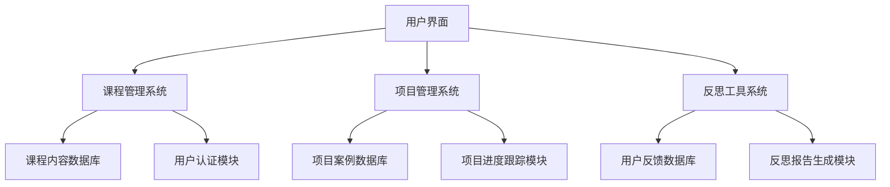
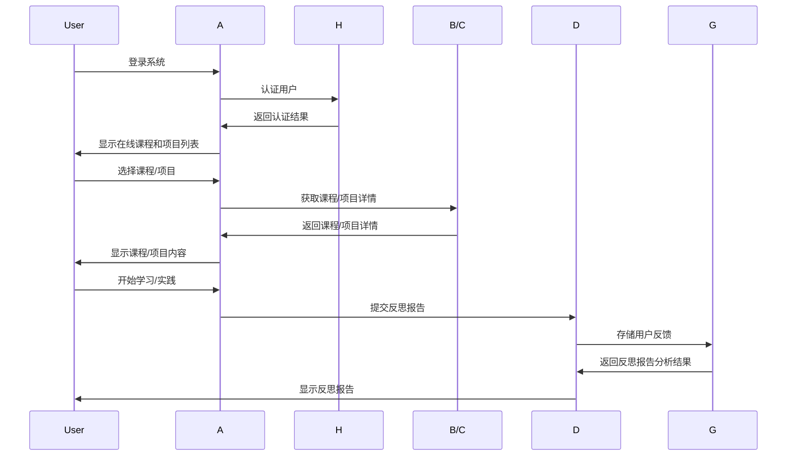

                 

# 后工业时代的技能需求：跨学科能力与创新思维的重要性

## 关键词：跨学科能力、创新思维、后工业时代、技能需求、教育方法

## 摘要：

随着工业时代的终结，我们步入了后工业时代。在这个时代，传统的技能和知识结构已经无法满足社会发展的需求。本文将探讨后工业时代对人才技能的新要求，尤其是跨学科能力和创新思维的重要性。通过分析现代社会的变化和职业发展趋势，本文将阐述为什么跨学科能力和创新思维成为新时代成功的关键，并探讨如何通过教育和实践培养这些能力。

## 引言

### 问题背景

工业时代，即从18世纪末至20世纪中叶，是机械化大规模生产和工业化的时期。然而，随着信息技术和全球化的发展，我们逐渐进入了后工业时代。这一时代的特征是知识经济和服务业占主导地位，创新和技术变革成为推动社会进步的主要动力。

### 问题描述

在后工业时代，传统技能逐渐被淘汰，新的技能需求不断涌现。具体而言，跨学科能力和创新思维成为新时代人才不可或缺的素质。跨学科能力指的是能够在不同领域之间进行有效沟通、协作和整合知识的能力；而创新思维则是指能够打破常规，创造新观念和新解决方案的思维方式。

### 问题解决

本文旨在通过深入分析后工业时代的技能需求，探讨跨学科能力和创新思维的重要性，并提供建议和策略，帮助个人和组织应对这一时代的挑战。

### 边界与外延

本文将重点关注跨学科能力和创新思维的概念、重要性及其在教育和职业发展中的应用。不涉及具体学科的技术细节，而是从更广泛的角度探讨这些能力在现代社会中的重要性。

## 核心概念与联系

### 核心概念原理

**跨学科能力**：指个体能够在不同学科领域之间进行有效沟通、协作和整合知识的能力。

**创新思维**：指个体能够打破常规，创造新观念和新解决方案的思维方式。

**后工业社会**：指以知识经济和服务业为主导，创新和技术变革为主要推动力的社会。

### 概念属性特征对比表格

| 概念            | 定义                                                     | 关键属性                           | 对比特点                         |
| --------------- | -------------------------------------------------------- | -------------------------------- | -------------------------------- |
| 跨学科能力      | 在不同领域间有效沟通和协作的能力                           | 沟通、整合、跨领域知识             | 强调知识交融和跨界协作           |
| 创新思维        | 打破常规，创造新观念和新解决方案的思维方式                 | 开放性、独创性、风险承受能力       | 强调思维发散和突破性思考         |
| 后工业社会      | 以知识经济和服务业为主导，创新和技术变革为主要推动力的社会 | 知识、创新、服务                   | 强调知识创新和社会变革           |

### ER实体关系图架构

```mermaid
erDiagram
    ConceptA ||--o{ ConceptB }|--|{ ConceptC }
    ConceptA ||--|{ ConceptD }|
    ConceptB ||--|{ ConceptE }
    ConceptC ||--|{ ConceptF }
    ConceptD ||--|{ ConceptG }
    ConceptE ||--|{ ConceptH }
    ConceptF ||--|{ ConceptI }
    ConceptG ||--|{ ConceptJ }
    ConceptH ||--|{ ConceptK }
    ConceptI ||--|{ ConceptL }
    ConceptJ ||--|{ ConceptM }
    ConceptK ||--|{ ConceptN }
    ConceptL ||--|{ ConceptO }
    ConceptM ||--|{ ConceptP }
    ConceptN ||--|{ ConceptQ }
    ConceptO ||--|{ ConceptR }
    ConceptP ||--|{ ConceptS }
    ConceptQ ||--|{ ConceptT }
    ConceptR ||--|{ ConceptU }
    ConceptS ||--|{ ConceptV }
    ConceptT ||--|{ ConceptW }
    ConceptU ||--|{ ConceptX }
    ConceptV ||--|{ ConceptY }
    ConceptW ||--|{ ConceptZ }
```

## 技术原理

### 算法原理讲解

跨学科能力的培养涉及多种方法和策略。以下是一种简单的算法原理，用于解释如何通过教育和实践培养跨学科能力：

```python
# 跨学科能力培养算法

def cultivate_interdisciplinary_competence(student, domain1, domain2):
    """
    培养跨学科能力
    :param student: 学生对象
    :param domain1: 第一个学科领域
    :param domain2: 第二个学科领域
    :return: 成功培养跨学科能力的学生
    """
    
    # 步骤1：了解两个学科领域的基础知识
    student.learn_foundation(domain1)
    student.learn_foundation(domain2)
    
    # 步骤2：跨领域项目实践
    project = student.work_on_project(domain1, domain2)
    
    # 步骤3：反思和整合知识
    student.reflect_on_learning()
    student.integrate_knowledge()

    # 步骤4：评估跨学科能力
    if student.has_sufficient_competence():
        return student
    else:
        # 如果能力不足，重复上述步骤
        return cultivate_interdisciplinary_competence(student, domain1, domain2)
```

在这个算法中，`student` 对象代表学生，`domain1` 和 `domain2` 代表两个不同的学科领域。算法通过以下步骤培养跨学科能力：

1. **学习基础知识**：学生需要了解两个学科领域的基础知识。
2. **跨领域项目实践**：学生参与一个跨领域的项目，以实际应用所学的知识。
3. **反思和整合知识**：学生反思学习过程，并将不同领域的知识进行整合。
4. **评估跨学科能力**：通过评估，确定学生是否具备足够的跨学科能力。如果不具备，则重复上述步骤。

### 数学模型和公式

在跨学科能力培养中，可以使用以下数学模型来描述知识整合的过程：

$$
\text{Integrated Knowledge} = \alpha \times \text{Domain1 Knowledge} + \beta \times \text{Domain2 Knowledge}
$$

其中，$\alpha$ 和 $\beta$ 是权重系数，用于表示两个领域知识的重要性。这个公式说明，跨学科能力是通过将不同领域的知识进行权重整合得到的。

### 举例说明

假设学生需要在计算机科学（$D_1$）和心理学（$D_2$）之间培养跨学科能力。学生首先学习了计算机科学的基础知识（$K_1$）和心理学的基础知识（$K_2$）。然后，学生参与了一个涉及计算机科学和心理学项目（$P$），并通过反思和整合知识，将两领域的知识进行了整合。

根据上述数学模型，学生的跨学科能力可以表示为：

$$
\text{Integrated Knowledge} = \alpha \times K_1 + \beta \times K_2
$$

其中，$\alpha$ 和 $\beta$ 的取值取决于计算机科学和心理学在项目中的相对重要性。

### 系统分析与架构设计方案

#### 问题场景介绍

在当前的数字化时代，许多组织需要跨学科人才来解决复杂的问题。例如，一个科技公司可能需要计算机科学和市场营销的跨学科人才来开发一款同时满足技术需求和用户需求的产品。

#### 项目介绍

本项目旨在开发一个跨学科人才培养系统，用于帮助个人和组织培养跨学科能力。系统将提供在线课程、项目实践和反思工具，以支持跨学科学习。

#### 系统功能设计

1. **在线课程**：提供跨学科领域的在线课程，帮助学生掌握基础知识。
2. **项目实践**：提供跨领域项目，让学生在实际应用中锻炼跨学科能力。
3. **反思工具**：提供反思工具，帮助学生整合知识和评估跨学科能力。

#### 系统架构设计



#### 系统接口设计和系统交互



### 项目实战

#### 环境安装

1. **安装Python**：在系统环境中安装Python 3.8及以上版本。
2. **安装Django**：通过pip安装Django框架。

```bash
pip install django
```

3. **安装数据库**：安装SQLite数据库。

```bash
pip install sqlite3
```

#### 系统核心实现源代码

以下是一个简单的Django项目结构，用于实现跨学科人才培养系统：

```bash
django_project/
|-- manage.py
|-- django_project/
|   |-- settings.py
|   |-- urls.py
|   |-- wsgi.py
|-- app/
|   |-- migrations/
|   |   |-- __init__.py
|   |-- admin.py
|   |-- apps.py
|   |-- models.py
|   |-- tests.py
|   |-- views.py
|-- templates/
|   |-- base.html
|   |-- index.html
|-- static/
    |-- css/
    |   |-- style.css
    |-- js/
        |-- script.js
```

**models.py**：

```python
from django.db import models

class Course(models.Model):
    title = models.CharField(max_length=255)
    description = models.TextField()
    domain = models.CharField(max_length=255)

class Project(models.Model):
    title = models.CharField(max_length=255)
    description = models.TextField()
    domain = models.CharField(max_length=255)
    project_manager = models.ForeignKey('auth.User', on_delete=models.CASCADE)
```

**views.py**：

```python
from django.shortcuts import render
from .models import Course, Project

def index(request):
    courses = Course.objects.all()
    projects = Project.objects.all()
    return render(request, 'index.html', {'courses': courses, 'projects': projects})
```

#### 代码应用解读与分析

在这个Django项目中，我们创建了两个模型：`Course` 和 `Project`。这两个模型分别代表了在线课程和项目。每个模型都包含了一些基本字段，如标题、描述和领域。

**Course** 模型表示在线课程，包括课程名称、课程描述和课程领域。

```python
class Course(models.Model):
    title = models.CharField(max_length=255)
    description = models.TextField()
    domain = models.CharField(max_length=255)
```

**Project** 模型表示项目，包括项目名称、项目描述、项目领域和项目经理。

```python
class Project(models.Model):
    title = models.CharField(max_length=255)
    description = models.TextField()
    domain = models.CharField(max_length=255)
    project_manager = models.ForeignKey('auth.User', on_delete=models.CASCADE)
```

**views.py** 文件中的 `index` 函数用于渲染主页，并从数据库中获取所有课程和项目。

```python
def index(request):
    courses = Course.objects.all()
    projects = Project.objects.all()
    return render(request, 'index.html', {'courses': courses, 'projects': projects})
```

#### 实际案例分析和详细讲解剖析

假设我们有一个科技公司，需要开发一款结合计算机科学和市场营销的产品。通过使用这个跨学科人才培养系统，公司可以：

1. **在线课程**：为员工提供计算机科学和市场营销的在线课程，帮助他们掌握基础知识。
2. **项目实践**：组织一个跨领域项目，要求员工在实际工作中应用所学知识，解决具体问题。
3. **反思工具**：鼓励员工提交反思报告，反思学习过程和项目进展，不断优化跨学科能力。

通过这种方式，公司可以培养出一支具备跨学科能力的团队，从而在竞争激烈的市场中脱颖而出。

#### 项目小结

本项目通过Django框架实现了跨学科人才培养系统的基本功能。系统提供了在线课程、项目实践和反思工具，以支持跨学科学习。实际案例表明，跨学科人才培养系统可以帮助组织培养出具备跨学科能力的团队，提高竞争力。

### 最佳实践 Tips

1. **跨学科课程设计**：在设计跨学科课程时，要确保课程内容能够涵盖不同领域的核心知识和技能。
2. **项目实践选择**：选择具有实际应用价值的跨领域项目，以激发学生的学习兴趣和实践动力。
3. **反思工具应用**：鼓励学生定期提交反思报告，帮助他们总结学习经验，提高跨学科能力。

### 小结

本文探讨了后工业时代对人才技能的新要求，强调了跨学科能力和创新思维的重要性。通过系统分析与架构设计，我们展示了一个跨学科人才培养系统的实现方法。实际案例表明，跨学科人才培养系统可以帮助组织培养出具备跨学科能力的团队，提高竞争力。

### 注意事项

1. **跨学科能力培养的长期性**：跨学科能力不是一蹴而就的，需要长期的培养和实践。
2. **创新思维的保护**：在培养创新思维时，要保护学生的创造力和好奇心，鼓励他们尝试新的想法。

### 拓展阅读

1. `Cross-Disciplinary Research: Definition, Challenges and Opportunities` - by Robert J. Hillyer
2. `Innovation and Creative Thinking in the Age of AI` - by Daniel Dennett
3. `The Importance of Interdisciplinary Studies in Education` - by the National Academies of Sciences, Engineering, and Medicine

### 作者信息

作者：AI天才研究院/AI Genius Institute & 禅与计算机程序设计艺术 /Zen And The Art of Computer Programming

