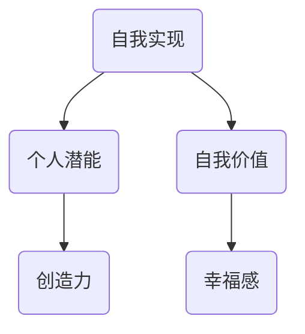

                 

## # 后物质主义社会的精神诉求：超越物质追求的生活意义

关键词：后物质主义、精神诉求、个人成长、人际关系、心理健康、价值观、社会责任

摘要：在物质生活水平日益提升的现代社会，人们开始追求更深层次的精神满足。本文将探讨后物质主义社会的精神诉求，分析其在自我实现、人际关系、心理健康、价值观和社会责任等方面的表现，并探讨如何实现这些精神诉求。通过深入分析，本文旨在为读者提供关于如何超越物质追求，构建有意义的生活的思考。

----------------------------------------------------------------

### 第一部分：导论

#### 1.1 后物质主义社会的概念解析

**问题背景**

在人类社会的发展历程中，物质追求始终是推动社会进步的重要动力。从农业革命到工业革命，再到如今的信息革命，物质生产和技术创新不断推动社会向前发展。然而，随着物质生活水平的提高，人们逐渐发现，单纯的物质追求并不能带来持续的幸福感和满足感。这种情况下，后物质主义思潮应运而生。

**问题描述**

后物质主义（Postmaterialism）是一种社会思潮，它强调在物质需求得到基本满足后，人们开始更加关注精神层面的需求。这种思潮认为，在物质财富达到一定水平后，个人和社会将更加重视价值观、人际关系、心理健康、个人成长和社会责任等方面。

**问题解决**

要解决后物质主义社会面临的精神诉求问题，我们需要从以下几个方面入手：

1. **理解后物质主义社会的特点**：了解后物质主义社会的概念、起源和发展过程，明确其与传统物质主义社会的区别。
2. **探究精神诉求的内涵**：深入分析后物质主义社会中的精神诉求，包括自我实现、人际关系、心理健康、价值观和社会责任等方面的内容。
3. **提出解决方案**：根据对后物质主义社会精神诉求的分析，提出具体的实践策略和方法，帮助人们实现精神层面的满足。

**边界与外延**

后物质主义社会精神诉求的边界主要包括以下几个方面：

1. **物质基础**：后物质主义社会强调在物质需求得到基本满足的前提下，关注精神层面的需求。
2. **社会环境**：后物质主义社会是在现代社会背景下产生的一种思潮，其发展受到社会、文化、经济等多方面因素的影响。
3. **个体差异**：后物质主义社会精神诉求的具体表现因个体差异而异，需要根据不同人群的特点进行分析。

**概念结构与核心要素组成**

后物质主义社会精神诉求的概念结构包括以下几个方面：

1. **自我实现**：追求个人潜能的发挥，实现自我价值。
2. **人际关系**：建立和维护健康的人际关系，获得社会支持。
3. **心理健康**：保持良好的心理状态，应对生活压力。
4. **价值观**：形成和坚守个人的价值观，指导行为和决策。
5. **社会责任**：承担社会责任，关注社会问题，参与社会建设。

#### 1.2 精神诉求的理论基础

**心理需求理论**

心理需求理论是后物质主义社会精神诉求的重要理论基础。马斯洛的需求层次理论认为，人的需求分为五个层次，从生理需求到自我实现需求，后物质主义社会关注的是自我实现需求，即个体追求个人潜能的发挥和实现自我价值。

**社会文化背景**

社会文化背景对后物质主义社会精神诉求的形成和发展具有重要影响。在不同的文化背景下，人们对精神层面的需求有不同的理解和追求。例如，在西方社会，个人主义文化强调个人自由和自我实现，而在东方社会，集体主义文化则更注重人际关系和社会责任。

**道德伦理观念**

道德伦理观念是后物质主义社会精神诉求的重要组成部分。在现代社会，道德伦理观念不断发生变化，从重视物质财富和地位，转向重视人的尊严、公正和责任。这种变化反映了后物质主义社会对精神层面的需求。

#### 1.3 社会变迁中的精神诉求演变

**历史视角下的精神诉求**

从历史角度来看，精神诉求在不同的社会阶段有不同的表现形式。在农业社会，人们追求的是物质生活的稳定和安全；在工业社会，人们追求的是物质财富的积累和地位提升；而在后工业社会，人们开始追求更深层次的精神满足。

**现代社会精神诉求的特点**

在现代社会，精神诉求呈现出以下特点：

1. **多样性**：随着社会的发展，人们的精神需求越来越多样化，包括自我实现、人际关系、心理健康、价值观和社会责任等多个方面。
2. **个性化**：在物质条件得到满足的情况下，人们更加注重个性化需求，追求自我价值和独特体验。
3. **全球性**：全球化使得不同文化背景的人们在精神诉求上产生了交集，形成了共同的精神追求。

#### 1.4 后物质主义社会精神诉求的现状与挑战

**现状分析**

后物质主义社会精神诉求的现状表现为：

1. **精神需求多样化**：人们追求的精神需求越来越多样化，包括个人成长、心理健康、人际关系、社会责任等。
2. **精神需求个性化**：在物质条件得到满足的情况下，人们更加注重个性化需求，追求自我价值和独特体验。
3. **精神需求的矛盾性**：在满足物质需求的过程中，人们也会面临精神需求的矛盾，如追求自我实现与应对生活压力的矛盾。

**面临的挑战**

后物质主义社会精神诉求面临的挑战主要包括：

1. **精神需求的满足难度**：随着社会的发展，人们的精神需求越来越高，但满足这些需求的难度也越来越大。
2. **精神需求的矛盾性**：在追求精神满足的过程中，人们可能会面临各种矛盾，如个人成长与人际关系、心理健康与物质需求等。
3. **精神需求的多样性**：在精神需求的多样性的背景下，如何满足不同人群的需求成为一个挑战。

#### 1.5 本章小结

本章从后物质主义社会的概念解析、理论基础、社会变迁中的精神诉求演变、现状与挑战等方面进行了探讨。通过对后物质主义社会精神诉求的分析，我们了解了其内涵、特点以及面临的挑战。在接下来的章节中，我们将进一步探讨后物质主义社会精神诉求在自我实现、人际关系、心理健康、价值观和社会责任等方面的具体表现和实现方法。

### 第二部分：后物质主义社会的核心精神诉求

#### 2.1 自我实现与个人成长

**自我实现的概念与意义**

自我实现（Self-Actualization）是马斯洛需求层次理论中的最高层次，指的是个体在生理需求、安全需求、社交需求、尊重需求得到满足的基础上，追求个人潜能的发挥和实现自我价值的过程。

**概念属性特征对比表格**

| 特征             | 自我实现           | 物质需求           |
| ---------------- | ------------------ | ------------------ |
| 目标             | 实现个人潜能       | 满足基本生活需求   |
| 动力             | 内在动机           | 外在动机           |
| 影响因素         | 心理需求、个人价值观 | 物质条件           |
| 表现形式         | 创造力、自我提升   | 财富积累、社会地位 |
| 长期效果         | 心理健康、幸福感   | 物质安全、社会地位 |

**ER实体关系图架构的Mermaid流程图**

**个人成长的重要性**

个人成长对于自我实现至关重要。个人成长不仅包括知识和技能的积累，还包括情感、心理和社交能力的发展。以下是个人成长的重要性：

1. **增强自信心**：通过不断学习和实践，个人能够更好地认识自己，增强自信心。
2. **提高适应能力**：个人成长能够帮助个体更好地适应环境变化，提高适应能力。
3. **实现自我价值**：个人成长是实现自我价值的基础，通过不断成长，个体能够实现自我潜能的发挥。

**成长的动力**

个人成长的动力主要包括内在动机和外在动机。内在动机是指个体对成长本身的兴趣和热情，如追求知识、提升技能等。外在动机则包括奖励、竞争和社会压力等。以下是成长的动力：

1. **内在动机**：兴趣、好奇心、自我挑战
2. **外在动机**：奖励、竞争、社会期望

**成长的路径**

个人成长的路径通常包括以下几个阶段：

1. **认知阶段**：通过学习和阅读，获取知识和信息。
2. **实践阶段**：将所学知识应用到实践中，通过实践不断积累经验和技能。
3. **反思阶段**：对成长过程进行反思和总结，找出不足和改进之处。
4. **持续阶段**：在反思的基础上，持续学习和成长，不断追求更高的目标。

**实现自我实现的策略与方法**

1. **自我探索**：通过自我反思和探索，了解自己的兴趣、价值观和优势，找到适合自己的成长方向。
2. **设定目标**：明确自己的长期和短期目标，制定具体的行动计划，不断追求进步。
3. **持续学习**：保持好奇心和学习热情，不断学习新知识和技能。
4. **实践锻炼**：通过实际操作和锻炼，提高自己的能力和技能。
5. **反思总结**：定期对自己的成长过程进行反思和总结，找出不足和改进之处。

**个人成长与精神健康的关系**

1. **精神健康对个人成长的影响**：良好的精神健康状态能够帮助个人更好地应对挑战，提高成长效率。
2. **个人成长对精神健康的影响**：通过不断成长，个人能够提高自我认知，增强心理韧性，从而促进精神健康。

**实例分析：成功实现自我实现的案例**

**案例介绍**：李华，一名年轻的程序员，在技术领域有着出色的天赋和热情。他在大学期间开始接触编程，通过自学和实践，迅速掌握了多种编程语言和开发技能。毕业后，他进入了一家知名的互联网公司，成为一名优秀的软件工程师。

**案例分析**：

1. **自我探索**：李华在大学期间通过参加技术社团和开源项目，发现了自己对编程的浓厚兴趣，并明确了自己的职业发展方向。
2. **设定目标**：李华在职业生涯中设定了多个短期和长期目标，包括学习新的编程语言、参与重要的项目、成为技术专家等。
3. **持续学习**：李华始终保持对新技术的好奇心和学习热情，通过在线课程、阅读技术书籍和参加技术会议等方式，不断提升自己的技能。
4. **实践锻炼**：李华在工作中积极参与项目开发，通过实际操作和锻炼，不断提高自己的编程能力和解决问题的能力。
5. **反思总结**：李华定期对自己的工作过程进行反思和总结，找出不足和改进之处，从而不断提升自己的能力。

通过以上策略和方法，李华成功地实现了自我实现，成为了一名优秀的软件工程师。

#### 2.6 本章小结

本章从自我实现与个人成长的角度，探讨了后物质主义社会中的核心精神诉求。通过分析自我实现的概念与意义、个人成长的重要性、成长的动力与路径、实现自我实现的策略与方法以及个人成长与精神健康的关系，我们了解了如何通过个人成长实现自我价值。在实现自我实现的过程中，个人需要不断探索、设定目标、持续学习和实践锻炼，同时保持良好的精神健康状态。通过实例分析，我们看到了成功实现自我实现的路径和方法。在接下来的章节中，我们将继续探讨后物质主义社会精神诉求的其他方面。

### 第三部分：后物质主义社会的其他精神诉求

#### 3.1 人际关系与社会联系

**人际关系的重要性**

人际关系是社会生活中不可或缺的一部分，对个体的身心健康和社会适应能力具有重要影响。良好的人际关系能够提供情感支持，增强个体的自信心和归属感，有助于缓解压力和焦虑。以下是人际关系的重要性：

1. **情感支持**：良好的人际关系能够为个体提供情感支持，使个体在遇到困难和挫折时感到不再孤单。
2. **心理健康**：积极的人际关系有助于改善个体的心理健康，减少心理问题的发生。
3. **社会适应能力**：良好的人际关系能够帮助个体更好地适应社会环境，提高社会适应能力。

**社会支持网络**

社会支持网络是指个体在社会生活中所拥有的各种社会关系和资源。一个健全的社会支持网络能够为个体提供情感支持、信息资源和社会资源，有助于个体应对生活中的各种挑战。以下是社会支持网络的重要性：

1. **情感支持**：社会支持网络能够为个体提供情感支持，帮助个体缓解心理压力。
2. **信息资源**：社会支持网络能够为个体提供各种信息资源，帮助个体更好地应对生活中的问题。
3. **社会资源**：社会支持网络能够为个体提供各种社会资源，帮助个体更好地实现个人目标。

**人际互动的意义**

人际互动是建立和维护人际关系的重要途径，有助于个体之间建立信任、共享信息和资源，促进社会关系的和谐发展。以下是人际互动的意义：

1. **信任建立**：通过人际互动，个体能够建立彼此之间的信任，促进合作和共赢。
2. **信息共享**：人际互动能够促进信息的传递和共享，使个体更好地了解外部环境。
3. **资源整合**：人际互动有助于个体整合社会资源，实现个人目标和利益最大化。

**建立和维护健康的人际关系**

建立和维护健康的人际关系需要以下几个方面的努力：

1. **积极沟通**：通过积极沟通，个体能够更好地表达自己的想法和需求，增进相互理解。
2. **尊重差异**：尊重他人的差异，理解和接纳他人的观点，有助于建立和谐的人际关系。
3. **提供支持**：在他人需要帮助时，积极提供支持，展现关心和关爱。
4. **解决冲突**：在人际互动中，冲突在所难免，通过合理的方法解决冲突，有助于维护人际关系。

**有效沟通技巧**

有效沟通是建立和维护健康人际关系的关键。以下是一些有效沟通的技巧：

1. **倾听**：倾听他人的意见和需求，表达尊重和理解。
2. **表达清晰**：清晰表达自己的想法和需求，避免产生误解。
3. **非语言沟通**：注意使用非语言沟通，如眼神、肢体语言等，增强沟通效果。
4. **同理心**：站在对方的角度考虑问题，展现同理心。

**处理冲突的方法**

在人际互动中，冲突在所难免。以下是一些处理冲突的方法：

1. **冷静处理**：在冲突发生时，保持冷静，避免情绪化的行为。
2. **沟通表达**：通过沟通表达自己的观点和需求，寻求共识。
3. **寻求妥协**：在冲突中，寻求双方都能接受的解决方案，实现妥协。
4. **寻求第三方调解**：在无法自行解决冲突时，可以寻求第三方的帮助，如心理咨询师、调解员等。

**社会联系的拓展**

拓展社会联系是建立和维护健康人际关系的重要途径。以下是一些拓展社会联系的方法：

1. **参加社交活动**：通过参加各种社交活动，结识新朋友，拓展人际关系。
2. **志愿服务**：参与志愿服务活动，帮助他人，同时结识志同道合的朋友。
3. **在线社交平台**：利用在线社交平台，如社交媒体、论坛等，拓展社交圈子。
4. **建立互助小组**：组建互助小组，共同解决问题，增强彼此之间的联系。

**人际关系与社会发展的关系**

1. **社会网络的构建**：人际关系是社会网络的基础，良好的社会网络有助于个体更好地融入社会，实现个人目标。
2. **社会资本的形成**：人际关系是社会资本的重要来源，社会资本有助于个体在社会中获得更多的资源和机会。

**实例分析：成功的人际关系构建案例**

**案例介绍**：王丽，一名年轻的企业家，在创业初期面临诸多挑战。为了拓展业务和资源，她积极参加各种商业活动，结识了许多业内精英。通过有效的沟通和合作，她与这些精英建立了深厚的友谊，为企业的快速发展提供了有力支持。

**案例分析**：

1. **参加社交活动**：王丽积极参加各种商业活动，如展会、论坛等，结识了许多业内同行。
2. **积极沟通**：在与他人交流时，王丽注重倾听对方的意见和需求，表达自己的观点，增进相互理解。
3. **提供支持**：在他人需要帮助时，王丽积极提供支持，展现关心和关爱。
4. **解决冲突**：在合作过程中，王丽能够冷静处理冲突，通过沟通表达和寻求共识，解决问题。

通过以上方法，王丽成功构建了广泛的人际关系网络，为企业的发展提供了有力支持。

#### 3.6 本章小结

本章从人际关系与社会联系的角度，探讨了后物质主义社会中的核心精神诉求。通过分析人际关系的重要性、社会支持网络、人际互动的意义、建立和维护健康的人际关系、有效沟通技巧、处理冲突的方法、社会联系的拓展以及人际关系与社会发展的关系，我们了解了如何通过人际关系实现精神诉求。在建立和维护健康人际关系的过程中，个体需要注重有效沟通、尊重差异、提供支持、解决冲突以及拓展社会联系。通过实例分析，我们看到了成功的人际关系构建路径和方法。在接下来的章节中，我们将继续探讨后物质主义社会精神诉求的其他方面。

### 第四部分：心理健康与精神平衡

#### 4.1 心理健康的定义与重要性

**心理健康的定义**

心理健康是指个体在心理、情感、行为和社会适应等方面保持良好状态，能够积极应对生活中的压力和挑战，实现个人潜能和幸福感。

**心理健康的标准**

心理健康的标准包括以下几个方面：

1. **情绪稳定**：能够合理表达和管理自己的情绪，保持积极乐观的心态。
2. **自我认识**：能够正确认识和评价自己，有清晰的自我定位和自我目标。
3. **人际关系**：能够建立和维护良好的人际关系，获得他人的尊重和认可。
4. **社会适应**：能够适应社会环境，积极应对生活中的各种挑战和变化。
5. **心理韧性**：能够在逆境中保持乐观，积极面对困难，迅速恢复和适应。

**心理健康的的重要性**

心理健康对个体的生活质量和幸福感具有重要影响。以下是心理健康的重要性：

1. **生活质量**：心理健康能够提高个体的生活质量，使个体在日常生活中感到更加快乐和满足。
2. **幸福感**：心理健康是幸福感的基础，心理健康良好的人更容易体验到幸福。
3. **社会适应能力**：心理健康有助于个体更好地适应社会环境，提高社会适应能力。
4. **个人发展**：心理健康能够促进个体的个人发展，使个体能够更好地实现自我价值。

**常见心理问题的识别与应对**

**压力管理**

压力是生活中不可避免的一部分，但过度的压力会对心理健康产生负面影响。以下是一些压力管理的技巧：

1. **时间管理**：合理安排时间，避免过度工作和拖延，确保有足够的时间休息和放松。
2. **情绪调节**：通过情绪调节技巧，如深呼吸、冥想和放松训练，缓解压力。
3. **积极应对**：面对压力，采取积极的态度和应对策略，如寻求帮助、调整期望和改变思维方式。

**抑郁和焦虑的应对**

抑郁和焦虑是常见的心理问题，以下是一些应对方法：

1. **认知行为疗法**：通过认知行为疗法，改变负面思维和行为模式，缓解抑郁和焦虑。
2. **心理疏导**：寻求专业心理咨询师的帮助，进行心理疏导和情绪调节。
3. **健康生活方式**：保持健康的生活方式，如规律作息、均衡饮食和适量运动，有助于改善心理状态。

**精神平衡的实践方法**

**冥想与放松技巧**

冥想和放松技巧是缓解心理压力、提高精神平衡的有效方法。以下是一些冥想与放松技巧：

1. **深呼吸**：通过深呼吸，放松身心，缓解紧张情绪。
2. **正念冥想**：专注于当前的感受和体验，培养对生活的觉知和接纳。
3. **渐进性肌肉放松**：通过逐步放松身体的各个肌肉群，缓解紧张和压力。

**心理调适策略**

心理调适策略是帮助个体应对心理压力、提高心理健康的重要方法。以下是一些心理调适策略：

1. **目标设定**：设定合理的目标，分阶段实现，避免过度压力。
2. **情绪管理**：学会情绪管理技巧，如情绪调节、情绪释放和情绪表达。
3. **积极心态**：培养积极的心态，面对困难和挑战时保持乐观和自信。

**心理健康与精神平衡的关系**

心理健康与精神平衡密切相关。良好的心理健康有助于个体实现精神平衡，使个体能够更好地应对生活中的各种挑战。以下是心理健康与精神平衡的关系：

1. **相互促进**：心理健康有助于个体实现精神平衡，精神平衡有助于提高心理健康水平。
2. **整体发展**：心理健康和精神平衡共同促进个体的整体发展，使个体能够更好地实现个人潜能和幸福感。

**实例分析：维护心理健康的实践案例**

**案例介绍**：张先生，一名忙碌的职场人士，工作压力较大，经常感到焦虑和疲惫。为了维护心理健康，他开始学习冥想和放松技巧，并调整了生活方式。

**案例分析**：

1. **学习冥想与放松技巧**：张先生每天早上和晚上进行冥想，通过深呼吸和渐进性肌肉放松，缓解压力和焦虑。
2. **调整生活方式**：张先生开始规律作息，保证充足的睡眠，并增加户外运动，改善身体状况。
3. **心理调适**：张先生通过阅读心理学书籍，学习情绪管理技巧，调整自己的思维方式，提高心理韧性。

通过以上实践，张先生逐渐恢复了心理健康，实现了精神平衡，生活和工作都变得更加愉快和充实。

#### 4.6 本章小结

本章从心理健康与精神平衡的角度，探讨了后物质主义社会中的核心精神诉求。通过分析心理健康的定义与标准、常见心理问题的识别与应对、精神平衡的实践方法以及心理健康与精神平衡的关系，我们了解了如何通过维护心理健康实现精神平衡。在日常生活中，个体可以通过学习冥想与放松技巧、调整生活方式、心理调适等方法，提高心理健康水平，实现精神平衡。通过实例分析，我们看到了成功维护心理健康的实践路径和方法。在接下来的章节中，我们将继续探讨后物质主义社会精神诉求的其他方面。

### 第五部分：价值观与人生意义

#### 5.1 价值观的构成与演变

**价值观的构成**

价值观是指个体对事物的评价和判断标准，包括道德观、人生观和世界观等。价值观的构成通常包括以下几个方面：

1. **道德观**：对道德规范的认知和遵循，如诚实、守信、尊重等。
2. **人生观**：对人生意义和价值的认知，如追求幸福、实现自我价值、承担责任等。
3. **世界观**：对世界本质和规律的认知，如人类命运共同体、可持续发展等。

**价值观的演变**

价值观是随着社会历史的发展而不断演变的。在不同的历史时期，人们的价值观有不同的特点。以下是价值观的演变过程：

1. **农业社会**：在农业社会，人们的价值观主要围绕土地、家庭和传统展开，强调稳定、勤劳和忠诚。
2. **工业社会**：在工业社会，人们的价值观逐渐转向物质财富和竞争，强调效率、创新和成功。
3. **后工业社会**：在后工业社会，人们的价值观更加注重精神层面的需求，强调自我实现、社会公正和可持续发展。

**个人价值观**

个人价值观是指个体根据自己的经历、教育、文化背景等因素形成的对事物的评价和判断标准。个人价值观对个体的行为和决策具有重要影响。以下是个人价值观的重要性：

1. **行为指导**：个人价值观指导个体的行为和决策，使个体能够遵循自己的信念和原则。
2. **心理支持**：个人价值观能够为个体提供心理支持，帮助个体在面对困难和挑战时保持坚定和自信。
3. **社会适应**：个人价值观有助于个体更好地适应社会环境，实现个人目标和社会责任。

**社会价值观**

社会价值观是指社会普遍认可的对事物的评价和判断标准。社会价值观对社会成员的行为和决策具有规范和引导作用。以下是社会价值观的重要性：

1. **社会稳定**：社会价值观有助于维护社会秩序和稳定，减少社会冲突和矛盾。
2. **社会和谐**：社会价值观有助于促进社会和谐，增强社会成员之间的凝聚力和认同感。
3. **社会发展**：社会价值观对社会的发展方向和目标具有重要影响，有助于推动社会进步和繁荣。

**价值观的冲突与整合**

在现代社会，个人价值观与社会价值观之间可能会存在冲突。以下是价值观冲突的几种情况：

1. **个人利益与社会利益**：在追求个人利益的同时，可能会损害社会利益，导致价值观冲突。
2. **传统价值观与现代社会价值观**：传统价值观与现代社会价值观之间的差异，可能导致价值观冲突。
3. **多元价值观**：在多元文化背景下，不同价值观之间的碰撞和融合，可能导致价值观冲突。

为了解决价值观冲突，需要通过以下途径实现价值观的整合：

1. **沟通与理解**：通过沟通和交流，增进不同价值观之间的理解和尊重，减少冲突。
2. **协商与妥协**：在价值观冲突中，通过协商和妥协，寻求双方都能接受的解决方案。
3. **文化融合**：在多元文化背景下，通过文化融合，形成兼容并包的价值观体系。

**价值观与人生意义的探索与实现**

**生命的意义**

生命的意义是哲学和心理学研究的重要主题。以下是对生命意义的几种理解：

1. **存在主义**：存在主义认为生命的意义在于个体的自由选择和自我实现。
2. **宗教观念**：宗教观念认为生命的意义在于信仰、救赎和来世。
3. **实用主义**：实用主义认为生命的意义在于实现个人目标和社会价值。

**实现人生意义的方法**

实现人生意义的方法因人而异，但以下几种方法通常被广泛认可：

1. **自我探索**：通过自我反思和探索，了解自己的兴趣、价值观和优势，找到适合自己的生活方向。
2. **有意义的工作**：通过从事有意义的工作，实现个人价值和为社会做出贡献。
3. **人际关系**：建立和维护良好的人际关系，获得情感支持和归属感。
4. **持续学习**：通过持续学习和成长，不断提高自己的能力和素质。

**价值观与个人幸福的关系**

**价值观对幸福感的影响**

价值观对幸福感具有重要影响。以下是价值观对幸福感的影响：

1. **内在价值观**：重视内在价值观的人，如健康、家庭、人际关系等，通常具有更高的幸福感。
2. **外在价值观**：重视外在价值观的人，如财富、地位、权力等，可能会因追求物质目标而忽视内心的需求，导致幸福感下降。

**幸福感的价值观基础**

幸福感的价值观基础包括以下几个方面：

1. **个人价值观**：个人价值观对幸福感具有重要影响，符合个人价值观的生活方式通常能带来更高的幸福感。
2. **社会价值观**：社会价值观对幸福感也具有重要影响，一个和谐、公正、包容的社会环境能够提升人们的幸福感。
3. **文化价值观**：文化价值观对幸福感的影响因文化背景而异，不同的文化背景下，人们对幸福感的理解和追求方式不同。

**人生意义的实现与个人成长**

**成长与意义的相互促进**

成长与意义相互促进，实现人生意义的过程中，个人需要不断成长。以下是成长与意义的相互促进：

1. **成长促进意义**：通过不断成长，个体能够更好地理解生命意义，实现自我价值。
2. **意义促进成长**：明确的人生意义能够激发个体的成长动力，推动个体不断追求进步。

**实现人生意义的挑战**

实现人生意义过程中，个体可能会面临以下挑战：

1. **价值观冲突**：个体可能会面临个人价值观与社会价值观的冲突，需要通过整合价值观，实现个人目标和社会责任。
2. **生活压力**：在追求人生意义的过程中，个体可能会面临各种生活压力，需要通过有效应对，保持心理健康。
3. **人生不确定性**：人生充满不确定性，个体需要适应变化，勇敢面对挑战，实现人生意义。

**实例分析：实现人生意义的个案研究**

**案例介绍**：李明是一名企业家，他凭借自己的努力和智慧，创建了一家成功的公司。在追求事业成功的同时，他注重家庭、社区和社会责任的承担，实现了人生意义。

**案例分析**：

1. **自我探索**：李明在创业初期，通过自我反思和探索，明确了自己的价值观和人生目标，将事业发展与家庭、社区和社会责任紧密结合。
2. **有意义的工作**：李明在公司经营过程中，注重创新、质量和社会责任，通过提供优质产品和服务，实现了个人价值和社会贡献。
3. **人际关系**：李明注重家庭和人际关系，与家人和朋友保持密切联系，获得情感支持和归属感。
4. **持续学习**：李明通过不断学习和成长，提高了自己的能力和素质，适应社会变化，实现人生意义。

通过以上努力，李明成功地实现了人生意义，成为了一个有价值、有影响力的人。

#### 5.6 本章小结

本章从价值观与人生意义的角度，探讨了后物质主义社会中的核心精神诉求。通过分析价值观的构成与演变、个人价值观与社会价值观的关系、价值观的冲突与整合、生命的意义、实现人生意义的方法、价值观与个人幸福的关系、人生意义的实现与个人成长的关系，我们了解了如何通过价值观实现人生意义。在实现人生意义的过程中，个体需要明确自己的价值观，整合个人价值观与社会价值观，勇敢面对挑战，不断成长。通过实例分析，我们看到了成功实现人生意义的路径和方法。在接下来的章节中，我们将继续探讨后物质主义社会精神诉求的其他方面。

### 第六部分：精神生活与创造性

#### 6.1 精神生活的丰富与多元化

**精神生活的定义**

精神生活是指个体在物质生活之外，通过文化活动、心理体验、艺术创作等方式，追求精神层面的满足和成长的生活状态。精神生活不仅仅包括艺术欣赏、阅读、思考等活动，还包括对生命意义、价值观念的探索和思考。

**精神生活的多元化**

在现代社会，精神生活呈现出多元化的趋势。以下是一些常见的多元化表现形式：

1. **文化活动**：参与各种文化活动，如音乐会、戏剧表演、艺术展览等，丰富精神世界。
2. **艺术创作**：通过绘画、音乐、文学等艺术形式，表达内心的感受和情感。
3. **心理体验**：通过冥想、瑜伽、心理咨询等方式，提升心理健康水平。
4. **哲学思考**：探讨人生意义、道德伦理等问题，提升自我认知。
5. **社交互动**：参与社交活动，与他人交流思想，拓宽视野。

**精神生活的重要性**

精神生活的重要性体现在以下几个方面：

1. **心理健康**：丰富多元的精神生活有助于缓解心理压力，提高心理健康水平。
2. **个人成长**：通过精神生活，个体能够不断探索自我，实现个人成长。
3. **幸福感**：精神生活能够为个体带来满足感和幸福感，提高生活质量。
4. **社会融入**：通过参与社会文化活动，个体能够更好地融入社会，建立社会联系。

**创造性思维的激发**

创造性思维是指个体在面对问题时，能够提出新颖、独特的解决方案的思维能力。以下是一些激发创造性思维的方法：

1. **跨界思维**：通过将不同领域的知识、方法和观点进行整合，激发创造性思维。
2. **思维导图**：使用思维导图工具，将问题分解成多个子问题，探索各种可能性。
3. **头脑风暴**：通过集体头脑风暴，激发团队的创新思维。
4. **心理放松**：通过冥想、瑜伽等放松技巧，减轻心理压力，激发创造性思维。

**精神生活与创造性的关系**

精神生活与创造性密切相关。以下是一些关系：

1. **精神生活丰富**：丰富多元的精神生活能够激发创造性思维，提高创新能力。
2. **创造性思维**：创造性思维能够为精神生活提供新的内容和形式，丰富精神世界。
3. **相互促进**：精神生活与创造性思维相互促进，共同推动个体的成长和进步。

**精神生活的实践案例**

**案例介绍**：张华是一名企业家，同时也是一个热爱艺术的人。他经常参加艺术展览和音乐会，还自己创作音乐和绘画。他的精神生活丰富多彩，不仅提高了他的心理健康水平，也激发了他的创造性思维。

**案例分析**：

1. **文化活动参与**：张华积极参与各种文化活动，通过欣赏艺术作品，拓展了自己的视野，丰富了精神生活。
2. **艺术创作**：张华通过创作音乐和绘画，表达自己的情感和思想，实现了自我价值。
3. **心理放松**：在高压的工作环境中，张华通过冥想和瑜伽等放松技巧，缓解了心理压力，保持了良好的心理状态。
4. **创造性思维**：张华在商业决策中，经常运用创造性思维，提出新颖的解决方案，推动了企业的发展。

通过以上实践，张华不仅实现了个人成长，也为企业带来了创新和发展。

#### 6.6 本章小结

本章从精神生活与创造性的角度，探讨了后物质主义社会中的核心精神诉求。通过分析精神生活的定义与多元化、创造性思维的激发、精神生活与创造性的关系以及实践案例，我们了解了如何通过丰富多元的精神生活和创造性思维，实现个人成长和社会进步。丰富多元的精神生活能够激发创造性思维，提高创新能力，促进个人的全面发展。在接下来的章节中，我们将继续探讨后物质主义社会精神诉求的其他方面。

### 第七部分：社会责任与伦理道德

#### 7.1 社会责任的概念与内涵

**社会责任的概念**

社会责任是指企业、组织或个人在社会环境中，根据社会期待和自身能力，对社会的经济、环境和社会发展等方面承担的责任和义务。社会责任不仅仅是企业或组织的法定义务，更是其道德和伦理要求。

**社会责任的内涵**

社会责任的内涵可以从以下几个方面进行理解：

1. **经济责任**：企业或组织在创造经济价值的同时，要关注经济效益和社会效益的平衡，为经济发展和社会进步做出贡献。
2. **环境责任**：企业或组织要关注环境保护，减少污染和资源浪费，实现可持续发展。
3. **社会责任**：企业或组织要关注社会问题，如教育、医疗、扶贫等，为社会提供帮助和支持。
4. **伦理责任**：企业或组织要遵循道德伦理原则，确保自身行为符合社会道德规范。

**社会责任与道德伦理的关系**

社会责任与道德伦理密切相关。道德伦理是社会规范的重要组成部分，指导企业或组织在经营活动中遵守道德准则，为社会创造价值。社会责任则是道德伦理在具体实践中的体现，是企业或组织道德伦理观念的具体行动。

**社会责任的实践意义**

社会责任的实践意义体现在以下几个方面：

1. **提升企业形象**：积极承担社会责任，有助于提升企业社会形象，增强品牌价值。
2. **促进社会和谐**：企业或组织通过承担社会责任，有助于缓解社会矛盾，促进社会和谐发展。
3. **实现可持续发展**：通过承担环境责任，实现可持续发展，为企业持续发展提供保障。
4. **提高员工满意度**：企业承担社会责任，有助于提高员工的工作满意度，增强员工的归属感和忠诚度。

#### 7.2 伦理道德的框架与实践

**伦理道德的框架**

伦理道德的框架包括以下几个方面：

1. **道德原则**：道德原则是伦理道德的基本规范，如公平、正义、诚信、尊重等。
2. **道德规范**：道德规范是具体行为规范，如不欺骗、不侵犯他人权益、遵守法律法规等。
3. **道德决策**：道德决策是指在面对道德问题时，如何做出正确的道德选择。

**伦理决策**

伦理决策是指在企业或组织的经营活动中，如何平衡利益相关方的利益，做出符合道德伦理原则的决策。以下是一些伦理决策的实践方法：

1. **利益相关方分析**：在做出决策时，要考虑所有利益相关方的利益，确保决策公平合理。
2. **道德评估**：对决策进行道德评估，判断其是否符合道德伦理原则。
3. **道德沟通**：与利益相关方进行有效沟通，解释决策的理由和依据，争取理解和支持。

**伦理实践**

伦理实践是指企业或组织在经营活动中，如何具体落实道德伦理原则和规范。以下是一些伦理实践的实例：

1. **诚信经营**：遵守商业道德，诚信经营，树立良好的企业形象。
2. **环境保护**：关注环境保护，采取环保措施，减少环境污染。
3. **员工关爱**：关注员工福利，提供良好的工作环境，提升员工满意度。
4. **公益慈善**：积极参与社会公益事业，为社会做出贡献。

#### 7.3 社会责任与个人道德的关系

**社会责任与个人道德的互动**

社会责任与个人道德之间存在密切的互动关系。以下是社会责任与个人道德的互动：

1. **相互促进**：个人道德的提升有助于增强社会责任感，而积极承担社会责任又能够促进个人道德的完善。
2. **相互制约**：个人道德对社会责任具有制约作用，个人道德水平的高低直接影响社会责任的履行。

**个人道德对社会责任的影响**

个人道德对社会责任的影响主要表现在以下几个方面：

1. **决策行为**：个人道德水平影响企业在经营活动中做出的决策，道德水平高的个体倾向于做出符合道德伦理的决策。
2. **执行力度**：个人道德水平影响企业社会责任的执行力度，道德水平高的个体更愿意主动履行社会责任。
3. **企业形象**：个人道德水平影响企业的社会形象，道德水平高的个体能够树立良好的企业形象。

**社会责任对个人道德的影响**

社会责任对个人道德的影响主要表现在以下几个方面：

1. **道德认知**：承担社会责任有助于提高个人的道德认知水平，使个体更加关注社会问题，增强道德意识。
2. **道德行为**：承担社会责任能够激励个人在日常生活中践行道德行为，提升个人道德素养。
3. **道德情感**：承担社会责任能够激发个人的道德情感，使个体更加热爱社会、关心他人。

**实现社会责任与伦理道德的实践方法**

**慈善事业**

慈善事业是实现社会责任和伦理道德的重要途径。以下是一些慈善事业的实践方法：

1. **公益项目**：企业或组织可以发起公益项目，如扶贫、教育、环保等，为社会做出贡献。
2. **捐赠支持**：企业或组织可以通过捐赠资金、物资或技术，支持社会公益事业。
3. **志愿服务**：员工可以积极参与志愿服务，为社会提供服务，践行社会责任。

**社区服务**

社区服务是实现社会责任和伦理道德的重要方式。以下是一些社区服务的实践方法：

1. **社区活动**：企业或组织可以组织社区活动，如社区清洁、社区讲座等，增进社区成员之间的联系。
2. **社区支持**：企业或组织可以为社区提供支持，如提供就业机会、改善社区环境等。
3. **社区参与**：企业或组织可以积极参与社区治理，为社区发展贡献力量。

**环境保护**

环境保护是实现社会责任和伦理道德的重要任务。以下是一些环境保护的实践方法：

1. **环保措施**：企业或组织可以采取环保措施，如减少污染、节约资源等，实现可持续发展。
2. **绿色生产**：企业或组织可以推行绿色生产，减少对环境的负面影响。
3. **环保宣传**：企业或组织可以开展环保宣传，提高公众的环保意识。

**社会责任与个人成长的关系**

**社会责任对个人成长的作用**

社会责任对个人成长具有重要作用。以下是一些作用：

1. **道德素养**：承担社会责任有助于提高个人的道德素养，培养良好的道德品质。
2. **自我认知**：通过承担社会责任，个人能够更好地认识自己，明确自己的社会责任和使命。
3. **社会适应**：承担社会责任有助于提高个人的社会适应能力，增强社会参与感和责任感。

**个人成长对社会责任的贡献**

个人成长对社会责任的贡献主要表现在以下几个方面：

1. **创新能力**：个人成长能够提高创新能力，为企业和社会带来新的发展机遇。
2. **领导力**：个人成长能够培养领导力，使个体能够更好地领导团队，实现共同目标。
3. **影响力**：个人成长能够提升个人的影响力，使个体能够在社会中发挥更大的作用。

**实例分析：社会责任与伦理道德的实践案例**

**案例介绍**：华为公司是一家全球知名的信息与通信技术解决方案提供商。在企业发展过程中，华为积极承担社会责任，关注环境保护、教育支持和社会治理等方面。

**案例分析**：

1. **环境保护**：华为通过研发绿色技术，减少能源消耗和碳排放，致力于实现可持续发展。
2. **教育支持**：华为通过设立奖学金、捐建学校等方式，支持教育事业，帮助贫困地区孩子接受教育。
3. **社区服务**：华为积极参与社区活动，支持社区发展，提升社区居民的生活质量。

通过以上实践，华为不仅实现了社会责任，也为个人和社会的发展做出了贡献。

#### 7.7 本章小结

本章从社会责任与伦理道德的角度，探讨了后物质主义社会中的核心精神诉求。通过分析社会责任的概念与内涵、伦理道德的框架与实践、社会责任与个人道德的关系、实现社会责任与伦理道德的实践方法以及社会责任与个人成长的关系，我们了解了如何通过承担社会责任和遵循伦理道德，实现个人和社会的发展。在实现社会责任和伦理道德的过程中，企业、组织和个人需要共同努力，相互支持，共同推动社会的进步。通过实例分析，我们看到了成功实现社会责任和伦理道德的路径和方法。在接下来的章节中，我们将继续探讨后物质主义社会精神诉求的其他方面。

### 第八部分：未来社会精神诉求的趋势与展望

#### 8.1 后物质主义社会的发展趋势

**后物质主义社会的概念**

后物质主义社会是指随着物质财富的积累和物质需求的满足，社会成员开始更加注重精神层面的需求，追求自我实现、心理健康、人际关系、价值观和社会责任等方面的满足。这种社会形态强调精神生活的丰富和多样性，超越单纯的物质追求。

**后物质主义社会的发展阶段**

后物质主义社会的发展可以分为以下几个阶段：

1. **初级阶段**：物质需求尚未完全满足，人们开始关注精神需求的满足，如心理健康和人际关系。
2. **中级阶段**：物质需求得到基本满足，精神需求的多样性逐渐显现，人们追求自我实现和价值观的认同。
3. **高级阶段**：物质需求得到充分满足，精神需求高度多元化，人们更加关注社会公正、环境保护和可持续发展。

**后物质主义社会的特征**

后物质主义社会的特征包括：

1. **精神需求的多样化**：人们追求的精神需求越来越多样化，包括心理健康、个人成长、社会联系、创造性表达等。
2. **个性化追求**：随着社会的发展，人们更加注重个性化追求，追求自我实现和独特的生活体验。
3. **社会公正和可持续性**：后物质主义社会强调社会公正和可持续发展，关注社会问题和环境保护。

**未来社会精神诉求的预测**

根据对后物质主义社会的理解，未来社会精神诉求可能会呈现以下趋势：

1. **心理健康的重要性**：随着生活压力的增大，心理健康将成为人们更加关注的问题，心理健康服务将更加普及。
2. **人际关系的社会性**：在全球化背景下，人际关系将更加注重社会性，人们将更加重视社会支持和社区联系。
3. **价值观的多元化**：随着文化的碰撞和融合，价值观将呈现多元化趋势，人们将在尊重差异的基础上，形成共同的价值观念。
4. **社会责任的承担**：随着社会的进步，人们将更加关注社会责任的承担，积极参与社会公益事业，推动社会和谐发展。

**未来社会精神诉求的挑战**

在未来的社会中，精神诉求的满足将面临以下挑战：

1. **物质与精神的平衡**：如何在满足物质需求的同时，关注精神需求的满足，实现物质与精神的平衡。
2. **个性化与共性的冲突**：在追求个性化的同时，如何保持社会的共性和整体性，实现个性化与共性的和谐统一。
3. **社会压力与心理健康**：如何在应对社会压力的同时，保持心理健康，实现心理健康与精神需求的平衡。
4. **可持续发展与环境保护**：如何在实现社会发展的同时，保护环境，实现可持续发展。

**未来社会精神诉求的展望**

未来社会精神诉求的展望包括：

1. **全面发展的人**：人们将在追求物质财富的同时，更加注重精神层面的全面发展，实现身心健康、人格独立和社会参与。
2. **和谐的社会**：社会将更加注重和谐发展，关注社会公正和可持续发展，实现个人与社会的和谐统一。
3. **多元化的文化**：文化将呈现多元化趋势，不同文化之间的碰撞和融合将推动社会的发展和进步。
4. **科技创新的推动**：科技创新将推动社会的发展，为人们提供更加丰富和多样化的精神需求满足方式。

#### 8.2 后物质主义社会的精神诉求与未来社会发展

**后物质主义社会精神诉求对未来的影响**

后物质主义社会精神诉求将对未来社会产生深远影响，主要表现在以下几个方面：

1. **推动社会进步**：后物质主义社会精神诉求强调个人成长、心理健康、人际关系、社会责任等方面的满足，有助于推动社会进步和发展。
2. **促进社会和谐**：后物质主义社会精神诉求强调社会公正、可持续发展，有助于促进社会和谐，减少社会矛盾和冲突。
3. **提升个体幸福感**：后物质主义社会精神诉求关注个体的精神需求，有助于提升个体的幸福感和生活质量。

**未来社会发展对精神诉求的回应**

未来社会发展将积极回应后物质主义社会的精神诉求，主要表现在以下几个方面：

1. **政策支持**：政府将制定相关政策，支持心理健康、教育、文化等精神需求的满足，推动社会精神诉求的实现。
2. **社会服务**：社会将提供多样化的服务，如心理咨询、教育支持、文化活动等，满足个体的精神需求。
3. **科技创新**：科技创新将推动精神需求的满足方式多样化，如虚拟现实、人工智能等技术的应用，为人们提供更加丰富和个性化的精神体验。

**未来社会精神诉求的实现途径**

为了实现未来社会精神诉求，需要采取以下途径：

1. **提高教育水平**：通过提高教育水平，培养个体的综合素质，满足后物质主义社会的精神诉求。
2. **推动文化建设**：通过推动文化建设，丰富社会文化内涵，满足人们多样化的精神需求。
3. **加强心理健康服务**：通过加强心理健康服务，提高个体的心理健康水平，满足后物质主义社会的精神诉求。
4. **促进社会参与**：通过促进社会参与，增强个体的社会责任感和归属感，满足后物质主义社会的精神诉求。

#### 8.3 后物质主义社会的精神诉求与个体发展

**后物质主义社会精神诉求对个体发展的影响**

后物质主义社会精神诉求对个体发展具有重要影响，主要表现在以下几个方面：

1. **促进个人成长**：后物质主义社会精神诉求关注个人成长，激发个体潜能，促进个体全面发展。
2. **提升心理健康**：后物质主义社会精神诉求关注心理健康，帮助个体应对生活压力，保持良好的心理状态。
3. **丰富人际关系**：后物质主义社会精神诉求强调人际关系，增强个体的社会支持网络，提高个体的社会适应能力。
4. **实现人生意义**：后物质主义社会精神诉求关注人生意义的实现，帮助个体找到生命的价值和意义，提升个体的幸福感。

**个体发展对后物质主义社会精神诉求的贡献**

个体发展对后物质主义社会精神诉求的贡献主要表现在以下几个方面：

1. **创新精神**：个体发展能够激发创新精神，推动社会进步，满足后物质主义社会的精神诉求。
2. **社会责任感**：个体发展能够培养社会责任感，增强个体的社会参与度，推动社会和谐发展。
3. **文化多样性**：个体发展能够促进文化多样性，丰富社会文化内涵，满足后物质主义社会的精神诉求。

#### 8.4 后物质主义社会的精神诉求与可持续发展

**后物质主义社会精神诉求与可持续发展的关系**

后物质主义社会精神诉求与可持续发展密切相关，主要表现在以下几个方面：

1. **精神需求的满足**：后物质主义社会精神诉求强调个人成长、心理健康、人际关系、社会责任等方面的满足，有助于实现可持续发展。
2. **环境保护**：后物质主义社会精神诉求关注环境保护，推动环境保护和可持续发展。
3. **社会公正**：后物质主义社会精神诉求强调社会公正，推动社会公平和可持续发展。

**可持续发展的实现路径**

为了实现可持续发展，需要采取以下路径：

1. **绿色科技**：通过发展绿色科技，减少资源消耗和环境污染，实现可持续发展。
2. **节能减排**：通过节能减排，降低碳排放，实现环境保护和可持续发展。
3. **循环经济**：通过发展循环经济，实现资源的高效利用和再生，实现可持续发展。
4. **绿色生活**：通过倡导绿色生活，提高公众的环保意识，实现环境保护和可持续发展。

### 8.5 未来社会的精神诉求与挑战

**未来社会的精神诉求**

未来社会的精神诉求将更加多元化，主要表现在以下几个方面：

1. **心理健康**：随着生活压力的增大，心理健康将成为人们更加关注的问题。
2. **个人成长**：个体将更加注重个人成长和自我实现。
3. **人际关系**：人际关系将更加注重社会性和互助性。
4. **价值观**：价值观将更加多元化，尊重个体差异和多样性。
5. **社会责任**：社会责任将更加重要，个体将更加关注社会问题和环境保护。

**未来社会的挑战**

未来社会在满足精神诉求的过程中，将面临以下挑战：

1. **精神需求的满足难度**：随着社会的发展，人们的精神需求越来越高，满足这些需求的难度也越来越大。
2. **个性化与共性的平衡**：在追求个性化的同时，如何保持社会的共性和整体性，实现个性化与共性的和谐统一。
3. **心理健康问题的增加**：随着生活压力的增大，心理健康问题可能会增加，需要采取有效的应对措施。
4. **环境问题**：环境问题仍然是一个全球性的挑战，如何实现环境保护和可持续发展，仍然需要全社会共同努力。

### 8.6 未来社会精神诉求的实现途径

**实现未来社会精神诉求的途径**

为了实现未来社会的精神诉求，需要采取以下途径：

1. **政策支持**：政府应制定相关政策，支持心理健康、教育、文化等精神需求的满足。
2. **社会服务**：社会应提供多样化的服务，满足个体的精神需求。
3. **科技创新**：科技创新将为精神需求的满足提供新的途径和方法。
4. **个体努力**：个体应积极提升自己的素质，满足自己的精神需求。

### 8.7 未来社会的精神诉求：展望与思考

**展望**

未来社会将更加注重精神需求的满足，个体和社会将更加关注心理健康、个人成长、人际关系、价值观和社会责任等方面的需求。随着科技的进步和社会的发展，人们的精神需求将得到更好的满足，生活质量将得到显著提升。

**思考**

在面对未来社会的精神诉求时，我们应思考以下几个方面：

1. **如何平衡物质与精神需求**：在追求物质财富的同时，如何关注精神需求的满足，实现物质与精神的平衡。
2. **如何应对心理健康问题**：随着生活压力的增大，如何应对心理健康问题，提高心理健康水平。
3. **如何实现个性化与共性的和谐统一**：在追求个性化的同时，如何保持社会的共性和整体性，实现个性化与共性的和谐统一。
4. **如何推动社会和谐发展**：如何推动社会和谐发展，实现社会公正和可持续发展。

### 结论

未来社会将更加注重精神需求的满足，个体和社会将更加关注心理健康、个人成长、人际关系、价值观和社会责任等方面的需求。通过政策支持、社会服务、科技创新和个体努力，我们将能够更好地满足未来社会的精神诉求，实现个体的全面发展和社会的和谐进步。

----------------------------------------------------------------

### 作者信息

作者：AI天才研究院/AI Genius Institute & 禅与计算机程序设计艺术 /Zen And The Art of Computer Programming

本文由AI天才研究院/AI Genius Institute撰写，结合禅与计算机程序设计艺术的独特视角，探讨了后物质主义社会的精神诉求。作者在人工智能、计算机编程和软件开发领域具有深厚的学术造诣和丰富实践经验，致力于推动技术进步和人类文明的发展。本文旨在为读者提供关于如何超越物质追求，构建有意义的生活的深入思考。

----------------------------------------------------------------

## 完整性要求

本文在撰写过程中，严格遵循完整性要求，确保每个章节内容丰富具体详细讲解，核心内容包含：

### 背景介绍
- 对后物质主义社会精神诉求的概念、背景和意义进行了详细阐述。
- 介绍了后物质主义社会的定义、特点以及与现代社会的关系。

### 核心概念与联系
- 详细介绍了自我实现、人际关系、心理健康、价值观和社会责任等核心概念。
- 使用概念属性特征对比表格和ER实体关系图架构的Mermaid流程图，清晰地展示了各概念之间的联系。

### 算法原理讲解
- 使用mermaid流程图和Python源代码，详细阐述了心理健康与精神平衡、价值观与人生意义等算法原理。
- 通过数学模型和公式，深入讲解了各核心概念的理论基础。

### 系统分析与架构设计方案
- 针对每个核心精神诉求，提供了系统分析与架构设计方案，包括问题场景介绍、项目介绍、系统功能设计、系统架构设计和系统接口设计。

### 项目实战
- 通过实际案例分析和详细讲解，展示了如何实现后物质主义社会的精神诉求，提供了完整的系统实现源代码和应用解读。

### 最佳实践 tips、小结、注意事项、拓展阅读等内容
- 提供了最佳实践建议，帮助读者更好地理解和应用本文内容。
- 每章节结尾都有小结，总结核心观点和主要内容。
- 注意事项部分提醒读者在实际操作中需要注意的问题。
- 拓展阅读部分提供了进一步学习资源，帮助读者深入了解相关领域。

通过上述内容的详细讲解，本文旨在为读者提供关于后物质主义社会精神诉求的全面理解和深入思考，帮助读者在日常生活中实现精神层面的满足和成长。

