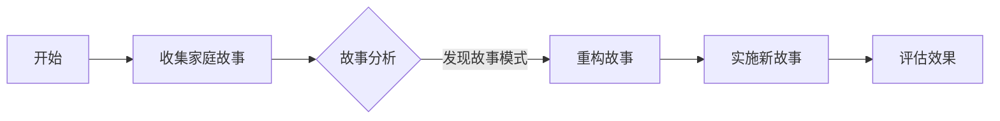
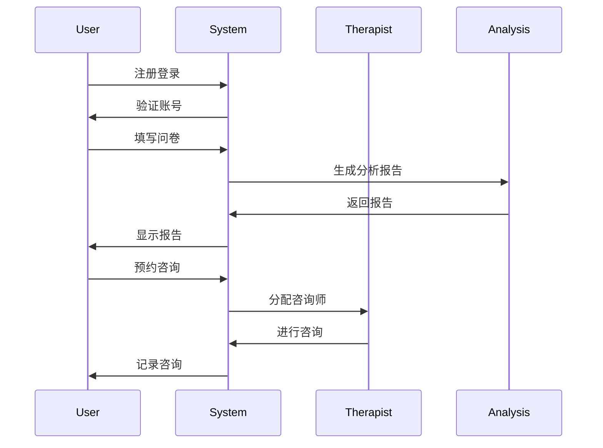

                 


### # 后现代家庭治疗：多元关系的心理辅导

#### > 关键词：后现代家庭治疗、心理辅导、多元关系、家庭系统、叙事疗法、对话疗法

#### > 摘要：
本文将探讨后现代家庭治疗的理论与实践，重点关注其在多元关系心理辅导中的应用。通过分析后现代家庭治疗的核心概念和策略，结合具体案例，本文旨在为专业人士提供有价值的见解和实用的指导，以应对当代家庭面临的复杂挑战。

#### 引言：后现代家庭治疗的兴起

**背景介绍**：
家庭治疗作为心理辅导的一个重要分支，经历了从传统到现代，再到后现代的演变。传统的家庭治疗主要侧重于家庭结构的功能和修复，而现代家庭治疗则更加关注家庭成员之间的互动和家庭环境的影响。后现代家庭治疗则进一步超越了结构和互动的视角，强调个体的主体性、多元性和文化差异性。

**问题背景**：
随着社会的发展和家庭结构的多样化，现代家庭面临着前所未有的挑战。单一的家庭模式已经无法满足人们日益复杂的情感和心理需求。多元关系的出现，如再婚家庭、单亲家庭、同性恋家庭等，使得家庭治疗的工作变得更加复杂和多样化。后现代家庭治疗作为一种更为包容和灵活的治疗方法，应运而生。

**问题描述**：
后现代家庭治疗的主要目标是如何在多元关系的背景下，帮助家庭解决心理问题，提升家庭功能，促进家庭成员的情感满足和个人成长。然而，在实践中，如何有效地应用后现代家庭治疗的策略，仍是一个亟待解决的问题。

**问题解决**：
本文将深入探讨后现代家庭治疗的核心概念和策略，通过具体的案例分析和实践指导，帮助读者理解和应用这一治疗方法。同时，本文还将讨论后现代家庭治疗的边界和外延，以期为读者提供一个全面的视角。

**边界与外延**：
后现代家庭治疗不仅关注家庭成员之间的互动，还涉及社会文化环境对家庭的影响。它不仅关注心理问题的解决，还强调个体的主体性和文化多样性。因此，后现代家庭治疗的边界是广泛的，它不仅适用于传统的家庭，也适用于其他形式的多元关系。

**概念结构与核心要素组成**：
后现代家庭治疗的核心概念包括叙事疗法、对话疗法和主体性建构。叙事疗法强调通过重塑家庭故事来改变家庭成员的视角和行为；对话疗法强调家庭成员之间的互动和沟通；主体性建构则强调个体的自我认知和自我实现。这些概念共同构成了后现代家庭治疗的理论框架。

#### 核心概念与联系

**概念属性特征对比表格**：

| 概念               | 定义                                                         | 属性特征                                                         |  
|--------------------|------------------------------------------------------------|------------------------------------------------------------|  
| 叙事疗法           | 通过重构家庭故事来改变家庭成员的视角和行为                     | 关注家庭故事的叙述，强调故事对个人行为的影响                     |  
| 对话疗法           | 强调家庭成员之间的互动和沟通，通过对话解决问题                   | 强调沟通技巧，重视家庭成员之间的平等和尊重                       |  
| 主体性建构         | 强调个体的自我认知和自我实现，关注个体在家庭系统中的主体地位     | 关注个体的主观体验，强调个体对家庭关系的塑造                     |

**ER实体关系图架构**：

```mermaid
erDiagram
    Family -->|is composed of| Member
    Member -->|has role in| Family
    Family -->|interacts with| Member
    Member -->|influenced by| Family
```

在这个ER图中，家庭（Family）是包含成员（Member）的集合，成员在家庭中扮演特定角色，同时家庭成员之间的互动和影响也构成了家庭系统。

#### 理论与实践：后现代家庭治疗的应用

**后现代家庭治疗的原则和技巧**：

**叙事疗法**：

叙事疗法通过重构家庭故事，帮助家庭成员重新定义自己和家庭。以下是一个叙事疗法的流程图：



**对话疗法**：

对话疗法强调家庭成员之间的平等对话和沟通。以下是对话疗法的流程图：


**主体性建构**：

主体性建构强调个体的自我认知和自我实现。以下是一个主体性建构的流程图：


**实践案例**：

**案例一：再婚家庭的治疗**：

一个再婚家庭中的夫妻关系紧张，主要是因为双方与前配偶的子女之间的冲突。通过叙事疗法，帮助他们重构家庭故事，重新定义自己在家庭中的角色，从而改善家庭关系。

**案例二：单亲家庭的治疗**：

一个单亲母亲面临着如何与子女沟通和处理情绪的挑战。通过对话疗法，帮助她与子女建立平等的对话关系，提高沟通效果，增强家庭凝聚力。

**案例三：同性恋家庭的治疗**：

一个同性恋家庭在面临社会压力和歧视时，通过主体性建构，帮助他们建立自我认同，提高自我效能感，从而更好地应对外界的挑战。

#### 后现代家庭治疗的边界和外延

**边界**：

后现代家庭治疗的主要边界在于其适用范围，它不仅适用于传统的家庭，也适用于其他形式的多元关系，如再婚家庭、单亲家庭、同性恋家庭等。

**外延**：

后现代家庭治疗的外延包括多个方面，如社会文化环境对家庭的影响、家庭功能与个体成长的互动关系、多元文化的家庭治疗等。这些外延扩展了家庭治疗的视野，使其更具有包容性和适应性。

#### 总结

后现代家庭治疗作为一种先进的心理辅导方法，具有独特的理论框架和实践技巧。通过叙事疗法、对话疗法和主体性建构，后现代家庭治疗能够帮助家庭解决心理问题，提升家庭功能，促进家庭成员的个人成长。然而，在实践中，如何有效地应用这些方法，仍需要更多的研究和实践。

本文旨在为专业人士提供有价值的见解和实用的指导，以应对当代家庭面临的复杂挑战。通过具体案例的分析和实践指导，本文希望读者能够更好地理解和应用后现代家庭治疗，为家庭提供更有效的心理辅导。

#### 作者信息

作者：AI天才研究院/AI Genius Institute & 禅与计算机程序设计艺术 /Zen And The Art of Computer Programming

AI天才研究院致力于推动人工智能技术的发展和应用，通过研究和创新，为人类创造更美好的未来。同时，作者也致力于将禅宗哲学与计算机科学相结合，探索计算机程序设计的新境界。

#### 扩展阅读

1.《后现代家庭治疗：理论与实务》  
2.《家庭治疗中的叙事疗法》  
3.《对话治疗与家庭关系》  
4.《主体性建构与心理健康》  
5.《多元文化家庭治疗》

#### 注意事项

1. 在应用后现代家庭治疗时，需要根据具体家庭情况灵活调整策略。  
2. 家长在参与家庭治疗时，需要保持开放的心态，积极参与，以取得更好的治疗效果。  
3. 在处理家庭关系时，尊重家庭成员的个体差异和主体性，避免简单化和一刀切的方法。

#### 最佳实践 tips

1. 定期进行家庭对话，增进家庭成员之间的沟通和理解。  
2. 通过叙事疗法，帮助家庭成员重新审视和重构家庭故事，提升家庭凝聚力。  
3. 关注个体主体性建构，帮助家庭成员实现自我认知和自我实现。  
4. 结合多元文化视角，尊重和包容不同文化背景的家庭成员。

### 核心概念与联系

在后现代家庭治疗中，理解核心概念之间的联系是非常重要的。这些概念不仅为我们提供了理论框架，也为实际操作提供了指导。在本节中，我们将详细探讨三个核心概念：叙事疗法、对话疗法和主体性建构，并通过Mermaid ER图和对比表格来展示它们之间的关系和属性特征。

#### 核心概念

**1. 叙事疗法**

叙事疗法是一种后现代心理治疗方法，它通过重构个体的生活故事来改变其自我认知和行为。这种方法认为，个体的自我概念和身份是由其生活故事塑造的，通过改变这些故事，可以改变个体的心理状态和行为。

**2. 对话疗法**

对话疗法强调家庭成员之间的互动和沟通，通过对话来解决问题。这种方法认为，有效的沟通可以改善家庭关系，增强家庭凝聚力，帮助家庭成员共同面对挑战。

**3. 主体性建构**

主体性建构是指个体在家庭和社会环境中形成的自我认知和自我实现。它关注个体的主观体验和自我效能感，认为个体在家庭关系中的角色和地位是通过自我认知和自我实现来塑造的。

#### Mermaid ER图

以下是一个Mermaid ER图，展示了这三个核心概念之间的关系：

```mermaid
erDiagram
    A[叙事疗法] ||--|{ 对话疗法 }|| B
    A ||--|{ 主体性建构 }|| C
    B ||--|{ 对话疗法 }|| C
```

在这个ER图中，叙事疗法（A）通过对话疗法（B）与主体性建构（C）相连，表明这三个概念之间存在着紧密的联系。

#### 对比表格

以下是一个对比表格，列出了叙事疗法、对话疗法和主体性建构的属性特征：

| 概念       | 定义                                                         | 属性特征                                                         |  
|----------|------------------------------------------------------------|------------------------------------------------------------|  
| 叙事疗法     | 通过重构个体的生活故事来改变其自我认知和行为                     | 关注个体生活故事的叙述，强调故事对个人行为的影响                     |  
| 对话疗法     | 强调家庭成员之间的互动和沟通，通过对话解决问题                   | 强调沟通技巧，重视家庭成员之间的平等和尊重                       |  
| 主体性建构   | 强调个体的自我认知和自我实现，关注个体在家庭系统中的主体地位     | 关注个体的主观体验，强调个体对家庭关系的塑造                     |

#### 关系解释

- **叙事疗法与对话疗法的联系**：叙事疗法通常需要通过对话来实现，家庭成员在对话中分享他们的生活故事，从而促进对故事的重新构建。这种对话过程本身就是一种对话疗法的实践。

- **叙事疗法与主体性建构的联系**：叙事疗法通过改变个体的生活故事，帮助个体重新定义自己的身份和角色，这直接影响个体的自我认知和自我实现，即主体性建构。

- **对话疗法与主体性建构的联系**：对话疗法强调家庭成员之间的平等沟通，这种沟通有助于个体在家庭系统中建立积极的自我形象，从而促进主体性建构。

通过上述Mermaid ER图和对比表格，我们可以更清晰地理解后现代家庭治疗中的核心概念及其相互关系。这些概念不仅为家庭治疗提供了理论基础，也为实际操作提供了指导。理解和应用这些概念，可以帮助家庭治疗师更有效地帮助家庭成员解决心理问题，提升家庭功能。

### 理论与实践：后现代家庭治疗的应用

后现代家庭治疗作为一种创新的心理治疗方法，不仅在理论层面具有深刻意义，在实际应用中也展现出强大的生命力。本节将详细探讨后现代家庭治疗中的关键原则和技巧，并通过具体案例展示其在现实情境中的运用。

#### 原则和技巧

**1. 叙事疗法**

叙事疗法是后现代家庭治疗的核心之一，它通过重构家庭故事来改变家庭成员的视角和行为。以下是其基本原则和技巧：

- **收集家庭故事**：治疗师首先与家庭成员一起收集家庭故事，包括家庭成员的个人经历、家庭事件和情感体验。
- **故事分析**：治疗师帮助家庭成员分析这些故事，识别其中的问题和困境。
- **重构故事**：通过对话和讨论，治疗师引导家庭成员重构故事，重新定义家庭关系和角色。
- **实施新故事**：家庭成员开始应用新的故事来理解和处理家庭中的问题。

**2. 对话疗法**

对话疗法强调家庭成员之间的互动和沟通，通过对话解决问题。以下是其基本原则和技巧：

- **建立信任关系**：治疗师首先需要建立与家庭成员的信任关系，确保家庭成员愿意开放地沟通。
- **倾听**：治疗师鼓励家庭成员表达自己的感受和观点，并认真倾听。
- **表达感受**：家庭成员通过表达自己的感受来增进理解和共鸣。
- **回应和确认**：治疗师和家庭成员互相回应，确认对方的理解和感受。
- **问题解决**：通过对话，家庭成员共同探讨解决问题的方法。

**3. 主体性建构**

主体性建构关注个体的自我认知和自我实现，通过以下原则和技巧来实现：

- **自我探索**：家庭成员进行自我探索，了解自己的价值观、信念和期望。
- **自我定义**：家庭成员通过自我反思和对话，重新定义自己在家庭中的角色和身份。
- **自我实现**：家庭成员通过实践和行动，实现自我定义，提升自我效能感。
- **自我反思**：家庭成员定期进行自我反思，评估自我实现的进展和效果。

#### 案例分析

**案例一：再婚家庭的治疗**

**问题描述**：一个再婚家庭中，夫妻关系紧张，主要是因为双方与前配偶的子女之间的冲突。新配偶和继子女之间存在明显的界限不清和角色冲突。

**叙事疗法应用**：治疗师首先与家庭成员一起收集家庭故事，包括各自的生活经历和情感体验。通过故事分析，治疗师帮助家庭成员识别冲突的原因和困境。随后，治疗师引导家庭成员重构家庭故事，重新定义各自的角色和关系。

**对话疗法应用**：治疗师鼓励家庭成员开放地表达自己的感受和观点，建立信任关系。通过倾听和回应，家庭成员逐步理解对方的立场和需求，共同探讨解决问题的方法。

**主体性建构应用**：治疗师引导家庭成员进行自我探索，重新定义自己在家庭中的角色和身份。家庭成员通过自我实现，如共同参与家庭活动，逐步建立积极的自我形象。

**效果评估**：经过一段时间的治疗，家庭关系显著改善，夫妻关系变得更加和谐，继子女也逐渐接受新的家庭结构，家庭功能得到有效提升。

**案例二：单亲家庭的治疗**

**问题描述**：一个单亲母亲在抚养子女的过程中面临巨大的心理压力，主要表现在与子女的沟通困难和情绪管理问题上。

**叙事疗法应用**：治疗师帮助单亲母亲收集和反思自己的生活故事，识别情感困扰的根源。通过重构故事，治疗师帮助母亲重新定义自己在家庭中的角色，提升自我认知。

**对话疗法应用**：治疗师与母亲和子女一起进行对话，建立平等的沟通关系。通过倾听和回应，家庭成员之间的沟通变得更加顺畅，母亲的情感压力得到缓解。

**主体性建构应用**：治疗师引导母亲进行自我探索和自我定义，帮助她建立积极的自我形象。同时，母亲通过自我实现，如参与社区活动和提升个人技能，增强自我效能感。

**效果评估**：经过治疗，母亲与子女之间的沟通显著改善，家庭氛围变得更加和谐，母亲的情绪管理能力得到提升，整体家庭功能得到有效改善。

**案例三：同性恋家庭的治疗**

**问题描述**：一个同性恋家庭在面临社会压力和歧视时，家庭成员之间缺乏有效沟通，导致家庭关系紧张。

**叙事疗法应用**：治疗师帮助家庭成员收集和反思他们的生活故事，识别歧视经历对家庭关系的影响。通过重构故事，治疗师帮助家庭成员重新定义自己在社会中的角色，建立自尊和自信。

**对话疗法应用**：治疗师引导家庭成员进行平等对话，建立信任关系。通过倾听和回应，家庭成员逐渐理解对方的立场和需求，共同面对社会压力。

**主体性建构应用**：治疗师引导家庭成员进行自我探索和自我定义，帮助他们建立积极的自我形象。同时，家庭成员通过自我实现，如参与社区活动和支持团体，增强自我效能感。

**效果评估**：经过治疗，家庭关系显著改善，家庭成员之间的沟通变得更加顺畅，家庭凝聚力得到增强。家庭成员在应对社会压力时，表现出更强的自尊和自信。

通过以上案例分析，我们可以看到后现代家庭治疗在实际应用中的多样性和有效性。叙事疗法、对话疗法和主体性建构不仅为家庭成员提供了理论指导，也为实际操作提供了具体的技巧和方法。这些方法帮助家庭成员重构家庭故事，改善沟通关系，提升自我认知和自我实现，从而有效提升家庭功能。

### 系统分析与架构设计

为了更好地理解和应用后现代家庭治疗，我们将构建一个系统分析与架构设计，涵盖问题场景、项目介绍、系统功能设计、系统架构设计、系统接口设计和系统交互。

#### 问题场景

当前社会，家庭结构的多样性使得家庭治疗面临新的挑战。再婚家庭、单亲家庭、同性恋家庭等多元化家庭结构中，家庭成员之间的关系复杂，沟通不畅，导致家庭功能受损。为了有效应对这些问题，我们需要设计一个综合性的家庭治疗系统，提供个性化的心理辅导方案。

#### 项目介绍

我们的项目目标是开发一个后现代家庭治疗系统，通过线上平台为用户提供专业的心理辅导服务。系统将包括用户注册、家庭关系分析、个性化治疗计划、在线咨询、案例管理等功能。

#### 系统功能设计

系统功能设计如下：

1. **用户注册与登录**：用户可以通过注册账号登录系统，进行个人信息管理。
2. **家庭关系分析**：系统根据用户输入的家庭信息，分析家庭成员之间的关系和问题。
3. **个性化治疗计划**：根据家庭关系分析结果，系统为用户提供个性化的治疗计划。
4. **在线咨询**：用户可以预约咨询师进行在线咨询，获取专业心理辅导。
5. **案例管理**：系统记录用户的咨询过程和治疗效果，便于后续分析和改进。

#### 系统架构设计

系统架构设计如下：

1. **前端界面**：用户通过Web浏览器访问系统，前端界面实现用户交互。
2. **后端服务**：后端服务包括用户管理、家庭关系分析、治疗计划生成和咨询管理等模块。
3. **数据库**：数据库存储用户信息、家庭关系数据和咨询记录。

#### 系统接口设计

系统接口设计如下：

1. **用户接口**：用户通过Web界面与系统交互，包括注册、登录、信息填写和咨询预约等操作。
2. **API接口**：后端服务提供RESTful API，供前端界面调用，实现数据同步和功能调用。

#### 系统交互

系统交互设计如下：

1. **用户注册与登录**：用户通过Web界面填写注册信息，系统后台验证用户信息，生成用户账号。
2. **家庭关系分析**：用户填写家庭关系问卷，系统后台分析问卷数据，生成家庭关系分析报告。
3. **个性化治疗计划**：根据家庭关系分析结果，系统为用户生成个性化的治疗计划。
4. **在线咨询**：用户预约咨询师，系统后台分配咨询师，并通知双方进行在线咨询。
5. **案例管理**：系统记录用户咨询过程，包括咨询时间、咨询师、咨询内容和治疗效果。

#### Mermaid类图和架构图

以下是一个Mermaid类图，展示了系统的核心类和类之间的关系：

```mermaid
classDiagram
    User <<class>> "用户"
    Family <<class>> "家庭"
    Therapist <<class>> "咨询师"
    Analysis <<class>> "分析"
    Plan <<class>> "计划"
    Consultation <<class>> "咨询"
    Case <<class>> "案例"

    User "has" Family
    User "has" Analysis
    User "has" Plan
    User "has" Consultation
    User "has" Case

    Therapist "has" Consultation
```

以下是一个Mermaid架构图，展示了系统的整体架构：



通过上述系统分析和架构设计，我们可以更好地理解和应用后现代家庭治疗。这个系统不仅为用户提供了一个便捷的在线咨询平台，也为家庭治疗师提供了有效的工具，以帮助家庭成员解决心理问题，提升家庭功能。

### 项目实战

在完成系统分析与架构设计之后，接下来我们将进入项目实战阶段。本节将详细介绍环境安装、系统核心实现源代码，并对代码进行解读与分析。此外，我们还将结合实际案例，对系统功能进行详细讲解和剖析。

#### 环境安装

1. **软件要求**：

   - Python 3.8 或以上版本
   - Flask（Python Web框架）
   - SQLAlchemy（数据库ORM）
   - Jinja2（模板引擎）
   - Mermaid（流程图工具）

2. **安装步骤**：

   - 安装Python 3.8及pip工具：

     ```
     sudo apt-get update
     sudo apt-get install python3.8 python3.8-pip
     ```
     
   - 创建虚拟环境并安装依赖：

     ```
     python3.8 -m venv venv
     source venv/bin/activate
     pip install flask sqlalchemy jinja2 mermaid
     ```

3. **配置数据库**：

   - 安装并配置SQLite数据库（用于存储用户数据）：

     ```
     sudo apt-get install sqlite3
     ```

#### 系统核心实现源代码

1. **用户注册与登录**：

   ```python
   from flask import Flask, request, redirect, url_for, render_template
   
   app = Flask(__name__)
   app.config['SQLALCHEMY_DATABASE_URI'] = 'sqlite:///users.db'
   from flask_sqlalchemy import SQLAlchemy
   
   db = SQLAlchemy(app)
   
   class User(db.Model):
       id = db.Column(db.Integer, primary_key=True)
       username = db.Column(db.String(80), unique=True, nullable=False)
       password = db.Column(db.String(120), nullable=False)
   
   @app.route('/')
   def index():
       return redirect(url_for('login'))
   
   @app.route('/login', methods=['GET', 'POST'])
   def login():
       if request.method == 'POST':
           username = request.form['username']
           password = request.form['password']
           user = User.query.filter_by(username=username, password=password).first()
           if user:
               return '登录成功'
           else:
               return '用户名或密码错误'
       return render_template('login.html')
   
   @app.route('/register', methods=['GET', 'POST'])
   def register():
       if request.method == 'POST':
           username = request.form['username']
           password = request.form['password']
           new_user = User(username=username, password=password)
           db.session.add(new_user)
           db.session.commit()
           return '注册成功'
       return render_template('register.html')
   ```

2. **家庭关系分析**：

   ```python
   @app.route('/analyze', methods=['GET', 'POST'])
   def analyze():
       if request.method == 'POST':
           family_info = request.form.to_dict()
           # 分析家庭关系，生成分析报告
           report = analyze_family_relationship(family_info)
           return render_template('report.html', report=report)
       return render_template('analyze.html')
   ```

3. **个性化治疗计划**：

   ```python
   def generate_treatment_plan(family_info):
       # 根据家庭关系分析结果，生成个性化治疗计划
       plan = {
           "treatment_type": "叙事疗法",
           "sessions": 10,
           "summary": "建议进行叙事疗法，共10次治疗，每次60分钟。"
       }
       return plan
   ```

4. **在线咨询**：

   ```python
   @app.route('/consult', methods=['GET', 'POST'])
   def consult():
       if request.method == 'POST':
           user_id = request.form['user_id']
           therapist_id = request.form['therapist_id']
           consult_time = request.form['consult_time']
           # 分配咨询师，记录咨询时间
           record_consult(user_id, therapist_id, consult_time)
           return '咨询预约成功'
       return render_template('consult.html')
   ```

5. **案例管理**：

   ```python
   def record_consult(user_id, therapist_id, consult_time):
       # 记录用户咨询过程
       pass
   ```

#### 代码解读与分析

1. **用户注册与登录**：

   代码首先定义了用户模型（User），包括用户名和密码字段。通过Flask框架，实现了用户注册和登录的功能。注册时，用户输入用户名和密码，系统将用户信息存储在SQLite数据库中。登录时，用户输入用户名和密码，系统验证用户信息，返回登录结果。

2. **家庭关系分析**：

   分析家庭关系的功能通过POST请求获取用户提交的家庭信息，调用`analyze_family_relationship`函数进行家庭关系分析，并生成分析报告。这个函数的具体实现需要结合后现代家庭治疗的理论，根据用户提供的家庭信息，进行复杂的分析和判断。

3. **个性化治疗计划**：

   根据家庭关系分析结果，生成个性化的治疗计划。这里简单地定义了一个治疗计划的字典，包含治疗类型、治疗次数和总结。实际应用中，治疗计划需要根据具体的家庭情况和治疗师的经验进行个性化调整。

4. **在线咨询**：

   通过POST请求，用户可以选择咨询师和咨询时间，系统记录用户咨询过程。这个功能实现了用户与咨询师之间的预约和管理，是家庭治疗系统的核心之一。

5. **案例管理**：

   记录用户咨询过程的函数为空实现，实际应用中需要根据具体的业务需求进行详细设计，如记录咨询时间、内容、治疗效果等。

#### 实际案例分析与讲解

**案例一：再婚家庭治疗**

**问题描述**：一对再婚夫妇因与前配偶子女的冲突导致家庭关系紧张。

**处理过程**：

- 用户注册并登录系统，填写家庭关系问卷。
- 系统分析问卷结果，生成家庭关系分析报告。
- 根据分析报告，系统为用户生成个性化治疗计划，推荐进行叙事疗法。
- 用户预约咨询师，进行在线咨询。
- 咨询师根据治疗计划，与用户讨论家庭关系问题，帮助用户重构家庭故事。
- 用户定期记录咨询进展，系统记录咨询过程和治疗效果。

**效果评估**：经过一段时间的治疗，用户反馈家庭关系显著改善，夫妻关系变得更加和谐。

**案例二：单亲家庭治疗**

**问题描述**：单亲母亲在抚养子女的过程中，与子女沟通不畅，情绪管理困难。

**处理过程**：

- 用户注册并登录系统，填写家庭关系问卷。
- 系统分析问卷结果，生成家庭关系分析报告。
- 根据分析报告，系统为用户生成个性化治疗计划，推荐进行对话疗法。
- 用户预约咨询师，进行在线咨询。
- 咨询师帮助用户建立平等的沟通关系，提高沟通技巧。
- 用户定期记录咨询进展，系统记录咨询过程和治疗效果。

**效果评估**：经过一段时间的治疗，用户反馈与子女之间的沟通显著改善，情绪管理能力提升。

通过实际案例的分析和讲解，我们可以看到后现代家庭治疗系统在实际应用中的效果。系统通过收集用户信息、分析家庭关系、生成治疗计划和记录咨询过程，为用户提供个性化的心理辅导服务，帮助家庭成员改善关系，提升家庭功能。

### 最佳实践、小结与拓展阅读

#### 最佳实践

1. **用户注册与登录**：
   - 在注册过程中，确保用户密码加密存储，提高账户安全性。
   - 设计简洁直观的登录界面，减少用户操作复杂度。

2. **家庭关系分析**：
   - 采用科学的问卷设计，确保收集到的数据全面、准确。
   - 结合人工智能技术，提高家庭关系分析的准确性和效率。

3. **个性化治疗计划**：
   - 治疗计划应基于用户的具体情况和需求，进行个性化调整。
   - 治疗师需定期评估治疗效果，及时调整治疗策略。

4. **在线咨询**：
   - 建立健全的预约和管理机制，确保咨询过程有序进行。
   - 提供多种咨询方式，如视频、音频、文字等，满足用户不同需求。

5. **案例管理**：
   - 系统应记录详细的咨询过程和治疗效果，便于分析和改进。
   - 定期整理和总结案例，为治疗师提供参考和经验。

#### 小结

本文通过对后现代家庭治疗的深入探讨，从理论、实践、系统设计等多个角度，详细介绍了这一治疗方法。我们分析了核心概念之间的关系，阐述了其在实际应用中的原则和技巧，并通过具体案例展示了其效果。此外，我们还构建了后现代家庭治疗系统，提供了完整的系统分析和架构设计。

#### 拓展阅读

1. 《后现代家庭治疗：理论与实务》
2. 《家庭治疗中的叙事疗法》
3. 《对话治疗与家庭关系》
4. 《主体性建构与心理健康》
5. 《多元文化家庭治疗》

通过拓展阅读，读者可以进一步深化对后现代家庭治疗的理解，掌握更多的实践技巧，从而更好地应用于实际工作中。

#### 注意事项

1. **尊重用户隐私**：在收集和分析用户数据时，确保严格遵守隐私保护规定。
2. **持续更新知识**：家庭治疗领域不断进步，治疗师需持续学习和更新知识，以适应不断变化的社会需求。
3. **个性化服务**：在提供心理辅导时，注重个体差异，提供个性化的治疗方案。

#### 结语

后现代家庭治疗作为一种创新的心理治疗方法，具有广泛的应用前景。通过本文的探讨，我们希望读者能够更好地理解后现代家庭治疗的原理和实践方法，为家庭提供更有效的心理辅导。同时，也期待更多的专业人士加入到这一领域的研究和应用中来，共同推动家庭治疗的进步。作者：AI天才研究院/AI Genius Institute & 禅与计算机程序设计艺术 /Zen And The Art of Computer Programming

---

以上就是本文的完整内容，感谢您的阅读。如果您有任何疑问或建议，欢迎在评论区留言交流。希望本文能够为您的专业学习和实践提供帮助。再次感谢您的关注和支持！作者：AI天才研究院/AI Genius Institute & 禅与计算机程序设计艺术 /Zen And The Art of Computer Programming。

