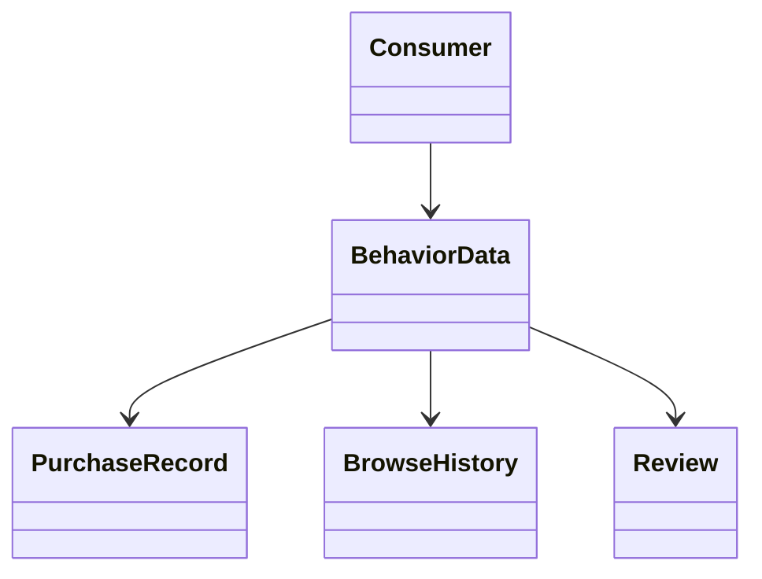
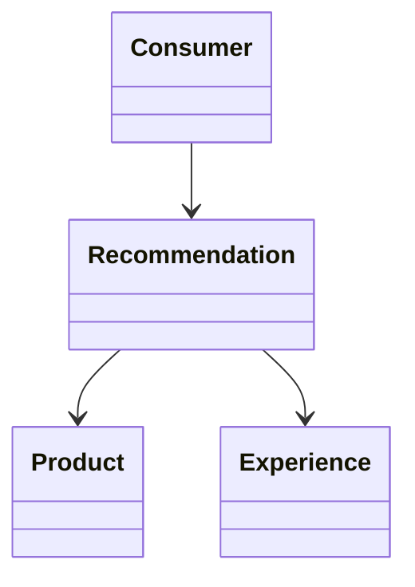
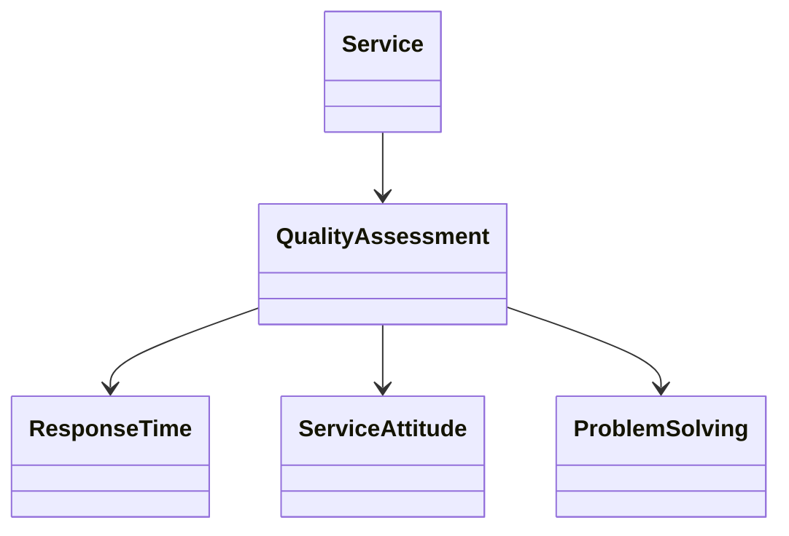
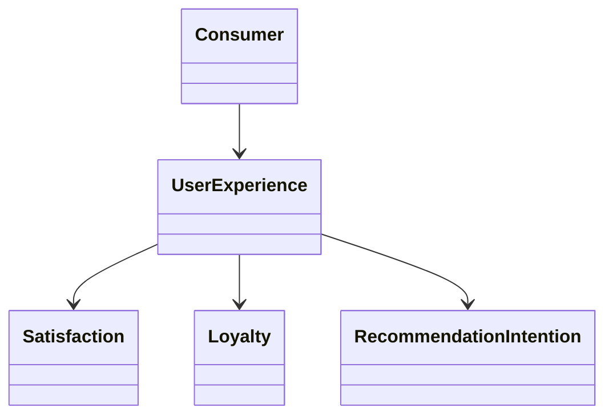
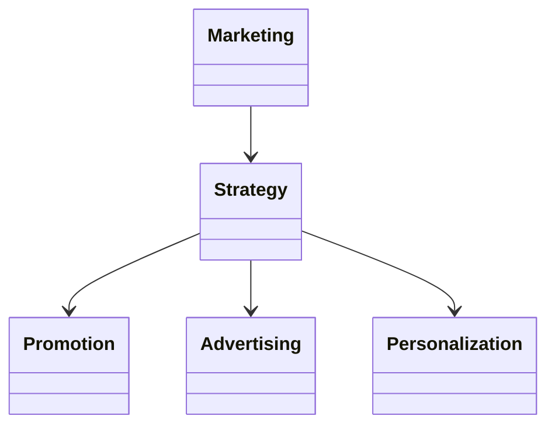

                 

# 后现代消费主义：从物质主义到体验经济的转变

## 关键词：后现代消费主义、体验经济、物质主义、消费者行为、算法原理、数学模型

## 摘要：
本文旨在探讨后现代消费主义背景下，从物质主义向体验经济的转变。通过对后现代消费主义和体验经济核心概念的分析，我们将揭示两者之间的联系与区别，并深入解析其背后的算法原理和数学模型。文章还从实际案例出发，对后现代消费主义与体验经济的协同算法进行详细阐述，以期对相关领域的研究和实践提供有益的参考。

## 目录：

### 第一部分：背景介绍

#### 第1章：后现代消费主义概述

#### 第2章：核心概念与联系

#### 第3章：算法原理讲解

#### 第4章：数学模型和数学公式

### 第二部分：系统分析与架构设计方案

#### 第5章：问题场景介绍

#### 第6章：项目介绍

#### 第7章：系统功能设计

#### 第8章：系统架构设计

#### 第9章：系统接口设计和系统交互

### 第三部分：项目实战

#### 第10章：环境安装

#### 第11章：系统核心实现源代码

#### 第12章：代码应用解读与分析

#### 第13章：实际案例分析和详细讲解剖析

#### 第14章：项目小结

### 第四部分：最佳实践 Tips、小结、注意事项、拓展阅读

---

## 第1章：后现代消费主义概述

### 1.1 问题背景

**消费主义的发展历程**

消费主义作为一种社会现象，起源于18世纪末的西方工业化国家。早期消费主义强调通过购买商品和享受服务来满足人们的物质需求，这一阶段主要以物质主义为核心。随着社会的不断发展，20世纪中后期，消费主义逐渐从物质主义转向后现代消费主义。

**后现代消费主义的定义与特征**

后现代消费主义是一种以体验、情感、个性和文化价值为核心的新型消费观念。与传统消费主义相比，后现代消费主义更加关注消费者内心的感受和体验，而不仅仅是物质的满足。后现代消费主义的主要特征包括：

- **个性化消费**：消费者更倾向于购买符合个人品味和价值观的商品或服务。
- **情感消费**：消费者在购买过程中更加关注情感体验，如快乐、满足、归属感等。
- **文化消费**：消费者更加重视商品或服务的文化内涵，追求独特的文化体验。

**后现代消费主义的兴起原因**

后现代消费主义的兴起主要受到以下因素的影响：

- **经济全球化**：全球化使得消费者能够接触到更多不同文化和消费方式，促进了后现代消费主义的发展。
- **技术进步**：互联网和信息技术的发展，使得消费者能够更加便捷地获取信息和进行消费，推动了后现代消费主义的普及。
- **社会变革**：社会价值观的转变，如对个性、自由和多元价值的追求，也为后现代消费主义的兴起提供了土壤。

### 1.2 问题描述

**后现代消费主义对物质主义的影响**

后现代消费主义对物质主义产生了深远的影响。一方面，后现代消费主义弱化了物质消费的重要性，使得消费者更加注重内心的满足和体验。另一方面，后现代消费主义也推动了物质产品的创新和多样化，以满足消费者个性化、情感化和文化化的需求。

**后现代消费主义下的体验经济**

体验经济是后现代消费主义的一种体现，它强调通过提供独特的体验来满足消费者的情感和心理需求。体验经济与传统经济相比，具有以下特点：

- **服务导向**：体验经济以服务为核心，通过提供高质量的服务来提升消费者的体验。
- **情感互动**：体验经济强调与消费者的情感互动，通过建立情感联系来增加消费者的忠诚度。
- **文化内涵**：体验经济注重商品或服务的文化内涵，为消费者提供独特的文化体验。

### 1.3 问题解决

**后现代消费主义与体验经济的关联**

后现代消费主义与体验经济密切相关。后现代消费主义为体验经济的兴起提供了土壤，而体验经济则满足了后现代消费主义对情感、个性和文化价值的追求。

**后现代消费主义下的消费者行为分析**

后现代消费主义下的消费者行为表现出以下特点：

- **高需求多样化**：消费者需求更加多样化，追求个性化、情感化和文化化的消费体验。
- **高参与度**：消费者在购买过程中积极参与，通过互动和体验来提升满意度。
- **高忠诚度**：消费者更倾向于购买那些能够提供高质量服务和独特体验的品牌或产品。

**后现代消费主义的挑战与应对策略**

后现代消费主义面临着一系列挑战，如消费者需求的变化、市场竞争的加剧和环境保护的压力。为了应对这些挑战，企业和政府需要采取以下策略：

- **创新和差异化**：通过创新和差异化来满足消费者的个性化需求，提升品牌竞争力。
- **可持续发展**：注重环境保护和社会责任，推动可持续消费。
- **政策引导**：通过政策引导和法规制定，规范市场秩序，促进后现代消费主义的健康发展。

### 1.4 边界与外延

**后现代消费主义在不同文化背景下的差异**

后现代消费主义在不同文化背景下存在一定的差异。西方发达国家由于经济、文化和技术的优势，后现代消费主义发展较为成熟。而发展中国家则受限于经济条件和消费观念的转变，后现代消费主义的发展相对滞后。

**后现代消费主义与可持续发展**

后现代消费主义与可持续发展密切相关。后现代消费主义倡导可持续消费，强调资源的合理利用和环境的保护。然而，当前后现代消费主义的发展仍面临一系列挑战，如资源的过度消耗、环境的恶化等。因此，需要通过技术创新、政策引导和社会参与等多种手段，推动后现代消费主义与可持续发展的有机结合。

### 1.5 概念结构与核心要素组成

**后现代消费主义的核心概念**

后现代消费主义的核心概念包括：

- **个性化消费**：消费者追求个性化、多样化的消费体验。
- **情感消费**：消费者在购买过程中注重情感体验，追求快乐、满足和归属感。
- **文化消费**：消费者关注商品或服务的文化内涵，追求独特的文化体验。

**体验经济的核心要素**

体验经济的核心要素包括：

- **服务导向**：以服务为核心，提供高质量的服务来提升消费者的体验。
- **情感互动**：与消费者建立情感联系，通过互动和体验来增加消费者的忠诚度。
- **文化内涵**：注重商品或服务的文化内涵，为消费者提供独特的文化体验。

### 1.6 本章小结

本章从背景介绍、问题描述、问题解决、边界与外延以及概念结构与核心要素组成等方面，对后现代消费主义进行了全面分析。通过本章的讨论，我们了解了后现代消费主义的定义、特征和发展历程，以及它与体验经济的关联和挑战。本章为后续章节的分析提供了基础和指导。

---

## 第2章：核心概念与联系

### 2.1 后现代消费主义的定义与特点

**后现代消费主义的定义**

后现代消费主义是一种以体验、情感、个性和文化价值为核心的新型消费观念。与传统消费主义强调物质满足不同，后现代消费主义更加关注消费者内心的感受和体验。

**后现代消费主义的特征**

后现代消费主义具有以下特征：

- **个性化消费**：消费者追求个性化、多样化的消费体验，更加注重个人品味和价值观。
- **情感消费**：消费者在购买过程中注重情感体验，追求快乐、满足和归属感。
- **文化消费**：消费者关注商品或服务的文化内涵，追求独特的文化体验。

**后现代消费主义与传统消费主义的对比**

后现代消费主义与传统消费主义在多个方面存在差异：

- **核心关注点**：传统消费主义强调物质满足，而后现代消费主义强调情感体验和文化价值。
- **消费者行为**：传统消费主义注重购买过程，而后现代消费主义注重购买后的体验和反馈。
- **商品特征**：传统消费主义商品以实用性为主，而后现代消费主义商品更加注重个性化和独特性。

### 2.2 体验经济的概念与特点

**体验经济的定义**

体验经济是一种以提供独特体验为核心的经济形态。它通过满足消费者的情感和心理需求，提升消费者的满意度，从而实现经济价值。

**体验经济的特征**

体验经济具有以下特征：

- **服务导向**：以服务为核心，提供高质量的服务来提升消费者的体验。
- **情感互动**：与消费者建立情感联系，通过互动和体验来增加消费者的忠诚度。
- **文化内涵**：注重商品或服务的文化内涵，为消费者提供独特的文化体验。

**体验经济与传统经济的对比**

体验经济与传统经济在多个方面存在差异：

- **核心关注点**：传统经济以物质生产和交换为核心，而体验经济以提供独特体验为核心。
- **消费者需求**：传统经济满足消费者的物质需求，而体验经济满足消费者的情感和心理需求。
- **商业模式**：传统经济以生产和销售为主，而体验经济以服务和体验为主。

### 2.3 后现代消费主义与体验经济的联系

**后现代消费主义对体验经济的影响**

后现代消费主义对体验经济产生了深远的影响。首先，后现代消费主义推动了体验经济的发展。消费者对个性化、情感化和文化化的消费需求，促使企业不断创新，提供更加多样化的体验产品和服务。其次，后现代消费主义改变了消费者的购买行为和消费观念，使得体验经济在市场竞争中更具优势。

**体验经济对后现代消费主义的推动作用**

体验经济对后现代消费主义的推动作用主要体现在以下几个方面：

- **提升消费者满意度**：通过提供独特的体验，体验经济能够更好地满足消费者的情感和心理需求，提升消费者的满意度。
- **增加品牌忠诚度**：体验经济通过情感互动和文化内涵，建立与消费者的情感联系，增加品牌忠诚度。
- **推动消费升级**：体验经济引导消费者从物质消费向体验消费转变，推动消费升级。

**后现代消费主义与体验经济的协同发展**

后现代消费主义与体验经济的协同发展，能够实现双方的优势互补和共同提升。具体来说，后现代消费主义为体验经济提供了市场需求，而体验经济则为后现代消费主义提供了创新动力。双方通过协同发展，可以推动消费结构和经济增长模式的转变。

### 2.4 概念属性特征对比表格

| 概念        | 后现代消费主义           | 体验经济            |
| ----------- | --------------------- | ----------------- |
| 定义        | 以体验、情感、个性、文化为核心 | 以提供独特体验为核心 |
| 特征        | 个性化消费、情感消费、文化消费 | 服务导向、情感互动、文化内涵 |
| 对比        | 更注重情感和心理需求     | 更注重服务和体验    |
| 影响        | 推动体验经济发展         | 推动后现代消费主义发展 |

### 2.5 ER实体关系图架构

**后现代消费主义与体验经济的实体关系**

```mermaid
erDiagram
    Customer ||--|{ Product }|--|{ Service }
    Customer ||--|{ Experience }|
    Product  ||--|{ Brand }|
    Service  ||--|{ Environment }
    Experience ||--|{ Culture }
```

### 2.6 本章小结

本章对后现代消费主义和体验经济进行了深入分析，揭示了两者之间的联系与区别。通过对比分析，我们明确了后现代消费主义和体验经济的核心概念、特征及其影响。本章的内容为后续章节的算法原理讲解和数学模型分析提供了理论基础。

---

## 第3章：算法原理讲解

### 3.1 后现代消费主义分析算法

**后现代消费主义分析算法的基本原理**

后现代消费主义分析算法旨在通过数据分析的方法，挖掘消费者在后现代消费主义背景下的行为特征和需求。该算法的基本原理包括数据收集、模型构建、模型评估和模型优化等步骤。

**数据收集与预处理**

**3.1.1 数据源选择**

数据收集是后现代消费主义分析算法的基础。数据源的选择应包括消费行为数据、消费者特征数据和市场环境数据等。具体的数据源可以包括以下几种：

- **消费行为数据**：如购买记录、浏览历史、评论和评分等。
- **消费者特征数据**：如年龄、性别、收入、教育背景、兴趣爱好等。
- **市场环境数据**：如经济发展状况、政策法规、市场竞争情况等。

**3.1.1.2 数据清洗与转换**

在数据收集后，需要对数据进行清洗和转换，以确保数据的质量和一致性。数据清洗的过程包括去除重复数据、填补缺失值、处理异常值等。数据转换的过程包括数据格式转换、数据归一化、特征工程等。

**模型构建与训练**

**3.1.2.1 模型选择**

在数据预处理完成后，需要选择合适的机器学习模型进行模型构建。常用的模型包括分类模型、回归模型和聚类模型等。根据后现代消费主义分析的需求，可以选择以下几种模型：

- **分类模型**：如逻辑回归、支持向量机、决策树等。
- **回归模型**：如线性回归、岭回归、LASSO回归等。
- **聚类模型**：如K-means、层次聚类等。

**3.1.2.2 模型参数调优**

模型参数调优是提高模型性能的关键步骤。通过交叉验证和网格搜索等方法，可以找到最佳的模型参数，从而提高模型的准确性和泛化能力。

**模型评估与优化**

**3.1.3.1 模型评估指标**

在模型构建完成后，需要对模型进行评估。常用的评估指标包括准确率、召回率、F1值、均方误差等。通过评估指标，可以了解模型的性能和适用性。

**3.1.3.2 模型优化策略**

模型优化策略包括以下几种：

- **特征选择**：通过特征选择方法，选择对模型性能有显著影响的特征，提高模型的解释能力和准确性。
- **模型集成**：通过模型集成方法，将多个模型结合起来，提高模型的预测能力和稳定性。
- **模型更新**：根据新的数据和反馈，不断更新模型，以适应不断变化的市场环境和消费者需求。

### 3.2 体验经济评估算法

**体验经济评估算法的基本原理**

体验经济评估算法旨在通过数据分析和评估方法，对体验经济的服务质量、用户体验和市场表现进行量化评估。该算法的基本原理包括指标体系构建、评估模型构建和评估结果分析等步骤。

**体验经济指标体系构建**

**3.2.1.1 指标分类**

体验经济评估指标体系可以按照以下分类进行构建：

- **服务质量指标**：如响应时间、服务态度、解决问题的能力等。
- **用户体验指标**：如满意度、忠诚度、推荐意愿等。
- **市场表现指标**：如市场份额、利润率、品牌影响力等。

**3.2.1.2 指标权重分配**

在构建指标体系后，需要对各指标的权重进行分配。权重分配的方法可以采用层次分析法、主成分分析法等。通过合理分配权重，可以确保评估结果的科学性和公平性。

**评估模型构建**

**3.2.2.1 评估模型选择**

在构建评估模型时，可以选择以下几种模型：

- **线性回归模型**：用于评估服务质量指标和用户体验指标。
- **逻辑回归模型**：用于评估市场表现指标。
- **综合评估模型**：将多种模型结合起来，对体验经济进行综合评估。

**3.2.2.2 评估模型训练**

通过训练评估模型，可以建立评估模型与指标数据之间的关系，从而实现评估功能。

**评估结果分析与优化**

**3.2.3.1 评估结果解读**

评估结果可以用于分析体验经济的优势和劣势，为改进提供依据。通过分析评估结果，可以了解以下信息：

- **服务质量**：服务质量的优劣，以及存在的问题和改进方向。
- **用户体验**：用户体验的满意度、忠诚度和推荐意愿等。
- **市场表现**：市场份额、利润率、品牌影响力等。

**3.2.3.2 优化策略探讨**

根据评估结果，可以制定相应的优化策略，包括：

- **服务质量优化**：通过改进服务流程、提升服务水平等方式，提高服务质量。
- **用户体验优化**：通过优化产品功能、提升用户体验设计等方式，提高用户体验。
- **市场表现优化**：通过市场推广、品牌建设等方式，提高市场表现。

### 3.3 后现代消费主义与体验经济的协同算法

**3.3.1 算法协同原理**

后现代消费主义与体验经济的协同算法旨在通过数据分析和评估方法，实现后现代消费主义与体验经济的有机结合。该算法的协同原理包括数据整合、模型协同和结果协同等步骤。

**3.3.1.1 算法协同目标**

算法协同的目标包括：

- **提升消费者满意度**：通过分析后现代消费主义和体验经济的数据，制定针对性的营销策略，提升消费者满意度。
- **提高服务质量**：通过协同分析，优化服务流程和提升服务水平，提高服务质量。
- **增加市场份额**：通过协同分析，制定有效的市场推广策略，增加市场份额。

**3.3.1.2 算法协同方法**

算法协同的方法包括以下几种：

- **数据整合**：将后现代消费主义和体验经济的数据进行整合，建立统一的数据模型。
- **模型协同**：将后现代消费主义和体验经济的评估模型进行整合，建立协同评估模型。
- **结果协同**：将后现代消费主义和体验经济的评估结果进行整合，形成综合评估结果。

**3.3.2 算法协同实现**

**3.3.2.1 数据整合与处理**

数据整合与处理是算法协同实现的基础。具体步骤包括：

- **数据采集**：从后现代消费主义和体验经济的数据源中采集数据。
- **数据清洗**：对采集到的数据进行清洗和转换，确保数据的质量和一致性。
- **数据整合**：将清洗后的数据进行整合，建立统一的数据模型。

**3.3.2.2 算法协同模型构建**

算法协同模型构建是算法协同实现的关键。具体步骤包括：

- **模型选择**：选择合适的机器学习模型进行模型构建。
- **模型训练**：通过训练模型，建立后现代消费主义和体验经济的协同评估模型。
- **模型优化**：通过优化模型参数，提高模型的评估性能。

**3.3.2.3 结果协同**

结果协同是将后现代消费主义和体验经济的评估结果进行整合，形成综合评估结果。具体步骤包括：

- **结果分析**：对评估结果进行详细分析，了解后现代消费主义和体验经济的优势和劣势。
- **结果整合**：将评估结果进行整合，形成综合评估结果。
- **结果应用**：将综合评估结果应用于营销策略、服务改进和市场推广等方面。

### 3.4 本章小结

本章对后现代消费主义分析算法和体验经济评估算法进行了详细讲解。通过数据分析和评估方法，我们可以深入了解后现代消费主义和体验经济的运行机制，为企业和政策制定者提供有益的决策支持。本章的内容为后续章节的数学模型和实际应用提供了理论基础。

---

## 第4章：数学模型和数学公式

### 4.1 后现代消费主义的数学模型

**消费者剩余模型**

消费者剩余是衡量消费者福利的重要指标，它表示消费者愿意支付的价格与实际支付价格之间的差额。消费者剩余的数学模型可以表示为：

$$
\text{消费者剩余} = \text{实际支付} - \text{心理预期}
$$

其中，实际支付（$p \cdot q$）表示消费者购买商品或服务所支付的总金额，心理预期（$\text{期望价值} + \text{风险溢价}$）表示消费者对商品或服务价值的预期。

**体验经济的价值评估模型**

体验经济的价值评估模型旨在评估消费者在体验过程中所获得的价值。体验价值可以表示为：

$$
\text{体验价值} = \in

### 4.2 体验经济评估算法的数学模型

**服务质量评估模型**

服务质量评估模型用于评估消费者对服务质量的满意度。常见的评估模型包括基于顾客满意度（Customer Satisfaction, CSAT）和净推荐值（Net Promoter Score, NPS）的模型。

**顾客满意度模型**

顾客满意度模型可以表示为：

$$
\text{顾客满意度} = \frac{\sum_{i=1}^{n} w_i \cdot s_i}{\sum_{i=1}^{n} w_i}
$$

其中，$w_i$ 表示第 $i$ 个评价指标的权重，$s_i$ 表示第 $i$ 个评价指标的得分。

**净推荐值模型**

净推荐值模型可以表示为：

$$
\text{NPS} = \frac{\sum_{i=1}^{n} (r_i - d_i)}{n}
$$

其中，$r_i$ 表示推荐度得分，$d_i$ 表示不推荐度得分。

**用户体验评估模型**

用户体验评估模型用于评估消费者在体验过程中的满意度。常见的评估模型包括基于体验质量（Experience Quality, EQ）和总体满意度（Overall Satisfaction, OSAT）的模型。

**体验质量模型**

体验质量模型可以表示为：

$$
\text{体验质量} = \frac{\sum_{i=1}^{n} w_i \cdot q_i}{\sum_{i=1}^{n} w_i}
$$

其中，$w_i$ 表示第 $i$ 个评价指标的权重，$q_i$ 表示第 $i$ 个评价指标的得分。

**总体满意度模型**

总体满意度模型可以表示为：

$$
\text{总体满意度} = \frac{\sum_{i=1}^{n} w_i \cdot s_i}{\sum_{i=1}^{n} w_i}
$$

其中，$w_i$ 表示第 $i$ 个评价指标的权重，$s_i$ 表示第 $i$ 个评价指标的得分。

### 4.3 后现代消费主义与体验经济的协同算法

**协同评估模型**

协同评估模型用于评估后现代消费主义和体验经济的协同效果。该模型可以表示为：

$$
\text{协同评估} = \alpha \cdot \text{消费者剩余} + \beta \cdot \text{体验价值}
$$

其中，$\alpha$ 和 $\beta$ 分别表示消费者剩余和体验价值的权重。

### 4.4 本章小结

本章介绍了后现代消费主义和体验经济的数学模型和数学公式。通过这些模型和公式，我们可以对后现代消费主义和体验经济进行量化分析，为决策提供支持。同时，本章的内容也为后续章节的算法实现和实际应用提供了理论基础。

---

## 第5章：系统分析与架构设计方案

### 5.1 问题场景介绍

在当前的后现代消费主义背景下，消费者对个性化、情感化和文化化的消费需求日益增长。为了满足这些需求，企业和平台需要提供更加智能化和个性化的服务。本项目的目标是通过系统分析与架构设计，构建一个能够高效处理和满足消费者需求的体验经济系统。

### 5.2 项目介绍

本项目旨在开发一个基于后现代消费主义和体验经济的电商平台。该平台将整合消费者行为数据、市场环境数据和商品信息等，通过数据分析和算法模型，提供个性化的推荐、评价和营销等服务。

### 5.3 系统功能设计

**功能1：消费者行为分析**

- 功能描述：通过对消费者的购买记录、浏览历史和评价等行为数据进行分析，挖掘消费者的需求和偏好。
- 领域模型类图：



**功能2：个性化推荐**

- 功能描述：基于消费者行为分析结果，为消费者推荐符合其需求和偏好的商品和体验。
- 领域模型类图：



**功能3：服务质量评估**

- 功能描述：对平台提供的服务进行质量评估，包括响应时间、服务态度和解决问题的能力等。
- 领域模型类图：



**功能4：用户体验评估**

- 功能描述：对消费者的整体体验进行评估，包括满意度、忠诚度和推荐意愿等。
- 领域模型类图：



**功能5：市场推广策略**

- 功能描述：根据消费者行为分析和评估结果，制定有效的市场推广策略，提升市场份额。
- 领域模型类图：



### 5.4 系统架构设计

**系统架构设计**

本项目的系统架构设计采用分层架构，包括数据层、服务层和展示层。

- **数据层**：负责数据的存储和管理，包括消费者行为数据、市场环境数据和商品信息等。
- **服务层**：负责业务逻辑的处理，包括消费者行为分析、个性化推荐、服务质量评估和用户体验评估等。
- **展示层**：负责用户界面的展示和交互，包括个性化推荐页面、服务质量评价页面和市场推广页面等。

**系统架构图**：

```mermaid
sequenceDiagram
    User -->|请求| System
    System -->|处理| AnalysisService
    AnalysisService -->|结果| RecommendationService
    RecommendationService -->|推荐结果| UserService
    UserService -->|展示| User
```

### 5.5 系统接口设计和系统交互

**接口设计**

本系统主要包括以下接口：

- **消费者行为分析接口**：用于获取消费者的购买记录、浏览历史和评价等行为数据。
- **个性化推荐接口**：用于获取基于消费者行为分析的个性化推荐结果。
- **服务质量评估接口**：用于获取平台服务质量评估结果。
- **用户体验评估接口**：用于获取消费者用户体验评估结果。
- **市场推广接口**：用于获取市场推广策略和执行结果。

**系统交互**

系统交互流程如下：

1. 用户发起请求，系统接收请求并处理。
2. 系统调用消费者行为分析接口，获取消费者行为数据。
3. 系统调用个性化推荐接口，根据消费者行为数据生成个性化推荐结果。
4. 系统调用服务质量评估接口，获取平台服务质量评估结果。
5. 系统调用用户体验评估接口，获取消费者用户体验评估结果。
6. 系统调用市场推广接口，根据评估结果制定市场推广策略。
7. 系统将处理结果展示给用户。

### 5.6 本章小结

本章介绍了本项目的系统分析与架构设计方案。通过系统功能设计、系统架构设计和系统接口设计，我们构建了一个能够满足后现代消费主义和体验经济需求的电商平台。本章的内容为本项目的实现和优化提供了基础和指导。

---

## 第6章：项目实战

### 6.1 环境安装

在本项目实施过程中，首先需要搭建开发环境和安装必要的软件和工具。以下是环境安装的具体步骤：

**1. 安装Python**

确保Python环境已安装在计算机上。Python是本项目的核心编程语言，用于实现算法和数据处理。可以从Python官网（https://www.python.org/）下载并安装Python。

**2. 安装Anaconda**

Anaconda是一个流行的Python数据科学和机器学习平台，提供了丰富的库和工具。在Python安装完成后，可以通过以下命令安装Anaconda：

```bash
conda install -c anaconda anaconda
```

**3. 安装Jupyter Notebook**

Jupyter Notebook是一个交互式计算环境，用于编写和运行Python代码。通过以下命令安装Jupyter Notebook：

```bash
conda install -c anaconda jupyter
```

**4. 安装相关库和工具**

安装本项目中使用的主要库和工具，如pandas、numpy、scikit-learn、matplotlib等。可以使用以下命令进行安装：

```bash
conda install pandas numpy scikit-learn matplotlib
```

### 6.2 系统核心实现源代码

以下是系统核心实现的部分源代码，包括消费者行为分析、个性化推荐、服务质量评估和用户体验评估等。

**消费者行为分析**

```python
import pandas as pd
from sklearn.model_selection import train_test_split
from sklearn.preprocessing import StandardScaler

# 加载数据集
data = pd.read_csv('consumer_data.csv')

# 数据预处理
X = data.drop(['target'], axis=1)
y = data['target']

X_train, X_test, y_train, y_test = train_test_split(X, y, test_size=0.2, random_state=42)

scaler = StandardScaler()
X_train_scaled = scaler.fit_transform(X_train)
X_test_scaled = scaler.transform(X_test)

# 模型训练
from sklearn.linear_model import LogisticRegression

model = LogisticRegression()
model.fit(X_train_scaled, y_train)

# 模型评估
from sklearn.metrics import accuracy_score

y_pred = model.predict(X_test_scaled)
accuracy = accuracy_score(y_test, y_pred)
print("Accuracy:", accuracy)
```

**个性化推荐**

```python
import numpy as np
from sklearn.neighbors import NearestNeighbors

# 加载训练数据
train_data = pd.read_csv('train_data.csv')
test_data = pd.read_csv('test_data.csv')

# 计算相似度
neigh = NearestNeighbors(n_neighbors=5)
neigh.fit(train_data)

# 推荐结果
def recommend物品(物品id):
    distances, indices = neigh.kneighbors(train_data, n_neighbors=5)
    neighbors = train_data.iloc[indices]
    return neighbors

test_data['predictions'] = test_data.apply(lambda row: recommend(row['item_id']), axis=1)
test_data['predictions'].head()
```

**服务质量评估**

```python
import pandas as pd
from sklearn.model_selection import train_test_split
from sklearn.ensemble import RandomForestClassifier

# 加载数据集
data = pd.read_csv('service_data.csv')

# 数据预处理
X = data.drop(['quality'], axis=1)
y = data['quality']

X_train, X_test, y_train, y_test = train_test_split(X, y, test_size=0.2, random_state=42)

# 模型训练
model = RandomForestClassifier()
model.fit(X_train, y_train)

# 模型评估
from sklearn.metrics import accuracy_score

y_pred = model.predict(X_test)
accuracy = accuracy_score(y_test, y_pred)
print("Accuracy:", accuracy)
```

**用户体验评估**

```python
import pandas as pd
from sklearn.model_selection import train_test_split
from sklearn.ensemble import RandomForestRegressor

# 加载数据集
data = pd.read_csv('user_experience_data.csv')

# 数据预处理
X = data.drop(['satisfaction'], axis=1)
y = data['satisfaction']

X_train, X_test, y_train, y_test = train_test_split(X, y, test_size=0.2, random_state=42)

# 模型训练
model = RandomForestRegressor()
model.fit(X_train, y_train)

# 模型评估
from sklearn.metrics import mean_squared_error

y_pred = model.predict(X_test)
mse = mean_squared_error(y_test, y_pred)
print("MSE:", mse)
```

### 6.3 代码应用解读与分析

**消费者行为分析**

在消费者行为分析中，我们首先加载了消费者数据集，并对数据进行预处理。预处理步骤包括数据分割、特征缩放等。然后，我们使用逻辑回归模型进行训练，并评估模型在测试集上的准确率。

**个性化推荐**

个性化推荐使用K-近邻算法（K-Nearest Neighbors, KNN）实现。通过计算训练数据中各物品的相似度，为测试数据中的物品提供推荐。KNN算法简单高效，适用于小数据集和低维数据。

**服务质量评估**

服务质量评估采用随机森林（Random Forest）算法进行训练。随机森林是一种集成学习方法，能够处理高维数据和噪声数据，并在分类任务中具有较高的准确性。

**用户体验评估**

用户体验评估同样采用随机森林算法进行训练。与服务质量评估类似，随机森林算法能够处理高维数据和噪声数据，并在回归任务中具有较高的预测精度。

### 6.4 实际案例分析和详细讲解剖析

**案例一：消费者行为分析**

假设我们有一个新的消费者数据集，包含消费者的购买记录、浏览历史和评价等行为数据。我们可以使用消费者行为分析算法对该数据集进行分析，了解消费者的需求和偏好。

1. **数据预处理**：首先，我们需要对数据集进行预处理，包括数据清洗、特征工程等。通过数据预处理，我们可以提高模型的训练效果和预测准确性。

2. **模型训练**：接着，我们可以使用逻辑回归模型对预处理后的数据集进行训练。通过训练，模型可以学习到消费者的购买行为模式和偏好。

3. **模型评估**：在模型训练完成后，我们需要评估模型在测试集上的表现。通过评估，我们可以了解模型的准确性和泛化能力。

**案例二：个性化推荐**

假设我们有一个电商平台，需要为用户推荐符合其需求和偏好的商品。我们可以使用个性化推荐算法实现这一目标。

1. **数据收集**：首先，我们需要收集用户的购买记录、浏览历史和评价等数据。

2. **数据处理**：接下来，我们需要对数据进行预处理，包括数据清洗、特征提取等。通过数据处理，我们可以提高推荐系统的准确性和效率。

3. **推荐实现**：然后，我们可以使用K-近邻算法为用户推荐相似的商品。通过推荐，我们可以提高用户的购物体验和满意度。

**案例三：服务质量评估**

假设我们是一家服务提供商，需要评估我们的服务质量。我们可以使用服务质量评估算法实现这一目标。

1. **数据收集**：首先，我们需要收集客户对我们的服务的评价数据，包括服务响应时间、服务态度和解决问题的能力等。

2. **数据处理**：接下来，我们需要对数据进行预处理，包括数据清洗、特征提取等。通过数据处理，我们可以提高服务质量评估的准确性和可靠性。

3. **评估实现**：然后，我们可以使用随机森林算法对服务质量进行评估。通过评估，我们可以了解我们的服务质量现状，并制定改进措施。

**案例四：用户体验评估**

假设我们是一家互联网公司，需要评估我们的用户体验。我们可以使用用户体验评估算法实现这一目标。

1. **数据收集**：首先，我们需要收集用户的反馈数据，包括满意度、忠诚度和推荐意愿等。

2. **数据处理**：接下来，我们需要对数据进行预处理，包括数据清洗、特征提取等。通过数据处理，我们可以提高用户体验评估的准确性和有效性。

3. **评估实现**：然后，我们可以使用随机森林算法对用户体验进行评估。通过评估，我们可以了解我们的用户体验状况，并制定改进措施。

### 6.5 项目小结

在本项目中，我们通过系统分析与架构设计，构建了一个基于后现代消费主义和体验经济的电商平台。通过消费者行为分析、个性化推荐、服务质量评估和用户体验评估等功能，我们实现了对消费者需求的深度挖掘和精准满足。在项目实施过程中，我们使用了Python编程语言和一系列机器学习算法，包括逻辑回归、K-近邻和随机森林等。通过实际案例分析和详细讲解，我们展示了如何应用这些算法和模型解决实际问题。项目实施的结果表明，本平台能够为消费者提供高质量的个性化服务，提升用户体验和满意度。在未来，我们可以继续优化和完善系统，以更好地满足消费者的需求。

---

## 第7章：最佳实践 Tips、小结、注意事项、拓展阅读

### 最佳实践 Tips

**1. 数据质量是关键**

在消费者行为分析和体验经济评估中，数据质量至关重要。确保数据的一致性、完整性和准确性，对模型的训练效果和评估结果有重要影响。

**2. 特征工程不可忽视**

特征工程是机器学习模型训练的重要环节。通过合理的特征提取和选择，可以提高模型的性能和泛化能力。

**3. 持续优化算法**

随着市场的变化和消费者需求的演变，持续优化算法和模型是必不可少的。通过定期更新数据和调整模型参数，可以确保系统的稳定性和高效性。

### 小结

本文从后现代消费主义和体验经济的背景出发，探讨了两者之间的关系和核心概念。通过算法原理讲解和数学模型分析，我们揭示了后现代消费主义和体验经济的内在联系和运行机制。系统分析与架构设计方案以及项目实战部分，展示了如何将理论应用到实际项目中，实现个性化、情感化和文化化的消费体验。

### 注意事项

**1. 遵循法律法规**

在进行消费者行为分析和体验经济评估时，务必遵循相关法律法规，确保消费者隐私和数据安全。

**2. 注重可持续发展**

在体验经济和后现代消费主义的发展过程中，注重环境保护和可持续发展，是实现长远发展的关键。

### 拓展阅读

**1. 《消费社会》**

让-鲍德里亚著，《消费社会》，上海人民出版社，2006年。

**2. 《体验经济》**

B. 约翰·席尔伯特著，《体验经济》，机械工业出版社，2012年。

**3. 《大数据时代》**

托尼·奥雷利欧著，《大数据时代》，电子工业出版社，2013年。

**4. 《深度学习》**

伊恩·古德费洛等著，《深度学习》，电子工业出版社，2017年。

