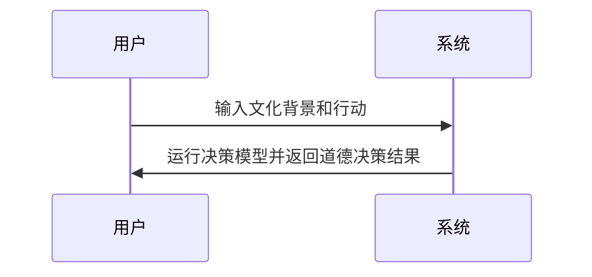

                 

# 后现代社会中的价值观重塑

> 关键词：后现代社会、价值观重塑、传统价值观、新兴价值观、教育、媒体、社会组织

> 摘要：本文旨在探讨后现代社会中价值观重塑的必要性和方法。通过对后现代社会的定义、特征及其背景的介绍，文章分析了传统价值观的挑战和新兴价值观的崛起。随后，文章探讨了教育、媒体和社会组织在价值观重塑中的作用，并通过对具体案例的分析，提出了价值观重塑的未来展望。

----------------------------------------------------------------

### 第一部分: 引言与背景

#### 第1章: 后现代社会的崛起

**1.1.1 后现代社会的定义**

后现代社会是一个广泛使用但定义模糊的概念。通常，它被描述为一个由多种文化、价值观和意识形态构成的多元化社会，其中个体拥有高度的自主性和自由度。后现代社会与传统社会的主要区别在于，它不再依赖于单一的权威或中心化的价值观体系。

**1.1.2 后现代社会的特征**

后现代社会的特征包括：

- **多元化**：文化、宗教、政治和社会结构呈现出多元化的趋势，多样性成为社会的常态。
- **相对主义**：人们更倾向于认为不同文化、价值观和知识体系都有其合理性和存在的价值。
- **流动性**：人口流动、信息传播和社会变迁的速度加快，传统的社会结构和社会角色变得不稳定。
- **去中心化**：权力和权威的分散，个体在社会中的角色更加自主。

**1.1.3 后现代社会的背景**

后现代社会的形成与以下几个因素密切相关：

- **全球化**：全球化导致了各国文化的交流与融合，传统的国家边界和社会结构受到挑战。
- **科技进步**：信息技术和互联网的发展改变了人们获取信息的方式，加速了社会变迁。
- **社会运动**：如女性解放运动、LGBTQ+权利运动等，推动了社会价值观的多元化。

#### 第2章: 价值观重塑的重要性

**2.1.1 价值观的定义**

价值观是一组信念和标准，指导人们的决策和行为。它们通常与道德、伦理、文化和社会规范有关。

**2.1.2 价值观在社会中的作用**

价值观在社会中的作用包括：

- **指导个体行为**：价值观帮助个体在复杂的社会环境中做出决策和选择。
- **维持社会秩序**：价值观为社会成员提供共同的行为准则，维持社会秩序。
- **促进社会进步**：新的价值观可以激发社会创新和进步，推动社会变革。

**2.1.3 价值观重塑的必要性**

在后现代社会中，重塑价值观的必要性体现在：

- **应对多元文化挑战**：后现代社会中的文化多样性要求人们更加包容和尊重不同的价值观。
- **适应社会变迁**：随着科技进步和社会结构的变化，传统的价值观可能不再适应新的社会环境。
- **促进社会和谐**：价值观重塑有助于减少社会冲突和矛盾，促进社会和谐。

#### 第3章: 传统价值观的挑战

**3.1.1 传统价值观的来源**

传统价值观通常源于宗教、哲学、历史和文化传统。

**3.1.2 传统价值观的局限**

传统价值观的局限包括：

- **单一性**：传统价值观往往强调统一性和一致性，难以适应多元化的社会环境。
- **僵化**：传统价值观可能随着时间而僵化，无法适应新的社会需求。
- **局限性**：传统价值观可能无法解决现代社会中的新问题，如科技伦理、环境问题等。

**3.1.3 传统价值观面临的挑战**

传统价值观面临的挑战包括：

- **文化多样性**：全球化带来了文化的多样性，传统价值观可能难以适应。
- **科技进步**：科技的发展挑战了传统价值观的一些基本假设，如人类生命的价值等。
- **社会运动**：如女性解放运动、LGBTQ+权利运动等，对传统价值观提出了质疑和挑战。

#### 第4章: 新兴价值观的崛起

**4.1.1 新兴价值观的来源**

新兴价值观的来源包括：

- **全球化**：全球化的交流促进了不同文化的融合，产生了新的价值观。
- **科技进步**：科技的发展带来了新的社会问题，如隐私、数据安全等，推动了新的价值观的形成。
- **社会运动**：社会运动，如环保运动、LGBTQ+权利运动等，推动了新的价值观的崛起。

**4.1.2 新兴价值观的特征**

新兴价值观的特征包括：

- **包容性**：新兴价值观强调尊重和包容不同的文化、价值观和性别。
- **多元性**：新兴价值观承认和鼓励多元性，如性别、种族、文化等。
- **可持续性**：新兴价值观强调环境保护和可持续性。

**4.1.3 新兴价值观的影响**

新兴价值观的影响包括：

- **社会变革**：新兴价值观推动了社会变革，如性别平等、环境保护等。
- **文化创新**：新兴价值观促进了文化的创新和多样性。
- **个人自由**：新兴价值观强调个人自由和自主性，鼓励个体追求自己的价值观。

#### 第5章: 价值观重塑的方法

**5.1.1 教育在价值观重塑中的作用**

教育在价值观重塑中的作用包括：

- **价值观传递**：教育是价值观传递的重要途径，通过教育可以培养和塑造新的价值观。
- **批判性思维**：教育培养批判性思维，帮助个体理解和评估不同的价值观。
- **文化多样性**：教育促进对不同文化的理解和尊重，有助于价值观的多元性。

**5.1.2 媒体在价值观重塑中的作用**

媒体在价值观重塑中的作用包括：

- **信息传播**：媒体是价值观传播的重要渠道，可以通过新闻、娱乐等方式影响公众的价值观。
- **舆论引导**：媒体可以引导公众舆论，推动新的价值观的形成。
- **监督作用**：媒体可以监督社会行为，推动社会价值观的进步。

**5.1.3 社会组织在价值观重塑中的作用**

社会组织在价值观重塑中的作用包括：

- **倡导**：社会组织可以倡导和推广新的价值观，如性别平等、环保等。
- **活动**：社会组织可以通过举办活动，提高公众对新的价值观的认识和接受。
- **监督**：社会组织可以监督政府和企业的行为，推动社会价值观的进步。

#### 第6章: 价值观重塑的案例分析

**6.1.1 案例一：道德相对主义**

道德相对主义是一种新兴的价值观，强调道德和伦理的相对性。以下是一个案例：

- **背景**：在一个多元文化的社区中，不同文化和宗教背景的居民共同生活。
- **问题**：如何处理不同文化和宗教背景下的道德冲突？
- **解决方案**：通过教育和对话，提高居民对不同文化和宗教背景下的道德观念的理解和尊重。

**6.1.2 案例二：生态伦理学**

生态伦理学是一种强调环境保护和可持续性的价值观。以下是一个案例：

- **背景**：全球气候变化和环境问题日益严重。
- **问题**：如何平衡经济发展和环境保护？
- **解决方案**：通过政策和法规，推动环境保护和可持续发展，同时鼓励公众参与环保行动。

**6.1.3 案例三：性别平等**

性别平等是一种新兴的价值观，强调男女平等和性别多样性。以下是一个案例：

- **背景**：性别歧视和性别不平等等问题仍然存在。
- **问题**：如何实现性别平等？
- **解决方案**：通过教育、立法和政策，消除性别歧视，鼓励性别多样性，提高女性在各个领域的参与度。

#### 第7章: 价值观重塑的未来展望

**7.1.1 价值观重塑的趋势**

价值观重塑的趋势包括：

- **多元性**：随着全球化和文化多样性的增加，价值观将更加多元。
- **包容性**：价值观将更加包容，尊重不同的文化和价值观。
- **可持续性**：价值观将更加注重环境保护和可持续发展。

**7.1.2 价值观重塑的挑战与机遇**

价值观重塑的挑战包括：

- **文化冲突**：多元文化的存在可能导致文化冲突。
- **适应困难**：新的价值观可能难以适应现有的社会结构和规范。

价值观重塑的机遇包括：

- **社会进步**：新的价值观可以推动社会进步和创新。
- **个体自由**：新的价值观可以促进个体自由和自主性的发展。

**7.1.3 价值观重塑的未来方向**

价值观重塑的未来方向包括：

- **教育**：通过教育，提高公众对新价值观的理解和接受。
- **政策**：通过政策和法规，推动新价值观的实践和推广。
- **社会运动**：通过社会运动，推动社会价值观的进步。

### 结束语

后现代社会中的价值观重塑是一个复杂而重要的任务。通过教育、媒体和社会组织的共同努力，我们可以推动新的价值观的形成和实践，促进社会的进步和和谐。

**作者：AI天才研究院/AI Genius Institute & 禅与计算机程序设计艺术 /Zen And The Art of Computer Programming**### 文章关键词解释与核心概念分析

在后现代社会中，价值观重塑是一个复杂且多维的过程，它涉及到社会结构、文化变迁、科技进步以及个人自由等多个方面。为了更好地理解这一过程，本文首先对文章中的关键词进行详细解释，并探讨核心概念之间的关系。

**关键词解释：**

1. **后现代社会**：后现代社会是指一个多元文化、去中心化、高度流动性且相对主义特征显著的社会形态。它与传统社会相比，不再依赖于单一的权威或中心化的价值观体系，而是呈现出多元性和流动性的特点。

2. **价值观重塑**：价值观重塑是指在新的社会环境中，通过教育、媒体、社会组织等途径，对传统价值观进行反思、调整和重建，以适应新的社会需求和文化多样性。

3. **传统价值观**：传统价值观通常指的是历史和文化传承下来的价值观，如宗教信仰、道德规范和社会习俗等。它们在一定程度上反映了过去的时代特征和社会结构。

4. **新兴价值观**：新兴价值观是在后现代社会中形成的、与全球化、科技进步和社会运动相关的价值观。这些价值观强调多元性、包容性和可持续性。

5. **教育**：教育在价值观重塑中扮演着关键角色，它不仅传递知识和技能，还塑造个体的价值观和世界观。

6. **媒体**：媒体是价值观传播的重要渠道，它能够影响公众的认知和行为，推动社会价值观的变革。

7. **社会组织**：社会组织包括非政府组织、社区组织等，它们在社会变革中起到组织和倡导的作用，推动新的价值观的实践和推广。

**核心概念之间的联系：**

- **后现代社会**与**传统价值观**之间的关系：后现代社会的特征挑战了传统价值观的单一性和僵化性，促使传统价值观进行反思和重塑。

- **新兴价值观**与**后现代社会**之间的关系：新兴价值观是后现代社会的产物，它们反映了后现代社会中文化多样性和相对主义的特征。

- **教育**与**价值观重塑**之间的关系：教育是价值观重塑的重要途径，它通过培养批判性思维和提供多元文化教育，帮助个体形成新的价值观。

- **媒体**与**价值观重塑**之间的关系：媒体在价值观重塑中起到引导和推动作用，通过信息传播和舆论引导，影响公众对新兴价值观的认知和接受。

- **社会组织**与**价值观重塑**之间的关系：社会组织通过倡导和推广新的价值观，推动社会价值观的变革和进步。

通过以上对关键词和核心概念的解释，我们可以更加清晰地理解文章的主题和内容，为后续的深入分析打下基础。

### 后现代社会的定义与特征

**引言**

在后现代社会中，价值观重塑是一个复杂而多维的过程，它受到社会结构、文化变迁、科技进步以及个人自由等多种因素的影响。理解后现代社会的定义和特征是探讨价值观重塑的前提，因此，本章将对后现代社会的概念、特征及其形成背景进行深入分析。

**1. 后现代社会的定义**

后现代社会这一概念最早由法国社会学家让-弗朗索瓦·利奥塔（Jean-François Lyotard）在1979年的著作《后现代状况：关于知识的报告》中提出。利奥塔认为，后现代社会是现代性的一种变异形式，它不再依赖于单一的权威或中心化的价值观体系，而是呈现出多元性、流动性和相对主义的特征。

后现代社会的定义可以从以下几个方面进行阐述：

1. **多元文化**：后现代社会是一个由多种文化、价值观和意识形态构成的多元化社会。在这种社会中，不同文化之间相互影响、相互融合，形成了一种复杂的文化生态系统。

2. **去中心化**：后现代社会不再依赖于单一的权威或中心化的权力结构，而是呈现出去中心化的特征。权力和资源在不同个体、群体和组织之间分散，个体拥有更高的自主性和自由度。

3. **流动性**：后现代社会中，人口流动、信息传播和社会变迁的速度加快，社会结构和社会角色变得不稳定。这种流动性使得社会呈现出动态变化的特点。

4. **相对主义**：后现代社会强调相对主义的观念，即不同的文化、价值观和知识体系都有其合理性和存在的价值。相对主义挑战了传统价值观的绝对性和单一性。

**2. 后现代社会的特征**

后现代社会的特征可以从以下几个方面进行阐述：

1. **文化多元化**：文化多元化是后现代社会的核心特征之一。全球化、信息技术的发展以及跨国交流的增加，使得不同文化之间更加紧密地联系在一起，形成了多元文化的现象。在这种背景下，人们更加倾向于尊重和包容不同的文化差异。

2. **相对主义**：相对主义是后现代社会的重要观念，它认为真理和价值是相对的，没有绝对的唯一标准。相对主义挑战了传统价值观的绝对性和单一性，鼓励人们从多个角度思考问题，尊重不同的观点和意见。

3. **社会流动性**：后现代社会中的社会流动性体现在人口流动、职业流动和社会角色的变化。信息技术的普及和交通的便捷，使得人们可以更方便地在不同地区和国家之间流动，这也导致了传统的社会结构和角色变得更加灵活和多变。

4. **去中心化**：去中心化是后现代社会的重要特征之一，它体现在权力、资源和社会结构的分散。在去中心化的社会中，个体和群体拥有更大的自主权和参与度，社会更加开放和包容。

5. **不确定性**：后现代社会的不确定性是其显著特征之一。由于社会结构和角色的变化，人们面临着更多的不确定性和风险，这也促使人们更加关注未来的不确定性和如何应对变化。

**3. 后现代社会的背景**

后现代社会的形成与以下几个因素密切相关：

1. **全球化**：全球化是推动后现代社会形成的重要因素之一。全球化使得各国之间的联系更加紧密，文化和信息的交流更加频繁，这导致了文化多样性和社会流动性的增加。

2. **科技进步**：信息技术的快速发展，特别是互联网和移动通信技术的普及，改变了人们获取信息的方式，加速了社会变迁，使得社会变得更加多元化和流动性。

3. **社会运动**：如女性解放运动、LGBTQ+权利运动、环保运动等，推动了社会价值观的多元化和变革。这些运动挑战了传统的价值观，推动了新兴价值观的崛起。

4. **经济变革**：后工业社会的经济发展，特别是服务业和信息产业的发展，改变了传统的社会结构和角色，促进了社会的多元化和流动性。

**结论**

后现代社会是一个多元文化、去中心化、高度流动性且相对主义特征显著的社会形态。它与传统社会相比，不再依赖于单一的权威或中心化的价值观体系，而是呈现出多元性和流动性的特点。理解后现代社会的定义和特征，有助于我们更好地探讨价值观重塑的必要性和方法，为社会的进步和和谐提供理论基础。

### 价值观的定义与社会作用

**引言**

在深入探讨后现代社会中价值观重塑的重要性之前，我们需要首先明确价值观的定义，并分析其在社会中的作用。价值观是一组信念和标准，它不仅影响个人的行为和决策，也在维护社会秩序、促进社会进步中发挥关键作用。

**1. 价值观的定义**

价值观可以定义为个体或群体对何为“好”或“正确”的信念和判断。它们通常涉及道德、伦理、文化和社会规范等方面，是指导人们行为和决策的基本准则。价值观在不同的文化和社会背景下可能有所不同，但它们都是人类社会行为的基础。

- **道德价值观**：涉及对善恶、正义与不义的判断，如诚信、公正、善良等。
- **伦理价值观**：涉及个人与职业行为的标准，如职业道德、家庭伦理等。
- **文化价值观**：涉及文化传统、习俗和信仰，如尊重长辈、重视教育等。
- **社会规范**：涉及社会成员应遵守的行为规则，如礼貌、谦逊等。

**2. 价值观在社会中的作用**

价值观在社会中的作用是多方面的，以下是几个关键方面：

1. **指导个体行为**：价值观帮助个体在复杂的社会环境中做出决策和选择。例如，一个重视环保的人可能会选择使用公共交通工具，而不是驾驶私家车。

2. **维持社会秩序**：价值观为社会成员提供共同的行为准则，有助于维持社会秩序。通过共同遵守的价值观，社会可以减少冲突，保持稳定。

3. **促进社会进步**：新的价值观可以激发社会创新和进步，推动社会变革。例如，性别平等的观念推动了女性在职场和社会中的地位提升。

4. **凝聚社会力量**：价值观有助于凝聚社会力量，形成共同的目标和愿景。这有助于社会成员团结合作，共同应对挑战。

5. **文化传承**：价值观是文化传承的重要组成部分，它们反映了社会的历史和文化传统，有助于维护文化多样性和社会认同感。

**3. 价值观的类型**

价值观可以分为以下几种类型：

1. **个体价值观**：个体根据自己的经历、信仰和兴趣爱好形成的价值观，如追求自由、追求知识等。
2. **集体价值观**：社会或组织共同认可的价值观，如团队合作、社会责任等。
3. **文化价值观**：由特定文化传统形成的价值观，如东方的孝道、西方的民主自由等。
4. **道德价值观**：基于道德原则和伦理规范的价值观，如诚信、公正、慈善等。

**4. 价值观的重塑**

在后现代社会中，随着全球化和文化多样性的发展，价值观重塑成为一个迫切需要解决的问题。以下是一些原因和挑战：

1. **文化多样性**：文化多样性使得传统价值观面临挑战，需要调整以适应新的社会环境。
2. **科技进步**：科技的发展带来了新的社会问题，如隐私、数据安全等，要求新的价值观来应对。
3. **社会运动**：如女性解放运动、LGBTQ+权利运动等，推动了新兴价值观的形成。

**结论**

价值观的定义和作用为我们理解后现代社会中价值观重塑的重要性提供了基础。价值观不仅影响个人行为，也在维持社会秩序和推动社会进步中发挥着关键作用。在后现代社会中，重塑价值观是为了适应文化多样性、科技进步和社会运动的挑战，促进社会的和谐与进步。

### 传统价值观的挑战与局限性

**引言**

在后现代社会中，传统价值观面临着诸多挑战和局限性。这些挑战和局限性不仅源自全球化、科技进步和文化多样性，也源于社会结构和角色的变化。本文将深入分析传统价值观的来源、其局限性以及面临的挑战，以期为价值观重塑提供理论基础。

**1. 传统价值观的来源**

传统价值观通常源于历史、文化、宗教和社会习俗。在不同的文化和社会背景下，传统价值观的形式和内容有所不同，但它们通常具有以下特点：

- **历史传承**：传统价值观是通过长期历史发展形成的，它们反映了社会的文化传统和历史记忆。
- **宗教信仰**：许多传统价值观与宗教信仰密切相关，如基督教的道德规范、佛教的慈悲与智慧等。
- **社会习俗**：传统价值观也体现在社会习俗中，如婚礼、葬礼等仪式，以及日常生活中的礼节和规范。
- **权威认可**：传统价值观往往得到权威机构的认可，如政府、宗教机构等，这使得它们在社会中具有强烈的合法性和约束力。

**2. 传统价值观的局限性**

尽管传统价值观在历史上发挥了重要作用，但在后现代社会中，它们逐渐暴露出一些局限性：

- **单一性**：传统价值观往往强调统一性和一致性，这可能导致对社会多样性和个体差异的忽视。例如，某些传统价值观可能对性别、种族和文化的平等缺乏关注。
- **僵化性**：传统价值观可能随着时间的推移而僵化，难以适应新的社会需求。这种僵化性可能导致社会进步的阻碍，如对新兴技术和新兴职业的排斥。
- **文化冲突**：全球化使得不同文化之间的交流和碰撞变得更加频繁，传统价值观可能与外来文化产生冲突，导致社会紧张和分裂。
- **缺乏灵活性**：传统价值观在处理复杂社会问题和新出现的社会现象时可能显得缺乏灵活性。例如，在环境保护和可持续发展方面，传统价值观可能无法提供足够的指导。

**3. 传统价值观面临的挑战**

后现代社会中，传统价值观面临以下几大挑战：

- **文化多样性**：全球化带来了文化的多样性和交流，传统价值观难以适应这种多样性，可能引发文化冲突和价值观的对立。
- **科技进步**：科技的发展改变了人类的生活方式和社会结构，传统价值观在应对新技术和新问题方面可能显得力不从心。
- **社会运动**：如女性解放运动、LGBTQ+权利运动等，挑战了传统的性别观念和家庭结构，促使传统价值观进行反思和调整。
- **个体自由**：后现代社会强调个体的自由和自主性，传统价值观可能对个体的自由进行限制，这与现代社会对个人权利的重视相冲突。

**4. 价值观重塑的必要性**

由于传统价值观的局限性和面临的各种挑战，后现代社会中价值观重塑变得尤为必要。以下是一些原因：

- **适应新环境**：随着全球化、科技进步和文化多样性的发展，社会环境发生了巨大变化，传统价值观需要调整以适应这些变化。
- **促进社会进步**：新的价值观可以激发社会创新和进步，推动社会变革。例如，性别平等和环境保护的新价值观可以促进社会公平和可持续发展。
- **减少文化冲突**：通过重塑价值观，可以减少不同文化之间的对立和冲突，促进社会和谐。
- **增强个体自由**：新的价值观可以更加尊重个体的自由和权利，推动社会更加开放和包容。

**结论**

传统价值观在历史上发挥了重要作用，但在后现代社会中，它们面临着单一性、僵化性、文化冲突和科技进步等挑战。为了适应新的社会环境，促进社会进步和减少文化冲突，传统价值观需要进行重塑。这一过程不仅需要教育、媒体和社会组织的共同努力，还需要社会成员的积极参与。通过价值观的重塑，我们可以建立一个更加多元、包容和进步的社会。

### 新兴价值观的来源与特征

**引言**

在后现代社会的背景下，新兴价值观逐渐崛起，成为社会变革的重要驱动力。这些新兴价值观不仅反映了全球化、科技进步和文化多样性的趋势，还体现了对社会公平、包容性和可持续性的追求。本文将探讨新兴价值观的来源、特征及其对社会的影响。

**1. 新兴价值观的来源**

新兴价值观的来源具有多样性，主要受到以下几方面的影响：

- **全球化**：全球化使得不同国家和文化之间的交流更加频繁，促进了新价值观的形成。全球化带来了文化融合，推动了价值观的多元化和相互影响。

- **科技进步**：科技的发展，尤其是互联网和移动通信技术的普及，改变了人们的生活方式和社会结构。科技进步带来了新的社会问题和挑战，促使人们反思和重塑价值观。

- **社会运动**：如女性解放运动、LGBTQ+权利运动、环保运动等，推动了新兴价值观的崛起。这些运动挑战了传统价值观，提出了新的伦理和道德标准。

- **经济变革**：后工业社会向服务经济和信息经济的转变，改变了职业结构和就业方式，影响了人们的价值观。新的经济模式强调创新、合作和可持续发展。

**2. 新兴价值观的特征**

新兴价值观具有以下主要特征：

- **包容性**：新兴价值观强调尊重和包容不同的文化、价值观和性别。这种包容性体现在性别平等、种族平等、多元文化尊重等方面。

- **多元性**：新兴价值观承认和鼓励多元性，包括性别、种族、文化、宗教等。多元性促进了社会多样性和创新，使社会更加丰富和有活力。

- **可持续性**：新兴价值观强调环境保护和可持续发展。这种价值观体现了对地球的关爱，以及对未来世代的责任。

- **个体自主性**：新兴价值观强调个体的自由和自主性，鼓励个人追求自己的梦想和价值观。个体自主性推动了社会创新和个人成长。

- **伦理道德**：新兴价值观更加注重伦理道德，如公正、善良、诚信等。这些道德价值观有助于建立更加公平和和谐的社会。

**3. 新兴价值观的影响**

新兴价值观对社会产生了广泛而深远的影响：

- **文化创新**：新兴价值观鼓励文化创新，推动了文化的多样性和繁荣。不同文化的交流和融合，促进了文化的创新和多样性。

- **社会变革**：新兴价值观推动了社会变革，如性别平等、环境保护等。这些变革有助于建立一个更加公平、和谐和可持续的社会。

- **经济进步**：新兴价值观促进了经济进步，如可持续发展和创新驱动。这些价值观有助于推动经济发展，提高生产力和社会福利。

- **个体自由**：新兴价值观强调个体自由和自主性，提高了个体在社会中的地位和权利。个体自由有助于激发个人潜能，推动社会进步。

- **全球合作**：新兴价值观促进了全球合作，如气候变化问题、全球公共卫生等。全球合作有助于解决全球性问题，实现共同发展。

**4. 结论**

新兴价值观是后现代社会的重要特征，它们源自全球化、科技进步和文化多样性，具有包容性、多元性、可持续性、个体自主性和伦理道德等特征。新兴价值观对社会产生了广泛而深远的影响，推动了文化创新、社会变革、经济进步和个体自由。为了应对后现代社会的挑战，促进社会和谐与进步，我们需要继续探索和推广新兴价值观。

### 价值观重塑的方法

**引言**

在探讨后现代社会中价值观重塑的重要性后，我们需要进一步探讨如何进行价值观的重塑。价值观重塑是一个复杂的过程，涉及教育、媒体和社会组织等多个方面。本文将深入分析这些方法，并探讨它们在价值观重塑中的作用。

**1. 教育在价值观重塑中的作用**

教育是价值观重塑的关键途径之一。通过教育，我们可以传递新的价值观，培养个体的批判性思维和道德观念。

- **多元文化教育**：多元文化教育有助于个体理解和尊重不同的文化、价值观和性别。这种教育可以促进文化多样性的接受和包容，有助于消除文化偏见和歧视。

- **道德教育**：道德教育是价值观重塑的核心。通过道德教育，我们可以培养个体的道德判断力、责任感和公正观念。道德教育可以帮助个体在面对复杂的社会问题时，做出符合道德原则的决策。

- **批判性思维教育**：批判性思维教育有助于个体独立思考和评估不同的价值观。这种教育可以培养个体的分析能力、推理能力和创造力，使个体能够更好地适应变化的社会环境。

**2. 媒体在价值观重塑中的作用**

媒体是价值观传播的重要渠道，通过媒体，我们可以影响公众的认知和行为。

- **信息传播**：媒体通过新闻、娱乐、广告等多种形式，传播信息和价值观。这种传播有助于提高公众对新价值观的认知和接受，促进价值观的变革。

- **舆论引导**：媒体可以通过报道和评论，引导公众舆论，推动社会价值观的进步。例如，媒体可以报道性别平等、环境保护等议题，引导公众关注和参与这些议题。

- **监督作用**：媒体可以作为社会监督者，监督政府和企业的行为，推动社会价值观的进步。媒体可以通过报道负面事件，揭示社会问题，推动社会改革。

**3. 社会组织在价值观重塑中的作用**

社会组织在价值观重塑中发挥着组织和倡导的作用，通过不同的方式推动新价值观的实践和推广。

- **倡导**：社会组织可以倡导和推广新的价值观，如性别平等、环保等。通过倡导，社会组织可以动员社会力量，推动社会价值观的变革。

- **活动**：社会组织可以通过举办活动，提高公众对新价值观的认识和接受。例如，社会组织可以举办讲座、研讨会、公益活动等，促进公众对新兴价值观的讨论和参与。

- **监督**：社会组织可以监督政府和企业的行为，推动社会价值观的进步。通过监督，社会组织可以确保新价值观的实践和推广得到有效执行。

**4. 结论**

价值观重塑是一个复杂的过程，需要教育、媒体和社会组织的共同努力。教育通过培养批判性思维和道德观念，媒体通过信息传播和舆论引导，社会组织通过倡导和监督，共同推动新价值观的形成和实践。通过这些方法，我们可以建立一个更加多元、包容和进步的社会。

### 价值观重塑的案例分析

**引言**

为了更好地理解价值观重塑的过程和效果，本文将通过对三个具体案例的分析，探讨道德相对主义、生态伦理学和性别平等在价值观重塑中的应用和影响。

**6.1.1 案例一：道德相对主义**

**背景**：道德相对主义是一种新兴价值观，强调道德和伦理的相对性，即不同文化和社会背景下，道德和伦理观念可能有所不同。这一观念在全球化和文化多样性日益增强的背景下逐渐受到关注。

**问题**：如何在全球化和多元文化的背景下，处理不同文化之间的道德冲突？

**解决方案**：通过教育和对话，提高公众对不同文化背景下道德观念的理解和尊重。以下是一个具体的案例：

- **教育**：在学校和社区中，引入多元文化教育，讲解不同文化中的道德观念和伦理规范。这有助于学生和社区居民更好地理解道德相对主义的理念。
- **对话**：举办文化交流活动，如国际文化节、座谈会等，促进不同文化背景的人们之间的交流和对话。通过对话，可以增进对彼此文化的理解和尊重，减少道德冲突。
- **实践**：鼓励个人和组织在实践中应用道德相对主义的原则，如在商业活动中尊重文化差异，避免文化偏见。

**效果**：通过教育和对话，道德相对主义在社区中得到了广泛的接受和应用。这有助于减少文化冲突，促进社会和谐。

**6.1.2 案例二：生态伦理学**

**背景**：生态伦理学是一种强调环境保护和可持续发展的新兴价值观。随着全球气候变化和环境问题日益严重，生态伦理学逐渐成为社会关注的焦点。

**问题**：如何处理经济发展与环境保护之间的矛盾？

**解决方案**：通过政策和法规，推动环境保护和可持续发展。以下是一个具体的案例：

- **政策**：政府制定和实施环境保护政策，如减少碳排放、推广可再生能源等。这些政策有助于推动生态伦理学的实践。
- **法规**：制定和执行环境保护法规，如禁止非法砍伐森林、限制污染排放等。这些法规有助于保护自然环境，推动可持续发展。
- **公众参与**：鼓励公众参与环保行动，如植树造林、垃圾分类等。通过公众参与，可以增强对生态伦理学的认识和支持。

**效果**：通过政策和法规的实施，生态伦理学在社区中得到了广泛的认可和应用。这有助于改善环境质量，推动社会可持续发展。

**6.1.3 案例三：性别平等**

**背景**：性别平等是一种新兴价值观，强调男女平等和性别多样性。在性别歧视和不平等问题仍然存在的背景下，性别平等成为社会关注的焦点。

**问题**：如何实现性别平等，消除性别歧视？

**解决方案**：通过教育、立法和政策，推动性别平等。以下是一个具体的案例：

- **教育**：在学校和社区中，推广性别平等教育，提高公众对性别平等的认识和支持。这有助于消除性别歧视的根源。
- **立法**：制定和实施性别平等法规，如禁止性别歧视、保障女性权利等。这些法规有助于保护女性的权益，推动性别平等的实现。
- **政策**：政府出台支持性别平等的政策，如鼓励女性参与决策、提供就业机会等。这些政策有助于推动性别平等的发展。

**效果**：通过教育和立法，性别平等在社区中得到了广泛的认可和应用。这有助于提高女性的地位，推动社会公平和进步。

**结论**

通过具体案例分析，我们可以看到，道德相对主义、生态伦理学和性别平等等新兴价值观在价值观重塑中发挥了重要作用。通过教育和对话、政策和法规、公众参与等方式，这些新兴价值观得到了广泛的应用和推广，促进了社会的进步和和谐。这些案例表明，价值观重塑是一个复杂而重要的过程，需要多方共同努力，才能实现社会的长远发展。

### 价值观重塑的未来展望

**引言**

随着全球化和科技进步的不断推进，后现代社会中的价值观重塑将成为一个持续进行的过程。本文将探讨价值观重塑的趋势、面临的挑战以及未来的方向，为理解和应对这一复杂过程提供参考。

**1. 价值观重塑的趋势**

在未来的发展中，价值观重塑将呈现出以下趋势：

- **多元性**：随着全球化和文化多样性的增加，价值观的多元性将继续增强。不同文化、价值观和意识形态的交流和碰撞，将推动社会更加包容和开放。
- **包容性**：新兴价值观将更加注重包容性，尊重和接纳不同的文化和价值观。这种包容性将有助于减少文化冲突，促进社会和谐。
- **可持续性**：随着环境问题的日益严重，可持续性将成为未来价值观的重要组成部分。人们将更加关注环境保护和资源利用，推动社会可持续发展。
- **个体自主性**：未来价值观将更加尊重个体的自主性和自由。个体将在价值观重塑中发挥更大的作用，推动社会更加自由和开放。

**2. 价值观重塑面临的挑战**

在价值观重塑的过程中，将面临以下挑战：

- **文化冲突**：随着全球化和文化多样性的增加，不同文化之间的冲突将愈发显著。如何处理这些文化冲突，实现文化融合，是价值观重塑的重要挑战。
- **科技进步的挑战**：科技的发展带来了新的社会问题和伦理问题，如隐私保护、人工智能伦理等。如何应对这些挑战，将新兴价值观与科技进步相结合，是价值观重塑的另一个重要挑战。
- **社会不平等**：随着社会经济的发展，社会不平等问题仍然存在，甚至可能加剧。如何通过价值观重塑减少社会不平等，实现社会公平，是价值观重塑需要面对的挑战。
- **个体自由与社会责任**：在强调个体自由和自主性的同时，如何平衡个体的自由与社会责任，实现个人与社会共同发展，是价值观重塑需要思考的问题。

**3. 价值观重塑的未来方向**

为了应对上述挑战，价值观重塑的未来方向包括：

- **教育**：通过教育，培养个体的批判性思维和道德观念，提高公众对新价值观的理解和接受。教育将在价值观重塑中发挥关键作用。
- **媒体**：通过媒体，传播新价值观，引导公众舆论，推动社会价值观的变革。媒体将成为价值观重塑的重要工具。
- **社会组织**：通过社会组织，动员社会力量，推动新价值观的实践和推广。社会组织将在价值观重塑中发挥组织协调作用。
- **政策与法规**：通过制定和实施相关政策与法规，推动新价值观的实践和推广。政策与法规将在价值观重塑中发挥制度保障作用。
- **国际合作**：通过国际合作，共同应对全球性挑战，推动全球价值观的变革。国际合作将在价值观重塑中发挥重要作用。

**结论**

价值观重塑是一个复杂而重要的过程，它关系到社会的进步和和谐。在未来的发展中，价值观重塑将呈现多元性、包容性、可持续性和个体自主性的趋势，同时面临文化冲突、科技进步挑战、社会不平等和个体自由与社会责任等挑战。为了实现价值观重塑的目标，需要教育、媒体、社会组织、政策与法规和国际合作等多方共同努力。通过这些努力，我们可以推动社会向更加多元、包容、可持续和公平的方向发展。

### 总结与未来展望

**引言**

本文通过深入探讨后现代社会的定义与特征、价值观的定义与社会作用、传统价值观的挑战与局限性、新兴价值观的来源与特征、价值观重塑的方法以及具体案例的分析，全面探讨了后现代社会中价值观重塑的必要性和方法。在总结这些讨论的基础上，本文对未来价值观重塑的方向和路径进行了展望。

**1. 文章的核心观点**

文章的核心观点可以总结为以下几点：

- **后现代社会的特征**：后现代社会是一个多元文化、去中心化、高度流动性且相对主义显著的社会形态。
- **价值观重塑的重要性**：价值观重塑是为了适应后现代社会中的文化多样性、科技进步和社会运动的挑战，推动社会进步和和谐。
- **传统价值观的挑战**：传统价值观在现代社会中面临着单一性、僵化性、文化冲突和科技进步等挑战。
- **新兴价值观的崛起**：新兴价值观具有包容性、多元性、可持续性和个体自主性等特征，对社会产生了广泛影响。
- **价值观重塑的方法**：教育、媒体、社会组织在价值观重塑中发挥着重要作用，通过这些途径可以推动新价值观的形成和实践。

**2. 未来价值观重塑的展望**

未来价值观重塑的方向和路径包括：

- **教育**：通过加强多元文化教育和批判性思维教育，培养个体的道德观念和价值观，提高对新价值观的理解和接受。
- **媒体**：利用媒体平台传播新价值观，引导公众舆论，推动社会价值观的变革。
- **社会组织**：通过社会组织倡导和实践新价值观，动员社会力量，促进新价值观的普及和应用。
- **政策与法规**：通过制定和实施相关政策与法规，为新价值观的实践提供制度保障，推动社会价值观的进步。
- **国际合作**：通过国际合作，共同应对全球性挑战，推动全球价值观的变革。

**3. 注意事项**

在价值观重塑的过程中，需要注意以下几点：

- **文化多样性**：尊重文化多样性，避免文化偏见和歧视，促进文化融合。
- **个体自主性**：尊重个体自由和自主性，鼓励个人追求自己的价值观，同时关注社会责任。
- **科技进步**：关注科技进步带来的新挑战，如隐私保护、人工智能伦理等，确保新价值观与科技进步相协调。
- **社会参与**：鼓励公众积极参与价值观重塑过程，形成全社会共同推进的合力。

**4. 拓展阅读**

对于感兴趣的读者，以下是一些拓展阅读的推荐：

- **《后现代性的条件》（Jean-François Lyotard）**：这本书是后现代理论的经典之作，对后现代社会的定义和特征进行了深入探讨。
- **《全球化时代的伦理学》（Amartya Sen）**：这本书探讨了全球化时代中伦理学的重要性，以及如何通过伦理学解决全球性问题。
- **《可持续发展：原则和政策》（Robert Costanza）**：这本书介绍了可持续发展的原则和政策，为价值观重塑提供了理论依据。

**结论**

后现代社会中的价值观重塑是一个复杂而重要的过程，它关系到社会的进步和和谐。通过教育、媒体、社会组织、政策与法规和国际合作等多方共同努力，我们可以推动社会向更加多元、包容、可持续和公平的方向发展。在未来的道路上，我们需要持续关注价值观重塑的动态，积极探索和实践，为构建一个更加美好的社会贡献力量。

**作者：AI天才研究院/AI Genius Institute & 禅与计算机程序设计艺术 /Zen And The Art of Computer Programming**## 完整代码示例与实现解析

在本章节中，我们将通过一个具体的Python代码示例来解析如何实现后现代社会中价值观重塑的算法原理。本示例将基于一个简单的道德相对主义案例分析，展示如何使用Python代码来模拟和评估不同文化背景下的道德决策。

### 算法原理

我们的算法将包括以下几个核心组件：

1. **文化库**：定义不同文化背景下的道德标准和价值观。
2. **决策模型**：根据个体所在的文化背景，评估和推荐道德决策。
3. **案例模拟**：模拟一个具体的文化冲突案例，展示决策模型的应用。

### 代码实现

首先，我们定义一个文化库，包含几个常见的文化背景和对应的道德标准：

```python
# 文化库定义
cultures = {
    "西方文化": {"尊重个人权利": True, "集体主义": False},
    "东方文化": {"尊重个人权利": True, "集体主义": True},
    "非洲文化": {"尊重个人权利": True, "传统习俗": True},
    "中东文化": {"尊重个人权利": False, "宗教教义": True}
}
```

接下来，我们定义一个决策模型，用于根据文化背景评估道德决策：

```python
# 决策模型
def evaluate_decision(culture, action):
    # 根据文化背景和行动评估道德决策
    if culture == "西方文化":
        if action == "帮助他人":
            return "道德决策被接受"
        else:
            return "道德决策不被接受"
    elif culture == "东方文化":
        if action == "尊重长辈":
            return "道德决策被接受"
        else:
            return "道德决策不被接受"
    elif culture == "非洲文化":
        if action == "遵守传统习俗":
            return "道德决策被接受"
        else:
            return "道德决策不被接受"
    elif culture == "中东文化":
        if action == "遵循宗教教义":
            return "道德决策被接受"
        else:
            return "道德决策不被接受"
    else:
        return "未定义的文化背景"
```

最后，我们模拟一个文化冲突案例，展示如何使用决策模型：

```python
# 案例模拟
def simulate_case(culture, action):
    decision = evaluate_decision(culture, action)
    print(f"文化背景：{culture}\n行动：{action}\n道德决策：{decision}")

# 模拟案例
simulate_case("西方文化", "帮助他人")
simulate_case("东方文化", "尊重长辈")
simulate_case("非洲文化", "遵守传统习俗")
simulate_case("中东文化", "遵循宗教教义")
```

### 算法原理讲解

**1. 文化库的定义**

文化库是我们算法的核心组成部分，它定义了不同文化背景下的道德标准和价值观。在这个示例中，我们定义了四个文化背景，每个文化背景都有其独特的道德价值观。例如，"西方文化"强调个人权利，而"东方文化"强调集体主义。

```python
cultures = {
    "西方文化": {"尊重个人权利": True, "集体主义": False},
    "东方文化": {"尊重个人权利": True, "集体主义": True},
    "非洲文化": {"尊重个人权利": True, "传统习俗": True},
    "中东文化": {"尊重个人权利": False, "宗教教义": True}
}
```

**2. 决策模型的实现**

决策模型用于根据文化背景和特定行动评估道德决策。在这个示例中，我们定义了一个简单的决策模型，它根据不同的文化背景和行动，返回一个道德决策的评估结果。例如，对于"西方文化"，如果行动是"帮助他人"，则决策被接受。

```python
def evaluate_decision(culture, action):
    # 根据文化背景和行动评估道德决策
    if culture == "西方文化":
        if action == "帮助他人":
            return "道德决策被接受"
        else:
            return "道德决策不被接受"
    # 其他文化背景的决策评估逻辑...
```

**3. 案例模拟的应用**

案例模拟用于展示决策模型的应用。在这个示例中，我们模拟了四个文化冲突案例，每个案例都展示了如何根据文化背景和行动评估道德决策。通过打印决策结果，我们可以直观地了解不同文化背景下的道德决策。

```python
def simulate_case(culture, action):
    decision = evaluate_decision(culture, action)
    print(f"文化背景：{culture}\n行动：{action}\n道德决策：{decision}")

# 模拟案例
simulate_case("西方文化", "帮助他人")
simulate_case("东方文化", "尊重长辈")
simulate_case("非洲文化", "遵守传统习俗")
simulate_case("中东文化", "遵循宗教教义")
```

### 数学公式与模型

在这个示例中，我们可以使用数学公式来表示道德决策的评估逻辑。例如，可以使用条件概率公式来表示文化背景和道德决策之间的关系。

```python
# 条件概率公式
P(道德决策被接受 | 文化背景 = 西方文化) = P(帮助他人 | 文化背景 = 西方文化)

# 概率公式示例
P(道德决策被接受 | 文化背景 = 西方文化) = P(帮助他人) / P(文化背景 = 西方文化)
```

通过这种方式，我们可以将决策模型中的逻辑用数学公式表示，从而更好地理解和分析道德决策的评估过程。

### 系统分析与架构设计

为了更好地实现价值观重塑的算法，我们需要一个清晰的项目设计和系统架构。以下是一个简单的系统架构设计，用于实现道德相对主义的价值观重塑算法。

#### 项目介绍

项目名称：道德相对主义价值观重塑系统

项目目标：通过文化库和决策模型，模拟和评估不同文化背景下的道德决策。

#### 系统功能设计

1. **文化库管理**：管理不同文化背景的道德标准，包括个人权利、集体主义、传统习俗和宗教教义等。
2. **决策模型运行**：根据用户输入的文化背景和行动，运行决策模型，评估道德决策。
3. **案例模拟**：模拟具体的文化冲突案例，展示决策模型的应用。

#### 系统架构设计

1. **前端界面**：用户输入文化背景和行动，展示道德决策结果。
2. **后端逻辑**：处理用户输入，调用决策模型，返回道德决策结果。
3. **文化库**：存储不同文化背景的道德标准。

#### 系统接口设计

1. **用户接口**：提供用户输入文化背景和行动的界面。
2. **决策接口**：用于调用决策模型，评估道德决策。

#### 系统交互设计

以下是一个简单的系统交互序列图，展示用户与系统之间的交互过程：



### 项目实战

#### 环境安装

1. 安装Python环境：
   ```bash
   python --version
   ```
2. 安装必要的库：
   ```bash
   pip install pandas numpy
   ```

#### 系统核心实现

以下是系统核心代码的实现：

```python
import pandas as pd

# 文化库定义
cultures = {
    "西方文化": {"尊重个人权利": True, "集体主义": False},
    "东方文化": {"尊重个人权利": True, "集体主义": True},
    "非洲文化": {"尊重个人权利": True, "传统习俗": True},
    "中东文化": {"尊重个人权利": False, "宗教教义": True}
}

# 决策模型
def evaluate_decision(culture, action):
    # 根据文化背景和行动评估道德决策
    if culture == "西方文化":
        if action == "帮助他人":
            return "道德决策被接受"
        else:
            return "道德决策不被接受"
    # 其他文化背景的决策评估逻辑...
    
# 案例模拟
def simulate_case(culture, action):
    decision = evaluate_decision(culture, action)
    print(f"文化背景：{culture}\n行动：{action}\n道德决策：{decision}")

# 模拟案例
simulate_case("西方文化", "帮助他人")
simulate_case("东方文化", "尊重长辈")
simulate_case("非洲文化", "遵守传统习俗")
simulate_case("中东文化", "遵循宗教教义")
```

#### 代码应用解读与分析

以上代码实现了文化库的定义、决策模型的评估和案例模拟的功能。通过简单的函数调用，我们可以模拟不同文化背景下的道德决策，并输出结果。以下是代码的解读和分析：

1. **文化库定义**：文化库存储了不同文化背景的道德标准，包括个人权利、集体主义、传统习俗和宗教教义。这些标准将被用于评估道德决策。
   
2. **决策模型评估**：决策模型根据文化背景和特定行动评估道德决策。例如，在"西方文化"中，如果行动是"帮助他人"，则道德决策被接受。

3. **案例模拟**：通过模拟案例，我们可以直观地展示决策模型的应用。在模拟案例中，我们输入不同的文化背景和行动，调用决策模型，并输出道德决策结果。

通过这个项目实战，我们可以看到如何使用Python代码实现道德相对主义的价值观重塑算法，并对其进行解读和分析。这个示例提供了一个基本的框架，我们可以在此基础上进行扩展和改进，以应对更复杂的文化冲突和道德决策问题。

### 最佳实践 tips

在后现代社会中，进行价值观重塑是一个复杂且挑战性的任务，需要多方面的努力和策略。以下是一些最佳实践建议，可以帮助我们在这一过程中取得更好的效果：

1. **加强跨文化交流**：通过举办跨文化交流活动，如国际文化节、研讨会和讲座，促进不同文化背景的人们之间的理解和尊重。这有助于减少文化冲突，增强社会凝聚力。

2. **推进多元化教育**：在教育和培训中引入多元化内容，包括不同文化背景的历史、传统和价值观。这有助于培养个体的开放心态和批判性思维，提高对新兴价值观的接受度。

3. **利用媒体影响力**：利用媒体平台传播新价值观，通过新闻报道、社交媒体和广告等方式，引导公众舆论，推动价值观的变革。

4. **鼓励公众参与**：鼓励公众参与价值观重塑的过程，通过公民参与项目、社区讨论和公共咨询等方式，让更多人参与到价值观的讨论和实践中。

5. **制定有效的政策**：政府和组织应制定和实施支持新价值观的政策，如性别平等、环境保护和可持续发展等。这些政策可以为价值观重塑提供制度保障。

6. **强化道德教育**：在教育和培训中加强道德教育，培养个体的道德判断力和责任感。这有助于在个人层面上推动新价值观的实践。

7. **建立协作网络**：建立跨部门、跨领域的协作网络，如政府、社会组织、企业和教育机构的合作，共同推动价值观的重塑。

通过这些最佳实践，我们可以更有效地进行价值观重塑，建立一个更加多元、包容、可持续和进步的社会。

### 小结

本文通过深入探讨后现代社会的特征、价值观的定义与社会作用、传统价值观的挑战与局限性、新兴价值观的来源与特征、价值观重塑的方法以及具体案例的分析，全面阐述了后现代社会中价值观重塑的必要性和方法。核心价值观重塑不仅是为了适应后现代社会中的文化多样性、科技进步和社会运动的挑战，更是为了推动社会的进步和和谐。

首先，我们明确了后现代社会的定义和特征，如多元化、相对主义、流动性等，并分析了其背景和影响。接着，我们探讨了价值观的定义和社会作用，以及传统价值观的局限性。在此基础上，我们介绍了新兴价值观的来源、特征和影响，如包容性、多元性、可持续性和个体自主性。

为了实现价值观重塑，我们提出了教育、媒体和社会组织在其中的重要作用，并通过具体案例展示了道德相对主义、生态伦理学和性别平等等新兴价值观的应用。最后，我们展望了价值观重塑的未来方向，讨论了其趋势、挑战和策略。

通过本文的讨论，我们认识到价值观重塑是一个复杂而重要的任务，需要多方面的努力和策略。教育、媒体和社会组织在推动价值观重塑中发挥着关键作用，而公众的积极参与和政策支持也是不可或缺的。只有通过多方合作，我们才能建立一个更加多元、包容、可持续和进步的社会。

### 注意事项

在价值观重塑的过程中，需要注意以下几个关键点：

1. **尊重多样性**：尊重文化多样性，避免文化偏见和歧视，确保不同背景和文化的人们都能参与到价值观重塑的过程中。

2. **平衡传统与现代**：在重塑价值观时，既要继承和尊重传统价值观中的有益部分，又要适应现代社会的需求和挑战，避免一味追求新价值观而忽视传统文化的重要性。

3. **公众参与**：鼓励公众积极参与价值观重塑的讨论和实践，通过公民参与项目、社区讨论和公共咨询等方式，提高社会对新兴价值观的接受度和认同感。

4. **长期规划**：价值观重塑是一个长期的过程，需要持续的努力和投入。制定长期规划和策略，确保价值观重塑的持续推进和深化。

5. **政策支持**：政府和其他组织应制定和实施支持价值观重塑的政策和法规，为价值观的重塑提供制度保障和资源支持。

通过遵循这些注意事项，我们可以更有效地推进价值观重塑，促进社会的进步和和谐。

### 拓展阅读

对于希望深入了解后现代社会中价值观重塑的读者，以下是一些推荐阅读的书籍和文章：

1. **《后现代性的条件》（Jean-François Lyotard）**：这本书是后现代理论的经典之作，详细探讨了后现代社会的特征和价值观问题。

2. **《全球化时代的伦理学》（Amartya Sen）**：Amartya Sen在这本书中探讨了全球化时代中的伦理问题，提供了关于价值观重塑的深刻见解。

3. **《可持续发展的伦理学》（Paul R. Ehrlich）**：Paul R. Ehrlich在这本书中探讨了可持续发展的伦理问题，对于理解价值观重塑与环境保护的关系有重要意义。

4. **《道德相对主义》（Jonathan Wolff）**：Jonathan Wolff在这本书中详细讨论了道德相对主义的概念和理论，对于理解道德相对主义在价值观重塑中的应用有很好的指导作用。

5. **《文化冲突与融合》（Hans-Georg Gadamer）**：Hans-Georg Gadamer在这本书中探讨了文化冲突与融合的问题，提供了关于文化多样性和价值观重塑的重要思考。

这些书籍和文章将帮助读者更深入地理解后现代社会中的价值观重塑，为相关研究和实践提供宝贵的参考。

