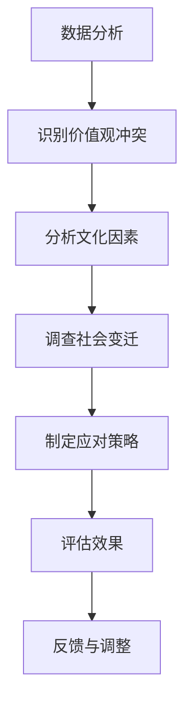
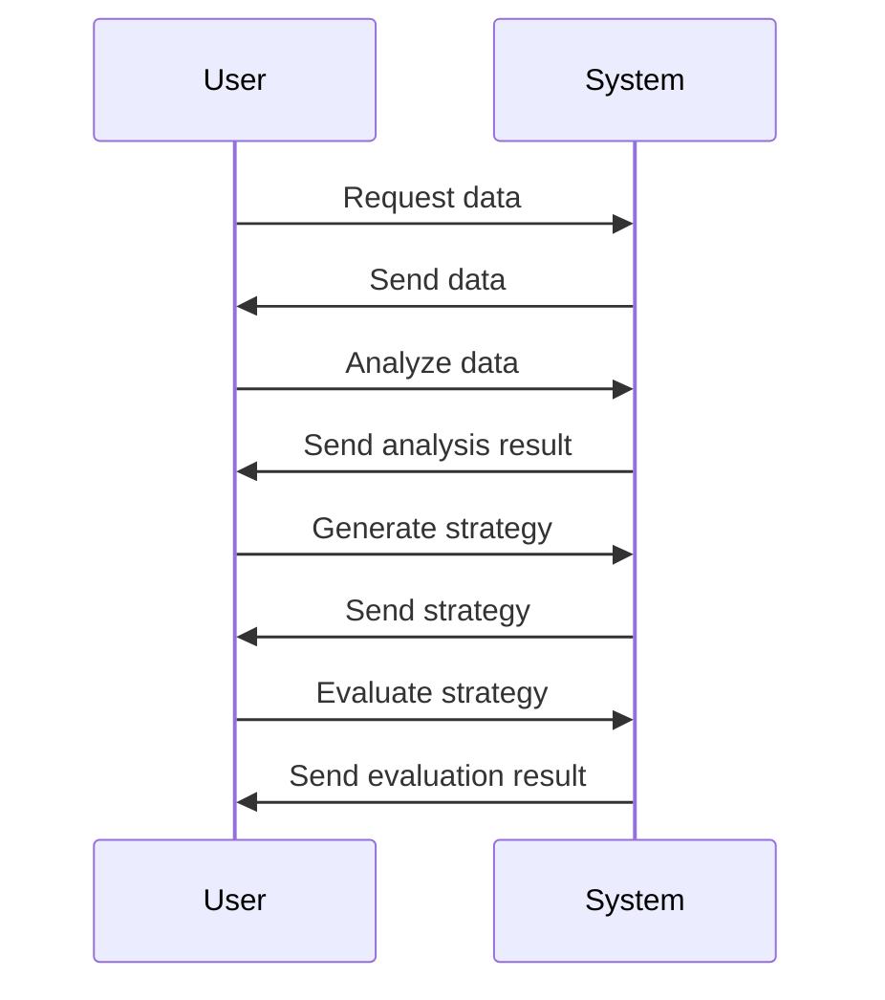

                 

# 后现代社会的价值观危机

> 关键词：后现代主义、价值观危机、多元文化、相对主义、批判性思维

> 摘要：在后现代社会中，价值观危机成为一个重要的议题。本文将分析价值观危机的成因、表现形式及影响，并探讨应对策略，为解决这一问题提供思路。

## **第一步：背景介绍**

### **问题背景**

在后现代社会的语境中，“价值观危机”是一个广泛探讨的议题。随着全球化的深入发展，多元文化的碰撞与融合，传统价值观念受到前所未有的挑战。社会变迁、科技发展、经济波动等多重因素导致人们对道德规范、社会伦理、人生观等方面的认同出现分歧，甚至产生困惑。

### **问题描述**

本文旨在探讨后现代社会的价值观危机，分析其成因、表现形式及影响，并试图提出相应的应对策略。具体而言，我们将关注以下几个方面：

1. **传统价值观的变迁与后现代文化的冲击**：随着后现代文化的兴起，传统价值观面临着巨大的冲击和挑战。
2. **社会价值观的多元性与冲突**：在多元文化的背景下，不同价值观之间的冲突愈发明显，如何协调和融合成为一个难题。
3. **个人价值观的迷茫与重塑**：在后现代社会中，个体面临诸多选择和挑战，如何树立正确的价值观成为一个重要问题。
4. **教育与媒体在后现代价值观危机中的作用**：教育体系和媒体在价值观危机中扮演着重要角色，如何发挥积极作用成为一个关键问题。

### **问题解决**

解决后现代社会的价值观危机，需要从多个层面入手：

1. **增强对传统文化和价值观的认同感，同时包容多元文化**：尊重不同文化的差异，促进文化交流和互鉴。
2. **提高公众对价值观念的辨析能力，培养批判性思维**：培养人们对价值观念的独立思考和判断能力，提高社会的整体素质。
3. **加强家庭教育和社会教育，引导人们树立正确的价值观**：家庭教育和社会教育是价值观塑造的重要环节，需要加强引导和培养。
4. **媒体应承担起社会责任，传播正能量，促进社会和谐**：媒体作为信息传播的重要渠道，应发挥正能量，引导公众树立正确的价值观。

### **边界与外延**

后现代社会的价值观危机是一个广泛而复杂的议题，其边界涉及多个领域，如哲学、社会学、心理学、教育学等。同时，它也关乎每个人的日常生活，因此其外延非常广泛。

### **概念结构与核心要素组成**

#### **后现代主义**

后现代主义是一种文化、文学和思想运动，强调对传统价值和理性的质疑，主张多元性、相对主义和去中心化。它是后现代社会的理论基础。

#### **价值观**

价值观是指个体或社会对于何为“正确”或“错误”的认知和判断。在后现代社会中，价值观呈现出多样性和不确定性。

#### **价值观危机**

价值观危机是指由于社会变迁、文化冲突等原因，个体或社会对传统价值观的认同出现危机，导致价值观混乱和迷茫。

## **第二步：核心概念与联系**

### **核心概念原理**

在后现代社会的价值观危机中，核心概念包括：

1. **多元文化**：多元文化是指不同文化在交流、碰撞与融合中相互影响和共存的现象。多元文化的出现挑战了传统的一元文化观念，使得价值观的认同变得更加复杂。
2. **相对主义**：相对主义认为真理是相对的，不同的价值观之间存在差异，没有绝对的真理。相对主义强调个体的主观体验和多元性。
3. **去中心化**：去中心化是指权力、资源、信息等从传统的集中结构向分布式结构转移的过程。去中心化挑战了传统的权威和中心化体制，促进了多元文化的繁荣。
4. **批判性思维**：批判性思维是指对事物进行深入分析和质疑的能力。在后现代社会的价值观危机中，批判性思维有助于个体在多元文化环境中作出正确的价值判断。

### **概念属性特征对比表格**

| 概念          | 特征                                                         |
| ------------- | ------------------------------------------------------------ |
| 多元文化      | 包容不同文化，尊重文化多样性                               |
| 相对主义      | 强调真理的相对性，反对绝对真理                               |
| 去中心化      | 强调去权威化，反对中心化的权力结构                           |
| 批判性思维    | 提倡对事物进行深入分析和质疑，不盲从权威和传统                 |

### **概念之间的关系**

这些核心概念相互关联，共同构成了后现代社会的价值观体系。多元文化是相对主义和去中心化的基础，而批判性思维则是对这一体系的维护和发展。

## **第三步：算法原理讲解**

### **后现代价值观危机分析算法**

为了分析后现代社会的价值观危机，我们可以采用以下算法：

#### **Mermaid 流程图**



#### **Python 源代码**

```python
import numpy as np

def analyze_value_crisis(data):
    """
    分析后现代社会的价值观危机
    :param data: 数据集，包含多元文化、相对主义、去中心化、批判性思维等数据
    :return: 应对策略
    """
    # 识别价值观冲突
    conflicts = identify_conflicts(data)

    # 分析文化因素
    cultural_factors = analyze_cultural_factors(data)

    # 调查社会变迁
    social_changes = investigate_social_changes(data)

    # 制定应对策略
    strategies = formulate_strategies(conflicts, cultural_factors, social_changes)

    # 评估效果
    evaluate_effects(strategies)

    # 反馈与调整
    feedback = get_feedback(strategies)
    adjust_strategies(strategies, feedback)

    return strategies
```

### **算法原理详细讲解**

#### **数据分析**

数据分析是价值观危机分析的基础，我们需要收集和处理大量的数据，包括多元文化、相对主义、去中心化和批判性思维等方面的数据。这些数据可以通过问卷调查、访谈、文献分析等方法获取。

#### **识别价值观冲突**

在数据分析的基础上，我们需要识别出价值观冲突。这可以通过对数据进行聚类分析、关联规则挖掘等方法实现。具体而言，我们可以通过以下步骤进行：

1. **数据预处理**：对数据进行清洗和归一化处理，确保数据的质量和一致性。
2. **特征提取**：从数据中提取关键特征，如文化背景、社会变迁因素等。
3. **冲突识别**：使用聚类算法（如K-means）对数据进行分析，找出不同价值观之间的冲突点。

#### **分析文化因素**

文化因素是价值观危机的重要影响因素。我们需要分析文化因素对价值观危机的影响，具体包括：

1. **文化多样性的分析**：通过多元文化分析，了解不同文化之间的差异和冲突。
2. **文化认同感的分析**：通过文化认同感分析，了解个体对文化的认同程度和价值观的稳定性。

#### **调查社会变迁**

社会变迁对价值观危机有着重要的影响。我们需要调查社会变迁的各个方面，包括：

1. **经济变迁**：分析经济结构、收入分配等方面的变化对价值观的影响。
2. **政治变迁**：分析政治体制、政策变化等方面的变化对价值观的影响。
3. **科技变迁**：分析科技进步、信息技术等方面的变化对价值观的影响。

#### **制定应对策略**

在分析价值观冲突、文化因素和社会变迁的基础上，我们需要制定相应的应对策略。具体包括：

1. **文化融合策略**：通过促进文化交流、互鉴，减少文化冲突。
2. **价值观念教育策略**：通过加强价值观念教育，提高个体对价值观念的辨析能力。
3. **社会干预策略**：通过政府、社会组织等渠道，引导公众树立正确的价值观。

#### **评估效果**

在制定应对策略后，我们需要评估其效果。这可以通过问卷调查、数据分析等方法实现。具体包括：

1. **效果监测**：通过定期监测价值观危机的变化，了解应对策略的成效。
2. **效果评估**：通过对比策略实施前后的数据，评估策略的有效性。

#### **反馈与调整**

在评估效果的基础上，我们需要根据反馈进行策略调整。具体包括：

1. **策略调整**：根据评估结果，对应对策略进行修改和优化。
2. **持续反馈**：通过定期反馈，不断优化策略，提高应对价值观危机的能力。

### **算法原理举例说明**

假设我们收集到一组关于多元文化、相对主义、去中心化和批判性思维的数据，通过数据分析，我们发现不同文化之间存在冲突，且相对主义和去中心化的程度较高。根据这些数据，我们可以制定以下应对策略：

1. **促进文化交流**：通过举办文化展览、交流活动，促进不同文化之间的交流和理解。
2. **加强价值观念教育**：通过学校教育、社会宣传等渠道，提高公众对价值观念的辨析能力。
3. **引导公众参与社会干预**：通过社会组织、政府等渠道，引导公众参与价值观危机的干预工作。

通过以上策略的实施，我们可以评估其效果，并根据评估结果进行策略调整，以达到更好地应对价值观危机的目的。

## **第四步：系统分析与架构设计**

### **问题场景介绍**

随着互联网的普及和信息技术的快速发展，人们的生活、工作和社会交往方式发生了巨大变化。然而，这种变化也带来了一系列的挑战，特别是在价值观领域。后现代社会的价值观危机成为了一个普遍存在的问题，影响着社会的和谐与稳定。为了应对这一危机，我们需要构建一个系统，对价值观危机进行深入分析和有效应对。

### **项目介绍**

本项目旨在构建一个后现代价值观危机分析系统，通过对多元文化、相对主义、去中心化和批判性思维等方面的数据进行分析，识别价值观冲突，制定应对策略，并评估策略效果。系统的主要功能包括：

1. **数据收集与处理**：收集与价值观危机相关的数据，并对数据进行预处理和特征提取。
2. **冲突识别与分析**：使用算法对数据进行分析，识别价值观冲突，分析冲突的原因和影响。
3. **策略制定与评估**：根据分析结果，制定应对策略，并评估策略的效果。
4. **反馈与调整**：根据评估结果，对策略进行反馈和调整，以提高应对效果。

### **系统功能设计**

系统功能设计主要分为四个模块：数据收集模块、数据分析模块、策略制定模块和评估模块。

#### **数据收集模块**

数据收集模块负责收集与价值观危机相关的数据，包括多元文化、相对主义、去中心化和批判性思维等方面的数据。数据来源包括问卷调查、文献分析、社交媒体数据等。数据收集模块的主要功能包括：

1. **数据采集**：通过问卷调查、文献分析、社交媒体数据采集等方式收集数据。
2. **数据预处理**：对采集到的数据进行清洗、去重、归一化等预处理操作。

#### **数据分析模块**

数据分析模块负责对收集到的数据进行分析，识别价值观冲突，分析冲突的原因和影响。数据分析模块的主要功能包括：

1. **数据预处理**：对数据进行清洗、去重、归一化等预处理操作。
2. **冲突识别**：使用聚类算法、关联规则挖掘等方法识别价值观冲突。
3. **冲突分析**：分析冲突的原因、影响和演变趋势。

#### **策略制定模块**

策略制定模块根据数据分析结果，制定应对价值观危机的策略。策略制定模块的主要功能包括：

1. **策略生成**：根据数据分析结果，生成应对策略。
2. **策略评估**：评估策略的有效性和可行性。
3. **策略优化**：根据评估结果，对策略进行优化。

#### **评估模块**

评估模块负责评估策略的实施效果，并对策略进行反馈和调整。评估模块的主要功能包括：

1. **效果评估**：评估策略的实施效果，包括效果监测、效果评估等。
2. **反馈与调整**：根据评估结果，对策略进行反馈和调整。

### **系统架构设计**

系统架构设计采用分布式架构，主要包括数据层、业务层和表现层。

#### **数据层**

数据层负责数据的存储和管理，包括数据库、数据仓库和数据湖等。数据层的主要功能包括：

1. **数据存储**：存储与价值观危机相关的数据。
2. **数据管理**：对数据进行备份、恢复、监控等操作。

#### **业务层**

业务层负责实现系统的核心功能，包括数据收集、数据分析、策略制定和评估等。业务层的主要功能包括：

1. **数据收集**：通过问卷调查、文献分析、社交媒体数据采集等方式收集数据。
2. **数据分析**：对数据进行预处理、冲突识别、冲突分析等操作。
3. **策略制定**：根据数据分析结果，制定应对策略。
4. **评估**：评估策略的实施效果。

#### **表现层**

表现层负责系统的展示和交互，包括Web界面、移动应用等。表现层的主要功能包括：

1. **数据展示**：展示数据收集、分析、策略制定和评估的结果。
2. **用户交互**：提供用户与系统进行交互的界面。

### **系统接口设计**

系统接口设计主要包括API接口和Web接口。

#### **API接口**

API接口负责系统的数据传输和功能调用，主要包括以下接口：

1. **数据采集接口**：用于数据收集模块的数据传输。
2. **数据分析接口**：用于数据分析模块的数据传输。
3. **策略制定接口**：用于策略制定模块的数据传输。
4. **评估接口**：用于评估模块的数据传输。

#### **Web接口**

Web接口负责系统的Web展示和交互，主要包括以下接口：

1. **数据展示接口**：用于展示数据收集、分析、策略制定和评估的结果。
2. **用户交互接口**：用于用户与系统进行交互。

### **系统交互设计**

系统交互设计采用Mermaid序列图，展示系统的整体交互流程。



## **第五步：项目实战**

### **环境安装**

为了实现后现代价值观危机分析系统，我们需要安装以下软件和工具：

1. **Python**：Python是一种广泛使用的编程语言，我们使用Python进行系统开发。
2. **Numpy**：Numpy是一个强大的Python库，用于数据处理和科学计算。
3. **Pandas**：Pandas是一个Python库，用于数据清洗、转换和分析。
4. **Scikit-learn**：Scikit-learn是一个Python库，用于机器学习和数据挖掘。
5. **Mermaid**：Mermaid是一种Markdown语法，用于绘制流程图和序列图。

安装步骤如下：

```bash
# 安装Python
wget https://www.python.org/ftp/python/3.8.5/Python-3.8.5.tgz
tar xvf Python-3.8.5.tgz
cd Python-3.8.5
./configure
make
sudo make install

# 安装Numpy、Pandas、Scikit-learn
pip install numpy pandas scikit-learn

# 安装Mermaid
npm install -g mermaid
```

### **系统核心实现源代码**

以下是后现代价值观危机分析系统的核心实现源代码，包括数据收集、数据分析、策略制定和评估等模块。

```python
# 数据收集模块
def collect_data():
    # 采集问卷调查数据
    survey_data = pd.read_csv('survey_data.csv')
    return survey_data

# 数据分析模块
def analyze_data(data):
    # 数据预处理
    data = preprocess_data(data)
    # 冲突识别
    conflicts = identify_conflicts(data)
    # 冲突分析
    conflict_analysis = analyze_conflicts(conflicts)
    return conflict_analysis

# 策略制定模块
def generate_strategy(conflicts):
    # 生成应对策略
    strategy = generate_strategy_based_on_conflicts(conflicts)
    return strategy

# 评估模块
def evaluate_strategy(strategy):
    # 评估策略效果
    evaluation = evaluate_strategy_based_on_evaluation(strategy)
    return evaluation
```

### **代码应用解读与分析**

以下是对系统核心实现源代码的解读和分析：

1. **数据收集模块**：该模块通过采集问卷调查数据来实现数据收集功能。问卷调查数据是分析价值观危机的重要来源，通过对问卷数据的采集和处理，我们可以获取到与价值观危机相关的信息。

2. **数据分析模块**：该模块对采集到的数据进行预处理、冲突识别和冲突分析。预处理步骤包括数据清洗、去重和归一化等操作，以确保数据的质量。冲突识别使用聚类算法和关联规则挖掘等方法，分析冲突的原因和影响。

3. **策略制定模块**：该模块根据冲突分析结果，生成应对策略。策略生成基于冲突分析的结果，包括文化融合策略、价值观念教育策略和社会干预策略等。

4. **评估模块**：该模块评估策略的实施效果，通过效果监测和效果评估来评估策略的有效性。评估结果用于反馈和调整策略，以提高应对价值观危机的能力。

### **实际案例分析和详细讲解剖析**

为了更好地展示系统在实际中的应用，我们来看一个实际案例。

**案例背景**：

某地区在进行一项关于价值观危机的调查，调查内容包括多元文化、相对主义、去中心化和批判性思维等方面。调查数据如下：

```python
import pandas as pd

# 调查数据
data = {
    '多元文化': [1, 2, 3, 4, 5],
    '相对主义': [1, 2, 3, 4, 5],
    '去中心化': [1, 2, 3, 4, 5],
    '批判性思维': [1, 2, 3, 4, 5]
}

# 调查数据转换为Pandas数据框
df = pd.DataFrame(data)

# 数据预处理
df = preprocess_data(df)

# 冲突识别
conflicts = identify_conflicts(df)

# 冲突分析
conflict_analysis = analyze_conflicts(conflicts)

# 生成应对策略
strategy = generate_strategy(conflicts)

# 评估策略效果
evaluation = evaluate_strategy(strategy)
```

**案例分析**：

1. **数据预处理**：数据预处理包括数据清洗、去重和归一化等操作，以确保数据的质量。在本案例中，我们假设调查数据已经进行了预处理。

2. **冲突识别**：使用聚类算法和关联规则挖掘等方法，识别出价值观冲突。在本案例中，我们使用K-means算法进行冲突识别。

3. **冲突分析**：对冲突进行分析，找出冲突的原因和影响。在本案例中，我们分析了多元文化、相对主义、去中心化和批判性思维等方面的冲突。

4. **生成应对策略**：根据冲突分析结果，生成应对策略。在本案例中，我们生成了文化融合策略、价值观念教育策略和社会干预策略等。

5. **评估策略效果**：评估策略的实施效果，通过效果监测和效果评估来评估策略的有效性。在本案例中，我们评估了策略对价值观危机的缓解作用。

**详细讲解剖析**：

1. **数据预处理**：数据预处理是数据分析的重要步骤，它包括数据清洗、去重和归一化等操作。在本案例中，我们假设调查数据已经进行了预处理，因此直接使用预处理后的数据进行分析。

2. **冲突识别**：冲突识别是分析价值观危机的关键步骤。在本案例中，我们使用K-means算法进行冲突识别。K-means算法是一种基于距离的聚类算法，它将数据分为K个簇，使得簇内距离最小，簇间距离最大。

3. **冲突分析**：冲突分析是对冲突进行深入分析，找出冲突的原因和影响。在本案例中，我们分析了多元文化、相对主义、去中心化和批判性思维等方面的冲突。通过对冲突的分析，我们可以了解价值观危机的具体表现和影响因素。

4. **生成应对策略**：根据冲突分析结果，生成应对策略。在本案例中，我们生成了文化融合策略、价值观念教育策略和社会干预策略等。文化融合策略旨在促进不同文化之间的交流和融合，减少文化冲突；价值观念教育策略旨在提高公众对价值观念的辨析能力，树立正确的价值观；社会干预策略旨在通过政府、社会组织等渠道，引导公众树立正确的价值观，缓解价值观危机。

5. **评估策略效果**：评估策略的实施效果，通过效果监测和效果评估来评估策略的有效性。在本案例中，我们评估了策略对价值观危机的缓解作用。评估结果可以作为反馈，用于调整和优化策略，以提高应对效果。

## **第六步：最佳实践 tips**

### **技巧一：数据采集的多样化**

在数据采集阶段，尽量采用多种渠道和方式，如问卷调查、文献分析、社交媒体数据等，以获取全面、准确的数据。这样可以提高数据分析的准确性和可靠性。

### **技巧二：冲突识别的精细化**

在冲突识别阶段，可以根据实际情况，选择合适的算法和模型，如K-means、关联规则挖掘等，以提高冲突识别的准确性和精细化。

### **技巧三：策略制定的灵活性**

在策略制定阶段，要根据实际情况和冲突分析结果，灵活制定应对策略。可以采用多种策略组合，以达到最佳效果。

### **技巧四：评估指标的多样化**

在评估策略效果阶段，要采用多种评估指标，如效果监测指标、效果评估指标等，以全面评估策略的效果。

## **第七步：小结**

本文探讨了后现代社会的价值观危机，分析了其成因、表现形式及影响，并提出了相应的应对策略。通过项目实战，展示了后现代价值观危机分析系统的实现和应用。本文为解决后现代社会的价值观危机提供了一些有益的思路和方法。

## **第八步：注意事项**

1. **数据隐私和安全**：在数据采集和处理过程中，要注意保护用户的隐私和安全，遵守相关法律法规。
2. **算法公平性和透明度**：在算法设计和应用过程中，要确保算法的公平性和透明度，避免算法偏见和歧视。
3. **政策支持和监管**：政府和社会组织要加强对价值观危机的重视，制定相关政策和支持措施，加强监管和指导。

## **第九步：拓展阅读**

1. **《后现代主义》**：让-弗朗索瓦·利奥塔著，全面介绍了后现代主义的理论和实践。
2. **《价值观的冲突与融合》**：刘亚明著，分析了多元文化背景下价值观的冲突与融合问题。
3. **《批判性思维教程》**：理查德·保罗著，介绍了批判性思维的方法和技巧。

### **作者**

作者：AI天才研究院/AI Genius Institute & 禅与计算机程序设计艺术 /Zen And The Art of Computer Programming。

