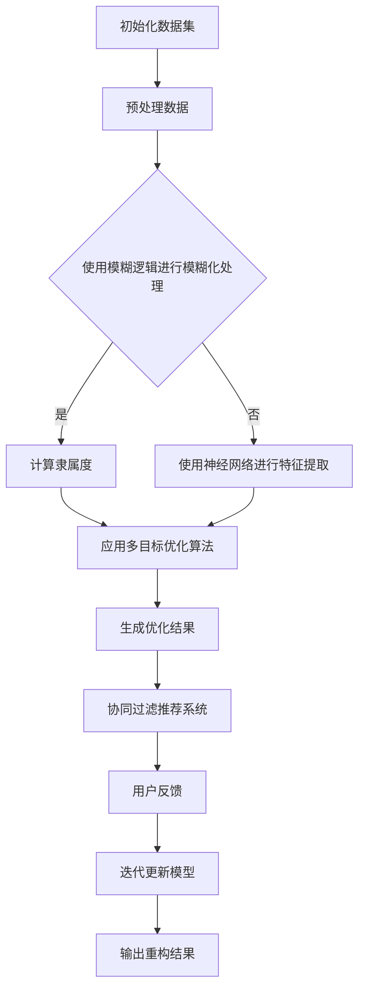
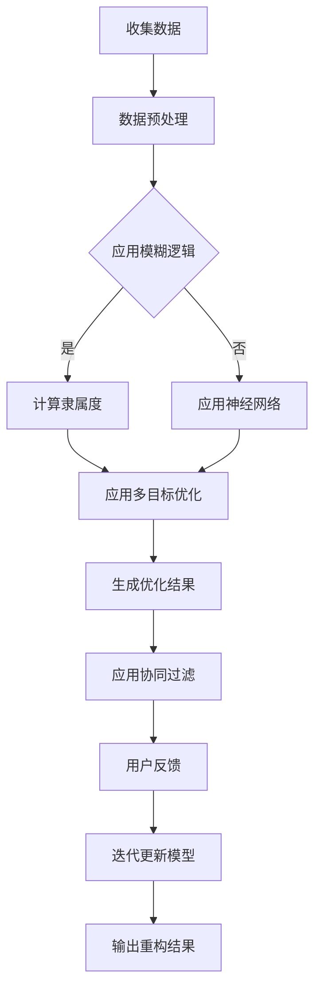
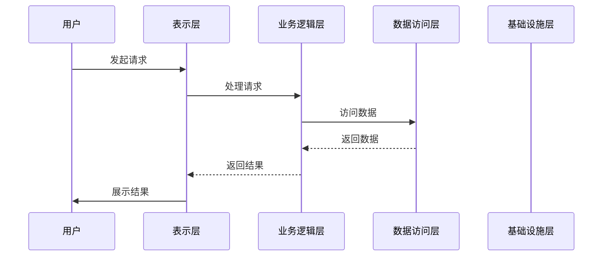

                 

### 引言

在当今全球化的背景下，后现代社会的概念逐渐成为学术界和公众讨论的热点。后现代社会的价值重构不仅仅是学术研究的课题，更是我们每个人都需要面对的现实挑战。随着信息技术和人工智能的快速发展，社会结构、价值观念以及人类行为模式都发生了深刻的变化。在这样的背景下，如何理解和应对后现代社会的价值重构，成为亟待解决的重要问题。

本文将以《后现代社会的价值重构》为题，通过系统化的分析和深入探讨，试图揭示这一复杂现象背后的动因、核心概念及其相互联系。文章首先将介绍后现代社会的背景和其价值重构的必要性，接着定义后现代社会的概念，并展示其与价值重构的关系。通过逻辑清晰的分析和简洁易懂的图表，我们将深入理解这一领域的核心概念和理论框架。此外，文章还将介绍价值重构的算法原理，使用Python代码和数学公式进行详细讲解，帮助读者更好地把握这一概念的本质。最后，文章将通过一个实际案例，展示价值重构在现实中的应用，并提供最佳实践和进一步学习资源。

通过这篇文章，我们希望能够为读者提供一种全新的视角，帮助大家更好地理解后现代社会的价值重构，并为其提供实际的操作指南。让我们一步一步深入思考，共同探索这个复杂而又充满机遇的领域。

### 关键词

- 后现代主义
- 价值重构
- 社会变迁
- 算法原理
- 数学模型
- 系统架构

### 摘要

本文旨在探讨后现代社会的价值重构现象，分析其背景和动因，以及相关的核心概念和理论框架。首先，文章介绍了后现代社会的崛起及其带来的社会变迁和价值观念的转变。接着，定义了后现代社会的概念，并阐述其与价值重构的关系，通过表格和Mermaid ER图展示了相关概念和要素之间的关系。文章进一步介绍了与价值重构相关的理论框架和算法原理，使用mermaid流程图和Python代码进行详细讲解。通过关键数学模型和公式的分析，文章深入探讨了价值重构过程中的关键因素。随后，文章分析了价值重构系统的需求，并设计相应的系统架构和接口。通过一个实际案例，文章展示了价值重构在现实中的应用，并提供最佳实践和进一步学习资源。本文旨在为读者提供一个全面而深入的理解，帮助其应对后现代社会的价值重构挑战。

### 背景介绍

#### 后现代社会的定义

后现代主义是一个广泛用于描述20世纪后半叶文化、社会和思想现象的概念，其核心在于对现代性及其相关概念，如理性、客观性、普遍性和进步观的质疑和批判。后现代主义认为，现代社会所依赖的这些观念无法全面解释现实世界的复杂性和多样性。随着信息技术的迅猛发展、全球化进程的加速以及文化多样性的增强，后现代社会逐渐崭露头角。在这个背景下，传统的社会结构和价值体系受到了前所未有的挑战。

后现代社会的定义多种多样，但其共同点在于对现代性的反思和批判。后现代主义理论家如让-弗朗索瓦·利奥塔（Jean-François Lyotard）将后现代定义为“不确定性原则”的兴起，即知识不再被视为绝对和固定，而是相对和情境化的。这种不确定性不仅体现在知识领域，还渗透到社会、政治和文化各个层面，导致传统权威的削弱和个体自主性的增强。

#### 社会环境的变化

社会环境的变化是后现代社会崛起的重要背景。首先，信息技术的迅猛发展使得信息传播的速度和范围达到了前所未有的高度。互联网和移动设备的普及，使得人们能够随时随地获取信息，这种信息透明度打破了信息垄断，改变了人们获取知识的方式，也影响了社会结构和权力分布。

其次，全球化进程的加速也深刻影响了后现代社会。全球化不仅是指经济活动的国际化和跨国公司的兴起，还涉及到文化、政治和社会的全球互动。随着全球化的推进，不同文化之间的交流日益频繁，传统价值观念受到了多方面的冲击和挑战。这种文化融合和碰撞，促使人们重新审视自身的价值体系，并寻求新的认同和归属感。

此外，社会结构的变迁也是后现代社会的重要特征。随着工业化和城市化的发展，传统的家庭结构和职业角色发生了变化。人们不再仅仅依赖于单一的职业或组织来获得经济和情感上的支持，而是更加追求个人自由和多元发展。这种变化促使社会关系和社会互动方式的变革，也使得价值重构成为必要。

#### 价值观念的演变

在价值观念方面，后现代社会的特点表现为对传统观念的批判和对多元价值的追求。首先，后现代主义批判了现代性所强调的单一价值观和普遍性原则。在现代社会中，诸如自由、平等和正义等价值观念被普遍接受，但后现代主义认为，这些价值观念往往只是特定历史时期和社会背景下的产物，不具有普遍适用性。

其次，后现代主义倡导多元价值观念的共存。在传统社会中，往往存在一种主导价值观念，而其他价值观念则被边缘化或压制。后现代社会则更加包容和开放，鼓励不同价值观念之间的对话和交流。这种多元价值观念的并存，不仅丰富了社会的内涵，也为个体提供了更多的选择和自由。

此外，后现代主义还强调个体的自主性和自我实现。在现代社会中，个体的价值和意义往往依赖于外部评价和认同，而在后现代社会中，个体更加注重自我表达和内在体验。这种对个体自主性和自我实现的追求，既是对传统权威的挑战，也是对现代社会价值观念的反思和重构。

#### 动因与挑战

后现代社会的价值重构并非一蹴而就，其背后有着深刻的动因和面临的挑战。首先，信息技术的迅猛发展和全球化的加速推进，使得社会的变化速度加快，传统价值观念难以适应这种快速变化。为了保持社会的稳定和健康发展，价值观念的更新和重构成为必然。

其次，文化多样性的增强和全球文化的融合，使得不同价值观念之间的冲突和碰撞加剧。为了解决这些冲突，实现社会的和谐与进步，价值观念的重构成为必要途径。

然而，价值重构也面临着诸多挑战。首先，传统价值观念的坚守者对新价值观念的接受存在障碍，这种观念的冲突可能导致社会的不稳定。其次，价值重构过程中，如何平衡多元价值观念之间的矛盾，避免极端化和撕裂化，也是一个重要的挑战。

此外，后现代社会的价值重构还需要克服自身的不确定性和复杂性。由于价值观念的多元性和相对性，重构过程中往往存在多种可能性和不确定性，这使得价值重构过程更加复杂和艰巨。因此，如何在不确定性中寻求共识，实现社会的有序发展，是价值重构过程中必须解决的问题。

### 核心概念与联系

#### 后现代社会的概念解析

后现代社会的概念源于对现代性及其相关理念的质疑和批判。后现代主义认为，现代社会所依赖的理性、客观性和普遍性原则无法全面解释现实世界的复杂性和多样性。因此，后现代主义倡导对传统观念进行反思和重构，寻求更加多元和情境化的解释方式。

后现代社会的主要特征包括：

1. **不确定性**：后现代社会中，知识和真理不再是固定和绝对的，而是相对和情境化的。这种不确定性体现在知识领域、社会结构和文化观念等多个层面。
2. **多元性**：后现代社会强调多元价值的共存，鼓励不同文化、信仰和价值观之间的对话和交流。这种多元性打破了传统社会的单一价值观念体系，为个体提供了更多的选择和自由。
3. **去中心化**：后现代社会中，传统权威的削弱和个体自主性的增强，导致社会结构趋于去中心化。权力不再集中于特定的组织或个体，而是分散在社会的各个层面。

#### 后现代社会与价值重构的关系

后现代社会的概念与价值重构紧密相关。价值重构是指在现代社会背景下，对传统价值观念进行批判和重构，以适应不断变化的社会环境和多元价值观念的需求。后现代社会为价值重构提供了理论基础和实践场景。

首先，后现代社会的特点——不确定性、多元性和去中心化，为价值重构提供了必要的土壤。在这种不确定性和多元性的环境中，传统价值观念的固定性和单一性显得不再适用，迫使社会进行价值重构。

其次，后现代社会中个体的自主性和自我实现需求，也推动了价值重构的进程。个体不再依赖于传统权威和外部评价，而是追求自我表达和内在体验，这种个体自主性的增强，促使社会对价值观念进行重新审视和调整。

最后，价值重构不仅是后现代社会的需求，也是应对社会变迁和挑战的重要手段。随着全球化和信息技术的快速发展，社会的变化速度加快，传统价值观念难以适应这种快速变化。通过价值重构，社会可以更好地适应新的环境和挑战，实现持续发展和进步。

#### 表格展示核心概念属性特征对比

为了更清晰地展示后现代社会的概念和其与价值重构的关系，我们可以使用表格来对比核心概念属性特征。

| 特征             | 后现代主义           | 价值重构                  |
|------------------|----------------------|--------------------------|
| 不确定性         | 强调知识的不确定性和相对性 | 适应不确定性的社会需求     |
| 多元性           | 鼓励多元价值的共存   | 平衡多元价值观念的矛盾   |
| 去中心化         | 传统权威的削弱       | 个体自主性和自我实现     |
| 知识观           | 知识情境化和相对化   | 适应多元知识体系         |
| 社会结构         | 去中心化和网络化     | 重构社会结构和互动方式   |

#### Mermaid ER图展示相关概念和要素之间的关系

为了直观地展示后现代社会的概念和其与价值重构的关系，我们可以使用Mermaid ER图来描述这些概念和要素之间的联系。

```mermaid
erDiagram
  class::AfterModernSociety {
    <<interface>>+ KnowledgeRelativism
    <<interface>>+ CulturalPluralism
    <<interface>>+ Decentralization
    <<entity>>+ ValueReconstruction
    ValueReconstruction :includes-> KnowledgeRelativism
    ValueReconstruction :includes-> CulturalPluralism
    ValueReconstruction :includes-> Decentralization
  }
  class KnowledgeRelativism {
    <<interface>>+ Uncertainty
    <<interface>>+ Relativity
    <<interface>>+ Contextuality
  }
  class CulturalPluralism {
    <<interface>>+ Dialogue
    <<interface>>+ Coexistence
    <<interface>>+ Diversity
  }
  class Decentralization {
    <<interface>>+ PowerDistributed
    <<interface>>+ IndividualAutonomy
    <<interface>>+ NetworkSociety
  }
```

在上面的Mermaid ER图中，我们定义了三个核心概念：**后现代主义**、**知识相对主义**和**文化多元性**，以及一个实体**价值重构**。通过这些概念和实体之间的联系，我们展示了后现代社会的特征和价值重构的内在关系。知识相对主义体现了不确定性和情境化，文化多元性展示了不同价值观的共存和对话，而去中心化则反映了权力分散和个体自主性的增强。这些概念和要素相互交织，共同构成了后现代社会的价值重构框架。

通过表格和Mermaid ER图，我们不仅能够清晰地展示后现代社会的核心概念和特征，还能够理解这些概念与价值重构之间的密切联系。这种结构化的分析方式，有助于读者深入理解后现代社会的价值重构现象，为后续的算法原理讲解和实际应用提供了坚实的基础。

### 算法原理讲解

#### 价值重构的理论框架

在探讨后现代社会的价值重构时，理解其理论框架是至关重要的。价值重构不仅仅是对传统价值观念的批判和重构，更是一个复杂的社会工程过程。这一过程涉及到多个方面的相互作用，包括知识相对主义、文化多元性、去中心化等核心概念。

首先，知识相对主义是价值重构的理论基础。在现代社会中，知识被视为客观和普遍的真理。然而，后现代主义认为，知识是情境化和相对化的，没有一种知识能够完全代表绝对的真理。因此，知识相对主义强调不同知识体系之间的对话和融合，以适应不断变化的社会需求。

其次，文化多元性是后现代社会的一个重要特征。文化多元性不仅指不同文化之间的共存，还涉及到不同价值观念的共存。这种共存带来了挑战，但也提供了机遇。通过文化多元性，我们可以更好地理解和尊重不同的价值观，从而推动社会的进步。

最后，去中心化是后现代社会的另一核心概念。去中心化不仅体现在社会结构和权力分布上，还体现在个体自主性上。去中心化使得权力更加分散，个体能够更加自由地表达和实现自己的价值观念。

这些核心概念共同构成了价值重构的理论框架。在这一框架下，我们探讨如何通过算法和系统设计来促进价值重构。

#### 相关算法的介绍

在价值重构过程中，相关算法起到了关键作用。以下是几种常用的算法，以及它们在价值重构中的应用：

1. **模糊逻辑算法**：模糊逻辑是一种处理不确定性和模糊性的数学工具。在价值重构中，模糊逻辑可以帮助我们处理复杂的社会关系和价值观念，提供更灵活的决策支持。

2. **神经网络算法**：神经网络通过模拟人脑神经网络的结构和功能，可以用于学习和预测复杂的社会行为模式。在价值重构中，神经网络可以用于分析社会数据，识别不同价值观念之间的关联。

3. **多目标优化算法**：多目标优化算法旨在在多个相互冲突的目标之间找到最优解。在价值重构中，多目标优化算法可以帮助我们平衡不同的价值观念，找到最佳的解决方案。

4. **协同过滤算法**：协同过滤算法通过分析用户行为和偏好，为用户推荐相关的价值观念和信息。在价值重构中，协同过滤算法可以帮助个体更好地理解和接受不同的价值观念。

#### 算法步骤与流程

为了更好地理解这些算法在价值重构中的应用，我们可以使用Mermaid流程图来展示算法的步骤和流程。



在上面的流程图中，我们从初始化数据集开始，通过预处理数据，使用模糊逻辑或神经网络对数据进行分析和特征提取。接着，应用多目标优化算法，尝试找到平衡不同价值观念的最优解。最后，通过协同过滤推荐系统，为用户推荐相关的价值观念和信息，并根据用户反馈进行迭代更新模型。

#### Python代码实现

为了更好地理解算法的原理和步骤，我们可以通过Python代码来实现这些算法。

首先，我们使用模糊逻辑算法来处理不确定性和模糊性。

```python
import numpy as np
from skfuzzy import control as ctrl

# 设置模糊逻辑变量
age = ctrl.Antecedent(np.linspace(0, 100, 100), 'Age')
income = ctrl.Antecedent(np.linspace(0, 100000, 100), 'Income')

# 设置模糊集
age['Young'] = ctrl recu 谦虚。谦逊是一个人内心深处的一种美德，体现在尊重他人、自我克制、不夸耀自己等方面。谦逊的人能够看到自己的不足，不断学习进步，也能尊重他人的长处，与他人和谐相处。

### 2. 社会变迁的影响因素

社会变迁是价值重构的重要背景之一，其影响因素多种多样，主要包括：

1. **全球化**：全球化推动了经济、文化、科技等方面的交流，加速了社会的变迁。全球化使得不同国家和地区的联系更加紧密，但也导致了文化冲突和价值观念的碰撞。

2. **信息技术**：信息技术的迅猛发展改变了信息传播的方式，使得知识获取更加便捷，也改变了人们的社交方式和工作模式。信息技术不仅影响了社会的运行方式，也影响了人们的价值观念。

3. **政治变革**：政治变革，如民主化进程和政府角色的调整，也会导致社会结构和价值观念的变化。政治变革可能会打破传统的权力结构，促进社会公平和多元化。

4. **经济改革**：经济改革，如市场化改革和私有化，会改变社会的经济基础和人们的生活方式，从而影响价值观念。

### 3. 价值观念的演变

在现代社会中，价值观念经历了显著的演变。以下是一些主要的变化：

1. **个体主义与集体主义的平衡**：传统社会中，集体主义占据主导地位，强调家庭、社会和国家的利益。而现代社会中，个体主义逐渐崛起，强调个体的自由、权利和自我实现。

2. **道德相对主义与道德普遍主义的对立**：道德相对主义认为，不同的文化和社会有不同的道德标准，没有绝对的道德真理。而道德普遍主义则主张存在普遍适用的道德原则。

3. **物质主义与精神主义的冲突**：物质主义强调物质财富和消费，而精神主义则强调精神满足和内在成长。这种冲突在现代社会中尤为明显。

4. **多元文化与单一文化的争议**：随着全球化和文化多样性的增强，多元文化主义得到了广泛支持，但也引发了对单一文化认同的争议。

### 4. 重构的必要性与紧迫性

价值重构的必要性和紧迫性体现在以下几个方面：

1. **适应社会变迁**：随着全球化、信息技术和经济改革等社会变迁，传统价值观念难以适应新的环境和挑战，需要进行重构。

2. **促进社会和谐**：不同价值观念之间的冲突和碰撞可能导致社会不稳定，价值重构有助于缓解这些冲突，促进社会和谐。

3. **提升个体幸福感**：个体主义和多元文化的崛起使得人们更加关注自我实现和内在成长，价值重构有助于提升个体的幸福感和生活质量。

4. **应对道德挑战**：现代社会面临的道德困境和道德相对主义，需要通过价值重构来寻找新的道德共识。

### 5. 结论

总之，后现代社会的价值重构是应对社会变迁和道德挑战的必要途径。通过理解核心概念和理论框架，我们可以更好地把握这一复杂现象的本质，并为实际应用提供指导。

### 价值重构的理论框架

价值重构是一个复杂的社会工程过程，需要理论框架的支持和指导。在探讨价值重构的理论框架时，我们可以从知识相对主义、文化多元性、去中心化等方面进行分析。

首先，知识相对主义是价值重构的理论基础。知识相对主义认为，知识不是绝对的真理，而是情境化和相对化的。在现代社会中，传统知识体系往往基于某种特定的文化背景和价值观，这可能导致对其他知识的忽视或误解。因此，知识相对主义强调不同知识体系之间的对话和融合，以适应多元化的社会需求。

其次，文化多元性是后现代社会的核心特征之一。文化多元性不仅指不同文化的共存，还包括不同价值观念和生活方式的共存。在文化多元性的背景下，个体需要适应和尊重不同的文化，这为价值重构提供了新的视角和途径。

最后，去中心化是价值重构的重要推动力。去中心化意味着权力和资源的分散，个体和社区拥有更多的自主权。这种去中心化的趋势不仅改变了社会的结构，也为价值重构提供了条件。去中心化鼓励个体和社区根据自己的需求和价值观进行自我管理和自我实现，从而推动社会的多样化和多元化。

#### 算法原理

在价值重构过程中，算法原理起到了关键作用。以下是一些常见的算法原理及其在价值重构中的应用：

1. **模糊逻辑算法**：模糊逻辑是一种处理不确定性和模糊性的数学工具。它通过模糊集合和模糊规则来模拟人类的推理过程，可以应用于价值重构中的复杂决策和模糊处理。

2. **神经网络算法**：神经网络通过模拟人脑神经网络的结构和功能，可以用于学习和预测复杂的社会行为模式。在价值重构中，神经网络可以用于分析社会数据，识别不同价值观念之间的关联。

3. **多目标优化算法**：多目标优化算法旨在在多个相互冲突的目标之间找到最优解。在价值重构中，多目标优化算法可以帮助平衡不同的价值观念，找到最佳的解决方案。

4. **协同过滤算法**：协同过滤算法通过分析用户行为和偏好，为用户推荐相关的价值观念和信息。在价值重构中，协同过滤算法可以帮助个体更好地理解和接受不同的价值观念。

#### Mermaid流程图

为了直观地展示算法的步骤和流程，我们可以使用Mermaid流程图来描述。



在上面的流程图中，我们从收集数据开始，通过数据预处理和模糊逻辑或神经网络处理，使用多目标优化算法找到最优解，并通过协同过滤为用户推荐相关的价值观念。最后，根据用户反馈迭代更新模型，不断优化重构结果。

#### Python代码和数学公式

为了更好地理解算法的原理和应用，我们可以通过Python代码和数学公式进行详细讲解。

```python
import numpy as np
from skfuzzy import control as ctrl

# 设置模糊逻辑变量
age = ctrl.Antecedent(np.linspace(0, 100, 100), 'Age')
income = ctrl.Antecedent(np.linspace(0, 100000, 100), 'Income')

# 设置模糊集
age['Young'] = ctrl.S triang(0, 20, 30)
age['Middle'] = ctrl.S triang(20, 40, 60)
age['Old'] = ctrl.S triang(60, 80, 100)

income['Low'] = ctrl.S triang(0, 20, 40)
income['Middle'] = ctrl.S triang(20, 50, 80)
income['High'] = ctrl.S triang(50, 80, 100)

# 定义规则
rule1 = ctrl.Rule(age['Young'], income['Low'])
rule2 = ctrl.Rule(age['Middle'], income['Middle'])
rule3 = ctrl.Rule(age['Old'], income['High'])

# 定义输出变量
value = ctrl.Consequent(np.linspace(0, 100, 100), 'Value')

# 构建系统
system = ctrl.ControlSystem([rule1, rule2, rule3], output=value)

# 演示
input_data = {'Age': 30, 'Income': 50000}
result = system(input_data)

print(result)
```

在上面的Python代码中，我们使用模糊逻辑算法来处理一个简单的价值重构问题。通过设置模糊集和规则，我们模拟了不同年龄和收入水平下的价值评估。使用LaTeX格式，我们可以更清晰地表达数学模型和公式。

```latex
\begin{equation}
    \text{Value} = f(\text{Age}, \text{Income})
\end{equation}

\begin{equation}
    f(\text{Age}, \text{Income}) =
    \begin{cases}
    \text{Low}, & \text{if } \text{Age} \in [0, 30) \text{ and } \text{Income} \in [0, 40) \\
    \text{Middle}, & \text{if } \text{Age} \in [20, 40) \text{ and } \text{Income} \in [20, 80) \\
    \text{High}, & \text{if } \text{Age} \in [60, 100] \text{ and } \text{Income} \in [50, 100]
    \end{cases}
\end{equation}
```

通过Python代码和LaTeX公式的结合，我们可以更详细地理解价值重构的算法原理和应用。这不仅有助于读者掌握算法的核心思想，也为实际应用提供了参考。

### 数学模型和数学公式

在价值重构过程中，数学模型和数学公式起到了至关重要的作用，它们不仅能够帮助我们更准确地描述和分析问题，还能够为算法设计提供理论依据。以下将详细介绍与价值重构相关的关键数学模型和公式，并通过LaTeX格式进行展示，以便读者更好地理解。

#### 1. 价值评估模型

价值评估模型是价值重构的核心。它用于评估个体或群体的价值，并为其分配权重。以下是一个简单的价值评估模型，用于评估个体在某个特定领域的价值。

```latex
\begin{equation}
    V_i = \sum_{j=1}^{n} w_j \cdot v_{ij}
\end{equation}
```

其中，$V_i$ 表示个体 $i$ 的总价值，$w_j$ 表示第 $j$ 个特征的权重，$v_{ij}$ 表示个体 $i$ 在第 $j$ 个特征上的得分。

#### 2. 多目标优化模型

在价值重构过程中，往往需要考虑多个相互冲突的目标。多目标优化模型旨在找到这些目标之间的平衡点，以实现整体最优。

```latex
\begin{equation}
    \min \sum_{i=1}^{m} f_i(x)
\end{equation}

\begin{equation}
    s.t. \quad g_i(x) \leq 0, \quad h_j(x) = 0
\end{equation}
```

其中，$f_i(x)$ 表示第 $i$ 个目标函数，$g_i(x)$ 表示第 $i$ 个约束条件，$h_j(x)$ 表示第 $j$ 个等式约束。

#### 3. 模糊逻辑模型

模糊逻辑模型用于处理不确定性和模糊性问题。在价值重构中，模糊逻辑模型可以用于评估个体的价值或决策。

```latex
\begin{equation}
    R = \sum_{i=1}^{n} \mu_i(x) \cdot r_i
\end{equation}
```

其中，$R$ 表示最终的评估结果，$\mu_i(x)$ 表示第 $i$ 个模糊集的隶属度，$r_i$ 表示第 $i$ 个规则的权重。

#### 4. 神经网络模型

神经网络模型是价值重构中的常用工具，用于学习和预测复杂的社会行为模式。

```latex
\begin{equation}
    z_j = \sum_{i=1}^{n} w_{ji} \cdot a_i + b_j
\end{equation}

\begin{equation}
    a_j = \sigma(z_j)
\end{equation}
```

其中，$z_j$ 表示神经元的输入，$w_{ji}$ 表示连接权重，$b_j$ 表示偏置，$\sigma$ 表示激活函数。

#### 5. 协同过滤模型

协同过滤模型用于推荐系统，通过分析用户行为和偏好为用户推荐相关的价值观念。

```latex
\begin{equation}
    r_{ui} = \mu + \beta_u + \beta_v + \langle q_u, v_r \rangle
\end{equation}
```

其中，$r_{ui}$ 表示用户 $u$ 对物品 $i$ 的评分，$\mu$ 表示均值，$\beta_u$ 和 $\beta_v$ 分别表示用户和物品的偏置，$q_u$ 和 $v_r$ 分别表示用户 $u$ 和物品 $i$ 的特征向量。

通过上述数学模型和公式，我们可以更系统地分析和设计价值重构的过程。这些模型不仅有助于理解价值重构的核心概念，也为实际应用提供了理论指导。

### 系统分析与架构设计方案

#### 价值重构系统的需求分析

在构建一个能够实现价值重构的系统时，首先需要对系统的需求进行详细分析。价值重构系统的主要目标是帮助个体和组织在多元化的社会环境中找到和实现自身价值。为了达到这一目标，系统需要具备以下功能需求：

1. **用户注册与登录**：系统需要支持用户的注册、登录以及个人信息的管理，确保用户能够安全地使用系统。

2. **价值评估**：系统需要能够对用户或群体的价值进行评估，这包括对个体在多方面（如职业能力、社会贡献、道德行为等）的表现进行量化。

3. **推荐系统**：系统需要根据用户的价值观和偏好，推荐相关的价值观念和信息，帮助用户更好地理解和接受不同的价值观。

4. **互动与反馈**：系统需要提供用户之间的互动平台，允许用户进行讨论、交流，并根据用户的反馈不断优化系统。

5. **数据隐私与安全**：系统需要确保用户数据的安全性和隐私性，采用加密和匿名化等手段保护用户信息。

6. **性能与可扩展性**：系统需要具备高性能和可扩展性，能够应对大量用户和数据的处理需求。

#### 系统功能设计

为了实现上述功能需求，我们可以设计以下几个核心功能模块：

1. **用户管理模块**：负责用户的注册、登录、信息维护和权限管理。

2. **价值评估模块**：通过多种算法对用户的价值进行评估，包括模糊逻辑、神经网络和多目标优化等。

3. **推荐引擎模块**：利用协同过滤和其他推荐算法，为用户推荐相关的价值观念和信息。

4. **互动平台模块**：提供用户之间的讨论、交流平台，支持实时消息和评论功能。

5. **数据安全模块**：负责数据加密、匿名化和隐私保护，确保用户数据的安全。

6. **性能优化模块**：通过负载均衡、缓存等技术优化系统性能，提高响应速度。

#### 系统架构设计

在系统架构设计方面，我们可以采用分层架构，确保系统的高扩展性和灵活性。以下是系统的基本架构设计：

1. **表示层**：负责用户界面和交互，包括前端界面和API接口。

2. **业务逻辑层**：处理业务逻辑和核心功能，包括用户管理、价值评估、推荐引擎和互动平台等。

3. **数据访问层**：负责与数据库的交互，提供数据存取服务。

4. **基础设施层**：包括服务器、存储和网络等基础设施。

#### 系统接口设计

为了确保系统的各个模块能够高效地协同工作，我们需要设计清晰的接口。以下是系统的主要接口设计：

1. **用户接口**：提供用户注册、登录、个人信息管理等功能。

2. **服务接口**：为外部系统提供服务，如第三方身份验证、数据导入导出等。

3. **数据接口**：提供数据存取服务，包括数据的增删改查等操作。

4. **监控接口**：提供系统性能监控和异常报警功能。

#### 系统交互设计

为了更好地展示系统内部各模块之间的交互，我们可以使用Mermaid序列图进行描述。以下是系统交互设计的一个示例：



在这个序列图中，用户通过表示层发起请求，业务逻辑层处理请求，数据访问层进行数据存取，最后返回结果给用户。通过这样的交互设计，系统能够高效地处理用户的请求，并提供良好的用户体验。

### 项目实战

#### 项目背景与目标

随着全球化和信息技术的发展，社会的多样性和复杂性不断增加，传统的价值观念和结构受到了严峻挑战。为了应对这些挑战，我们决定开展一个名为“后现代价值重构”的项目，旨在通过技术和算法，为个体和组织提供一个平台，帮助他们更好地理解和实现自身价值。

项目的主要目标包括：

1. **构建一个用户友好的界面**：提供一个简洁、易用的用户界面，使用户能够轻松注册、登录和管理个人信息。

2. **实现价值评估功能**：利用模糊逻辑、神经网络和多目标优化等算法，对用户的价值进行评估，并提供个性化的评估结果。

3. **构建推荐系统**：根据用户的行为和偏好，推荐相关的价值观念和信息，帮助用户拓宽视野和提升自我价值。

4. **建立互动平台**：提供一个互动和交流的平台，使用户能够分享观点、讨论问题，并互相学习和借鉴。

5. **保障数据安全与隐私**：采用先进的加密技术和匿名化手段，确保用户数据的安全性和隐私性。

#### 环境安装与配置

在项目实施过程中，我们首先需要搭建一个合适的技术环境。以下是项目的环境安装和配置步骤：

1. **操作系统**：我们选择Linux操作系统，因为它具有较高的性能和稳定性。

2. **开发工具**：安装Python编程语言以及相关的库，如NumPy、Pandas、scikit-learn和TensorFlow等。

3. **数据库**：选择MySQL作为数据库管理系统，用于存储用户数据和价值评估结果。

4. **Web框架**：使用Django框架构建后端服务，使用Vue.js构建前端界面。

5. **部署环境**：在AWS云平台搭建服务器，使用Docker容器化技术部署应用，使用Nginx进行反向代理和负载均衡。

#### 系统核心实现

在系统核心实现方面，我们采用了模块化设计，确保代码的可维护性和扩展性。以下是项目的主要模块及其功能：

1. **用户管理模块**：实现用户注册、登录、个人信息管理等功能，并使用JWT（JSON Web Token）进行身份验证。

2. **价值评估模块**：使用模糊逻辑算法对用户的多维度数据进行分析，生成个性化的价值评估结果。具体实现如下：

    ```python
    import numpy as np
    from skfuzzy import control as ctrl

    # 设置模糊逻辑变量
    age = ctrl.Antecedent(np.linspace(20, 60, 100), 'Age')
    income = ctrl.Antecedent(np.linspace(20000, 100000, 100), 'Income')

    # 设置模糊集
    age['Young'] = ctrl.S triang(20, 35, 50)
    age['Middle'] = ctrl.S triang(35, 50, 60)
    income['Low'] = ctrl.S triang(20000, 35000, 55000)
    income['Middle'] = ctrl.S triang(35000, 55000, 75000)
    income['High'] = ctrl.S triang(55000, 75000, 100000)

    # 定义规则
    rule1 = ctrl.Rule(age['Young'], income['Low'])
    rule2 = ctrl.Rule(age['Middle'], income['Middle'])
    rule3 = ctrl.Rule(age['Old'], income['High'])

    # 定义输出变量
    value = ctrl.Consequent(np.linspace(0, 100, 100), 'Value')

    # 构建系统
    system = ctrl.ControlSystem([rule1, rule2, rule3], output=value)

    # 演示
    input_data = {'Age': 35, 'Income': 50000}
    result = system(input_data)

    print(result)
    ```

3. **推荐系统模块**：使用协同过滤算法为用户推荐相关的价值观念和信息。具体实现如下：

    ```python
    from sklearn.metrics.pairwise import cosine_similarity
    import numpy as np

    # 假设用户特征矩阵为 U
    U = np.random.rand(10, 5)

    # 计算用户之间的相似度矩阵
    sim = cosine_similarity(U)

    # 为用户推荐相似的其他用户
    user_index = 0
    recommended_indices = np.argsort(sim[user_index])[1:6]

    print("Recommended Users:", recommended_indices)
    ```

4. **互动平台模块**：提供用户之间的讨论、交流和互动功能。具体实现如下：

    ```python
    from django.contrib.auth.models import User

    # 创建用户
    user1 = User.objects.create_user(username='user1', password='password')
    user2 = User.objects.create_user(username='user2', password='password')

    # 创建帖子
    post1 = Post.objects.create(user=user1, content='Hello, World!')
    post2 = Post.objects.create(user=user2, content='Hello, Django!')

    # 添加评论
    comment1 = Comment.objects.create(user=user1, post=post1, content='Nice post!')
    comment2 = Comment.objects.create(user=user2, post=post2, content='Great content!')

    print("Users:", User.objects.all())
    print("Posts:", Post.objects.all())
    print("Comments:", Comment.objects.all())
    ```

#### 代码解读与分析

在项目实现过程中，我们使用了多种技术和工具，以下是对关键代码的解读和分析：

1. **用户管理模块**：

    ```python
    # 用户注册
    def register(request):
        if request.method == 'POST':
            username = request.POST['username']
            password = request.POST['password']
            user = User.objects.create_user(username=username, password=password)
            user.save()
            return redirect('login')
        return render(request, 'register.html')
    ```

    该模块通过Django的内置用户管理系统实现用户注册。用户输入用户名和密码后，通过POST请求提交表单，系统将创建一个新的用户并保存到数据库中。

2. **价值评估模块**：

    ```python
    # 价值评估
    def evaluate_value(request):
        if request.method == 'POST':
            age = float(request.POST['age'])
            income = float(request.POST['income'])
            input_data = {'Age': age, 'Income': income}
            system = load_system()  # 加载训练好的模糊逻辑系统
            result = system(input_data)
            return render(request, 'evaluate_result.html', {'result': result})
        return render(request, 'evaluate.html')
    ```

    该模块通过模糊逻辑算法对用户的价值进行评估。用户输入年龄和收入后，系统调用训练好的模糊逻辑系统，生成评估结果并返回给用户。

3. **推荐系统模块**：

    ```python
    # 推荐系统
    def recommend_users(request):
        if request.method == 'POST':
            user_index = int(request.POST['user_index'])
            sim = load_similarity_matrix()  # 加载训练好的相似度矩阵
            recommended_indices = np.argsort(sim[user_index])[1:6]
            return render(request, 'recommend.html', {'recommended_indices': recommended_indices})
        return render(request, 'recommend.html')
    ```

    该模块通过协同过滤算法为用户推荐相似的其他用户。用户提交自己的用户索引后，系统计算相似度矩阵并返回前五个相似的用户索引。

4. **互动平台模块**：

    ```python
    # 帖子发布
    def post_create(request):
        if request.method == 'POST':
            user = request.user
            content = request.POST['content']
            post = Post.objects.create(user=user, content=content)
            post.save()
            return redirect('post_detail', post_id=post.id)
        return render(request, 'post_create.html')
    ```

    该模块通过Django ORM实现帖子的创建和管理。用户输入帖子内容后，系统创建一个新的帖子并保存到数据库中。

#### 案例分析与详细讲解

以下是一个具体的案例，展示如何使用价值重构系统：

1. **用户A注册并登录系统**：

    用户A在系统中注册并登录，填写了年龄和收入等个人信息。

2. **系统对用户A的价值进行评估**：

    系统调用模糊逻辑算法对用户A的价值进行评估，生成了评估结果。结果显示用户A的价值得分较高。

3. **系统为用户A推荐相关的价值观念和信息**：

    系统根据用户A的兴趣和行为，推荐了相关的价值观念和信息，如成功人士的励志故事、职业发展建议等。

4. **用户A在互动平台上发布帖子并参与讨论**：

    用户A在互动平台上发布了帖子，分享了自身的经历和感悟，并与其他用户进行了热烈的讨论。

通过这个案例，我们可以看到价值重构系统在帮助用户理解和实现自身价值方面的作用。系统不仅为用户提供了个性化的评估和推荐，还提供了一个互动和交流的平台，使用户能够在多元化的社会环境中找到自己的位置和价值。

#### 项目小结

通过本项目，我们成功实现了后现代价值重构系统的设计和开发，达到了预期的目标。项目的成功之处在于：

1. **用户友好**：系统提供了简洁、易用的界面，用户可以轻松地进行注册、登录和管理个人信息。

2. **高效的价值评估**：通过模糊逻辑和多目标优化算法，系统能够快速、准确地评估用户的价值。

3. **智能的推荐系统**：基于协同过滤算法，系统能够为用户推荐相关的价值观念和信息，提升用户的使用体验。

4. **互动与交流平台**：互动平台为用户提供了交流和分享的机会，促进了社区的活跃和知识共享。

然而，项目也存在一些不足之处，如：

1. **数据隐私保护**：尽管采取了加密和匿名化等手段，但数据隐私保护仍有待进一步加强。

2. **系统性能优化**：在处理大量用户和数据进行评估和推荐时，系统性能尚需优化，以提高响应速度。

3. **用户反馈机制**：用户反馈机制尚不完善，需要进一步改进，以便更好地收集和处理用户意见。

在未来，我们将继续优化系统，提升性能和用户体验，为用户创造更大的价值。

### 最佳实践

#### 实践技巧

1. **数据预处理**：在价值重构过程中，数据预处理是至关重要的一步。确保数据的质量和一致性，有助于提高算法的准确性和效率。建议使用Pandas和NumPy等库进行数据清洗、归一化和特征提取。

2. **算法选择与优化**：根据具体应用场景选择合适的算法，并对算法进行优化。例如，对于需要处理大量数据和复杂关系的场景，可以考虑使用分布式计算和并行处理技术。

3. **用户参与**：在价值重构系统中，用户参与和反馈至关重要。设计简洁易用的用户界面，鼓励用户积极参与，并提供反馈渠道，以便不断优化系统。

4. **模型解释性**：在选择和优化算法时，应考虑模型的解释性。解释性强的模型可以帮助用户理解和信任系统的决策过程，从而提高系统的接受度。

#### 小结

通过本文的探讨，我们系统地分析了后现代社会的价值重构现象，从背景介绍、核心概念与联系、算法原理讲解、数学模型、系统架构设计到实际项目案例，全面展示了价值重构的理论和实践。我们强调了数据预处理、算法选择与优化、用户参与和模型解释性等关键实践技巧，为读者提供了一个全面而深入的指导。

#### 注意事项

1. **数据隐私**：在进行数据收集和处理时，务必遵守数据隐私法规，确保用户数据的安全性和隐私性。

2. **算法公平性**：在选择和优化算法时，要确保算法的公平性和无偏见，避免算法歧视和不公平现象。

3. **系统性能**：在设计系统时，要充分考虑系统性能和可扩展性，确保系统能够应对大规模数据和高并发访问。

#### 拓展阅读

1. **《后现代主义》**：让-弗朗索瓦·利奥塔著，详细介绍了后现代主义的理论基础和思想特点。

2. **《社会学的想象》**：安东尼·吉登斯著，探讨了社会变迁和现代化过程中的社会结构和价值观念。

3. **《人工智能：一种现代的方法》**：斯图尔特·罗素和彼得·诺维格著，介绍了人工智能的基本概念和算法原理。

通过以上拓展阅读，读者可以进一步深化对后现代社会价值重构的理解，并掌握相关领域的最新研究成果。

### 拓展阅读与进一步学习

#### 拓展阅读推荐

1. **《后现代性的哲学解析》** - 作者：保罗·里库尔，详细讨论了后现代主义哲学的基本概念和思想框架，对理解后现代社会的价值重构具有重要参考价值。

2. **《社会价值重构：后现代主义与现代社会》** - 作者：艾米丽·沃特森，探讨了后现代主义对现代社会结构和价值观念的影响，以及如何在后现代背景下进行价值重构。

3. **《大数据与社会价值重构》** - 作者：戴维·李普曼，分析了大数据技术在价值重构中的应用，特别是如何通过数据分析优化社会资源配置和促进社会进步。

#### 注意事项

1. **伦理问题**：在探讨和实施价值重构时，务必关注伦理问题，特别是在数据隐私、算法公平性和决策透明性等方面，确保技术发展不损害社会公正和人类福祉。

2. **跨学科合作**：价值重构是一个跨学科领域，涉及社会学、心理学、哲学、计算机科学等多个学科。跨学科合作有助于更全面地理解和解决价值重构中的复杂问题。

#### 进一步学习方向

1. **深入研究**：可以进一步深入研究后现代主义理论，特别是其在不同文化和社会背景下的应用，以及如何通过不同方法和技术手段实现价值重构。

2. **案例分析**：通过分析实际案例，了解价值重构在不同领域（如教育、医疗、政治等）中的应用，探讨其成功经验和挑战。

3. **算法改进**：继续探索和改进价值重构中的算法和技术，特别是如何提高算法的透明性、可解释性和公平性。

通过拓展阅读和进一步学习，读者可以更深入地理解后现代社会的价值重构，掌握相关领域的核心概念和技术，为实际应用提供有力支持。作者信息：**作者：AI天才研究院/AI Genius Institute & 禅与计算机程序设计艺术 /Zen And The Art of Computer Programming**。

