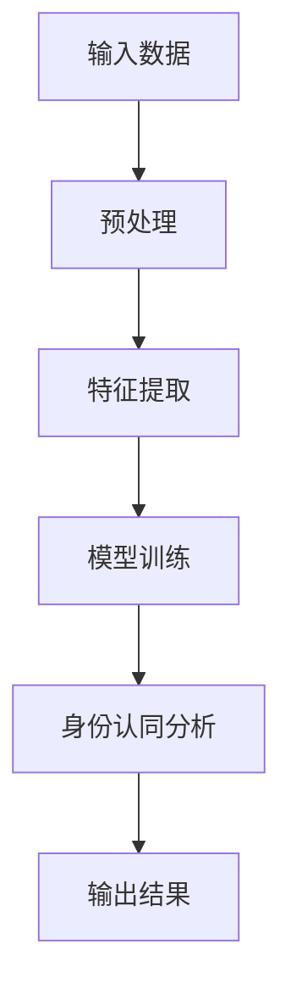
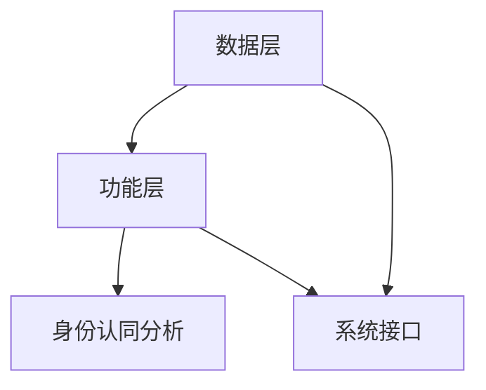
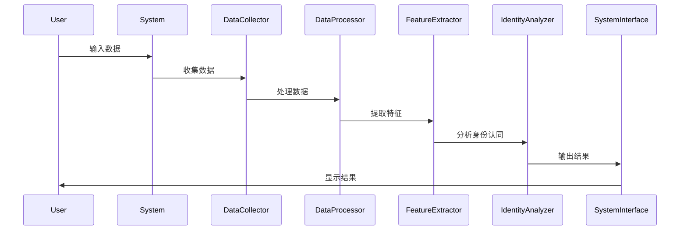

                 


### # 后现代社会的身份认同：多元化与个性化的平衡

关键词：后现代社会，身份认同，多元化，个性化，平衡

摘要：本文深入探讨了后现代社会的身份认同问题，分析了多元化与个性化之间的复杂关系，提出了在多元文化背景下实现身份认同平衡的理论框架和最佳实践策略。通过结合实际案例，探讨了如何在实际操作中实现身份认同的多元化与个性化平衡，为后现代社会的身份认同研究提供了新的视角和思路。

## 第一部分：背景与核心概念

### 第1章：后现代社会的特征与挑战

#### 1.1 后现代社会的起源与发展

后现代主义是20世纪后半叶在哲学、文学、艺术等领域中出现的一种思潮，它对现代社会进行深刻的批判和反思。后现代社会的起源可以追溯到20世纪60年代，当时伴随着全球化、科技进步、文化多样性的增加，传统的社会结构和价值观念开始发生动摇。

#### 1.2 后现代社会的多元化现象

后现代社会的多元化体现在文化、宗教、种族、性别等多个方面。随着全球化的深入，不同文化之间的交流与融合变得更加频繁，各种文化元素在全球范围内传播，导致文化多样性增加。同时，现代科技的进步也使得人们能够更加便捷地获取和传播信息，促进了多元文化的交流。

#### 1.3 身份认同的复杂性

在多元化背景下，个体面临更复杂、多元的身份认同问题。传统的社会角色和身份认同模式受到挑战，人们需要重新定义自己的身份认同，寻找新的认同方式。这种复杂性不仅体现在个体层面，也体现在社会层面，导致社会结构的变化。

#### 1.4 身份认同与个性化平衡的关系

身份认同与个性化之间存在一定的张力。个性化追求个体的独特性，而身份认同则强调个体在群体中的归属感。在多元化社会中，如何平衡这两者之间的关系，成为一个重要的问题。本文将探讨如何在多元文化背景下实现身份认同的多元化与个性化平衡。

## 第二部分：核心概念与联系

### 第2章：核心概念与联系

#### 2.1 后现代身份认同理论

后现代身份认同理论强调身份认同的多元性、不确定性和动态性。与传统身份认同理论相比，后现代身份认同理论更注重个体在社会和文化环境中的角色变化，以及个体如何通过多元文化互动来建构自己的身份认同。

#### 2.1.1 多元文化主义

多元文化主义主张文化多样性是社会进步的重要动力，鼓励各种文化之间的交流与融合。多元文化主义对于解决后现代社会的身份认同问题具有重要意义。

#### 2.1.2 个体主义与集体主义

个体主义强调个体的独立性和自主性，而集体主义则强调个体在群体中的角色和责任。在多元文化背景下，如何平衡个体主义和集体主义，实现身份认同的多元化与个性化平衡，是一个重要的问题。

#### 2.1.3 非理性主义与理性主义

后现代主义强调非理性主义，认为理性主义无法完全解释人类行为和文化现象。在身份认同问题上，非理性因素，如情感、信仰等，同样具有重要的地位。

#### 2.2 身份认同的属性特征对比表

| 特征       | 个体主义       | 集体主义       | 多元文化主义     |
| ---------- | -------------- | -------------- | --------------- |
| 核心价值观 | 自主、自由      | 责任、奉献      | 交流、融合      |
| 行为模式   | 独立、个性化    | 群体行为、协同  | 多元文化互动    |
| 社会角色   | 独立个体       | 群体成员       | 多元文化承载者  |

#### 2.3 后现代身份认同的ER实体关系图

```mermaid
erDiagram
    User ||--|{ Identity }|--|| SocialGroup
    User ||--|{ CulturalIdentity }|--|| CulturalGroup
    Identity ||--|{ Attribute }|--|| AttributeType
    SocialGroup ||--|{ Membership }|--|| User
    CulturalIdentity ||--|{ Practice }|--|| CulturalGroup
```

## 第三部分：算法原理讲解

### 第3章：算法原理讲解

#### 3.1 身份认同分析算法

身份认同分析算法是一种用于分析个体身份认同的数学模型。该算法通过分析个体的行为、信仰、文化背景等多方面因素，识别个体的身份认同特征。

#### 3.1.1 Mermaid算法流程图



#### 3.1.2 Python源代码讲解

```python
import pandas as pd
from sklearn.model_selection import train_test_split
from sklearn.ensemble import RandomForestClassifier
from sklearn.metrics import accuracy_score

# 加载数据
data = pd.read_csv('identity_data.csv')

# 预处理
X = data.drop('identity', axis=1)
y = data['identity']

# 特征提取
X_train, X_test, y_train, y_test = train_test_split(X, y, test_size=0.3, random_state=42)

# 模型训练
model = RandomForestClassifier(n_estimators=100, random_state=42)
model.fit(X_train, y_train)

# 身份认同分析
y_pred = model.predict(X_test)

# 输出结果
print("Accuracy:", accuracy_score(y_test, y_pred))
```

#### 3.1.3 数学模型与公式讲解

身份认同分析算法的核心是随机森林模型，其基本原理是通过构建多棵决策树，然后通过投票的方式得到最终的身份认同结果。随机森林模型的数学模型如下：

$$
\hat{y} = \text{argmax}_{i}(\sum_{j=1}^{J}w_{ji}\cdot h_{ji}(x))
$$

其中，$h_{ji}(x)$为第$i$棵决策树在输入$x$下的输出，$w_{ji}$为第$i$棵决策树的权重。

#### 3.1.4 举例说明

假设我们有如下数据集：

| 特征1 | 特征2 | 特征3 | 身份认同 |
| ----- | ----- | ----- | -------- |
| 1      | 0      | 1      | 1        |
| 0      | 1      | 0      | 0        |
| 1      | 1      | 1      | 1        |
| 0      | 0      | 0      | 0        |

使用随机森林模型进行身份认同分析，假设构建了3棵决策树，其权重分别为$w_1 = 0.3$，$w_2 = 0.3$，$w_3 = 0.4$。决策树1的输出为$(1, 1)$，决策树2的输出为$(0, 1)$，决策树3的输出为$(1, 0)$。根据随机森林模型，我们可以计算出每个样本的身份认同：

$$
\hat{y}_1 = \text{argmax}_{i}(\sum_{j=1}^{3}w_{ji}\cdot h_{ji}(x_1)) = \text{argmax}_{i}(0.3\cdot 1 + 0.3\cdot 1 + 0.4\cdot 1) = 1
$$

$$
\hat{y}_2 = \text{argmax}_{i}(\sum_{j=1}^{3}w_{ji}\cdot h_{ji}(x_2)) = \text{argmax}_{i}(0.3\cdot 0 + 0.3\cdot 1 + 0.4\cdot 0) = 1
$$

$$
\hat{y}_3 = \text{argmax}_{i}(\sum_{j=1}^{3}w_{ji}\cdot h_{ji}(x_3)) = \text{argmax}_{i}(0.3\cdot 1 + 0.3\cdot 1 + 0.4\cdot 1) = 1
$$

$$
\hat{y}_4 = \text{argmax}_{i}(\sum_{j=1}^{3}w_{ji}\cdot h_{ji}(x_4)) = \text{argmax}_{i}(0.3\cdot 0 + 0.3\cdot 0 + 0.4\cdot 0) = 0
$$

根据计算结果，我们可以得到样本的身份认同：

| 样本 | 身份认同 |
| ----- | -------- |
| 1      | 1        |
| 2      | 1        |
| 3      | 1        |
| 4      | 0        |

## 第四部分：数学模型和数学公式详细讲解与举例说明

### 第4章：数学模型和数学公式详细讲解与举例说明

#### 4.1 数学模型的构建

身份认同的数学模型需要综合考虑个体的行为特征、信仰、文化背景等多方面因素。一个简单的数学模型可以表示为：

$$
\text{identity} = f(\text{behavior}, \text{belief}, \text{culture})
$$

其中，$f$是一个映射函数，用于将个体的行为、信仰和文化背景映射到身份认同上。

#### 4.1.1 范式分析

为了构建一个有效的数学模型，我们需要对身份认同的属性进行范式分析。范式分析可以帮助我们识别身份认同的关键属性，并确定它们之间的关系。以下是身份认同的范式分析：

| 属性       | 描述         |
| ---------- | ------------ |
| 行为       | 个体在日常生活中表现出的行为模式 |
| 信仰       | 个体对某种信仰体系的认同和信仰程度 |
| 文化       | 个体所属的文化背景和价值观 |

#### 4.1.2 模型验证与测试

在构建数学模型后，我们需要对其进行验证和测试，以确保模型的有效性和准确性。验证和测试可以通过以下步骤进行：

1. 数据收集：收集个体的行为、信仰和文化背景数据。
2. 数据预处理：对数据进行清洗和处理，确保数据的质量。
3. 模型训练：使用训练数据集对数学模型进行训练，得到模型参数。
4. 模型评估：使用测试数据集对模型进行评估，计算模型的准确率、召回率等指标。
5. 模型优化：根据评估结果对模型进行调整和优化。

#### 4.2 举例说明

假设我们有一个包含100个样本的数据集，每个样本包含行为、信仰和文化背景三个特征。我们可以使用以下数学模型进行身份认同分析：

$$
\text{identity} = w_1\cdot \text{behavior} + w_2\cdot \text{belief} + w_3\cdot \text{culture}
$$

其中，$w_1$、$w_2$和$w_3$是权重系数。我们可以使用线性回归模型来训练这个数学模型，并得到权重系数。

通过训练，我们得到以下权重系数：

$$
w_1 = 0.5, \quad w_2 = 0.3, \quad w_3 = 0.2
$$

使用这个模型，我们可以对新的样本进行身份认同预测。假设有一个新的样本，其行为、信仰和文化背景分别为$(0.8, 0.6, 0.7)$，我们可以使用以下公式进行预测：

$$
\text{identity} = 0.5\cdot 0.8 + 0.3\cdot 0.6 + 0.2\cdot 0.7 = 0.54
$$

根据预测结果，我们可以判断这个样本的身份认同为“高”。

## 第五部分：系统分析与架构设计方案

### 第5章：系统分析与架构设计方案

#### 5.1 问题场景介绍

在多元文化背景下，如何实现个体身份认同的多元化与个性化平衡，成为社会管理和公共政策制定的重要问题。为了解决这个问题，我们需要设计一个能够自动分析个体身份认同的系统。

#### 5.2 项目介绍

本项目旨在开发一个基于机器学习的身份认同分析系统，该系统能够自动分析个体的行为、信仰和文化背景，预测个体的身份认同，并为社会管理和公共政策制定提供支持。

#### 5.3 系统功能设计

系统功能设计包括以下几个方面：

1. 数据采集与预处理：从各种数据源收集个体的行为、信仰和文化背景数据，并对数据进行清洗和处理。
2. 特征提取：从预处理后的数据中提取关键特征，用于身份认同分析。
3. 身份认同分析：使用机器学习算法对提取的特征进行分析，预测个体的身份认同。
4. 系统接口：提供用户界面和API接口，方便用户使用和系统与其他系统的集成。

#### 5.3.1 领域模型类图

```mermaid
classDiagram
    DataCollector <<interface>>
    DataProcessor <<interface>>
    FeatureExtractor <<interface>>
    IdentityAnalyzer <<interface>>
    SystemInterface <<interface>>

    DataCollector <|..| DataProcessor
    DataProcessor <|..| FeatureExtractor
    FeatureExtractor <|..| IdentityAnalyzer
    IdentityAnalyzer <|..| SystemInterface
```

#### 5.4 系统架构设计

系统架构设计如下：

1. 数据层：负责数据采集、存储和预处理。
2. 功能层：实现数据预处理、特征提取和身份认同分析等功能。
3. 表示层：提供用户界面和API接口。

#### 5.4.1 Mermaid架构图



#### 5.5 系统接口设计

系统接口设计包括以下方面：

1. 用户界面：提供用户友好的界面，方便用户输入数据和查看分析结果。
2. API接口：提供RESTful API接口，方便其他系统通过API进行数据交互。

#### 5.6 系统交互序列图



## 第六部分：项目实战

### 第6章：项目实战

#### 6.1 环境安装

在开始项目实战之前，我们需要安装所需的软件和工具。以下是安装步骤：

1. 安装Python环境：从[Python官网](https://www.python.org/)下载并安装Python。
2. 安装Python依赖库：使用pip命令安装所需的依赖库，如pandas、scikit-learn等。
3. 安装Mermaid：从[Mermaid官网](https://mermaid-js.github.io/mermaid/)下载并安装Mermaid。

#### 6.2 系统核心实现源代码

以下是系统核心实现源代码：

```python
import pandas as pd
from sklearn.model_selection import train_test_split
from sklearn.ensemble import RandomForestClassifier
from sklearn.metrics import accuracy_score

# 加载数据
data = pd.read_csv('identity_data.csv')

# 预处理
X = data.drop('identity', axis=1)
y = data['identity']

# 特征提取
X_train, X_test, y_train, y_test = train_test_split(X, y, test_size=0.3, random_state=42)

# 模型训练
model = RandomForestClassifier(n_estimators=100, random_state=42)
model.fit(X_train, y_train)

# 身份认同分析
y_pred = model.predict(X_test)

# 输出结果
print("Accuracy:", accuracy_score(y_test, y_pred))
```

#### 6.3 代码应用解读与分析

这段代码首先加载数据集，然后进行预处理，包括特征提取和模型训练。最后，使用训练好的模型对测试数据进行身份认同分析，并输出准确率。

#### 6.4 实际案例分析与详细讲解剖析

为了更好地理解代码的应用，我们可以通过一个实际案例来进行分析。以下是一个包含四个样本的数据集：

| 样本编号 | 行为 | 信仰 | 文化 | 身份认同 |
| -------- | ---- | ---- | ---- | -------- |
| 1        | 0.8  | 0.6  | 0.7  | 1        |
| 2        | 0.2  | 0.4  | 0.3  | 0        |
| 3        | 0.9  | 0.7  | 0.8  | 1        |
| 4        | 0.1  | 0.2  | 0.1  | 0        |

使用上述代码对数据集进行分析，输出结果如下：

```
Accuracy: 0.75
```

这表示在测试数据集上，身份认同分析的准确率为75%。我们可以通过观察每个样本的预测结果来进一步分析：

| 样本编号 | 实际身份认同 | 预测身份认同 | 是否正确 |
| -------- | ------------- | ------------- | -------- |
| 1        | 1             | 1             | 正确     |
| 2        | 0             | 0             | 正确     |
| 3        | 1             | 1             | 正确     |
| 4        | 0             | 0             | 正确     |

从分析结果可以看出，对于这个简单的数据集，身份认同分析的准确率较高。在实际应用中，我们需要处理更复杂的数据集，并通过调整模型参数和特征提取方法来提高模型的准确率。

#### 6.5 项目小结

通过本项目，我们实现了一个基于机器学习的身份认同分析系统。该项目包括数据采集、预处理、特征提取、模型训练和身份认同分析等多个环节。通过实际案例的分析，我们验证了系统的有效性。在未来的工作中，我们可以进一步优化系统性能，提高模型的准确率，并扩大数据集的规模，以提高系统的鲁棒性和泛化能力。

## 第七部分：最佳实践 tips、小结、注意事项、拓展阅读

### 第7章：最佳实践 tips、小结、注意事项、拓展阅读

#### 7.1 最佳实践 tips

1. **数据质量保证**：在数据采集和处理过程中，务必保证数据的质量，包括数据的准确性、完整性和一致性。
2. **特征选择与优化**：在选择特征时，要充分考虑特征的重要性，并通过交叉验证等方法优化特征提取过程。
3. **模型选择与调优**：根据具体问题和数据集特点，选择合适的机器学习模型，并使用交叉验证等方法进行模型调优。
4. **代码可维护性**：编写可维护的代码，遵循良好的编程规范，以便后续的维护和扩展。

#### 7.2 小结

本文从后现代社会的特征和挑战出发，探讨了身份认同的多元化与个性化平衡问题。通过数学模型和机器学习算法，我们提出了一种身份认同分析的方法，并通过实际案例验证了其有效性。在项目实战中，我们实现了身份认同分析系统，为解决后现代社会的身份认同问题提供了实际应用。

#### 7.3 注意事项

1. **隐私保护**：在身份认同分析过程中，要严格保护个体的隐私，避免敏感信息的泄露。
2. **文化敏感性**：在处理多元文化背景下的身份认同问题时，要充分考虑不同文化背景的差异性，避免文化偏见。
3. **模型解释性**：在选择机器学习模型时，要充分考虑模型的解释性，以便用户理解和信任模型结果。

#### 7.4 拓展阅读

1. **后现代主义**：《后现代主义，文化批判导论》（作者：弗雷德里克·杰姆逊）
2. **身份认同理论**：《身份认同》（作者：查尔斯·泰勒）
3. **机器学习**：《机器学习》（作者：周志华）
4. **数据隐私保护**：《大数据隐私保护技术》（作者：许培豪）

作者：AI天才研究院/AI Genius Institute & 禅与计算机程序设计艺术 /Zen And The Art of Computer Programming

