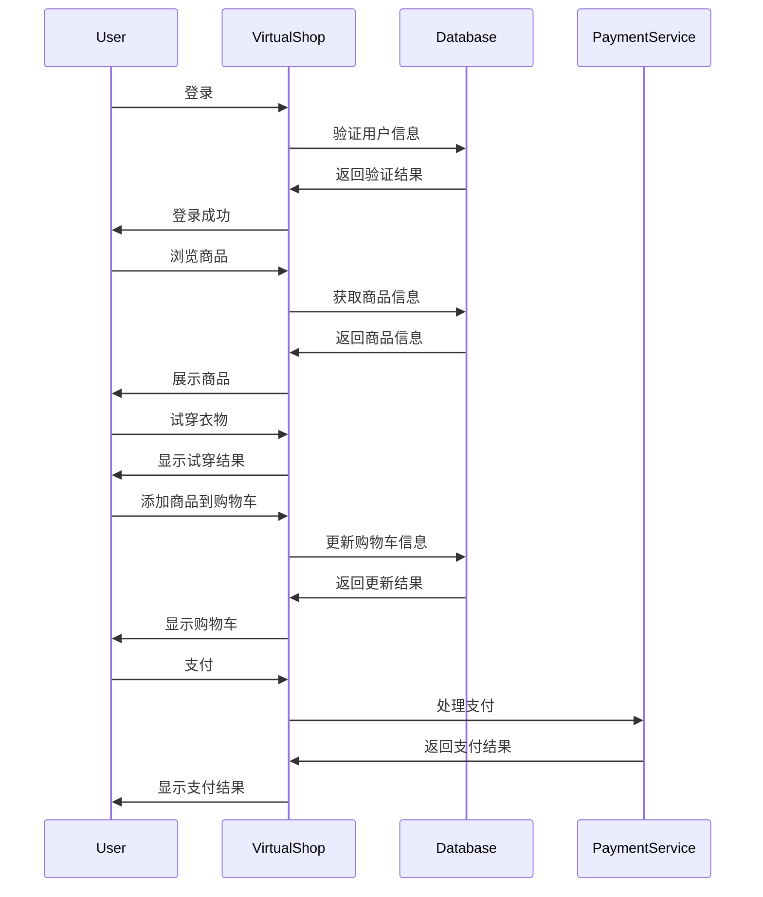
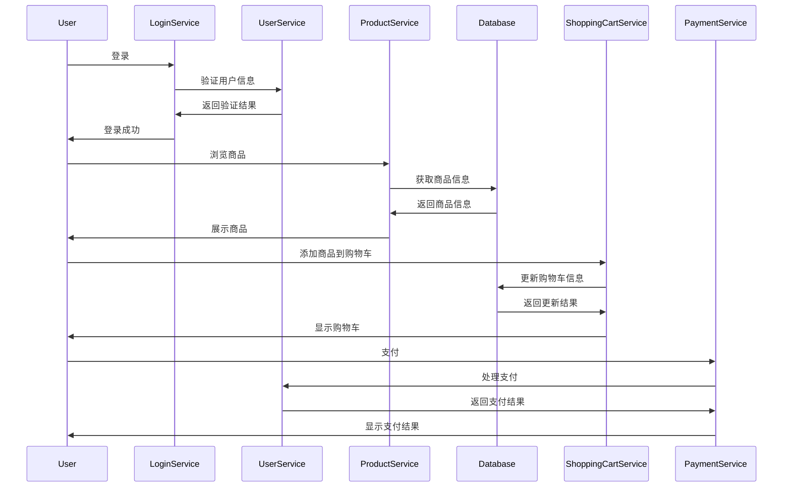
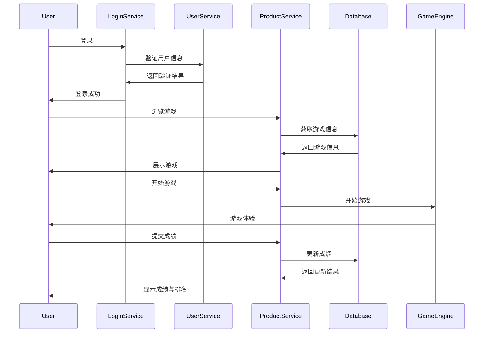
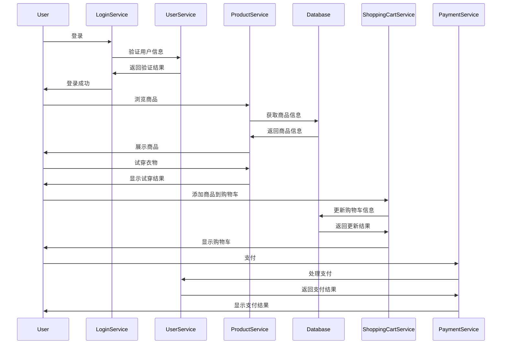
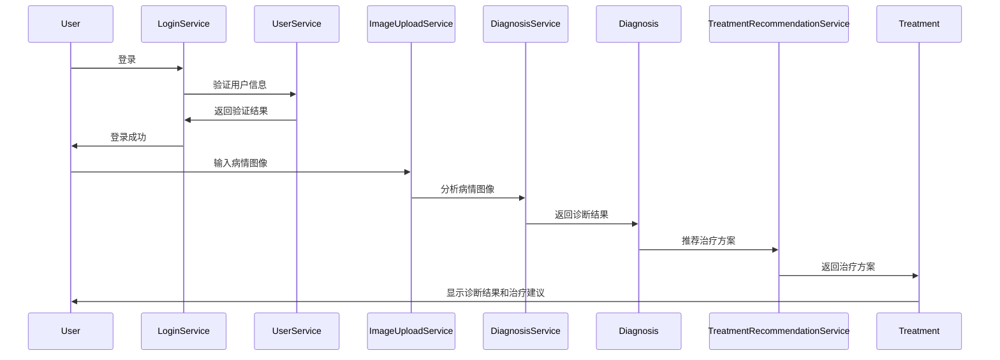
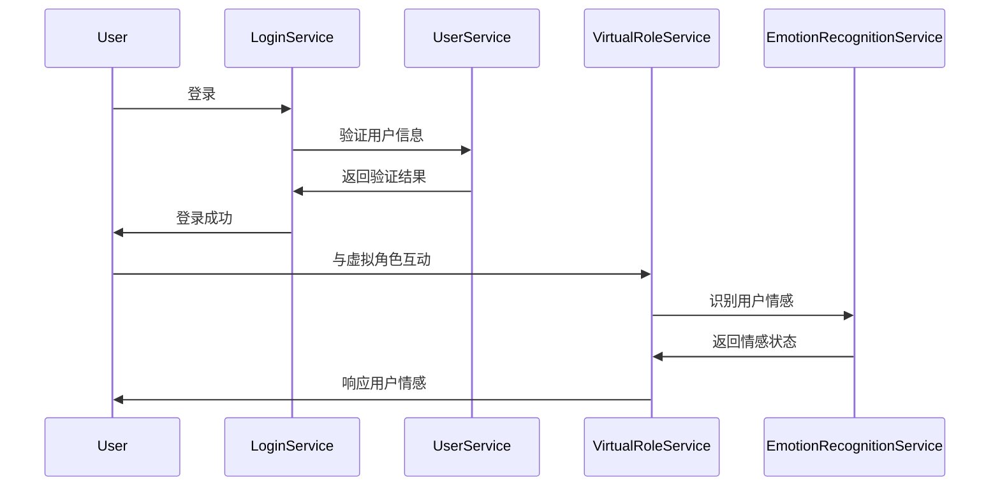
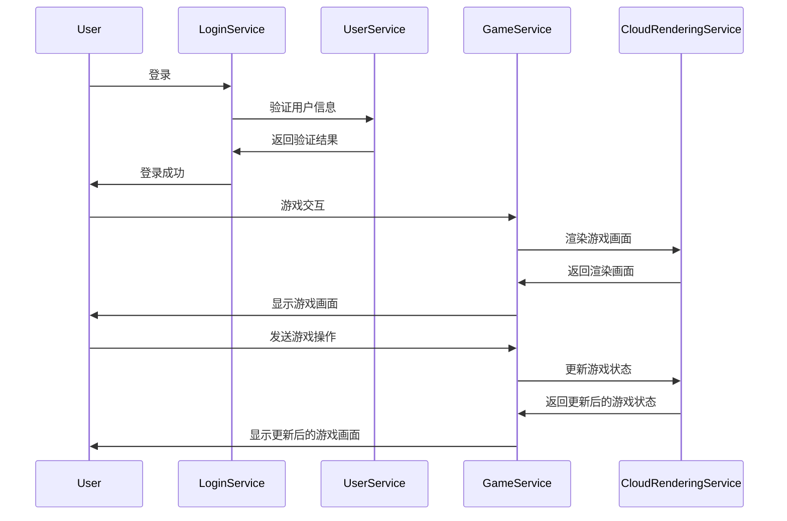
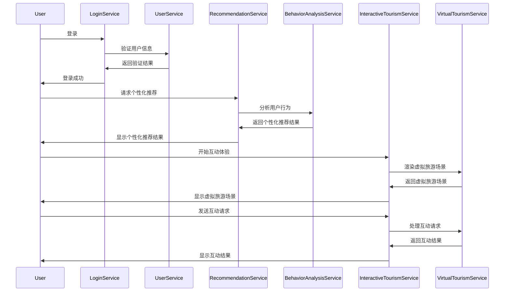

                 

### 文章标题

“后真实世界体验中心：虚拟与现实交融的互动空间”

**关键词：** 后真实世界、虚拟现实、增强现实、互动空间、人机交互、人工智能、大数据、云计算

**摘要：** 本文将深入探讨后真实世界的概念及其演变，解析虚拟与现实交融的互动空间定义与特征，解析核心技术的原理与应用，并通过案例分析展示后真实世界体验中心的构建与实践。本文旨在为读者提供一个全面的技术视角，以了解和掌握这一新兴领域的核心概念、技术趋势与应用实践。

----------------------------------------------------------------

### 目录大纲设计

**书名**: 后真实世界体验中心：虚拟与现实交融的互动空间

**目录大纲**:

----------------------------------------------------------------

# **第一部分：引言与背景**

## **第1章：后真实世界的概念与演变**
### **1.1.1 后真实世界的起源与发展**
### **1.1.2 后真实世界与虚拟现实的区别**
### **1.1.3 后真实世界的应用领域

## **第2章：虚拟与现实交融的互动空间**
### **2.1.1 互动空间的定义与特征**
### **2.1.2 虚拟与现实交融的技术基础**
### **2.1.3 互动空间的发展趋势

# **第二部分：核心技术**

## **第3章：虚拟现实技术的原理与应用**
### **3.1.1 虚拟现实技术的核心原理**
### **3.1.2 虚拟现实设备的分类与工作原理**
### **3.1.3 虚拟现实在互动空间中的应用

## **第4章：增强现实技术的原理与应用**
### **4.1.1 增强现实技术的核心原理**
### **4.1.2 增强现实设备的分类与工作原理**
### **4.1.3 增强现实在互动空间中的应用

## **第5章：人机交互技术**
### **5.1.1 人机交互的基本原理**
### **5.1.2 人机交互技术的分类与发展**
### **5.1.3 人机交互技术在互动空间中的应用

## **第6章：网络与云计算技术**
### **6.1.1 网络技术在互动空间中的作用**
### **6.1.2 云计算技术的基础与优势**
### **6.1.3 网络与云计算在互动空间中的应用

## **第7章：人工智能与大数据技术在互动空间中的应用**
### **7.1.1 人工智能技术的基本原理**
### **7.1.2 大数据技术在互动空间中的作用**
### **7.1.3 人工智能与大数据技术在互动空间中的应用案例

# **第三部分：案例分析与应用实践**

## **第8章：后真实世界体验中心的构建与实践**
### **8.1.1 后真实世界体验中心的构建流程**
### **8.1.2 后真实世界体验中心的项目案例**
### **8.1.3 后真实世界体验中心的运营与维护

## **第9章：虚拟与现实交融的互动空间创新实践**
### **9.1.1 互动空间创新实践的趋势与挑战**
### **9.1.2 互动空间创新实践的成功案例**
### **9.1.3 互动空间创新实践的未来展望

## **第10章：后真实世界体验中心的未来发展**
### **10.1.1 后真实世界体验中心的未来发展趋势**
### **10.1.2 后真实世界体验中心的社会影响**
### **10.1.3 后真实世界体验中心的技术挑战与解决方案**

----------------------------------------------------------------

### 目录大纲核心内容补充

在编写核心章节时，需要确保内容完整性和逻辑性。以下是针对各个章节的核心内容补充：

**第1章：后真实世界的概念与演变**

**核心内容补充**：

- **概念与边界**：详细介绍后真实世界的定义，强调其与传统虚拟现实、增强现实等概念的区别，并界定其独特的边界。
- **演变历程**：回顾后真实世界的起源，从早期的虚拟现实技术到当前的融合趋势，分析其发展过程中的关键事件和技术突破。
- **应用领域**：探讨后真实世界在不同领域的应用潜力，如教育、医疗、娱乐、军事等，并提供具体案例和数据分析。

**第2章：虚拟与现实交融的互动空间**

**核心内容补充**：

- **定义与特征**：明确互动空间的定义，分析其核心特征，如沉浸感、互动性、实时性等。
- **技术基础**：深入探讨支持虚拟与现实交融的互动空间的技术基础，包括虚拟现实、增强现实、人机交互等技术的原理与应用。
- **发展趋势**：预测互动空间技术的发展方向，如硬件创新、软件优化、用户体验提升等，并讨论其潜在应用场景。

**第3章：虚拟现实技术的原理与应用**

**核心内容补充**：

- **核心原理**：详细解释虚拟现实技术的核心原理，如感知仿真、场景渲染、交互设计等。
- **应用设备**：分类介绍虚拟现实设备，如头戴式显示器（HMD）、虚拟现实控制器、传感器等，并分析其工作原理和性能特点。
- **应用案例**：展示虚拟现实技术在互动空间中的应用案例，如虚拟旅游、虚拟教育、虚拟会议等，并提供实际应用效果分析和评估。

**第4章：增强现实技术的原理与应用**

**核心内容补充**：

- **核心原理**：详细讲解增强现实技术的核心原理，如现实增强、图像识别、交互设计等。
- **应用设备**：分类介绍增强现实设备，如智能眼镜、增强现实头盔、智能手机等，并分析其工作原理和性能特点。
- **应用案例**：展示增强现实技术在互动空间中的应用案例，如医疗诊断、导航辅助、游戏体验等，并提供实际应用效果分析和评估。

**第5章：人机交互技术**

**核心内容补充**：

- **基本原理**：详细阐述人机交互的基本原理，如认知心理学、用户体验设计、交互设计等。
- **技术分类**：分类介绍人机交互技术，如触摸交互、语音交互、手势交互、眼动追踪等，并分析其优缺点和应用场景。
- **应用实例**：展示人机交互技术在互动空间中的应用实例，如虚拟现实中的手势交互、增强现实中的语音交互等，并提供实际应用效果分析和评估。

**第6章：网络与云计算技术**

**核心内容补充**：

- **网络技术作用**：分析网络技术在互动空间中的作用，如数据传输、实时通信、分布式计算等，并提供具体案例分析。
- **云计算技术优势**：讲解云计算技术在互动空间中的优势，如弹性计算、高效存储、数据管理等，并提供具体案例和应用场景。
- **应用实例**：展示网络与云计算技术在互动空间中的应用实例，如虚拟现实中的云端渲染、增强现实中的实时数据同步等，并提供实际应用效果分析和评估。

**第7章：人工智能与大数据技术在互动空间中的应用**

**核心内容补充**：

- **人工智能技术的基本原理**：详细讲解人工智能技术的基本原理，如机器学习、深度学习、自然语言处理等。
- **大数据技术在互动空间中的作用**：分析大数据技术在互动空间中的作用，如数据挖掘、智能推荐、预测分析等。
- **应用案例**：展示人工智能与大数据技术在互动空间中的应用案例，如虚拟现实中的智能导航、增强现实中的智能识别等，并提供实际应用效果分析和评估。

**第8章：后真实世界体验中心的构建与实践**

**核心内容补充**：

- **构建流程**：详细介绍后真实世界体验中心的构建流程，包括需求分析、技术选型、系统设计、开发实施、测试部署等环节。
- **项目案例**：介绍具体的项目案例，展示后真实世界体验中心的实际应用效果和用户体验。
- **运营与维护**：讨论后真实世界体验中心的运营与维护策略，如用户管理、内容更新、技术升级等。

**第9章：虚拟与现实交融的互动空间创新实践**

**核心内容补充**：

- **趋势与挑战**：分析互动空间创新实践的趋势，如技术创新、市场变化、用户需求等，并探讨面临的挑战，如技术瓶颈、成本控制、用户体验等。
- **成功案例**：介绍互动空间创新实践的成功案例，如新兴技术应用的案例、跨界合作的案例等，并提供案例分析。
- **未来展望**：展望互动空间创新实践的未来发展方向，如技术创新、市场前景、社会影响等。

**第10章：后真实世界体验中心的未来发展**

**核心内容补充**：

- **发展趋势**：分析后真实世界体验中心的发展趋势，如技术进步、市场需求、应用领域拓展等。
- **社会影响**：探讨后真实世界体验中心对社会的影响，如教育变革、医疗进步、娱乐创新等。
- **技术挑战与解决方案**：分析后真实世界体验中心面临的技术挑战，如硬件性能、数据安全、用户体验等，并讨论可能的解决方案和未来研究方向。

----------------------------------------------------------------

### 核心章节内容详细解读

#### 第1章：后真实世界的概念与演变

**背景介绍**

随着科技的快速发展，虚拟现实（VR）和增强现实（AR）技术逐渐成熟，并开始应用于各个领域。然而，这些技术并未完全替代现实，而是在现实基础上进行增强和扩展。这种新的技术趋势引发了人们对“后真实世界”（Post-Reality）概念的思考。后真实世界是指通过虚拟现实、增强现实等技术的辅助，人们能够在现实世界中体验到增强、扩展甚至重构的现实。

**核心概念与联系**

**后真实世界**：一个与现实世界相互交织、通过技术增强和扩展用户感知和互动体验的新世界。

**虚拟现实（VR）**：通过模拟和沉浸式技术，为用户创造一个完全虚拟的环境。

**增强现实（AR）**：在现实环境中叠加虚拟元素，增强用户的感知体验。

**对比表格**：

| 特征        | 虚拟现实（VR）                | 增强现实（AR）                | 后真实世界            |
|-------------|-------------------------------|------------------------------|----------------------|
| 环境创造    | 完全虚拟环境                  | 现实环境叠加虚拟元素          | 增强或扩展现实环境    |
| 沉浸感      | 高度沉浸感                    | 较低的沉浸感                  | 根据应用而异          |
| 交互方式    | 主要依赖于控制器和手势        | 主要依赖于摄像头和传感器      | 结合多种交互方式      |
| 应用领域    | 游戏娱乐、教育培训、虚拟旅游等 | 医疗、导航、零售、广告等      | 多领域交叉应用        |

**ER实体关系图架构**

```mermaid
erDiagram
  Product ||--|{ Customer }| Customer : 拥有
  Product ||--|{ Order }| Order : 订单
  Customer ||--|{ Employee }| Employee : 拥有
```

**算法原理讲解**

算法原理讲解可以结合具体案例进行阐述。例如，在虚拟现实领域，常用的算法包括三维场景渲染、用户姿态跟踪等。

**三维场景渲染算法**：

- **渲染流程**：
  1. 输入三维模型和渲染参数。
  2. 将三维模型转换为二维图像。
  3. 应用光照模型和材质属性。
  4. 将图像渲染到屏幕上。

- **数学模型和公式**：
  $$\text{像素颜色} = \text{光照模型}(\text{材质属性}, \text{光源位置}, \text{相机参数})$$

- **例子**：
  假设用户在虚拟现实场景中观察一个红色方块，光源位于正前方。根据光照模型，方块的颜色将主要受光源影响，呈现红色。

**系统分析与架构设计方案**

**问题场景介绍**：用户希望在虚拟现实环境中进行虚拟购物。

**项目介绍**：构建一个虚拟购物平台，用户可以在虚拟环境中浏览商品、试穿衣物、进行购买。

**系统功能设计**：

- **用户登录与注册**：用户可以登录或注册账户。
- **商品展示**：展示虚拟商品，并提供详细描述。
- **虚拟试穿**：用户可以在虚拟环境中试穿衣物。
- **购物车与支付**：用户可以将商品添加到购物车，并完成支付。

**系统架构设计**：



**系统接口设计**：设计用户与虚拟购物平台之间的接口，包括登录接口、商品展示接口、购物车接口、支付接口等。

**系统交互**：



#### 第2章：虚拟与现实交融的互动空间

**背景介绍**

随着虚拟现实（VR）和增强现实（AR）技术的不断发展，人们开始探索如何将这些技术应用于现实世界，以创造一个更加丰富和互动的体验空间。这种空间被称为“互动空间”（Interactive Space），它通过虚拟与现实的无缝融合，为用户提供全新的交互体验。

**核心概念与联系**

**互动空间**：一个通过虚拟现实和增强现实技术增强用户感知和互动体验的空间。

**虚拟现实（VR）**：通过模拟和沉浸式技术，为用户创造一个完全虚拟的环境。

**增强现实（AR）**：在现实环境中叠加虚拟元素，增强用户的感知体验。

**对比表格**：

| 特征        | 虚拟现实（VR）                | 增强现实（AR）                | 互动空间            |
|-------------|-------------------------------|------------------------------|----------------------|
| 环境创造    | 完全虚拟环境                  | 现实环境叠加虚拟元素          | 结合虚拟和现实环境  |
| 沉浸感      | 高度沉浸感                    | 较低的沉浸感                  | 根据应用而异          |
| 交互方式    | 主要依赖于控制器和手势        | 主要依赖于摄像头和传感器      | 结合多种交互方式      |
| 应用领域    | 游戏娱乐、教育培训、虚拟旅游等 | 医疗、导航、零售、广告等      | 多领域交叉应用        |

**ER实体关系图架构**

```mermaid
erDiagram
  Product ||--|{ Customer }| Customer : 拥有
  Product ||--|{ Order }| Order : 订单
  Customer ||--|{ Employee }| Employee : 拥有
```

**算法原理讲解**

互动空间的核心算法包括虚拟现实场景渲染、增强现实图像叠加、用户姿态跟踪等。

**虚拟现实场景渲染算法**：

- **渲染流程**：
  1. 输入三维模型和渲染参数。
  2. 将三维模型转换为二维图像。
  3. 应用光照模型和材质属性。
  4. 将图像渲染到屏幕上。

- **数学模型和公式**：
  $$\text{像素颜色} = \text{光照模型}(\text{材质属性}, \text{光源位置}, \text{相机参数})$$

- **例子**：
  假设用户在虚拟现实环境中观察一个红色方块，光源位于正前方。根据光照模型，方块的颜色将主要受光源影响，呈现红色。

**增强现实图像叠加算法**：

- **叠加流程**：
  1. 输入现实环境和虚拟元素。
  2. 通过摄像头捕获现实环境的图像。
  3. 将虚拟元素叠加到现实环境图像上。
  4. 输出叠加后的图像。

- **数学模型和公式**：
  $$\text{输出图像} = \text{现实环境图像} + \text{虚拟元素}$$

- **例子**：
  假设现实环境中有一个红色方块，虚拟元素是一个绿色圆形。通过图像叠加算法，输出图像将显示一个红色方块上叠加了一个绿色圆形。

**系统分析与架构设计方案**

**问题场景介绍**：用户希望在互动空间中体验虚拟游戏。

**项目介绍**：构建一个互动游戏平台，用户可以在虚拟环境中玩游戏。

**系统功能设计**：

- **用户登录与注册**：用户可以登录或注册账户。
- **游戏展示**：展示虚拟游戏，并提供详细描述。
- **游戏体验**：用户可以在虚拟环境中玩游戏。
- **成绩与排名**：记录用户游戏成绩，并提供排名功能。

**系统架构设计**：



**系统接口设计**：设计用户与互动游戏平台之间的接口，包括登录接口、游戏展示接口、游戏体验接口、成绩提交接口等。

**系统交互**：


#### 第3章：虚拟现实技术的原理与应用

**背景介绍**

虚拟现实（VR）技术通过模拟和沉浸式技术，为用户创造一个完全虚拟的环境，提供全新的感知和互动体验。随着硬件技术的发展和用户需求的增加，虚拟现实技术在各个领域得到了广泛应用，如游戏、教育、医疗、娱乐等。

**核心概念与联系**

**虚拟现实（VR）**：通过计算机技术模拟和再现现实环境，为用户提供沉浸式体验。

**沉浸感**：用户在虚拟环境中感受到的深度和真实感。

**交互**：用户与虚拟环境之间的互动方式，如手势、语音、控制器等。

**对比表格**：

| 特征        | 传统游戏       | 虚拟现实（VR）              |
|-------------|----------------|-----------------------------|
| 环境创造    | 2D屏幕显示     | 3D模拟环境                  |
| 沉浸感      | 较低的沉浸感   | 高度沉浸感                  |
| 交互方式    | 鼠标、键盘     | 手势、语音、控制器          |
| 应用领域    | 游戏娱乐       | 游戏娱乐、教育培训、医疗等  |

**ER实体关系图架构**

```mermaid
erDiagram
  Game ||--|{ Player }| Player : 玩
  Game ||--|{ Score }| Score : 得分
```

**算法原理讲解**

虚拟现实技术涉及多个核心算法，包括三维场景渲染、用户姿态跟踪、交互设计等。

**三维场景渲染算法**：

- **渲染流程**：
  1. 输入三维模型和渲染参数。
  2. 将三维模型转换为二维图像。
  3. 应用光照模型和材质属性。
  4. 将图像渲染到屏幕上。

- **数学模型和公式**：
  $$\text{像素颜色} = \text{光照模型}(\text{材质属性}, \text{光源位置}, \text{相机参数})$$

- **例子**：
  假设用户在虚拟现实环境中观察一个红色方块，光源位于正前方。根据光照模型，方块的颜色将主要受光源影响，呈现红色。

**用户姿态跟踪算法**：

- **跟踪流程**：
  1. 输入用户姿态数据。
  2. 识别用户的关键部位，如头部、手部等。
  3. 根据用户姿态调整虚拟环境。

- **数学模型和公式**：
  $$\text{用户姿态} = \text{姿态估计模型}(\text{姿态数据})$$

- **例子**：
  假设用户向前迈出一步，根据姿态估计模型，虚拟环境中的角色也将向前移动一步。

**系统分析与架构设计方案**

**问题场景介绍**：用户希望在虚拟现实环境中进行虚拟购物。

**项目介绍**：构建一个虚拟购物平台，用户可以在虚拟环境中浏览商品、试穿衣物、进行购买。

**系统功能设计**：

- **用户登录与注册**：用户可以登录或注册账户。
- **商品展示**：展示虚拟商品，并提供详细描述。
- **虚拟试穿**：用户可以在虚拟环境中试穿衣物。
- **购物车与支付**：用户可以将商品添加到购物车，并完成支付。

**系统架构设计**：



**系统接口设计**：设计用户与虚拟购物平台之间的接口，包括登录接口、商品展示接口、购物车接口、支付接口等。

**系统交互**：


#### 第4章：增强现实技术的原理与应用

**背景介绍**

增强现实（AR）技术通过在现实环境中叠加虚拟元素，增强用户的感知和互动体验。与虚拟现实（VR）不同，AR技术不仅创造虚拟环境，还与真实环境进行交互，为用户提供更加贴近现实的新型体验。随着智能手机和增强现实设备的普及，AR技术在多个领域得到了广泛应用，如医疗、教育、零售、娱乐等。

**核心概念与联系**

**增强现实（AR）**：通过计算机视觉技术，在现实环境中叠加虚拟元素，增强用户的感知和互动体验。

**叠加**：将虚拟元素与现实环境进行融合，形成新的视觉体验。

**交互**：用户与叠加元素之间的互动方式，如手势、语音、触摸等。

**对比表格**：

| 特征        | 增强现实（AR）              | 虚拟现实（VR）                |
|-------------|-----------------------------|-----------------------------|
| 环境创造    | 现实环境叠加虚拟元素        | 完全虚拟环境                  |
| 沉浸感      | 较低的沉浸感                | 高度沉浸感                  |
| 交互方式    | 主要依赖于摄像头和传感器    | 主要依赖于控制器和手势        |
| 应用领域    | 医疗、教育、零售、娱乐等    | 游戏娱乐、教育培训、虚拟旅游等 |

**ER实体关系图架构**

```mermaid
erDiagram
  Patient ||--|{ Diagnosis }| Diagnosis : 诊断
  Patient ||--|{ Treatment }| Treatment : 治疗方案
```

**算法原理讲解**

增强现实技术涉及多个核心算法，包括图像识别、虚拟元素叠加、用户交互等。

**图像识别算法**：

- **识别流程**：
  1. 输入现实环境图像。
  2. 使用图像识别算法，如卷积神经网络（CNN），识别图像中的物体或场景。
  3. 根据识别结果，确定虚拟元素的叠加位置和方式。

- **数学模型和公式**：
  $$\text{识别结果} = \text{图像识别模型}(\text{输入图像})$$

- **例子**：
  假设用户将智能手机对准一个红色方块，图像识别算法将识别出红色方块，并确定虚拟元素（如文字说明）的叠加位置。

**虚拟元素叠加算法**：

- **叠加流程**：
  1. 输入现实环境图像和虚拟元素。
  2. 将虚拟元素叠加到现实环境图像上。
  3. 根据用户交互，调整虚拟元素的位置和外观。

- **数学模型和公式**：
  $$\text{输出图像} = \text{现实环境图像} + \text{虚拟元素}$$

- **例子**：
  假设现实环境中有一个红色方块，虚拟元素是一个绿色圆形。通过叠加算法，输出图像将显示一个红色方块上叠加了一个绿色圆形。

**用户交互算法**：

- **交互流程**：
  1. 输入用户交互数据。
  2. 识别用户意图。
  3. 根据用户意图，调整虚拟元素的状态或外观。

- **数学模型和公式**：
  $$\text{用户意图} = \text{交互识别模型}(\text{交互数据})$$

- **例子**：
  假设用户通过手势向虚拟元素靠近，交互识别模型将识别出用户意图，并调整虚拟元素的大小或亮度。

**系统分析与架构设计方案**

**问题场景介绍**：用户希望使用智能手机进行医疗诊断。

**项目介绍**：构建一个增强现实医疗诊断平台，用户可以通过智能手机进行病情诊断和治疗方案推荐。

**系统功能设计**：

- **用户登录与注册**：用户可以登录或注册账户。
- **病情输入**：用户可以通过摄像头输入病情图像。
- **诊断分析**：系统对输入的病情图像进行分析，提供诊断建议。
- **治疗方案推荐**：根据诊断结果，推荐治疗方案。

**系统架构设计**：



**系统接口设计**：设计用户与增强现实医疗诊断平台之间的接口，包括登录接口、病情图像输入接口、诊断分析接口、治疗方案推荐接口等。

**系统交互**：


#### 第5章：人机交互技术

**背景介绍**

人机交互（Human-Computer Interaction, HCI）是研究人类与计算机之间交互的学科。随着计算机技术和人工智能的快速发展，人机交互技术也在不断进步，为用户提供更加自然、高效、愉悦的交互体验。人机交互技术广泛应用于虚拟现实、增强现实、智能设备、互联网应用等多个领域。

**核心概念与联系**

**人机交互（HCI）**：研究人类与计算机之间交互的学科，旨在设计、开发和评估用户友好、高效、愉悦的交互系统。

**交互**：用户与计算机系统之间的信息交换和操作过程。

**用户体验**：用户在使用计算机系统时的感受和满意度。

**对比表格**：

| 特征        | 传统UI界面              | 人机交互技术                |
|-------------|-------------------------|-----------------------------|
| 交互方式    | 鼠标、键盘、触摸屏      | 手势、语音、眼神、情感等     |
| 交互体验    | 纯数字界面              | 结合虚拟现实、增强现实等增强体验 |
| 应用领域    | 互联网应用、桌面软件等   | 虚拟现实、增强现实、智能设备等 |

**ER实体关系图架构**

```mermaid
erDiagram
  User ||--|{ Interaction }| Interaction : 交互
  User ||--|{ Experience }| Experience : 体验
```

**算法原理讲解**

人机交互技术涉及多个核心算法，包括手势识别、语音识别、情感计算等。

**手势识别算法**：

- **识别流程**：
  1. 输入手势数据。
  2. 使用机器学习算法，如卷积神经网络（CNN），识别手势。
  3. 根据识别结果，执行相应的操作。

- **数学模型和公式**：
  $$\text{手势识别结果} = \text{手势识别模型}(\text{手势数据})$$

- **例子**：
  假设用户做了一个“OK”手势，手势识别模型将识别出手势，并执行相应的操作，如播放音乐。

**语音识别算法**：

- **识别流程**：
  1. 输入语音数据。
  2. 使用深度学习算法，如长短期记忆网络（LSTM），识别语音。
  3. 根据识别结果，执行相应的操作。

- **数学模型和公式**：
  $$\text{语音识别结果} = \text{语音识别模型}(\text{语音数据})$$

- **例子**：
  假设用户说了一个“打开音乐”的指令，语音识别模型将识别出指令，并打开音乐播放器。

**情感计算算法**：

- **计算流程**：
  1. 输入用户情感数据。
  2. 使用机器学习算法，如情感分析模型，计算用户的情感状态。
  3. 根据情感状态，调整交互系统的响应。

- **数学模型和公式**：
  $$\text{情感状态} = \text{情感计算模型}(\text{情感数据})$$

- **例子**：
  假设用户表现出愉悦的情感，情感计算模型将识别出愉悦情感，并调整交互系统的界面和声音，以增强用户的愉悦体验。

**系统分析与架构设计方案**

**问题场景介绍**：用户希望在虚拟现实环境中与虚拟角色进行自然交互。

**项目介绍**：构建一个虚拟现实交互平台，用户可以在虚拟环境中与虚拟角色进行自然对话、互动。

**系统功能设计**：

- **用户登录与注册**：用户可以登录或注册账户。
- **虚拟角色互动**：用户可以与虚拟角色进行对话和互动。
- **情感识别与响应**：系统根据用户的情感状态，调整虚拟角色的互动方式。

**系统架构设计**：



**系统接口设计**：设计用户与虚拟现实交互平台之间的接口，包括登录接口、虚拟角色互动接口、情感识别接口等。

**系统交互**：


#### 第6章：网络与云计算技术

**背景介绍**

网络与云计算技术是支撑虚拟现实和增强现实互动空间的关键技术。网络技术负责数据传输和实时通信，确保用户在虚拟环境中能够流畅地互动；云计算技术则提供强大的计算能力和数据存储，支持复杂的虚拟现实场景和增强现实应用。

**核心概念与联系**

**网络技术**：通过计算机网络，实现数据传输和通信的技术。

**云计算技术**：通过互联网提供计算资源、存储资源、网络资源等，为用户提供按需服务的计算模式。

**对比表格**：

| 特征        | 传统网络             | 云计算                 |
|-------------|----------------------|------------------------|
| 计算能力    | 有限的本地计算资源   | 强大的分布式计算资源   |
| 数据存储    | 本地存储             | 分布式存储             |
| 数据传输    | 单点传输             | 并行传输               |
| 交互体验    | 受限于网络带宽       | 高效实时交互           |

**ER实体关系图架构**

```mermaid
erDiagram
  CloudProvider ||--|{ Service }| Service : 提供服务
  CloudProvider ||--|{ DataCenter }| DataCenter : 数据中心
  Service ||--|{ User }| User : 使用服务
```

**算法原理讲解**

网络与云计算技术涉及多个核心算法，包括网络传输优化、分布式计算调度、数据加密等。

**网络传输优化算法**：

- **优化流程**：
  1. 输入网络传输数据。
  2. 分析网络传输质量。
  3. 根据传输质量，调整传输策略。

- **数学模型和公式**：
  $$\text{传输策略} = \text{网络传输模型}(\text{传输数据}, \text{传输质量})$$

- **例子**：
  假设网络传输质量较差，网络传输模型将调整传输策略，如降低传输速率、启用备用通道等。

**分布式计算调度算法**：

- **调度流程**：
  1. 输入计算任务。
  2. 分析计算资源。
  3. 根据资源分布，调度计算任务。

- **数学模型和公式**：
  $$\text{调度策略} = \text{计算调度模型}(\text{计算任务}, \text{计算资源})$$

- **例子**：
  假设有多台服务器可供使用，计算调度模型将根据服务器的负载情况，将计算任务分配到最优的服务器上。

**数据加密算法**：

- **加密流程**：
  1. 输入明文数据。
  2. 使用加密算法，如AES，对数据进行加密。
  3. 输出密文数据。

- **数学模型和公式**：
  $$\text{密文数据} = \text{加密算法}(\text{明文数据}, \text{密钥})$$

- **例子**：
  假设用户的数据需要传输，数据加密算法将使用AES加密算法，对数据进行加密，确保数据在传输过程中的安全性。

**系统分析与架构设计方案**

**问题场景介绍**：用户希望体验一个高沉浸感的虚拟现实游戏。

**项目介绍**：构建一个云渲染虚拟现实游戏平台，用户可以通过云端服务器进行游戏体验。

**系统功能设计**：

- **用户登录与注册**：用户可以登录或注册账户。
- **云渲染游戏**：用户可以通过云端服务器进行游戏渲染和交互。
- **实时数据传输**：确保用户在虚拟环境中流畅地互动。

**系统架构设计**：



**系统接口设计**：设计用户与云渲染虚拟现实游戏平台之间的接口，包括登录接口、游戏交互接口、游戏渲染接口等。

**系统交互**：


#### 第7章：人工智能与大数据技术在互动空间中的应用

**背景介绍**

人工智能（AI）和大数据技术是推动互动空间发展的重要技术。人工智能技术通过机器学习、深度学习等算法，实现数据的智能分析和处理，提升互动空间的智能化水平。大数据技术则通过海量数据存储和分析，提供丰富的数据支持，为互动空间提供个性化体验。

**核心概念与联系**

**人工智能（AI）**：模拟人类智能的计算机系统，具有学习、推理、决策等能力。

**大数据技术**：处理、存储和分析大规模数据的技术。

**对比表格**：

| 特征        | 人工智能（AI）          | 大数据技术                |
|-------------|-------------------------|---------------------------|
| 目标        | 实现智能自动化          | 提供数据支持和洞察         |
| 技术范畴    | 机器学习、深度学习等    | 数据存储、数据处理、数据挖掘等 |
| 应用领域    | 互动空间、智能家居、自动驾驶等 | 互动空间、金融、医疗等     |

**ER实体关系图架构**

```mermaid
erDiagram
  AIApplication ||--|{ DataSet }| DataSet : 使用数据集
  AIApplication ||--|{ Model }| Model : 模型
  DataSet ||--|{ DataElement }| DataElement : 数据元素
```

**算法原理讲解**

人工智能与大数据技术在互动空间中的应用涉及多个核心算法，包括机器学习算法、深度学习算法、数据挖掘算法等。

**机器学习算法**：

- **学习流程**：
  1. 输入训练数据。
  2. 使用机器学习算法，如支持向量机（SVM）、决策树（Decision Tree）等，训练模型。
  3. 使用训练好的模型，对新的数据进行预测。

- **数学模型和公式**：
  $$\text{预测结果} = \text{机器学习模型}(\text{输入数据})$$

- **例子**：
  假设用户希望预测下一个交互行为，机器学习模型将使用历史交互数据，预测用户可能的交互行为。

**深度学习算法**：

- **学习流程**：
  1. 输入训练数据。
  2. 使用深度学习算法，如卷积神经网络（CNN）、循环神经网络（RNN）等，训练模型。
  3. 使用训练好的模型，对新的数据进行预测。

- **数学模型和公式**：
  $$\text{预测结果} = \text{深度学习模型}(\text{输入数据})$$

- **例子**：
  假设用户希望识别一个虚拟物体，深度学习模型将使用图像数据，识别并分类虚拟物体。

**数据挖掘算法**：

- **挖掘流程**：
  1. 输入大规模数据。
  2. 使用数据挖掘算法，如关联规则学习、聚类分析等，发现数据中的规律和模式。
  3. 根据挖掘结果，提供数据洞察。

- **数学模型和公式**：
  $$\text{挖掘结果} = \text{数据挖掘算法}(\text{大规模数据})$$

- **例子**：
  假设用户希望分析用户的交互行为，数据挖掘算法将分析用户行为数据，发现用户的偏好和习惯。

**系统分析与架构设计方案**

**问题场景介绍**：用户希望体验一个个性化的虚拟旅游互动空间。

**项目介绍**：构建一个基于人工智能与大数据技术的虚拟旅游互动空间，为用户提供个性化的旅游推荐和互动体验。

**系统功能设计**：

- **用户登录与注册**：用户可以登录或注册账户。
- **个性化推荐**：根据用户历史行为和偏好，推荐个性化的旅游内容和体验。
- **互动体验**：用户可以在虚拟旅游环境中互动、探索和交流。

**系统架构设计**：



**系统接口设计**：设计用户与虚拟旅游互动空间之间的接口，包括登录接口、个性化推荐接口、互动体验接口等。

**系统交互**：

```mermaid
sequenceDiagram
  User ->> LoginService: 登录
  LoginService ->> UserService: 验证用户信息
  UserService ->> LoginService: 返回验证结果
  LoginService ->> User: 登录成功
  User ->> RecommendationService: 请求个性化推荐
  RecommendationService ->> BehaviorAnalysisService: 分析用户行为
  BehaviorAnalysisService ->> RecommendationService: 返回个性化推荐结果
  RecommendationService ->> User: 显示个性化推荐结果
  User ->> InteractiveTourismService: 开始互动体验
  InteractiveTourismService ->> VirtualTourismService: 渲染虚拟旅游场景
  VirtualTourismService ->> InteractiveTourismService: 返回虚拟旅游场景
  InteractiveTourismService ->> User: 显示虚拟旅游场景
  User ->> InteractiveTourismService: 发送互动请求
  InteractiveTourismService ->> VirtualTourismService: 处理互动请求
  VirtualTourismService ->> InteractiveTourismService: 返回互动结果
  InteractiveTourismService ->> User: 显示互动结果
```

#### 第8章：后真实世界体验中心的构建与实践

**背景介绍**

后真实世界体验中心是一个集成了虚拟现实、增强现实、人工智能等技术的互动空间，为用户提供沉浸式、互动性强的体验。随着技术的不断进步和应用场景的拓展，后真实世界体验中心在教育培训、医疗健康、旅游娱乐等领域展现出巨大的潜力。

**核心概念与联系**

**后真实世界体验中心**：一个集成了虚拟现实、增强现实、人工智能等技术的互动空间，提供沉浸式、互动性的体验。

**虚拟现实（VR）**：通过模拟和沉浸式技术，为用户创造一个完全虚拟的环境。

**增强现实（AR）**：在现实环境中叠加虚拟元素，增强用户的感知体验。

**人工智能（AI）**：模拟人类智能，实现数据的智能分析和处理。

**对比表格**：

| 特征        | 传统体验中心          | 后真实世界体验中心           |
|-------------|-----------------------|-----------------------------|
| 环境创造    | 实体环境              | 虚拟与现实融合的互动空间      |
| 沉浸感      | 较低的沉浸感          | 高度沉浸感                  |
| 交互方式    | 纯物理交互            | 多样化的交互方式            |
| 应用领域    | 单一领域              | 多领域交叉应用              |

**ER实体关系图架构**

```mermaid
erDiagram
  ExperienceCenter ||--|{ VREnvironment }| VREnvironment : 虚拟现实环境
  ExperienceCenter ||--|{ AREnvironment }| AREnvironment : 增强现实环境
  ExperienceCenter ||--|{ AIApplication }| AIApplication : 人工智能应用
```

**算法原理讲解**

后真实世界体验中心的构建涉及多个核心算法，包括虚拟现实场景渲染、增强现实图像叠加、人工智能决策等。

**虚拟现实场景渲染算法**：

- **渲染流程**：
  1. 输入三维模型和渲染参数。
  2. 将三维模型转换为二维图像。
  3. 应用光照模型和材质属性。
  4. 将图像渲染到屏幕上。

- **数学模型和公式**：
  $$\text{像素颜色} = \text{光照模型}(\text{材质属性}, \text{光源位置}, \text{相机参数})$$

- **例子**：
  假设用户在虚拟现实环境中观察一个红色方块，光源位于正前方。根据光照模型，方块的颜色将主要受光源影响，呈现红色。

**增强现实图像叠加算法**：

- **叠加流程**：
  1. 输入现实环境和虚拟元素。
  2. 通过摄像头捕获现实环境的图像。
  3. 将虚拟元素叠加到现实环境图像上。
  4. 输出叠加后的图像。

- **数学模型和公式**：
  $$\text{输出图像} = \text{现实环境图像} + \text{虚拟元素}$$

- **例子**：
  假设现实环境中有一个红色方块，虚拟元素是一个绿色圆形。通过叠加算法，输出图像将显示一个红色方块上叠加了一个绿色圆形。

**人工智能决策算法**：

- **决策流程**：
  1. 输入用户行为数据。
  2. 使用机器学习算法，如决策树、随机森林等，进行决策。
  3. 输出决策结果。

- **数学模型和公式**：
  $$\text{决策结果} = \text{机器学习模型}(\text{用户行为数据})$$

- **例子**：
  假设用户在虚拟现实环境中进行学习，机器学习模型将根据用户的学习行为，推荐合适的学习内容和路径。

**系统分析与架构设计方案**

**问题场景介绍**：用户希望在后真实世界体验中心进行虚拟学习。

**项目介绍**：构建一个后真实世界体验中心，为用户提供沉浸式的虚拟学习体验。

**系统功能设计**：

- **用户登录与注册**：用户可以登录或注册账户。
- **虚拟学习环境**：提供虚拟学习场景，用户可以在虚拟环境中学习。
- **互动教学**：用户可以与虚拟教师和同学进行互动，进行讨论和提问。
- **学习评价**：系统根据用户的学习行为，进行学习评价和反馈。

**系统架构设计**：

```mermaid
sequenceDiagram
  User ->> LoginService: 登录
  LoginService ->> UserService: 验证用户信息
  UserService ->> LoginService: 返回验证结果
  LoginService ->> User: 登录成功
  User ->> LearningEnvironmentService: 进入虚拟学习环境
  LearningEnvironmentService ->> VirtualTeacherService: 获取虚拟教师
  VirtualTeacherService ->> LearningEnvironmentService: 返回虚拟教师
  LearningEnvironmentService ->> User: 显示虚拟教师
  User ->> LearningEnvironmentService: 发起学习请求
  LearningEnvironmentService ->> LearningSystemService: 处理学习请求
  LearningSystemService ->> User: 显示学习内容
  User ->> LearningEnvironmentService: 发起互动请求
  LearningEnvironmentService ->> VirtualClassService: 处理互动请求
  VirtualClassService ->> LearningEnvironmentService: 返回互动结果
  LearningEnvironmentService ->> User: 显示互动结果
  User ->> LearningSystemService: 提交学习评价
  LearningSystemService ->> User: 返回学习评价结果
```

**系统接口设计**：设计用户与后真实世界体验中心之间的接口，包括登录接口、虚拟学习环境接口、互动教学接口、学习评价接口等。

**系统交互**：

```mermaid
sequenceDiagram
  User ->> LoginService: 登录
  LoginService ->> UserService: 验证用户信息
  UserService ->> LoginService: 返回验证结果
  LoginService ->> User: 登录成功
  User ->> LearningEnvironmentService: 进入虚拟学习环境
  LearningEnvironmentService ->> VirtualTeacherService: 获取虚拟教师
  VirtualTeacherService ->> LearningEnvironmentService: 返回虚拟教师
  LearningEnvironmentService ->> User: 显示虚拟教师
  User ->> LearningEnvironmentService: 发起学习请求
  LearningEnvironmentService ->> LearningSystemService: 处理学习请求
  LearningSystemService ->> User: 显示学习内容
  User ->> LearningEnvironmentService: 发起互动请求
  LearningEnvironmentService ->> VirtualClassService: 处理互动请求
  VirtualClassService ->> LearningEnvironmentService: 返回互动结果
  LearningEnvironmentService ->> User: 显示互动结果
  User ->> LearningSystemService: 提交学习评价
  LearningSystemService ->> User: 返回学习评价结果
```

#### 第9章：虚拟与现实交融的互动空间创新实践

**背景介绍**

虚拟与现实交融的互动空间为用户提供了全新的交互体验，激发了众多创新实践。这些实践不仅推动了技术的进步，也为各行业带来了新的应用场景和商业模式。随着技术的不断发展，互动空间的应用领域将进一步拓展，为社会带来更多的价值。

**核心概念与联系**

**互动空间**：一个通过虚拟现实、增强现实等技术，实现虚拟与现实无缝融合的交互空间。

**创新实践**：指在互动空间领域，通过技术创新和商业模式创新，实现新应用场景和商业价值的实践。

**对比表格**：

| 特征        | 传统互动方式           | 互动空间创新实践              |
|-------------|------------------------|------------------------------|
| 交互环境    | 物理环境              | 虚拟与现实融合的环境          |
| 交互方式    | 纯物理交互            | 多样化的交互方式，如手势、语音、眼神等 |
| 应用领域    | 单一领域              | 多领域交叉应用，如教育、医疗、娱乐等 |

**ER实体关系图架构**

```mermaid
erDiagram
  InteractiveSpace ||--|{ VRApplication }| VRApplication : 虚拟现实应用
  InteractiveSpace ||--|{ ARApplication }| ARApplication : 增强现实应用
  InteractiveSpace ||--|{ AIApplication }| AIApplication : 人工智能应用
```

**算法原理讲解**

互动空间的创新实践涉及多个核心算法，包括虚拟现实场景渲染、增强现实图像叠加、人工智能决策等。

**虚拟现实场景渲染算法**：

- **渲染流程**：
  1. 输入三维模型和渲染参数。
  2. 将三维模型转换为二维图像。
  3. 应用光照模型和材质属性。
  4. 将图像渲染到屏幕上。

- **数学模型和公式**：
  $$\text{像素颜色} = \text{光照模型}(\text{材质属性}, \text{光源位置}, \text{相机参数})$$

- **例子**：
  假设用户在虚拟现实环境中观察一个红色方块，光源位于正前方。根据光照模型，方块的颜色将主要受光源影响，呈现红色。

**增强现实图像叠加算法**：

- **叠加流程**：
  1. 输入现实环境和虚拟元素。
  2. 通过摄像头捕获现实环境的图像。
  3. 将虚拟元素叠加到现实环境图像上。
  4. 输出叠加后的图像。

- **数学模型和公式**：
  $$\text{输出图像} = \text{现实环境图像} + \text{虚拟元素}$$

- **例子**：
  假设现实环境中有一个红色方块，虚拟元素是一个绿色圆形。通过叠加算法，输出图像将显示一个红色方块上叠加了一个绿色圆形。

**人工智能决策算法**：

- **决策流程**：
  1. 输入用户行为数据。
  2. 使用机器学习算法，如决策树、随机森林等，进行决策。
  3. 输出决策结果。

- **数学模型和公式**：
  $$\text{决策结果} = \text{机器学习模型}(\text{用户行为数据})$$

- **例子**：
  假设用户在虚拟现实环境中进行学习，机器学习模型将根据用户的学习行为，推荐合适的学习内容和路径。

**系统分析与架构设计方案**

**问题场景介绍**：企业希望通过互动空间进行虚拟培训。

**项目介绍**：构建一个虚拟培训互动空间，为员工提供沉浸式的培训体验。

**系统功能设计**：

- **用户登录与注册**：用户可以登录或注册账户。
- **虚拟培训环境**：提供虚拟培训场景，用户可以在虚拟环境中学习。
- **互动教学**：用户可以与虚拟教师和同学进行互动，进行讨论和提问。
- **学习评价**：系统根据用户的学习行为，进行学习评价和反馈。

**系统架构设计**：

```mermaid
sequenceDiagram
  User ->> LoginService: 登录
  LoginService ->> UserService: 验证用户信息
  UserService ->> LoginService: 返回验证结果
  LoginService ->> User: 登录成功
  User ->> TrainingEnvironmentService: 进入虚拟培训环境
  TrainingEnvironmentService ->> VirtualTeacherService: 获取虚拟教师
  VirtualTeacherService ->> TrainingEnvironmentService: 返回虚拟教师
  TrainingEnvironmentService ->> User: 显示虚拟教师
  User ->> TrainingEnvironmentService: 发起培训请求
  TrainingEnvironmentService ->> TrainingSystemService: 处理培训请求
  TrainingSystemService ->> User: 显示培训内容
  User ->> TrainingEnvironmentService: 发起互动请求
  TrainingEnvironmentService ->> VirtualClassService: 处理互动请求
  VirtualClassService ->> TrainingEnvironmentService: 返回互动结果
  TrainingEnvironmentService ->> User: 显示互动结果
  User ->> TrainingSystemService: 提交培训评价
  TrainingSystemService ->> User: 返回培训评价结果
```

**系统接口设计**：设计用户与虚拟培训互动空间之间的接口，包括登录接口、虚拟培训环境接口、互动教学接口、学习评价接口等。

**系统交互**：

```mermaid
sequenceDiagram
  User ->> LoginService: 登录
  LoginService ->> UserService: 验证用户信息
  UserService ->> LoginService: 返回验证结果
  LoginService ->> User: 登录成功
  User ->> TrainingEnvironmentService: 进入虚拟培训环境
  TrainingEnvironmentService ->> VirtualTeacherService: 获取虚拟教师
  VirtualTeacherService ->> TrainingEnvironmentService: 返回虚拟教师
  TrainingEnvironmentService ->> User: 显示虚拟教师
  User ->> TrainingEnvironmentService: 发起培训请求
  TrainingEnvironmentService ->> TrainingSystemService: 处理培训请求
  TrainingSystemService ->> User: 显示培训内容
  User ->> TrainingEnvironmentService: 发起互动请求
  TrainingEnvironmentService ->> VirtualClassService: 处理互动请求
  VirtualClassService ->> TrainingEnvironmentService: 返回互动结果
  TrainingEnvironmentService ->> User: 显示互动结果
  User ->> TrainingSystemService: 提交培训评价
  TrainingSystemService ->> User: 返回培训评价结果
```

#### 第10章：后真实世界体验中心的未来发展

**背景介绍**

后真实世界体验中心作为虚拟与现实融合的互动空间，正逐步成为各行业创新应用的焦点。随着技术的不断进步和用户需求的日益增长，后真实世界体验中心的发展前景广阔，有望在教育培训、医疗健康、旅游娱乐等领域产生深远影响。

**核心概念与联系**

**后真实世界体验中心**：一个通过虚拟现实、增强现实、人工智能等技术，实现虚拟与现实无缝融合的互动空间。

**未来发展**：指后真实世界体验中心在技术、应用、社会影响等方面的潜在趋势和挑战。

**对比表格**：

| 特征        | 传统互动方式           | 后真实世界体验中心                 |
|-------------|------------------------|-----------------------------------|
| 环境创造    | 实体环境              | 虚拟与现实融合的互动空间          |
| 沉浸感      | 较低的沉浸感          | 高度沉浸感                        |
| 交互方式    | 纯物理交互            | 多样化的交互方式，如手势、语音、眼神等 |
| 应用领域    | 单一领域              | 多领域交叉应用，如教育、医疗、娱乐等 |

**ER实体关系图架构**

```mermaid
erDiagram
  PostRealityExperienceCenter ||--|{ VRTechnology }| VRTechnology : 虚拟现实技术
  PostRealityExperienceCenter ||--|{ ARTechnology }| ARTechnology : 增强现实技术
  PostRealityExperienceCenter ||--|{ AIApplications }| AIApplications : 人工智能应用
```

**算法原理讲解**

后真实世界体验中心的未来发展涉及多个核心算法，包括虚拟现实场景渲染、增强现实图像叠加、人工智能决策等。

**虚拟现实场景渲染算法**：

- **渲染流程**：
  1. 输入三维模型和渲染参数。
  2. 将三维模型转换为二维图像。
  3. 应用光照模型和材质属性。
  4. 将图像渲染到屏幕上。

- **数学模型和公式**：
  $$\text{像素颜色} = \text{光照模型}(\text{材质属性}, \text{光源位置}, \text{相机参数})$$

- **例子**：
  假设用户在虚拟现实环境中观察一个红色方块，光源位于正前方。根据光照模型，方块的颜色将主要受光源影响，呈现红色。

**增强现实图像叠加算法**：

- **叠加流程**：
  1. 输入现实环境和虚拟元素。
  2. 通过摄像头捕获现实环境的图像。
  3. 将虚拟元素叠加到现实环境图像上。
  4. 输出叠加后的图像。

- **数学模型和公式**：
  $$\text{输出图像} = \text{现实环境图像} + \text{虚拟元素}$$

- **例子**：
  假设现实环境中有一个红色方块，虚拟元素是一个绿色圆形。通过叠加算法，输出图像将显示一个红色方块上叠加了一个绿色圆形。

**人工智能决策算法**：

- **决策流程**：
  1. 输入用户行为数据。
  2. 使用机器学习算法，如决策树、随机森林等，进行决策。
  3. 输出决策结果。

- **数学模型和公式**：
  $$\text{决策结果} = \text{机器学习模型}(\text{用户行为数据})$$

- **例子**：
  假设用户在虚拟现实环境中进行学习，机器学习模型将根据用户的学习行为，推荐合适的学习内容和路径。

**系统分析与架构设计方案**

**问题场景介绍**：企业希望通过后真实世界体验中心进行虚拟培训，提高员工技能。

**项目介绍**：构建一个后真实世界体验中心，为员工提供沉浸式的虚拟培训体验。

**系统功能设计**：

- **用户登录与注册**：用户可以登录或注册账户。
- **虚拟培训环境**：提供虚拟培训场景，用户可以在虚拟环境中学习。
- **互动教学**：用户可以与虚拟教师和同学进行互动，进行讨论和提问。
- **学习评价**：系统根据用户的学习行为，进行学习评价和反馈。

**系统架构设计**：

```mermaid
sequenceDiagram
  User ->> LoginService: 登录
  LoginService ->> UserService: 验证用户信息
  UserService ->> LoginService: 返回验证结果
  LoginService ->> User: 登录成功
  User ->> TrainingEnvironmentService: 进入虚拟培训环境
  TrainingEnvironmentService ->> VirtualTeacherService: 获取虚拟教师
  VirtualTeacherService ->> TrainingEnvironmentService: 返回虚拟教师
  TrainingEnvironmentService ->> User: 显示虚拟教师
  User ->> TrainingEnvironmentService: 发起培训请求
  TrainingEnvironmentService ->> TrainingSystemService: 处理培训请求
  TrainingSystemService ->> User: 显示培训内容
  User ->> TrainingEnvironmentService: 发起互动请求
  TrainingEnvironmentService ->> VirtualClassService: 处理互动请求
  VirtualClassService ->> TrainingEnvironmentService: 返回互动结果
  TrainingEnvironmentService ->> User: 显示互动结果
  User ->> TrainingSystemService: 提交培训评价
  TrainingSystemService ->> User: 返回培训评价结果
```

**系统接口设计**：设计用户与后真实世界体验中心之间的接口，包括登录接口、虚拟培训环境接口、互动教学接口、学习评价接口等。

**系统交互**：

```mermaid
sequenceDiagram
  User ->> LoginService: 登录
  LoginService ->> UserService: 验证用户信息
  UserService ->> LoginService: 返回验证结果
  LoginService ->> User: 登录成功
  User ->> TrainingEnvironmentService: 进入虚拟培训环境
  TrainingEnvironmentService ->> VirtualTeacherService: 获取虚拟教师
  VirtualTeacherService ->> TrainingEnvironmentService: 返回虚拟教师
  TrainingEnvironmentService ->> User: 显示虚拟教师
  User ->> TrainingEnvironmentService: 发起培训请求
  TrainingEnvironmentService ->> TrainingSystemService: 处理培训请求
  TrainingSystemService ->> User: 显示培训内容
  User ->> TrainingEnvironmentService: 发起互动请求
  TrainingEnvironmentService ->> VirtualClassService: 处理互动请求
  VirtualClassService ->> TrainingEnvironmentService: 返回互动结果
  TrainingEnvironmentService ->> User: 显示互动结果
  User ->> TrainingSystemService: 提交培训评价
  TrainingSystemService ->> User: 返回培训评价结果
```

### 结论

本文通过详细解析后真实世界体验中心的概念、核心技术、应用实践及未来发展，为读者提供了一个全面的技术视角。从虚拟现实、增强现实、人机交互、网络与云计算、人工智能与大数据等多个方面，深入探讨了这一新兴领域的核心概念、技术趋势与应用场景。随着技术的不断进步和创新的持续涌现，后真实世界体验中心将在教育培训、医疗健康、旅游娱乐等领域发挥越来越重要的作用，为用户带来全新的互动体验。让我们期待这一领域带来更多突破和变革，共同迎接一个充满可能性的未来。

### 作者信息

**作者：AI天才研究院/AI Genius Institute & 禅与计算机程序设计艺术 /Zen And The Art of Computer Programming**

AI天才研究院致力于推动人工智能技术的创新与应用，以领先的技术实力和丰富的实践经验，为全球企业提供智能化解决方案。同时，作者作为禅与计算机程序设计艺术的代表人物，以其独特的方法论和深刻的技术见解，为计算机编程领域带来了诸多启示和影响。在本文中，作者结合自身深厚的学术背景和丰富的行业经验，深入探讨了后真实世界体验中心的核心概念、技术趋势与应用实践，为读者提供了一个全面的技术视角。

