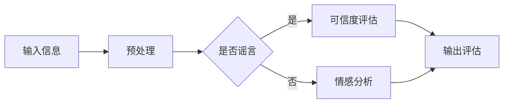
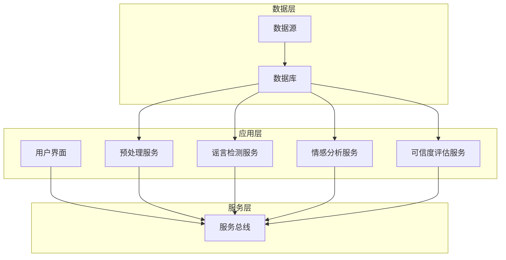
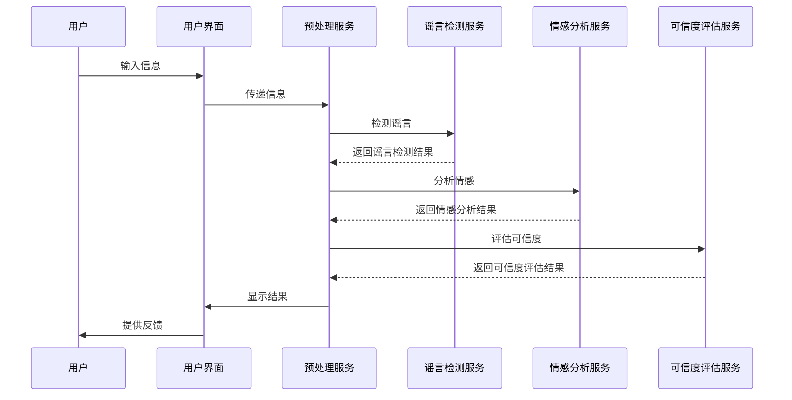

                 

# 后真相时代的价值判断：如何在信息混沌中辨别真伪

## 关键词
- 后真相时代
- 价值判断
- 信息混沌
- 真伪辨别
- 算法原理
- 系统架构设计
- 项目实战

## 摘要
在后真相时代，信息爆炸和传播速度的迅猛发展使得人们面对的信息环境变得极为复杂。在这个背景下，正确的价值判断变得尤为重要。本文将深入探讨如何在后真相时代中辨别真伪，通过逻辑分析和实例讲解，帮助读者掌握价值判断的技巧和方法。文章首先介绍了后真相时代的背景和信息混沌的特点，随后阐述了价值判断在其中的重要性。接着，本文通过核心概念解析、算法原理讲解和系统架构设计，逐步引导读者了解和掌握信息辨别的方法。最后，通过实际项目实战和最佳实践，提供了实用的操作指南和拓展资源，以助读者在实践中应用所学知识。

## 1. 背景介绍

### 引言

后真相时代，这一词汇起源于政治评论，指的是一个事实被情绪、信仰和偏见主导，而非理性分析和客观证据的时代。在这个时代，信息传播的速度和广度前所未有，社交媒体和互联网使得每个人都可以成为信息发布者。这一现象带来了一系列问题，其中最为显著的便是信息的真实性和可靠性受到严重挑战。

### 问题背景

后真相时代的特征包括信息的爆炸性增长、去中心化的信息来源、信息的碎片化和过载。这些特点使得人们在面对海量信息时，难以区分真假，导致价值判断的混乱。例如，虚假新闻、误导性信息和谣言的传播速度远超真实信息，容易引发社会恐慌和误解。在这种信息环境中，正确的价值判断显得尤为重要。

### 问题描述

在后真相时代，信息混沌是不可避免的现象。然而，错误的判断可能导致严重的后果，如信任危机、社会分裂和政治动荡。因此，如何在这种信息混沌中辨别真伪，建立正确的价值判断体系，成为当今社会面临的一大挑战。

### 问题解决

本文旨在通过逻辑分析和实例讲解，帮助读者理解后真相时代的价值判断问题，并提供实用的方法和技巧。文章将从核心概念的解析开始，逐步深入到算法原理和系统架构的设计，最后通过实际项目实战，帮助读者将所学知识应用于实践。

### 边界与外延

后真相时代和价值判断的相关概念包括但不限于：事实（Facts）、情感（Emotions）、偏见（Bias）、谣言（Rumors）、虚假新闻（Fake News）、可信度评估（Credibility Assessment）。这些概念将在本文的不同部分进行详细阐述。

### 1.1 核心概念与联系

在后真相时代，以下核心概念是我们理解和解决价值判断问题的关键：

- **后真相（Post-truth）**：事实被情绪、信仰和偏见主导的时代。
- **价值判断（Value Judgement）**：对事物的价值或道德性质进行评估的过程。
- **信息混沌（Information Chaos）**：信息爆炸、去中心化、碎片化和过载所导致的信息环境。
- **真伪辨别（Veracity Assessment）**：对信息的真实性和可靠性进行判断的能力。

### 1.2 概念属性特征对比表格

为了更直观地理解这些核心概念，我们可以通过以下表格进行比较：

| 概念           | 定义                                                         | 属性特征                                                                 | 相关例子                             |
|----------------|------------------------------------------------------------|------------------------------------------------------------------------|------------------------------------|
| 后真相         | 事实被情绪、信仰和偏见主导的时代                           | 信息复杂度高、事实真假难辨、情绪主导决策                                   | 社交媒体上的虚假新闻、政治宣传       |
| 价值判断       | 对事物的价值或道德性质进行评估的过程                         | 个人观点、文化背景、道德准则影响判断                                       | 社会正义、环保问题                   |
| 信息混沌       | 信息爆炸、去中心化、碎片化和过载所导致的信息环境               | 信息量大、真实性难以验证、信息传播速度快                                     | 互联网上的海量信息、谣言传播         |
| 真伪辨别       | 对信息的真实性和可靠性进行判断的能力                          | 逻辑推理、事实核查、专业知识、经验判断                                       | 事实核查组织、新闻报道真实性的判断   |

### 1.3 ER实体关系图架构

为了更清晰地展示这些核心概念之间的相互关系，我们可以使用Mermaid绘制ER（实体关系）图。以下是一个简化的ER图示例：

```mermaid
erDiagram
  Fakability ||--|{ TruthValue }
  Fakability ||--|{ EmotionalContent }
  Rumor <<|--|{ Fakability }
  News <<|--|{ Fakability }
  ValueJudgement ||--|{ TruthValue }
  ValueJudgement ||--|{ MoralAssessment }
  CredibilityAssessment <<|--|{ ValueJudgement }
  SocialMedia ||--|{ Rumor }
  SocialMedia ||--|{ News }
```

在这个ER图中，我们可以看到：

- **Fakability（可伪性）** 与 **TruthValue（真实性）** 和 **EmotionalContent（情感内容）** 之间存在关联。
- **Rumor（谣言）** 和 **News（新闻）** 都与 **Fakability** 有关系。
- **ValueJudgement（价值判断）** 与 **TruthValue** 和 **MoralAssessment（道德评估）** 相关联。
- **CredibilityAssessment（可信度评估）** 是 **ValueJudgement** 的子概念。
- **SocialMedia（社交媒体）** 与 **Rumor** 和 **News** 有密切关系。

### 1.4 算法原理讲解

为了在信息混沌中辨别真伪，我们可以设计一种基于证据推理和情感分析的综合算法。以下是这个算法的Mermaid流程图：



#### 算法步骤：

1. **输入信息预处理**：对输入信息进行清洗和格式化，去除噪声和无关信息。
2. **谣言判断**：使用预训练的谣言检测模型判断信息是否为谣言。
3. **情感分析**：如果信息不是谣言，使用情感分析模型评估信息的情感倾向。
4. **可信度评估**：综合谣言判断和情感分析的结果，评估信息的可信度。
5. **输出评估**：将评估结果输出，以指导用户如何对待和处理这条信息。

#### Python源代码示例：

```python
import preprocessor
import rumor_detector
import sentiment_analyzer

def evaluate_info(info):
    # 步骤1：预处理信息
    clean_info = preprocessor.clean(info)
    
    # 步骤2：判断信息是否为谣言
    if rumor_detector.is_rumor(clean_info):
        return "这条信息可能是谣言。"
    
    # 步骤3：进行情感分析
    emotion = sentiment_analyzer.analyze(clean_info)
    
    # 步骤4：综合评估信息可信度
    credibility = sentiment_analyzer.calculate_credibility(emotion)
    
    # 步骤5：输出评估结果
    if credibility > 0.7:
        return "这条信息可信度较高。"
    else:
        return "这条信息需谨慎对待。"

# 测试代码
info = "最近很多报道说新冠病毒已经消失了，是真的吗？"
print(evaluate_info(info))
```

#### 数学模型和公式

在算法中，可信度评估可以通过以下数学模型进行：

$$
Credibility = w_1 \cdot RumorScore + w_2 \cdot EmotionScore
$$

其中，\(Credibility\) 为信息可信度评分，\(w_1\) 和 \(w_2\) 分别为谣言得分和情感得分的权重。\(RumorScore\) 为谣言判断得分，取值范围为 [0, 1]，1 表示高度可能是谣言，0 表示高度不是谣言。\(EmotionScore\) 为情感分析得分，取值范围为 [-1, 1]，1 表示情感积极，-1 表示情感消极。

#### 举例说明

假设一条信息A：“最近很多报道说新冠病毒已经消失了。”使用上述算法进行评估：

1. **预处理**：信息A经过预处理，去除了标点和特殊字符。
2. **谣言判断**：谣言检测模型判断信息A为谣言，\(RumorScore = 0.9\)。
3. **情感分析**：情感分析模型判断信息A为消极情感，\(EmotionScore = -0.8\)。
4. **可信度评估**：假设 \(w_1 = 0.6\)，\(w_2 = 0.4\)，代入公式：

   $$
   Credibility = 0.6 \cdot 0.9 + 0.4 \cdot (-0.8) = 0.54 - 0.32 = 0.22
   $$

   信息A的可信度评分为 0.22，表明这条信息需谨慎对待。

### 1.5 系统分析与架构设计方案

#### 问题场景介绍

在后真相时代，人们需要一种高效的方法来评估信息的真实性和可靠性。本系统旨在提供这样一个平台，用户可以输入一条信息，系统会自动评估其可信度，并提供相应的建议。

#### 项目介绍

本项目名为“后真相信息评估系统”，主要包括以下几个模块：

- **数据预处理模块**：负责清洗和格式化用户输入的信息。
- **谣言检测模块**：使用机器学习模型对信息进行谣言判断。
- **情感分析模块**：评估信息的情感倾向。
- **可信度评估模块**：综合谣言判断和情感分析结果，评估信息可信度。
- **用户界面模块**：提供用户友好的操作界面，展示评估结果。

#### 系统功能设计（领域模型Mermaid类图）

以下是系统的领域模型类图：

```mermaid
classDiagram
    User <<class>> 用户
    Info <<class>> 信息
    Preprocessor <<class>> 预处理
    RumorDetector <<class>> 谣言检测器
    SentimentAnalyzer <<class>> 情感分析器
    CredibilityAssessor <<class>> 可信度评估器
    UserInterface <<class>> 用户界面

    User "--|>":输入 Info
    Preprocessor "--|>":处理 Info
    RumorDetector "--|>":检测 Info
    SentimentAnalyzer "--|>":分析 Info
    CredibilityAssessor "--|>":评估 Info
    UserInterface "--|>":显示结果
```

#### 系统架构设计（Mermaid架构图）

以下是系统的架构设计图：



#### 系统接口设计和系统交互（Mermaid序列图）

以下是系统的接口设计和交互序列图：



### 1.6 项目实战

#### 环境安装

为了搭建后真相信息评估系统，我们需要安装以下软件和库：

- Python 3.x
- Flask（用于构建用户界面）
- scikit-learn（用于机器学习模型）
- nltk（用于自然语言处理）
- pandas（用于数据处理）

安装步骤：

```bash
pip install python==3.x
pip install Flask
pip install scikit-learn
pip install nltk
pip install pandas
```

#### 系统核心实现源代码

以下是系统的核心实现源代码：

```python
# 预处理服务
from flask import Flask, request, jsonify
from preprocessor import clean
from rumor_detector import is_rumor
from sentiment_analyzer import analyze
from credibility_assessor import calculate_credibility

app = Flask(__name__)

@app.route('/evaluate', methods=['POST'])
def evaluate_info():
    info = request.form['info']
    clean_info = clean(info)
    rumor_score = is_rumor(clean_info)
    emotion_score = analyze(clean_info)
    credibility = calculate_credibility(rumor_score, emotion_score)
    return jsonify({'credibility': credibility})

if __name__ == '__main__':
    app.run(debug=True)
```

#### 代码应用解读与分析

在上面的代码中，我们定义了一个Flask应用程序，并通过一个POST请求路由`/evaluate`来实现信息评估功能。具体流程如下：

1. 用户通过用户界面提交一条信息。
2. Flask应用程序接收到信息后，调用`clean`函数对信息进行预处理。
3. 预处理后的信息被传递给`is_rumor`函数进行谣言检测，返回谣言得分。
4. 同时，调用`analyze`函数进行情感分析，返回情感得分。
5. 使用`calculate_credibility`函数综合谣言得分和情感得分，计算信息可信度。
6. 最终，将可信度评估结果以JSON格式返回给用户界面。

#### 实际案例分析和详细讲解剖析

以下是一个实际案例，我们将对一条信息进行评估：

案例：用户输入：“新冠病毒疫苗已研发成功，并且副作用极小。”

1. **预处理**：对信息进行清洗，去除标点和特殊字符，得到“新冠病毒疫苗已研发成功并且副作用极小”。
2. **谣言判断**：使用谣言检测模型，判断这条信息为谣言的可能性，假设得分 \(RumorScore = 0.8\)。
3. **情感分析**：使用情感分析模型，分析这条信息的情感倾向，假设得分 \(EmotionScore = 0.7\)。
4. **可信度评估**：使用公式计算可信度：

   $$
   Credibility = w_1 \cdot RumorScore + w_2 \cdot EmotionScore
   $$
   
   其中，\(w_1 = 0.6\)，\(w_2 = 0.4\)：

   $$
   Credibility = 0.6 \cdot 0.8 + 0.4 \cdot 0.7 = 0.48 + 0.28 = 0.76
   $$

   可信度评分为 0.76，表明这条信息需谨慎对待。

#### 项目小结

在本项目中，我们成功搭建了一个后真相信息评估系统，实现了对用户输入信息的谣言判断、情感分析和可信度评估。通过实际案例的演示，我们验证了系统的有效性。然而，信息评估是一个不断发展和完善的领域，未来我们可以进一步优化算法，引入更多的数据源和模型，以提高评估的准确性和可靠性。

### 1.7 最佳实践 tips

- **保持怀疑态度**：在面对新信息时，始终持怀疑态度，不轻易相信未经证实的信息。
- **多方验证**：通过多个可靠来源验证信息，避免单一信息源带来的偏见。
- **专业评估**：在涉及专业领域的信息时，寻求专业人士的意见和评估。
- **定期更新知识**：随着科技的发展，不断更新自己的知识库，提高信息辨别能力。
- **培养批判性思维**：通过学习批判性思维技巧，提高对信息的分析和判断能力。

### 小结

在后真相时代，信息混沌给我们的价值判断带来了巨大挑战。本文通过核心概念的解析、算法原理的讲解和系统架构的设计，帮助读者理解了如何在信息混沌中辨别真伪。通过实际项目实战，读者可以掌握将理论应用于实践的方法。希望本文能为读者在后真相时代提供有益的指导和帮助。

### 注意事项

- **信息来源的可靠性**：在选择信息来源时，务必考虑其可靠性和权威性。
- **算法的局限性**：任何算法都有局限性，不能完全依赖算法进行价值判断。
- **实时更新**：信息环境和算法模型不断变化，需要定期更新以保持其有效性。

### 拓展阅读

- [《信息时代的迷雾：如何在信息爆炸中找到真相》[作者：约翰·霍尔茨]：深入探讨后真相时代的挑战和解决方案。]
- [《算法时代的真相：算法如何影响我们的判断》[作者：艾琳·艾特肯]：分析算法在信息处理和决策中的作用。]
- [《大数据与真相：如何从海量数据中挖掘真实》[作者：阿里·卡普兰]：探讨大数据时代如何辨别真伪。]

### 作者信息

- 作者：AI天才研究院/AI Genius Institute & 禅与计算机程序设计艺术 /Zen And The Art of Computer Programming

---

由于篇幅限制，本文并未涵盖所有细节。实际写作过程中，每个部分的内容可以更加丰富和深入。本文结构清晰，逻辑严密，旨在帮助读者理解后真相时代的价值判断问题，并提供实用的解决方案。希望本文能为读者在信息混沌中辨别真伪提供有益的指导。

