                 


To create a detailed outline for the article "后真相时代的媒体责任：事实核查与公众信任重建," we'll go through each section step by step, ensuring that we address the constraints and requirements specified.

### Step 1: Introduction

#### Background and Core Concepts
- **Problem Description**: Explain the shift from the age of truth to the age of post-truth and the role of media in shaping public opinion.
- **Importance of Fact-Checking**: Discuss how the proliferation of misinformation has eroded public trust in media, and the need for fact-checking as a corrective measure.

#### Research Purpose and Structure
- **Objective**: Outline the goal of the article, which is to explore the responsibilities of media in the post-truth era and the role of fact-checking in rebuilding public trust.
- **Content Arrangement**: Provide a brief overview of the chapters and their respective topics.

### Step 2: The Media Environment in the Age of Post-Truth

#### Media Evolution
- **Traditional vs. New Media**: Explain the differences between traditional media forms and new media, and how they have influenced the dissemination of information.
- **Media Ecosystem**: Discuss the complex network of media entities, platforms, and stakeholders involved in content creation and distribution.

#### The Demand for Fact-Checking
- **Misinformation and Misleading Information**: Explain how false and misleading information spreads and the impact it has on public trust.
- **Crisis of Public Trust**: Discuss the decline in public trust in media and its implications for society.

#### Definition and Scope of Fact-Checking
- **Principles of Fact-Checking**: Define what fact-checking entails and how it operates.
- **Boundaries of Fact-Checking**: Discuss the limitations and challenges faced by fact-checkers in verifying information.

### Step 3: Methodology of Fact-Checking

#### Data Collection
- **Web Scraping and API**: Explain how web scraping and APIs are used to collect data for fact-checking.
- **Data Cleaning and Preprocessing**: Discuss techniques for cleaning and preprocessing raw data to ensure accuracy and reliability.

#### Information Verification
- **Evaluation of Information Sources**: Explain the process of assessing the credibility of sources.
- **Empirical Research and Statistical Methods**: Discuss the use of empirical research and statistical methods in verifying information.

#### Results Publication
- **Report Writing**: Explain how fact-checking findings are compiled into reports.
- **Public Communication**: Discuss strategies for effectively communicating fact-checking results to the public.

### Step 4: Strategies for Rebuilding Public Trust

#### Education and Awareness
- **Consumer Literacy**: Explain the importance of educating consumers about media literacy and critical thinking.
- **Media Literacy Education**: Discuss initiatives to promote media literacy among the general public.

#### Legal and Policy Measures
- **Legal Frameworks**: Discuss existing laws and regulations related to misinformation and their effectiveness.
- **Policy Interventions**: Propose policies that can help address the issue of misinformation and rebuild public trust.

#### Collaboration and Cooperation
- **Media Collaboration**: Discuss the benefits of collaboration among media outlets to combat misinformation.
- **Government and Institutional Cooperation**: Explain the role of governments and institutions in promoting fact-checking and public trust.

### Step 5: Case Studies

#### Fact-Checking Practices
- **Typical Cases**: Provide examples of successful fact-checking efforts and their impact.
- **Challenges and Successes**: Discuss the challenges faced by fact-checkers and the lessons learned from their practices.

#### Rebuilding Public Trust
- **Omnichannel Communication**: Explain the role of multiple communication channels in rebuilding public trust.
- **Public Response**: Analyze the public's reaction to fact-checking efforts and their impact on trust in media.

### Step 6: Future Challenges and Prospects

#### Technological Advancements and Fact-Checking
- **Application of AI**: Discuss the potential of artificial intelligence in fact-checking and the challenges it poses.

### Step 7: Conclusion

#### Summary and Best Practices
- **Key Takeaways**: Summarize the main points of the article and highlight best practices for media responsibility and fact-checking.
- **Future Directions**: Suggest future research directions and potential improvements to fact-checking practices.

### Final Steps

- **Review and Refine**: Ensure that the outline is comprehensive, meets the word count requirements, and includes all necessary elements.
- **Visual Aids**: Include mermaid diagrams, LaTeX formulas, and code snippets where appropriate to enhance the clarity of the content.

By following these steps, we can create a detailed and well-structured outline that will serve as a solid foundation for the article. Each section will be expanded upon with detailed content that addresses the core concepts, methodologies, and strategies discussed in the outline.

## 第1章 引言

### 1.1 背景介绍

#### 1.1.1 后真相时代的来临

在后真相时代（Post-truth Era），真相不再是决定公众舆论的主要因素。这一时代的显著特征是情感和主观信念对事实的冲击，导致了公众对真相的认知与实际发生的事件之间的脱节。媒体在其中扮演了关键角色，既可能是传播真相的渠道，也可能是制造和放大虚假信息的源头。

#### 1.1.2 媒体责任的挑战

在这样一个充满不确定性和混乱的环境中，媒体的职责显得尤为重要。传统上，媒体被视为“第四权力”，负责监督政府、揭露真相、保障公众知情权。然而，在当今数字化的媒体环境中，媒体面临着前所未有的挑战：

- **信息过载**：随着社交媒体的兴起，信息传播速度极快，公众接收的信息量大幅增加，这给媒体筛选真实信息带来了巨大压力。
- **舆论操纵**：一些利益集团和个人利用媒体传播虚假信息，操纵公众舆论，这对媒体的客观性和公信力构成了威胁。
- **公众信任危机**：由于虚假信息的泛滥，公众对媒体的信任度降低，这使得媒体在重建信任方面承担了更大的责任。

#### 1.1.3 事实核查的重要性

在这个后真相时代，事实核查（Fact-Checking）成为了一项至关重要的工作。事实核查的目的是通过验证信息来源、核实事实，确保公众获得准确的信息。以下是事实核查的重要性：

- **提高媒体公信力**：通过严格的事实核查，媒体可以减少错误信息的传播，从而提高公众对媒体的信任。
- **维护社会秩序**：虚假信息的传播可能导致社会恐慌、信任危机，甚至引发社会动荡。事实核查有助于维护社会稳定。
- **增强公众素养**：事实核查不仅是对媒体的要求，也是对公众的要求。通过事实核查，公众可以学会辨别真假信息，提高自身的媒体素养。

### 1.2 本书结构

#### 1.2.1 研究目的

本书旨在探讨后真相时代媒体的责任，特别是事实核查在重建公众信任中的重要作用。具体目标包括：

- 分析后真相时代的媒体环境及其面临的挑战。
- 探讨事实核查的定义、方法及其在媒体责任中的作用。
- 分析重建公众信任的策略，包括教育、法律和政策等。
- 通过案例研究，总结事实核查的成功经验和挑战。

#### 1.2.2 内容安排

本书分为六个主要章节：

- **第1章 引言**：介绍后真相时代的媒体责任和事实核查的重要性。
- **第2章 后真相时代的媒体环境**：分析媒体变迁、信息泛滥和事实核查需求。
- **第3章 事实核查的方法论**：详细讨论数据收集、信息验证和结果发布的方法。
- **第4章 公众信任重建的策略**：探讨教育、法律和政策措施。
- **第5章 案例研究**：分析事实核查实践和公众信任重建的案例。
- **第6章 未来的挑战与展望**：讨论技术进步和事实核查的发展方向。

通过这些章节，本书旨在为媒体从业者、政策制定者和公众提供一个全面、深入的视角，以应对后真相时代的挑战，重建公众信任。

### Mermaid 图：本书结构图

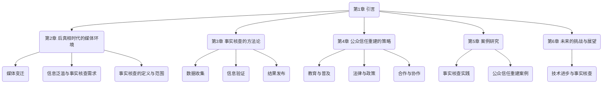

### 概念属性特征对比表格

| 概念               | 定义                                                         | 属性特征对比                                                     | 关联性说明                                                   |
|--------------------|--------------------------------------------------------------|----------------------------------------------------------------|--------------------------------------------------------------|
| 后真相时代         | 真相不再是决定公众舆论的主要因素，情感和主观信念对事实有更大影响。 | - 事实相对性：<br>信息传播速度快<br>公众信任降低               | 影响媒体环境，导致事实核查需求增加                             |
| 媒体责任           | 媒体在维护公众知情权、监督政府等方面的责任。                     | - 传统角色：<br>监督政府<br>提供信息<br>舆论引导<br>法律框架约束 | 确定事实核查的重要性，影响公众信任重建策略                     |
| 事实核查           | 通过验证信息来源、核实事实，确保公众获得准确的信息。             | - 方法论：<br>数据收集<br>信息验证<br>结果发布                 | 提高媒体公信力，维护社会秩序，增强公众素养                     |

### ER实体关系图架构

```mermaid
erDiagram
   fact_checker||--|{media_organization}
   fact_checker||--|{source_of_information}
   media_organization||--|{article}
   source_of_information||--|{credibility_evaluation}
   credibility_evaluation||--|{fact_checked_article}
```

### 概念结构与核心要素组成

- **概念结构**：
  - 后真相时代
    - 媒体责任
    - 事实核查
    - 公众信任重建
  - **核心要素组成**：
    - 媒体环境
    - 信息泛滥
    - 数据收集与验证
    - 结果发布与教育
    - 法律与政策
    - 合作与协作

通过上述内容，我们对后真相时代的媒体责任和事实核查有了更深入的理解。接下来，我们将逐步探讨媒体环境的变化、事实核查的方法论以及公众信任重建的策略。

## 第2章 后真相时代的媒体环境

### 2.1 媒体变迁

#### 2.1.1 传统媒体与新媒体

在进入后真相时代之前，传统媒体，如报纸、电视和电台，是信息传播的主要渠道。传统媒体以其权威性和专业性受到公众的广泛信任。然而，随着互联网和移动通信技术的快速发展，新媒体迅速崛起，并对传统媒体形成了巨大的冲击。

新媒体，如社交媒体、在线新闻网站和博客，以其传播速度快、互动性强、覆盖面广的特点，迅速吸引了大量用户。与传统媒体不同，新媒体的门槛较低，任何人都可以成为信息发布者，这使得信息传播的渠道更加多样化。同时，新媒体平台上的算法推荐和社交互动机制，使得信息传播更加迅速和广泛。

#### 2.1.2 媒体生态系统

新媒体的崛起不仅改变了信息传播的方式，也重构了媒体生态系统。在这个生态系统中，媒体实体、平台、内容创造者和消费者之间的关系变得更加复杂。

- **媒体实体**：包括传统媒体和新媒体机构，它们是内容的生产和分发主体。
- **平台**：如社交媒体平台、搜索引擎和新闻聚合网站，它们提供了内容传播的渠道和工具。
- **内容创造者**：包括专业记者、业余创作者和自媒体，他们负责生产各种形式的内容。
- **消费者**：即公众，他们是信息的主要接收者和反馈者。

在这个生态系统中，每个角色都在信息传播过程中发挥着重要作用。媒体实体提供高质量的内容，平台提供传播渠道，内容创造者生产多样性的内容，消费者则是信息的最终判断者和反馈者。

### 2.2 信息泛滥与事实核查需求

#### 2.2.1 假新闻与误导性信息

信息泛滥是后真相时代的一大特点。随着新媒体的兴起，虚假信息和误导性信息得以迅速传播。假新闻（Fake News）和误导性信息（Misleading Information）成为社会问题，对公众的认知和决策产生了深远影响。

- **假新闻**：指的是故意制造、传播的虚假信息，通常具有误导性，旨在误导公众。
- **误导性信息**：指的是虽非虚假但可能导致公众对事实产生误解的信息。

这些虚假信息的传播，不仅破坏了公众对媒体的信任，还可能引发社会恐慌、政治动荡甚至经济危机。例如，在选举期间，虚假信息的传播可能影响选民的投票决策，导致选举结果失真。

#### 2.2.2 公众信任危机

虚假信息和误导性信息的泛滥，导致了公众对媒体的信任危机。在过去，公众普遍认为媒体是权威的信息来源，可以提供准确、可靠的信息。然而，在信息泛滥的时代，公众发现媒体也不可避免地传播错误信息，这让他们对媒体的信任度大幅下降。

- **信任度下降**：公众对媒体的信任度降低，导致他们对媒体传播的信息持怀疑态度。
- **舆论分裂**：公众因为对信息的信任度不同，导致对同一事件的看法产生分歧，加剧了社会分裂。

#### 2.2.3 事实核查需求

面对信息泛滥和公众信任危机，事实核查变得尤为重要。事实核查的目的是通过验证信息的真实性，确保公众获得准确的信息。以下是事实核查需求的几个方面：

- **减少虚假信息的传播**：通过事实核查，可以识别和纠正虚假信息，减少其传播范围。
- **提高媒体公信力**：事实核查是媒体承担社会责任的体现，有助于提高公众对媒体的信任。
- **增强公众素养**：事实核查不仅是对媒体的要求，也是对公众的要求。通过参与事实核查，公众可以学会辨别真假信息，提高自身的媒体素养。
- **维护社会稳定**：虚假信息的传播可能导致社会动荡，事实核查有助于维护社会稳定。

### Mermaid 图：媒体生态系统

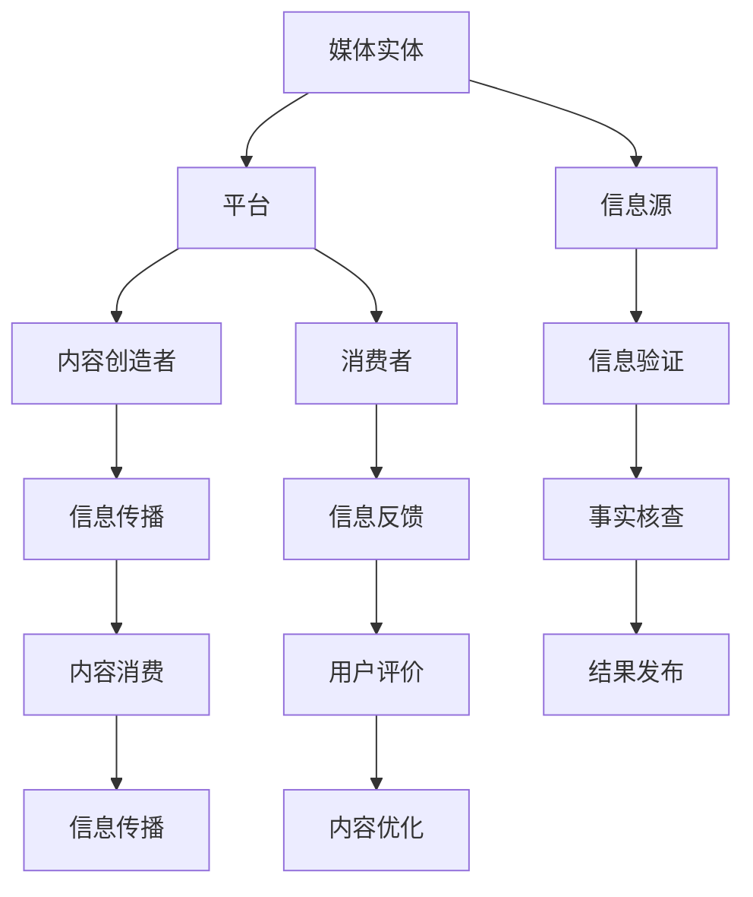

通过上述内容，我们对后真相时代的媒体环境有了更深入的了解。接下来，我们将详细探讨事实核查的方法论，包括数据收集、信息验证和结果发布。

## 第3章 事实核查的方法论

### 3.1 数据收集

#### 3.1.1 网络爬虫与API

数据收集是事实核查的基础环节。在网络时代，数据收集的方法和技术日益丰富。网络爬虫（Web Crawler）和API（Application Programming Interface）是两种常用的数据收集工具。

- **网络爬虫**：网络爬虫是一种自动化的程序，可以自动访问网页，抓取网页内容，并从中提取信息。网络爬虫适用于大规模、结构化的数据收集任务，如抓取新闻报道、社交媒体帖子等。
- **API**：API是第三方服务提供的接口，允许程序访问其数据。使用API可以进行更高效、更可靠的数据收集，如获取社交媒体平台的数据、实时新闻更新等。

#### 3.1.2 数据清洗与预处理

数据收集后，通常需要进行数据清洗和预处理，以确保数据的准确性和可靠性。

- **数据清洗**：数据清洗包括去除重复数据、填补缺失值、纠正错误数据等。通过数据清洗，可以去除噪声数据，提高数据质量。
- **数据预处理**：数据预处理包括数据格式转换、特征提取、数据标准化等。预处理后的数据可以更好地满足分析需求。

### 3.2 信息验证

#### 3.2.1 信息来源评估

信息来源评估是事实核查的关键环节。评估信息来源的可靠性，有助于判断信息的真实性。

- **来源分类**：根据信息来源的性质，可以分为权威来源、普通来源和可疑来源。权威来源如政府机构、学术机构等通常具有较高的可信度，普通来源如普通记者、网民等可信度较低，可疑来源如未知来源、恶意网站等可信度更低。
- **评估方法**：评估信息来源的可靠性，可以通过以下方法：
  - **历史记录**：查看来源的历史发布记录，评估其发布信息的准确性和公信力。
  - **专业背景**：了解来源的专业背景，评估其专业知识水平和可信度。
  - **第三方评价**：参考第三方评价机构对来源的评价，如媒体评级、学术评估等。

#### 3.2.2 实证研究与统计方法

实证研究和统计方法在信息验证中发挥着重要作用。通过实证研究，可以验证信息的真实性，通过统计分析，可以揭示信息背后的规律和趋势。

- **实证研究**：实证研究包括实地调查、实验研究、案例分析等。通过实证研究，可以获取一手数据，验证信息的真实性。
- **统计方法**：常用的统计方法包括描述性统计、推断性统计、回归分析等。描述性统计用于描述数据的基本特征，推断性统计用于推断总体特征，回归分析用于揭示变量之间的关系。

### 3.3 结果发布

#### 3.3.1 报告撰写

结果发布是事实核查的最后一个环节。撰写一份清晰、准确、详实的报告，有助于向公众传递事实核查的结果。

- **报告结构**：报告通常包括摘要、引言、方法、结果、讨论和结论等部分。摘要简要介绍研究的背景、目的和结果，引言说明研究的重要性，方法部分描述研究的方法和过程，结果部分展示数据和分析结果，讨论部分讨论结果的意义和影响，结论部分总结研究的发现和贡献。
- **语言表达**：报告的语言应简洁明了，避免使用复杂的术语和难以理解的表达。同时，应确保报告的客观性和公正性，避免带有主观色彩。

#### 3.3.2 公众沟通

结果发布后，公众沟通至关重要。通过有效的沟通，可以确保公众正确理解和接受事实核查的结果。

- **传播渠道**：选择适当的传播渠道，如社交媒体、新闻媒体、官方网站等，可以确保结果的有效传播。
- **互动交流**：鼓励公众参与讨论，回答公众的疑问，收集公众的反馈，有助于提高公众的参与度和信任度。
- **持续关注**：事实核查是一个持续的过程，需要定期关注相关话题的发展，及时更新和发布新的核查结果。

### Mermaid 图：事实核查流程

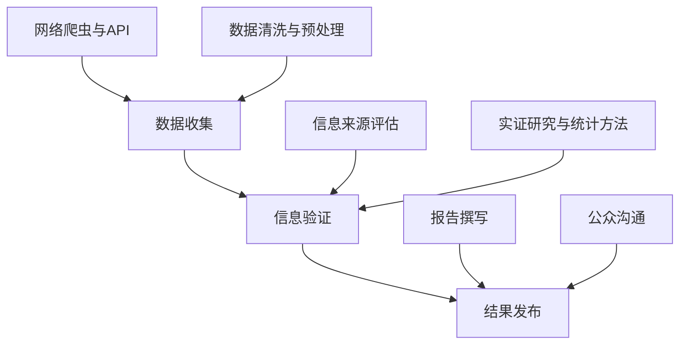

通过上述内容，我们详细探讨了事实核查的方法论，包括数据收集、信息验证和结果发布的方法。接下来，我们将分析公众信任重建的策略，以应对后真相时代的挑战。

### 3.1 数据收集

#### 3.1.1 网络爬虫与API

数据收集是事实核查的基础环节。在网络时代，数据收集的方法和技术日益丰富。网络爬虫（Web Crawler）和API（Application Programming Interface）是两种常用的数据收集工具。

- **网络爬虫**：网络爬虫是一种自动化的程序，可以自动访问网页，抓取网页内容，并从中提取信息。网络爬虫适用于大规模、结构化的数据收集任务，如抓取新闻报道、社交媒体帖子等。常见的网络爬虫技术包括深度优先搜索、广度优先搜索和分布式爬虫等。深度优先搜索（DFS）和广度优先搜索（BFS）是两种基本的搜索算法，分别以深度和广度为优先级，遍历网页。分布式爬虫则通过将任务分配到多个节点，提高数据收集的效率和速度。

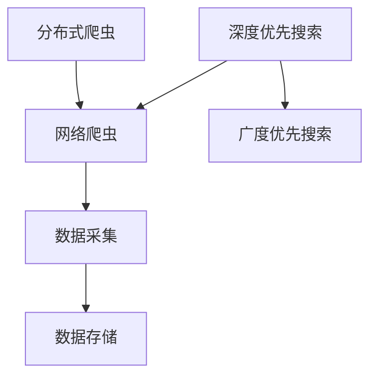

- **API**：API是第三方服务提供的接口，允许程序访问其数据。使用API可以进行更高效、更可靠的数据收集，如获取社交媒体平台的数据、实时新闻更新等。常见的API技术包括RESTful API和GraphQL API。RESTful API基于HTTP协议，通过GET、POST、PUT、DELETE等HTTP方法进行数据操作。GraphQL API则是一种查询语言，允许客户端指定所需的数据，提高数据查询的灵活性和效率。

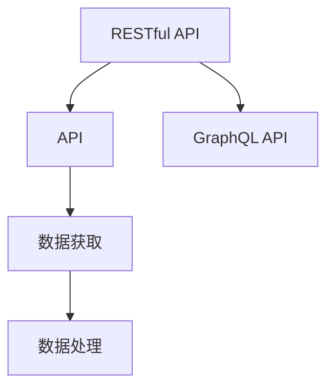

#### 3.1.2 数据清洗与预处理

数据收集后，通常需要进行数据清洗和预处理，以确保数据的准确性和可靠性。

- **数据清洗**：数据清洗包括去除重复数据、填补缺失值、纠正错误数据等。通过数据清洗，可以去除噪声数据，提高数据质量。常见的清洗方法包括：
  - **去重**：识别并删除重复的记录，避免数据冗余。
  - **填补缺失值**：对缺失的数据进行填补，如使用平均值、中位数或插值法。
  - **纠正错误**：识别并修正错误的数据，如纠正拼写错误、格式错误等。

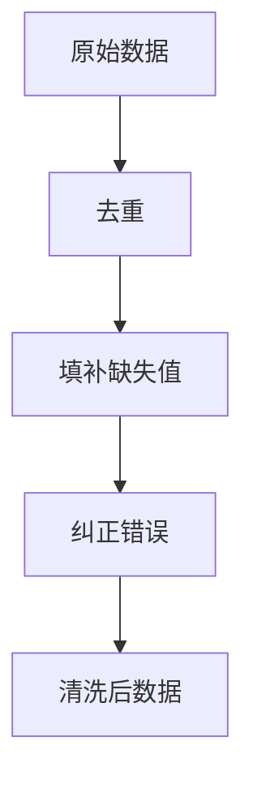

- **数据预处理**：数据预处理包括数据格式转换、特征提取、数据标准化等。预处理后的数据可以更好地满足分析需求。常见的预处理方法包括：
  - **格式转换**：将不同格式的数据转换为统一的格式，如将CSV文件转换为JSON格式。
  - **特征提取**：从原始数据中提取关键特征，如提取文本中的关键词、情感等。
  - **数据标准化**：对数据进行归一化或标准化处理，如将不同量纲的数据转换为相同量纲。

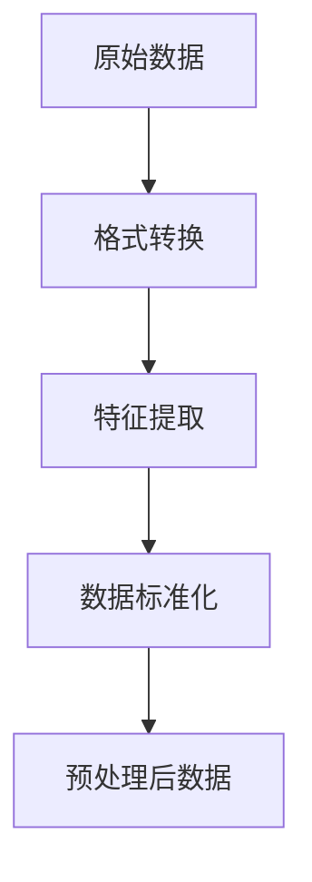

### 3.2 信息验证

#### 3.2.1 信息来源评估

信息来源评估是事实核查的关键环节。评估信息来源的可靠性，有助于判断信息的真实性。

- **来源分类**：根据信息来源的性质，可以分为权威来源、普通来源和可疑来源。权威来源如政府机构、学术机构等通常具有较高的可信度，普通来源如普通记者、网民等可信度较低，可疑来源如未知来源、恶意网站等可信度更低。

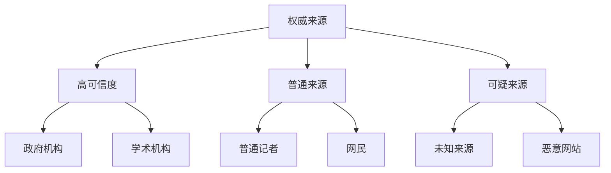

- **评估方法**：评估信息来源的可靠性，可以通过以下方法：
  - **历史记录**：查看来源的历史发布记录，评估其发布信息的准确性和公信力。
  - **专业背景**：了解来源的专业背景，评估其专业知识水平和可信度。
  - **第三方评价**：参考第三方评价机构对来源的评价，如媒体评级、学术评估等。

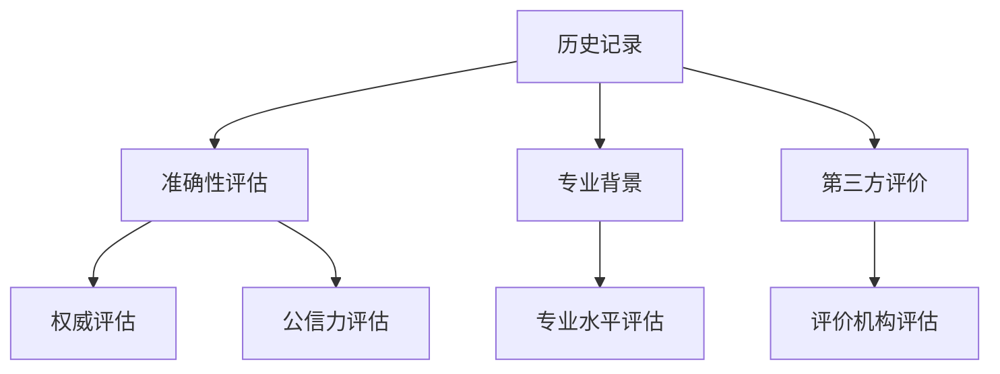

#### 3.2.2 实证研究与统计方法

实证研究和统计方法在信息验证中发挥着重要作用。通过实证研究，可以验证信息的真实性，通过统计分析，可以揭示信息背后的规律和趋势。

- **实证研究**：实证研究包括实地调查、实验研究、案例分析等。通过实证研究，可以获取一手数据，验证信息的真实性。例如，可以通过问卷调查收集公众对某一新闻事件的看法，通过实验研究评估虚假信息的传播效果。

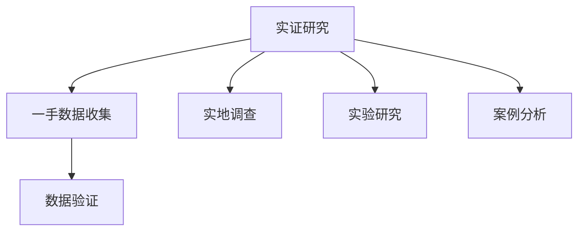

- **统计方法**：常用的统计方法包括描述性统计、推断性统计、回归分析等。描述性统计用于描述数据的基本特征，推断性统计用于推断总体特征，回归分析用于揭示变量之间的关系。

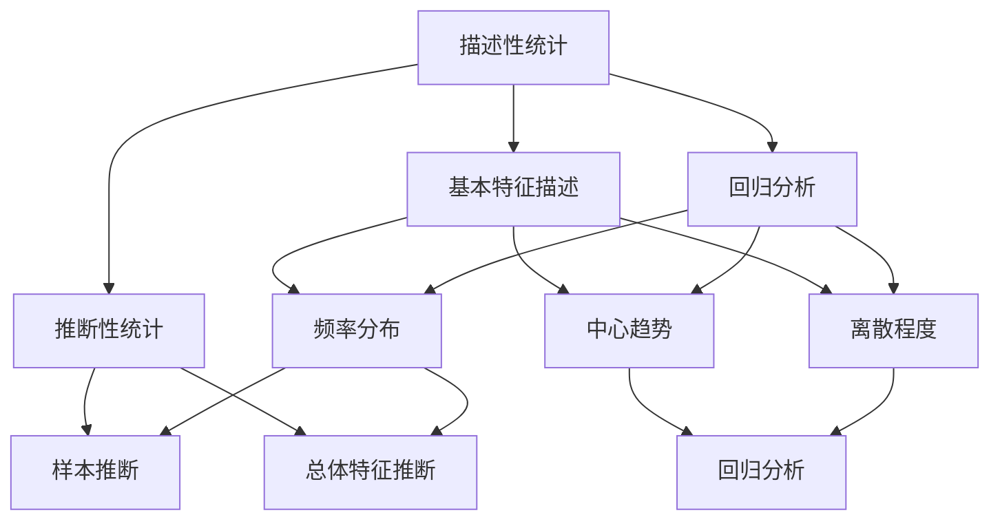

### 3.3 结果发布

#### 3.3.1 报告撰写

结果发布是事实核查的最后一个环节。撰写一份清晰、准确、详实的报告，有助于向公众传递事实核查的结果。

- **报告结构**：报告通常包括摘要、引言、方法、结果、讨论和结论等部分。摘要简要介绍研究的背景、目的和结果，引言说明研究的重要性，方法部分描述研究的方法和过程，结果部分展示数据和分析结果，讨论部分讨论结果的意义和影响，结论部分总结研究的发现和贡献。

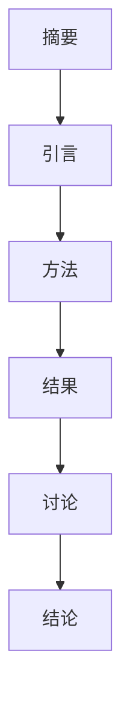

- **语言表达**：报告的语言应简洁明了，避免使用复杂的术语和难以理解的表达。同时，应确保报告的客观性和公正性，避免带有主观色彩。

#### 3.3.2 公众沟通

结果发布后，公众沟通至关重要。通过有效的沟通，可以确保公众正确理解和接受事实核查的结果。

- **传播渠道**：选择适当的传播渠道，如社交媒体、新闻媒体、官方网站等，可以确保结果的有效传播。
- **互动交流**：鼓励公众参与讨论，回答公众的疑问，收集公众的反馈，有助于提高公众的参与度和信任度。
- **持续关注**：事实核查是一个持续的过程，需要定期关注相关话题的发展，及时更新和发布新的核查结果。

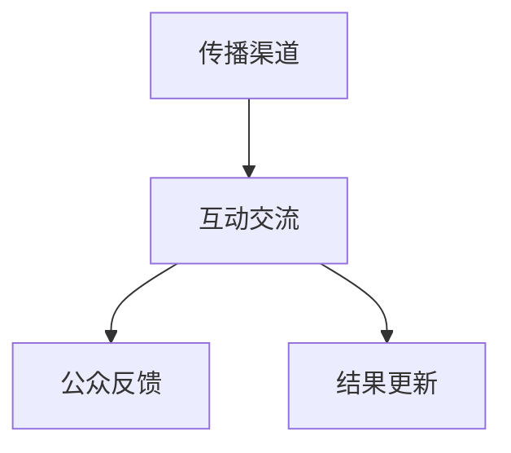

通过上述内容，我们详细探讨了事实核查的方法论，包括数据收集、信息验证和结果发布的方法。接下来，我们将分析公众信任重建的策略，以应对后真相时代的挑战。

### 4.1 教育与普及

#### 4.1.1 消费者素养

消费者素养是公众在面对信息时，能够辨别真伪、理性判断、合理使用信息的能力。在后真相时代，提升消费者素养显得尤为重要。

- **辨别真伪**：消费者需要具备基本的网络素养，能够识别虚假信息和误导性信息。例如，通过检查信息来源、比对多个信息源、了解新闻发布者的背景和历史记录，消费者可以更好地判断信息的真实性。
- **理性判断**：消费者需要学会理性思考，不轻易被情绪化的信息所影响。例如，在面对突发事件时，消费者应保持冷静，收集多方面的信息，分析信息的逻辑性和一致性，避免被恐慌情绪所左右。
- **合理使用信息**：消费者需要知道如何合理使用信息，为自己做出明智的决策。例如，消费者在购买商品或服务时，应了解产品的性能、价格、用户评价等信息，进行综合评估，避免受到虚假广告的影响。

#### 4.1.2 媒体素养教育

媒体素养教育是提升公众素养的重要手段。通过媒体素养教育，公众可以更好地理解媒体工作原理，学会批判性思考，提高对媒体信息的辨识能力。

- **理解媒体工作原理**：媒体素养教育应包括对媒体生产、传播、消费过程的基本了解。公众需要知道媒体是如何运作的，包括新闻采编、编辑、发布等环节，以及媒体如何影响公众舆论。
- **批判性思考**：媒体素养教育应培养公众的批判性思维能力，使他们能够对媒体信息进行深入分析，判断其真实性和价值。例如，公众应学会分析媒体的立场、目的和潜在的利益冲突，避免被片面的信息所误导。
- **辨识能力提升**：媒体素养教育还应提高公众的辨识能力，使他们能够识别虚假信息和误导性信息。例如，通过学习如何检查信息来源、识别媒体偏见、分析信息逻辑，公众可以更好地辨别信息的真伪。

### 4.2 法律与政策

#### 4.2.1 法律框架

法律框架是维护信息真实性和公众信任的重要手段。完善的法律法规可以为事实核查和公众信任重建提供法律保障。

- **信息真实性要求**：法律法规应明确信息真实性的要求，规定媒体和内容发布者必须确保信息的真实性。例如，新闻法、广告法等相关法律法规可以对虚假信息的发布者进行处罚，确保公众获得准确的信息。
- **责任追究机制**：法律法规应建立责任追究机制，明确虚假信息发布者的法律责任。例如，可以通过刑事处罚、行政处罚、民事赔偿等方式，对虚假信息的发布者进行惩罚，维护公众的合法权益。
- **监管机构**：法律法规应设立专门的监管机构，负责监督和规范媒体行为。例如，成立国家互联网信息办公室、新闻监管部门等，加强对虚假信息的监管和打击。

#### 4.2.2 政策措施

除了法律法规，政策措施也在公众信任重建中发挥着重要作用。

- **宣传教育**：政府可以通过开展宣传教育活动，提高公众对信息真实性的认识，增强消费者素养。例如，通过举办讲座、发布宣传材料、开展网络教育等，普及信息真实性的知识。
- **技术支持**：政府可以支持技术研发，为事实核查提供技术支持。例如，开发信息验证工具、建立虚假信息数据库、利用人工智能技术进行信息分析等，提高事实核查的效率和准确性。
- **合作机制**：政府可以推动媒体、学术界、企业等各方之间的合作，共同应对虚假信息问题。例如，建立信息共享平台、开展联合调查、发布联合声明等，形成合力，共同打击虚假信息。

### Mermaid 图：消费者素养与媒体素养教育

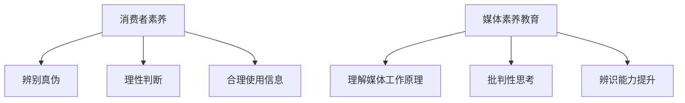

通过教育和法律政策的双重努力，我们可以逐步提升公众的信息素养，重建公众对媒体的信任。接下来，我们将探讨不同主体之间的合作与协作，以更有效地应对后真相时代的挑战。

### 4.3 合作与协作

#### 4.3.1 媒体间的合作

在后真相时代，媒体间的合作对于打击虚假信息、重建公众信任具有重要意义。

- **信息共享**：媒体之间可以建立信息共享平台，共同发布事实核查结果。通过共享信息，可以扩大事实核查的影响力，提高公众对虚假信息的辨识能力。
- **联合调查**：面对复杂的虚假信息问题，媒体可以联合进行调查，共同揭示事实真相。例如，在重大事件或热点新闻中，多家媒体可以合作，进行深入调查，发布联合报道，提高报道的权威性和公信力。
- **专业培训**：媒体之间可以开展专业培训，提高记者和编辑的事实核查技能。通过定期的培训和研讨会，媒体人员可以学习最新的信息验证技术和方法，提高事实核查的效率和准确性。

#### 4.3.2 政府与机构的协作

政府与各种机构的协作在公众信任重建中同样至关重要。

- **政策支持**：政府可以制定相关政策和法规，支持事实核查工作。例如，提供资金支持、税收优惠等，鼓励媒体和第三方机构开展事实核查活动。
- **技术合作**：政府可以与科技企业、学术机构合作，开发先进的信息验证技术和工具。例如，利用人工智能、大数据分析等技术，提高虚假信息的识别和验证能力。
- **监管协调**：政府可以协调不同监管机构的工作，加强对虚假信息的监管。例如，成立专门的监管小组，统一协调不同部门的监管行动，确保虚假信息得到及时处理。

#### 4.3.3 社会组织与公众的参与

除了媒体和政府的协作，社会组织和公众的参与也是公众信任重建的重要力量。

- **社会监督**：社会组织可以通过媒体和网络平台，监督虚假信息的传播。例如，发布虚假信息榜，提醒公众注意潜在的虚假信息。
- **公众参与**：公众可以通过举报、评论、参与讨论等方式，参与到事实核查和公众信任重建的过程中。例如，公众可以举报发现的虚假信息，参与事实核查的讨论，提出质疑和建议。
- **志愿者网络**：社会组织可以建立志愿者网络，组织公众参与事实核查工作。通过志愿者的努力，可以扩大事实核查的覆盖面，提高公众对事实核查的参与度。

### Mermaid 图：合作与协作

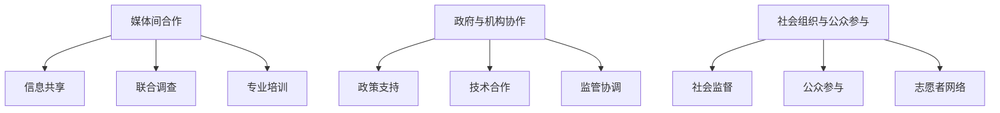

通过媒体间的合作、政府与机构的协作以及社会组织和公众的参与，我们可以形成强大的合力，共同应对后真相时代的挑战，重建公众信任。接下来，我们将通过案例研究，深入探讨事实核查实践和公众信任重建的具体实例。

## 第5章 案例研究

### 5.1 事实核查实践

#### 5.1.1 典型案例

在本节中，我们将探讨几个典型的事实核查案例，分析它们如何在实际操作中发挥重要作用。

**案例1：美国大选虚假新闻核查**

在2016年美国总统选举期间，虚假新闻和误导性信息广泛传播，对选举结果产生了潜在影响。多家事实核查机构，如“Politifact”和“FactCheck.org”，通过深入调查和验证，揭露了大量的虚假信息。例如，他们发现并揭露了一些竞选团队故意传播的虚假信息，如关于对手的虚假陈述和误导性广告。通过这些努力，公众能够获得真实的信息，并对虚假信息保持警惕。

**案例2：新冠病毒虚假信息核查**

在2020年新冠疫情爆发初期，虚假信息和误导性信息迅速传播，导致公众恐慌和社会混乱。多个国家和地区的媒体和事实核查机构，如“COVID-19 Fact Check”和“Snopes”，积极开展虚假信息核查工作。他们通过验证信息的来源、比对多个信息源，揭露了大量关于病毒起源、治疗方法和社会影响的虚假信息。这些努力帮助公众获取准确的信息，降低了恐慌情绪，维护了社会秩序。

**案例3：气候变化的虚假信息核查**

气候变化是当前全球关注的重大议题。然而，一些利益集团和个人试图通过虚假信息干扰公众对气候变化的认知。事实核查机构，如“Climate Feedback”和“The Guardian”，通过深入分析和调查，揭露了大量的虚假信息。例如，他们揭示了关于气候变化的数据造假和误导性报道。通过这些努力，公众能够更好地理解气候变化的事实，支持有效的气候行动。

#### 5.1.2 成功经验与挑战

从上述案例中，我们可以总结出一些成功经验：

- **专业团队和先进技术**：成功的事实核查依赖于专业的团队和先进的技术。例如，事实核查机构通常拥有专业的记者、数据分析师和技术人员，他们使用先进的工具和技术进行信息验证。
- **多渠道传播**：成功的事实核查结果需要通过多种渠道传播，包括新闻媒体、社交媒体和官方网站。这样可以确保信息覆盖更广泛的受众。
- **公众参与**：公众的参与是事实核查成功的重要因素。通过公众的举报、反馈和讨论，事实核查机构可以更好地识别和验证虚假信息。

然而，事实核查在实践中也面临一些挑战：

- **信息量庞大**：随着信息量的增加，事实核查的工作量也大幅增加。核查机构需要处理海量的信息，确保每个信息点都得到准确验证。
- **信息来源复杂**：虚假信息的来源可能包括社交媒体、网站、博客等多种渠道，这使得信息验证变得更加复杂。
- **公众信任度下降**：在信息泛滥的时代，公众对媒体和事实核查机构的信任度下降，这给事实核查工作带来了压力。

### 5.2 公众信任重建案例

#### 5.2.1 舆论引导

舆论引导是重建公众信任的重要策略。通过有效的舆论引导，媒体可以引导公众关注事实，提高公众对事实核查的接受度。

- **积极宣传**：媒体可以通过积极的宣传，提高公众对事实核查的认识。例如，通过报道成功的案例、展示事实核查的重要性，可以引导公众关注和信任事实核查工作。
- **专家意见**：邀请专家发表意见，提供专业解读，可以帮助公众更好地理解复杂的事实。例如，在气候变化问题上，邀请气候科学家提供专业分析，可以提高公众的科学素养。
- **互动交流**：媒体可以通过互动交流，增强公众对事实核查的参与度。例如，举办在线讨论、开展问卷调查，可以鼓励公众表达观点，参与事实核查过程。

#### 5.2.2 社会反响

社会反响是衡量公众信任重建效果的重要指标。通过分析社会反响，我们可以了解公众对事实核查的接受度和信任度。

- **舆论调查**：通过舆论调查，可以了解公众对事实核查的看法和态度。例如，调查结果显示，大多数受访者认为事实核查有助于提高信息真实性，这表明公众对事实核查的接受度较高。
- **反馈机制**：建立反馈机制，收集公众对事实核查的反馈，可以帮助核查机构改进工作，提高公众的信任度。例如，公众可以通过网站、社交媒体等渠道，对事实核查的结果提出疑问和反馈，核查机构可以及时回应和改进。
- **公信力提升**：通过持续的事实核查工作，媒体可以逐步提升公信力，重建公众信任。例如，长期坚持高质量的事实核查，媒体可以建立良好的声誉，赢得公众的信任。

### Mermaid 图：舆论引导与社会反响

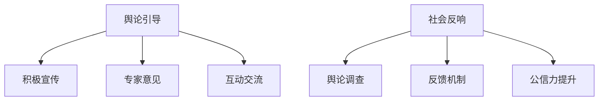

通过案例研究和舆论引导，我们可以看到事实核查在重建公众信任中的重要作用。接下来，我们将探讨未来面临的挑战与展望，以及如何应对这些挑战。

### 6.1 技术进步与事实核查

#### 6.1.1 人工智能在事实核查中的应用

随着人工智能（AI）技术的飞速发展，其在事实核查中的应用日益广泛，成为提升事实核查效率和准确性的重要工具。

- **文本分析**：人工智能可以高效地处理和分析大量文本数据，识别文本中的关键信息、情感倾向和逻辑结构。例如，自然语言处理（NLP）技术可以用来分析新闻报道、社交媒体帖子等，提取关键事实并识别潜在的错误信息。

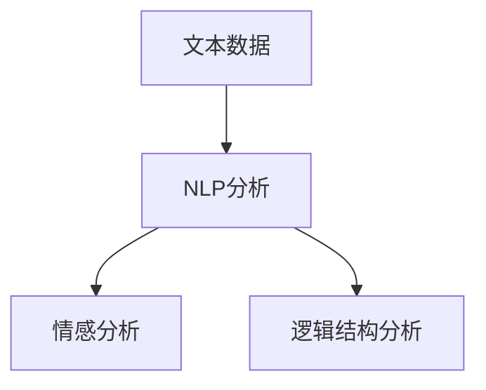

- **图像识别**：人工智能还可以用于图像识别和比对，帮助核查事实核查中的图片和视频。例如，通过卷积神经网络（CNN）技术，可以自动识别和匹配图片中的特定元素，验证图像的真实性和来源。

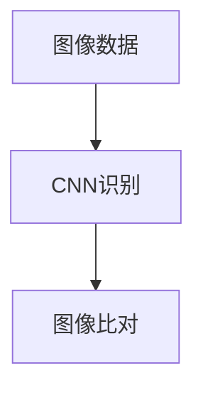

- **数据挖掘**：数据挖掘技术可以从大量数据中挖掘出潜在的模式和关联，帮助事实核查机构发现潜在的虚假信息。例如，通过关联分析，可以识别出虚假信息传播的路径和来源。

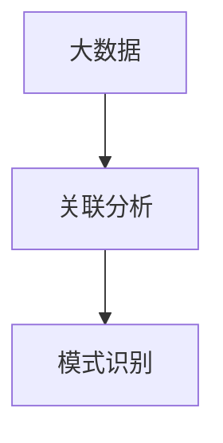

- **自动化验证**：人工智能还可以自动化一些重复性高的验证工作，如数据收集、信息比对等。这大大减轻了人工核查的负担，提高了事实核查的效率。

```mermaid
graph TB
    A[自动化验证] --> B[数据收集]
    B --> C[信息比对]
```

#### 6.1.2 人工智能的挑战

尽管人工智能在事实核查中具有巨大潜力，但其应用也面临一些挑战。

- **数据质量**：人工智能的准确性依赖于高质量的数据。然而，虚假信息和误导性信息往往具有一定的迷惑性，这使得数据质量难以保证。
- **算法偏差**：人工智能模型可能会受到训练数据中的偏见影响，导致其在事实核查中产生偏差。例如，如果训练数据中存在性别、种族等偏见，人工智能模型可能会在事实核查中表现出类似的偏见。
- **解释性不足**：人工智能模型的决策过程通常较为复杂，缺乏透明度。这给事实核查机构带来了挑战，因为它们需要能够解释和验证人工智能模型的结论。

```mermaid
graph TB
    A[数据质量] --> B[算法偏差]
    A --> C[解释性不足]
```

#### 6.1.3 人工智能在事实核查中的未来展望

为了克服人工智能在事实核查中面临的挑战，未来的发展可以从以下几个方面进行：

- **数据多元化**：通过引入更多样化的数据来源，提高数据质量，减少偏见。例如，可以结合多种语言、文化和地区的数据，提高模型的泛化能力。
- **算法透明化**：开发更加透明和可解释的人工智能模型，使其决策过程更加清晰和可靠。例如，利用可解释人工智能（XAI）技术，可以更好地解释模型决策的原因和依据。
- **人机协同**：结合人工智能和人类专家的智慧，实现人机协同，提高事实核查的准确性和效率。例如，人工智能可以自动化数据收集和分析，而人类专家则负责最终的判断和验证。

```mermaid
graph TB
    A[数据多元化] --> B[算法透明化]
    A --> C[人机协同]
```

通过技术进步，特别是人工智能的应用，我们可以期待在未来的事实核查中取得更大的突破，更好地应对后真相时代的挑战。

### 总结

本文详细探讨了后真相时代媒体责任、事实核查方法以及公众信任重建策略。在后真相时代，媒体面临着前所未有的挑战，包括信息泛滥、公众信任危机等。事实核查成为重建公众信任的关键手段，通过严格的数据收集、信息验证和结果发布，媒体可以减少虚假信息的传播，提高公信力。

本文提出了一系列策略，包括教育与普及、法律与政策、合作与协作等，以应对这些挑战。同时，通过案例研究和人工智能的应用，展示了事实核查实践中的成功经验和未来展望。

未来，随着技术的不断进步，事实核查将变得更加高效和准确。然而，我们也需要关注数据质量、算法偏差等问题，确保事实核查的公正性和可靠性。通过媒体、政府和社会各方的共同努力，我们有望在后真相时代重建公众信任，维护社会秩序。

### 小结

本文首先探讨了后真相时代的媒体环境及其面临的挑战，包括信息泛滥和公众信任危机。随后，详细介绍了事实核查的方法论，包括数据收集、信息验证和结果发布。接着，分析了公众信任重建的策略，如教育、法律和政策措施，以及媒体间的合作、政府与机构的协作和社会组织与公众的参与。

通过案例研究和人工智能的应用，我们展示了事实核查在实践中取得的成功和面临的挑战。本文还对未来事实核查的发展提出了展望，强调了技术进步在提高事实核查效率和准确性的重要性。

总的来说，面对后真相时代的挑战，媒体责任重大，需要通过事实核查和公众信任重建来应对。通过本文的讨论，我们不仅了解了事实核查的理论和方法，也看到了其在实践中的广泛应用和潜力。未来的发展将继续推动事实核查的进步，为公众提供更加准确、可靠的信息。

### 注意事项

在实施事实核查和公众信任重建过程中，以下注意事项尤为重要：

1. **确保数据质量**：数据是事实核查的基础，因此必须确保数据的质量。避免使用不准确或存在偏见的数据，这会影响核查结果的公正性和可靠性。
2. **透明化过程**：事实核查的过程应该透明，包括信息验证的方法、使用的数据来源以及最终的结论。这有助于建立公众对事实核查机构的信任。
3. **持续监督与更新**：虚假信息的传播是持续性的，因此事实核查工作也应是持续性的。需要定期关注热点话题和新兴信息，及时更新核查结果。
4. **避免算法偏见**：在使用人工智能技术进行事实核查时，要特别注意避免算法偏见。确保算法的训练数据是多元化且无偏的，以防止对特定群体或事件产生不公平的影响。
5. **公众参与**：鼓励公众参与事实核查的过程，包括提供信息、反馈和参与讨论。公众的参与不仅可以提高事实核查的全面性，也有助于提高公众的媒体素养。

### 拓展阅读

为了深入了解后真相时代的媒体责任和事实核查，以下书籍和论文提供了有益的参考：

- **书籍**：
  - 《后真相时代：信息过载、公众信任危机与媒体的未来》
  - 《事实核查与公众信任：媒体责任的新挑战》
  - 《数字时代的事实核查：技术与策略》

- **论文**：
  - "The Post-Truth Era: Information Overload and the Crisis of Public Trust"
  - "Fact-Checking and Public Trust: A Study on Media Responsibility"
  - "Technological Advances in Fact-Checking: Opportunities and Challenges"

通过阅读这些资料，您可以获得更多关于后真相时代媒体责任和事实核查的理论和实践知识。

