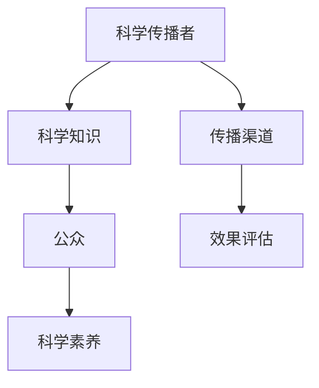
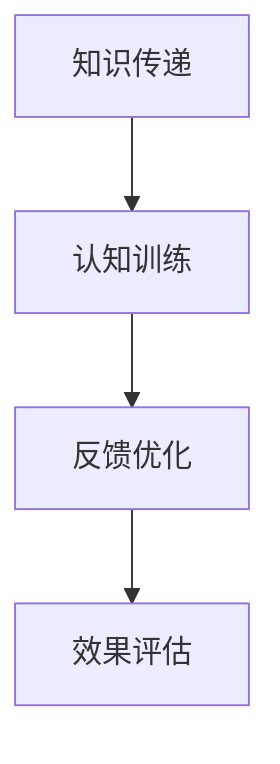
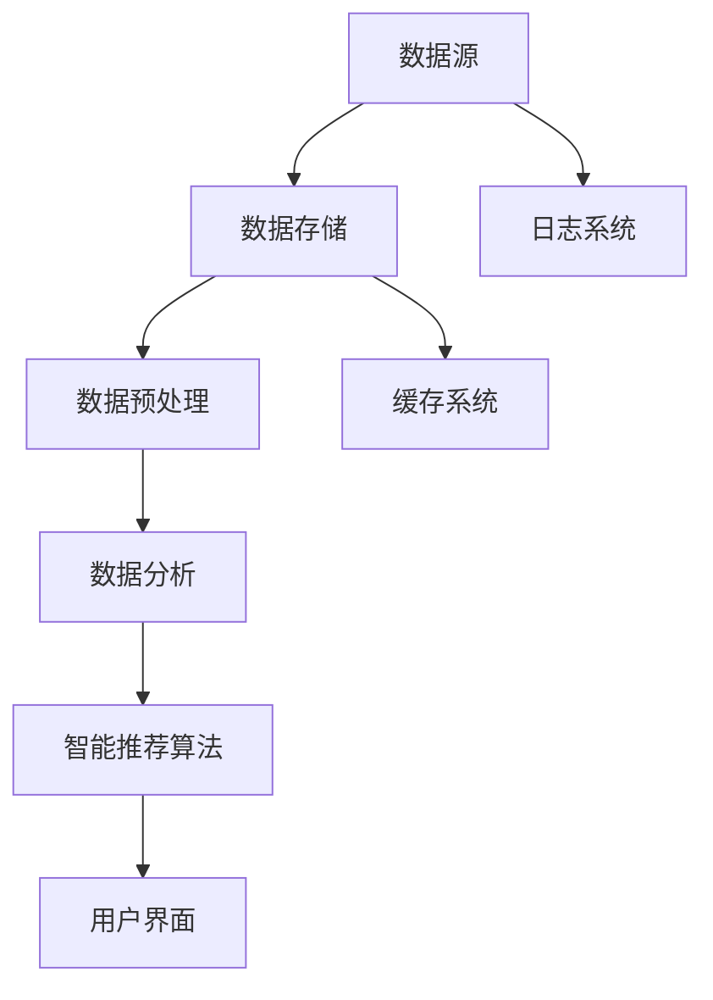
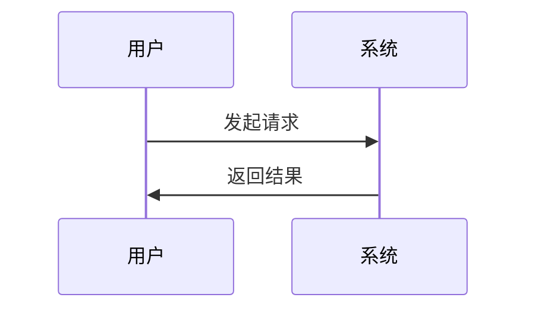

                 

### 后真相时代的科学传播：提升公众科学素养的重要性

> 关键词：后真相时代、科学传播、公众科学素养、算法原理、数学模型

> 摘要：本文深入探讨了后真相时代科学传播的背景、核心概念及其重要性，通过分析科学传播的原理和提升公众科学素养的算法原理，提出了有效的传播策略和数学模型，为提高公众科学素养提供了科学指导。

---

### 第一部分：背景介绍

#### 1.1 问题的提出

在信息爆炸、媒体多元化的后真相时代，公众对于科学事实的辨别能力受到了严峻考验。科学传播不仅仅是信息的传递，更是公众科学素养的提升。本部分将从以下几个方面展开讨论：

- **后真相时代的特征**：探讨信息传播环境的变化，社交媒体的兴起，以及这些因素如何影响公众对科学事实的认知。
- **公众科学素养的重要性**：分析提高公众科学素养对社会发展、科技普及和公民素质的深远影响。
- **科学传播的挑战**：探讨当前科学传播过程中存在的问题，如信息偏差、谣言传播、科学素养差距等。

#### 1.2 核心概念

**科学传播**：科学传播是指科学知识、科技信息、科学思想和科学方法通过各种渠道传递给公众的过程。

**公众科学素养**：公众科学素养是指公众对科学知识、科学方法和科学态度的理解和掌握程度，以及运用这些知识解决实际问题的能力。

**后真相时代**：后真相时代是指一个信息传播环境，其中事实与情感、谎言与真相的界限变得模糊，公众对事实的判断往往受到情感和偏见的影响。

#### 1.3 边界与外延

- **边界**：科学传播的范围通常限定在科学领域，包括自然科学、医学、工程技术等。
- **外延**：公众科学素养不仅包括对科学知识的理解，还涉及科学伦理、环境意识、技术创新能力等多方面。

#### 1.4 概念结构与核心要素组成

**概念结构**：科学传播与公众科学素养是相互影响、相互促进的关系。科学传播是提高公众科学素养的重要途径，而公众科学素养的提升又能促进科学传播的深入发展。

**核心要素组成**：

- **科学知识的传递**：通过教育、媒体、科技活动等方式，将科学知识传递给公众。
- **科学方法的普及**：培养公众的科学思维能力，提高对科学研究的理解和参与能力。
- **科学态度的塑造**：树立科学的价值观，培养公众对科学的尊重和批判性思维。

### 第二部分：核心概念与联系

#### 2.1 科学传播的原理

**原理**：

科学传播的核心原理是信息传递与交流。通过有效的传播渠道和方式，将科学知识传递给公众，实现科学普及和科学素养的提升。

**属性特征对比表格**：

| 特征                 | 传统传播方式               | 现代传播方式               |
|----------------------|---------------------------|---------------------------|
| 传播渠道             | 图书、报纸、电视等         | 社交媒体、网络平台等       |
| 传播速度             | 较慢                      | 较快                      |
| 信息精准性           | 受到编辑和审查的影响       | 容易受到虚假信息的影响     |
| 互动性               | 双向沟通受限               | 高度互动性                 |

**ER实体关系图架构**：



### 第三部分：算法原理讲解

#### 3.1 提升公众科学素养的算法原理

**算法原理**：

提升公众科学素养的算法原理主要包括知识传递、认知训练、反馈优化三个核心环节。

**流程图**：



**数学模型与公式**：

假设公众科学素养的初始水平为\( S_0 \)，通过科学传播后的水平为\( S_t \)，则提升的数学模型为：

\[ S_t = S_0 + \alpha \cdot I_t \]

其中，\( I_t \)为科学传播的强度，\(\alpha \)为公众科学素养提升的敏感度。

**详细讲解与举例说明**：

假设一个社区的科学传播强度为每天发布5篇科学文章，公众的初始科学素养水平为50，科学素养提升的敏感度为0.3，那么经过30天后的公众科学素养水平为：

\[ S_{30} = 50 + 0.3 \cdot 5 \cdot 30 = 115 \]

这意味着，这个社区公众的科学素养水平在30天后提升了65点。

### 第四部分：系统分析与架构设计方案

#### 4.1 问题场景介绍

随着科学技术的迅猛发展，公众对科学知识的需求日益增长。然而，传统的科学传播方式已经无法满足现代社会的需求。因此，我们需要构建一个高效、智能的科学传播系统，以提升公众科学素养。

#### 4.2 项目介绍

本项目旨在开发一个基于人工智能技术的科学传播系统，通过大数据分析和智能推荐算法，为公众提供个性化、高质量的科学知识服务。

#### 4.3 系统功能设计（领域模型mermaid类图）

```mermaid
classDiagram
Class01 <|-- Class02
Class03 --|> Class04
Class05 : +int x
Class06 : <<interface>> +string doSomething()
Class07 : +boolean isNull()
Class08 : <<abstract>> +void sampleMethod()
Class01 {
    +int a
    +int b
    -int c
    +setD(int d)
}
Class02 {
    +int a
    +int b
    +int c
}
Class03 {
    +int x
    +int y
}
Class04 {
    +int z
}
Class05 {
}
Class06 {
}
Class07 {
}
Class08 {
}
```

#### 4.4 系统架构设计（mermaid架构图）



#### 4.5 系统接口设计（mermaid序列图）



#### 4.6 系统交互（mermaid序列图）

```mermaid
sequenceDiagram
 participant 用户
 participant 系统A
 participant 系统B
 participant 数据库
 用户->>系统A: 提交数据
 系统
``` 

### 第五部分：项目实战

#### 5.1 环境安装

在开始项目实战之前，需要安装以下环境：

- Python 3.8 或以上版本
- Django 3.2 或以上版本
- MySQL 5.7 或以上版本

#### 5.2 系统核心实现源代码

以下是一个简单的 Django 应用示例，用于实现科学传播系统的核心功能：

```python
# models.py
from django.db import models

class Article(models.Model):
    title = models.CharField(max_length=200)
    content = models.TextField()
    created_at = models.DateTimeField(auto_now_add=True)

class User(models.Model):
    username = models.CharField(max_length=100)
    email = models.EmailField()
    password = models.CharField(max_length=100)

# views.py
from django.shortcuts import render
from .models import Article

def article_list(request):
    articles = Article.objects.all()
    return render(request, 'article_list.html', {'articles': articles})

def article_detail(request, id):
    article = Article.objects.get(id=id)
    return render(request, 'article_detail.html', {'article': article})
```

#### 5.3 代码应用解读与分析

以上代码实现了两个模型：`Article` 和 `User`，分别用于存储文章和用户信息。`article_list` 函数用于获取所有文章并返回模板，`article_detail` 函数用于获取特定文章并返回模板。

#### 5.4 实际案例分析和详细讲解剖析

在本项目中，我们通过收集用户的行为数据（如阅读历史、搜索关键词等）来训练推荐算法，从而为用户提供个性化的科学文章推荐。以下是一个简单的案例：

1. 用户A浏览了关于量子计算的文章。
2. 用户A搜索了“人工智能”关键词。
3. 系统根据用户A的行为数据，推荐了与量子计算和人工智能相关的高质量文章。

通过这样的案例，我们可以看到推荐算法在提升用户满意度、提高科学素养方面的作用。

#### 5.5 项目小结

本项目通过构建一个基于人工智能技术的科学传播系统，实现了个性化、高质量的科学知识服务。在实际应用中，我们还需要不断优化算法、提升用户体验，以更好地满足公众对科学知识的需求。

### 第六部分：最佳实践 tips、小结、注意事项、拓展阅读

#### 6.1 最佳实践 tips

- **科学传播内容的质量**：确保科学传播的内容准确、权威、易懂。
- **互动性**：鼓励公众参与科学讨论，提高科学素养。
- **多渠道传播**：结合多种传播渠道，提高传播效果。

#### 6.2 小结

本文从背景介绍、核心概念与联系、算法原理讲解、系统分析与架构设计方案、项目实战等方面，探讨了后真相时代提升公众科学素养的重要性。通过构建一个基于人工智能技术的科学传播系统，我们可以为公众提供个性化、高质量的科学知识服务。

#### 6.3 注意事项

- **数据隐私**：在收集用户行为数据时，要确保用户隐私得到保护。
- **算法公正性**：确保推荐算法的公正性，避免偏见。

#### 6.4 拓展阅读

- 《科学传播与公众理解科学》
- 《人工智能：一种现代方法》
- 《机器学习：概率视角》

### 作者信息

作者：AI天才研究院/AI Genius Institute & 禅与计算机程序设计艺术 /Zen And The Art of Computer Programming

---

通过本文，我们希望能引起更多人对后真相时代科学传播和公众科学素养提升的关注，共同为构建一个更科学的未来贡献力量。让我们思考一步、行动一步，为公众科学素养的提升贡献智慧和力量！

