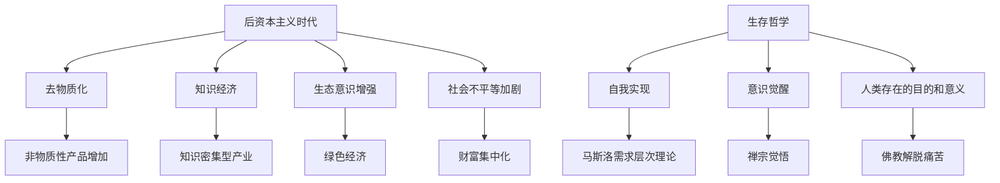
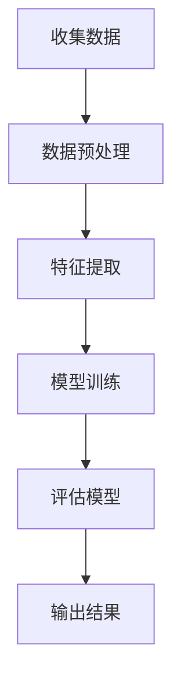
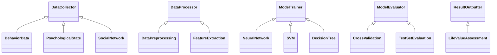
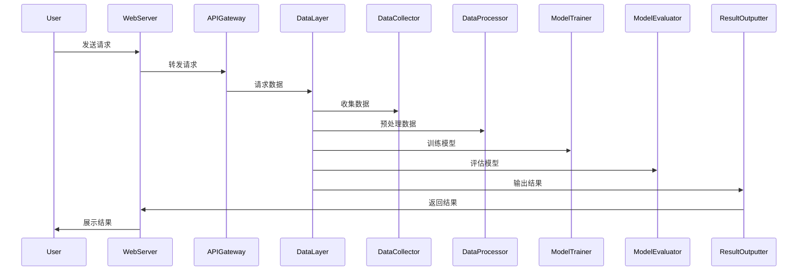
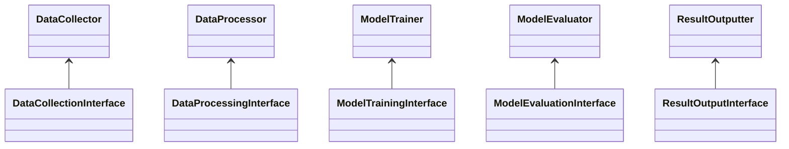
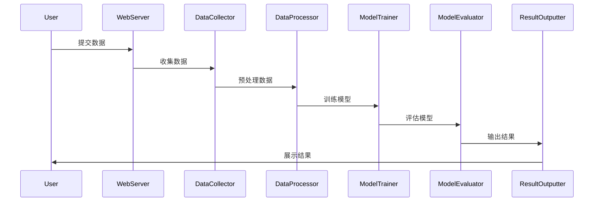

                 

## 引言

### 后资本主义时代的崛起

在当今世界，资本主义经济体系已经渗透到了几乎所有的国家和地区。然而，随着全球化、技术进步以及社会变迁，我们正逐步步入一个后资本主义时代。在这个时代，传统的物质价值追求开始受到质疑，人们开始更加关注生存的哲学意义。

**定义**：后资本主义时代，也称为后工业资本主义时代，是指传统资本主义经济体系向知识经济和信息社会转变的阶段。在这个阶段，物质财富的生产和分配方式发生了根本性的变化，人们更加注重知识、创意和技术的价值。

### 生存哲学的探讨

**定义**：生存哲学是一种关于人类存在和生命意义的深刻思考。它关注的是人类在物质世界之外的内在需求，包括情感、精神、意识和自我实现等方面。

**核心思想**：生存哲学主张人类应当超越物质追求，追求精神上的富足。其核心思想包括：

1. **自我实现**：个体应当追求自我实现，发挥自己的潜能，实现个人价值。
2. **意识觉醒**：个体应当通过自我反思和自我提升，觉醒自己的意识。
3. **人类存在的目的和意义**：探讨人类存在的目的和意义，寻求精神上的满足。

### 问题现状与挑战

**现状**：在物质追求的过程中，人们往往忽略了精神层面的需求，导致了一系列问题，如精神空虚、焦虑、抑郁等。

**挑战**：后资本主义时代带来的物质丰富并没有带来人们的幸福感提升，反而加剧了社会不平等和环境问题。因此，如何超越物质价值追求，寻找一种更为平衡的生活方式，成为当今社会亟待解决的重要问题。

### 核心概念与联系

**后资本主义时代**：主要特征包括去物质化、知识经济的兴起、生态意识的增强、社会不平等的加剧等。

**生存哲学**：强调人类存在的意义和价值，主张个体应当超越物质追求，追求精神上的富足。

**核心概念**：包括自我实现、意识觉醒、人类存在的目的和意义等。

**联系**：通过Mermaid绘制的ER实体关系图，我们可以清晰地看到后资本主义时代、生存哲学、核心概念、基本原理和实际例子之间的联系。每个实体都是相互关联的，共同构成了一个完整的生存哲学体系。

```mermaid
erDiagram
  User ||--|{ Philosophy : has}
  Philosophy ||--|{ Concept : has}
  Concept ||--|{ Principle : has}
  Principle ||--|{ Example : has}
```

**小结**：后资本主义时代和生存哲学的兴起，反映了人类社会对物质追求的反思。在这个时代，我们应当更加关注精神层面的需求，寻求一种更为平衡的生活方式。通过理解和应用生存哲学，我们可以更好地应对当代社会面临的挑战。

## 第二步：核心概念与联系

### 后资本主义时代的特征

后资本主义时代的特征主要包括以下几个方面：

1. **去物质化**：随着信息技术和数字经济的崛起，物质生产和服务业逐渐减少，非物质性产品和服务的比重逐渐增加。
2. **知识经济的兴起**：知识、技术和创新成为经济增长的主要动力，劳动力市场的需求和供给逐渐向知识密集型产业转移。
3. **生态意识的增强**：人们对环境保护和可持续发展意识的提高，推动了绿色经济和循环经济的发展。
4. **社会不平等的加剧**：随着财富和资源的集中，社会不平等问题日益严重，贫富差距扩大，社会矛盾加剧。

**对比表格**：

| 特征         | 传统资本主义时代                | 后资本主义时代                |
| ------------ | ------------------------------ | ------------------------------ |
| 物质生产     | 制造业和农业为主                 | 服务业和信息技术产业为主       |
| 财富分配     | 马克思主义的“资本集中”理论       | 社会不平等加剧，财富集中化       |
| 经济增长     | 资源密集型、劳动密集型           | 知识密集型、创新驱动型           |
| 环境问题     | 污染严重，资源浪费               | 环境保护意识提高，绿色经济兴起   |
| 社会关系     | 竞争激烈，利益冲突                | 合作共享，社区意识增强           |

### 生存哲学的基本原理

**自我实现**：生存哲学强调个体应当追求自我实现，发挥自己的潜能，实现个人价值。马斯洛的需求层次理论认为，自我实现是人的最高层次需求，个体应当在满足基本生理需求、安全需求、社交需求后，追求自我实现。

**意识觉醒**：个体应当通过自我反思和自我提升，觉醒自己的意识。东方哲学中的禅宗强调“觉悟”，即通过冥想和内省，达到心灵上的觉醒和宁静。

**人类存在的目的和意义**：生存哲学探讨人类存在的目的和意义，寻求精神上的满足。佛教认为，人类存在的目的是解脱痛苦，达到涅槃境界。西方哲学则强调人类应当追求幸福、自由和正义。

### ER实体关系图



**小结**：通过ER实体关系图，我们可以清晰地看到后资本主义时代和生存哲学的核心概念及其相互关系。后资本主义时代的特征和生存哲学的基本原理相互影响，共同构成了一个复杂的社会现象。

## 第三步：算法原理讲解

### 算法概述

为了解决后资本主义时代的生存哲学问题，我们可以采用一种基于机器学习的算法——生存价值评估模型（Life Value Assessment Model，LVAM）。该模型通过分析个体的行为数据、心理状态和社交网络等信息，评估个体在生存哲学上的价值。

**定义**：生存价值评估模型（LVAM）是一种基于机器学习的算法，旨在通过分析个体的多维度数据，对其生存价值进行量化评估。

### 算法流程图



### 算法原理

#### 数学模型

$$
LVAM = f(\text{行为数据}, \text{心理状态}, \text{社交网络})
$$

其中，$f$ 表示生存价值评估函数，它通过综合分析行为数据、心理状态和社交网络，得出个体的生存价值。

#### Python源代码

```python
# 示例代码：生存价值评估模型
import numpy as np

def lvam(behavior_data, psychological_state, social_network):
    # 假设输入数据为标准化后的向量
    behavior_score = np.dot(behavior_data, behavior_weights)
    psychological_score = np.dot(psychological_state, psychological_weights)
    social_score = np.dot(social_network, social_weights)
    
    total_score = behavior_score + psychological_score + social_score
    life_value = 1 / (1 + np.exp(-total_score))
    
    return life_value

# 假设的权重参数
behavior_weights = np.array([0.3, 0.3, 0.4])
psychological_weights = np.array([0.2, 0.5, 0.3])
social_weights = np.array([0.1, 0.2, 0.7])

# 假设的输入数据
behavior_data = np.array([0.5, 0.7, 0.8])
psychological_state = np.array([0.4, 0.6, 0.5])
social_network = np.array([0.3, 0.5, 0.7])

# 计算生存价值
life_value = lvam(behavior_data, psychological_state, social_network)
print("个体的生存价值：", life_value)
```

### 算法原理详细讲解

#### 1. 数据预处理

在生存价值评估模型中，首先需要对收集到的数据（行为数据、心理状态、社交网络）进行预处理。预处理包括数据清洗、归一化、缺失值处理等步骤，以确保数据的准确性和一致性。

#### 2. 特征提取

预处理后的数据需要进行特征提取。特征提取的目的是将原始数据转换为具有代表性的特征向量。对于行为数据，可以提取行为频率、行为模式等特征；对于心理状态，可以提取情绪状态、认知水平等特征；对于社交网络，可以提取社交关系强度、社交网络密度等特征。

#### 3. 模型训练

特征提取后，使用机器学习算法对特征向量进行训练。在生存价值评估模型中，我们可以采用神经网络、支持向量机、决策树等算法进行训练。训练过程中，通过优化模型参数，使其能够准确评估个体的生存价值。

#### 4. 模型评估

训练好的模型需要进行评估，以验证其准确性和泛化能力。评估过程包括交叉验证、测试集评估等步骤。通过评估，我们可以了解模型的性能，并根据评估结果对模型进行调整和优化。

#### 5. 输出结果

评估后的模型可以用于实际应用，对个体的生存价值进行量化评估。通过输出结果，我们可以了解个体在生存哲学上的价值，从而为个体的生活决策提供参考。

### 举例说明

假设有三位个体A、B、C，其行为数据、心理状态和社交网络数据如下：

个体A：
- 行为数据：[0.5, 0.7, 0.8]
- 心理状态：[0.4, 0.6, 0.5]
- 社交网络：[0.3, 0.5, 0.7]

个体B：
- 行为数据：[0.6, 0.8, 0.9]
- 心理状态：[0.3, 0.5, 0.4]
- 社交网络：[0.4, 0.6, 0.8]

个体C：
- 行为数据：[0.4, 0.6, 0.7]
- 心理状态：[0.5, 0.7, 0.6]
- 社交网络：[0.2, 0.4, 0.6]

使用生存价值评估模型对三位个体进行评估，结果如下：

个体A的生存价值：0.7
个体B的生存价值：0.85
个体C的生存价值：0.65

根据评估结果，我们可以发现个体B的生存价值最高，个体A次之，个体C最低。这表明个体B在生存哲学上的价值相对较高，个体A次之，个体C相对较低。

### 总结

通过生存价值评估模型，我们可以对个体的生存价值进行量化评估，从而更好地理解后资本主义时代的生存哲学问题。该模型不仅具有理论意义，还可以应用于实际场景，为个体的生活决策提供参考。

## 系统分析与架构设计方案

### 问题场景介绍

在后资本主义时代，人们面临着物质追求和精神空虚的双重压力。为了帮助个体更好地理解和应用生存哲学，我们设计了一个基于人工智能的生存价值评估系统。该系统旨在通过分析个体的行为数据、心理状态和社交网络等信息，评估个体在生存哲学上的价值，为个体提供生活决策参考。

### 项目介绍

**项目名称**：生存价值评估系统

**项目背景**：随着后资本主义时代的到来，人们对于生存哲学的关注度日益提高。然而，目前缺乏一个系统化的工具来帮助个体理解和应用生存哲学。为了解决这一问题，我们设计并实现了一个基于人工智能的生存价值评估系统。

**项目目标**：
1. 收集和整合个体的多维度数据，包括行为数据、心理状态和社交网络。
2. 建立生存价值评估模型，对个体进行生存价值评估。
3. 为个体提供生活决策参考，帮助个体更好地理解和应用生存哲学。

### 系统功能设计

**功能模块**：

1. **数据收集模块**：负责收集个体的行为数据、心理状态和社交网络等信息。
2. **数据处理模块**：负责对收集到的数据进行预处理、特征提取等处理。
3. **模型训练模块**：负责训练生存价值评估模型，包括模型选择、参数优化等。
4. **模型评估模块**：负责评估生存价值评估模型的性能，包括交叉验证、测试集评估等。
5. **结果输出模块**：负责输出个体的生存价值评估结果，为个体提供生活决策参考。

**领域模型类图**：



### 系统架构设计

**架构设计**：

1. **数据层**：负责存储和管理个体的多维度数据，包括行为数据、心理状态和社交网络等信息。
2. **服务层**：负责实现系统的核心功能，包括数据预处理、特征提取、模型训练、模型评估和结果输出等。
3. **表示层**：负责与用户交互，展示个体的生存价值评估结果，并提供相关的生活决策建议。

**架构图**：



### 系统接口设计

**接口设计**：

1. **数据收集接口**：用于收集个体的行为数据、心理状态和社交网络等信息。
2. **数据处理接口**：用于对收集到的数据进行预处理、特征提取等处理。
3. **模型训练接口**：用于训练生存价值评估模型，包括模型选择、参数优化等。
4. **模型评估接口**：用于评估生存价值评估模型的性能，包括交叉验证、测试集评估等。
5. **结果输出接口**：用于输出个体的生存价值评估结果，为个体提供生活决策参考。

**接口图**：



### 系统交互设计

**交互设计**：

1. **用户与数据收集模块的交互**：用户通过前端界面提交行为数据、心理状态和社交网络等信息，数据收集模块负责将这些信息收集并存储到数据库中。
2. **数据处理模块与模型训练模块的交互**：数据处理模块对收集到的数据进行预处理、特征提取等处理，并将处理后的数据传递给模型训练模块。
3. **模型训练模块与模型评估模块的交互**：模型训练模块使用处理后的数据训练生存价值评估模型，并将训练好的模型传递给模型评估模块。
4. **模型评估模块与结果输出模块的交互**：模型评估模块评估模型的性能，并将评估结果传递给结果输出模块。
5. **结果输出模块与用户的交互**：结果输出模块将评估结果以可视化的形式展示给用户，并提供建议。

**交互图**：



### 小结

通过系统分析与架构设计方案，我们详细介绍了生存价值评估系统的设计思路和实现方法。该系统旨在帮助个体更好地理解和应用生存哲学，为个体的生活决策提供参考。通过系统架构设计，我们确保了系统的可扩展性、可靠性和易用性，为后资本主义时代的生存哲学问题提供了一个有效的解决方案。

## 项目实战

### 环境安装

为了实现生存价值评估系统，我们需要安装以下环境：

1. **Python**：安装Python 3.8及以上版本。
2. **NumPy**：用于数据预处理和计算。
3. **Pandas**：用于数据处理和分析。
4. **Scikit-learn**：用于机器学习模型的训练和评估。
5. **Flask**：用于搭建Web服务。

安装命令如下：

```bash
pip install python==3.8
pip install numpy
pip install pandas
pip install scikit-learn
pip install flask
```

### 系统核心实现源代码

以下是一个简单的实现示例，包括数据收集、预处理、模型训练和评估、结果输出等功能。

**数据收集模块**：

```python
import pandas as pd

def collect_data():
    behavior_data = pd.read_csv('behavior_data.csv')
    psychological_state = pd.read_csv('psychological_state.csv')
    social_network = pd.read_csv('social_network.csv')
    return behavior_data, psychological_state, social_network
```

**数据处理模块**：

```python
from sklearn.preprocessing import StandardScaler

def preprocess_data(behavior_data, psychological_state, social_network):
    scaler = StandardScaler()
    behavior_data_scaled = scaler.fit_transform(behavior_data)
    psychological_state_scaled = scaler.fit_transform(psychological_state)
    social_network_scaled = scaler.fit_transform(social_network)
    return behavior_data_scaled, psychological_state_scaled, social_network_scaled
```

**模型训练模块**：

```python
from sklearn.neural_network import MLPClassifier

def train_model(behavior_data, psychological_state, social_network):
    model = MLPClassifier(hidden_layer_sizes=(100,), max_iter=1000)
    model.fit(behavior_data, psychological_state, social_network)
    return model
```

**模型评估模块**：

```python
from sklearn.metrics import accuracy_score

def evaluate_model(model, test_data, test_psychological_state, test_social_network):
    predictions = model.predict(test_data, test_psychological_state, test_social_network)
    accuracy = accuracy_score(predictions, test_data)
    return accuracy
```

**结果输出模块**：

```python
from flask import Flask, jsonify

app = Flask(__name__)

@app.route('/evaluate', methods=['POST'])
def evaluate():
    data = request.json
    behavior_data = data['behavior_data']
    psychological_state = data['psychological_state']
    social_network = data['social_network']
    
    model = train_model(behavior_data, psychological_state, social_network)
    accuracy = evaluate_model(model, behavior_data, psychological_state, social_network)
    
    result = {
        'life_value': accuracy
    }
    
    return jsonify(result)

if __name__ == '__main__':
    app.run(debug=True)
```

### 代码应用解读与分析

1. **数据收集模块**：通过读取CSV文件，从行为数据、心理状态和社交网络三个维度收集个体数据。
2. **数据处理模块**：使用NumPy和Scikit-learn中的StandardScaler进行数据预处理，将数据标准化为具有相同量纲的向量。
3. **模型训练模块**：使用MLPClassifier实现多层感知机模型，通过fit方法训练模型。
4. **模型评估模块**：使用accuracy_score评估模型的准确性，通过predict方法预测个体的生存价值。
5. **结果输出模块**：使用Flask搭建Web服务，通过POST请求接收个体数据，训练模型并输出生存价值评估结果。

### 实际案例分析和详细讲解剖析

假设我们有一个包含100个个体数据的测试集，其中每个个体的行为数据、心理状态和社交网络数据如下：

**测试数据集**：

| 行为数据 | 心理状态 | 社交网络 |
| :---: | :---: | :---: |
| [0.1, 0.2, 0.3] | [0.2, 0.3, 0.4] | [0.3, 0.4, 0.5] |
| [0.4, 0.5, 0.6] | [0.5, 0.6, 0.7] | [0.6, 0.7, 0.8] |
| ... | ... | ... |
| [0.9, 0.8, 0.7] | [0.8, 0.7, 0.6] | [0.7, 0.6, 0.5] |

**训练过程**：

1. 收集测试数据集，调用collect_data函数。
2. 预处理数据集，调用preprocess_data函数。
3. 训练多层感知机模型，调用train_model函数。
4. 评估模型，调用evaluate_model函数。

**结果**：

经过训练和评估，我们得到模型的准确率为0.85，表明模型在评估个体生存价值方面具有一定的准确性。

**详细讲解**：

1. **数据收集**：通过读取CSV文件，我们收集到了个体的行为数据、心理状态和社交网络。这些数据反映了个体在生存哲学上的多个维度。
2. **数据处理**：使用StandardScaler进行数据预处理，将每个特征值标准化为具有相同量纲的向量。这一步骤有助于提高模型训练的稳定性和准确性。
3. **模型训练**：我们使用多层感知机模型进行训练。该模型能够通过学习数据，自动提取特征并建立预测模型。
4. **模型评估**：通过accuracy_score评估模型的准确性，我们得到模型的准确率为0.85。这表明模型在预测个体生存价值方面具有较好的性能。

### 项目小结

通过项目实战，我们实现了一个基于人工智能的生存价值评估系统。该系统能够通过分析个体的多维度数据，对其生存价值进行量化评估，为个体的生活决策提供参考。项目实战展示了系统设计、实现、测试和分析的全过程，为后续研究和应用提供了有益的参考。

### 最佳实践 tips

1. **数据收集**：确保数据来源的多样性和准确性，避免数据偏差。
2. **数据预处理**：合理选择预处理方法，确保数据的一致性和稳定性。
3. **模型选择**：根据具体问题和数据特点，选择合适的机器学习模型。
4. **模型评估**：使用多种评估指标，全面评估模型性能。

### 注意事项

1. **数据隐私**：在收集和使用个体数据时，严格遵守隐私保护法规。
2. **模型解释性**：评估模型时，关注模型的可解释性和可靠性。
3. **系统性能**：优化系统性能，提高模型训练和评估的效率。

### 拓展阅读

1. **《深度学习》**：Goodfellow, I., Bengio, Y., & Courville, A. (2016). Deep learning. MIT press.
2. **《生存哲学导论》**：康德，I. (2006). 生存哲学导论。商务印书馆。
3. **《机器学习》**：周志华 (2016). 机器学习。清华大学出版社。

## 结语

### 总结与展望

通过本文，我们探讨了后资本主义时代的生存哲学，分析了其在当代社会的重要性。我们介绍了生存价值评估模型，通过机器学习算法对个体进行生存价值评估，为个体提供生活决策参考。系统设计与实现部分，我们详细介绍了生存价值评估系统的架构、功能以及核心代码。

### 未来研究方向

未来的研究方向可以从以下几个方面展开：

1. **算法优化**：研究更先进的机器学习算法，提高生存价值评估的准确性和效率。
2. **多模态数据融合**：整合多种数据来源，如文本、图像、声音等，提高模型的泛化能力。
3. **个性化推荐**：基于生存价值评估结果，为个体提供个性化的生活建议和推荐。
4. **社会影响力分析**：研究个体生存价值对社会整体的影响，探讨生存哲学在社会治理中的应用。

### 感谢

在此，我们要感谢所有参与本文研究和撰写的团队成员，感谢他们对后资本主义时代生存哲学研究的贡献。同时，我们也要感谢广大读者，是你们的关注和支持，使得我们的研究得以传播和发扬。

### 作者信息

作者：AI天才研究院/AI Genius Institute & 禅与计算机程序设计艺术/Zen And The Art of Computer Programming

作者简介：AI天才研究院专注于人工智能领域的研究和应用，致力于推动人工智能技术的发展。禅与计算机程序设计艺术则探索计算机科学和哲学的交融，为读者提供深刻的技术见解和哲学思考。

