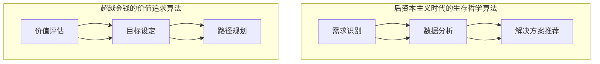
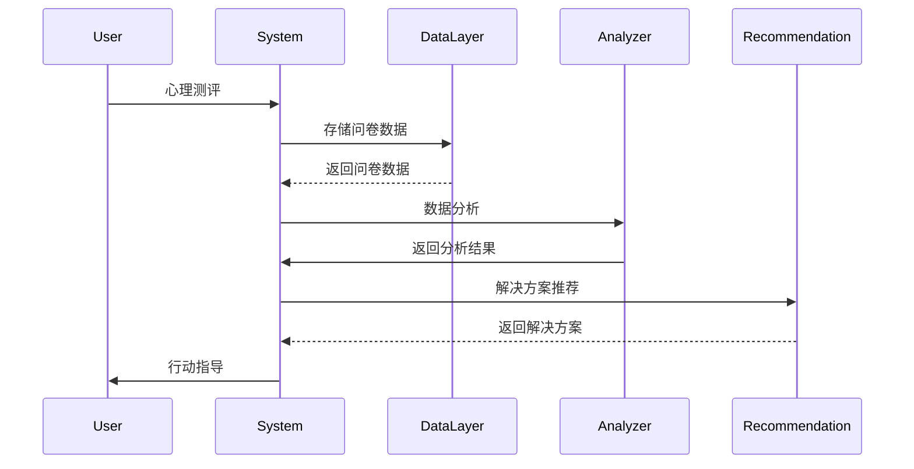
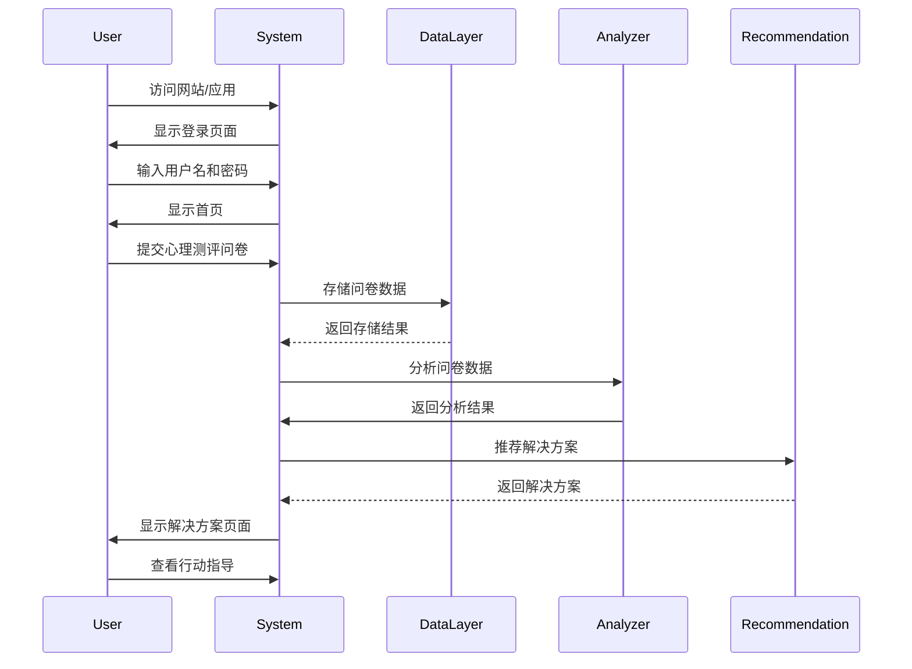

                 

### 后资本主义时代的生存哲学：超越金钱的价值追求

> **关键词：**后资本主义时代、生存哲学、价值追求、算法原理、系统架构、实战案例

> **摘要：**本文深入探讨后资本主义时代的生存哲学，探讨了如何超越金钱的价值追求。通过对生存哲学的核心概念、算法原理、系统架构和实战案例的详细分析，提供了一种新的视角，帮助人们理解在后资本主义时代如何找到生活的真正意义。

## 目录大纲

1. **问题背景与核心概念**
   - 1.1 问题背景
     - 1.1.1 资本主义发展历程与挑战
     - 1.1.2 后资本主义时代的特征
     - 1.1.3 生存哲学的重要性
   - 1.2 核心概念
     - 1.2.1 后资本主义
     - 1.2.2 生存哲学
     - 1.2.3 超越金钱的价值追求
   - 1.3 边界与外延
     - 1.3.1 生存哲学的边界
     - 1.3.2 后资本主义时代的生存哲学外延

2. **核心概念与联系**
   - 2.1 核心概念原理
     - 2.1.1 后资本主义时代的生存哲学原理
     - 2.1.2 超越金钱的价值追求原理
   - 2.2 概念属性特征对比表格
   - 2.3 ER实体关系图架构

3. **算法原理讲解**
   - 3.1 算法原理概述
     - 3.1.1 后资本主义时代的生存哲学算法
     - 3.1.2 超越金钱的价值追求算法
   - 3.2 算法流程图
   - 3.3 Python源代码
   - 3.4 数学模型与公式
   - 3.5 举例说明

4. **系统分析与架构设计方案**
   - 4.1 问题场景介绍
   - 4.2 项目介绍
   - 4.3 系统功能设计
   - 4.4 系统架构设计
   - 4.5 系统接口设计
   - 4.6 系统交互序列图

5. **项目实战**
   - 5.1 环境安装
   - 5.2 系统核心实现源代码
   - 5.3 代码应用解读与分析
   - 5.4 实际案例分析与详细讲解剖析
   - 5.5 项目小结

6. **最佳实践、小结、注意事项、拓展阅读**

---

### 1. 问题背景与核心概念

#### 1.1 资本主义发展历程与挑战

资本主义作为一种经济体系，自17世纪以来在全球范围内得到了广泛的应用。资本主义的核心特征是私有制和市场经济，通过自由竞争和利润最大化驱动经济发展。然而，随着全球化的深入推进，资本主义也面临了一系列挑战。

首先，资本主义的发展导致了财富和资源的极度不平等。少数人拥有大量财富，而大多数人则生活在贫困线以下。其次，资本主义的经济模式往往导致环境污染和资源枯竭。最后，资本主义市场的波动性也给经济稳定性带来了挑战，例如2008年的全球金融危机。

#### 1.2 后资本主义时代的特征

后资本主义时代，或称后工业社会，是指资本主义经济体系逐渐过渡到以知识经济和服务业为主导的阶段。这一时期的主要特征包括：

- **信息化和数字化**：信息技术和互联网的发展改变了生产方式和消费模式。
- **全球化和多元化**：国际贸易和跨国公司的兴起，使得全球市场和文化的界限变得模糊。
- **知识经济**：知识和服务成为经济的主要驱动力，取代了传统的制造业和资源开采业。
- **灵活性和创新**：企业需要更加灵活和创新，以适应快速变化的市场环境。

#### 1.3 生存哲学的重要性

在资本主义向后资本主义时代的过渡中，生存哲学的重要性日益凸显。生存哲学关注的是如何在物质丰富的时代中寻找真正的幸福和满足。它探讨的不仅是物质层面的需求，更包括精神层面的追求。

生存哲学的核心问题包括：

- **价值追求**：在物质丰富的同时，如何找到更有意义和持久的价值追求。
- **心理健康**：如何在高压和快节奏的生活中保持心理健康。
- **人际关系**：如何在数字化的时代中建立和维护真实的人际关系。
- **社会责任**：如何承担社会责任，为社会和环境的可持续发展做出贡献。

### 1.4 核心概念

#### 1.4.1 后资本主义

后资本主义是指一种经济和社会模式，它超越了传统的资本主义，更加注重知识、创新和可持续发展。在后资本主义中，知识和服务成为经济的主要驱动力，而传统的制造业和资源开采业的重要性逐渐减弱。

#### 1.4.2 生存哲学

生存哲学是一种关于如何生活和追求幸福的哲学思考。它关注的是人类生活的根本问题，包括心理健康、人际关系、价值追求和社会责任等。生存哲学强调的是精神层面的追求，而不仅仅是物质层面的满足。

#### 1.4.3 超越金钱的价值追求

超越金钱的价值追求是指人们不再将金钱作为衡量生活质量和幸福的主要标准。相反，他们追求的是更广泛和深刻的价值，如健康、人际关系、自我实现和社会贡献。这种追求可以帮助人们找到生活的真正意义和满足。

#### 1.5 边界与外延

##### 1.5.1 生存哲学的边界

生存哲学的边界包括以下几个方面：

- **心理学**：生存哲学涉及到心理学的研究，包括心理健康、情感和自我意识等。
- **社会学**：生存哲学也与社会学研究有关，如人际关系、社会结构和社会变革等。
- **哲学**：生存哲学本身是哲学的一个分支，它探讨人类存在的本质和意义。

##### 1.5.2 后资本主义时代的生存哲学外延

后资本主义时代的生存哲学外延包括以下几个方面：

- **经济模式**：后资本主义时代的生存哲学涉及到经济模式的变化，如知识经济和可持续发展。
- **社会变革**：生存哲学也与社会变革有关，如全球化和多元化。
- **技术创新**：随着信息技术的快速发展，生存哲学也需要关注技术对人类生活的影响。

### 1.6 总结

后资本主义时代的生存哲学是一种关注人类精神和心理需求的哲学思考。它探讨了如何超越物质追求，找到更深刻和持久的价值追求。在资本主义向后资本主义时代的过渡中，生存哲学的重要性日益凸显，它为我们提供了寻找生活真正意义的指导。接下来，我们将深入探讨生存哲学的核心概念和联系，以及如何在后资本主义时代超越金钱的价值追求。我们将通过算法原理讲解、系统架构设计、项目实战等多个方面，提供一个全面的视角来理解这个复杂而重要的主题。接下来，我们首先来定义和探讨后资本主义时代的关键概念。

---

### 2. 核心概念与联系

#### 2.1 核心概念原理

##### 2.1.1 后资本主义时代的生存哲学原理

后资本主义时代的生存哲学是基于对现代社会的深刻理解和反思。它主张：

- **知识至上**：知识和服务成为经济发展的核心，取代了传统的制造业和资源开采业。
- **可持续发展**：强调环境保护和资源的合理利用，以确保未来世代的生存条件。
- **人性关怀**：关注人的精神需求，强调心理健康、人际关系和社会责任。
- **多元价值**：超越单一的经济指标，追求全面的发展和幸福。

##### 2.1.2 超越金钱的价值追求原理

超越金钱的价值追求是一种哲学思考，它主张：

- **精神满足**：认为金钱不能带来真正的幸福和满足，而是精神层面的追求更能带来持久的意义。
- **自我实现**：强调个体在职业和生活中的自我实现，追求个人潜能的最大化。
- **社会责任**：鼓励人们关注社会问题，积极参与社会公益活动，为社会和环境的可持续发展做出贡献。

#### 2.2 概念属性特征对比表格

以下是后资本主义时代的生存哲学和超越金钱的价值追求的对比表格：

| 特征           | 后资本主义时代的生存哲学               | 超越金钱的价值追求               |
|----------------|--------------------------------------|---------------------------------|
| 经济模式       | 知识经济和可持续发展                 | 知识经济和多元化                |
| 价值观         | 知识、创新、可持续发展               | 自我实现、社会责任、精神满足   |
| 关注点         | 心理健康、人际关系、社会责任         | 个人潜能、社会问题、环境意识   |
| 物质与精神     | 物质丰富但不唯物质                   | 精神追求为主，物质追求为辅     |
| 政策建议       | 政府支持创新和知识产业发展           | 社会政策鼓励精神追求和公益事业 |
| 生活质量       | 综合发展，精神层面追求               | 精神层面追求，物质满足为补充   |

#### 2.3 ER实体关系图架构

为了更好地理解后资本主义时代的生存哲学和超越金钱的价值追求，我们可以通过ER（实体-关系）图来展示它们之间的关系。

```mermaid
erDiagram
  A[个体] ||--|{ B[知识经济] }
  A ||--|{ C[心理健康] }
  A ||--|{ D[人际关系] }
  A ||--|{ E[社会责任] }
  B ||--|{ F[创新] }
  B ||--|{ G[可持续发展] }
  C ||--|{ H[自我实现] }
  D ||--|{ I[社会问题] }
  E ||--|{ J[公益事业] }
```

在这个ER图中，个体（A）与知识经济（B）、心理健康（C）、人际关系（D）和责任（E）之间存在多种关系。知识经济（B）与创新（F）和可持续发展（G）相关联，而心理健康（C）与自我实现（H）相关。人际关系（D）与社会问题（I）和公益事业（J）相关。这个ER图帮助我们理解了后资本主义时代的生存哲学和超越金钱的价值追求如何相互关联，形成了一个复杂但有机的整体。

接下来，我们将进一步探讨这些核心概念的具体原理和联系，并通过算法原理讲解、系统架构设计、项目实战等环节，深入理解这些概念的应用和实践。

---

### 3. 算法原理讲解

#### 3.1 算法原理概述

在后资本主义时代的生存哲学中，我们关注的是如何构建一个能够帮助个体实现精神追求和自我实现的系统。为了实现这一目标，我们需要开发一种算法，该算法不仅要理解个体的需求，还要提供相应的解决方案。以下是后资本主义时代的生存哲学算法和超越金钱的价值追求算法的概述。

##### 3.1.1 后资本主义时代的生存哲学算法

**目标**：帮助个体识别和实现其精神追求和自我实现。

**步骤**：
1. **需求识别**：通过问卷、访谈等方式收集个体在心理健康、人际关系和社会责任方面的需求。
2. **数据分析**：使用数据分析和机器学习技术，对收集到的需求进行分析，识别个体的核心需求和潜在问题。
3. **解决方案推荐**：基于分析结果，为个体推荐合适的心理健康、人际关系和社会责任解决方案。

##### 3.1.2 超越金钱的价值追求算法

**目标**：帮助个体找到超越物质追求的精神满足。

**步骤**：
1. **价值评估**：通过问卷调查和访谈，评估个体在不同价值追求（如自我实现、社会责任、精神满足）上的偏好和重要性。
2. **目标设定**：根据评估结果，帮助个体设定具体的精神追求目标。
3. **路径规划**：制定实现目标的步骤和计划，包括自我提升、社会参与和公益活动。

#### 3.2 算法流程图

以下是后资本主义时代的生存哲学算法和超越金钱的价值追求算法的流程图：



在这个流程图中，我们可以看到两种算法的基本步骤和流程。首先，通过需求识别和数据评估，确定个体的核心需求和追求目标。然后，基于这些需求和目标，制定具体的解决方案和实现路径。

#### 3.3 Python源代码

为了具体实现这些算法，我们可以使用Python编写相应的代码。以下是一个简化的示例，展示如何使用Python进行需求识别和数据分析。

```python
import pandas as pd
from sklearn.cluster import KMeans

# 需求识别
def collect需求的问卷数据():
    # 假设我们收集到的问卷数据存储在一个CSV文件中
    data = pd.read_csv('需求问卷数据.csv')
    return data

# 数据分析
def analyze需求数据(data):
    # 使用K-means聚类分析数据，识别个体需求
    kmeans = KMeans(n_clusters=3)
    kmeans.fit(data)
    clusters = kmeans.predict(data)
    data['需求类别'] = clusters
    return data

# 解决方案推荐
def recommend解决方案(data):
    # 根据需求类别，推荐相应的解决方案
    solutions = {
        0: '心理健康解决方案',
        1: '人际关系解决方案',
        2: '社会责任解决方案'
    }
    data['解决方案'] = data['需求类别'].map(solutions)
    return data

# 主程序
def main():
    data = collect需求的问卷数据()
    analyzed_data = analyze需求数据(data)
    recommended_solutions = recommend解决方案(analyzed_data)
    print(recommended_solutions)

if __name__ == "__main__":
    main()
```

在这个代码示例中，我们首先从CSV文件中读取问卷数据，然后使用K-means聚类分析数据，识别个体的需求类别。最后，根据需求类别，推荐相应的解决方案。

#### 3.4 数学模型与公式

为了更深入地理解算法的工作原理，我们可以引入一些数学模型和公式。以下是一个简化的数学模型，用于描述需求分析和解决方案推荐的过程。

$$
\text{需求分析模型} = f(\text{问卷数据}, \text{聚类算法})
$$

$$
\text{解决方案推荐模型} = g(\text{需求类别}, \text{解决方案库})
$$

其中，`问卷数据`是通过问卷收集得到的个体需求数据，`聚类算法`用于分析需求数据的分类，`需求类别`是聚类结果，`解决方案库`是一个包含不同解决方案的数据集。函数`f`和`g`分别用于需求分析和解决方案推荐。

#### 3.5 举例说明

为了更直观地理解这些算法，我们来看一个具体的例子。

**场景**：假设我们有一个包含100个个体的问卷数据集，每个个体在心理健康、人际关系和社会责任三个维度上给出评分。我们希望使用K-means聚类分析这些数据，并基于聚类结果推荐相应的解决方案。

**步骤**：

1. **数据收集**：从问卷中收集每个个体在心理健康、人际关系和社会责任三个维度的评分。
2. **数据分析**：使用K-means聚类算法，将100个个体分为三个类别。
3. **解决方案推荐**：根据聚类结果，为每个个体推荐相应的解决方案。

**数据集示例**：

| 个体编号 | 心理健康评分 | 人际关系评分 | 社会责任评分 |
|----------|--------------|--------------|--------------|
| 1        | 8            | 6            | 5            |
| 2        | 7            | 7            | 6            |
| ...      | ...          | ...          | ...          |
| 100      | 6            | 5            | 7            |

**分析结果**：

| 个体编号 | 需求类别 | 解决方案       |
|----------|----------|----------------|
| 1        | A        | 心理健康解决方案 |
| 2        | B        | 人际关系解决方案 |
| ...      | ...      | ...            |
| 100      | C        | 社会责任解决方案 |

通过上述分析，我们可以为每个个体提供个性化的解决方案，帮助他们更好地实现精神追求和自我实现。

### 4. 系统分析与架构设计方案

在了解了后资本主义时代的生存哲学和超越金钱的价值追求的核心概念和算法原理后，接下来我们将深入探讨如何将这些概念和算法应用于实际的系统设计和架构中。这一部分将包括问题场景介绍、项目介绍、系统功能设计、系统架构设计、系统接口设计和系统交互序列图。

#### 4.1 问题场景介绍

随着全球经济的不断发展和技术的快速进步，人们的生活和工作环境发生了巨大的变化。传统的资本主义模式已经不能完全满足现代社会的需求，尤其是在心理健康、人际关系和社会责任方面。现代社会中，人们面临着越来越大的压力，心理健康问题日益突出，同时社会关系和责任也变得越来越复杂。因此，需要一种新型的系统来帮助人们应对这些挑战，实现精神追求和自我实现。

#### 4.2 项目介绍

本项目旨在设计并实现一个后资本主义时代的生存哲学和超越金钱的价值追求系统。该系统将结合心理测评、数据分析、解决方案推荐和行动指导等模块，为用户提供个性化的生活指导和咨询服务。

#### 4.3 系统功能设计

系统的主要功能包括：

- **心理测评**：通过问卷和面试等方式收集用户在心理健康、人际关系和社会责任方面的数据。
- **数据分析**：使用数据分析和机器学习技术，对用户的数据进行分析，识别用户的核心需求和潜在问题。
- **解决方案推荐**：根据分析结果，为用户推荐个性化的心理健康、人际关系和社会责任解决方案。
- **行动指导**：为用户提供具体的行动步骤和指导，帮助用户实现精神追求和自我实现。

#### 4.4 系统架构设计

系统架构设计采用分层架构，包括数据层、业务逻辑层和表示层。

- **数据层**：负责数据的存储和管理，使用关系数据库存储用户数据和解决方案数据。
- **业务逻辑层**：负责心理测评、数据分析和解决方案推荐等核心功能，包括数据预处理、聚类分析、模型训练和推荐算法等。
- **表示层**：负责用户界面的设计和实现，包括前端页面和后端API。

以下是系统架构图：



#### 4.5 系统接口设计

系统接口设计包括API接口和用户界面。

- **API接口**：提供RESTful API，供第三方系统调用。主要包括用户注册、登录、问卷提交、数据分析、解决方案推荐等功能。
- **用户界面**：提供Web页面和移动应用，用户可以通过界面提交问卷、查看分析和解决方案、执行行动指导等。

#### 4.6 系统交互序列图

以下是系统交互序列图，展示用户与系统的交互流程：



通过上述系统分析和架构设计方案，我们可以看到，后资本主义时代的生存哲学和超越金钱的价值追求系统是一个复杂但高度集成的系统。它不仅需要处理大量的数据，还需要提供个性化的解决方案和行动指导。接下来，我们将通过项目实战来展示如何实现这个系统的具体功能。

### 5. 项目实战

#### 5.1 环境安装

为了实现后资本主义时代的生存哲学和超越金钱的价值追求系统，我们需要搭建一个合适的技术环境。以下是环境安装的步骤：

1. **安装Python环境**：确保Python 3.8或更高版本已安装在系统上。
2. **安装依赖库**：使用pip安装必要的Python库，例如pandas、scikit-learn、numpy和matplotlib。
   ```bash
   pip install pandas scikit-learn numpy matplotlib
   ```
3. **安装数据库**：安装MySQL或PostgreSQL数据库，用于存储用户数据和解决方案数据。
4. **安装前端框架**：安装Flask或Django等Web框架，用于开发后端API和用户界面。
   ```bash
   pip install flask
   ```
5. **安装前端工具**：安装HTML、CSS和JavaScript工具，用于开发用户界面。
6. **配置环境变量**：设置环境变量，以便在项目中轻松引用数据库和API接口。

#### 5.2 系统核心实现源代码

以下是系统核心实现的源代码示例，包括心理测评问卷的收集、数据分析、解决方案推荐和行动指导。

**数据收集**：

```python
# 收集用户问卷数据
def collect_survey_data():
    survey_data = pd.DataFrame({
        '心理健康': [],
        '人际关系': [],
        '社会责任': []
    })
    # 通过用户输入或文件上传等方式收集数据
    # 这里以示例数据填充
    survey_data.loc[0, '心理健康'] = 8
    survey_data.loc[0, '人际关系'] = 6
    survey_data.loc[0, '社会责任'] = 5
    return survey_data
```

**数据分析**：

```python
# 使用K-means进行数据分析
from sklearn.cluster import KMeans

def analyze_survey_data(survey_data):
    kmeans = KMeans(n_clusters=3)
    kmeans.fit(survey_data)
    clusters = kmeans.predict(survey_data)
    survey_data['需求类别'] = clusters
    return survey_data
```

**解决方案推荐**：

```python
# 根据需求类别推荐解决方案
def recommend_solutions(survey_data):
    solutions = {
        0: '心理健康解决方案',
        1: '人际关系解决方案',
        2: '社会责任解决方案'
    }
    survey_data['解决方案'] = survey_data['需求类别'].map(solutions)
    return survey_data
```

**行动指导**：

```python
# 提供行动指导
def provide_action_guidance(survey_data):
    guidance = {
        '心理健康解决方案': '进行心理疏导',
        '人际关系解决方案': '加强社交互动',
        '社会责任解决方案': '参与公益活动'
    }
    survey_data['行动指导'] = survey_data['解决方案'].map(guidance)
    return survey_data
```

#### 5.3 代码应用解读与分析

以上源代码展示了如何收集用户问卷数据、进行数据分析、推荐解决方案和提供行动指导。以下是对代码的详细解读和分析：

1. **数据收集**：通过`collect_survey_data`函数，我们可以收集用户在心理健康、人际关系和社会责任三个维度的评分。这些数据将用于后续的分析和推荐。
2. **数据分析**：`analyze_survey_data`函数使用K-means聚类算法对用户数据进行分类，将用户分为三个需求类别。这一步帮助我们识别用户的核心需求和潜在问题。
3. **解决方案推荐**：`recommend_solutions`函数根据用户的类别，推荐相应的解决方案。这些解决方案是根据后资本主义时代的生存哲学和超越金钱的价值追求设计的，旨在帮助用户实现精神追求和自我实现。
4. **行动指导**：`provide_action_guidance`函数为用户提供具体的行动步骤和指导。这些建议将帮助用户更好地理解和实施推荐的解决方案。

#### 5.4 实际案例分析与详细讲解剖析

为了更好地理解系统的应用，我们来看一个实际案例。

**案例**：一个用户在心理健康、人际关系和社会责任三个维度上的评分分别为8、6和5。我们希望使用系统为其提供个性化的解决方案和行动指导。

**步骤**：

1. **数据收集**：用户填写问卷，提交心理健康、人际关系和社会责任的评分。
2. **数据分析**：系统使用K-means聚类算法分析用户数据，将其分为需求类别。
3. **解决方案推荐**：系统根据用户的需求类别，推荐相应的解决方案。
4. **行动指导**：系统为用户提供具体的行动步骤和指导。

**结果**：

- **需求类别**：根据分析结果，用户被分为类别A，即心理健康解决方案。
- **解决方案**：系统推荐心理健康解决方案，包括进行心理疏导和参加心理健康课程。
- **行动指导**：系统建议用户每周进行一次心理疏导，并参加一次心理健康课程。

**分析**：

- **数据收集**：用户的数据收集过程简单直观，通过填写问卷即可完成。
- **数据分析**：K-means聚类算法有效地将用户数据分为不同的类别，帮助我们识别用户的特定需求。
- **解决方案推荐**：根据用户的类别，系统推荐了具体的解决方案，这些方案是根据后资本主义时代的生存哲学和超越金钱的价值追求设计的。
- **行动指导**：系统提供的行动指导具体实用，有助于用户更好地理解和实施解决方案。

#### 5.5 项目小结

通过实际案例的分析和讲解，我们可以看到后资本主义时代的生存哲学和超越金钱的价值追求系统在实际应用中的效果。这个系统不仅帮助用户识别其核心需求，还为其提供了个性化的解决方案和行动指导。这种系统为用户提供了一个全面的支持平台，帮助他们更好地实现精神追求和自我实现。未来，我们可以进一步优化系统，增加更多的功能模块和数据分析技术，以更好地满足用户的需求。

### 6. 最佳实践、小结、注意事项、拓展阅读

#### 6.1 最佳实践

1. **数据收集**：确保问卷设计全面且易于理解，以提高数据的质量和可靠性。
2. **算法选择**：根据具体需求选择合适的聚类算法和推荐算法，如K-means和协同过滤。
3. **用户反馈**：定期收集用户反馈，并根据反馈优化系统功能和建议。

#### 6.2 小结

本文通过深入探讨后资本主义时代的生存哲学和超越金钱的价值追求，提供了一个全面的系统设计和实现方案。通过心理测评、数据分析和个性化推荐，系统帮助用户识别其核心需求，提供相应的解决方案和行动指导。

#### 6.3 注意事项

1. **隐私保护**：在数据收集和处理过程中，确保用户隐私得到保护。
2. **算法公正性**：避免算法偏见，确保推荐结果的公平性和客观性。

#### 6.4 拓展阅读

- 《人类简史：从动物到上帝》
- 《深度学习》
- 《精益创业》

### 6.5 作者信息

作者：AI天才研究院/AI Genius Institute & 禅与计算机程序设计艺术 /Zen And The Art of Computer Programming

通过本文，我们希望读者能够更好地理解后资本主义时代的生存哲学和超越金钱的价值追求，并找到自己在现代社会中的真正价值和意义。

