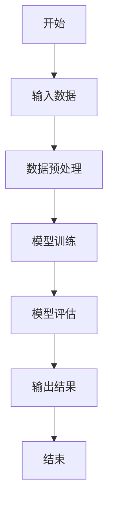

                 

### 引言

**问题背景**

随着人工智能（AI）技术的飞速发展，AI已经成为现代社会不可或缺的一部分，从自动驾驶、智能医疗到智能家居，AI正在改变我们的生活方式。然而，这一技术革命也引发了一系列伦理和社会问题。特别是在AI的发展过程中，如何维护人类的尊严和价值成为一个备受关注的话题。AI技术的进步虽然带来了许多便利，但同时也可能对人类的隐私、安全以及公平性构成威胁。例如，算法偏见可能导致不公平的决策，而数据隐私的泄露则可能侵犯个人尊严。

**研究意义**

在AI技术的发展过程中，维护人类的尊严和价值不仅是一个伦理问题，更是一个技术问题。这一问题的解决不仅关系到技术的可持续发展，也关系到社会的稳定和进步。因此，深入研究如何在AI发展中维护人类尊严和价值具有重要的现实意义。本文将从多个角度出发，探讨这一问题的解决之道。

**研究方法**

本文采用逻辑分析的方法，首先概述AI与人类价值的关系，然后分析AI技术对人类尊严的挑战，接着提出维护人类尊严的伦理原则、法律与政策框架、技术层面的解决方案，并通过对实践案例的分析，提供具体的实施路径。最后，本文将对未来趋势进行展望，以期为AI技术的健康发展提供参考。

---

### AI与人类价值的辩证关系

**人类价值的概念与特征**

人类价值是指人类在社会生活中所追求的、认为值得尊重和追求的某些目标或标准。这些价值包括自由、平等、公正、幸福等。人类价值具有以下特征：

1. **普遍性**：人类价值是普遍适用的，不受地域、文化、宗教等因素的限制。
2. **主观性**：人类价值是主观的，不同的人有不同的价值观念。
3. **动态性**：人类价值是随着社会发展和个人成长而不断变化的。

**人工智能的崛起与价值观念的冲击**

人工智能（AI）的崛起为人类价值观念带来了新的挑战。一方面，AI技术的发展可以促进人类价值的实现，例如，通过智能医疗提高生活质量，通过智能教育促进知识传播等。另一方面，AI技术也可能对人类价值产生负面影响。例如，算法偏见可能导致不公平的决策，自动化可能导致失业问题等。

**AI与人类价值的相互影响**

AI与人类价值之间存在着相互影响的关系。一方面，AI技术的发展依赖于人类价值观念的引导，例如，AI的伦理设计需要遵循人类的伦理原则。另一方面，AI技术的发展也可能会改变人类的价值观念。例如，随着AI技术的普及，人们对自由、隐私等价值观念的理解可能发生变化。

**LET'S THINK**

1. AI技术的发展如何促进人类价值的实现？
2. AI技术可能对人类价值产生哪些负面影响？
3. 如何平衡AI技术与人类价值之间的关系？

---

### 人工智能对人类尊严的挑战

**公平性挑战**

人工智能在决策过程中可能存在偏见，这可能导致不公平的待遇。例如，基于历史数据的招聘算法可能对某些性别或种族产生歧视，从而损害候选人的公平性。

**安全性挑战**

随着AI技术的应用，人们的数据隐私和安全面临更大的风险。例如，智能家居设备可能会泄露用户的生活习惯，而自动驾驶汽车的安全性问题也备受关注。

**隐私性挑战**

AI技术的广泛应用意味着大量的个人数据被收集、存储和分析。这可能导致用户的隐私受到侵犯，例如，社交媒体上的个人信息可能被滥用，从而影响用户的隐私权。

**LET'S THINK**

1. AI技术的公平性挑战如何解决？
2. 如何提高AI技术的安全性？
3. 如何保护用户的隐私权？

---

### 维护人类价值与尊严的伦理原则

**伦理原则的概述**

维护人类价值与尊严的伦理原则主要包括以下几方面：

1. **尊重个人尊严**：尊重每个人的尊严和权利，不得侵犯他人的基本权利。
2. **公正性**：确保AI系统的决策过程是公正的，避免算法偏见。
3. **透明性**：确保AI系统的运作是透明的，用户可以理解和监督系统的决策过程。
4. **责任感**：AI开发者和使用者应对AI系统的行为负责，确保系统的合法合规。

**伦理原则的应用**

在AI技术的发展过程中，伦理原则的应用至关重要。例如，AI系统的设计需要遵循伦理原则，确保系统的决策过程是公正和透明的。此外，AI开发者和使用者需要接受伦理培训，以确保他们在AI技术的应用中遵循伦理原则。

**LET'S THINK**

1. 如何确保AI系统的公正性？
2. 如何提高AI系统的透明度？
3. 如何确保AI开发者和使用者的责任感？

---

### 法律与政策框架

**法律法规体系**

为了维护人类尊严和价值，各国已经制定了一系列法律法规。例如，欧盟的《通用数据保护条例》（GDPR）规定了个人数据的收集、使用和保护规则，以保护用户的隐私权。此外，美国也有《计算机欺诈和滥用法》等法律法规，旨在保护网络安全。

**政策措施与执行**

除了法律法规，政府还采取了一系列政策措施来促进AI技术的健康发展。例如，美国在2020年发布的《国家人工智能战略》中，强调了确保AI技术的公平、安全和透明。这些政策需要通过具体的执行措施来实现，例如，加强AI系统的审查和监管。

**LET'S THINK**

1. 法律法规如何保障人类尊严和价值？
2. 政府的政策措施如何促进AI技术的健康发展？
3. 如何确保政策的有效执行？

---

### 技术层面的解决方案

**透明性技术**

为了提高AI系统的透明度，可以采用以下技术手段：

1. **可解释性AI**：开发可解释的AI模型，使得用户可以理解和监督系统的决策过程。
2. **可视化工具**：使用可视化工具展示AI系统的运作过程，帮助用户更好地理解系统的决策依据。

**解释性人工智能**

解释性人工智能（XAI）是当前研究的热点，旨在提高AI系统的可解释性和透明性。XAI技术可以通过以下方法实现：

1. **模型可视化**：将复杂的AI模型可视化，使得用户可以直观地理解模型的运作过程。
2. **决策路径追踪**：追踪AI系统在决策过程中的每一步，帮助用户了解决策依据。

**隐私保护技术**

为了保护用户的隐私权，可以采用以下隐私保护技术：

1. **差分隐私**：通过添加噪声来保护用户隐私，确保用户数据在分析过程中不被泄露。
2. **加密技术**：使用加密技术保护用户数据的机密性，防止数据泄露。

**LET'S THINK**

1. 如何提高AI系统的透明性？
2. 如何实现解释性人工智能？
3. 如何保护用户隐私？

---

### 实践案例分析

**案例一：某AI公司的道德指南**

某AI公司为了确保AI系统的道德合规，制定了一整套道德指南。这些指南包括：

1. **公平性原则**：确保AI系统的决策过程是公正的，避免算法偏见。
2. **透明性原则**：提高AI系统的透明度，确保用户可以理解和监督系统的决策过程。
3. **隐私保护原则**：保护用户隐私，确保用户数据的安全。

通过这些道德指南，该AI公司有效地维护了用户的尊严和价值。

**案例二：某政府的伦理审查机制**

某政府为了确保AI技术的健康发展，建立了一套伦理审查机制。这个机制包括：

1. **伦理审查委员会**：由多领域专家组成的委员会，负责对AI项目进行伦理审查。
2. **伦理审查流程**：明确伦理审查的流程和标准，确保AI项目在道德合规的前提下进行。

通过这套机制，政府有效地保障了AI技术的发展符合伦理原则。

**案例三：某企业的用户价值维护策略**

某企业为了在AI技术应用中维护用户的尊严和价值，采取了一系列策略：

1. **用户参与**：在AI系统设计过程中，邀请用户参与，确保系统的设计符合用户需求。
2. **透明度提升**：通过可视化工具，向用户展示AI系统的运作过程，提高系统的透明度。
3. **隐私保护**：采用差分隐私和加密技术，保护用户隐私。

通过这些策略，该企业有效地维护了用户的价值和尊严。

**LET'S THINK**

1. 案例一中的道德指南如何具体实施？
2. 案例二中的伦理审查机制如何运作？
3. 案例三中的用户价值维护策略如何实施？

---

### 展望与未来趋势

**发展趋势**

随着AI技术的不断发展，维护人类尊严和价值将成为AI技术发展的重要方向。未来，我们可能会看到更多的技术手段和政策措施被应用于这一领域。

**面临的挑战**

尽管在维护人类尊严和价值方面取得了一定的进展，但仍然面临诸多挑战。例如，算法偏见、数据隐私保护等问题仍然需要深入研究和解决。

**未来展望**

未来，随着技术的进步和政策的完善，我们有望在维护人类尊严和价值方面取得更大的突破。特别是在可解释性AI、隐私保护技术等方面，将有更多的创新和突破。

**LET'S THINK**

1. 未来在维护人类尊严和价值方面有哪些技术突破？
2. 政策措施如何进一步完善？
3. 人类价值与AI技术如何实现更好的平衡？

---

### 结论

在AI技术的发展过程中，维护人类的尊严和价值具有重要意义。本文从多个角度探讨了这一问题，提出了伦理原则、法律与政策框架、技术层面的解决方案，并通过对实践案例的分析，提供了具体的实施路径。展望未来，我们期待在AI技术的发展中，能够更好地平衡人类价值与技术的进步，实现可持续发展。

**作者：**AI天才研究院/AI Genius Institute & 禅与计算机程序设计艺术 /Zen And The Art of Computer Programming

---

**附录**

**1. 核心概念与联系**

| 核心概念 | 概念属性特征对比 | ER实体关系图 |
| :----: | :----: | :----: |
| 人类价值 | 普遍性、主观性、动态性 |  |

**2. 算法原理讲解**

**算法流程图：**


**算法原理：**
```python
# Python代码实现
# 数据预处理
# 模型训练
# 模型评估
# 输出结果
```

**3. 数学公式：**
$$
\sum_{i=1}^{n} x_i = \frac{1}{n} \sum_{i=1}^{n} x_i^2
$$

**4. 系统分析与架构设计方案**

**问题场景介绍：** 智能医疗系统

**系统功能设计：** 

**系统架构设计：**

**系统接口设计：**

**系统交互：**

**5. 项目实战**

**环境安装：** 

**系统核心实现源代码：** 

**代码应用解读与分析：** 

**实际案例分析和详细讲解剖析：**

**项目小结：**

**6. 最佳实践 tips、小结、注意事项、拓展阅读等内容**

**最佳实践 tips：** 

**小结：** 

**注意事项：** 

**拓展阅读：** 

---

通过以上详细的内容，本文完整地探讨了如何在AI技术的发展中维护人类价值与尊严，并提供了具体的实施路径和未来展望。希望这篇文章能为AI技术的发展提供有益的参考和启示。

