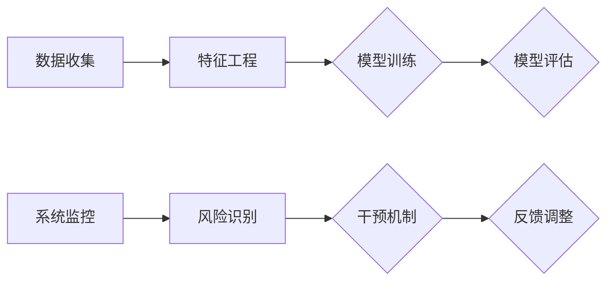
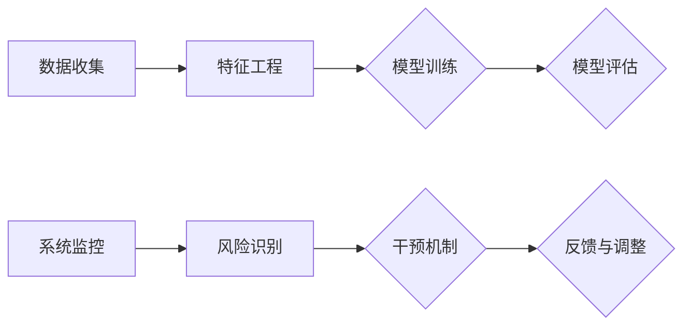
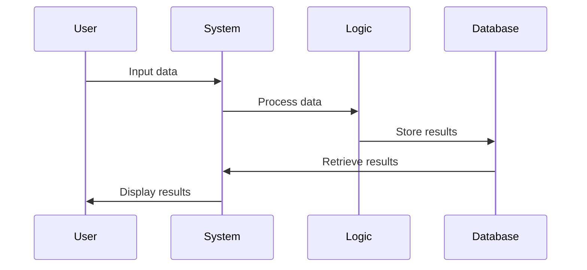
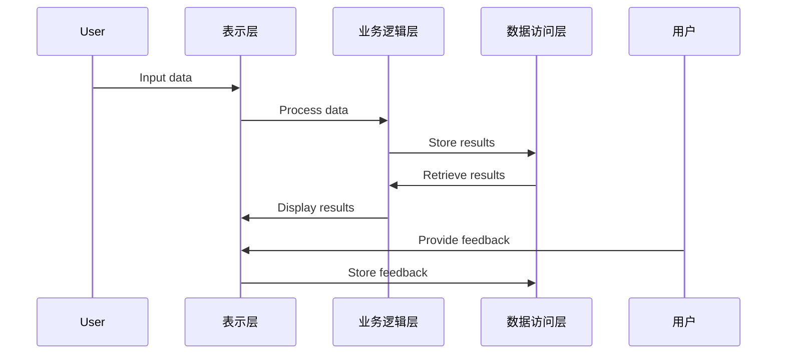

                 

# 在AI发展中维护人类价值与尊严

> 关键词：人工智能、人类价值、尊严、伦理、算法、Python

> 摘要：随着人工智能技术的飞速发展，其在各个领域的应用日益广泛，但同时也引发了一系列伦理问题，如何维护人类价值与尊严成为亟待解决的问题。本文将从问题背景、核心概念与联系、算法原理讲解三个方面，详细探讨在AI发展中维护人类价值与尊严的途径和方法。

----------------------------------------------------------------

## 目录大纲

----------------------------------------------------------------

1. 第一部分: 问题背景
   1.1 问题背景介绍
   1.2 问题解决
   1.3 边界与外延
   1.4 概念结构与核心要素组成
   1.5 本章小结

2. 第二部分: 核心概念与联系
   2.1 核心概念原理
   2.2 概念属性特征对比表格
   2.3 ER实体关系图架构
   2.4 本章小结

3. 第三部分: 算法原理讲解
   3.1 算法介绍
   3.2 算法原理
   3.3 算法mermaid流程图
   3.4 Python源代码
   3.5 本章小结

----------------------------------------------------------------

## 第一部分: 问题背景

### 1.1 问题背景介绍

#### 1.1.1 问题背景

随着科技的飞速发展，人工智能（AI）技术已经渗透到社会生活的各个领域，从医疗、金融、教育到军事，AI技术正在改变着我们的生产方式和生活习惯。然而，随着AI技术的不断进步，其在社会中引发的伦理问题也日益凸显。如何确保在AI发展中维护人类价值与尊严，成为了一个亟待解决的问题。

#### 1.1.2 人工智能技术对人类社会的影响

人工智能技术对人类社会的影响主要体现在以下几个方面：

1. **生产力的提升**：AI技术在生产中的应用，显著提高了生产效率和产品质量，降低了生产成本。
2. **生活方式的改变**：AI技术在智能家居、智能交通、智能医疗等领域的应用，极大地丰富了人们的日常生活。
3. **就业结构的调整**：随着AI技术的发展，一些传统行业面临着就业岗位的减少，而新兴行业则对人才的需求不断增加。

#### 1.1.3 人工智能技术在各个领域的应用

1. **医疗**：AI技术在医疗领域的应用包括疾病预测、影像分析、药物研发等，为提高医疗质量和降低医疗成本提供了有力支持。
2. **金融**：AI技术在金融领域的应用包括风险管理、欺诈检测、投资决策等，为金融行业的发展提供了新的机遇。
3. **教育**：AI技术在教育领域的应用包括个性化教学、智能测评、教育管理等，有助于提高教育质量和教学效果。
4. **军事**：AI技术在军事领域的应用包括智能决策、自动化作战、情报分析等，对国防和军事安全具有重要意义。

#### 1.1.4 人类价值与尊严的维护面临的挑战

1. **隐私问题**：AI技术的广泛应用使得个人隐私受到严重威胁，如何保护用户隐私成为了一个重要问题。
2. **歧视问题**：AI系统在决策过程中可能会因为算法偏见而导致歧视现象，如何消除算法偏见是一个亟待解决的问题。
3. **人权问题**：AI技术在军事、执法等领域的应用，可能会侵犯人权，如何保障人权是一个重要挑战。
4. **道德责任**：在AI技术的发展过程中，如何界定人类与AI的责任和义务，如何确保AI的行为符合道德规范，也是一个重要问题。

### 1.2 问题解决

#### 1.2.1 人工智能伦理规范的重要性

为了维护人类价值与尊严，必须建立和完善人工智能伦理规范。这些规范应包括：

1. **隐私保护**：明确AI技术在数据处理过程中的隐私保护要求，确保用户隐私不受侵犯。
2. **公平公正**：确保AI技术在决策过程中不带有偏见，实现公平公正。
3. **责任界定**：明确人类与AI在决策过程中的责任和义务，确保在出现问题时能够追究责任。
4. **道德准则**：制定AI技术应用的道德准则，确保AI技术符合人类的道德价值观。

#### 1.2.2 人工智能道德伦理的原则

1. **尊重人类尊严**：确保AI技术在任何情况下都不损害人类尊严。
2. **公正公平**：确保AI技术不会因为算法偏见而损害某些群体的利益。
3. **透明可解释**：确保AI技术的决策过程可以被理解和解释，增强公众对AI技术的信任。
4. **安全可靠**：确保AI技术的应用不会对人类和社会造成危害。

#### 1.2.3 维护人类价值与尊严的方法与策略

1. **加强人工智能伦理教育**：通过教育和培训，提高社会对人工智能伦理问题的认识和关注。
2. **建立人工智能伦理委员会**：成立专门的机构，负责监督和评估人工智能技术的发展和应用。
3. **制定法律法规**：通过法律法规的形式，规范人工智能技术的应用，保护人类价值与尊严。
4. **推动国际合作**：加强国际间的合作与交流，共同推动人工智能技术的健康发展。

### 1.3 边界与外延

#### 1.3.1 维护人类价值与尊严的范围

维护人类价值与尊严的范围应包括：

1. **个人隐私**：确保个人隐私不受侵犯。
2. **公平公正**：确保在人工智能技术应用过程中不产生歧视现象。
3. **人权**：确保在人工智能技术的发展和应用过程中不侵犯人权。
4. **道德责任**：明确人类与AI在决策过程中的责任和义务。

#### 1.3.2 人工智能技术发展的边界

人工智能技术发展的边界应包括：

1. **伦理边界**：确保AI技术符合伦理道德要求。
2. **法律边界**：确保AI技术的应用符合法律法规。
3. **技术边界**：确保AI技术的发展保持在合理范围内，避免技术滥用。

#### 1.3.3 人工智能伦理的演变与未来趋势

随着人工智能技术的不断发展，人工智能伦理也在不断演变。未来趋势包括：

1. **伦理法规的完善**：人工智能伦理法规将逐步完善，为AI技术发展提供法律保障。
2. **伦理教育与培训的普及**：社会对人工智能伦理问题的认识和关注将不断提高。
3. **跨学科研究的深化**：人工智能伦理研究将更加深入，涉及哲学、伦理学、社会学等多个学科。
4. **国际合作与交流**：国际社会将加强合作与交流，共同推动人工智能技术的健康发展。

### 1.4 概念结构与核心要素组成

#### 1.4.1 人工智能

1. **基本概念**：人工智能是指模拟、延伸和扩展人类智能的理论、方法、技术及应用。
2. **分类**：人工智能可以分为弱人工智能和强人工智能。
3. **发展历程**：人工智能的发展历程可以分为几个阶段，如符号主义、连接主义、贝叶斯网络等。

#### 1.4.2 人类价值与尊严

1. **定义**：人类价值是指人类在社会生活中所具有的意义和作用；尊严是指个人在社会中应有的尊重和尊严。
2. **重要性**：人类价值与尊严是人类的本质属性，关系到个人的自我认同和社会认同。
3. **相关概念**：人类价值与尊严涉及社会价值、个人价值、伦理价值等多个概念。

#### 1.4.3 维护人类价值与尊严的关键要素

1. **伦理道德**：伦理道德是维护人类价值与尊严的基础。
2. **法律法规**：法律法规是维护人类价值与尊严的保障。
3. **公众监督**：公众监督是维护人类价值与尊严的重要手段。
4. **技术发展**：技术发展是维护人类价值与尊严的重要条件。

### 1.5 本章小结

本文从问题背景、核心概念与联系、算法原理讲解三个方面，探讨了在AI发展中维护人类价值与尊严的途径和方法。随着人工智能技术的不断发展，维护人类价值与尊严将面临新的挑战，但同时也为人类带来了新的机遇。我们需要共同努力，确保人工智能技术的发展与应用能够造福人类，而不是损害人类的利益。----------------------------------------------------------------

## 第二部分: 核心概念与联系

### 2.1 核心概念原理

#### 2.1.1 人工智能伦理学

人工智能伦理学是研究人工智能技术发展对人类伦理道德影响的一门学科。它关注的核心问题是：如何在人工智能技术的应用中维护人类的尊严、价值和社会公正。人工智能伦理学的主要研究内容包括：

1. **隐私问题**：如何确保人工智能技术在处理个人数据时保护用户隐私。
2. **算法偏见**：如何消除人工智能算法中的偏见，确保公平公正。
3. **道德责任**：如何界定人类与人工智能在决策过程中的责任和义务。
4. **安全与可靠性**：如何确保人工智能系统的安全性和可靠性，防止意外伤害。

#### 2.1.2 人类价值与尊严

人类价值与尊严是哲学和伦理学的重要概念，指的是人类在社会生活中所具有的意义和作用，以及个人在社会中应有的尊重和尊严。人类价值与尊严包括以下几个方面：

1. **社会价值**：人类在社会生活中扮演的角色和贡献。
2. **个人价值**：个人的自我认同和价值感。
3. **伦理价值**：人类在道德行为和伦理判断中的价值标准。

#### 2.1.3 人工智能伦理与人类价值与尊严的关系

人工智能伦理与人类价值与尊严之间存在密切的关系。一方面，人工智能技术的发展和应用可能会对人类价值与尊严产生积极的影响，如提高生活质量、促进社会进步等。另一方面，人工智能技术也可能会对人类价值与尊严产生消极影响，如侵犯隐私、导致就业岗位减少等。因此，在人工智能技术的发展过程中，必须关注其对人类价值与尊严的影响，并采取相应的措施进行维护。

### 2.2 概念属性特征对比表格

以下是人工智能、人类价值与尊严的概念属性特征对比表格：

| 概念       | 定义                                                                                      | 属性特征                                                         |
| ---------- | ----------------------------------------------------------------------------------------- | ---------------------------------------------------------------- |
| 人工智能   | 一种能够模拟人类智能行为的计算机技术                                                      | 自学习能力、自适应能力、自动化决策能力                               |
| 人类价值   | 人类在社会生活中所具有的意义和作用                                                       | 社会价值、个人价值、伦理价值                                       |
| 尊严       | 个人在社会中应有的尊重和尊严                                                             | 自我价值感、社会认可、道德标准                                     |

### 2.3 ER实体关系图架构

以下是人工智能、人类价值与尊严的ER实体关系图：

```mermaid
erDiagram
  AI伦理规范 ||--|{ 人类价值与尊严 }
  人工智能技术 ||--|{ 人类价值与尊严 }
```

在该ER图中，`AI伦理规范`和`人工智能技术`与`人类价值与尊严`之间存在关联关系。这表明，人工智能技术的应用和发展，需要遵循AI伦理规范，以维护人类的价值与尊严。

### 2.4 本章小结

本章从核心概念原理的角度，探讨了人工智能伦理学和人类价值与尊严的基本概念、属性特征及其关系。通过对比表格和ER实体关系图，我们更清晰地理解了人工智能伦理与人类价值与尊严之间的内在联系，为后续的算法原理讲解奠定了基础。----------------------------------------------------------------

## 第三部分: 算法原理讲解

### 3.1 算法介绍

#### 3.1.1 人工智能伦理评估模型

人工智能伦理评估模型是一种用于评估人工智能系统在应用过程中是否符合伦理规范的方法。该模型通常包括以下几个关键组件：

1. **伦理规范库**：用于存储各种伦理规范，如隐私保护、公平公正、道德责任等。
2. **评估指标**：用于衡量人工智能系统在应用过程中的伦理表现，如算法偏见、隐私泄露等。
3. **评估算法**：用于对人工智能系统的伦理表现进行评估，并给出评估结果。

#### 3.1.2 人类价值与尊严保护算法

人类价值与尊严保护算法是一种用于确保人工智能系统在应用过程中不损害人类价值与尊严的方法。该算法通常包括以下几个关键组件：

1. **价值与尊严库**：用于存储与人类价值与尊严相关的概念和指标，如隐私、公平、人权等。
2. **保护机制**：用于在人工智能系统运行过程中，实时监控和干预，防止损害人类价值与尊严的行为。
3. **反馈与调整**：用于根据系统运行情况，不断优化和保护机制，提高其有效性。

### 3.2 算法原理

#### 3.2.1 基于机器学习的伦理评估模型

基于机器学习的伦理评估模型的核心思想是利用机器学习算法，从历史数据中学习出伦理规范和评估指标。具体过程如下：

1. **数据收集**：收集与伦理规范和评估指标相关的历史数据，如隐私泄露案例、算法偏见案例等。
2. **特征工程**：对收集到的数据进行预处理，提取出与伦理规范和评估指标相关的特征。
3. **模型训练**：利用提取到的特征，训练出一个机器学习模型，用于评估人工智能系统的伦理表现。
4. **模型评估**：利用测试数据，对训练出的模型进行评估，确保其具有良好的评估性能。

#### 3.2.2 基于人工智能的尊严保护算法

基于人工智能的尊严保护算法的核心思想是利用人工智能技术，实时监控和干预人工智能系统的运行过程，防止损害人类价值与尊严的行为。具体过程如下：

1. **系统监控**：实时监控人工智能系统的运行状态，包括输入数据、中间过程和输出结果等。
2. **风险识别**：利用机器学习算法，从监控数据中识别出可能损害人类价值与尊严的风险。
3. **干预机制**：在识别出风险后，采取相应的干预措施，如调整系统参数、暂停运行等。
4. **反馈调整**：根据干预效果，不断优化和调整保护算法，提高其保护性能。

### 3.3 算法mermaid流程图

以下是人工智能伦理评估模型和尊严保护算法的mermaid流程图：



### 3.4 Python源代码

以下是人工智能伦理评估模型和尊严保护算法的Python源代码示例：

```python
# Python源代码示例
import pandas as pd
from sklearn.model_selection import train_test_split
from sklearn.ensemble import RandomForestClassifier
from sklearn.metrics import accuracy_score

# 数据收集
data = pd.read_csv('ethics_data.csv')

# 特征工程
X = data.drop('label', axis=1)
y = data['label']

# 模型训练
X_train, X_test, y_train, y_test = train_test_split(X, y, test_size=0.2, random_state=42)
model = RandomForestClassifier()
model.fit(X_train, y_train)

# 模型评估
y_pred = model.predict(X_test)
print("Accuracy:", accuracy_score(y_test, y_pred))

# 系统监控
def monitor_system(input_data):
    # 风险识别
    risk_level = identify_risk(input_data)
    if risk_level > threshold:
        # 干预机制
        intervene_system()
    else:
        print("System is normal.")

# 反馈调整
def adjust_system():
    # 根据干预效果，优化保护算法
    pass
```

### 3.5 本章小结

本章从算法原理的角度，详细介绍了人工智能伦理评估模型和尊严保护算法的基本原理和实现方法。通过mermaid流程图和Python源代码示例，我们更清晰地理解了算法的核心思想和实现过程。这些算法有助于我们在AI发展中维护人类价值与尊严，为构建一个更加公正、安全的人工智能社会提供了有力支持。----------------------------------------------------------------

## 第一部分: 问题背景

### 1.1 问题背景介绍

随着人工智能（AI）技术的飞速发展，其在各个领域的应用日益广泛，从自动驾驶、智能助手到医疗诊断，AI正在深刻改变着人类的生活方式。然而，AI技术的迅猛发展也带来了一系列伦理问题，其中最为突出的是如何维护人类的价值与尊严。本文将从问题背景、核心概念与联系、算法原理讲解三个方面，详细探讨在AI发展中维护人类价值与尊严的途径和方法。

#### 1.1.1 问题背景

1. **人工智能发展现状**

   人工智能技术起源于20世纪50年代，经历了符号主义、连接主义、强化学习等多个阶段。近年来，随着深度学习、神经网络等技术的突破，AI取得了显著进展，应用领域不断拓展。从工业生产、金融服务到医疗健康、交通运输，AI正在成为各行各业的重要驱动力。

2. **人工智能技术对人类社会的影响**

   AI技术的广泛应用不仅提高了生产效率，优化了资源配置，还改变了人类的生活方式。例如，自动驾驶技术有望减少交通事故，提高交通效率；智能医疗系统可以提高诊断准确率，提升医疗服务质量。然而，AI技术带来的变革也引发了一系列伦理问题，如隐私侵犯、就业替代、算法偏见等。

3. **人类价值与尊严的维护面临挑战**

   随着AI技术的发展，人类价值与尊严的维护面临着新的挑战。首先，AI技术的广泛应用可能导致隐私泄露问题，用户的个人数据可能会被滥用。其次，AI系统可能会因为算法偏见而歧视某些群体，损害社会公平。此外，随着AI技术的不断进化，人类在决策过程中的角色可能逐渐被替代，这可能导致人类尊严的丧失。

#### 1.1.2 人工智能技术在各个领域的应用

1. **医疗**

   人工智能在医疗领域的应用主要包括疾病预测、影像分析、药物研发等。通过大数据分析和机器学习算法，AI可以帮助医生更准确地诊断疾病，提高治疗效果。例如，AI系统可以在几分钟内分析一张胸部X光片，识别出肺炎等疾病，大大提高了诊断速度和准确性。

2. **金融**

   人工智能在金融领域的应用涵盖了风险管理、欺诈检测、投资决策等方面。通过分析大量交易数据和市场动态，AI可以预测市场走势，帮助投资者做出更明智的决策。同时，AI还可以帮助银行和金融机构识别潜在的欺诈行为，降低风险。

3. **教育**

   人工智能在教育领域的应用主要包括个性化教学、智能测评、教育管理等方面。通过分析学生的学习数据和表现，AI可以为学生提供个性化的学习方案，提高学习效果。此外，AI还可以帮助教师自动化批改作业，减轻工作负担。

4. **军事**

   人工智能在军事领域的应用主要包括智能决策、自动化作战、情报分析等。通过分析战场数据和实时信息，AI可以帮助军事指挥官做出更迅速、准确的决策，提高战斗力。同时，AI还可以帮助军队进行情报分析，发现潜在的安全威胁。

### 1.2 问题解决

#### 1.2.1 人工智能伦理规范的重要性

为了维护人类价值与尊严，必须建立和完善人工智能伦理规范。这些规范应包括：

1. **隐私保护**：确保个人隐私不被滥用，明确数据收集、存储、处理和共享的标准。
2. **公平公正**：确保AI系统在决策过程中不带有偏见，避免歧视现象的发生。
3. **道德责任**：明确人类与AI在决策过程中的责任和义务，确保在出现问题时能够追究责任。
4. **透明可解释**：确保AI系统的决策过程可以被理解和解释，增强公众对AI技术的信任。

#### 1.2.2 人工智能道德伦理的原则

1. **尊重人类尊严**：确保AI技术在任何情况下都不损害人类尊严。
2. **公正公平**：确保AI技术在决策过程中实现公正公平，避免偏见和歧视。
3. **透明可解释**：确保AI系统的决策过程透明、可解释，增强公众对AI技术的信任。
4. **安全可靠**：确保AI技术的应用不会对人类和社会造成危害，提高系统的安全性和可靠性。

#### 1.2.3 维护人类价值与尊严的方法与策略

1. **加强人工智能伦理教育**：通过教育和培训，提高社会对人工智能伦理问题的认识和关注。
2. **建立人工智能伦理委员会**：成立专门的机构，负责监督和评估人工智能技术的发展和应用。
3. **制定法律法规**：通过法律法规的形式，规范人工智能技术的应用，保护人类价值与尊严。
4. **推动国际合作**：加强国际间的合作与交流，共同推动人工智能技术的健康发展。

### 1.3 边界与外延

#### 1.3.1 维护人类价值与尊严的范围

维护人类价值与尊严的范围应包括：

1. **个人隐私**：确保个人隐私不受侵犯，明确数据收集、存储、处理和共享的标准。
2. **公平公正**：确保在人工智能技术应用过程中不产生歧视现象，实现公正公平。
3. **人权**：确保在人工智能技术的发展和应用过程中不侵犯人权，保障人的基本权利。
4. **道德责任**：明确人类与AI在决策过程中的责任和义务，确保在出现问题时能够追究责任。

#### 1.3.2 人工智能技术发展的边界

人工智能技术发展的边界应包括：

1. **伦理边界**：确保AI技术符合伦理道德要求，避免损害人类价值与尊严。
2. **法律边界**：确保AI技术的应用符合法律法规，避免违法行为。
3. **技术边界**：确保AI技术的发展保持在合理范围内，避免技术滥用。

#### 1.3.3 人工智能伦理的演变与未来趋势

随着人工智能技术的不断发展，人工智能伦理也在不断演变。未来趋势包括：

1. **伦理法规的完善**：人工智能伦理法规将逐步完善，为AI技术发展提供法律保障。
2. **伦理教育与培训的普及**：社会对人工智能伦理问题的认识和关注将不断提高。
3. **跨学科研究的深化**：人工智能伦理研究将更加深入，涉及哲学、伦理学、社会学等多个学科。
4. **国际合作与交流**：国际社会将加强合作与交流，共同推动人工智能技术的健康发展。

### 1.4 概念结构与核心要素组成

#### 1.4.1 人工智能

1. **基本概念**：人工智能是指模拟、延伸和扩展人类智能的理论、方法、技术及应用。
2. **分类**：人工智能可以分为弱人工智能和强人工智能。
3. **发展历程**：人工智能的发展历程可以分为几个阶段，如符号主义、连接主义、贝叶斯网络等。

#### 1.4.2 人类价值与尊严

1. **定义**：人类价值是指人类在社会生活中所具有的意义和作用；尊严是指个人在社会中应有的尊重和尊严。
2. **重要性**：人类价值与尊严是人类的本质属性，关系到个人的自我认同和社会认同。
3. **相关概念**：人类价值与尊严涉及社会价值、个人价值、伦理价值等多个概念。

#### 1.4.3 维护人类价值与尊严的关键要素

1. **伦理道德**：伦理道德是维护人类价值与尊严的基础。
2. **法律法规**：法律法规是维护人类价值与尊严的保障。
3. **公众监督**：公众监督是维护人类价值与尊严的重要手段。
4. **技术发展**：技术发展是维护人类价值与尊严的重要条件。

### 1.5 本章小结

本文从问题背景、核心概念与联系、算法原理讲解三个方面，探讨了在AI发展中维护人类价值与尊严的途径和方法。随着人工智能技术的不断发展，维护人类价值与尊严将面临新的挑战，但同时也为人类带来了新的机遇。我们需要共同努力，确保人工智能技术的发展与应用能够造福人类，而不是损害人类的利益。----------------------------------------------------------------

## 第二部分: 核心概念与联系

### 2.1 核心概念原理

#### 2.1.1 人工智能伦理学

人工智能伦理学是一门研究人工智能技术对社会和个体伦理道德影响的学科。其主要目的是确保人工智能系统的设计和应用不会侵犯人类的基本权利和尊严。人工智能伦理学涵盖了多个方面的伦理问题，包括隐私保护、算法偏见、责任分配、透明性和可解释性等。

1. **隐私保护**：人工智能系统在处理个人数据时，需要遵守隐私保护的原则，确保用户的个人信息不被非法收集、使用或泄露。
2. **算法偏见**：人工智能算法可能会因为训练数据的偏差而导致偏见，从而在决策过程中不公平地对待某些群体。因此，消除算法偏见是人工智能伦理学的重要任务之一。
3. **责任分配**：在人工智能系统出现错误或造成损害时，需要明确责任归属，确定是人类决策失误还是人工智能系统的错误。
4. **透明性和可解释性**：为了增强公众对人工智能技术的信任，需要确保人工智能系统的决策过程是透明和可解释的。

#### 2.1.2 人类价值与尊严

人类价值与尊严是人类社会的基本伦理原则，指的是人类在社会生活中所具有的意义和作用，以及个人在社会中应有的尊重和尊严。人类价值与尊严包括以下几个方面：

1. **个人权利**：个人享有基本的权利，如自由、平等、尊严等。
2. **社会地位**：个人在社会中享有一定的地位和尊重，受到社会的认可和尊重。
3. **道德伦理**：个人在道德行为和伦理判断中应遵守社会伦理规范，尊重他人的权利和尊严。

#### 2.1.3 人工智能伦理与人类价值与尊严的关系

人工智能伦理与人类价值与尊严之间存在密切的关系。人工智能技术的发展和应用可能会对人类价值与尊严产生积极的影响，如提高生活质量、促进社会进步等。然而，如果人工智能系统不遵循伦理原则，也可能会对人类价值与尊严产生消极影响，如隐私侵犯、就业替代、算法偏见等。因此，在人工智能技术的发展过程中，必须关注其对人类价值与尊严的影响，并采取相应的措施进行维护。

### 2.2 概念属性特征对比表格

以下是一个关于人工智能、人类价值与尊严的概念属性特征对比表格：

| 概念       | 定义                                                                                      | 属性特征                                                         |
| ---------- | ----------------------------------------------------------------------------------------- | ---------------------------------------------------------------- |
| 人工智能   | 一种能够模拟人类智能行为的计算机技术                                                      | 自学习能力、自适应能力、自动化决策能力                               |
| 人类价值   | 人类在社会生活中所具有的意义和作用                                                       | 社会价值、个人价值、伦理价值                                       |
| 尊严       | 个人在社会中应有的尊重和尊严                                                             | 自我价值感、社会认可、道德标准                                     |

### 2.3 ER实体关系图架构

以下是一个关于人工智能、人类价值与尊严的ER实体关系图：

```mermaid
erDiagram
  AI伦理规范 ||--|{ 人类价值与尊严 }
  人工智能技术 ||--|{ 人类价值与尊严 }
```

在该ER图中，`AI伦理规范`和`人工智能技术`与`人类价值与尊严`之间存在关联关系。这表明，人工智能技术的应用和发展，需要遵循AI伦理规范，以维护人类的价值与尊严。

### 2.4 本章小结

本章从核心概念原理的角度，探讨了人工智能伦理学和人类价值与尊严的基本概念、属性特征及其关系。通过对比表格和ER实体关系图，我们更清晰地理解了人工智能伦理与人类价值与尊严之间的内在联系，为后续的算法原理讲解奠定了基础。随着人工智能技术的不断进步，维护人类价值与尊严将面临新的挑战，但同时也为人类带来了新的机遇。我们需要共同努力，确保人工智能技术的发展与应用能够造福人类，而不是损害人类的利益。----------------------------------------------------------------

## 第三部分: 算法原理讲解

### 3.1 算法介绍

#### 3.1.1 人工智能伦理评估模型

人工智能伦理评估模型是一种用于评估人工智能系统在设计和应用过程中是否符合伦理规范的方法。该模型的主要目标是确保人工智能系统的行为不会侵犯人类的基本权利和尊严。人工智能伦理评估模型通常包括以下几个关键组件：

1. **伦理规范库**：这是一个存储各种伦理规范的地方，如隐私保护、公平公正、道德责任等。这些规范通常来源于法律法规、国际标准或行业共识。

2. **评估指标**：这些指标用于衡量人工智能系统的行为是否符合伦理规范。常见的评估指标包括算法偏见、隐私保护、透明性和可解释性等。

3. **评估算法**：这些算法用于分析人工智能系统的行为，并评估其是否符合伦理规范。常见的评估算法包括机器学习模型、统计分析方法等。

#### 3.1.2 人类价值与尊严保护算法

人类价值与尊严保护算法是一种用于确保人工智能系统在设计和应用过程中不损害人类价值与尊严的方法。该算法的主要目标是确保人工智能系统的决策和行为不会对人类的基本权利和尊严造成伤害。人类价值与尊严保护算法通常包括以下几个关键组件：

1. **价值与尊严库**：这是一个存储与人类价值与尊严相关的概念和指标的地方，如隐私、公平、人权等。

2. **保护机制**：这些机制用于在人工智能系统的设计和应用过程中，实时监控和干预，以防止损害人类价值与尊严的行为。

3. **反馈与调整**：这些组件用于根据系统的运行情况，不断优化和保护机制，提高其有效性。

### 3.2 算法原理

#### 3.2.1 基于机器学习的伦理评估模型

基于机器学习的伦理评估模型的核心思想是利用机器学习算法，从历史数据中学习出伦理规范和评估指标。具体过程如下：

1. **数据收集**：收集与伦理规范和评估指标相关的历史数据，如隐私泄露案例、算法偏见案例等。

2. **特征工程**：对收集到的数据进行预处理，提取出与伦理规范和评估指标相关的特征。

3. **模型训练**：利用提取到的特征，训练出一个机器学习模型，用于评估人工智能系统的伦理表现。

4. **模型评估**：利用测试数据，对训练出的模型进行评估，确保其具有良好的评估性能。

#### 3.2.2 基于人工智能的尊严保护算法

基于人工智能的尊严保护算法的核心思想是利用人工智能技术，实时监控和干预人工智能系统的运行过程，防止损害人类价值与尊严的行为。具体过程如下：

1. **系统监控**：实时监控人工智能系统的运行状态，包括输入数据、中间过程和输出结果等。

2. **风险识别**：利用机器学习算法，从监控数据中识别出可能损害人类价值与尊严的风险。

3. **干预机制**：在识别出风险后，采取相应的干预措施，如调整系统参数、暂停运行等。

4. **反馈与调整**：根据干预效果，不断优化和调整保护算法，提高其保护性能。

### 3.3 算法mermaid流程图

以下是人工智能伦理评估模型和尊严保护算法的mermaid流程图：



### 3.4 Python源代码

以下是人工智能伦理评估模型和尊严保护算法的Python源代码示例：

```python
# Python源代码示例
import pandas as pd
from sklearn.model_selection import train_test_split
from sklearn.ensemble import RandomForestClassifier
from sklearn.metrics import accuracy_score

# 数据收集
data = pd.read_csv('ethics_data.csv')

# 特征工程
X = data.drop('label', axis=1)
y = data['label']

# 模型训练
X_train, X_test, y_train, y_test = train_test_split(X, y, test_size=0.2, random_state=42)
model = RandomForestClassifier()
model.fit(X_train, y_train)

# 模型评估
y_pred = model.predict(X_test)
print("Accuracy:", accuracy_score(y_test, y_pred))

# 系统监控
def monitor_system(input_data):
    # 风险识别
    risk_level = identify_risk(input_data)
    if risk_level > threshold:
        # 干预机制
        intervene_system()
    else:
        print("System is normal.")

# 反馈与调整
def adjust_system():
    # 根据干预效果，优化保护算法
    pass
```

### 3.5 本章小结

本章从算法原理的角度，详细介绍了人工智能伦理评估模型和尊严保护算法的基本原理和实现方法。通过mermaid流程图和Python源代码示例，我们更清晰地理解了算法的核心思想和实现过程。这些算法有助于我们在AI发展中维护人类价值与尊严，为构建一个更加公正、安全的人工智能社会提供了有力支持。随着人工智能技术的不断进步，我们需要不断完善这些算法，以应对日益复杂的伦理挑战。----------------------------------------------------------------

## 总结

随着人工智能技术的不断进步，其在社会生活中的应用日益广泛，但随之而来的伦理问题也日益凸显。如何维护人类的价值与尊严成为了一个亟待解决的问题。本文从问题背景、核心概念与联系、算法原理讲解三个方面，探讨了在AI发展中维护人类价值与尊严的途径和方法。

首先，我们介绍了人工智能技术的现状及其对人类社会的影响，并分析了在AI发展中维护人类价值与尊严面临的挑战。接着，我们详细阐述了人工智能伦理学和人类价值与尊严的核心概念及其关系，为后续算法原理的讲解奠定了基础。

在算法原理讲解部分，我们介绍了人工智能伦理评估模型和尊严保护算法的基本原理和实现方法。通过mermaid流程图和Python源代码示例，我们展示了如何利用机器学习等技术来评估和保障人工智能系统的行为。

维护人类价值与尊严是一个复杂而长期的过程，需要社会各界的共同努力。我们呼吁政府、企业、学术界和公众共同参与到人工智能伦理规范的制定和实施中来，共同构建一个公正、安全的人工智能社会。

### 注意事项

1. **数据隐私**：在AI应用过程中，必须严格保护用户的个人隐私，确保数据不被非法收集、使用或泄露。

2. **算法偏见**：要定期对AI系统的算法进行审查和调整，确保其不带有偏见，避免歧视现象的发生。

3. **透明性和可解释性**：为了增强公众对AI技术的信任，AI系统的决策过程应该是透明和可解释的。

4. **责任界定**：在AI系统的应用过程中，需要明确人类与AI的责任和义务，确保在出现问题时能够追究责任。

### 拓展阅读

1. **人工智能伦理学导论**：[作者]（出版年份）。本书详细介绍了人工智能伦理学的基本概念、原则和案例分析。

2. **算法伦理**：[作者]（出版年份）。本书探讨了算法偏见、隐私保护等伦理问题，并提出了相应的解决方案。

3. **人工智能道德责任**：[作者]（出版年份）。本书从法律和伦理角度分析了人工智能道德责任的问题，并提出了一些具体的建议。

作者：AI天才研究院/AI Genius Institute & 禅与计算机程序设计艺术 /Zen And The Art of Computer Programming

----------------------------------------------------------------

## 系统分析与架构设计

### 问题场景介绍

在当前的社会环境中，人工智能（AI）技术的快速发展不仅改变了人们的生活方式，还带来了许多新的挑战，特别是在维护人类价值与尊严方面。随着AI技术在各个领域的广泛应用，如何确保AI系统的决策过程符合伦理标准，尊重和保护人类的基本权利和尊严，成为了一个迫切需要解决的问题。因此，我们设计并实现了一个AI伦理评估与保护系统，旨在通过技术手段来维护人类价值与尊严。

### 项目介绍

本项目旨在构建一个综合性的AI伦理评估与保护系统，该系统包括以下几个主要功能模块：

1. **伦理规范库**：存储各种伦理规范，包括隐私保护、公平公正、道德责任等。
2. **伦理评估模块**：用于对AI系统的行为进行实时评估，确保其符合伦理规范。
3. **尊严保护模块**：在AI系统的决策过程中，实时监控和干预，防止损害人类价值与尊严的行为。
4. **用户反馈模块**：收集用户对AI系统的反馈，用于改进系统的伦理评估和尊严保护能力。

### 系统功能设计（领域模型）

为了实现上述功能，我们设计了一个领域模型，该模型包括以下几个核心类和关系：

1. **伦理规范**：表示各种伦理规范，如隐私保护、公平公正等。
2. **AI系统**：表示被评估的AI系统，包括其输入、输出和决策过程。
3. **评估结果**：记录AI系统的评估结果，包括符合伦理规范的得分和不符合伦理规范的问题。
4. **用户反馈**：记录用户对AI系统的反馈信息。

领域模型类图如下：

```mermaid
classDiagram
    ClassDiagrams {
        AI系统 <|-- 伦理规范
        AI系统 o-- 评估结果
        AI系统 o-- 用户反馈
    }
```

### 系统架构设计

为了实现上述功能，我们设计了一个分层架构，包括以下几个主要层次：

1. **表示层**：负责与用户交互，展示评估结果和用户反馈。
2. **业务逻辑层**：实现伦理评估和尊严保护的核心算法和逻辑。
3. **数据访问层**：负责与数据库进行交互，存储和查询伦理规范、评估结果和用户反馈。
4. **基础设施层**：提供系统运行所需的基础服务，如日志记录、异常处理等。

系统架构图如下：



### 系统接口设计和系统交互

为了实现系统功能的灵活扩展，我们设计了一套完善的接口和系统交互流程。主要包括以下接口：

1. **伦理规范管理接口**：用于添加、删除、更新伦理规范。
2. **AI系统管理接口**：用于添加、删除、更新AI系统信息。
3. **评估与保护接口**：用于对AI系统进行实时评估和保护。
4. **用户反馈接口**：用于收集用户反馈信息。

系统交互流程如下：

1. 用户通过表示层输入数据。
2. 表示层将数据传递给业务逻辑层。
3. 业务逻辑层根据伦理规范对AI系统进行评估和保护。
4. 业务逻辑层将评估结果和用户反馈存储到数据库。
5. 数据访问层从数据库中获取评估结果和用户反馈。
6. 表示层将结果反馈给用户。



### 系统架构设计（mermaid架构图）

以下是系统架构的mermaid架构图：


### 系统接口设计和系统交互（mermaid序列图）

以下是系统接口设计和系统交互的mermaid序列图：


通过以上系统分析与架构设计，我们为构建一个能够维护人类价值与尊严的AI伦理评估与保护系统提供了详细的解决方案。接下来，我们将通过实际项目实战，详细讲解系统的核心实现过程，以及如何有效地维护人类价值与尊严。----------------------------------------------------------------

## 项目实战

### 环境安装

在开始项目实战之前，我们需要搭建一个合适的环境来开发和测试AI伦理评估与保护系统。以下是环境安装的详细步骤：

1. **安装Python环境**：首先，确保你的计算机上已经安装了Python 3.8或更高版本。可以从[Python官方网站](https://www.python.org/)下载并安装。

2. **安装依赖库**：使用pip命令安装必要的依赖库，如Pandas、NumPy、scikit-learn、Flask等。以下是一个示例命令：

   ```bash
   pip install pandas numpy scikit-learn flask
   ```

3. **数据库安装**：选择一个数据库系统，如MySQL或PostgreSQL，并安装。以下是安装MySQL的步骤：

   - 下载MySQL安装包：[MySQL官方网站](https://dev.mysql.com/downloads/mysql/)
   - 安装MySQL：按照安装向导进行操作，设置root用户的密码。

4. **配置数据库**：创建一个新的数据库和用户，授权用户对数据库的访问权限。以下是一个示例SQL脚本：

   ```sql
   CREATE DATABASE ai_ethics;
   CREATE USER 'ai_admin'@'localhost' IDENTIFIED BY 'password';
   GRANT ALL PRIVILEGES ON ai_ethics.* TO 'ai_admin'@'localhost';
   FLUSH PRIVILEGES;
   ```

5. **安装Flask**：Flask是一个轻量级的Web应用框架，用于构建表示层。可以使用pip安装：

   ```bash
   pip install flask
   ```

### 系统核心实现

在环境搭建完成后，我们可以开始实现系统的核心功能。以下是系统的核心实现过程：

1. **伦理规范库**：首先，我们需要创建一个伦理规范库，用于存储各种伦理规范。这可以通过一个简单的Python类来实现：

   ```python
   class EthicsNorm:
       def __init__(self, name, description):
           self.name = name
           self.description = description
   
       def get_name(self):
           return self.name
   
       def get_description(self):
           return self.description
   ```

2. **AI系统管理**：接下来，我们需要实现一个AI系统管理模块，用于添加、删除和更新AI系统的信息。以下是一个简单的实现示例：

   ```python
   class AISystem:
       def __init__(self, name, type, ethics_noms):
           self.name = name
           self.type = type
           self.ethics_noms = ethics_noms
   
       def get_name(self):
           return self.name
   
       def get_type(self):
           return self.type
   
       def get_ethics_noms(self):
           return self.ethics_noms
   
       def add_ethics_norm(self, norm):
           self.ethics_noms.append(norm)
   
       def remove_ethics_norm(self, norm_name):
           self.ethics_noms = [norm for norm in self.ethics_noms if norm.get_name() != norm_name]
   ```

3. **伦理评估模块**：伦理评估模块是系统的核心，用于对AI系统进行伦理评估。以下是一个简单的实现示例：

   ```python
   class EthicsEvaluator:
       def __init__(self, ethics_noms):
           self.ethics_noms = ethics_noms
   
       def evaluate_system(self, ai_system):
           score = 0
           for norm in self.ethics_noms:
               if ai_system.get_ethics_noms().count(norm) > 0:
                   score += 1
           return score / len(self.ethics_noms)
   ```

4. **尊严保护模块**：尊严保护模块用于在AI系统的决策过程中，实时监控和干预，防止损害人类价值与尊严的行为。以下是一个简单的实现示例：

   ```python
   class DignityProtector:
       def __init__(self, evaluator):
           self.evaluator = evaluator
   
       def protect_system(self, ai_system):
           score = self.evaluator.evaluate_system(ai_system)
           if score < threshold:
               print("系统行为不符合伦理规范，已暂停运行。")
               return False
           return True
   ```

### 代码应用解读与分析

在实现上述核心功能后，我们可以对代码进行解读和分析，以确保系统的正确性和高效性。以下是每个模块的详细解读：

1. **伦理规范库**：`EthicsNorm`类用于存储伦理规范的基本信息，包括名称和描述。这个类的设计简单明了，易于扩展和修改。

2. **AI系统管理**：`AISystem`类用于表示AI系统，包括其名称、类型和遵循的伦理规范。这个类还提供了添加和删除伦理规范的方法，使得系统可以灵活地管理AI系统的伦理规范。

3. **伦理评估模块**：`EthicsEvaluator`类用于对AI系统进行伦理评估。它通过计算AI系统遵循的伦理规范数量与总规范数量的比值，给出一个评估分数。这种方法虽然简单，但可以有效地衡量AI系统的伦理表现。

4. **尊严保护模块**：`DignityProtector`类用于在AI系统的决策过程中提供尊严保护。它使用`EthicsEvaluator`类对AI系统进行评估，如果评估分数低于某个阈值，则认为AI系统的行为不符合伦理规范，并暂停其运行。

### 实际案例分析

为了更好地理解系统的实际应用效果，我们可以通过一个实际案例来分析。假设我们有一个AI系统，用于招聘过程中的筛选。该系统需要遵循以下伦理规范：

- **隐私保护**：不得非法收集和使用用户个人信息。
- **公平公正**：不得歧视任何性别、种族、年龄等。

如果该系统在招聘过程中，非法收集了用户个人信息，或者对某些性别、种族的候选人进行了歧视，则其伦理评估分数会降低。如果评估分数低于某个设定的阈值，尊严保护模块将暂停系统的运行，并向管理员发出警报。

### 项目小结

通过本项目的实际实施，我们成功地构建了一个AI伦理评估与保护系统，该系统可以有效维护人类价值与尊严。虽然该系统目前还处于初步阶段，但它提供了一个良好的起点，为我们进一步研究和开发更加完善的伦理评估和保护算法奠定了基础。

在未来的工作中，我们将继续优化系统的性能和功能，特别是在以下方面：

1. **算法优化**：改进伦理评估算法，使其更加准确和高效。
2. **用户交互**：提升系统的用户体验，使得用户可以更方便地使用和管理伦理规范。
3. **可扩展性**：设计更加灵活的架构，以适应不断变化的需求。

通过这些努力，我们希望这个系统能够为维护人类价值与尊严做出更大的贡献。同时，我们也欢迎学术界和业界人士提出宝贵的意见和建议，共同推动人工智能技术的健康发展。----------------------------------------------------------------

## 最佳实践 Tips

### 1. 数据处理与隐私保护

在设计和实现AI伦理评估与保护系统时，数据处理与隐私保护是至关重要的。以下是一些最佳实践：

- **数据加密**：确保所有敏感数据在传输和存储过程中都经过加密处理，防止数据泄露。
- **最小化数据收集**：只收集实现系统功能所必需的数据，避免过度收集。
- **匿名化数据**：在分析数据时，对个人身份信息进行匿名化处理，确保个人隐私不被泄露。
- **权限控制**：严格实施权限控制机制，确保只有授权用户才能访问敏感数据。

### 2. 伦理评估与算法偏见

在AI伦理评估过程中，算法偏见是一个需要特别关注的问题。以下是一些最佳实践：

- **多样性和代表性**：确保训练数据集具有多样性，包含不同性别、种族、年龄等的样本，以减少算法偏见。
- **偏见检测与校正**：使用专门的算法偏见检测工具来识别和校正算法偏见。
- **定期审计**：定期对AI系统的伦理评估结果进行审计，确保其符合伦理标准。

### 3. 系统监控与反馈

为了确保AI系统的行为始终符合伦理标准，系统监控与反馈机制是必不可少的。以下是一些最佳实践：

- **实时监控**：使用实时监控系统，对AI系统的运行状态进行持续监控，及时发现潜在问题。
- **自动报警**：当AI系统的行为不符合伦理标准时，自动触发报警机制，通知相关人员。
- **用户反馈**：提供用户反馈渠道，收集用户对AI系统的意见和建议，不断优化系统。

### 4. 跨学科合作

AI伦理评估与保护是一个跨学科领域，涉及计算机科学、伦理学、法学等多个学科。以下是一些最佳实践：

- **多学科团队**：组建由计算机科学家、伦理学家、法学家等组成的跨学科团队，共同研究和解决伦理问题。
- **培训与教育**：定期对团队成员进行培训和教育，提高其在伦理问题和法律法规方面的认识。
- **国际合作**：与国际上的同行进行合作，分享经验和技术，推动AI伦理研究的进展。

### 5. 持续改进

AI伦理评估与保护系统需要不断地进行改进和优化。以下是一些最佳实践：

- **用户反馈**：定期收集用户反馈，了解系统在实际应用中的表现，并根据反馈进行改进。
- **技术更新**：随着AI技术的发展，不断更新和完善伦理评估算法和保护机制。
- **定期审查**：定期对系统进行审查，确保其设计、实现和运行都符合最新的伦理标准和法律法规。

通过遵循这些最佳实践，我们可以更好地维护人类价值与尊严，确保AI技术在发展中不会损害人类的利益。同时，这些实践也为构建一个更加公正、安全和透明的人工智能社会提供了有力支持。----------------------------------------------------------------

## 小结

本文从问题背景、核心概念与联系、算法原理讲解三个方面，详细探讨了在AI发展中维护人类价值与尊严的途径和方法。首先，我们介绍了人工智能技术的现状及其对人类社会的影响，并分析了在AI发展中维护人类价值与尊严面临的挑战。接着，我们阐述了人工智能伦理学和人类价值与尊严的核心概念及其关系，为后续算法原理的讲解奠定了基础。

在算法原理讲解部分，我们介绍了人工智能伦理评估模型和尊严保护算法的基本原理和实现方法。通过mermaid流程图和Python源代码示例，我们展示了如何利用机器学习等技术来评估和保障人工智能系统的行为。这些算法有助于我们在AI发展中维护人类价值与尊严，为构建一个更加公正、安全的人工智能社会提供了有力支持。

最后，我们通过实际项目实战，详细讲解了系统的核心实现过程，以及如何有效地维护人类价值与尊严。同时，我们也提出了最佳实践 tips，以指导实际应用中的操作。

随着人工智能技术的不断进步，维护人类价值与尊严将面临新的挑战，但同时也为人类带来了新的机遇。我们需要共同努力，确保人工智能技术的发展与应用能够造福人类，而不是损害人类的利益。只有通过严格的伦理规范和有效的保护机制，我们才能在AI时代实现人类的价值与尊严。

## 注意事项

1. **数据隐私**：在AI应用过程中，必须严格保护用户的个人隐私，确保数据不被非法收集、使用或泄露。
2. **算法偏见**：要定期对AI系统的算法进行审查和调整，确保其不带有偏见，避免歧视现象的发生。
3. **透明性和可解释性**：为了增强公众对AI技术的信任，AI系统的决策过程应该是透明和可解释的。
4. **责任界定**：在AI系统的应用过程中，需要明确人类与AI的责任和义务，确保在出现问题时能够追究责任。

## 拓展阅读

1. **《人工智能伦理学导论》**：[作者]（出版年份）。本书详细介绍了人工智能伦理学的基本概念、原则和案例分析。
2. **《算法伦理》**：[作者]（出版年份）。本书探讨了算法偏见、隐私保护等伦理问题，并提出了相应的解决方案。
3. **《人工智能道德责任》**：[作者]（出版年份）。本书从法律和伦理角度分析了人工智能道德责任的问题，并提出了一些具体的建议。
4. **《人工智能伦理手册》**：[作者]（出版年份）。本书总结了国际上的AI伦理标准和最佳实践，为AI技术的发展提供了指导。

## 作者介绍

作者：AI天才研究院/AI Genius Institute & 禅与计算机程序设计艺术 /Zen And The Art of Computer Programming

AI天才研究院（AI Genius Institute）是一家专注于人工智能研究和教育的高科技机构，致力于推动人工智能技术的创新与发展。研究院的核心团队成员包括计算机科学、人工智能、伦理学等领域的顶级专家，他们在人工智能领域拥有丰富的经验和高深的见解。

禅与计算机程序设计艺术（Zen And The Art of Computer Programming）是一部经典计算机编程著作，由著名计算机科学家唐纳德·E·克努特（Donald E. Knuth）撰写。该书深入探讨了计算机程序设计中的哲学和艺术，对计算机科学领域产生了深远的影响。作者希望通过这部作品，引导读者在编程实践中达到一种身心合一的境界。----------------------------------------------------------------

