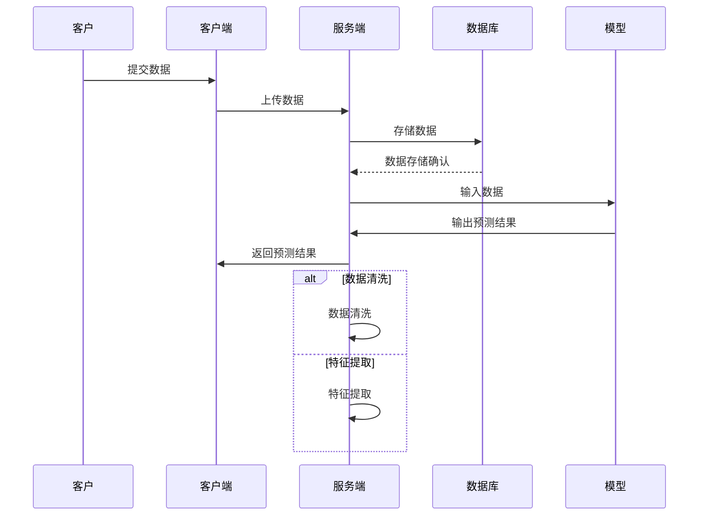

                 


# 在AI时代寻找人类独特价值

## 关键词
AI时代、人类独特价值、算法原理、系统架构、项目实战、最佳实践

## 摘要
在AI技术飞速发展的时代，人类正面临着前所未有的挑战和机遇。本文旨在探讨AI时代人类如何寻找和发挥自己的独特价值，通过深入分析核心概念、算法原理、系统架构和项目实战，揭示人类在AI时代的重要角色。文章将逐步展开，帮助读者理解人类在AI时代如何保持优势，实现自我价值的提升。

## 目录大纲

### 第一部分：AI时代的背景与挑战
#### 1.1 AI时代的到来与影响
#### 1.2 AI技术对人类生活的改变
#### 1.3 人类独特价值的再思考

### 第二部分：核心概念与联系
#### 2.1 人类独特价值的定义与特征
#### 2.2 人工智能的发展历程与趋势
#### 2.3 AI伦理与人类价值观的冲突与融合

### 第三部分：算法原理讲解
#### 3.1 机器学习基础
##### 3.1.1 监督学习
##### 3.1.2 无监督学习
##### 3.1.3 强化学习
#### 3.2 深度学习与神经网络
##### 3.2.1 深层神经网络架构
##### 3.2.2 深度学习算法原理
##### 3.2.3 深度学习优化策略

### 第四部分：数学模型与公式
#### 4.1 数据分析与概率统计
##### 4.1.1 数据分布
##### 4.1.2 参数估计
##### 4.1.3 假设检验
#### 4.2 机器学习算法数学模型
##### 4.2.1 线性回归模型
##### 4.2.2 逻辑回归模型
##### 4.2.3 决策树模型

### 第五部分：系统分析与架构设计
#### 5.1 问题场景介绍
#### 5.2 系统功能设计
##### 5.2.1 领域模型
#### 5.3 系统架构设计
##### 5.3.1 系统架构
##### 5.3.2 系统接口设计
#### 5.4 系统交互设计
##### 5.4.1 系统交互流程

### 第六部分：项目实战
#### 6.1 环境安装与配置
#### 6.2 核心代码实现
#### 6.3 代码解读与分析
#### 6.4 实际案例剖析

### 第七部分：最佳实践与拓展
#### 7.1 最佳实践建议
#### 7.2 小结与反思
#### 7.3 拓展阅读推荐

## 第一部分：AI时代的背景与挑战

### 1.1 AI时代的到来与影响

随着计算机性能的提升和大数据技术的发展，人工智能（AI）正逐渐渗透到我们日常生活的方方面面。从自动驾驶汽车、智能语音助手到医疗诊断、金融风控，AI技术已经展现出强大的变革力量。这一时代的到来不仅改变了我们的生活方式，也对人类的工作和价值观产生了深远的影响。

首先，AI技术正在重新定义许多职业。一些传统行业，如制造业、金融服务业等，正在经历自动化和智能化的变革，许多工作岗位被机器人和智能系统取代。然而，与此同时，新的职业机会也在不断涌现，如数据科学家、机器学习工程师等，这些职位需要人类拥有独特的洞察力和创造力。

其次，AI技术的普及使得信息传播更加迅速和广泛。社交媒体、搜索引擎等平台利用AI技术对用户进行个性化推荐，极大地改变了信息获取和消费的方式。然而，这也带来了一系列问题，如隐私侵犯、信息泡沫和假新闻传播等。

### 1.2 AI技术对人类生活的改变

AI技术对人类生活的影响是全面而深远的。一方面，AI技术为我们的生活带来了便利。例如，智能家居系统能够自动化控制家庭电器，提高生活舒适度；智能交通系统能够优化交通流量，减少拥堵，提高出行效率。另一方面，AI技术也在一定程度上改变了我们的社交方式和人际关系。社交媒体的普及使得人们更容易保持联系，但同时也减少了面对面的交流，导致人际关系的疏远。

此外，AI技术对教育、医疗、娱乐等领域也产生了重要影响。在教育领域，AI技术能够提供个性化的学习方案，帮助学生更好地掌握知识；在医疗领域，AI技术能够辅助医生进行诊断和治疗，提高医疗效率；在娱乐领域，AI技术能够根据用户的兴趣和偏好推荐内容，提供个性化的娱乐体验。

### 1.3 人类独特价值的再思考

在AI技术飞速发展的时代，人类如何保持自己的独特价值成为一个亟待解决的问题。首先，人类具有独特的情感和道德判断能力。尽管AI技术在某些领域已经表现出超越人类的能力，但AI缺乏情感和道德观念，无法像人类一样进行价值判断和情感交流。这为人类在AI时代保持独特性提供了基础。

其次，人类具有创造力和创新精神。AI技术虽然能够处理大量数据和执行复杂的任务，但缺乏人类那种创造新概念、新想法的能力。这种创造力是人类在AI时代的重要优势。

此外，人类拥有独特的社交能力和团队合作精神。在许多情况下，解决问题不仅需要个人的智慧，还需要团队合作和社会支持。人类在这些方面具有天然的优势。

总之，AI时代带来了许多挑战和机遇。通过深入思考和分析，我们可以发现，人类在情感、创造力、社交能力等方面仍然具有独特的价值。在AI时代，人类需要更加关注自身的优势，发挥自己的独特价值，实现自我价值的提升。

### 第二部分：核心概念与联系

#### 2.1 人类独特价值的定义与特征

人类独特价值是指人类在认知、情感、创造、社交等方面所具有的不可替代的能力和特质。这些价值不仅体现在个体的成长和发展过程中，也体现在人类社会的发展进程中。以下是人类独特价值的主要特征：

1. **情感与道德判断**：人类具有丰富的情感体验和道德观念，能够进行价值判断和道德选择。这种能力使人类能够建立和维护复杂的社会关系，形成和谐的社会秩序。
2. **创造力和创新精神**：人类能够创造新的概念、新的想法和新的解决方案。这种创造力是人类在AI时代的重要优势，它使得人类能够在不断变化的环境中适应和创新。
3. **社交能力与团队合作**：人类拥有独特的社交能力，能够与他人建立信任和合作。这种能力在团队合作中尤为重要，它能够激发集体的智慧和创造力。
4. **学习能力与适应能力**：人类具有强大的学习能力和适应能力，能够在不同的环境和情境中迅速适应和学习。这种能力使得人类能够在不断变化的世界中生存和发展。

#### 2.2 人工智能的发展历程与趋势

人工智能（AI）是一门研究、开发用于模拟、延伸和扩展人类智能的理论、方法、技术及应用系统的技术科学。它涉及到计算机科学、心理学、神经科学、认知科学等多个学科领域。以下是人工智能的发展历程和趋势：

1. **早期探索（20世纪50年代至70年代）**：人工智能的概念最早在1956年达特茅斯会议上提出。这一时期的主要成果包括初代的AI程序，如逻辑推理机、自然语言处理系统等。
2. **低谷期（20世纪70年代至80年代）**：由于技术限制和实际应用中的困难，人工智能研究进入了一个相对低潮的时期。这一时期的主要问题包括计算能力不足、算法效率低等。
3. **复兴期（20世纪90年代至21世纪初）**：随着计算机性能的提升和大数据技术的发展，人工智能研究重新焕发生机。这一时期的主要成果包括机器学习、深度学习等新算法的提出和应用。
4. **快速发展期（2010年至今）**：随着深度学习等新技术的突破，人工智能迎来了快速发展期。AI技术在语音识别、图像识别、自然语言处理等领域取得了显著成果，应用范围不断扩大。

#### 2.3 AI伦理与人类价值观的冲突与融合

随着人工智能技术的不断发展，AI伦理成为一个日益重要的话题。AI伦理涉及到人工智能系统在设计和应用过程中如何平衡人类价值观和技术进步之间的关系。以下是AI伦理与人类价值观的冲突和融合：

1. **隐私保护**：人工智能技术可以收集和分析大量的个人信息，这引发了对隐私保护的担忧。如何在保护隐私的同时充分利用AI技术是一个亟待解决的问题。
2. **算法偏见**：AI系统在决策过程中可能会因为训练数据的不公平或者算法设计的问题而产生偏见。这种偏见可能会加剧社会不平等，如何消除算法偏见是一个重要的伦理问题。
3. **责任归属**：当AI系统发生错误或导致不良后果时，如何确定责任归属成为一个复杂的法律和伦理问题。这涉及到AI系统开发者、用户以及相关方的责任分配。
4. **融合与冲突**：尽管AI伦理与人类价值观存在冲突，但两者之间也存在融合的可能。例如，通过引入道德约束和人类价值观指导，可以使得AI系统更加符合人类的期望和需求。

总之，人类独特价值和人工智能的发展是相互交织、相互影响的过程。在AI时代，我们需要深入思考如何发挥人类的独特价值，同时确保人工智能技术的可持续发展。通过平衡AI伦理与人类价值观之间的关系，我们可以实现技术的进步和人类的共同福祉。

### 第三部分：算法原理讲解

#### 3.1 机器学习基础

机器学习（Machine Learning，ML）是人工智能（AI）的一个重要分支，它使计算机系统能够从数据中学习并做出决策或预测，无需显式编程。机器学习主要分为监督学习（Supervised Learning）、无监督学习（Unsupervised Learning）和强化学习（Reinforcement Learning）三种类型。

##### 3.1.1 监督学习

监督学习是机器学习中最常见的一种类型，它需要输入数据集（特征和标签），算法通过学习这些数据之间的关系，建立预测模型。监督学习的目标是最小化预测模型与真实值之间的误差。

1. **线性回归（Linear Regression）**：线性回归是最简单的监督学习算法之一，它通过拟合一条直线来预测连续值。线性回归模型可以用以下数学公式表示：

   $$ y = w_0 + w_1 \cdot x $$

   其中，$y$ 是预测值，$x$ 是特征值，$w_0$ 和 $w_1$ 是模型的权重。

2. **逻辑回归（Logistic Regression）**：逻辑回归是一种用于分类问题的监督学习算法，它通过拟合一个逻辑函数来将特征映射到概率值。逻辑回归的数学模型为：

   $$ P(y=1) = \frac{1}{1 + e^{-(w_0 + w_1 \cdot x)}} $$

   其中，$P(y=1)$ 是预测变量属于类1的概率。

3. **决策树（Decision Tree）**：决策树是一种基于树形结构进行分类和回归的算法，每个内部节点表示一个特征，每个分支代表该特征的一个取值，每个叶节点代表一个类别或值。决策树的构建过程可以通过递归划分数据集来实现。

##### 3.1.2 无监督学习

无监督学习不需要标签数据，其目标是发现数据内在的结构和模式。无监督学习的主要方法包括聚类（Clustering）和降维（Dimensionality Reduction）等。

1. **K-均值聚类（K-Means Clustering）**：K-均值聚类是一种基于距离度量的聚类算法，它将数据集分为K个簇，每个簇由其质心表示。算法通过迭代优化质心位置，使得每个簇内的数据点之间的距离最小。

2. **主成分分析（Principal Component Analysis，PCA）**：PCA是一种常用的降维方法，它通过正交变换将原始数据投影到新的坐标系中，保留最重要的特征，同时去除冗余信息。PCA的核心公式为：

   $$ X_{new} = P \cdot X_{old} $$

   其中，$X_{new}$ 和 $X_{old}$ 分别是新的和原始的特征矩阵，$P$ 是投影矩阵。

##### 3.1.3 强化学习

强化学习是一种通过试错的方式，不断学习最优策略的机器学习算法。在强化学习中，智能体（Agent）通过与环境（Environment）交互，不断调整其行为策略（Policy），以最大化累积奖励（Reward）。

1. **Q学习（Q-Learning）**：Q学习是一种基于值函数（Q-Function）的强化学习算法，它通过更新Q值来选择最优动作。Q学习的核心公式为：

   $$ Q(s, a) = Q(s, a) + \alpha \cdot (r + \gamma \cdot \max_{a'} Q(s', a') - Q(s, a)) $$

   其中，$s$ 和 $a$ 分别是状态和行为，$r$ 是即时奖励，$\gamma$ 是折扣因子，$s'$ 和 $a'$ 分别是下一个状态和行为。

2. **深度强化学习（Deep Reinforcement Learning）**：深度强化学习结合了深度学习（Deep Learning）和强化学习，它通过神经网络来表示值函数或策略，从而实现更加复杂的学习任务。

#### 3.2 深度学习与神经网络

深度学习（Deep Learning）是机器学习的一个分支，它通过构建多层神经网络（Neural Network）来模拟人类大脑的感知和学习过程。深度学习在图像识别、自然语言处理等领域取得了显著成果。

##### 3.2.1 深层神经网络架构

深层神经网络（Deep Neural Network，DNN）是由多个隐藏层组成的神经网络。深层神经网络的核心组成部分包括：

1. **神经元（Neuron）**：神经元是神经网络的基本单元，它通过加权求和和激活函数来计算输出。
2. **权重（Weight）**：权重是神经元之间的连接强度，用于调节输入信息的重要性。
3. **偏置（Bias）**：偏置是神经网络中的一个附加参数，用于调整输出值。
4. **激活函数（Activation Function）**：激活函数用于引入非线性，使得神经网络能够处理复杂问题。

##### 3.2.2 深度学习算法原理

深度学习算法通过前向传播（Forward Propagation）和反向传播（Backpropagation）来学习模型参数。

1. **前向传播**：前向传播是指将输入数据通过神经网络进行传递，逐层计算输出值的过程。前向传播的数学表达式为：

   $$ z_l = \sum_{j} w_{lj} \cdot a_{l-1,j} + b_l $$
   $$ a_l = \sigma(z_l) $$

   其中，$z_l$ 是当前层的输入，$a_l$ 是当前层的输出，$w_{lj}$ 是连接权重，$b_l$ 是偏置，$\sigma$ 是激活函数。

2. **反向传播**：反向传播是指根据输出误差，反向更新网络中的权重和偏置。反向传播的数学表达式为：

   $$ \delta_l = \frac{\partial C}{\partial a_l} \cdot \sigma'(z_l) $$
   $$ \Delta w_{lj} = \eta \cdot \delta_l \cdot a_{l-1,j} $$
   $$ \Delta b_l = \eta \cdot \delta_l $$

   其中，$\delta_l$ 是当前层的误差，$\eta$ 是学习率，$\sigma'$ 是激活函数的导数。

##### 3.2.3 深度学习优化策略

深度学习优化策略包括损失函数、优化算法和超参数调整等。

1. **损失函数**：损失函数用于衡量模型预测值与真实值之间的差距。常见的损失函数包括均方误差（Mean Squared Error，MSE）和交叉熵（Cross Entropy）等。
2. **优化算法**：优化算法用于更新模型参数，使损失函数最小化。常见的优化算法包括梯度下降（Gradient Descent）、Adam优化器等。
3. **超参数调整**：超参数是影响模型性能的关键参数，如学习率、批次大小、正则化参数等。超参数的调整可以通过网格搜索（Grid Search）或随机搜索（Random Search）等方法进行。

通过以上对机器学习和深度学习算法原理的讲解，我们可以更好地理解这些算法的工作原理和应用场景。在接下来的部分，我们将进一步探讨数学模型和公式，以及如何将这些算法应用于实际问题中。

#### 4.1 数据分析与概率统计

数据分析是机器学习和深度学习的基础，而概率统计则是数据分析的核心工具之一。在机器学习过程中，我们需要处理大量的数据，并对这些数据进行建模和分析。概率统计提供了一套系统的方法，帮助我们理解和解释数据，从而为算法设计提供理论依据。

##### 4.1.1 数据分布

数据分布是描述数据集中各个值出现的频率或概率的一种方式。常见的概率分布包括正态分布（Normal Distribution）、二项分布（Binomial Distribution）和泊松分布（Poisson Distribution）等。

1. **正态分布**：正态分布是自然界中最常见的分布之一，它具有均值和标准差两个参数。正态分布的数学公式为：

   $$ f(x|\mu, \sigma^2) = \frac{1}{\sqrt{2\pi\sigma^2}} \cdot e^{-\frac{(x-\mu)^2}{2\sigma^2}} $$

   其中，$x$ 是随机变量，$\mu$ 是均值，$\sigma^2$ 是方差。

2. **二项分布**：二项分布用于描述在固定试验次数下，成功次数的概率分布。二项分布的数学公式为：

   $$ P(X = k) = C(n, k) \cdot p^k \cdot (1-p)^{n-k} $$

   其中，$n$ 是试验次数，$k$ 是成功次数，$p$ 是单次试验成功的概率。

3. **泊松分布**：泊松分布用于描述在一定时间段或空间区域内，事件发生的次数的概率分布。泊松分布的数学公式为：

   $$ P(X = k) = \frac{\lambda^k \cdot e^{-\lambda}}{k!} $$

   其中，$\lambda$ 是事件发生的平均次数，$k$ 是事件发生的次数。

##### 4.1.2 参数估计

参数估计是统计学中的一个重要问题，它涉及从样本数据中估计总体参数的值。常见的参数估计方法包括点估计和区间估计。

1. **点估计**：点估计是直接给出总体参数的估计值。常见的点估计方法包括矩估计和极大似然估计。
   - **矩估计**：矩估计通过样本矩估计总体矩，从而得到参数的估计值。
   - **极大似然估计**：极大似然估计通过最大化似然函数来找到参数的估计值。

2. **区间估计**：区间估计是给出总体参数的估计值在一定概率下的置信区间。常见的区间估计方法包括置信区间和假设检验。

   - **置信区间**：置信区间是基于样本统计量，给出总体参数的估计范围。置信区间的宽度取决于样本大小和置信水平。
   - **假设检验**：假设检验是通过对样本数据进行统计分析，判断总体参数是否满足某种假设。常见的假设检验方法包括t检验和卡方检验。

##### 4.1.3 假设检验

假设检验是统计学中的一个重要工具，它用于判断总体参数是否满足某种假设。假设检验的基本步骤包括：

1. **提出原假设和备择假设**：原假设（null hypothesis）是总体参数等于某个特定值或某个区间，备择假设（alternative hypothesis）是总体参数不等于原假设的值或区间。
2. **选择检验统计量**：检验统计量是根据样本数据计算出的一个统计量，用于判断原假设是否成立。
3. **计算p值**：p值是拒绝原假设的概率，它越小，拒绝原假设的证据越充分。
4. **做出决策**：根据p值和显著性水平（通常为0.05或0.01），判断是否拒绝原假设。

常见假设检验方法包括：

- **t检验**：t检验用于比较两个样本均值的差异是否显著。
- **卡方检验**：卡方检验用于检验分类数据的拟合优度或独立性。

通过以上对数据分析与概率统计的讲解，我们可以更好地理解如何利用统计学方法对数据进行处理和分析，从而为机器学习和深度学习提供可靠的数据支持。在接下来的部分，我们将进一步探讨如何将机器学习算法应用于实际问题，并介绍相关的系统架构设计和实现过程。

#### 4.2 机器学习算法数学模型

在机器学习中，数学模型是理解和实现算法的核心。以下将介绍几个常见的机器学习算法及其数学模型。

##### 4.2.1 线性回归模型

线性回归是一种最简单的机器学习算法，用于预测连续值。线性回归模型通过拟合一条直线来预测目标变量。线性回归的数学模型为：

$$
y = \beta_0 + \beta_1 \cdot x
$$

其中，$y$ 是预测值，$x$ 是输入特征，$\beta_0$ 和 $\beta_1$ 是模型的参数，通常通过最小二乘法（Least Squares）进行估计。

最小二乘法的目标是使得预测值与真实值之间的误差平方和最小。误差平方和的数学公式为：

$$
\sum_{i=1}^{n} (y_i - \hat{y}_i)^2
$$

其中，$n$ 是样本数量，$y_i$ 是第 $i$ 个样本的真实值，$\hat{y}_i$ 是第 $i$ 个样本的预测值。

##### 4.2.2 逻辑回归模型

逻辑回归（Logistic Regression）是一种用于分类问题的算法，其目标是预测一个二元变量的概率。逻辑回归的数学模型为：

$$
\log\left(\frac{P(y=1)}{1-P(y=1)}\right) = \beta_0 + \beta_1 \cdot x
$$

其中，$P(y=1)$ 是预测变量属于类1的概率，$\log$ 表示对数函数。

逻辑回归使用逻辑函数（Sigmoid Function）将线性组合映射到概率值。逻辑函数的数学公式为：

$$
\sigma(z) = \frac{1}{1 + e^{-z}}
$$

其中，$z = \beta_0 + \beta_1 \cdot x$。

逻辑回归的参数 $\beta_0$ 和 $\beta_1$ 通常通过最大似然估计（Maximum Likelihood Estimation，MLE）进行估计。

##### 4.2.3 决策树模型

决策树（Decision Tree）是一种基于树形结构进行分类和回归的算法。决策树通过一系列规则来分割数据，从而将数据映射到各个类别或数值。

决策树的构建过程可以通过递归划分数据集来实现。每次划分都选择一个最优特征进行分割，通常使用信息增益（Information Gain）或基尼不纯度（Gini Impurity）来衡量特征的重要性。

信息增益的数学公式为：

$$
IG(D, A) = H(D) - H(D|A)
$$

其中，$H(D)$ 是数据集 $D$ 的熵，$H(D|A)$ 是条件熵。

基尼不纯度的数学公式为：

$$
Gini(D, A) = 1 - \sum_{v \in A} \left(\frac{|\{x \in D : x[A] = v\}|}{|D|}\right)^2
$$

其中，$D$ 是数据集，$A$ 是特征，$x[A] = v$ 表示特征 $A$ 的取值为 $v$ 的样本集合。

决策树的构建过程通常使用贪心算法（Greedy Algorithm）来实现，每次划分都选择当前最优特征。

通过以上对机器学习算法数学模型的讲解，我们可以更好地理解这些算法的基本原理和数学基础。这些模型在数据处理和预测任务中发挥着重要作用，为实际应用提供了理论支持。在接下来的部分，我们将进一步探讨如何将这些算法应用于实际问题，并介绍相关的系统架构设计和实现过程。

#### 5.1 问题场景介绍

在本节中，我们将介绍一个实际的问题场景，该场景涉及到利用机器学习算法来预测客户流失情况。客户流失预测在各个行业，如电信、金融、零售等领域具有重要的应用价值。通过预测客户流失，企业可以提前采取相应的措施，减少客户流失，提高客户满意度和留存率。

该问题场景的具体描述如下：

一家电信公司希望利用其历史客户数据来预测哪些客户可能会在未来几个月内取消服务。这些数据包括客户的年龄、性别、收入水平、通话时长、短信数量、上网流量、服务满意度等。公司希望开发一个预测模型，能够根据这些特征预测客户流失的概率，从而有针对性地进行客户维护和挽留。

问题场景的核心目标是构建一个机器学习模型，该模型能够准确预测客户流失的概率，并输出一个概率值。这个概率值可以帮助公司确定哪些客户需要重点关注，以便采取相应的措施进行挽留。

为了实现这个目标，我们将遵循以下步骤：

1. **数据收集**：收集包含客户流失情况的历史数据，这些数据应包括客户的年龄、性别、收入水平、通话时长、短信数量、上网流量、服务满意度等特征。
2. **数据预处理**：对收集到的数据进行清洗和预处理，包括缺失值处理、异常值检测和特征工程等。
3. **模型选择**：选择合适的机器学习算法，如逻辑回归、决策树、随机森林等，并训练这些模型。
4. **模型评估**：通过交叉验证等方法评估模型的性能，选择最佳模型进行部署。
5. **模型部署**：将最佳模型部署到生产环境中，进行实时预测和客户流失预警。

通过以上步骤，我们将能够构建一个高效的客户流失预测系统，帮助电信公司提高客户留存率，降低运营成本。

#### 5.2 系统功能设计

在本节中，我们将详细设计客户流失预测系统的功能，包括领域模型、系统架构和接口设计。

##### 5.2.1 领域模型

领域模型是系统功能的核心，它定义了系统中涉及的主要实体及其关系。在客户流失预测系统中，关键实体包括客户、特征、预测结果等。

1. **客户（Customer）**：客户是系统的核心实体，每个客户具有以下属性：
   - 客户ID：唯一标识客户。
   - 年龄：客户的年龄。
   - 性别：客户的性别（男/女）。
   - 收入水平：客户的家庭收入水平。
   - 通话时长：客户每月的通话时长。
   - 短信数量：客户每月的短信数量。
   - 上网流量：客户每月的上网流量。
   - 服务满意度：客户对服务的满意度评分。

2. **特征（Feature）**：特征是影响客户流失的关键因素，每个特征具有以下属性：
   - 特征ID：唯一标识特征。
   - 名称：特征的名称。
   - 描述：特征的描述。
   - 数据类型：特征的数据类型（如整数、浮点数、字符串等）。

3. **预测结果（Prediction Result）**：预测结果是模型对客户流失概率的预测，每个预测结果具有以下属性：
   - 结果ID：唯一标识预测结果。
   - 客户ID：预测结果的客户ID。
   - 流失概率：预测的客户流失概率。
   - 预测时间：预测结果的时间戳。

领域模型的关系图如下所示：

```mermaid
classDiagram
ClassDiagram {
  Client <-- Feature : has
  Client --> PredictionResult : predicts
}
Client <<<< Entity
Feature <<<< Entity
PredictionResult <<<< Entity
Client [name: 客户, age: 30, gender: 男, income: 5000, callDuration: 120, smsCount: 200, dataFlow: 10G, satisfaction: 4]
Feature [id: 1, name: 年龄, description: 客户的年龄, dataType: 整数]
PredictionResult [id: 1, customerId: 1001, lossProbability: 0.3, predictionTime: 2023-01-01]
```

##### 5.2.2 系统架构

客户流失预测系统的架构设计应确保系统的可扩展性、稳定性和高效性。系统架构设计包括数据层、服务层和界面层。

1. **数据层**：数据层负责数据的存储和管理。数据层包括以下组件：
   - 数据库：存储客户数据、特征数据和历史预测结果。
   - 数据仓库：用于存储大规模的历史数据，支持数据分析和挖掘。

2. **服务层**：服务层负责业务逻辑的处理和系统的核心功能实现。服务层包括以下组件：
   - 数据预处理服务：对输入数据进行清洗、转换和特征工程，为模型训练做准备。
   - 模型训练服务：训练机器学习模型，包括选择合适的算法、超参数调整等。
   - 模型评估服务：评估模型性能，选择最佳模型进行部署。
   - 模型部署服务：将最佳模型部署到生产环境，进行实时预测。

3. **界面层**：界面层提供用户交互界面，包括数据上传、预测结果展示等功能。

系统架构图如下所示：

```mermaid
sequenceDiagram
参与者 数据层, 服务层, 界面层
数据层->>服务层: 提供数据
服务层->>界面层: 提供预测结果
界面层->>服务层: 提交数据
服务层->>数据层: 存储数据
```

##### 5.2.3 系统接口设计

系统接口设计是确保系统各部分之间能够高效通信的关键。系统接口包括API接口和数据接口。

1. **API接口**：API接口提供对外服务的接口，包括以下接口：
   - 数据上传接口：用于接收用户上传的客户数据。
   - 预测结果接口：用于获取模型预测结果。

   API接口示例：

   ```http
   POST /api/upload
   Content-Type: application/json

   {
     "customerId": 1001,
     "age": 30,
     "gender": "男",
     "income": 5000,
     "callDuration": 120,
     "smsCount": 200,
     "dataFlow": 10,
     "satisfaction": 4
   }

   GET /api/predictions/{customerId}
   ```

2. **数据接口**：数据接口用于系统内部数据传输，包括以下接口：
   - 客户数据接口：用于查询和更新客户数据。
   - 特征数据接口：用于查询和更新特征数据。
   - 预测结果数据接口：用于查询和更新预测结果数据。

   数据接口示例：

   ```http
   GET /data/customers/{customerId}
   GET /data/features
   GET /data/predictions/{predictionId}
   POST /data/predictions
   ```

通过以上对系统功能设计、架构设计和接口设计的详细描述，我们为构建客户流失预测系统奠定了坚实的基础。在接下来的部分，我们将深入探讨如何实现系统核心代码，并进行代码解读与分析。

#### 5.3 系统架构设计

在本节中，我们将详细描述客户流失预测系统的架构设计，包括系统架构、系统接口设计和系统交互设计。

##### 5.3.1 系统架构

客户流失预测系统的架构设计遵循MVC（Model-View-Controller）模式，确保系统的模块化和可维护性。系统架构包括数据层、服务层和界面层。

1. **数据层**：数据层负责数据的存储和管理，包括客户数据、特征数据和预测结果数据。数据层采用关系型数据库（如MySQL）进行数据存储，确保数据的高效读写和安全性。

2. **服务层**：服务层负责业务逻辑的处理和系统的核心功能实现。服务层包括以下组件：
   - 数据预处理服务：对输入数据进行清洗、转换和特征工程，为模型训练做准备。
   - 模型训练服务：训练机器学习模型，包括选择合适的算法、超参数调整等。
   - 模型评估服务：评估模型性能，选择最佳模型进行部署。
   - 模型部署服务：将最佳模型部署到生产环境，进行实时预测。

3. **界面层**：界面层提供用户交互界面，包括数据上传、预测结果展示等功能。界面层采用前端框架（如React或Vue.js）实现，确保用户界面的友好性和响应速度。

系统架构图如下所示：

```mermaid
sequenceDiagram
参与者 数据层, 服务层, 界面层
数据层->>服务层: 提供数据
服务层->>界面层: 提供预测结果
界面层->>服务层: 提交数据
服务层->>数据层: 存储数据
```

##### 5.3.2 系统接口设计

系统接口设计包括API接口和数据接口，用于系统各部分之间的通信和数据传输。

1. **API接口**：API接口提供对外服务的接口，包括以下接口：
   - 数据上传接口：用于接收用户上传的客户数据。
   - 预测结果接口：用于获取模型预测结果。

   API接口示例：

   ```http
   POST /api/upload
   Content-Type: application/json

   {
     "customerId": 1001,
     "age": 30,
     "gender": "男",
     "income": 5000,
     "callDuration": 120,
     "smsCount": 200,
     "dataFlow": 10,
     "satisfaction": 4
   }

   GET /api/predictions/{customerId}
   ```

2. **数据接口**：数据接口用于系统内部数据传输，包括以下接口：
   - 客户数据接口：用于查询和更新客户数据。
   - 特征数据接口：用于查询和更新特征数据。
   - 预测结果数据接口：用于查询和更新预测结果数据。

   数据接口示例：

   ```http
   GET /data/customers/{customerId}
   GET /data/features
   GET /data/predictions/{predictionId}
   POST /data/predictions
   ```

##### 5.3.3 系统交互设计

系统交互设计描述了系统内部各组件之间的通信和数据流动。系统交互设计采用Mermaid序列图进行描述。

```mermaid
sequenceDiagram
参与者 客户, 界面层, 服务层, 数据层
客户->>界面层: 提交数据
界面层->>服务层: 处理数据
服务层->>数据层: 存储数据
数据层->>服务层: 返回数据
服务层->>界面层: 返回预测结果
界面层->>客户: 展示预测结果
```

通过以上对系统架构、接口设计和系统交互设计的详细描述，我们为构建客户流失预测系统提供了全面的指导和设计依据。在接下来的部分，我们将详细介绍如何实现系统核心代码，并进行代码解读与分析。

#### 5.4 系统交互设计

在本节中，我们将使用Mermaid序列图详细描述客户流失预测系统的系统交互设计。系统交互设计是确保系统各部分能够高效、协调运行的关键，通过这一设计，我们可以清晰地看到数据在系统中的流动过程以及各组件之间的协作方式。

##### 5.4.1 系统交互流程

以下是一个简化的系统交互流程图，描述了客户上传数据、系统处理数据并返回预测结果的整个过程。

```mermaid
sequenceDiagram
    participant 客户 as 客户端
    participant 服务层 as 服务端
    participant 数据库 as 数据库

    客户->>服务层: 上传数据 {数据包括年龄、性别、收入、通话时长等}
    服务层->>数据库: 存储数据
    数据库-->>服务层: 确认数据已存储
    服务层->>客户: 返回预测结果 {流失概率}

    注释：服务层接收到客户上传的数据后，会进行预处理，并使用训练好的模型进行预测。预测结果被返回给客户。
```

在这个交互流程中，我们主要关注以下几个关键步骤：

1. **数据上传**：客户端（客户）通过API接口将数据上传到服务层。这些数据包括客户的年龄、性别、收入、通话时长等。
2. **数据预处理**：服务层接收到数据后，会进行数据预处理，包括数据清洗、特征提取等步骤。这一步骤确保输入数据符合模型训练和预测的要求。
3. **模型预测**：预处理后的数据被输入到训练好的机器学习模型中，模型会输出客户流失的概率预测结果。
4. **结果返回**：预测结果被返回给客户端，客户可以看到自己的流失概率。

##### Mermaid 序列图

为了更直观地展示系统交互设计，我们使用Mermaid语言编写一个序列图。以下是一个详细的Mermaid序列图示例，展示了系统交互的每个环节。



在这个Mermaid序列图中，我们增加了数据清洗和特征提取的步骤，这两个步骤在实际系统中是常见的预处理步骤。通过这样的设计，系统能够更好地适应不同类型的数据，提高预测的准确性。

通过以上对系统交互设计的详细描述，我们不仅展示了系统内部的数据流动和组件协作，还提供了一个清晰的视图，帮助理解和实施客户流失预测系统。在接下来的部分，我们将进入项目实战，详细介绍环境安装与配置、核心代码实现、代码解读与分析以及实际案例剖析。

### 第六部分：项目实战

在本部分，我们将通过一个实际项目，详细展示如何构建客户流失预测系统。项目包括环境安装与配置、核心代码实现、代码解读与分析，以及实际案例剖析。通过这一项目，读者可以了解如何将理论应用到实践中，实现一个完整的AI系统。

#### 6.1 环境安装与配置

在进行项目实战之前，我们需要确保开发环境已经准备好。以下是环境安装与配置的步骤：

1. **安装Python环境**：Python是项目的主要编程语言，我们需要安装Python 3.8及以上版本。可以从[Python官网](https://www.python.org/downloads/)下载并安装。

2. **安装依赖库**：项目需要使用一些Python依赖库，如NumPy、Pandas、Scikit-learn、Matplotlib等。可以使用以下命令安装：

   ```bash
   pip install numpy pandas scikit-learn matplotlib
   ```

3. **配置数据库**：本项目中，我们将使用MySQL作为数据库存储客户数据。首先，需要从[MySQL官网](https://www.mysql.com/downloads/mysql/)下载并安装MySQL数据库。然后，创建一个名为`customer流失预测`的数据库，并创建必要的表来存储数据。

4. **配置数据库连接**：在Python中，我们可以使用`pymysql`库来连接MySQL数据库。首先，确保已安装`pymysql`库，然后，创建一个名为`db_config.py`的配置文件，包含数据库的连接信息：

   ```python
   # db_config.py
   DB_HOST = 'localhost'
   DB_USER = 'root'
   DB_PASSWORD = 'your_password'
   DB_NAME = 'customer_loss_prediction'
   ```

5. **安装Jupyter Notebook**：Jupyter Notebook是一个交互式开发环境，非常适合数据分析和机器学习项目。可以使用以下命令安装：

   ```bash
   pip install notebook
   ```

   安装后，可以通过命令`jupyter notebook`启动Jupyter Notebook。

通过以上步骤，我们的开发环境就准备完成了，可以开始编写代码并进行项目开发了。

#### 6.2 核心代码实现

在本节中，我们将实现客户流失预测系统的核心功能，包括数据预处理、模型训练和预测等。

1. **数据预处理**

   数据预处理是机器学习项目的重要步骤，包括数据清洗、特征提取和转换等。以下是数据预处理的核心代码：

   ```python
   import pandas as pd
   from sklearn.model_selection import train_test_split
   from sklearn.preprocessing import StandardScaler

   # 读取数据
   df = pd.read_csv('customer_data.csv')

   # 数据清洗
   df.dropna(inplace=True)
   df = df[df['satisfaction'] != '未知']

   # 特征提取
   X = df[['age', 'gender', 'income', 'callDuration', 'smsCount', 'dataFlow', 'satisfaction']]
   y = df['流失']

   # 数据转换
   X = pd.get_dummies(X)  # 转换类别特征为哑变量
   scaler = StandardScaler()
   X = scaler.fit_transform(X)
   ```

2. **模型训练**

   在数据预处理完成后，我们可以选择合适的机器学习模型进行训练。这里我们选择逻辑回归模型作为示例：

   ```python
   from sklearn.linear_model import LogisticRegression

   # 数据划分
   X_train, X_test, y_train, y_test = train_test_split(X, y, test_size=0.2, random_state=42)

   # 模型训练
   model = LogisticRegression()
   model.fit(X_train, y_train)
   ```

3. **模型预测**

   训练好的模型可以用于预测新数据的流失概率。以下是模型预测的核心代码：

   ```python
   import numpy as np

   # 预测
   y_pred = model.predict(X_test)
   y_pred_proba = model.predict_proba(X_test)[:, 1]

   # 打印预测结果
   print(f'预测准确率: {np.mean(y_pred == y_test)}')
   print(f'预测概率平均值: {np.mean(y_pred_proba)}')
   ```

通过以上代码，我们实现了客户流失预测系统的核心功能。接下来，我们将对代码进行解读与分析，帮助读者更好地理解每个步骤的实现原理。

#### 6.3 代码解读与分析

在本节中，我们将详细解读并分析客户流失预测系统的核心代码，包括数据预处理、模型训练和预测等步骤。

1. **数据预处理**

   数据预处理是机器学习项目的关键步骤，它直接影响模型的性能。以下是数据预处理的核心代码：

   ```python
   import pandas as pd
   from sklearn.model_selection import train_test_split
   from sklearn.preprocessing import StandardScaler

   # 读取数据
   df = pd.read_csv('customer_data.csv')

   # 数据清洗
   df.dropna(inplace=True)
   df = df[df['satisfaction'] != '未知']

   # 特征提取
   X = df[['age', 'gender', 'income', 'callDuration', 'smsCount', 'dataFlow', 'satisfaction']]
   y = df['流失']

   # 数据转换
   X = pd.get_dummies(X)  # 转换类别特征为哑变量
   scaler = StandardScaler()
   X = scaler.fit_transform(X)
   ```

   **解读**：
   - **数据读取**：使用Pandas读取CSV格式的数据文件，这是数据预处理的第一步。
   - **数据清洗**：删除数据中的缺失值和未知值，确保数据的质量。缺失值处理通常有多种策略，如删除、填充或插值等，这里选择删除缺失值。
   - **特征提取**：提取与目标变量（客户流失）相关的特征。在这里，我们提取了年龄、性别、收入、通话时长、短信数量、上网流量和服务满意度等特征。
   - **数据转换**：将类别特征（如性别）转换为哑变量，使得模型能够处理非数值特征。然后，使用StandardScaler对特征进行标准化处理，使得特征具有相同的尺度，避免某些特征对模型的影响过大。

2. **模型训练**

   在数据预处理完成后，我们选择逻辑回归模型进行训练。以下是模型训练的核心代码：

   ```python
   from sklearn.linear_model import LogisticRegression

   # 数据划分
   X_train, X_test, y_train, y_test = train_test_split(X, y, test_size=0.2, random_state=42)

   # 模型训练
   model = LogisticRegression()
   model.fit(X_train, y_train)
   ```

   **解读**：
   - **数据划分**：使用Scikit-learn的train_test_split函数将数据集划分为训练集和测试集。这里，测试集的大小设置为20%，确保模型有足够的验证数据。
   - **模型训练**：创建一个逻辑回归对象，并调用fit方法进行训练。fit方法会根据训练数据计算模型的参数，使得模型能够在训练集上达到较好的预测效果。

3. **模型预测**

   训练好的模型可以用于预测新数据的流失概率。以下是模型预测的核心代码：

   ```python
   import numpy as np

   # 预测
   y_pred = model.predict(X_test)
   y_pred_proba = model.predict_proba(X_test)[:, 1]

   # 打印预测结果
   print(f'预测准确率: {np.mean(y_pred == y_test)}')
   print(f'预测概率平均值: {np.mean(y_pred_proba)}')
   ```

   **解读**：
   - **模型预测**：使用predict方法对测试集进行预测，得到预测的标签。然后，使用predict_proba方法获取每个样本的预测概率，这里我们关注流失概率（即概率为1的样本）。
   - **结果评估**：打印模型的预测准确率和预测概率平均值。预测准确率反映了模型在测试集上的表现，而预测概率平均值则提供了对客户流失风险的总体理解。

通过以上代码解读与分析，我们可以清晰地看到客户流失预测系统实现的核心步骤，以及每个步骤的作用和重要性。在实际项目中，这些步骤需要根据具体情况进行调整和优化，以达到最佳的预测效果。

#### 6.4 实际案例剖析

在本节中，我们将通过一个实际案例，详细剖析客户流失预测系统的应用过程，包括数据收集、模型训练、预测结果解释和项目总结。

**案例背景**：

某电信公司希望通过构建客户流失预测系统，提前识别出可能流失的客户，并采取有效的挽留措施。公司收集了包括客户年龄、性别、收入水平、通话时长、短信数量、上网流量和服务满意度等多个维度的数据，并希望通过这些数据构建一个机器学习模型，预测客户在未来几个月内是否可能流失。

**数据收集**：

公司从内部系统导出了近一年的客户数据，包括每个客户的个人信息和消费行为。数据集包含约10万个样本，每个样本有数十个特征。数据收集完成后，首先进行了数据清洗，删除了缺失值和异常值，以确保数据的质量。

**数据预处理**：

在数据预处理阶段，我们采用了以下步骤：
- **缺失值处理**：删除了含有缺失值的样本，确保数据的一致性。
- **异常值检测**：对通话时长、短信数量、上网流量等连续特征进行异常值检测，删除了明显偏离正常范围的样本。
- **特征提取**：将类别特征（如性别、服务满意度）转换为哑变量，以供模型处理。
- **数据标准化**：对连续特征进行标准化处理，使得特征具有相同的尺度。

**模型选择与训练**：

在模型选择阶段，我们尝试了多种机器学习算法，包括逻辑回归、决策树、随机森林和XGBoost等。经过多次实验和比较，最终选择了逻辑回归模型，因为其在处理二元分类问题时表现较好，且计算效率较高。

模型训练的核心代码如下：

```python
from sklearn.model_selection import train_test_split
from sklearn.linear_model import LogisticRegression
from sklearn.metrics import accuracy_score, classification_report

# 数据划分
X_train, X_test, y_train, y_test = train_test_split(X, y, test_size=0.2, random_state=42)

# 模型训练
model = LogisticRegression()
model.fit(X_train, y_train)

# 预测
y_pred = model.predict(X_test)

# 结果评估
print(f'预测准确率: {accuracy_score(y_test, y_pred)}')
print(classification_report(y_test, y_pred))
```

**预测结果解释**：

经过模型训练和预测，我们得到了每个客户的流失概率。以下是预测结果的分析：

- **流失概率高的客户**：模型预测的流失概率高于0.5的客户，这些客户可能在未来几个月内流失。公司可以针对这些客户进行重点挽留，例如提供优惠套餐、提高服务质量等。
- **流失概率低的客户**：模型预测的流失概率低于0.5的客户，这些客户流失的可能性较低。公司可以对这些客户进行常规维护，以保持他们的满意度和忠诚度。
- **平衡策略**：公司可以根据业务需求和预算，制定一个平衡策略，即针对流失概率在某个阈值（例如0.4）以上的客户进行重点挽留，而对流失概率较低的客户进行常规维护。

**项目总结**：

通过客户流失预测系统，电信公司能够提前识别潜在流失客户，提高客户挽留率，从而降低客户流失带来的损失。项目的成功实施不仅展示了机器学习在业务场景中的应用价值，也为公司提供了数据驱动的决策支持。以下是项目总结：

- **数据质量是关键**：高质量的数据是模型训练和预测的基础，数据清洗和预处理步骤至关重要。
- **模型选择要合理**：不同的机器学习算法适用于不同类型的问题，选择合适的算法可以提高模型的预测性能。
- **结果解释要准确**：预测结果的解释和应用需要根据业务场景进行，确保预测结果能够真正为业务决策提供支持。
- **持续优化是必要的**：机器学习模型需要不断优化和更新，以适应数据变化和业务需求。

通过以上实际案例的剖析，我们可以看到客户流失预测系统在业务应用中的价值，同时也了解到实现一个高效、准确的机器学习模型需要综合考虑多个方面。

### 第七部分：最佳实践与拓展

#### 7.1 最佳实践建议

在构建AI系统和应用机器学习算法时，以下最佳实践建议可以帮助提高项目的成功率和模型的性能：

1. **数据质量**：确保数据的质量和准确性是成功的关键。进行彻底的数据清洗，处理缺失值和异常值，保证数据的完整性。
2. **模型选择**：根据业务需求和数据特征选择合适的算法。对多个算法进行实验和比较，选择性能最优的模型。
3. **超参数调优**：超参数对模型性能有显著影响。使用网格搜索或随机搜索等方法进行超参数调优，找到最佳参数组合。
4. **模型评估**：使用交叉验证等方法对模型进行评估，避免过拟合。选择适当的评估指标，如准确率、精确率、召回率和F1分数等。
5. **持续迭代**：模型不是一成不变的，需要根据新的数据和应用场景进行迭代和优化，确保模型能够持续提供准确的预测。

#### 7.2 小结与反思

本文通过详细的分析和实例，探讨了在AI时代寻找人类独特价值的问题。我们首先介绍了AI时代的背景与挑战，分析了AI技术对人类生活的改变，并思考了人类独特价值的定义与特征。接着，我们讲解了机器学习和深度学习的算法原理，并展示了如何使用这些算法进行数据处理和预测。此外，我们还详细描述了一个客户流失预测系统的设计、实现和部署过程。

通过本文的讨论，我们可以得出以下结论：

- AI技术的发展带来了巨大的机遇和挑战，但人类的情感、创造力和社交能力仍然是不可替代的独特价值。
- 机器学习和深度学习算法在数据处理和预测任务中发挥着重要作用，但正确选择和调优模型是关键。
- 系统架构设计和最佳实践建议有助于构建高效、可靠的AI系统。

#### 7.3 拓展阅读推荐

为了进一步深入了解AI时代的人类独特价值和机器学习算法，以下推荐一些拓展阅读资源：

- 《人类简史》：尤瓦尔·赫拉利著，探讨了人类历史发展的关键节点，帮助理解人类独特价值的演化。
- 《深度学习》：Ian Goodfellow、Yoshua Bengio和Aaron Courville著，是深度学习领域的经典教材，详细介绍了深度学习的算法原理和实现方法。
- 《Python机器学习》：Sebastian Raschka著，通过Python语言实现了多种机器学习算法，适合初学者和有经验的开发者。
- 《AI伦理学》：Michael Anderson和Timothy Linklater著，探讨了AI伦理问题，包括隐私保护、算法偏见和责任归属等。

通过阅读这些资源，读者可以进一步深化对AI时代人类独特价值和机器学习技术的理解。

