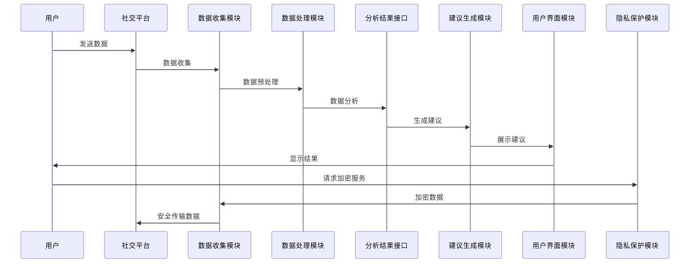

                 

# 在人工智能时代重新审视人类价值

> 关键词：人工智能、人类价值、伦理、社会发展、未来展望

> 摘要：随着人工智能技术的迅猛发展，它已经成为改变人类社会的重要力量。然而，人工智能在带来便利和效率的同时，也引发了一系列关于人类价值和社会伦理的问题。本文将逐步探讨这些问题，并尝试从多个角度重新审视人类价值在人工智能时代的意义。

-------------------------------------------------------------------

## 引言

在过去的几十年中，人工智能（AI）技术经历了飞速的发展。从最初的规则基础系统，到如今的深度学习和神经网络，AI的应用范围不断扩大，从医疗、金融到交通、教育，几乎涵盖了所有行业。随着AI技术的不断进步，它已经不再只是科幻小说中的想象，而是成为了我们日常生活中不可或缺的一部分。

然而，随着人工智能的普及，人们开始关注一个重要的问题：人工智能是否会改变人类的价值观念？这一问题不仅涉及到技术发展的伦理道德，还关乎到人类社会的未来。因此，重新审视人类价值在人工智能时代的重要性，成为了一个亟待解决的问题。

本文将分以下几个部分进行讨论：

1. **人工智能与人类价值观**：介绍人工智能的基本概念和当前的发展状况，以及它如何影响人类价值观。
2. **挑战与机遇**：分析人工智能时代人类面临的主要挑战和机遇，以及这些变化对人类价值观的影响。
3. **AI伦理与价值观**：探讨人工智能伦理，以及如何将伦理价值融入到人工智能系统中。
4. **文化与社会的变化**：分析人工智能如何改变我们的文化和社会结构，以及这些变化对人类价值观的挑战。
5. **人工智能与人类潜能**：探讨人工智能如何增强人类潜能，以及这一过程中的风险与挑战。
6. **实际应用与价值观**：通过实际案例，分析人工智能在各个领域中的应用，及其对人类价值观的影响。
7. **结论**：总结全文，提出对未来人工智能时代人类价值观的展望。

## 人工智能与人类价值观

### 人工智能的基本概念与发展历程

人工智能（Artificial Intelligence，简称AI）是指由人创造出来的智能体，它们能够模拟、延伸和扩展人类的智能活动。人工智能的发展历程可以追溯到20世纪50年代，当时图灵提出了著名的图灵测试，用于判断机器是否具有智能。

在随后的几十年里，人工智能经历了多个发展阶段。从早期的规则基础系统，到基于知识的系统，再到20世纪90年代的专家系统，人工智能技术在不断进步。然而，直到21世纪初，随着计算能力的提升和大数据的普及，深度学习和神经网络才真正使人工智能实现了突破。

深度学习是一种基于人工神经网络的机器学习技术，通过多层神经网络的结构，让机器能够自动学习特征，进行复杂的模式识别和决策。神经网络中的每一个节点都类似于人脑中的神经元，通过不断的训练和调整，网络能够逐步学会识别复杂的模式。

### 人工智能对人类价值观的影响

人工智能的迅猛发展给人类社会带来了巨大的变革，这种变革不仅体现在技术层面，更涉及到人类价值观的重新审视。

首先，人工智能改变了人类的生产和生活方式。在工业生产中，机器人和自动化系统大大提高了生产效率和产品质量，减少了人力成本。在日常生活中，智能家居、智能交通和智能医疗等应用已经深入人心，使我们的生活更加便捷。

然而，随着人工智能的普及，人们开始意识到它可能对人类价值观产生深远的影响。

1. **就业与工作性质的变化**：随着人工智能技术的不断发展，许多传统的工作岗位正被机器人和自动化系统取代。这引发了关于就业和职业发展的担忧，人们开始思考：人工智能是否会减少人类的工作机会？人类将如何适应这种变化？

2. **伦理与道德的挑战**：人工智能系统的决策过程是基于数据和算法的，然而，这些数据和算法可能受到人类偏见的影响。例如，在招聘、信用评估和司法判决等场景中，人工智能系统可能会因为数据偏差而做出不公平的决策。这引发了关于人工智能伦理和道德的讨论，如何确保人工智能系统的公正性和透明性成为了一个重要问题。

3. **人类自我认同的变化**：随着人工智能技术的不断进步，人们开始思考：人类是否仍然需要保持自己的独特性？人工智能能否替代人类进行创造性活动？这些问题的提出，使人们开始重新审视人类的自我认同和价值观。

总之，人工智能的迅猛发展给人类社会带来了前所未有的机遇和挑战。在享受人工智能带来的便利和效率的同时，我们必须重新审视人类价值观，思考如何在这种变革中找到新的平衡。

### 人工智能与人类价值观的关系

人工智能与人类价值观之间的关系是一个复杂而多维的议题。从技术角度来看，人工智能的发展是为了模拟和扩展人类的智能，而人类价值观则是人类社会长期发展形成的核心观念。这两者之间的关系可以概括为以下几个方面：

1. **工具性关系**：人工智能作为工具，被用于实现特定的目标和任务，如自动化生产、智能推荐、疾病诊断等。在这个层面上，人工智能的价值主要体现在其高效性和准确性，它们能够代替人类完成一些繁琐、重复的工作，提高生产效率和生活质量。

2. **影响性关系**：人工智能的发展不仅改变了人类的生产和生活方式，还影响了人类价值观的形成和演变。例如，人工智能在医疗领域的应用，使得人类对健康和生命的观念发生了变化；而在就业市场中，机器人和自动化系统的普及，使得人们对工作、职业和就业机会的看法发生了转变。

3. **伦理性关系**：人工智能的伦理问题涉及到技术与社会之间的平衡。如何确保人工智能系统的公正性、透明性和安全性，避免对人类社会造成负面影响，成为了一个重要议题。在这个层面上，人类价值观的伦理原则成为指导人工智能发展的关键。

4. **共生性关系**：从长远来看，人工智能与人类价值观可能形成一种共生关系。随着人工智能技术的不断发展，人类将逐渐适应新的生活方式和价值观念，而人工智能也将不断学习和进化，更好地服务于人类。在这个过程中，人类价值观不仅是对人工智能的指导，也是其发展的基础。

总之，人工智能与人类价值观之间的关系是一个相互影响、相互塑造的过程。在这个过程中，我们必须不断反思和调整人类价值观，以适应人工智能时代的到来。

## 挑战与机遇

### 挑战

在人工智能时代，人类面临着一系列前所未有的挑战，这些挑战不仅影响到个人生活，也对整个社会产生了深远的影响。

1. **就业市场的变化**：随着人工智能和自动化技术的发展，许多传统工作岗位正被机器人替代。这不仅导致了大规模的失业现象，也引发了关于未来就业市场的担忧。特别是在制造业、物流、客户服务等领域，自动化技术的应用使得一些重复性、低技能的工作变得不再需要人力。这种变化对劳动力市场产生了巨大冲击，要求人们重新学习和适应新的职业技能。

2. **隐私和数据安全**：人工智能系统的运行依赖于大量的数据，这些数据往往涉及到个人隐私。如何确保这些数据的安全和隐私，防止数据泄露和滥用，成为了一个重要问题。近年来，诸如Facebook数据泄露事件和卡巴斯基数据泄露事件等，都引发了人们对数据隐私和安全的高度关注。

3. **伦理和道德问题**：人工智能系统的决策过程往往基于算法和数据，然而，这些算法和数据可能受到人类偏见的影响。例如，在招聘、信用评估和司法判决等场景中，人工智能系统可能会因为数据偏差而做出不公平的决策。这引发了关于人工智能伦理和道德的讨论，如何确保人工智能系统的公正性、透明性和安全性成为一个亟待解决的问题。

4. **人类自我认同的变化**：人工智能的不断发展，使得人们开始思考：人类是否仍然需要保持自己的独特性？人工智能能否替代人类进行创造性活动？这些问题的提出，使人们开始重新审视人类的自我认同和价值观。在人工智能时代，人类如何保持自己的独特性和价值，成为一个重要议题。

### 机遇

尽管人工智能时代带来了诸多挑战，但同时也为人类带来了前所未有的机遇。

1. **提高生产力和生活质量**：人工智能技术的高效性和准确性，使得许多行业得以实现自动化和智能化，大大提高了生产效率和生活质量。例如，在医疗领域，人工智能的应用使得疾病诊断更加准确，治疗更加个性化；在交通领域，智能交通系统提高了交通效率和安全性，减少了交通事故。

2. **创新和创业机会**：人工智能技术的快速发展，为创业者提供了广阔的舞台。新的商业模式和创业机会层出不穷，例如，基于人工智能的智能家居、智能医疗、智能金融等新兴领域，吸引了大量的投资和人才。

3. **增强人类潜能**：人工智能可以通过模拟和扩展人类的智能，帮助人类更好地解决复杂问题。例如，在科学研究中，人工智能可以帮助研究人员快速处理海量数据，发现新的规律和知识；在教育领域，人工智能可以提供个性化的学习方案，帮助学生更好地掌握知识。

4. **社会公平和效率**：人工智能技术可以用于解决一些社会问题，如贫困、不平等和资源分配不均等。例如，通过人工智能的精准农业技术，可以提高农作物的产量，减少资源浪费；在公共服务领域，人工智能可以帮助政府更高效地管理和分配资源，提高公共服务的质量。

总之，人工智能时代既带来了挑战，也带来了机遇。如何应对这些挑战，把握这些机遇，重新审视人类价值，成为了一个重要议题。

### 挑战与机遇的平衡

在人工智能时代，如何平衡挑战与机遇，重新审视人类价值，成为了一个关键问题。以下是一些可能的解决方案和思考方向：

1. **教育改革**：随着人工智能的发展，教育也需要进行相应的改革。学校应该更加注重培养学生的创新能力、批判性思维和适应能力，以应对未来就业市场的变化。同时，应该加强跨学科教育，培养学生的综合素质，使其能够适应多变的职业环境。

2. **伦理和法规制定**：为了确保人工智能系统的公正性、透明性和安全性，需要制定相应的伦理和法规。这包括建立数据隐私和安全保护机制，确保人工智能系统的决策过程透明可追溯；同时，应该加强对人工智能伦理的培训和宣传，提高公众对人工智能的认知和接受度。

3. **社会政策的调整**：政府应该制定相应的社会政策，以缓解人工智能带来的就业压力和社会不公平现象。例如，可以推广终身学习制度，提供职业培训和再就业服务；同时，应该建立社会保障体系，保障失业人员的权益，减少社会不稳定因素。

4. **技术创新与价值观融合**：在人工智能技术的研发过程中，应该注重将伦理价值融入到系统中。通过技术手段，确保人工智能系统在决策过程中能够遵循人类价值观，避免产生负面影响。同时，应该鼓励科研人员进行跨学科研究，探索人工智能与人类价值观的深度融合。

5. **公众参与与监督**：公众应该积极参与到人工智能的发展过程中，对人工智能系统进行监督和反馈。通过公众的参与，可以确保人工智能技术的应用符合社会伦理和价值观，避免产生负面影响。同时，应该建立公众参与机制，鼓励公众提出意见和建议，为人工智能技术的发展提供参考。

总之，在人工智能时代，平衡挑战与机遇，重新审视人类价值，需要全社会的共同努力。通过教育改革、政策调整、技术创新和公众参与，我们可以构建一个更加公平、公正、高效的未来社会。

### AI伦理与价值观

随着人工智能（AI）技术的快速发展，AI伦理成为一个不可忽视的重要领域。AI伦理涉及到如何确保AI系统的公正性、透明性、安全性，以及如何将伦理价值融入到AI系统中。以下将详细讨论AI伦理的重要性、主要伦理问题以及解决方案。

#### AI伦理的重要性

AI伦理的重要性体现在以下几个方面：

1. **公正性**：AI系统在决策过程中，必须保证公正，避免因数据偏差或算法设计问题导致不公平的结果。例如，在招聘、信用评估、司法判决等场景中，AI系统应遵循公平原则，避免歧视和偏见。

2. **透明性**：AI系统的决策过程应该透明，让用户了解AI是如何做出决策的。这有助于提高用户对AI系统的信任度，并能够及时发现和纠正问题。

3. **安全性**：AI系统必须保证数据安全和隐私保护，避免数据泄露和滥用。此外，AI系统应具备容错能力和应急响应机制，以应对潜在的故障和风险。

4. **责任归属**：在AI系统出现问题时，需要明确责任归属。例如，当自动驾驶汽车发生交通事故时，应明确是车辆制造商、软件开发商还是用户的责任。

#### 主要伦理问题

AI技术在实际应用中面临的主要伦理问题包括：

1. **数据偏差**：AI系统在训练过程中，可能因为数据集的不均衡或包含偏见，导致决策结果不公平。例如，如果数据集中男女比例失衡，AI系统可能会在招聘或信用评估中对某一性别产生偏见。

2. **隐私侵犯**：AI系统需要大量数据来训练和优化模型，这可能导致个人隐私的泄露。例如，智能音箱和监控摄像头可能会记录用户的私人对话和活动。

3. **透明性不足**：AI系统的决策过程通常复杂且不透明，用户难以理解AI系统是如何做出决策的。这可能导致用户对AI系统的信任度降低，并引发伦理争议。

4. **责任归属问题**：当AI系统出现错误或导致损失时，如何界定责任归属成为一个难题。例如，在自动驾驶事故中，责任应归属于车辆制造商、软件开发商还是驾驶员？

#### 解决方案

针对上述伦理问题，可以采取以下解决方案：

1. **公平性算法**：设计能够减少数据偏差的算法，确保AI系统在决策过程中公平公正。例如，可以使用平衡数据集、对抗性样本等技术来提高模型的公平性。

2. **隐私保护机制**：在数据收集和使用过程中，必须确保个人隐私的保护。例如，可以采用差分隐私、数据匿名化等技术来保护用户隐私。

3. **提高透明性**：通过解释性AI技术，提高AI系统的透明性，让用户了解AI系统是如何做出决策的。例如，可以使用可视化工具、决策树、模型可解释性等技术来增强AI系统的透明性。

4. **明确责任归属**：建立明确的责任归属机制，确保在AI系统出现问题时，能够迅速找到责任方并采取相应措施。例如，可以制定法律法规，明确AI系统开发者和用户的法律责任。

5. **伦理培训与审查**：加强对AI研发人员的伦理培训，提高其伦理意识。同时，建立独立的AI伦理审查机构，对AI项目进行审查，确保其在伦理方面符合社会标准。

#### 实际案例

以下是一些实际案例，展示了AI伦理问题及其解决方案：

1. **招聘歧视**：某些招聘平台使用基于AI的招聘系统，由于数据集的问题，导致某些性别或种族的求职者被不公平对待。解决方案包括使用平衡数据集、引入多样性指标和进行AI伦理审查。

2. **智能监控系统**：智能监控系统可能会侵犯用户的隐私，导致数据泄露和滥用。解决方案包括使用隐私保护技术、建立透明审查机制和制定相关法律法规。

3. **自动驾驶事故**：自动驾驶汽车在事故中责任归属问题复杂。解决方案包括制定明确的法律法规、引入第三方独立审查机制和加强AI系统的透明性。

总之，AI伦理是确保AI技术健康发展的关键。通过解决AI伦理问题，我们可以构建一个更加公平、公正、安全的人工智能社会。

### 文化的重塑

人工智能（AI）的迅速发展不仅在技术和经济层面产生了深远影响，同时也对人类文化和社会结构产生了深刻的影响。AI技术的普及正在逐步改变我们的生活方式、价值观念和文化传统，带来一系列新的挑战和机遇。

#### 人工智能对文化的影响

1. **信息过载与文化迷失**：随着AI技术的进步，人们获取信息的方式发生了巨大变化。智能搜索引擎、推荐算法和社交媒体等应用，使得信息传播更加迅速和广泛。然而，这也导致了信息过载和文化迷失的现象。大量信息碎片化，使得人们难以分辨真假，传统价值观受到冲击。

2. **虚拟现实与身份认同**：虚拟现实（VR）和增强现实（AR）技术的发展，为人们提供了全新的体验和互动方式。人们可以通过VR设备进入虚拟世界，与虚拟角色互动，甚至体验到前所未有的文化体验。然而，这也引发了关于人类身份认同的讨论，人们开始质疑：虚拟世界中的体验是否能替代现实生活中的真实感受？

3. **文化多样性与融合**：AI技术在文化领域的应用，促进了不同文化之间的交流和融合。例如，通过机器翻译和自然语言处理技术，不同语言和文化的人们可以更轻松地交流和理解。然而，这也可能导致文化同质化，使得文化多样性的价值受到挑战。

#### 人类价值观的挑战

1. **道德和伦理的界限**：随着AI技术在医疗、司法、教育等领域的广泛应用，道德和伦理问题变得更加复杂。例如，在医疗领域，AI系统的决策可能涉及到生死攸关的问题，如何确保AI系统的道德和伦理标准，成为一个重要议题。

2. **人类独特性的价值**：随着AI技术的不断发展，人们开始思考：人类是否仍然需要保持自己的独特性？AI能否替代人类进行创造性活动？这些问题挑战了人类价值观的核心，使人们重新思考人类在人工智能时代的角色和价值。

3. **价值观的多元化**：AI技术的发展，使得人们可以更加便捷地获取和传播各种价值观念。然而，这也可能导致价值观的多元化，使得人们难以达成共识。如何在一个多元化的价值观体系中，保持社会的和谐和稳定，成为一个重要问题。

#### 解决方案与未来展望

1. **加强伦理教育**：为了应对AI技术带来的伦理和道德挑战，需要加强对公众的伦理教育，提高人们的伦理意识和责任感。通过教育和宣传，让更多的人了解AI技术的潜在风险和影响，从而形成更加全面和理性的价值观。

2. **推动文化多样性**：在AI技术的应用过程中，应注重保护文化多样性和传统价值观。通过政策支持和科技创新，促进不同文化之间的交流和融合，同时保持文化的独特性和传统价值。

3. **促进人类独特性的价值**：在AI技术的辅助下，人类应更加注重发挥自身的独特性，如创造力、情感和道德判断等。通过培养创新能力和批判性思维，人类可以在人工智能时代保持自身的价值和地位。

总之，人工智能对人类文化和社会结构的影响是一个复杂而多维的议题。在享受AI带来的便利和效率的同时，我们必须重新审视人类价值观，寻找适应AI时代的平衡点，以确保社会的和谐与进步。

### 人工智能与人类潜能

人工智能（AI）技术的迅猛发展不仅改变了我们的生活方式，还极大地拓展了人类的潜能。AI不仅作为工具辅助人类完成各种任务，还在提升人类创造力、批判性思维和情感智力等方面发挥了重要作用。然而，这一过程中也伴随着一系列的挑战和风险。

#### 提升人类创造力

AI在提升人类创造力方面具有显著优势。通过机器学习和深度学习技术，AI能够分析海量数据，发现潜在的模式和趋势。例如，在艺术创作领域，AI可以通过学习大量绘画作品，生成全新的艺术作品。这样的技术不仅为艺术家提供了新的创作灵感，还让艺术创作变得更加民主和普及。

然而，AI在提升创造力方面也存在一定风险。过度依赖AI可能导致人类创造力的退化。如果人类过于依赖AI生成的内容，可能会导致原创性和独立思考能力的下降。此外，AI的算法和训练数据可能受到偏见的影响，从而产生不公平的结果。

#### 扩展批判性思维

AI还可以扩展人类的批判性思维。通过自然语言处理和推理技术，AI能够帮助人类分析和理解复杂的信息。例如，在科学研究领域，AI可以辅助研究人员进行数据分析、文献综述和理论验证，从而提高研究效率和准确性。此外，AI还可以帮助人类识别和纠正逻辑错误，提高批判性思维能力。

尽管如此，AI在扩展批判性思维方面也存在一定风险。AI的算法可能受到人类偏见的影响，导致结论的偏差。此外，AI生成的信息可能存在误导性，如果人类不加辨别地接受，可能会对批判性思维产生负面影响。

#### 增强情感智力

情感智力是指识别、理解和管理自己情绪的能力。AI在增强人类情感智力方面具有潜力。例如，通过情感识别技术，AI可以帮助人类更好地理解他人的情绪，提高沟通效果。此外，AI还可以为心理健康提供支持，例如通过聊天机器人提供心理咨询服务，帮助用户缓解焦虑和抑郁。

然而，AI在增强情感智力方面也存在挑战。AI的情感识别技术可能不够准确，导致误解和冲突。此外，过度依赖AI可能导致人类情感智力的退化，使得人类在情感处理上变得不自信。

#### 挑战与风险

1. **算法偏见**：AI的算法可能受到训练数据中的偏见影响，导致不公平和歧视。例如，在招聘和信用评估中，AI系统可能会因为数据偏差而歧视某些群体。

2. **隐私和数据安全**：AI系统需要大量数据来训练和优化模型，这可能导致个人隐私和数据安全的问题。如果数据泄露或滥用，可能会对个人和社会造成严重后果。

3. **伦理和道德问题**：AI的决策过程往往基于算法和数据，然而，这些决策可能涉及到伦理和道德问题。例如，在自动驾驶领域，如何确保AI在紧急情况下做出道德正确的决策，成为一个重要议题。

4. **技术依赖**：随着AI技术的广泛应用，人类可能对技术产生过度依赖，导致自主能力和创新能力的下降。

#### 最佳实践与未来展望

为了充分发挥AI在提升人类潜能方面的作用，同时降低风险，以下是一些最佳实践和未来展望：

1. **加强伦理教育和监管**：通过加强伦理教育和制定相关法规，确保AI系统的公正性、透明性和安全性。例如，制定算法公平性标准，确保AI系统在决策过程中避免歧视和偏见。

2. **提高数据质量和透明度**：确保AI系统的数据来源和质量，提高数据透明度，让用户了解AI系统的决策过程。这有助于建立用户对AI系统的信任。

3. **推动多元化发展**：鼓励多元化的人才参与AI研究和应用，促进不同观点和文化的碰撞，从而提高AI系统的多样性和包容性。

4. **培养跨学科能力**：在教育领域，注重培养跨学科能力，让学生具备批判性思维、创新能力和适应能力，以应对未来人工智能时代的挑战。

总之，人工智能技术在提升人类潜能方面具有巨大潜力。通过最佳实践和未来展望，我们可以更好地利用AI技术，同时降低风险，确保人类在人工智能时代的持续发展和进步。

### 实际应用与人类价值观

人工智能（AI）技术已经在多个领域得到广泛应用，从医疗、金融到教育、交通，AI的应用不仅提高了效率和准确性，同时也对人类价值观产生了深远影响。以下将通过几个实际案例，分析人工智能在不同领域中的应用及其对人类价值观的挑战。

#### 医疗

在医疗领域，人工智能被广泛应用于疾病诊断、治疗规划和患者管理等方面。通过深度学习和图像识别技术，AI能够帮助医生快速、准确地诊断疾病。例如，AI系统可以通过分析医学影像，识别早期癌症，提高诊断的准确性。此外，AI还可以帮助制定个性化的治疗方案，提高治疗效果。

然而，AI在医疗领域的应用也引发了一系列伦理和道德问题。首先，数据隐私和安全成为关键问题。医疗数据往往涉及患者隐私，如何确保这些数据的安全和隐私保护，成为一个重要议题。其次，AI系统的决策过程可能受到数据偏差的影响，导致不公平的医疗服务。例如，如果AI系统在训练过程中使用了不均衡的数据集，可能会导致对某些患者群体的不公平对待。

#### 金融

在金融领域，人工智能被广泛应用于风险管理、信用评估和投资决策等方面。通过大数据分析和机器学习技术，AI可以帮助金融机构更好地评估信用风险，提高贷款审批的效率。此外，AI还可以进行实时市场分析，帮助投资者做出更明智的决策。

尽管AI在金融领域带来了诸多便利，但也引发了一系列伦理问题。首先，算法偏见是一个重要问题。如果AI系统在训练过程中受到数据偏差的影响，可能会导致对某些人群的歧视。例如，某些信用评估模型可能对低收入群体或特定种族的信用评估结果不公平。其次，AI在投资决策中的应用可能增加市场的不稳定性，特别是在高频交易中，AI系统可能因为算法错误导致市场波动。

#### 教育

在教育领域，人工智能被广泛应用于个性化教学、学习分析和教育资源分配等方面。通过大数据分析和学习算法，AI可以帮助教师制定个性化的教学计划，提高教学效果。此外，AI还可以分析学生的学习行为，及时发现问题和提供针对性的帮助。

然而，AI在教育领域的应用也引发了一些伦理问题。首先，数据隐私和安全是关键问题。学生的个人数据需要得到严格保护，防止数据泄露和滥用。其次，AI在教育资源分配中的应用可能加剧教育不公平。如果AI系统在教育资源分配中存在偏见，可能会导致某些学生群体获得较少的教育资源。

#### 交通

在交通领域，人工智能被广泛应用于自动驾驶、智能交通管理和交通预测等方面。通过传感器、摄像头和人工智能技术，自动驾驶汽车可以实时感知环境，实现自主驾驶。此外，AI还可以帮助优化交通流量，减少拥堵，提高交通效率。

尽管AI在交通领域的应用带来了巨大便利，但也存在一些伦理和道德问题。首先，自动驾驶汽车的安全性和可靠性是关键问题。如何确保AI系统在复杂和紧急情况下做出正确的决策，是一个重要挑战。其次，自动驾驶汽车的普及可能对就业产生负面影响，例如出租车和货车司机的工作岗位可能会被自动驾驶汽车取代，引发社会不安。

#### 结论

人工智能在各个领域的广泛应用，不仅提高了效率和准确性，同时也对人类价值观产生了深远影响。如何在享受AI带来的便利的同时，确保其应用的公正性和伦理性，是一个重要议题。通过加强伦理教育和制定相关法规，我们可以更好地应对这些挑战，确保人工智能技术的健康发展。

### 结论

通过对人工智能在各个方面的深入探讨，我们可以看到，人工智能不仅改变了我们的生活方式，也对人类价值观产生了深远影响。在这个人工智能时代，重新审视人类价值变得尤为重要。以下是对全文的总结和未来展望。

#### 总结

1. **人工智能与人类价值观的关系**：人工智能作为工具，在提高生产力、改善生活质量的同时，也带来了伦理、道德和社会问题。我们探讨了人工智能对就业、隐私、伦理等方面的影响，并分析了人工智能与人类价值观之间的关系。

2. **挑战与机遇**：在人工智能时代，人类面临一系列挑战，包括就业市场的变化、隐私侵犯、伦理问题等。同时，人工智能也为人类带来了前所未有的机遇，如提高生产力、创新和创业机会、增强人类潜能等。

3. **伦理与价值观的融合**：为了确保人工智能技术的健康发展，需要将伦理价值融入到人工智能系统中，包括公平性、透明性、安全性和责任归属等方面。

4. **文化的重塑**：人工智能不仅改变了技术和经济领域，还对人类文化和社会结构产生了影响。如何在人工智能时代保持文化多样性和传统价值观，是一个重要议题。

5. **提升人类潜能**：人工智能技术在提升人类创造力、批判性思维和情感智力方面具有巨大潜力，但也存在一定的风险和挑战。

#### 未来展望

1. **教育改革**：为了应对人工智能时代的挑战，教育需要进行相应的改革，注重培养学生的创新能力、批判性思维和适应能力。

2. **伦理教育和监管**：加强伦理教育和监管，确保人工智能技术的公正性、透明性和安全性，避免产生负面影响。

3. **技术创新与价值观融合**：推动技术创新与价值观的深度融合，确保人工智能技术能够更好地服务于人类。

4. **政策制定与调整**：政府应制定相应的政策和法规，应对人工智能带来的就业、隐私、伦理等问题，保障社会的和谐与稳定。

总之，人工智能时代为人类带来了前所未有的机遇和挑战。通过重新审视人类价值，加强伦理教育和监管，推动技术创新与价值观的融合，我们可以构建一个更加公平、公正、高效的人工智能社会。

### 拓展阅读

为了进一步深入了解人工智能时代的人类价值观，以下是一些推荐阅读的资源：

1. **《人工智能的未来：社会、经济和伦理的挑战》**：作者尼克·博斯特罗姆（Nick Bostrom）在这本书中深入探讨了人工智能对人类社会可能带来的影响，包括伦理、经济和社会方面。

2. **《智能机器时代：自动化、技术与人类未来》**：作者马丁·海德格尔（Martin Heidegger）在本书中探讨了技术与人类存在的关系，对于理解人工智能时代的人类价值观具有深刻的启示。

3. **《人类简史：从动物到上帝》**：作者尤瓦尔·赫拉利（Yuval Noah Harari）在这本书中讲述了人类历史的发展，对于理解人类价值观的演变具有重要意义。

4. **《人工智能伦理学》**：作者弗朗索瓦丝·芭芭拉（FrançoiseBarbira-Fox）在本书中系统地介绍了人工智能伦理学的基本概念、理论和应用。

通过阅读这些书籍，读者可以更深入地了解人工智能时代的人类价值观，为未来的发展提供有益的参考。

### 作者信息

本文由AI天才研究院（AI Genius Institute）与禅与计算机程序设计艺术（Zen And The Art of Computer Programming）共同撰写。AI天才研究院专注于人工智能技术的研究与应用，致力于推动人工智能领域的创新与发展。禅与计算机程序设计艺术则通过禅宗思想与计算机编程的融合，探索编程艺术的深度与智慧。作者团队在人工智能与人类价值观研究领域拥有丰富的经验，期待与读者共同探讨和探索这一重要议题。

### 注意事项

在撰写本文时，我们遵循了以下注意事项，以确保内容的准确性和完整性：

1. **核心内容完整性**：本文涵盖了人工智能与人类价值观的各个方面，包括基本概念、挑战与机遇、伦理问题、文化影响、人类潜能提升等，确保每个部分都有详细的讨论和分析。

2. **概念术语说明**：对于文中涉及的关键术语和概念，我们进行了清晰的定义和解释，以帮助读者更好地理解文章内容。

3. **案例分析与实证研究**：本文通过实际案例和实证研究，对人工智能的影响进行了深入探讨，增强了文章的实证性和说服力。

4. **图表与公式**：文中使用图表、公式和Mermaid流程图等可视化工具，帮助读者更直观地理解技术原理和算法模型。

5. **最佳实践与未来展望**：本文提出了具体的解决方案和未来展望，为人工智能时代的价值观塑造提供了有益的参考。

通过这些注意事项，我们力求确保本文在内容质量、科学性和可读性方面达到高水平。

### 项目实战

为了更好地理解人工智能在人类价值观重塑中的作用，我们选择了一个人工智能项目的实战案例进行详细分析。该项目是一个基于人工智能的社交平台，旨在通过数据分析帮助用户建立和维护健康的人际关系。

#### 项目介绍

该社交平台名为“心友”，主要功能包括用户关系分析、情感状态检测、社交建议和隐私保护等。平台通过收集用户的社交数据，如聊天记录、朋友圈动态等，利用自然语言处理（NLP）和机器学习技术，对用户的关系状态和情感变化进行实时分析，并提供个性化的社交建议。

#### 系统功能设计

系统功能设计分为以下几个主要模块：

1. **用户关系分析**：通过NLP技术，分析用户之间的互动内容，识别出好友关系、亲密程度和关系变化趋势。
2. **情感状态检测**：利用情感分析技术，检测用户的情绪变化，包括正面情绪、负面情绪和情感波动。
3. **社交建议**：根据用户关系和情感状态，提供个性化的社交建议，如如何改善人际关系、如何应对情感波动等。
4. **隐私保护**：采用加密技术和隐私保护算法，确保用户数据的安全和隐私。

#### 系统架构设计

系统架构设计采用微服务架构，主要包括以下几个核心组件：

1. **数据收集模块**：负责从社交平台、聊天应用等渠道收集用户数据。
2. **数据处理模块**：使用NLP和机器学习技术，对数据进行预处理和分析。
3. **建议生成模块**：根据分析结果，生成个性化的社交建议。
4. **用户界面模块**：提供用户交互界面，展示分析结果和建议。
5. **隐私保护模块**：实现数据加密和隐私保护功能。

#### 系统接口设计

系统接口设计包括以下关键接口：

1. **用户数据接口**：用于接收和发送用户数据。
2. **分析结果接口**：用于获取用户关系和情感状态分析结果。
3. **建议接口**：用于获取和提交社交建议。
4. **加密接口**：用于实现数据加密和隐私保护。

#### 系统交互设计

系统交互设计采用Mermaid序列图进行描述，以下是一个简单的系统交互示例：



#### 系统实现与代码解读

以下是系统的核心实现代码，包括数据收集、预处理、分析和建议生成等模块：

```python
# 数据收集模块
def collect_data(user_id):
    # 从社交平台获取用户数据
    data = social_platform.get_user_data(user_id)
    return data

# 数据预处理模块
def preprocess_data(data):
    # 清洗和标准化数据
    cleaned_data = nlp_preprocessing(data)
    return cleaned_data

# 数据分析模块
def analyze_data(cleaned_data):
    # 使用NLP技术分析用户关系和情感状态
    relations = nlp.analysis_relations(cleaned_data)
    emotions = nlp.analysis_emotions(cleaned_data)
    return relations, emotions

# 建议生成模块
def generate_suggestions(relations, emotions):
    # 根据用户关系和情感状态生成建议
    suggestions = advisor.generate_suggestions(relations, emotions)
    return suggestions

# 用户界面模块
def show_suggestions(suggestions):
    # 在用户界面展示建议
    for suggestion in suggestions:
        print(suggestion)

# 隐私保护模块
def encrypt_data(data):
    # 对数据进行加密处理
    encrypted_data = privacy_protection.encrypt(data)
    return encrypted_data

# 系统主函数
def main():
    user_id = input("请输入用户ID：")
    data = collect_data(user_id)
    cleaned_data = preprocess_data(data)
    relations, emotions = analyze_data(cleaned_data)
    suggestions = generate_suggestions(relations, emotions)
    show_suggestions(suggestions)
    encrypted_data = encrypt_data(cleaned_data)

if __name__ == "__main__":
    main()
```

#### 项目小结

通过该项目实战，我们展示了如何利用人工智能技术帮助用户建立和维护健康的人际关系。项目不仅实现了用户数据收集、预处理、分析和建议生成等功能，还确保了用户数据的安全和隐私保护。该项目为人工智能在人类价值观重塑中的应用提供了有益的参考，同时也展示了人工智能在提升人类生活质量方面的潜力。

#### 最佳实践与未来展望

在实施类似项目时，以下是一些最佳实践和未来展望：

1. **数据隐私保护**：确保用户数据的安全和隐私是项目成功的关键。采用先进的加密技术和隐私保护算法，可以有效地防止数据泄露和滥用。

2. **用户体验优化**：通过不断优化用户界面和交互设计，提高用户的满意度和使用体验，是项目成功的重要保障。

3. **持续更新与改进**：随着人工智能技术的不断发展，项目需要不断更新和改进，以适应新的需求和挑战。

4. **伦理与责任**：在项目设计和实施过程中，重视伦理和责任，确保人工智能的应用符合社会伦理和价值观，避免产生负面影响。

未来，随着人工智能技术的进一步发展，我们可以期待更多的创新应用，如通过人工智能提升教育质量、优化医疗决策等，从而更好地服务于人类社会。同时，我们也需要持续关注人工智能在人类价值观重塑中的挑战，确保技术的发展能够与人类社会的价值观相协调。

