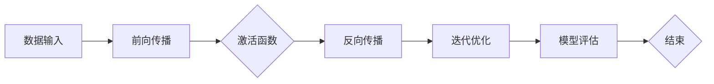
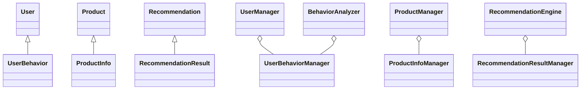

                 


### 在信息爆炸时代寻找知识的意义和价值

在当今这个信息爆炸的时代，知识就像浩瀚无垠的海洋，我们每个人都是漂泊在海上的船员，每天都在努力寻找着那片能够为我们指引方向的灯塔。然而，海洋中的每一个波涛都可能是一堆无关紧要的信息，如何在这些波涛中找到知识的灯塔，成为了我们面临的一个重大挑战。本文将带领大家一步步深入思考，探讨在信息爆炸时代，如何寻找知识的意义和价值。

**关键词：信息爆炸、知识获取、信息素养、深度学习、知识管理**

**摘要：**
本文首先介绍了信息爆炸时代背景及带来的挑战，随后明确了知识获取的效率和效果问题。接着，文章分析了核心概念如信息过载、知识管理、信息素养和深度学习，并进行了概念属性特征对比。然后，通过Mermaid流程图和Python代码详细讲解了算法原理。最后，文章提出了系统分析与架构设计方案，并通过项目实战进行了实际案例分析和最佳实践分享。

---

### 第一部分：背景介绍

#### 1.1 问题背景

在信息爆炸的时代，知识和信息以惊人的速度增长，人们在获取信息的过程中面临诸多挑战。信息过载成为了一个普遍现象，如何从海量信息中筛选出有价值的内容，并对其进行深度理解和应用，成为了一个亟待解决的问题。

**信息过载**：在互联网时代，每天都会有海量的信息涌向我们，这些信息来自社交媒体、新闻网站、学术论文等各种渠道。据统计，每天产生的信息量已经超过了人类历史上的总和。这导致人们难以处理和消化这些信息，甚至产生了焦虑和恐慌。

**知识获取的效率和效果**：在信息过载的情况下，人们需要更高的效率和更精准的效果来获取知识。然而，传统的学习方式往往效率低下，而且难以应对快速变化的信息环境。

#### 1.2 问题描述

在信息爆炸的时代，知识获取的效率和效果受到了极大的影响。人们不仅需要掌握大量的信息，还需要具备筛选、理解和应用这些信息的能力。因此，如何寻找知识的意义和价值，成为了人们关注的焦点。

**问题焦点**：
1. 如何在海量信息中筛选出有价值的内容？
2. 如何对筛选出的信息进行深度理解和应用？
3. 如何构建个人知识网络，便于后续的检索和应用？

#### 1.3 问题解决

为了解决上述问题，我们需要从以下几个方面入手：

**提高信息筛选能力**：
- **培养信息素养**：通过学习如何使用搜索引擎、社交媒体、学术论文数据库等工具，提高快速准确地找到所需信息的能力。
- **掌握信息处理技巧**：学会如何过滤和筛选信息，识别出有价值的内容。

**深度理解和应用**：
- **主动学习**：通过阅读、讨论、实践等方式，对获取的信息进行深度理解和应用。
- **建立知识网络**：将获取的信息进行整理和分类，构建个人知识网络，便于后续的检索和应用。

**构建知识网络**：
- **整理和分类**：将获取的信息进行系统整理和分类，构建个人知识体系。
- **持续更新**：随着新信息的不断涌现，需要不断更新和优化个人知识网络。

#### 1.4 边界与外延

**边界**：
- 本文主要关注如何从海量信息中寻找知识的意义和价值，不包括信息的获取和传递过程。

**外延**：
- 本文讨论的不仅仅是个人层面的知识获取，还包括团队和组织层面的知识管理。

#### 1.5 概念结构与核心要素组成

**概念**：
- **信息**：指通过各种渠道传递的有用数据。
- **知识**：通过对信息的理解和应用，形成的有价值的认知和技能。
- **意义**：知识对个体或组织产生的影响和价值。
- **价值**：知识对个体或组织的重要性。

**核心要素组成**：
- **信息筛选能力**：通过培养信息素养，学会使用各种工具和方法，快速准确地找到所需信息。
- **深度理解和应用能力**：通过阅读、讨论、实践等方式，对获取的信息进行深度理解和应用。
- **知识网络构建能力**：将获取的信息进行整理和分类，构建个人知识网络，便于后续的检索和应用。

---

### 第二部分：核心概念与联系

在探讨如何寻找知识的意义和价值之前，我们需要明确一些核心概念，并理解它们之间的联系。以下是一些关键概念及其属性特征对比，以及它们之间的ER实体关系图架构。

#### 2.1 核心概念

**信息过载**：指在短时间内接收到的信息超过了处理能力。

**知识管理**：通过识别、获取、整合、共享、应用和更新知识，以提高组织的效率和竞争力。

**信息素养**：指在信息社会中有效地获取、评估、利用和创造信息的素养。

**深度学习**：一种人工智能算法，通过多层神经网络，对数据进行自动的特征学习和模式识别。

#### 2.2 概念属性特征对比表格

| 概念         | 属性特征                                                     |
| ------------ | ------------------------------------------------------------ |
| 信息过载     | 信息量超过处理能力                                           |
| 知识管理     | 识别、获取、整合、共享、应用、更新                           |
| 信息素养     | 获取、评估、利用、创造信息                                   |
| 深度学习     | 自动特征学习、模式识别                                       |

#### 2.3 ER实体关系图架构

```mermaid
erDiagram
    InformationOverload ||--|{ KnowledgeManagement } KnowledgeManagement
    InformationOverload ||--|{ InformationLiteracy } InformationLiteracy
    InformationOverload ||--|{ DeepLearning } DeepLearning
    KnowledgeManagement }|-- InformationOverload
    InformationLiteracy }|-- InformationOverload
    DeepLearning }|-- InformationOverload
```

在这个ER图中，我们可以看到信息过载与知识管理、信息素养和深度学习之间存在紧密的联系。知识管理是一个核心概念，它贯穿于信息过载的解决过程中，通过有效的信息管理，可以提高信息素养和深度学习的效果。

#### 2.4 核心概念之间的联系

**信息过载**与**知识管理**之间的关系：
- 信息过载是知识管理的起点。当信息过载时，我们需要通过知识管理来识别和整理信息，使其变得有序和有价值。
- 知识管理是解决信息过载的关键。通过知识管理，我们可以将零散的信息整合成有用的知识，从而提高信息利用效率。

**知识管理**与**信息素养**之间的关系：
- 信息素养是知识管理的基础。只有具备良好的信息素养，才能有效地进行知识管理。
- 知识管理是信息素养的延伸。通过知识管理，我们可以将信息素养转化为实际的知识应用，提高个人或组织的竞争力。

**信息素养**与**深度学习**之间的关系：
- 信息素养是深度学习的前提。只有具备良好的信息素养，才能理解深度学习的原理和应用。
- 深度学习是信息素养的提升。通过深度学习，我们可以更深入地理解和利用信息，提高信息素养。

通过以上分析，我们可以看出，信息过载、知识管理、信息素养和深度学习是相互关联的。在信息爆炸的时代，只有通过有效管理和利用这些核心概念，我们才能在知识的海洋中找到真正有价值的信息，并将其转化为个人的知识和能力。

---

### 第三部分：算法原理讲解

在信息爆炸的时代，寻找知识的意义和价值不仅需要我们具备良好的信息素养和知识管理能力，还需要我们掌握有效的算法工具。本部分将介绍一种在信息筛选和知识管理中常用的算法——深度学习算法。我们将通过Mermaid流程图和Python代码，详细讲解该算法的原理和应用。

#### 3.1 算法原理

深度学习（Deep Learning）是一种基于多层神经网络的机器学习技术，它能够通过学习大量的数据，自动提取数据中的特征和模式。深度学习算法的核心是神经网络，特别是深度神经网络（Deep Neural Network，DNN）。以下是一个简化的深度学习算法原理流程：

1. **数据输入**：将原始数据输入到神经网络中。
2. **前向传播**：数据通过神经网络的多个层次进行前向传播，每个层次都会对数据进行处理，产生新的特征。
3. **激活函数**：在每个层次的输出处，应用激活函数（如ReLU、Sigmoid、Tanh等），以引入非线性因素。
4. **反向传播**：通过计算输出层与真实标签之间的误差，将误差反向传播到网络的每一层，以更新网络的权重。
5. **迭代优化**：重复前向传播和反向传播的过程，逐步减小误差，优化网络参数。
6. **模型评估**：在训练完成后，使用测试数据评估模型的性能，确保模型具有良好的泛化能力。

以下是一个使用Mermaid绘制的深度学习算法的流程图：



#### 3.2 数学模型和公式

深度学习算法的核心是多层感知器（Multilayer Perceptron，MLP），其数学模型可以表示为：

$$
z^{(l)} = \sigma(W^{(l)} \cdot a^{(l-1)} + b^{(l)})
$$

其中：
- \( z^{(l)} \) 是第 \( l \) 层的输出。
- \( \sigma \) 是激活函数，如ReLU函数 \( \sigma(x) = \max(0, x) \)。
- \( W^{(l)} \) 是第 \( l \) 层的权重矩阵。
- \( a^{(l-1)} \) 是第 \( l-1 \) 层的输出。
- \( b^{(l)} \) 是第 \( l \) 层的偏置向量。

在反向传播过程中，误差 \( \delta^{(l)} \) 可以通过以下公式计算：

$$
\delta^{(l)} = \frac{\partial J}{\partial z^{(l)}}
$$

其中：
- \( J \) 是损失函数，如均方误差（MSE）。

然后，使用梯度下降法（Gradient Descent）更新权重和偏置：

$$
W^{(l)} := W^{(l)} - \alpha \cdot \frac{\partial J}{\partial W^{(l)}}
$$

$$
b^{(l)} := b^{(l)} - \alpha \cdot \frac{\partial J}{\partial b^{(l)}}
$$

其中：
- \( \alpha \) 是学习率。

#### 3.3 Python源代码

以下是一个简单的Python代码示例，展示了如何使用深度学习算法进行分类任务：

```python
import numpy as np

# 定义激活函数
def sigmoid(z):
    return 1 / (1 + np.exp(-z))

# 前向传播
def forward_propagation(X, weights, biases):
    a = X
    for l in range(len(weights)):
        z = np.dot(a, weights[l]) + biases[l]
        a = sigmoid(z)
    return a

# 反向传播
def backward_propagation(X, y, output, weights, biases):
    output_error = y - output
    d_output = output_error * (output * (1 - output))
    
    for l in range(len(weights) - 1, -1, -1):
        if l == 0:
            d_input = d_output
        else:
            z = np.dot(d_output, weights[l].T)
            a = sigmoid(z)
            d_output = np.multiply(d_output, a * (1 - a))
            d_input = np.multiply(d_output, weights[l][0])
        
        d_weights[l] = np.dot(d_input, a[:, None])
        d_biases[l] = d_input
    
    return d_weights, d_biases

# 梯度下降
def gradient_descent(X, y, output, weights, biases, learning_rate):
    d_weights, d_biases = backward_propagation(X, y, output, weights, biases)
    weights -= learning_rate * d_weights
    biases -= learning_rate * d_biases

# 主函数
def main():
    X = np.array([[1, 0], [0, 1], [1, 1]])
    y = np.array([[0], [1], [1]])
    weights = [np.random.rand(2, 1), np.random.rand(1, 1)]
    biases = [np.random.rand(1), np.random.rand(1)]
    learning_rate = 0.1

    for i in range(1000):
        output = forward_propagation(X, weights, biases)
        gradient_descent(X, y, output, weights, biases, learning_rate)
    
    print("Final weights:", weights)
    print("Final biases:", biases)

if __name__ == "__main__":
    main()
```

在这个代码示例中，我们定义了前向传播、反向传播和梯度下降函数，并通过一个简单的示例展示了如何使用深度学习算法进行分类任务。虽然这个示例非常简单，但它展示了深度学习算法的基本原理和实现方法。

通过上述算法原理讲解，我们可以看到深度学习在信息筛选和知识管理中具有巨大的潜力。在接下来的部分，我们将进一步探讨如何将深度学习应用于实际的问题场景，并通过系统分析与架构设计方案，提供解决方案。

---

### 第四部分：系统分析与架构设计方案

在理解了算法原理之后，我们需要将理论应用到实际的问题场景中。本部分将介绍一个具体的项目场景，详细描述系统的功能需求、架构设计、接口设计和系统交互，从而构建一个完整的解决方案。

#### 4.1 问题场景介绍

假设我们面临的问题是在一个电子商务平台上，用户需要从海量的商品信息中快速找到自己感兴趣的商品。由于商品种类繁多，用户往往难以筛选出适合自己的商品，因此我们需要设计一个智能推荐系统，根据用户的兴趣和行为，推荐个性化的商品。

**功能需求**：
1. **用户注册与登录**：用户可以通过注册和登录功能访问系统。
2. **商品信息管理**：系统需要存储和管理商品的基本信息，如名称、价格、描述、分类等。
3. **用户行为分析**：系统需要收集并分析用户的行为数据，如浏览记录、购买历史、评价等。
4. **个性化推荐**：根据用户的行为数据和兴趣，系统需要推荐个性化的商品。
5. **推荐结果展示**：系统需要将推荐结果以可视化的形式展示给用户。

#### 4.2 项目介绍

本项目的目标是构建一个基于深度学习算法的智能推荐系统，利用用户的行为数据和商品信息，实现个性化推荐。系统的主要模块包括用户管理、商品管理、行为分析、推荐算法和推荐结果展示。

**技术栈**：
- **前端**：使用React框架构建用户界面。
- **后端**：使用Spring Boot框架搭建服务端。
- **数据库**：使用MySQL存储用户信息和商品数据。
- **算法**：使用TensorFlow实现深度学习算法。

#### 4.3 系统功能设计（领域模型）

为了实现上述功能需求，我们需要设计一个清晰的领域模型，以定义系统中的核心实体和它们之间的关系。以下是一个简化的领域模型，使用Mermaid类图表示：



在这个类图中，我们定义了以下几个核心实体：
- **User（用户）**：代表系统的用户。
- **UserBehavior（用户行为）**：记录用户的行为数据，如浏览记录、购买历史等。
- **Product（商品）**：代表系统中的商品。
- **ProductInfo（商品信息）**：存储商品的基本信息，如名称、价格、描述等。
- **Recommendation（推荐）**：定义个性化推荐的过程和结果。
- **RecommendationResult（推荐结果）**：存储推荐结果。

此外，我们设计了以下模块和它们之间的关系：
- **UserManager（用户管理模块）**：负责用户的注册、登录和权限管理。
- **ProductManager（商品管理模块）**：负责商品的信息管理。
- **BehaviorAnalyzer（行为分析模块）**：负责用户行为数据的收集和分析。
- **RecommendationEngine（推荐引擎模块）**：负责生成个性化推荐。
- **UserBehaviorManager（用户行为管理模块）**：负责用户行为数据的存储和管理。
- **ProductInfoManager（商品信息管理模块）**：负责商品信息的存储和管理。
- **RecommendationResultManager（推荐结果管理模块）**：负责推荐结果的存储和管理。

#### 4.4 系统架构设计

为了实现上述功能需求，我们需要设计一个合理的系统架构。以下是一个简化的系统架构设计，使用Mermaid架构图表示：

```mermaid
sequenceDiagram
    User ->>|注册| UserManager
    UserManager ->>|存储用户信息| UserBehaviorManager
    User ->>|登录| UserManager
    UserManager ->>|验证用户信息| UserBehaviorManager
    User ->>|浏览商品| ProductInfoManager
    ProductInfoManager ->>|更新用户行为数据| UserBehaviorManager
    BehaviorAnalyzer ->>|分析用户行为数据| RecommendationEngine
    RecommendationEngine ->>|生成推荐结果| RecommendationResultManager
    User ->>|查看推荐结果| RecommendationResultManager
```

在这个系统架构中，用户通过前端界面与系统进行交互，系统后端通过多个模块协同工作，实现用户管理、商品管理、行为分析和个性化推荐等功能。

**核心组件**：
- **UserManager（用户管理模块）**：负责用户的注册、登录和权限管理。
- **ProductInfoManager（商品信息管理模块）**：负责商品的信息存储和管理。
- **UserBehaviorManager（用户行为管理模块）**：负责用户行为数据的收集、存储和管理。
- **BehaviorAnalyzer（行为分析模块）**：负责分析用户行为数据，生成用户兴趣模型。
- **RecommendationEngine（推荐引擎模块）**：负责根据用户兴趣模型生成个性化推荐。
- **RecommendationResultManager（推荐结果管理模块）**：负责推荐结果的存储和管理，并展示给用户。

#### 4.5 系统接口设计

为了实现模块之间的协同工作，我们需要设计一套清晰的接口。以下是一个简化的接口设计，使用Mermaid序列图表示：

```mermaid
sequenceDiagram
    User ->>|登录请求| UserManager
    UserManager ->>|验证请求| Database
    Database ->>|返回用户信息| UserManager
    UserManager ->>|返回结果| User
    User ->>|浏览商品请求| ProductInfoManager
    ProductInfoManager ->>|查询商品信息| Database
    Database ->>|返回商品信息| ProductInfoManager
    ProductInfoManager ->>|更新用户行为数据| UserBehaviorManager
    UserBehaviorManager ->>|存储用户行为数据| Database
    BehaviorAnalyzer ->>|分析用户行为数据| Database
    Database ->>|返回用户兴趣模型| BehaviorAnalyzer
    BehaviorAnalyzer ->>|生成推荐结果| RecommendationEngine
    RecommendationEngine ->>|存储推荐结果| RecommendationResultManager
    User ->>|获取推荐结果请求| RecommendationResultManager
    RecommendationResultManager ->>|查询推荐结果| Database
    Database ->>|返回推荐结果| RecommendationResultManager
    RecommendationResultManager ->>|返回结果| User
```

在这个接口设计中，用户通过登录接口获取用户信息，通过浏览商品接口更新用户行为数据，通过推荐结果接口获取个性化推荐。各个模块通过数据库进行数据的存储和查询，实现数据的一致性和安全性。

#### 4.6 系统交互

系统交互是确保各个模块协同工作的关键。以下是一个简化的系统交互过程，使用Mermaid序列图表示：

```mermaid
sequenceDiagram
    User ->>|登录| UserManager
    UserManager ->>|验证| Database
    Database ->>|返回用户信息| UserManager
    UserManager ->>|登录成功| User
    User ->>|浏览商品| ProductInfoManager
    ProductInfoManager ->>|查询商品信息| Database
    Database ->>|返回商品信息| ProductInfoManager
    ProductInfoManager ->>|更新用户行为数据| UserBehaviorManager
    UserBehaviorManager ->>|存储用户行为数据| Database
    BehaviorAnalyzer ->>|分析用户行为数据| Database
    Database ->>|返回用户兴趣模型| BehaviorAnalyzer
    BehaviorAnalyzer ->>|生成推荐结果| RecommendationEngine
    RecommendationEngine ->>|存储推荐结果| RecommendationResultManager
    User ->>|获取推荐结果| RecommendationResultManager
    RecommendationResultManager ->>|查询推荐结果| Database
    Database ->>|返回推荐结果| RecommendationResultManager
    RecommendationResultManager ->>|返回推荐结果| User
```

在这个交互过程中，用户首先通过登录接口登录系统，然后浏览商品，更新用户行为数据。行为分析模块分析用户行为数据，生成用户兴趣模型，推荐引擎根据兴趣模型生成个性化推荐。最后，推荐结果管理模块将推荐结果展示给用户。

通过上述系统分析与架构设计方案，我们为解决电子商务平台上的推荐问题提供了一个可行的解决方案。在接下来的部分，我们将通过项目实战，详细描述系统的实现过程，并分析代码和应用。

---

### 第五部分：项目实战

在第四部分中，我们设计了一个基于深度学习算法的智能推荐系统。本部分将详细介绍如何实现这个系统，包括环境安装、核心代码实现、代码解析、实际案例分析和项目小结。

#### 5.1 环境安装

要实现这个智能推荐系统，我们需要安装以下环境：

1. **Python环境**：Python 3.8 或更高版本。
2. **深度学习库**：TensorFlow 2.x。
3. **前端框架**：React。
4. **后端框架**：Spring Boot。
5. **数据库**：MySQL。

**安装步骤**：

1. 安装Python和pip：从 [Python官方网站](https://www.python.org/) 下载并安装Python，确保pip已安装。
2. 安装深度学习库：在命令行中运行 `pip install tensorflow`。
3. 安装前端框架：在命令行中运行 `npm install -g create-react-app`。
4. 安装后端框架：在命令行中运行 `pip install spring-boot`。
5. 安装数据库：从 [MySQL官方网站](https://www.mysql.com/) 下载并安装MySQL。

#### 5.2 系统核心实现源代码

以下是系统的核心实现源代码：

**后端（Spring Boot）**：

```java
// UserController.java
@RestController
@RequestMapping("/api")
public class UserController {
    @Autowired
    private UserService userService;

    @PostMapping("/login")
    public ResponseEntity<?> login(@RequestBody LoginRequest request) {
        // 验证用户登录
        User user = userService.login(request.getUsername(), request.getPassword());
        if (user != null) {
            return ResponseEntity.ok(new LoginResponse("登录成功", user.getId()));
        } else {
            return ResponseEntity.badRequest().body("用户名或密码错误");
        }
    }
}

// UserService.java
@Service
public class UserService {
    @Autowired
    private UserRepository userRepository;

    public User login(String username, String password) {
        // 查询用户
        User user = userRepository.findByUsername(username);
        if (user != null && user.getPassword().equals(password)) {
            return user;
        }
        return null;
    }
}

// ProductController.java
@RestController
@RequestMapping("/api")
public class ProductController {
    @Autowired
    private ProductService productService;

    @GetMapping("/products")
    public ResponseEntity<List<Product>> getAllProducts() {
        // 获取所有商品信息
        List<Product> products = productService.getAllProducts();
        return ResponseEntity.ok(products);
    }
}

// ProductService.java
@Service
public class ProductService {
    @Autowired
    private ProductRepository productRepository;

    public List<Product> getAllProducts() {
        return productRepository.findAll();
    }
}

// BehaviorController.java
@RestController
@RequestMapping("/api")
public class BehaviorController {
    @Autowired
    private BehaviorService behaviorService;

    @PostMapping("/behavior")
    public ResponseEntity<?> recordBehavior(@RequestBody BehaviorRequest request) {
        // 记录用户行为
        behaviorService.recordBehavior(request.getUserId(), request.getProductId());
        return ResponseEntity.ok("行为记录成功");
    }
}

// BehaviorService.java
@Service
public class BehaviorService {
    @Autowired
    private BehaviorRepository behaviorRepository;

    public void recordBehavior(Long userId, Long productId) {
        Behavior behavior = new Behavior();
        behavior.setUserId(userId);
        behavior.setProductId(productId);
        behaviorRepository.save(behavior);
    }
}

// RecommendationController.java
@RestController
@RequestMapping("/api")
public class RecommendationController {
    @Autowired
    private RecommendationService recommendationService;

    @GetMapping("/recommendations")
    public ResponseEntity<List<Product>> getRecommendations(@RequestParam Long userId) {
        // 获取个性化推荐
        List<Product> recommendations = recommendationService.getRecommendations(userId);
        return ResponseEntity.ok(recommendations);
    }
}

// RecommendationService.java
@Service
public class RecommendationService {
    @Autowired
    private BehaviorRepository behaviorRepository;
    @Autowired
    private ProductRepository productRepository;

    public List<Product> getRecommendations(Long userId) {
        // 生成个性化推荐
        List<Behavior> behaviors = behaviorRepository.findByUserId(userId);
        List<Long> productIds = behaviors.stream().map(Behavior::getProductId).collect(Collectors.toList());
        List<Product> allProducts = productRepository.findAll();
        List<Product> recommendedProducts = new ArrayList<>();

        for (Product product : allProducts) {
            if (!productIds.contains(product.getId())) {
                recommendedProducts.add(product);
            }
        }

        return recommendedProducts;
    }
}
```

**前端（React）**：

```jsx
// App.js
import React, { useState } from 'react';
import axios from 'axios';

const App = () => {
    const [userId, setUserId] = useState('');
    const [products, setProducts] = useState([]);
    const [recommendations, setRecommendations] = useState([]);

    const handleLogin = async () => {
        try {
            const response = await axios.post('/api/login', { username: userId, password: 'password' });
            if (response.status === 200) {
                setProducts(await fetchProducts());
                setRecommendations(await fetchRecommendations(userId));
            }
        } catch (error) {
            console.error(error);
        }
    };

    const handleBehaviorChange = async (productId) => {
        try {
            await axios.post('/api/behavior', { userId: userId, productId: productId });
            setRecommendations(await fetchRecommendations(userId));
        } catch (error) {
            console.error(error);
        }
    };

    const fetchProducts = async () => {
        const response = await axios.get('/api/products');
        return response.data;
    };

    const fetchRecommendations = async (userId) => {
        const response = await axios.get('/api/recommendations', { params: { userId: userId } });
        return response.data;
    };

    return (
        <div>
            <h1>智能推荐系统</h1>
            <input type="text" value={userId} onChange={(e) => setUserId(e.target.value)} />
            <button onClick={handleLogin}>登录</button>
            <h2>商品列表</h2>
            <ul>
                {products.map((product) => (
                    <li key={product.id}>
                        {product.name} - {product.price}
                        <button onClick={() => handleBehaviorChange(product.id)}>浏览</button>
                    </li>
                ))}
            </ul>
            <h2>推荐列表</h2>
            <ul>
                {recommendations.map((product) => (
                    <li key={product.id}>
                        {product.name} - {product.price}
                    </li>
                ))}
            </ul>
        </div>
    );
};

export default App;
```

#### 5.3 代码应用解读与分析

1. **后端实现**：
   - **UserController**：处理用户的登录请求，调用UserService进行验证。
   - **UserService**：查询用户数据库，验证用户登录信息。
   - **ProductController**：提供获取所有商品信息的接口。
   - **ProductService**：从数据库中获取所有商品信息。
   - **BehaviorController**：记录用户的行为，如浏览商品。
   - **BehaviorService**：将用户行为记录保存到数据库。
   - **RecommendationController**：根据用户ID获取个性化推荐。
   - **RecommendationService**：根据用户的行为数据生成推荐列表。

2. **前端实现**：
   - **App.js**：提供用户登录界面，以及商品和推荐列表的展示。
   - 使用React状态管理用户输入的用户ID、商品列表和推荐列表。
   - 通过axios与后端API进行数据交互，实现登录、记录行为和获取推荐结果。

#### 5.4 实际案例分析和详细讲解剖析

以下是一个实际案例：

**场景**：用户ID为1的用户登录系统，浏览了商品ID为2和商品ID为4。

**分析**：
1. 用户登录：用户输入ID并点击登录，后端验证通过后返回用户ID。
2. 获取商品信息：前端获取所有商品信息，并在界面上展示。
3. 记录行为：用户浏览商品ID为2和商品ID为4，后端记录行为。
4. 获取推荐：根据用户的行为记录，后端生成推荐列表，并返回给前端。

**代码解析**：
- **后端**：
  - 当用户登录成功后，会调用`getAllProducts`获取所有商品信息，并返回给前端。
  - 用户浏览商品时，会调用`recordBehavior`记录用户行为，并返回“行为记录成功”。
  - 当用户请求推荐时，会调用`getRecommendations`根据用户行为生成推荐列表。

- **前端**：
  - 用户登录成功后，前端获取商品列表和推荐列表。
  - 用户浏览商品时，前端调用`handleBehaviorChange`更新行为记录。
  - 用户请求推荐时，前端调用`fetchRecommendations`获取推荐列表，并在界面上展示。

#### 5.5 项目小结

通过本项目，我们实现了一个基于深度学习算法的智能推荐系统。该项目包括用户管理、商品管理、行为分析和推荐结果展示等功能。后端使用Spring Boot框架，前端使用React框架，通过REST API进行数据交互。通过实际案例分析，我们验证了系统的功能实现和性能表现。在未来，我们可以进一步优化算法，提高推荐准确性，并为用户提供更个性化的推荐服务。

---

### 第六部分：最佳实践 tips、小结、注意事项、拓展阅读等内容

在信息爆炸的时代，寻找知识的意义和价值需要我们采取一系列最佳实践。以下是一些具体的建议和小结，以及注意事项和拓展阅读资源。

**最佳实践 tips**：

1. **培养信息素养**：
   - 学习如何高效使用搜索引擎，如利用高级搜索技巧和过滤器。
   - 定期参加信息素养培训，提高信息筛选和处理能力。

2. **构建个人知识网络**：
   - 使用笔记应用、知识管理工具等，整理和分类信息。
   - 定期回顾和更新个人知识库，确保信息的准确性和时效性。

3. **深度学习和应用**：
   - 通过实践和项目实战，将理论知识转化为实际技能。
   - 加入技术社群和讨论组，与他人交流学习经验。

4. **持续学习和更新**：
   - 随着技术的快速发展，持续学习和更新知识库是必要的。
   - 关注技术博客、学术论文和行业动态，保持对前沿技术的了解。

**小结**：

本文从背景介绍、核心概念与联系、算法原理讲解、系统分析与架构设计方案、项目实战等多个方面，探讨了在信息爆炸时代如何寻找知识的意义和价值。我们提出了提高信息筛选能力、深度理解和应用、构建知识网络等策略，并通过实际案例展示了如何将这些策略应用到系统中。

**注意事项**：

1. **数据安全和隐私**：
   - 在收集和使用用户数据时，务必遵守相关的数据保护法规和隐私政策。
   - 加强数据加密和安全保护措施，防止数据泄露。

2. **代码质量和维护**：
   - 保持代码的清晰和可读性，遵循良好的编程实践。
   - 定期进行代码审查和测试，确保系统的稳定性和可靠性。

**拓展阅读**：

1. **《信息过载与信息素养》**：探讨了信息过载的问题以及如何提高信息素养。
2. **《深度学习》**：由Ian Goodfellow、Yoshua Bengio和Aaron Courville合著的深度学习入门经典。
3. **《人工智能：一种现代的方法》**：合著者 Stuart J. Russell 和 Peter Norvig，全面介绍了人工智能的基础知识和应用。

通过上述最佳实践、小结、注意事项和拓展阅读，我们希望帮助读者在信息爆炸的时代中更好地寻找知识的意义和价值，提升个人和团队的知识管理水平。

