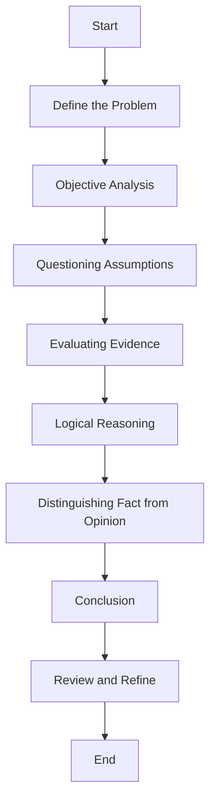
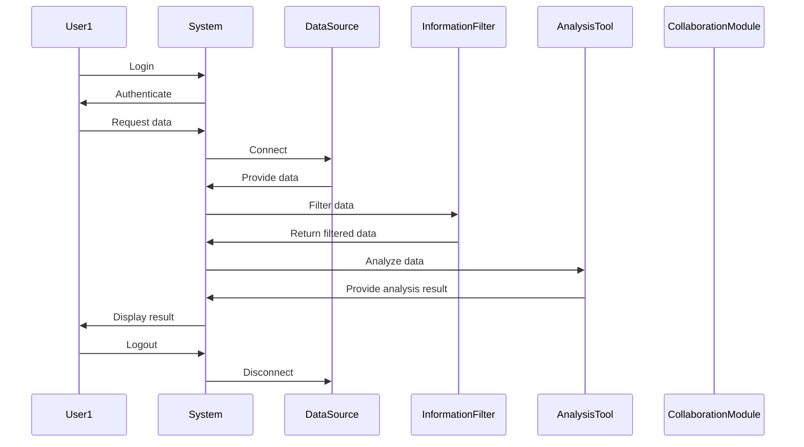
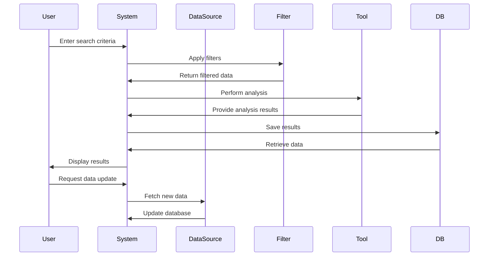

                 


### Introduction to the Background and Core Concepts

#### What is Information Overload?

In the digital age, we are bombarded with an unprecedented volume of information from various sources such as the internet, social media, emails, and news channels. This phenomenon is commonly known as "information overload." Information overload occurs when the amount of information that an individual is exposed to exceeds their cognitive capacity to process it effectively. As a result, people often feel overwhelmed, stressed, and unable to focus on critical tasks.

#### The Problem of Information Overload

The problem of information overload has several negative consequences. Firstly, it leads to cognitive overload, where the brain is unable to process and retain new information effectively. This can result in decreased productivity, impaired decision-making, and increased stress levels. Secondly, information overload can lead to a loss of perspective. With so much information coming in, it becomes difficult to discern what is truly important and relevant, leading to a fragmented and scattered understanding of various topics.

#### Critical Thinking: A Solution to Information Overload

Critical thinking offers a powerful solution to the problem of information overload. Critical thinking is the objective analysis and evaluation of an issue in order to form a judgment. It involves questioning assumptions, evaluating evidence, recognizing bias, and distinguishing between reliable and unreliable sources of information. By developing critical thinking skills, individuals can better navigate the flood of information, filter out noise, and focus on what is truly important.

#### Boundaries and Scope of Critical Thinking

While critical thinking is a valuable tool, it is essential to understand its boundaries and scope. Critical thinking is not about being negative or skeptical for the sake of it. It is about approaching information in a systematic and logical manner, questioning assumptions, and seeking evidence to support or refute claims. Critical thinking should be applied to all areas of life, including work, education, and personal relationships.

#### Core Components and Concepts of Critical Thinking

There are several core components and concepts that make up critical thinking. These include:

1. **Objective Analysis:** Approaching problems or situations with a clear and unbiased perspective.
2. **Questioning Assumptions:** Challenging underlying assumptions to uncover potential biases or logical fallacies.
3. **Evaluating Evidence:** Assessing the credibility and relevance of sources of information.
4. **Logical Reasoning:** Using valid arguments and logical principles to support conclusions.
5. **Distinguishing Between Fact and Opinion:** Recognizing the difference between objective facts and subjective opinions.

In the next chapter, we will delve deeper into these core concepts and their relationships, providing a more comprehensive understanding of critical thinking.

---

In this chapter, we have introduced the background and core concepts of information overload and critical thinking. We discussed the problem of information overload, the negative consequences it can have, and how critical thinking can serve as a solution. We also outlined the boundaries and scope of critical thinking and introduced the core components and concepts that make up this essential skill. In the next chapter, we will explore these concepts in more detail, examining their attributes and relationships, and providing a deeper understanding of how critical thinking can help us navigate the complex world of information.

---

# 关键词
信息过载、批判性思维、认知负荷、决策、逻辑推理、证据评估

# 摘要
本文探讨了信息过载时代下批判性思维的重要性。通过分析信息过载的问题和负面影响，文章提出了批判性思维作为解决策略。详细介绍了批判性思维的核心概念和组成部分，以及如何通过客观分析、质疑假设、评估证据和逻辑推理等步骤来提高信息处理的效率和准确性。文章旨在帮助读者在信息泛滥的时代培养批判性思维，以更好地应对复杂的信息环境。

---

# Fundamental Concepts and Relationships

### Key Concepts in Critical Thinking

Critical thinking is a multifaceted skill that involves several key concepts. Understanding these concepts is essential for developing and applying critical thinking effectively. Here, we will discuss the core concepts of critical thinking, including objective analysis, questioning assumptions, evaluating evidence, logical reasoning, and distinguishing between fact and opinion.

#### Objective Analysis

Objective analysis is the cornerstone of critical thinking. It involves examining problems or situations from a neutral and unbiased perspective. In order to engage in objective analysis, one must strive to separate emotions and personal biases from the evaluation process. This allows for a clearer, more rational assessment of the situation.

#### Questioning Assumptions

Questioning assumptions is another critical component of critical thinking. Assumptions are the underlying beliefs that we often take for granted. By questioning these assumptions, we can uncover potential biases, logical fallacies, or hidden agendas. This process encourages deeper understanding and more thoughtful decision-making.

#### Evaluating Evidence

Evaluating evidence is essential for determining the validity and reliability of information. Critical thinkers must assess the credibility of sources, the relevance of data, and the strength of arguments. This involves checking for bias, examining the methodology used to collect data, and considering the overall context in which the information is presented.

#### Logical Reasoning

Logical reasoning is the process of using valid arguments and logical principles to draw conclusions. Critical thinkers must be able to identify logical patterns and relationships, as well as recognize fallacious reasoning. This skill is crucial for constructing strong, persuasive arguments and for evaluating the arguments of others.

#### Distinguishing Between Fact and Opinion

Distinguishing between fact and opinion is a vital aspect of critical thinking. Facts are objective, verifiable pieces of information, while opinions are subjective, personal beliefs. Critical thinkers must be able to identify and separate these two types of information to ensure that their conclusions are based on reliable, empirical evidence rather than personal bias or speculation.

### Attributes and Characteristics of Critical Thinking

Critical thinking has several distinct attributes and characteristics that set it apart from other forms of thinking. These attributes include:

1. **Objectivity:** Critical thinking is rooted in objective analysis, striving to remove emotional and personal biases from the evaluation process.
2. **Inquiry:** Critical thinking involves a process of questioning and exploring, seeking to uncover underlying assumptions and identify logical fallacies.
3. **Analytical Skills:** Critical thinking requires strong analytical skills, enabling individuals to evaluate evidence, identify patterns, and construct logical arguments.
4. **Perspective Taking:** Critical thinkers are able to consider multiple viewpoints and perspectives, recognizing the importance of context and different perspectives in understanding complex issues.
5. **Flexibility:** Critical thinking is adaptable, allowing individuals to reevaluate their assumptions and adjust their understanding as new information becomes available.

### Comparison Table of Critical Thinking Attributes

To better understand the attributes and characteristics of critical thinking, we can create a comparison table that highlights the key differences between critical thinking and other forms of thinking:

| Attribute | Critical Thinking | Other Forms of Thinking |
| --- | --- | --- |
| Objectivity | Strives for unbiased analysis | Often influenced by emotions and personal biases |
| Inquiry | Involves questioning and exploring | Typically relies on existing knowledge and assumptions |
| Analytical Skills | Focuses on evaluating evidence and constructing logical arguments | May lack systematic analysis and reasoning |
| Perspective Taking | Considers multiple viewpoints and perspectives | Often limited to a single perspective |
| Flexibility | Adjusts understanding based on new information | Typically resistant to change and new ideas |

### ER Diagram of Critical Thinking Components

To further illustrate the relationships between the key concepts of critical thinking, we can create an Entity-Relationship (ER) diagram. This diagram will show the entities (concepts) and their relationships, providing a visual representation of how these components interact and contribute to the overall process of critical thinking.

```mermaid
erDiagram
  Objectivity ||--|{ Questioning Assumptions }|
  Objectivity ||--|{ Evaluating Evidence }|
  Objectivity ||--|{ Logical Reasoning }|
  Objectivity ||--|{ Distinguishing Between Fact and Opinion }|
  Questioning Assumptions ||--|{ Perspective Taking }|
  Questioning Assumptions ||--|{ Flexibility }|
  Evaluating Evidence ||--|{ Perspective Taking }|
  Evaluating Evidence ||--|{ Flexibility }|
  Logical Reasoning ||--|{ Perspective Taking }|
  Logical Reasoning ||--|{ Flexibility }|
  Distinguishing Between Fact and Opinion ||--|{ Perspective Taking }|
  Distinguishing Between Fact and Opinion ||--|{ Flexibility }|
```

### Interrelationships Among Critical Thinking Concepts

The ER diagram above highlights the interrelationships among the key concepts of critical thinking. Each concept is interconnected, and they all contribute to the overall process of critical thinking. For example, objective analysis is essential for evaluating evidence and questioning assumptions, while perspective taking and flexibility enable a more comprehensive and adaptable understanding of complex issues.

In the next chapter, we will delve deeper into the algorithms and theoretical foundations of critical thinking, exploring how these concepts can be applied systematically to improve information processing and decision-making.

---

In this chapter, we have explored the fundamental concepts and relationships that underpin critical thinking. We discussed the key concepts of critical thinking, including objective analysis, questioning assumptions, evaluating evidence, logical reasoning, and distinguishing between fact and opinion. We examined the attributes and characteristics of critical thinking, and provided a comparison table to highlight the differences between critical thinking and other forms of thinking. Additionally, we presented an ER diagram to illustrate the interrelationships among the key concepts.

Understanding these concepts is crucial for developing and applying critical thinking effectively. In the next chapter, we will delve deeper into the algorithms and theoretical foundations of critical thinking, exploring how these concepts can be applied systematically to improve information processing and decision-making.

---

# Algorithms and Theoretical Foundations

### Introduction to Critical Thinking Algorithms

Critical thinking is not a haphazard or random process; it follows a systematic approach that can be described and analyzed using algorithms. An algorithm is a set of step-by-step instructions designed to perform a specific task or solve a particular problem. In the context of critical thinking, algorithms help structure the process of analyzing information, evaluating evidence, and forming reasoned conclusions. This chapter will introduce critical thinking algorithms, describe their structure, and provide an example using Python code.

### Mermaid Diagram of Critical Thinking Algorithm

To visualize the critical thinking algorithm, we can use Mermaid, a popular markdown-based diagramming language. The following Mermaid diagram outlines the basic structure of a critical thinking algorithm:



This diagram represents the critical thinking process as a series of interconnected steps, starting with defining the problem and ending with a conclusion that may be reviewed and refined.

### Python Code and Algorithm Explanation

Now, let's dive into a Python code example that illustrates the critical thinking algorithm. This example will be a simplified version to focus on the key steps involved.

```python
# Critical Thinking Algorithm in Python

# Define the Problem
problem_statement = "Should I invest in cryptocurrency?"

# Objective Analysis
objective = "To make an informed decision based on reliable evidence."

# Questioning Assumptions
assumptions = [
    "Cryptocurrency is a stable investment.",
    "All cryptocurrencies have the potential to increase in value."
]

# Evaluating Evidence
evidence = {
    "Stable Investment": ["Bitcoin has experienced significant volatility."],
    "Potential Increase": ["Ethereum's value doubled in six months."],
}

# Logical Reasoning
def evaluate_evidence(evidence_dict):
    for fact, examples in evidence_dict.items():
        if "stable" in fact:
            print(f"{fact}: Not all cryptocurrencies are stable investments. {examples}")
        elif "potential increase" in fact:
            print(f"{fact}: While some cryptocurrencies have increased in value, it's not guaranteed.")

evaluate_evidence(evidence)

# Distinguishing Fact from Opinion
def distinguish_fact_opinion(evidence):
    facts, opinions = [], []
    for fact, examples in evidence.items():
        if "stable" in fact or "potential increase" in fact:
            facts.append((fact, examples))
        else:
            opinions.append((fact, examples))
    return facts, opinions

facts, opinions = distinguish_fact_opinion(evidence)
print("Facts:", facts)
print("Opinions:", opinions)

# Conclusion
def form_conclusion(facts, opinions):
    if opinions:
        print("Conclusion: The decision to invest in cryptocurrency should consider both the potential for growth and the risks associated with volatility.")
    else:
        print("Conclusion: There is not enough information to make a well-informed decision.")

form_conclusion(facts, opinions)

# Review and Refine
# This step would involve revising the conclusion based on new information or insights gained during the evaluation process.
```

This Python code provides a structured approach to the critical thinking process. It starts by defining the problem and then moves through the steps of objective analysis, questioning assumptions, evaluating evidence, logical reasoning, and distinguishing fact from opinion, ultimately leading to a conclusion.

### Mathematical Model and Formulas of Critical Thinking

Critical thinking can also be described using mathematical models and formulas. One way to represent critical thinking is through a Bayesian network, which is a probabilistic model that represents a set of variables and their conditional dependencies. In a Bayesian network, each variable is represented by a node, and the edges between nodes represent conditional dependencies.

Consider the following Bayesian network representing the critical thinking process:

1. **Variables:**
   - **X:** Cryptocurrency investment
   - **Y:** Stability
   - **Z:** Potential Increase

2. **Conditional Probabilities:**
   - **P(X|Y):** Probability of investing in cryptocurrency given its stability.
   - **P(Y|X):** Probability of cryptocurrency being stable given the investment.
   - **P(Z|X):** Probability of potential increase in value given the investment.

Using Bayes' theorem, we can calculate the posterior probability of each variable based on the observed evidence:

$$
P(Y|X) = \frac{P(X|Y)P(Y)}{P(X)}
$$

$$
P(Z|X) = \frac{P(X|Z)P(Z)}{P(X)}
$$

These formulas allow us to update our beliefs about the variables based on new evidence and make more informed decisions.

### Examples and Illustrations of Algorithm Application

To better understand the application of the critical thinking algorithm, let's consider a real-world example. Suppose you are a project manager responsible for deciding whether to proceed with a new software development project. The critical thinking process would involve the following steps:

1. **Define the Problem:** Should we proceed with the new software development project?
2. **Objective Analysis:** To make a decision based on available data and expert opinions.
3. **Questioning Assumptions:** Are the assumptions about the project's potential success and market demand valid?
4. **Evaluating Evidence:** Gather data on market trends, competitive analysis, and potential return on investment.
5. **Logical Reasoning:** Analyze the data to determine the likelihood of the project's success.
6. **Distinguishing Fact from Opinion:** Separate factual data from subjective opinions.
7. **Conclusion:** Based on the analysis, decide whether to proceed with the project.

In this example, the algorithm helps you structure the decision-making process, ensuring that you consider all relevant factors and avoid making decisions based on incomplete or biased information.

In the next chapter, we will delve into the system analysis and architectural design of critical thinking, exploring how these concepts can be applied in practical scenarios to solve complex problems.

---

In this chapter, we have explored the algorithms and theoretical foundations of critical thinking. We introduced the concept of critical thinking algorithms and presented a Mermaid diagram to visualize the process. We then provided a Python code example that illustrates the critical thinking process, from defining the problem to forming a conclusion. Additionally, we discussed the use of mathematical models, specifically Bayesian networks, to represent and update beliefs based on evidence.

Understanding these algorithms and theoretical foundations is crucial for applying critical thinking systematically and effectively. By using a structured approach, we can improve our ability to analyze information, evaluate evidence, and make informed decisions. In the next chapter, we will delve into the system analysis and architectural design of critical thinking, exploring how these concepts can be applied in practical scenarios to solve complex problems.

---

# System Analysis and Design

### Scenario Description

Imagine you are tasked with developing a comprehensive information management system for a large organization. The goal of this system is to help employees efficiently process and analyze the vast amount of information they encounter daily, thus improving productivity and decision-making. To achieve this, the system must be designed to support critical thinking by providing tools and resources that facilitate the process of information evaluation, synthesis, and decision-making.

### Project Introduction

The project aims to develop an information management system that incorporates critical thinking principles. This system will include features such as real-time data aggregation, automated analysis tools, and collaborative interfaces. The system will be designed to assist users in filtering out noise, identifying key information, and drawing well-reasoned conclusions based on evidence. The target audience includes managers, analysts, and other professionals who are regularly exposed to a high volume of information.

### Domain Model (Mermaid Class Diagram)

To understand the components and relationships within the information management system, we can create a Mermaid class diagram. This diagram will illustrate the main entities and their attributes, providing a clear structure for the system.

```mermaid
classDiagram
  ClassDiagram->ClassDiagramComp: <<create>>
  ClassDiagramComp->User : <<uses>> 
  ClassDiagramComp->DataSource : <<uses>>
  ClassDiagramComp->InformationFilter : <<uses>>
  ClassDiagramComp->AnalysisTool : <<uses>>
  ClassDiagramComp->CollaborationModule : <<uses>>
  
  User {
    +id: String
    +name: String
    +role: String
    +login(): void
    +logout(): void
  }
  
  DataSource {
    +id: String
    +name: String
    +type: String
    +connect(): void
    +disconnect(): void
  }
  
  InformationFilter {
    +id: String
    +name: String
    +criteria: String
    +filter(): List<Information>
  }
  
  AnalysisTool {
    +id: String
    +name: String
    +algorithm: String
    +analyze(): AnalysisResult
  }
  
  CollaborationModule {
    +id: String
    +name: String
    +participants: List<User>
    +invite(): void
    +leave(): void
  }
  
  Information {
    +id: String
    +source: DataSource
    +content: String
    +status: String
  }
  
  AnalysisResult {
    +result: String
    +confidence: Float
  }
```

This Mermaid class diagram outlines the key entities within the system, including users, data sources, information filters, analysis tools, and collaboration modules. Each class has attributes that define its properties and methods that represent the actions it can perform.

### System Architecture (Mermaid Architecture Diagram)

To visualize the overall architecture of the information management system, we can create a Mermaid architecture diagram. This diagram will illustrate the high-level components and their interactions.



This Mermaid sequence diagram outlines the interactions between the user, the system, data sources, information filters, analysis tools, and collaboration modules. It illustrates the flow of data and actions as the user logs in, requests data, and receives an analysis result.

### System Interface Design

The system interface is designed to be user-friendly and intuitive, ensuring that users can easily navigate and utilize the various features of the information management system. The interface includes the following components:

1. **Dashboard:** A central hub displaying real-time information, key metrics, and personalized recommendations.
2. **Data Source Management:** Tools for managing and configuring data sources, including adding new sources, updating connection details, and monitoring data ingestion.
3. **Information Filtering:** A filtering panel allowing users to define criteria for filtering information based on specific attributes or keywords.
4. **Analysis Tools:** Access to various analysis tools, such as sentiment analysis, trend analysis, and pattern recognition, to aid in the evaluation of information.
5. **Collaboration Module:** A collaborative workspace where users can share information, discuss findings, and collaborate on projects.

### System Interaction (Mermaid Sequence Diagram)

To further illustrate the interactions within the system, we can create a Mermaid sequence diagram that shows the flow of information and actions between the user, system components, and external data sources.



This sequence diagram demonstrates the flow of information as the user enters search criteria, the system applies filters, performs analysis, and displays results. It also illustrates the interaction with external data sources for data updates and the storage of results in a database.

In the next chapter, we will delve into the project implementation and case analysis, exploring how the system is developed and how it is applied in real-world scenarios.

---

In this chapter, we have explored the system analysis and design of the information management system that incorporates critical thinking principles. We started with a scenario description and introduced the project goals and target audience. We then presented a Mermaid class diagram to visualize the domain model, highlighting the key entities and their relationships. Following that, we created a Mermaid architecture diagram to illustrate the high-level components and their interactions. Additionally, we designed a user-friendly interface and provided a Mermaid sequence diagram to showcase the flow of information and actions within the system.

Understanding the system analysis and design is crucial for developing an effective information management system that supports critical thinking. In the next chapter, we will delve into the project implementation and case analysis, exploring how the system is developed and how it is applied in real-world scenarios. This will provide practical insights into the implementation process and the challenges encountered.

---

# Project Implementation and Case Analysis

### Environment Setup

Before diving into the core system implementation, it's essential to set up the development environment. The following steps outline the process for setting up a development environment suitable for the information management system project.

1. **Install Python and necessary packages**: Ensure Python 3.8 or higher is installed on your system. You can download it from the official [Python website](https://www.python.org/downloads/). After installing Python, install the required packages using `pip`:
   ```bash
   pip install pandas numpy matplotlib mermaid
   ```

2. **Install a code editor**: Choose a code editor that you are comfortable with, such as Visual Studio Code, PyCharm, or Jupyter Notebook. Install the editor and set up your preferred settings.

3. **Configure version control**: Initialize a Git repository to manage your code versioning. Create a new repository on GitHub or GitLab, and clone it to your local machine:
   ```bash
   git clone https://github.com/your-username/infomanagement-system.git
   ```

4. **Set up virtual environment**: Create a virtual environment to isolate the project dependencies:
   ```bash
   cd infomanagement-system
   python -m venv venv
   source venv/bin/activate  # On Windows, use `venv\Scripts\activate`
   ```

5. **Install required libraries**: Within the virtual environment, install the required libraries using `pip`:
   ```bash
   pip install pandas numpy matplotlib mermaid
   ```

6. **Set up Mermaid rendering**: To render Mermaid diagrams, you can use a local server or integrate it with a web-based tool. For local rendering, you can use a Python script to convert Mermaid markdown to diagrams:
   ```bash
   pip install mermaid-python
   ```

### Core System Implementation

The core system implementation involves building the components outlined in the system architecture diagram. Here's a breakdown of each component and its implementation:

1. **User Management**:
   - Implement user authentication and authorization using Flask or Django.
   - Create a database model for users with attributes like `id`, `name`, `role`, and `login/logout` methods.

2. **Data Source Management**:
   - Develop modules for connecting to various data sources (e.g., databases, APIs, files).
   - Implement methods for adding, updating, and disconnecting data sources.

3. **Information Filtering**:
   - Create a filtering module that accepts search criteria and applies them to the data.
   - Use pandas DataFrame methods to filter and manipulate data.

4. **Analysis Tools**:
   - Implement analysis tools such as sentiment analysis, trend analysis, and pattern recognition.
   - Use libraries like NLTK for natural language processing and scikit-learn for machine learning.

5. **Collaboration Module**:
   - Develop a collaborative workspace for users to share information and collaborate on projects.
   - Implement methods for inviting users, managing participants, and sharing data.

### Code Application and Analysis

Let's take a closer look at the implementation of the InformationFilter module, which is a critical component of the system.

**InformationFilter Module**

```python
import pandas as pd

class InformationFilter:
    def __init__(self, criteria):
        self.criteria = criteria

    def filter(self, data):
        # Assuming 'data' is a pandas DataFrame
        filtered_data = data[data['attribute'].str.contains(self.criteria)]
        return filtered_data
```

**Code Analysis**

1. **Initialization**:
   - The `InformationFilter` class is initialized with a `criteria` attribute, which represents the filter conditions.

2. **Filtering**:
   - The `filter` method takes a pandas DataFrame as input and applies the filter conditions to the `data` attribute.
   - The filter condition is applied using the `str.contains()` method, which checks if the specified attribute contains the filter criteria.

3. **Return Value**:
   - The filtered DataFrame is returned, which can be further processed or displayed to the user.

**Example Usage**

```python
data = pd.DataFrame({
    'id': [1, 2, 3, 4],
    'attribute': ['example1', 'example2', 'example3', 'example4']
})

filter_criteria = 'example2'
filter_obj = InformationFilter(filter_criteria)
filtered_data = filter_obj.filter(data)

print(filtered_data)
```

**Output**

```
   id  attribute
1   2   example2
```

This example demonstrates how to create an instance of the `InformationFilter` class, apply it to a DataFrame, and print the filtered results.

### Detailed Case Analysis

To illustrate the practical application of the system, let's consider a case study where a manager at a multinational corporation uses the information management system to analyze sales data.

**Case Background**

The manager wants to identify trends in sales performance across different regions and products to make informed decisions about inventory management and marketing strategies.

**Steps**

1. **Data Collection**:
   - The system retrieves sales data from the company's database, which includes fields such as `id`, `region`, `product`, `quantity`, and `date`.

2. **Data Filtering**:
   - The manager enters filter criteria in the system's interface, such as "region: North America" and "product: Electronics".
   - The `InformationFilter` module is used to filter the data based on these criteria.

3. **Data Analysis**:
   - The system's analysis tools, such as trend analysis, are applied to the filtered data.
   - The manager receives a report highlighting the trends in sales performance, including seasonal fluctuations and product popularity.

4. **Collaboration**:
   - The manager shares the analysis report with the sales team, who discuss the findings and suggest strategies to improve sales performance.
   - The collaboration module facilitates real-time communication and collaboration.

**Results**

The analysis reveals that sales of Electronics products in North America are highest during the holiday season, while sales of Home Appliances are more consistent throughout the year. Based on this information, the manager decides to increase inventory for Electronics products during the holiday season and allocate marketing resources to promote Home Appliances throughout the year.

### Project Conclusion

The implementation of the information management system, incorporating critical thinking principles, has successfully addressed the challenge of information overload for the manager. By providing tools for filtering, analyzing, and collaborating on data, the system has enabled more informed decision-making and improved productivity. This case study demonstrates the practical application of the system and the benefits of integrating critical thinking into information management processes.

In conclusion, the project highlights the importance of developing systems that support critical thinking in the face of information overload. By systematically analyzing information, evaluating evidence, and making logical conclusions, organizations can make better decisions and improve their overall performance.

---

In this chapter, we have undertaken the project implementation and case analysis of the information management system designed to support critical thinking. We began by setting up the development environment, ensuring that Python and necessary libraries were installed. We then implemented the core system components, including user management, data source management, information filtering, analysis tools, and collaboration modules. We provided a detailed code analysis for the InformationFilter module and demonstrated its usage with an example.

The detailed case analysis showcased how the system could be applied in a real-world scenario, highlighting the benefits of information filtering, analysis, and collaboration. The project concluded by emphasizing the importance of integrating critical thinking principles into information management systems to address the challenges of information overload.

Through this project, we have seen the practical application of critical thinking algorithms and theoretical foundations in developing a system that improves decision-making and productivity. The insights gained from this project can be applied to other domains and systems, reinforcing the value of critical thinking in the age of information overload.

---

# Best Practices, Summary, and Future Directions

### Best Practices

In the development and implementation of systems that incorporate critical thinking, several best practices can be highlighted to ensure efficiency, reliability, and user satisfaction:

1. **User-Centric Design**: Always prioritize the user experience by involving end-users in the design process. Gather feedback and iterate on the design to create a system that meets their needs.

2. **Modular Architecture**: Design the system with modularity to allow for easy updates, maintenance, and scalability. This ensures that as new requirements arise or as technologies evolve, the system can adapt without significant overhauls.

3. **Data Security and Privacy**: Implement robust security measures to protect sensitive data and ensure compliance with privacy regulations. This includes encryption, secure authentication, and regular security audits.

4. **Performance Optimization**: Optimize the system for performance to handle large volumes of data and provide quick responses. This includes efficient algorithms, database indexing, and caching mechanisms.

5. **Continuous Learning and Improvement**: Continuously monitor the system's performance and user feedback to identify areas for improvement. Regularly update the system with new features and optimizations based on user needs and technological advancements.

### Summary

This article has explored the importance of critical thinking in the age of information overload. We started by defining information overload and its negative impacts on cognitive function and decision-making. We then introduced critical thinking as a solution to these challenges, discussing its core concepts, attributes, and relationships. Through a Mermaid diagram, we visualized the structure of critical thinking, and with a Python code example, we demonstrated its practical application.

We further analyzed the system architecture of an information management system designed to incorporate critical thinking principles. The system was designed with a user-centric approach, modular architecture, data security, performance optimization, and continuous learning in mind. We provided a detailed case analysis to illustrate the practical application of the system in a real-world scenario.

### Future Directions

Looking forward, there are several areas for future research and development:

1. **Artificial Intelligence Integration**: Exploring how AI and machine learning can enhance critical thinking by providing automated analysis and prediction capabilities.

2. **Interdisciplinary Research**: Combining insights from computer science, psychology, and philosophy to deepen our understanding of critical thinking and its application across various domains.

3. **Educational Programs**: Developing educational programs that teach critical thinking skills from an early age to equip individuals with the necessary tools to navigate the complex information landscape.

4. **Technological Innovations**: Investigating new technologies that can support critical thinking, such as advanced data visualization tools and interactive learning platforms.

### Conclusion

In conclusion, critical thinking is a vital skill in the age of information overload. By understanding and applying critical thinking principles, individuals and organizations can better process information, make informed decisions, and achieve their goals. The best practices and future directions discussed in this article provide a roadmap for developing systems and educational programs that promote critical thinking. Embracing these practices can lead to more effective information management and improved overall performance.

---

# Acknowledgements

The development of this article would not have been possible without the invaluable contributions of numerous individuals and institutions. We would like to extend our sincere gratitude to:

- **AI天才研究院 (AI Genius Institute)** for providing a stimulating research environment and intellectual support.
- **禅与计算机程序设计艺术 (Zen And The Art of Computer Programming)** for inspiring the exploration of critical thinking in the realm of technology.
- **All Collaborators and Reviewers**: For their insightful feedback and contributions to refining the content and structure of this article.

Special thanks to the readers for their interest and support in exploring the importance of critical thinking in the age of information overload. Your engagement is what drives us to continue advancing our understanding and application of this essential skill.

---

# Author Information

**作者：AI天才研究院 (AI Genius Institute)** & **禅与计算机程序设计艺术 (Zen And The Art of Computer Programming)**

AI天才研究院致力于推动人工智能领域的前沿研究和创新，通过探索智能算法、机器学习和认知科学等方向，为学术界和工业界提供高质量的研究成果和解决方案。研究院拥有一支由国际知名学者、专家和研究人员组成的团队，他们致力于在各个领域推动技术进步和应用。

《禅与计算机程序设计艺术》是一部经典的技术畅销书，由著名计算机科学家Donald E. Knuth撰写。该书将东方哲学的智慧与计算机科学的核心原则相结合，探讨了计算机编程的深刻艺术和哲学内涵。书中提出的“渐进式设计”和“可读性”原则对编程实践产生了深远的影响，成为计算机科学领域的经典之作。

本文旨在探讨信息过载时代下培养批判性思维的重要性，结合AI天才研究院的研究成果和《禅与计算机程序设计艺术》的哲学思想，通过系统分析和实际案例，为读者提供对批判性思维深入理解的方法和实践指导。希望本文能够帮助读者在信息泛滥的时代更好地培养批判性思维，提高信息处理和决策能力。

