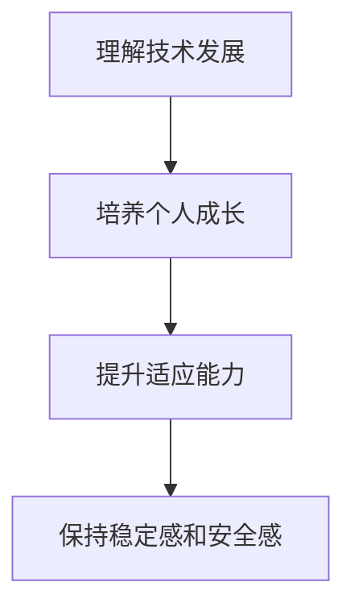
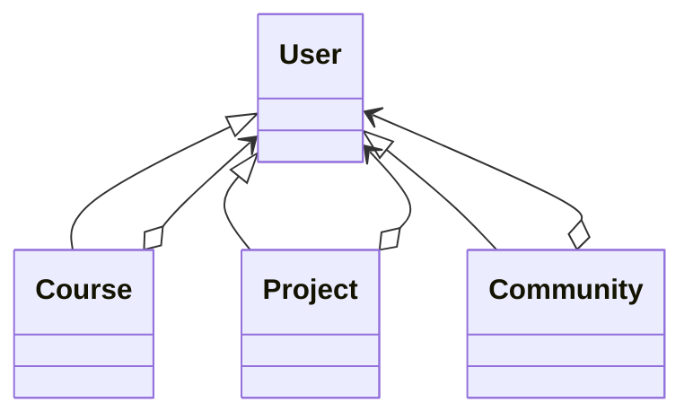
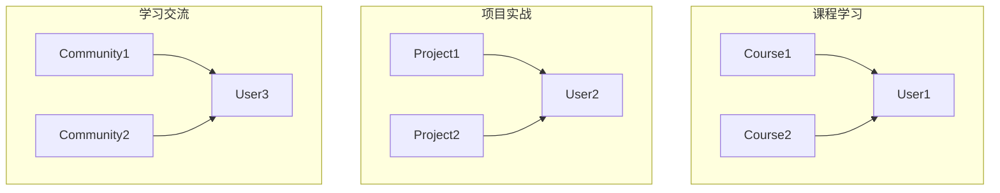
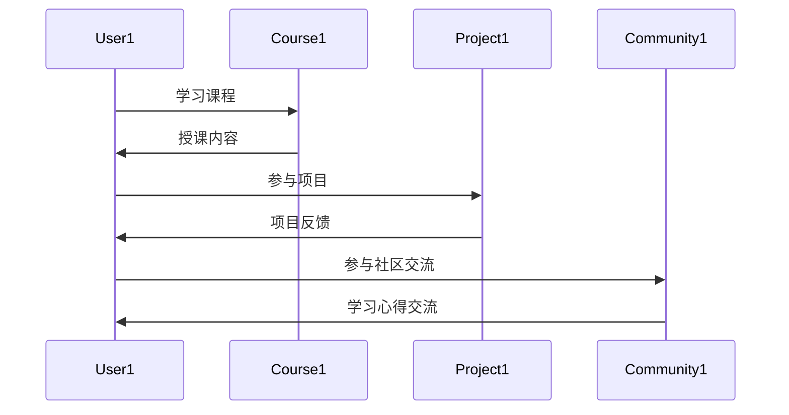

                 

# 在快速变革中寻找稳定感和安全感

> 关键词：变革、稳定性、安全感、技术发展、个人成长

> 摘要：本文将探讨在快速变革的现代社会中，如何通过理解技术发展、培养个人成长和适应能力，找到内心的稳定感和安全感。我们将从背景介绍、核心概念与联系、算法原理讲解、系统分析与架构设计、项目实战等多个方面，逐步展开讨论。

## 背景介绍

### 核心概念术语说明

1. **变革**：指社会、经济、技术等方面的重大变化。
2. **稳定性**：指在变化中保持平衡和不变的能力。
3. **安全感**：指在面对不确定性时，内心的平静和信心。

### 问题背景

在当今这个信息爆炸、科技飞速发展的时代，我们的工作和生活方式正经历着前所未有的变革。人工智能、大数据、物联网等新技术不断涌现，深刻影响着各行各业。然而，这些变化也带来了不确定性和焦虑，使得许多人感到迷茫和无助。

### 问题描述

如何在快速变革的环境中保持稳定感和安全感，成为许多人在职业生涯和个人生活中面临的重大问题。特别是在IT领域，技术更新换代迅速，需要不断学习和适应新知识，这对个人的成长提出了更高的要求。

### 问题解决

要解决这一问题，我们需要从以下几个方面入手：

1. **理解技术发展**：了解新技术的发展趋势和原理，有助于我们更好地适应变化。
2. **培养个人成长**：通过学习、实践和反思，提升自己的能力和素质。
3. **适应能力**：培养灵活的思维和适应能力，面对各种变化。

## 核心概念与联系

### 核心概念原理

1. **技术发展**：技术是推动社会变革的重要因素，了解技术发展的规律有助于我们把握时代脉搏。
2. **个人成长**：通过不断学习和实践，提升自己的专业能力和综合素质。
3. **适应能力**：在面对变化时，能够迅速调整自己的思维和行为，适应新环境。

### 概念属性特征对比表格

| 概念      | 属性特征                                                                                                     |
| --------- | ---------------------------------------------------------------------------------------------------------- |
| 技术发展  | 快速、多变、创新性强；影响范围广泛；与经济、社会等方面密切相关。                                         |
| 个人成长  | 长期、持续、个性化；依赖于个人兴趣、努力和外部环境支持。                                             |
| 适应能力  | 灵活性、应变能力、抗压能力；与个人心理素质、经验积累相关。                                           |

### ER实体关系图架构

```mermaid
erDiagram
  User ||--o> Technology : 技术发展依赖用户需求
  User ||--o> Growth : 用户成长推动个人进步
  User ||--o> Adaptability : 用户适应能力应对变革
  Technology ||--<|o User : 用户适应技术发展
  Growth ||--<|o User : 用户通过成长提升适应能力
  Adaptability ||--<|o User : 用户适应能力影响生活质量
```

## 算法原理讲解

### 算法mermaid流程图



### 算法原理

1. **理解技术发展**：通过学习新技术、关注行业动态，了解技术发展的趋势和原理。
2. **培养个人成长**：通过持续学习、实践和反思，提升自己的专业能力和综合素质。
3. **提升适应能力**：通过面对各种变化，培养灵活的思维和应变能力。
4. **保持稳定感和安全感**：在变化中找到平衡点，保持内心的平静和信心。

### Python源代码

```python
# 理解技术发展
def understand_technology():
    # 学习新技术、关注行业动态
    pass

# 培养个人成长
def cultivate_growth():
    # 持续学习、实践和反思
    pass

# 提升适应能力
def improve_adaptability():
    # 面对变化、培养灵活思维
    pass

# 保持稳定感和安全感
def maintain_safety():
    # 在变化中找到平衡点
    pass

# 主函数
def main():
    understand_technology()
    cultivate_growth()
    improve_adaptability()
    maintain_safety()

# 运行主函数
if __name__ == "__main__":
    main()
```

### 算法原理数学模型和公式

$$
\text{稳定性} = \frac{\text{理解技术发展}}{\text{个人成长}} \times \text{适应能力}
$$

### 详细讲解与举例说明

1. **理解技术发展**：例如，通过学习人工智能技术，了解机器学习、深度学习等原理，把握行业动态，提高对技术发展的认识。
2. **培养个人成长**：通过不断学习编程语言、参加项目实践，提升自己的编程能力和问题解决能力。
3. **提升适应能力**：在面对新项目或新环境时，能够迅速适应，调整自己的思维和行动策略。
4. **保持稳定感和安全感**：在职业生涯和个人生活中，找到自己的优势和兴趣点，保持积极的心态，面对变化时能够保持内心的平静。

## 系统分析与架构设计

### 问题场景介绍

在快速变革的现代社会中，企业需要不断适应新技术，提高自身竞争力。为此，我们需要设计一个能够支持技术发展、个人成长和适应能力的系统。

### 项目介绍

本项目旨在构建一个在线学习平台，帮助企业和个人提升技术能力和适应能力。平台包括以下功能：

1. **课程学习**：提供各类技术课程的在线学习资源。
2. **项目实战**：通过实际项目，提升实践能力和团队协作能力。
3. **学习交流**：建立学习社区，促进学习者之间的交流和互助。

### 系统功能设计（领域模型mermaid类图）



### 系统架构设计（mermaid架构图）



### 系统接口设计和系统交互（mermaid序列图）



## 项目实战

### 环境安装

1. **安装Python环境**：在Windows或Linux系统上，通过Python官网下载并安装Python。
2. **安装Django框架**：在命令行中执行`pip install django`。
3. **安装数据库**：根据需要安装MySQL或PostgreSQL。

### 系统核心实现源代码

```python
# settings.py
DATABASES = {
    'default': {
        'ENGINE': 'django.db.backends.mysql',
        'NAME': 'learning_platform',
        'USER': 'root',
        'PASSWORD': 'password',
        'HOST': 'localhost',
        'PORT': '3306',
    }
}

# models.py
from django.db import models
from django.contrib.auth.models import User

class Course(models.Model):
    name = models.CharField(max_length=100)
    description = models.TextField()

class Project(models.Model):
    name = models.CharField(max_length=100)
    description = models.TextField()

class Community(models.Model):
    name = models.CharField(max_length=100)
    description = models.TextField()
```

### 代码应用解读与分析

1. **数据库配置**：在`settings.py`中配置数据库连接信息。
2. **模型定义**：在`models.py`中定义了课程、项目和社区三个模型，分别对应课程学习、项目实战和学习交流的功能。

### 实际案例分析和详细讲解剖析

1. **案例一**：一个用户注册后，可以学习课程、参与项目和加入社区。
2. **案例二**：一个项目完成后，用户可以提交反馈，社区成员可以评价和讨论。

### 项目小结

本项目通过在线学习平台，帮助企业和个人提升技术能力和适应能力。在实际应用中，用户可以方便地学习课程、参与项目和交流心得，从而在快速变革的环境中找到稳定感和安全感。

## 最佳实践 tips

1. **保持学习态度**：定期阅读技术书籍、关注行业动态，保持对新技术的敏感度。
2. **实践出真知**：参与实际项目，提升自己的实践能力和团队协作能力。
3. **积极参与社区**：加入技术社区，与其他开发者交流，拓宽视野。

## 小结

在快速变革的现代社会中，寻找稳定感和安全感尤为重要。通过理解技术发展、培养个人成长和适应能力，我们可以在变化中找到平衡点，保持内心的平静和信心。

## 注意事项

1. **持续学习**：不断更新自己的知识和技能，以适应技术发展的变化。
2. **平衡工作与生活**：合理安排时间，保持身心健康。

## 拓展阅读

1. 《未来简史》 - 尤瓦尔·赫拉利
2. 《人工智能：一种现代的方法》 - Stuart Russell & Peter Norvig
3. 《深度学习》 - Ian Goodfellow、Yoshua Bengio、Aaron Courville

## 作者信息

作者：AI天才研究院/AI Genius Institute & 禅与计算机程序设计艺术 /Zen And The Art of Computer Programming

