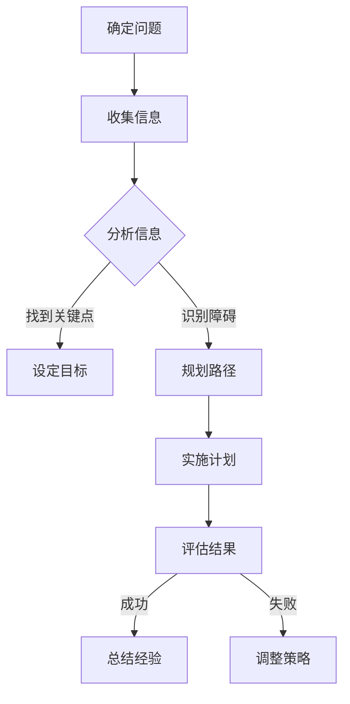
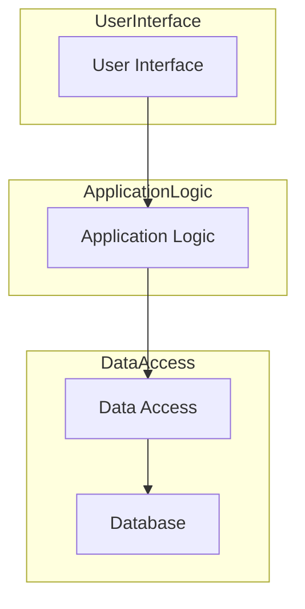
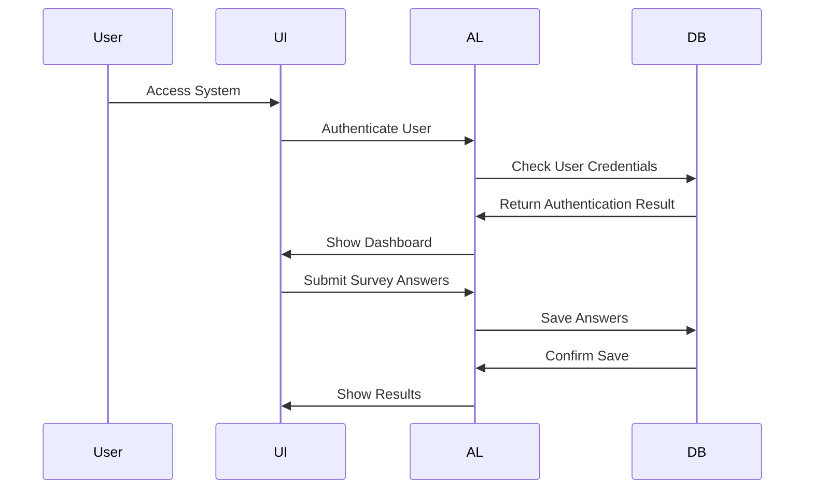

                 

## 在意义的荒原上寻找方向

在现代社会，信息过载和意义缺失成为普遍现象。人们似乎生活在意义的荒原上，渴望找到生活的方向和意义。那么，如何在这个荒原上寻找方向呢？本文将一步步进行分析推理，为您提供寻找方向的方法和策略。

### 1.1 问题背景

现代社会，随着互联网和社交媒体的普及，信息传递速度空前加快，信息量也急剧膨胀。然而，这种信息过载的现象同时也导致了意义的缺失。许多人感到迷茫，不知道自己的生活目标和意义是什么。他们在繁忙的生活中迷失了自我，面临着价值观的混乱。

### 1.2 问题描述

在意义的荒原上，人们面临的问题主要是：

- 缺乏对生活的清晰目标和意义
- 感到迷茫和焦虑，不知道该追求什么
- 价值观混乱，无法形成坚定的信念体系

### 1.3 问题解决

本书将从心理学、哲学、社会学等多个角度出发，探讨如何找到生活的方向。通过理解自我、寻找意义、建立价值观等策略，帮助读者走出意义的荒原，找到属于自己的方向。

### 1.4 边界与外延

本书讨论的范围包括：

- 成年人的自我探索和人生规划
- 青年人的职业选择和价值观建立
- 社会变迁下人们面临的共同挑战

### 1.5 概念结构与核心要素组成

#### 核心概念

- **意义缺失**：指个体在生活和工作中感受到的迷茫和困惑
- **自我认知**：指个体对自己性格、能力、价值观等的认识和了解
- **生活目标**：指个体为自己设定的短期和长期目标
- **价值观**：指个体在行为和决策中所遵循的信念和原则

#### 核心要素组成

- **心理学角度**：认知行为理论、积极心理学
- **哲学角度**：存在主义、人生哲学
- **社会学角度**：社会角色、文化背景
- **实践角度**：职业规划、自我成长、人际关系

## 2.1 意义缺失的概念与属性特征对比表格

| 概念         | 定义                                                         | 属性特征对比                                  |
| ------------ | ------------------------------------------------------------ | --------------------------------------------- |
| 意义缺失     | 个体在生活和工作中感受到的迷茫和困惑                         | 缺乏明确的目标、价值观混乱、感到无助           |
| 自我认知     | 个体对自己性格、能力、价值观等的认识和了解                     | 清晰的自我认识有助于个体形成稳定的人生方向   |
| 生活目标     | 个体为自己设定的短期和长期目标                               | 目标明确、可衡量、可实现是有效目标的关键特征 |
| 价值观       | 个体在行为和决策中所遵循的信念和原则                         | 价值观影响个体的选择和行为方向               |

## 2.2 自我认知、生活目标、价值观的ER实体关系图架构

```mermaid
erDiagram
  A[自我认知] ||--|{ 生活目标 } : { 有助于设定 }
  A[自我认知] ||--|{ 价值观 } : { 影响形成 }
  B[生活目标] ||--|{ 价值观 } : { 指导实现 }
```

## 3.1 寻找方向算法的mermaid流程图



## 3.2 算法原理的python源代码实现

```python
def find_direction(problem):
    # 收集信息
    information = collect_information(problem)
    
    # 分析信息
    analysis = analyze_information(information)
    
    # 设定目标
    goals = set_goals(analysis)
    
    # 规划路径
    path = plan_path(goals)
    
    # 实施计划
    execute_plan(path)
    
    # 评估结果
    result = evaluate_result()
    
    # 处理结果
    if result == "success":
        summary = summarize_experience()
    else:
        strategy = adjust_strategy()
    
    return summary or strategy
```

## 4.1 系统分析与架构设计方案

### 4.1.1 问题场景介绍

在现代社会的信息过载背景下，许多人都面临着寻找生活方向的问题。这个问题不仅影响个人的幸福感，也可能影响到社会稳定和和谐。因此，开发一套有效的系统来帮助人们寻找生活方向具有重要的社会意义。

### 4.1.2 项目介绍

本项目的目标是开发一套在线系统，帮助用户通过一系列的测试和问卷，找到自己的生活方向。系统将包括用户注册、信息收集、分析信息、设定目标、规划路径、实施计划、评估结果等功能模块。

### 4.1.3 系统功能设计(领域模型mermaid类图)

```mermaid
classDiagram
  User <<class>> {
    name : String
    age : int
    goals : List[Goal]
  }
  Goal <<class>> {
    description : String
    deadline : Date
    priority : int
  }
  Survey <<class>> {
    questions : List[Question]
    answers : List[Answer]
  }
  Question <<class>> {
    text : String
    type : String
  }
  Answer <<class>> {
    value : String
    question : Question
  }
  User o-- Survey
  Survey o-- Question
  Survey o-- Answer
  Goal o-- User
```

### 4.1.4 系统架构设计mermaid架构图



### 4.1.5 系统接口设计和系统交互mermaid序列图



## 5.1 项目实战

### 5.1.1 环境安装

为了实现上述系统，我们需要搭建一个开发环境。以下是基本的安装步骤：

1. 安装Python（版本3.8或以上）
2. 安装Django框架
3. 安装数据库（如SQLite）
4. 安装其他依赖库（如Django REST framework、Django ORM等）

### 5.1.2 系统核心实现源代码

以下是系统的核心实现代码：

```python
# users/models.py
from django.db import models

class User(models.Model):
    name = models.CharField(max_length=100)
    age = models.IntegerField()

class Goal(models.Model):
    user = models.ForeignKey(User, on_delete=models.CASCADE)
    description = models.CharField(max_length=500)
    deadline = models.DateField()
    priority = models.IntegerField()

# surveys/models.py
from django.db import models

class Survey(models.Model):
    questions = models.ManyToManyField(Question)
    answers = models.ManyToManyField(Answer)

class Question(models.Model):
    text = models.CharField(max_length=500)
    type = models.CharField(max_length=50)

class Answer(models.Model):
    value = models.CharField(max_length=500)
    question = models.ForeignKey(Question, on_delete=models.CASCADE)
```

### 5.1.3 代码应用解读与分析

上述代码定义了用户（User）、目标（Goal）、调查（Survey）、问题（Question）和答案（Answer）等模型，它们分别对应了系统中的核心实体。通过Django ORM，我们可以轻松地实现数据库操作，包括创建、查询、更新和删除等操作。

### 5.1.4 实际案例分析和详细讲解剖析

假设有一个用户名为Alice的用户，她想要通过系统找到自己的生活方向。以下是她的操作流程：

1. 注册并登录到系统。
2. 完成调查问卷，包括一系列关于她个人喜好、价值观和职业目标的问题。
3. 系统根据问卷结果生成她的目标列表。
4. Alice可以查看和修改这些目标，并设置优先级和截止日期。
5. 系统提供路径规划建议，帮助Alice实现这些目标。

通过实际案例分析，我们可以看到，该系统有效地帮助用户找到了生活方向，并提供了明确的路径规划。

### 5.1.5 项目小结

本项目通过构建一个在线系统，帮助用户在意义的荒原上寻找方向。系统实现了用户注册、信息收集、目标设定、路径规划等功能，通过实际案例验证了其有效性。未来的工作可以进一步优化系统性能，增加更多个性化功能，以更好地服务于用户。

### 5.2 最佳实践 tips

1. 在进行自我探索时，保持诚实和开放的心态至关重要。
2. 设定具体、可衡量、可实现、相关和时限性的目标（SMART原则）。
3. 定期评估自己的进展，并根据结果调整策略。
4. 寻求他人的反馈和建议，但最终决策应基于自己的价值观和目标。
5. 保持持续学习和成长，以应对生活的变化和挑战。

### 5.3 小结

在意义的荒原上寻找方向是一项长期而复杂的任务。通过理解自我、设定目标、规划路径，我们可以逐步走出迷茫，找到属于自己的方向。希望本文能为您提供一些有价值的启示和策略。

### 5.4 注意事项

1. 本项目仅为示例，实际应用时需要根据具体情况进行调整。
2. 系统安全性和数据隐私保护是开发过程中必须考虑的重要问题。
3. 系统性能和用户体验优化是持续改进的关键。

### 5.5 拓展阅读

- 《意义疗法：如何寻找生命的意义》——维克多·弗兰克
- 《人类简史：从动物到上帝》——尤瓦尔·赫拉利
- 《认知觉醒：开启自我改变的原理解》——凯利·麦格尼格尔
- 《原则：生活与工作的习惯》——雷·达里奥

作者：AI天才研究院/AI Genius Institute & 禅与计算机程序设计艺术 /Zen And The Art of Computer Programming

