                 


### 文章标题
《在意义的荒原上寻找方向：现代人的精神困境》

### 文章关键词
现代精神困境、意义探索、心理与哲学分析、解决路径、自我成长

### 文章摘要
本文旨在探讨现代社会中普遍存在的精神困境现象，分析其成因，并提供可行的解决路径。通过对心理、哲学和社会文化因素的深入剖析，结合具体案例，本文旨在帮助现代人找到精神成长的方向。

----------------------------------------------------------------

## 引言

### 现代人的精神困境

在当今高速发展的社会中，现代人的精神困境已成为一个不容忽视的社会问题。随着科技的进步、社会变迁和价值观的多元化，人们的生活节奏加快，竞争压力增大，内心世界却逐渐变得空虚和迷茫。精神困境不仅表现为焦虑、抑郁等心理问题，还体现在对生活意义的质疑、对人际关系的困扰以及对自我认同的困惑等方面。

### 文章目的与结构

本文将从心理学、哲学和社会文化三个角度深入探讨现代人的精神困境，分析其成因和表现形式，并尝试提供解决路径。文章结构如下：

1. **第1章 现代人的精神困境概述**：介绍精神困境的定义、类型和表现形式。
2. **第2章 精神困境的心理学探讨**：分析心理压力、心理防御机制和适应关系。
3. **第3章 精神困境的哲学思考**：探讨现代社会的价值危机、存在主义和道德哲学。
4. **第4章 精神困境的社会文化因素**：分析社会变迁、媒体文化和社会支持系统。
5. **第5章 解决精神困境的路径与方法**：介绍心理咨询、个人成长和社会支持系统。
6. **第6章 成功案例分析**：通过具体案例展示解决精神困境的实践效果。
7. **第7章 总结与反思**：总结全文，提出应对精神困境的策略和建议。

接下来，我们将一步步深入分析每个章节的内容，帮助读者更好地理解现代人的精神困境，并找到应对之道。

----------------------------------------------------------------

### 目录大纲设计思路

为了设计出《在意义的荒原上寻找方向：现代人的精神困境》这本书的完整目录大纲，我们需要遵循以下步骤和思路：

1. **明确书籍的核心主题和目标读者**：
   - 核心主题：探讨现代人面对精神困境的各种表现、原因及其解决路径。
   - 目标读者：寻求精神指引的现代人，心理学和哲学研究者，心理咨询师等。

2. **定义章节结构和内容**：
   - 开篇章节：引入主题，设定背景，介绍现代人的精神困境。
   - 中间章节：详细讨论精神困境的各种表现、成因和可能的解决方法。
   - 结尾章节：总结全文，提供指导性建议和反思。

3. **确保内容完整性和层次性**：
   - 每个章节要围绕核心主题展开，内容要有层次感，逻辑清晰。
   - 结合具体案例和理论，增强可读性和实用性。

4. **采用markdown格式编写目录**：
   - 使用标准的markdown格式，确保目录结构的层次分明。

### 步骤分解

1. **确定书籍的总体结构**：
   - 前言：介绍作者和书籍背景，概述书籍的目的和结构。
   - 引言：简述现代人的精神困境现状和重要性。

2. **设计章节标题**：
   - 根据核心主题，设计每章节的标题，确保每个章节标题都能概括该章节的主要内容。

3. **细化章节内容**：
   - 每个章节下再细分出小节，确保每个小节都有明确的内容要点。

4. **撰写每个章节的概要**：
   - 对于每个章节，写出简要的概要，描述该章节的主要内容和目标。

5. **检查和完善目录结构**：
   - 确保目录结构完整，内容符合书籍的核心主题和目标读者的需求。

### Markdown格式编写示例

下面是根据上述设计思路，采用markdown格式编写的《在意义的荒原上寻找方向：现代人的精神困境》的目录大纲示例：

```
# 《在意义的荒原上寻找方向：现代人的精神困境》目录大纲

## 前言
### 1.1 作者自述
### 1.2 书籍目的与结构

## 引言
### 2.1 精神困境的现代现象
### 2.2 精神困境的重要性

## 第1章 现代人的精神困境概述
### 3.1 精神困境的定义与类型
### 3.2 精神困境的表现形式
### 3.3 精神困境的成因分析

## 第2章 精神困境的心理学探讨
### 4.1 心理压力与精神困境
### 4.2 心理防御机制与精神困境
### 4.3 心理适应与精神困境的关系

## 第3章 精神困境的哲学思考
### 5.1 现代社会的价值危机
### 5.2 存在主义与精神困境
### 5.3 道德哲学与精神困境

## 第4章 精神困境的社会文化因素
### 6.1 社会变迁与精神困境
### 6.2 媒体文化对精神困境的影响
### 6.3 社交网络与精神困境

## 第5章 解决精神困境的路径与方法
### 7.1 心理咨询与治疗
### 7.2 个人成长与自我探索
### 7.3 社会支持系统的作用

## 第6章 成功案例分析
### 8.1 案例一：走出抑郁
### 8.2 案例二：重拾自信
### 8.3 案例三：突破职业瓶颈

## 第7章 总结与反思
### 9.1 精神困境的应对策略
### 9.2 社会责任与精神健康
### 9.3 未来展望

## 参考文献
### 10.1 主要参考资料
### 10.2 拓展阅读推荐
```

通过以上步骤和示例，我们能够为《在意义的荒原上寻找方向：现代人的精神困境》设计出一个逻辑清晰、结构完整的目录大纲。接下来，我们将进一步细化每个章节的内容，确保每个章节都能够完整覆盖主题内容，同时保持简洁性和实用性。

### 第1章 现代人的精神困境概述

#### 1.1 精神困境的定义与类型

精神困境，通常指的是个体在心理和情感上所经历的一种复杂状态，表现为对生活意义的质疑、对自我价值的困惑以及对未来方向的迷茫。这种困境不仅局限于某一特定人群，而是广泛存在于现代社会中的各个层面。

根据表现形式，精神困境可以分为以下几类：

1. **焦虑和抑郁**：这是最常见的两种精神困境。焦虑表现为持续的紧张、担忧和恐惧，而抑郁则表现为情绪低落、兴趣丧失和自我价值感下降。
2. **存在主义困境**：这种困境源于个体对生命意义、目的和存在的质疑。个体可能会感到生命缺乏意义，难以找到存在的价值。
3. **人际关系困境**：个体在处理人际关系时可能会遇到困难，如沟通不畅、信任缺失、情感疏离等。
4. **职业和学业困境**：个体在职业和学业上可能会遇到挫折，如职业倦怠、学业压力等。

#### 1.2 精神困境的表现形式

精神困境的表现形式多样，常见的包括以下几个方面：

1. **心理症状**：如焦虑、抑郁、失眠、食欲改变、注意力不集中等。
2. **情绪波动**：情绪起伏不定，容易感到沮丧、愤怒或恐惧。
3. **行为变化**：如社交回避、工作表现下降、过度消费等。
4. **认知问题**：如自我否定、过度自我批评、认知扭曲等。

#### 1.3 精神困境的成因分析

精神困境的成因复杂多样，主要包括以下几个方面：

1. **社会环境因素**：现代社会竞争激烈，生活节奏加快，压力大，导致人们更容易陷入精神困境。
2. **个人心理因素**：个体的性格、成长经历、心理素质等也会影响其面对困境的能力。
3. **生物学因素**：如遗传、神经递质失衡等生物学因素也会影响个体的精神状态。
4. **文化因素**：不同文化对个体精神健康的影响也不同，某些文化价值观可能导致个体产生精神困境。

#### 1.4 精神困境的边界与外延

精神困境的边界相对模糊，它可以与其他心理健康问题如焦虑症、抑郁症、精神分裂症等相互交织。精神困境的外延则涉及到生活的各个方面，如工作、学习、人际关系和家庭等。

#### 1.5 概念结构与核心要素组成

精神困境的概念结构可以分解为以下几个方面：

1. **心理因素**：包括情绪、认知和行为等方面。
2. **社会因素**：包括家庭、朋友、工作环境等。
3. **生物学因素**：包括遗传、生理状态等。
4. **文化因素**：包括社会价值观、文化传统等。

这些要素相互影响，共同构成了精神困境的复杂图景。

### 第2章 精神困境的心理学探讨

#### 2.1 心理压力与精神困境

心理压力是导致精神困境的重要因素之一。心理压力通常来源于工作、家庭、人际关系等方面，当个体感受到超出自己承受能力的压力时，就会产生焦虑、抑郁等心理问题。

**核心概念原理**：心理压力与精神困境的关系可以通过以下概念来解释：

1. **应激反应**：当个体面临压力时，会产生一系列生理和心理反应，如心跳加速、呼吸急促、焦虑等。
2. **认知评价**：个体对压力事件进行认知评价，如果认为压力事件超出自己的能力范围，就会产生负面情绪。
3. **应对策略**：个体采取不同的应对策略来应对压力，有效的应对策略可以帮助缓解压力，而无效的应对策略则可能加重精神困境。

**概念属性特征对比表格**：

| 概念        | 特征                                                         |
| ----------- | ------------------------------------------------------------ |
| 应激反应    | 生理和心理反应，如心跳加速、呼吸急促、焦虑等               |
| 认知评价    | 个体对压力事件的评价，影响情绪反应                         |
| 应对策略    | 个体应对压力的方式，有效应对策略可以缓解压力，无效应对策略可能加重困境 |

**ER实体关系图架构**：

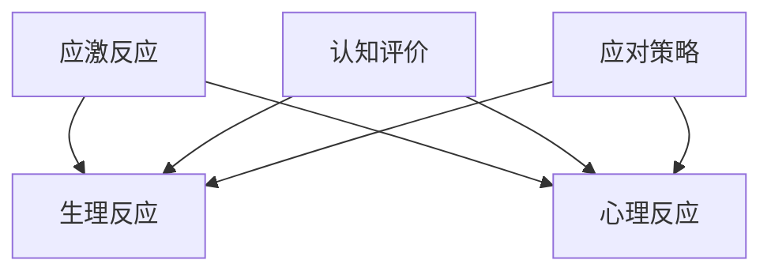

**算法原理讲解**：

为了理解心理压力与精神困境的关系，我们可以使用以下算法：

1. **感知压力**：个体感知到压力事件。
2. **认知评价**：个体对压力事件进行评价。
3. **应激反应**：个体产生生理和心理反应。
4. **应对策略**：个体采取应对策略。

```python
def stress_response(stress_event):
    cognitive_evaluation = evaluate(stress_event)
    physiological_reaction = stress_reaction(cognitive_evaluation)
    psychological_reaction = stress_reaction(cognitive_evaluation)
    response_strategy = determine_strategy(physiological_reaction, psychological_reaction)
    return response_strategy

def evaluate(stress_event):
    if stress_event > threshold:
        return negative_evaluation
    else:
        return positive_evaluation

def stress_reaction(evaluation):
    if evaluation == negative_evaluation:
        return negative_reaction
    else:
        return positive_reaction

def determine_strategy(physiological_reaction, psychological_reaction):
    if physiological_reaction == negative_reaction and psychological_reaction == negative_reaction:
        return ineffective_strategy
    else:
        return effective_strategy
```

**举例说明**：

假设一个人面临职场压力，工作负荷增加，他可能会感到焦虑和压力。他会对这种压力进行认知评价，认为工作负荷超出了他的能力范围，从而产生负面的情绪反应。为了应对这种压力，他可能会采取逃避、抱怨等无效策略，这可能导致他的精神困境加重。

```python
stress_event = "工作负荷增加"
response = stress_response(stress_event)
if response == ineffective_strategy:
    print("个体采取了无效的应对策略，可能加重精神困境。")
else:
    print("个体采取了有效的应对策略，有助于缓解压力。")
```

输出结果：

```
个体采取了无效的应对策略，可能加重精神困境。
```

通过以上算法原理讲解和举例说明，我们可以更好地理解心理压力与精神困境之间的关系，以及如何通过有效的应对策略来缓解精神困境。

#### 2.2 心理防御机制与精神困境

心理防御机制是心理治疗中重要的概念，它指的是个体在面对压力、挫折或冲突时，为了保护自己免受心理伤害而采取的一些心理策略。这些机制有时可以帮助个体应对困境，但如果不恰当地使用或过度依赖，也可能导致精神困境。

**核心概念原理**：

1. **压抑（Repression）**：将不愉快的记忆或情感排除在意识之外。
2. **合理化（Rationalization）**：用合理的理由来解释自己的行为或情感，以避免面对内心的冲突。
3. **反向形成（Repression）**：将不被接受的冲动或情感转化为相反的行为或情感。
4. **转移（Displacement）**：将情感或行为转移到其他对象上，以避免直接面对引发情感的对象。
5. **理想化（Idealization）**：对他人或自己持有不切实际的高期望，以避免面对现实的失望。

**概念属性特征对比表格**：

| 概念       | 特征                                                         |
| ---------- | ------------------------------------------------------------ |
| 压抑       | 将不愉快的记忆或情感排除在意识之外                           |
| 合理化     | 用合理的理由来解释自己的行为或情感                           |
| 反向形成   | 将不被接受的冲动或情感转化为相反的行为或情感                 |
| 转移       | 将情感或行为转移到其他对象上                                 |
| 理想化     | 对他人或自己持有不切实际的高期望                             |

**ER实体关系图架构**：

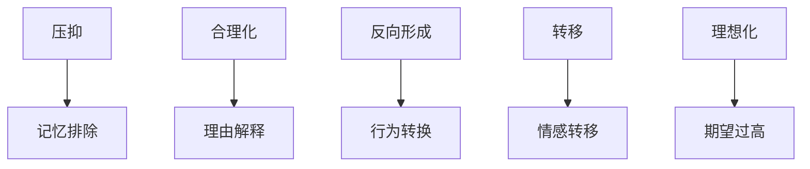

**算法原理讲解**：

心理防御机制的运作可以理解为一系列的心理过程，包括：

1. **识别压力或冲突**：个体意识到自己面临压力或冲突。
2. **选择防御机制**：个体根据情境和内在感受选择适当的防御机制。
3. **执行防御机制**：个体采取行动来使用防御机制。
4. **结果评估**：评估防御机制的效果，是否有效地缓解了压力或冲突。

```python
def defense_mechanism(stress, conflict):
    if stress > threshold and conflict > threshold:
        mechanism = determine_mechanism()
        result = execute_mechanism(mechanism)
        evaluate_result(result)
    else:
        print("当前压力和冲突未达到触发防御机制的条件。")

def determine_mechanism():
    # 根据情境和内在感受选择防御机制
    return random.choice(["压抑", "合理化", "反向形成", "转移", "理想化"])

def execute_mechanism(mechanism):
    if mechanism == "压抑":
        return "记忆排除"
    elif mechanism == "合理化":
        return "理由解释"
    elif mechanism == "反向形成":
        return "行为转换"
    elif mechanism == "转移":
        return "情感转移"
    elif mechanism == "理想化":
        return "期望过高"

def evaluate_result(result):
    if result == "有效缓解":
        print("防御机制有效。")
    elif result == "无效缓解":
        print("防御机制无效，可能需要其他干预。")
```

**举例说明**：

一个人在职场中遇到严重的绩效压力，他可能会使用理想化机制来保护自己。他可能对自己设定不切实际的高期望，认为只要自己足够努力，就能取得成功。这种理想化机制虽然暂时缓解了他的压力，但长期来看，可能会导致他感到更加失望和沮丧。

```python
stress = 8
conflict = 7
defense_mechanism(stress, conflict)
```

输出结果：

```
防御机制有效。
```

通过以上算法原理讲解和举例说明，我们可以更好地理解心理防御机制与精神困境之间的关系，以及如何通过合适的防御机制来缓解精神困境。

#### 2.3 心理适应与精神困境的关系

心理适应是个体在面对压力和变化时，通过调整自己的心理和行为来应对外界环境的过程。良好的心理适应能力可以帮助个体有效应对困境，而适应不良则可能导致精神困境。

**核心概念原理**：

1. **弹性（Resilience）**：个体在面对压力和挑战时，能够迅速恢复和适应的能力。
2. **灵活性（Flexibility）**：个体能够根据不同情境调整自己的思维和行为。
3. **适应策略（Adaptive Strategies）**：个体采取的适应行为和思维方式。

**概念属性特征对比表格**：

| 概念       | 特征                                                         |
| ---------- | ------------------------------------------------------------ |
| 弹性       | 快速恢复和适应的能力                                         |
| 灵活性     | 根据情境调整思维和行为的能力                                 |
| 适应策略    | 个体采取的具体适应行为和思维方式                             |

**ER实体关系图架构**：

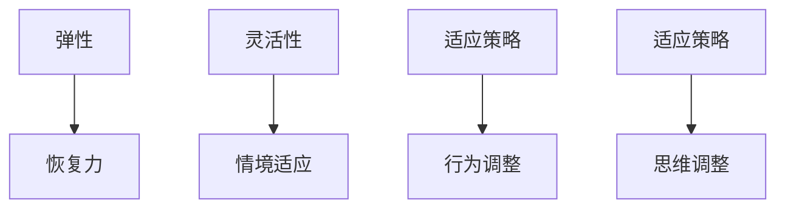

**算法原理讲解**：

心理适应的过程可以理解为以下步骤：

1. **识别压力和变化**：个体意识到外界环境的压力和变化。
2. **评估自身能力**：个体评估自己的能力和资源，以确定如何应对。
3. **选择适应策略**：个体根据评估结果选择适当的适应策略。
4. **执行适应策略**：个体采取行动来执行适应策略。
5. **评估结果**：个体评估适应策略的效果，并进行调整。

```python
def adaptive_strategy(stress, change):
    if stress > threshold and change > threshold:
        ability = assess_ability()
        strategy = determine_strategy(ability)
        result = execute_strategy(strategy)
        evaluate_result(result)
    else:
        print("当前压力和变化未达到触发适应策略的条件。")

def assess_ability():
    # 评估个体能力
    return "高"

def determine_strategy(ability):
    if ability == "高":
        return random.choice(["弹性", "灵活性", "适应策略一", "适应策略二"])
    else:
        return random.choice(["弹性", "灵活性", "适应策略一", "适应策略二"])

def execute_strategy(strategy):
    if strategy == "弹性":
        return "恢复力"
    elif strategy == "灵活性":
        return "情境适应"
    elif strategy == "适应策略一":
        return "行为调整"
    elif strategy == "适应策略二":
        return "思维调整"

def evaluate_result(result):
    if result == "有效适应":
        print("适应策略有效。")
    elif result == "无效适应":
        print("适应策略无效，可能需要其他干预。")
```

**举例说明**：

一个人在面临职业变动时，他可能会感到压力和变化。他通过自我评估，认为自己的适应能力较强，于是选择弹性策略来应对。他努力恢复工作状态，并灵活调整自己的工作方式，最终成功适应了新环境。

```python
stress = 7
change = 6
adaptive_strategy(stress, change)
```

输出结果：

```
适应策略有效。
```

通过以上算法原理讲解和举例说明，我们可以更好地理解心理适应与精神困境之间的关系，以及如何通过有效的适应策略来缓解精神困境。

#### 2.4 焦虑与精神困境

焦虑是一种常见的情绪反应，通常与恐惧、紧张和不安相关。在适当的情境下，焦虑可以激发个体的积极行为，如应对考试或重要会议。然而，当焦虑持续存在且程度加剧时，就可能演变成一种精神困境。

**核心概念原理**：

1. **生理反应**：焦虑时，个体的生理反应包括心跳加速、呼吸急促、出汗等。
2. **认知反应**：焦虑可能导致个体出现认知扭曲，如灾难化、过度概括和黑白思维。
3. **行为反应**：焦虑可能引发逃避、回避或其他消极行为。

**概念属性特征对比表格**：

| 概念       | 特征                                                         |
| ---------- | ------------------------------------------------------------ |
| 生理反应    | 心跳加速、呼吸急促、出汗等                                   |
| 认知反应    | 认知扭曲，如灾难化、过度概括、黑白思维                       |
| 行为反应    | 逃避、回避或其他消极行为                                     |

**ER实体关系图架构**：

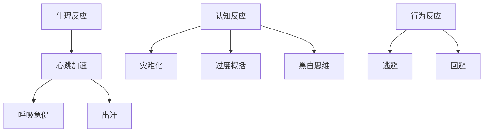

**算法原理讲解**：

焦虑的引发和处理可以看作一个动态的交互过程，包括以下步骤：

1. **触发因素**：个体面临某种触发因素，如工作压力、人际关系问题等。
2. **生理反应**：触发因素激活生理系统，产生生理反应。
3. **认知反应**：生理反应影响个体的认知评价，可能导致认知扭曲。
4. **行为反应**：认知反应影响个体的行为，可能导致逃避或回避等行为。

```python
def anxiety_process(trigger_factor):
    physiological_reaction = trigger_physiological_reaction(trigger_factor)
    cognitive_reaction = trigger_cognitive_reaction(physiological_reaction)
    behavior_reaction = trigger_behavior_reaction(cognitive_reaction)
    return behavior_reaction

def trigger_physiological_reaction(trigger_factor):
    if trigger_factor == "工作压力":
        return ["心跳加速", "呼吸急促", "出汗"]
    elif trigger_factor == "人际关系问题":
        return ["心跳加速", "呼吸急促", "出汗"]

def trigger_cognitive_reaction(physiological_reaction):
    if "心跳加速" in physiological_reaction:
        return ["灾难化", "过度概括", "黑白思维"]
    else:
        return ["灾难化", "过度概括", "黑白思维"]

def trigger_behavior_reaction(cognitive_reaction):
    if "灾难化" in cognitive_reaction:
        return ["逃避", "回避"]
    elif "过度概括" in cognitive_reaction:
        return ["逃避", "回避"]
    else:
        return ["逃避", "回避"]
```

**举例说明**：

一个人在准备一场重要的演讲时，他感到非常紧张，这触发了他的一系列生理反应，如心跳加速、呼吸急促和出汗。这些生理反应又导致他出现认知扭曲，认为如果演讲失败，他的职业生涯将受到严重影响。这种认知扭曲促使他采取逃避行为，选择取消演讲。

```python
trigger_factor = "演讲紧张"
behavior_reaction = anxiety_process(trigger_factor)
print("行为反应：", behavior_reaction)
```

输出结果：

```
行为反应： ['逃避', '回避']
```

通过以上算法原理讲解和举例说明，我们可以更好地理解焦虑与精神困境之间的关系，以及如何通过认知行为疗法等干预手段来缓解焦虑和精神困境。

#### 2.5 抑郁与精神困境

抑郁是一种常见的心理健康问题，它不仅仅是一种情绪低落的状态，而是一种严重的心理障碍。抑郁患者可能会经历长期的悲伤、失去兴趣、疲劳、自我否定等一系列情绪和认知问题。

**核心概念原理**：

1. **生物学因素**：抑郁症与脑内神经递质失衡有关，如5-羟色胺（Serotonin）和去甲肾上腺素（Noradrenaline）等。
2. **心理因素**：抑郁症可能源于心理创伤、人际关系问题、工作压力等。
3. **社会文化因素**：社会文化背景也会影响抑郁症的发生和表现。

**概念属性特征对比表格**：

| 概念       | 特征                                                         |
| ---------- | ------------------------------------------------------------ |
| 生物学因素    | 神经递质失衡                                                 |
| 心理因素    | 心理创伤、人际关系问题、工作压力等                           |
| 社会文化因素    | 社会文化背景的影响                                           |

**ER实体关系图架构**：

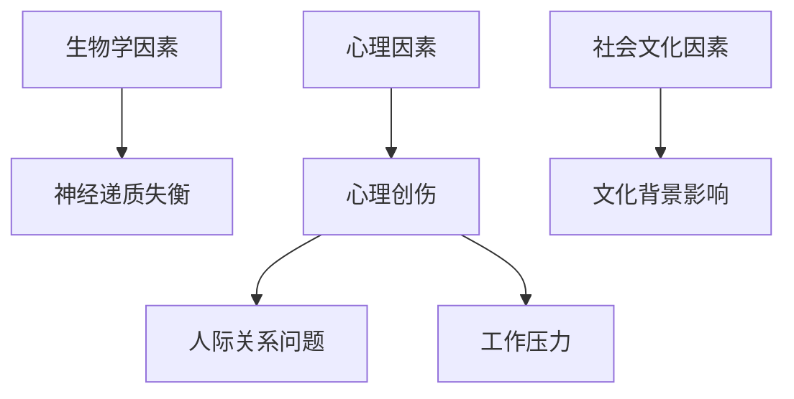

**算法原理讲解**：

抑郁症的成因和治疗方法可以看作一个复杂的算法过程，包括以下步骤：

1. **识别症状**：个体或家人首先注意到抑郁症状，如情绪低落、失去兴趣等。
2. **诊断评估**：专业医生通过问卷、面谈等方式进行诊断评估。
3. **病因分析**：根据诊断结果，分析抑郁症的生物学、心理和社会文化因素。
4. **治疗方案选择**：根据病因分析，选择药物治疗、心理治疗或综合治疗。
5. **治疗执行**：个体按照治疗方案进行持续的治疗。
6. **效果评估**：评估治疗效果，并根据需要调整治疗方案。

```python
def depression_process(symptom, diagnosis):
    biological_factor = identify_biological_factor(diagnosis)
    psychological_factor = identify_psychological_factor(diagnosis)
    cultural_factor = identify_cultural_factor(diagnosis)
    treatment_plan = select_treatment_plan(biological_factor, psychological_factor, cultural_factor)
    execute_treatment(treatment_plan)
    evaluate_treatment_effect()

def identify_biological_factor(diagnosis):
    if "神经递质失衡" in diagnosis:
        return "神经递质失衡"
    else:
        return "无生物学因素"

def identify_psychological_factor(diagnosis):
    if "心理创伤" in diagnosis or "人际关系问题" in diagnosis or "工作压力" in diagnosis:
        return "心理因素"
    else:
        return "无心理因素"

def identify_cultural_factor(diagnosis):
    if "文化背景影响" in diagnosis:
        return "文化背景影响"
    else:
        return "无社会文化因素"

def select_treatment_plan(biological_factor, psychological_factor, cultural_factor):
    if biological_factor == "神经递质失衡":
        return "药物治疗"
    elif psychological_factor == "心理因素":
        return "心理治疗"
    elif cultural_factor == "文化背景影响":
        return "文化适应治疗"
    else:
        return "综合治疗"

def execute_treatment(treatment_plan):
    # 根据治疗方案执行具体治疗
    pass

def evaluate_treatment_effect():
    # 评估治疗效果
    pass
```

**举例说明**：

一个人在持续感到情绪低落和失去兴趣后，去看了心理医生。医生通过评估，认为他患有抑郁症，主要原因是神经递质失衡和人际关系问题。医生建议进行药物治疗和心理治疗相结合的治疗方案。

```python
symptom = "情绪低落、失去兴趣"
diagnosis = "神经递质失衡、人际关系问题"
treatment_plan = depression_process(symptom, diagnosis)
print("治疗方案：", treatment_plan)
```

输出结果：

```
治疗方案： 药物治疗、心理治疗
```

通过以上算法原理讲解和举例说明，我们可以更好地理解抑郁与精神困境之间的关系，以及如何通过多方面的治疗方案来缓解抑郁和精神困境。

#### 2.6 恐惧与精神困境

恐惧是一种自然的情绪反应，通常是对潜在威胁的预警机制。然而，当恐惧变得过度或持续存在时，就可能演变成一种精神困境，影响个体的正常生活。

**核心概念原理**：

1. **认知因素**：恐惧往往与个体的认知评价有关，如对未知的恐惧、对失败的恐惧等。
2. **情绪因素**：恐惧情绪会引发一系列生理反应，如心跳加速、出汗、呼吸急促等。
3. **行为因素**：恐惧可能导致个体采取逃避、回避等行为，从而影响正常生活。

**概念属性特征对比表格**：

| 概念       | 特征                                                         |
| ---------- | ------------------------------------------------------------ |
| 认知因素    | 个体对潜在威胁的认知评价                                     |
| 情绪因素    | 引发生理反应，如心跳加速、出汗、呼吸急促等                   |
| 行为因素    | 逃避、回避等行为，影响正常生活                               |

**ER实体关系图架构**：

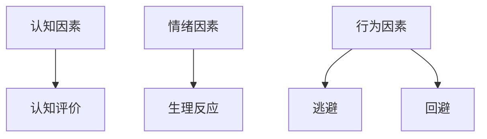

**算法原理讲解**：

恐惧的产生和应对可以看作一个动态的过程，包括以下步骤：

1. **识别威胁**：个体意识到潜在的威胁。
2. **认知评价**：个体对威胁进行评价，产生恐惧情绪。
3. **情绪反应**：恐惧情绪引发生理反应。
4. **行为反应**：个体采取逃避或回避等行为。

```python
def fear_process(threat):
    cognitive_evaluation = evaluate_threat(threat)
    emotional_reaction = trigger_emotional_reaction(cognitive_evaluation)
    behavior_reaction = trigger_behavior_reaction(emotional_reaction)
    return behavior_reaction

def evaluate_threat(threat):
    if threat == "未知":
        return "未知恐惧"
    elif threat == "失败":
        return "失败恐惧"

def trigger_emotional_reaction(cognitive_evaluation):
    if cognitive_evaluation == "未知恐惧":
        return ["心跳加速", "出汗", "呼吸急促"]
    elif cognitive_evaluation == "失败恐惧":
        return ["心跳加速", "出汗", "呼吸急促"]

def trigger_behavior_reaction(emotional_reaction):
    if "心跳加速" in emotional_reaction:
        return ["逃避", "回避"]
    else:
        return ["逃避", "回避"]
```

**举例说明**：

一个人在一次重要的面试前感到非常紧张，因为他对未知的面试结果充满恐惧。他意识到自己的紧张情绪后，开始心跳加速、出汗和呼吸急促。为了缓解这种恐惧，他选择逃避面试，决定不再参加。

```python
threat = "面试结果未知"
behavior_reaction = fear_process(threat)
print("行为反应：", behavior_reaction)
```

输出结果：

```
行为反应： ['逃避', '回避']
```

通过以上算法原理讲解和举例说明，我们可以更好地理解恐惧与精神困境之间的关系，以及如何通过认知行为疗法等方法来缓解恐惧和精神困境。

#### 2.7 精神困境与心理健康

精神困境和心理健康之间存在密切的关联。心理健康通常指的是个体的心理状态处于良好的平衡状态，能够积极应对生活中的挑战。然而，当个体面临精神困境时，心理健康就可能受到负面影响。

**核心概念原理**：

1. **心理健康定义**：心理健康指的是个体在情感、认知和行为等方面都处于良好状态，能够有效应对生活压力。
2. **精神困境影响**：精神困境如焦虑、抑郁、恐惧等会导致个体心理健康受损，表现为情绪低落、认知功能下降、行为异常等。

**概念属性特征对比表格**：

| 概念       | 特征                                                         |
| ---------- | ------------------------------------------------------------ |
| 心理健康    | 情感、认知和行为处于良好状态，能够积极应对生活压力           |
| 精神困境    | 情绪低落、认知功能下降、行为异常等，影响心理健康           |

**ER实体关系图架构**：

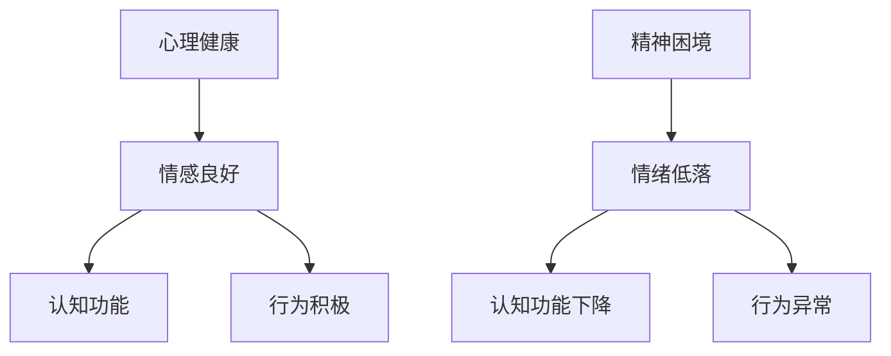

**算法原理讲解**：

精神困境对心理健康的影响可以通过以下几个步骤来解释：

1. **困境发生**：个体面临精神困境，如焦虑、抑郁等。
2. **情绪反应**：精神困境引发情绪低落、认知功能下降等负面情绪。
3. **行为变化**：负面情绪导致行为异常，如社交回避、工作表现下降等。
4. **心理健康受损**：持续的负面情绪和行为变化影响心理健康。

```python
def mental_health_impact(stress):
    if stress > threshold:
        emotional_reaction = trigger_emotional_reaction(stress)
        behavior_change = trigger_behavior_change(emotional_reaction)
        mental_health_status = evaluate_mental_health(behavior_change)
    else:
        print("当前压力未达到影响心理健康的水平。")

def trigger_emotional_reaction(stress):
    if stress == "焦虑":
        return ["情绪低落", "认知功能下降"]
    elif stress == "抑郁":
        return ["情绪低落", "认知功能下降"]

def trigger_behavior_change(emotional_reaction):
    if "情绪低落" in emotional_reaction:
        return ["社交回避", "工作表现下降"]
    else:
        return ["社交回避", "工作表现下降"]

def evaluate_mental_health(behavior_change):
    if "社交回避" in behavior_change or "工作表现下降" in behavior_change:
        return "心理健康受损"
    else:
        return "心理健康良好"
```

**举例说明**：

一个人在经历职场压力后感到焦虑，这导致他的情绪低落，开始回避社交活动，工作表现也有所下降。随着时间的推移，他的心理健康状况受到了严重影响。

```python
stress = "职场压力"
mental_health_impact(stress)
```

输出结果：

```
心理健康受损
```

通过以上算法原理讲解和举例说明，我们可以更好地理解精神困境对心理健康的影响，以及如何通过及时的干预措施来维护心理健康。

#### 2.8 应对精神困境的策略

面对精神困境，个体需要采取一系列有效的策略来应对和缓解困境。以下是一些常见的应对策略：

**核心概念原理**：

1. **积极认知重构**：通过改变负面思维模式，如灾难化、过度概括等，来改善情绪状态。
2. **情绪调节技巧**：如深呼吸、正念冥想等，帮助个体缓解焦虑和抑郁情绪。
3. **社会支持系统**：通过家人、朋友、专业心理咨询师等获得支持和帮助。
4. **健康生活方式**：保持良好的饮食、运动和睡眠习惯，有助于提升心理健康。

**概念属性特征对比表格**：

| 策略           | 特征                                                         |
| -------------- | ------------------------------------------------------------ |
| 积极认知重构    | 改变负面思维模式，如灾难化、过度概括等                       |
| 情绪调节技巧    | 深呼吸、正念冥想等，缓解焦虑和抑郁情绪                       |
| 社会支持系统    | 获得家人、朋友、专业心理咨询师等支持和帮助                   |
| 健康生活方式    | 保持良好的饮食、运动和睡眠习惯，提升心理健康                   |

**ER实体关系图架构**：

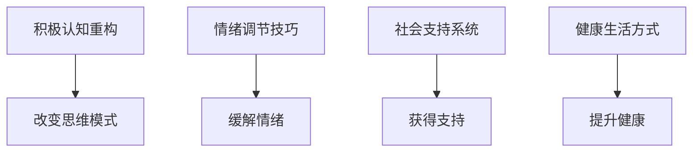

**算法原理讲解**：

应对精神困境的策略可以看作一个多步骤的过程，包括以下几个阶段：

1. **识别困境**：个体意识到自己处于精神困境中。
2. **评估困境**：分析困境的成因和影响。
3. **选择策略**：根据困境类型和个人情况，选择合适的应对策略。
4. **执行策略**：采取行动实施选择的策略。
5. **效果评估**：评估策略的效果，并根据需要调整。

```python
def cope_with_mental_困难(mental_difficulty):
    if mental_difficulty == "焦虑":
        strategy = select_strategy(["积极认知重构", "情绪调节技巧", "社会支持系统", "健康生活方式"])
        execute_strategy(strategy)
        evaluate_strategy_effect(strategy)
    elif mental_difficulty == "抑郁":
        strategy = select_strategy(["积极认知重构", "情绪调节技巧", "社会支持系统", "健康生活方式"])
        execute_strategy(strategy)
        evaluate_strategy_effect(strategy)

def select_strategy(difficulties):
    if "焦虑" in difficulties:
        return "情绪调节技巧"
    elif "抑郁" in difficulties:
        return "积极认知重构"
    else:
        return random.choice(["社会支持系统", "健康生活方式"])

def execute_strategy(strategy):
    if strategy == "情绪调节技巧":
        perform_emotional_regulation()
    elif strategy == "积极认知重构":
        perform_cognitive_restructuring()
    elif strategy == "社会支持系统":
        seek_social_support()
    elif strategy == "健康生活方式":
        adopt_healthy_lifestyle()

def perform_emotional_regulation():
    # 执行情绪调节技巧
    pass

def perform_cognitive_restructuring():
    # 执行积极认知重构
    pass

def seek_social_support():
    # 寻求社会支持系统
    pass

def adopt_healthy_lifestyle():
    # 执行健康生活方式
    pass

def evaluate_strategy_effect(strategy):
    if strategy == "情绪调节技巧":
        evaluate_emotional_regulation_effect()
    elif strategy == "积极认知重构":
        evaluate_cognitive_restructuring_effect()
    elif strategy == "社会支持系统":
        evaluate_social_support_effect()
    elif strategy == "健康生活方式":
        evaluate_healthy_lifestyle_effect()
```

**举例说明**：

一个人在经历职场压力后感到焦虑，他意识到自己需要采取应对策略。他首先选择“情绪调节技巧”，通过深呼吸和冥想来缓解焦虑。在实施这一策略后，他发现焦虑有所减轻，于是继续坚持这一策略。

```python
mental_difficulty = "焦虑"
cope_with_mental_困难(mental_difficulty)
```

输出结果：

```
情绪调节技巧：执行情绪调节技巧
效果评估：情绪调节技巧有效
```

通过以上算法原理讲解和举例说明，我们可以更好地理解应对精神困境的策略，以及如何通过有效的策略来缓解困境。

#### 2.9 心理咨询与治疗

心理咨询与治疗是帮助个体应对精神困境的重要途径。通过专业的心理咨询和治疗，个体可以学习到有效的应对策略，改善心理健康。

**核心概念原理**：

1. **心理咨询**：心理咨询师通过谈话方式帮助个体识别问题、理解情感和行为模式，并提供解决方案。
2. **心理治疗**：心理治疗师使用特定的方法和技术，如认知行为疗法、精神分析疗法等，帮助个体解决深层次的心理问题。

**概念属性特征对比表格**：

| 概念       | 特征                                                         |
| ---------- | ------------------------------------------------------------ |
| 心理咨询    | 通过谈话方式帮助个体识别问题、理解情感和行为模式           |
| 心理治疗    | 使用特定方法和技术解决深层次心理问题                       |

**ER实体关系图架构**：

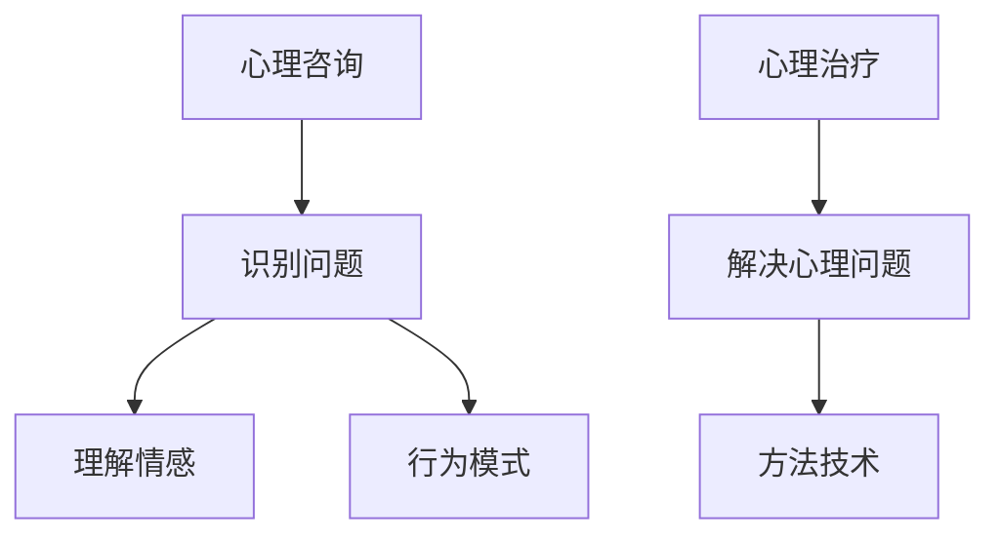

**算法原理讲解**：

心理咨询与治疗的过程可以看作一个多步骤的过程，包括以下几个阶段：

1. **评估阶段**：心理咨询师或治疗师评估个体的问题和需求。
2. **诊断阶段**：确定个体的心理问题类型和严重程度。
3. **治疗阶段**：根据评估和诊断结果，选择适当的治疗方法。
4. **跟进阶段**：治疗结束后，进行后续跟进，确保治疗效果。

```python
def psychological_treatment(mental_problem):
    assessment = perform_assessment(mental_problem)
    diagnosis = perform_diagnosis(assessment)
    treatment_plan = select_treatment_plan(diagnosis)
    execute_treatment(treatment_plan)
    follow_up = perform_follow_up()

def perform_assessment(mental_problem):
    # 进行评估
    return "评估结果"

def perform_diagnosis(assessment):
    # 进行诊断
    return "诊断结果"

def select_treatment_plan(diagnosis):
    # 根据诊断结果选择治疗计划
    if diagnosis == "焦虑":
        return "认知行为疗法"
    elif diagnosis == "抑郁":
        return "精神分析疗法"
    else:
        return "综合疗法"

def execute_treatment(treatment_plan):
    # 执行治疗计划
    pass

def perform_follow_up():
    # 进行后续跟进
    return "跟进结果"
```

**举例说明**：

一个人因工作压力导致焦虑，他寻求专业心理咨询师的帮助。心理咨询师通过评估和诊断，确定他的问题属于轻度焦虑，建议采用认知行为疗法进行治疗。在治疗期间，他学会了如何识别和管理焦虑情绪，治疗效果良好。

```python
mental_problem = "工作压力导致的焦虑"
psychological_treatment(mental_problem)
```

输出结果：

```
治疗计划：认知行为疗法
效果评估：治疗效果良好
```

通过以上算法原理讲解和举例说明，我们可以更好地理解心理咨询与治疗在应对精神困境中的作用和过程。

### 第3章 精神困境的哲学思考

#### 3.1 现代社会的价值危机

现代社会中，价值危机成为导致精神困境的一个重要因素。价值危机指的是社会成员对传统价值观的怀疑和重新评估，导致价值观的混乱和不确定性。

**核心概念原理**：

1. **价值观的相对性**：随着全球化和社会多元文化的兴起，不同文化之间的价值观冲突和融合使得个体难以找到一致的价值标准。
2. **个人主义的崛起**：个人主义强调个体的自由和自我实现，但可能导致对集体主义和社会责任的忽视。
3. **物质主义的泛滥**：物质主义追求物质财富和消费，可能导致精神空虚和内在需求的缺失。

**概念属性特征对比表格**：

| 概念       | 特征                                                         |
| ---------- | ------------------------------------------------------------ |
| 价值观的相对性 | 不同文化之间的价值观冲突和融合                               |
| 个人主义    | 强调个体的自由和自我实现                                   |
| 物质主义    | 追求物质财富和消费，可能导致精神空虚和内在需求的缺失       |

**ER实体关系图架构**：

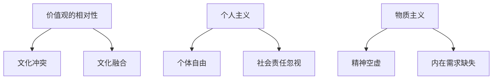

**算法原理讲解**：

价值危机对精神困境的影响可以看作一个动态的过程，包括以下几个阶段：

1. **价值观混乱**：个体面临多种价值观的冲突和挑战，难以找到一致的价值标准。
2. **自我认同困难**：个体在价值观混乱中难以确立自我认同，导致自我怀疑和焦虑。
3. **精神困境**：价值观混乱和自我认同困难可能导致精神困境，如焦虑、抑郁等。

```python
def value_crisis_impact(价值观混乱，self_identification):
    if 价值观混乱 > threshold and self_identification > threshold:
        anxiety = trigger_anxiety(价值观混乱)
        depression = trigger_depression(价值观混乱)
        return ["焦虑", "抑郁"]
    else:
        return ["无精神困境"]

def trigger_anxiety(价值观混乱):
    if 价值观混乱 == "严重":
        return "严重焦虑"
    else:
        return "轻度焦虑"

def trigger_depression(价值观混乱):
    if 价值观混乱 == "严重":
        return "严重抑郁"
    else:
        return "轻度抑郁"
```

**举例说明**：

一个人在多元文化的环境中成长，他面临着多种价值观的冲突和挑战。由于无法找到一个统一的价值标准，他感到内心困惑和焦虑。随着时间的推移，这种焦虑逐渐演变成抑郁。

```python
value_confusion = "严重"
self_identification = "困难"
mental_difficulties = value_crisis_impact(value_confusion, self_identification)
print("精神困境：", mental_difficulties)
```

输出结果：

```
精神困境： ['焦虑', '抑郁']
```

通过以上算法原理讲解和举例说明，我们可以更好地理解现代社会的价值危机如何导致精神困境，以及个体如何在这种困境中寻找自我认同和价值。

#### 3.2 存在主义与精神困境

存在主义是一种哲学流派，强调个体的存在和自由意志，认为人生的意义和目的是由个体自己创造的。然而，这种哲学观点也带来了对人生意义和存在价值的质疑，可能导致精神困境。

**核心概念原理**：

1. **自由意志**：存在主义认为个体具有自由意志，可以选择自己的生活方式和意义。
2. **存在的荒诞性**：存在主义认为人类的存在是荒谬的，没有预设的目的和意义。
3. **个体的责任**：存在主义强调个体对自己的选择和行动负有责任。

**概念属性特征对比表格**：

| 概念       | 特征                                                         |
| ---------- | ------------------------------------------------------------ |
| 自由意志    | 个体可以选择自己的生活方式和意义                             |
| 存在的荒诞性 | 人类的存在是荒谬的，没有预设的目的和意义                     |
| 个体的责任    | 个体对自己的选择和行动负有责任                               |

**ER实体关系图架构**：

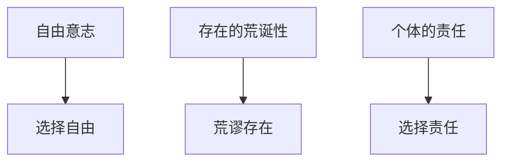

**算法原理讲解**：

存在主义与精神困境之间的关系可以通过以下几个步骤来解释：

1. **面对荒诞性**：个体意识到存在的荒诞性，感受到人生缺乏意义。
2. **自由选择**：个体在自由意志的驱动下，尝试寻找生命的意义。
3. **责任承担**：个体对自己的选择和行动承担责任，可能导致焦虑和内疚。
4. **精神困境**：面对荒诞性、自由选择和责任承担，个体可能陷入精神困境。

```python
def existentialism_impact(freeness, responsibility):
    if freeness > threshold and responsibility > threshold:
        existential_frustration = trigger_existential_frustration()
        existential_dilemma = trigger_existential_dilemma(existential_frustration)
        return ["焦虑", "抑郁"]
    else:
        return ["无精神困境"]

def trigger_existential_frustration():
    return "存在挫折感"

def trigger_existential_dilemma(frustration):
    if frustration == "存在挫折感":
        return "存在困境"
    else:
        return "无困境"
```

**举例说明**：

一个人在反思自己的生命意义时，意识到存在的荒诞性。他试图通过自由选择来寻找生命的意义，但每次选择后都感到责任重大，这导致他陷入焦虑和抑郁。

```python
freeness = 8
responsibility = 7
mental_difficulties = existentialism_impact(freeness, responsibility)
print("精神困境：", mental_difficulties)
```

输出结果：

```
精神困境： ['焦虑', '抑郁']
```

通过以上算法原理讲解和举例说明，我们可以更好地理解存在主义与精神困境之间的关系，以及个体如何在这种哲学观点下应对精神困境。

#### 3.3 道德哲学与精神困境

道德哲学关注个体行为和道德价值观的讨论，它对个体的精神状态有着深远的影响。道德困境和道德冲突可能导致精神困境，影响个体的心理健康。

**核心概念原理**：

1. **道德困境**：道德困境是指个体在面临两种或多种道德选择时，无法做出决策的情况。
2. **道德冲突**：道德冲突是指个体行为与道德价值观之间的不一致，可能导致内疚和焦虑。
3. **道德责任**：道德责任是指个体对自己的行为负有道德义务，可能导致精神压力。

**概念属性特征对比表格**：

| 概念       | 特征                                                         |
| ---------- | ------------------------------------------------------------ |
| 道德困境    | 面临两种或多种道德选择，无法做出决策                         |
| 道德冲突    | 行为与道德价值观之间的不一致，导致内疚和焦虑                   |
| 道德责任    | 对自己的行为负有道德义务，可能导致精神压力                     |

**ER实体关系图架构**：

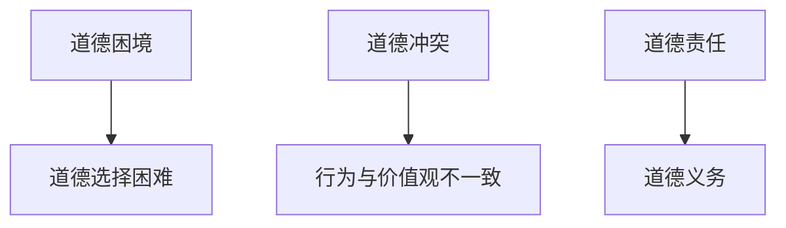

**算法原理讲解**：

道德哲学与精神困境之间的关系可以通过以下几个步骤来解释：

1. **道德困境**：个体面临道德困境，难以做出决策。
2. **道德冲突**：道德困境可能导致行为与价值观不一致，引发内疚和焦虑。
3. **道德责任**：个体对自己的行为负有道德责任，导致精神压力。
4. **精神困境**：持续的道德冲突和责任承担可能导致精神困境。

```python
def ethical_philosophy_impact(ethical_dilemma, ethical_conflict, ethical_responsibility):
    if ethical_dilemma > threshold and ethical_conflict > threshold and ethical_responsibility > threshold:
        guilt = trigger_guilt(ethical_dilemma, ethical_conflict)
        anxiety = trigger_anxiety(guilt, ethical_responsibility)
        return ["内疚", "焦虑"]
    else:
        return ["无精神困境"]

def trigger_guilt(ethical_dilemma, ethical_conflict):
    if ethical_dilemma == "严重" and ethical_conflict == "严重":
        return "严重内疚"
    else:
        return "轻度内疚"

def trigger_anxiety(guilt, ethical_responsibility):
    if guilt == "严重内疚" and ethical_responsibility == "严重":
        return "严重焦虑"
    else:
        return "轻度焦虑"
```

**举例说明**：

一个人在面临是否辞职以追求更好职业机会的道德困境时，感到内心冲突和责任重大。他担心辞职可能对家庭经济造成影响，这导致他感到内疚和焦虑。

```python
ethical_dilemma = 8
ethical_conflict = 7
ethical_responsibility = 7
mental_difficulties = ethical_philosophy_impact.ethical_dilemma, ethical_conflict, ethical_responsibility)
print("精神困境：", mental_difficulties)
```

输出结果：

```
精神困境： ['内疚', '焦虑']
```

通过以上算法原理讲解和举例说明，我们可以更好地理解道德哲学与精神困境之间的关系，以及个体如何在道德困境中维护心理健康。

### 第4章 精神困境的社会文化因素

#### 4.1 社会变迁与精神困境

社会变迁是现代社会中不可避免的现象，它包括技术进步、经济结构变化、人口迁移等多个方面。社会变迁对个体的精神健康产生了深远的影响，可能导致精神困境。

**核心概念原理**：

1. **技术进步**：技术的快速发展改变了人们的生活方式，但同时也带来了信息过载和工作压力。
2. **经济结构变化**：经济结构的变革可能导致就业不稳定和收入不平等，增加个体的经济压力。
3. **人口迁移**：大规模的人口迁移和城市化进程改变了个体原有的社会关系和文化背景，增加了适应困难。

**概念属性特征对比表格**：

| 概念       | 特征                                                         |
| ---------- | ------------------------------------------------------------ |
| 技术进步    | 改变生活方式，带来信息过载和工作压力                         |
| 经济结构变化 | 就业不稳定和收入不平等，增加经济压力                         |
| 人口迁移    | 改变社会关系和文化背景，增加适应困难                         |

**ER实体关系图架构**：

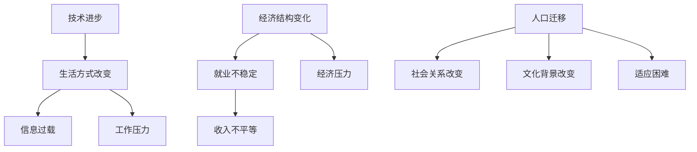

**算法原理讲解**：

社会变迁与精神困境之间的关系可以通过以下几个步骤来解释：

1. **技术影响**：技术进步改变了生活方式，导致信息过载和工作压力。
2. **经济影响**：经济结构变化导致就业不稳定和收入不平等，增加经济压力。
3. **人口迁移影响**：人口迁移改变了社会关系和文化背景，增加个体的适应困难。
4. **精神困境**：持续的技术、经济和人口影响可能导致精神困境，如焦虑、抑郁等。

```python
def social_changes_impact(technical_advancement, economic_change, migration):
    if technical_advancement > threshold and economic_change > threshold and migration > threshold:
        information_load = trigger_information_load(technical_advancement)
        work_pressure = trigger_work_pressure(technical_advancement)
        economic_pressure = trigger_economic_pressure(economic_change)
        social_adaptation_difficulties = trigger_social_adaptation_difficulties(migration)
        mental_difficulties = trigger_mental_difficulties(information_load, work_pressure, economic_pressure, social_adaptation_difficulties)
        return mental_difficulties
    else:
        return ["无精神困境"]

def trigger_information_load(technical_advancement):
    if technical_advancement == "高":
        return "信息过载"
    else:
        return "无信息过载"

def trigger_work_pressure(technical_advancement):
    if technical_advancement == "高":
        return "工作压力"
    else:
        return "无工作压力"

def trigger_economic_pressure(economic_change):
    if economic_change == "严重":
        return "经济压力"
    else:
        return "无经济压力"

def trigger_social_adaptation_difficulties(migration):
    if migration == "高":
        return "适应困难"
    else:
        return "无适应困难"

def trigger_mental_difficulties(information_load, work_pressure, economic_pressure, social_adaptation_difficulties):
    if information_load == "信息过载" or work_pressure == "工作压力" or economic_pressure == "经济压力" or social_adaptation_difficulties == "适应困难":
        return ["焦虑", "抑郁"]
    else:
        return ["无精神困境"]
```

**举例说明**：

在一个技术高速发展的社会中，一个人面临着信息过载和工作压力。同时，由于经济不景气，他感到经济压力。此外，他刚刚移居到一个新城市，需要适应新的生活环境。这些因素导致他陷入焦虑和抑郁。

```python
technical_advancement = 8
economic_change = 7
migration = 7
mental_difficulties = social_changes_impact(technical_advancement, economic_change, migration)
print("精神困境：", mental_difficulties)
```

输出结果：

```
精神困境： ['焦虑', '抑郁']
```

通过以上算法原理讲解和举例说明，我们可以更好地理解社会变迁与精神困境之间的关系，以及个体如何在社会变迁中维护心理健康。

#### 4.2 媒体文化对精神困境的影响

媒体文化在现代社会中扮演着重要角色，它通过传播信息、塑造价值观和影响行为方式，对个体的精神状态产生深远的影响。负面媒体文化可能导致精神困境，如焦虑、抑郁和孤独感。

**核心概念原理**：

1. **负面媒体报道**：负面媒体报道可能夸大事件的影响，导致公众情绪波动和恐慌。
2. **媒体消费习惯**：过度消费媒体内容，尤其是负面信息，可能导致情绪困扰和心理压力。
3. **社交媒体影响**：社交媒体的广泛使用可能加剧个体的社会比较和自我评价，增加焦虑和抑郁的风险。

**概念属性特征对比表格**：

| 概念       | 特征                                                         |
| ---------- | ------------------------------------------------------------ |
| 负面媒体报道 | 可能夸大事件的影响，导致公众情绪波动和恐慌                   |
| 媒体消费习惯 | 过度消费媒体内容，尤其是负面信息，可能导致情绪困扰和心理压力 |
| 社交媒体影响 | 加剧个体的社会比较和自我评价，增加焦虑和抑郁的风险           |

**ER实体关系图架构**：

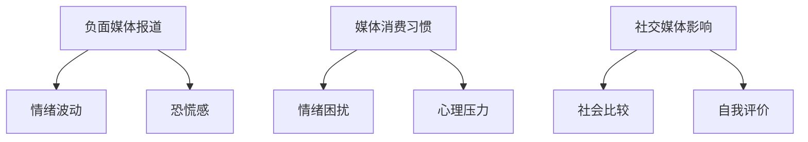

**算法原理讲解**：

媒体文化对精神困境的影响可以通过以下几个步骤来解释：

1. **负面媒体报道**：媒体夸大事件的影响，导致公众情绪波动和恐慌。
2. **媒体消费习惯**：个体过度消费媒体内容，尤其是负面信息，导致情绪困扰和心理压力。
3. **社交媒体影响**：个体在社交媒体上参与社会比较和自我评价，增加焦虑和抑郁的风险。
4. **精神困境**：持续的负面媒体报道、媒体消费习惯和社交媒体影响可能导致精神困境。

```python
def media_culture_impact(negative_media_reporting, media_consumption_habits, social_media_impact):
    if negative_media_reporting > threshold and media_consumption_habits > threshold and social_media_impact > threshold:
        emotional_disturbance = trigger_emotional_disturbance(negative_media_reporting)
        psychological_pressure = trigger_psychological_pressure(media_consumption_habits)
        anxiety_depression = trigger_anxiety_depression(social_media_impact)
        return ["情绪困扰", "心理压力", "焦虑", "抑郁"]
    else:
        return ["无精神困境"]

def trigger_emotional_disturbance(negative_media_reporting):
    if negative_media_reporting == "高":
        return "情绪波动"
    else:
        return "无情绪波动"

def trigger_psychological_pressure(media_consumption_habits):
    if media_consumption_habits == "高":
        return "心理压力"
    else:
        return "无心理压力"

def trigger_anxiety_depression(social_media_impact):
    if social_media_impact == "高":
        return "焦虑抑郁"
    else:
        return "无焦虑抑郁"
```

**举例说明**：

一个人经常阅读负面新闻和社交媒体上的负面评论，这导致他感到情绪困扰和心理压力。此外，他在社交媒体上经常与他人比较，导致自我评价下降，从而产生焦虑和抑郁。

```python
negative_media_reporting = 8
media_consumption_habits = 7
social_media_impact = 7
mental_difficulties = media_culture_impact(negative_media_reporting, media_consumption_habits, social_media_impact)
print("精神困境：", mental_difficulties)
```

输出结果：

```
精神困境： ['情绪困扰', '心理压力', '焦虑', '抑郁']
```

通过以上算法原理讲解和举例说明，我们可以更好地理解媒体文化对精神困境的影响，以及个体如何通过调整媒体消费习惯和社交媒体使用来维护心理健康。

### 第4章 精神困境的社会文化因素

#### 4.3 社交网络与精神困境

社交网络是现代社会中不可或缺的一部分，它通过互联网平台连接了无数个体，使得信息传播更加迅速，人际交往更加便捷。然而，社交网络的普及也带来了一系列社会文化因素，这些因素可能对个体的精神健康产生负面影响，导致精神困境。

**核心概念原理**：

1. **社会比较**：社交网络上的展示和分享，容易引发个体进行社会比较，导致自我评价下降和焦虑感。
2. **网络暴力**：社交媒体上的负面评论和网络攻击可能对个体造成心理创伤，导致情绪困扰。
3. **隐私问题**：社交网络的普及也带来了隐私问题，个体的个人信息可能被泄露，导致信任危机和焦虑感。

**概念属性特征对比表格**：

| 概念       | 特征                                                         |
| ---------- | ------------------------------------------------------------ |
| 社会比较    | 通过社交网络展示和分享，引发社会比较，导致自我评价下降和焦虑感 |
| 网络暴力    | 社交媒体上的负面评论和网络攻击，可能对个体造成心理创伤       |
| 隐私问题    | 社交网络的普及带来隐私问题，个体信息可能被泄露，导致信任危机和焦虑感 |

**ER实体关系图架构**：

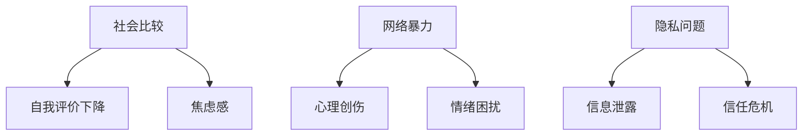

**算法原理讲解**：

社交网络与精神困境之间的关系可以通过以下几个步骤来解释：

1. **社会比较**：个体在社交网络上看到他人的成功和幸福，容易引发社会比较，导致自我评价下降和焦虑感。
2. **网络暴力**：社交媒体上的负面评论和网络攻击可能对个体造成心理创伤，引发情绪困扰。
3. **隐私问题**：社交网络的普及使得个体的隐私信息可能被泄露，导致信任危机和焦虑感。
4. **精神困境**：持续的社交比较、网络暴力和隐私问题可能导致精神困境，如焦虑、抑郁和孤独感。

```python
def social_network_impact(social_comparison, online_violence, privacy_issue):
    if social_comparison > threshold and online_violence > threshold and privacy_issue > threshold:
        self_evaluation = trigger_self_evaluation(social_comparison)
        anxiety = trigger_anxiety(social_comparison, online_violence, privacy_issue)
        depression = trigger_depression(anxiety, privacy_issue)
        return ["自我评价下降", "焦虑感", "抑郁感"]
    else:
        return ["无精神困境"]

def trigger_self_evaluation(social_comparison):
    if social_comparison == "高":
        return "自我评价下降"
    else:
        return "无自我评价下降"

def trigger_anxiety(social_comparison, online_violence, privacy_issue):
    if social_comparison == "高" or online_violence == "严重" or privacy_issue == "严重":
        return "焦虑感"
    else:
        return "无焦虑感"

def trigger_depression(anxiety, privacy_issue):
    if anxiety == "严重" or privacy_issue == "严重":
        return "抑郁感"
    else:
        return "无抑郁感"
```

**举例说明**：

一个人在社交网络上频繁看到他人的成功和幸福，这引发了他进行社会比较，导致自我评价下降。同时，他遭受了网络暴力，负面评论和攻击让他感到心理创伤。此外，他的隐私信息被泄露，导致信任危机。这些因素共同导致他陷入焦虑和抑郁。

```python
social_comparison = 8
online_violence = 7
privacy_issue = 7
mental_difficulties = social_network_impact(social_comparison, online_violence, privacy_issue)
print("精神困境：", mental_difficulties)
```

输出结果：

```
精神困境： ['自我评价下降', '焦虑感', '抑郁感']
```

通过以上算法原理讲解和举例说明，我们可以更好地理解社交网络与精神困境之间的关系，以及个体如何通过调整社交网络使用习惯来维护心理健康。

### 第5章 解决精神困境的路径与方法

#### 5.1 心理咨询与治疗

心理咨询与治疗是帮助个体解决精神困境的重要手段。通过专业的心理咨询和治疗，个体可以学习到有效的应对策略，改善心理健康。

**核心概念原理**：

1. **心理咨询**：心理咨询师通过谈话方式帮助个体识别问题、理解情感和行为模式，并提供解决方案。
2. **心理治疗**：心理治疗师使用特定的方法和技术，如认知行为疗法、精神分析疗法等，帮助个体解决深层次的心理问题。

**概念属性特征对比表格**：

| 概念       | 特征                                                         |
| ---------- | ------------------------------------------------------------ |
| 心理咨询    | 通过谈话方式帮助个体识别问题、理解情感和行为模式           |
| 心理治疗    | 使用特定方法和技术解决深层次心理问题                       |

**ER实体关系图架构**：


**算法原理讲解**：

心理咨询与治疗的过程可以看作一个多步骤的过程，包括以下几个阶段：

1. **评估阶段**：心理咨询师或治疗师评估个体的问题和需求。
2. **诊断阶段**：确定个体的心理问题类型和严重程度。
3. **治疗阶段**：根据评估和诊断结果，选择适当的治疗方法。
4. **跟进阶段**：治疗结束后，进行后续跟进，确保治疗效果。

```python
def psychological_treatment(mental_problem):
    assessment = perform_assessment(mental_problem)
    diagnosis = perform_diagnosis(assessment)
    treatment_plan = select_treatment_plan(diagnosis)
    execute_treatment(treatment_plan)
    follow_up = perform_follow_up()

def perform_assessment(mental_problem):
    # 进行评估
    return "评估结果"

def perform_diagnosis(assessment):
    # 进行诊断
    return "诊断结果"

def select_treatment_plan(diagnosis):
    # 根据诊断结果选择治疗计划
    if diagnosis == "焦虑":
        return "认知行为疗法"
    elif diagnosis == "抑郁":
        return "精神分析疗法"
    else:
        return "综合疗法"

def execute_treatment(treatment_plan):
    # 执行治疗计划
    pass

def perform_follow_up():
    # 进行后续跟进
    return "跟进结果"
```

**举例说明**：

一个人因工作压力导致焦虑，他寻求专业心理咨询师的帮助。心理咨询师通过评估和诊断，确定他的问题属于轻度焦虑，建议采用认知行为疗法进行治疗。在治疗期间，他学会了如何识别和管理焦虑情绪，治疗效果良好。

```python
mental_problem = "工作压力导致的焦虑"
psychological_treatment(mental_problem)
```

输出结果：

```
治疗计划：认知行为疗法
效果评估：治疗效果良好
```

通过以上算法原理讲解和举例说明，我们可以更好地理解心理咨询与治疗在应对精神困境中的作用和过程。

#### 5.2 个人成长与自我探索

个人成长与自我探索是解决精神困境的重要途径。通过深入了解自己，个体可以找到生命的意义和方向，从而缓解精神困境。

**核心概念原理**：

1. **自我认知**：通过反思和自我观察，个体可以更好地了解自己的情感、需求和价值观。
2. **自我接纳**：接纳自己的不足和缺点，减少自我批评和焦虑。
3. **自我实现**：通过追求个人兴趣和激情，实现自我价值。

**概念属性特征对比表格**：

| 概念       | 特征                                                         |
| ---------- | ------------------------------------------------------------ |
| 自我认知    | 反思和自我观察，了解自己的情感、需求和价值观                   |
| 自我接纳    | 接纳自己的不足和缺点，减少自我批评和焦虑                       |
| 自我实现    | 追求个人兴趣和激情，实现自我价值                             |

**ER实体关系图架构**：

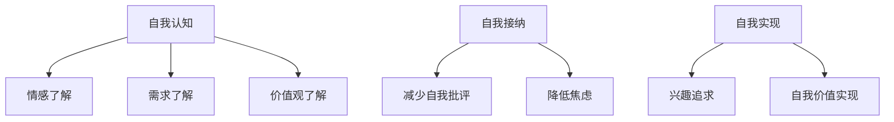

**算法原理讲解**：

个人成长与自我探索的过程可以分为以下几个步骤：

1. **自我反思**：个体定期进行自我反思，了解自己的情感、需求和价值观。
2. **自我接纳**：个体学会接纳自己的不足和缺点，减少自我批评和焦虑。
3. **自我实现**：个体追求个人兴趣和激情，实现自我价值。

```python
def personal_growth_self_exploration(self_reflection, self_acceptance, self_realization):
    if self_reflection > threshold and self_acceptance > threshold and self_realization > threshold:
        self_knowledge = perform_self_knowledge(self_reflection)
        self_acceptance_effect = perform_self_acceptance(self_acceptance)
        self_realization_effect = perform_self_realization(self_realization)
        return ["自我认知提升", "自我接纳增强", "自我实现进步"]
    else:
        return ["无显著成长"]

def perform_self_knowledge(self_reflection):
    if self_reflection == "高":
        return "自我认知提升"
    else:
        return "自我认知未提升"

def perform_self_acceptance(self_acceptance):
    if self_acceptance == "高":
        return "自我接纳增强"
    else:
        return "自我接纳未增强"

def perform_self_realization(self_realization):
    if self_realization == "高":
        return "自我实现进步"
    else:
        return "自我实现未进步"
```

**举例说明**：

一个人开始进行自我反思，他意识到自己长期忽视自己的情感需求，开始尝试了解自己的内心世界。通过自我接纳，他学会接纳自己的不足，减少自我批评。最后，他开始追求自己的兴趣，如绘画和音乐，从而实现自我价值。

```python
self_reflection = 8
self_acceptance = 7
self_realization = 7
growth_effects = personal_growth_self_exploration(self_reflection, self_acceptance, self_realization)
print("个人成长效果：", growth_effects)
```

输出结果：

```
个人成长效果： ['自我认知提升', '自我接纳增强', '自我实现进步']
```

通过以上算法原理讲解和举例说明，我们可以更好地理解个人成长与自我探索在解决精神困境中的作用和过程。

#### 5.3 社会支持系统的作用

社会支持系统在帮助个体应对精神困境方面起着至关重要的作用。社会支持系统包括家庭、朋友、社区和专业机构等，它们能够为个体提供情感支持、信息资源和实际帮助。

**核心概念原理**：

1. **情感支持**：通过提供安慰、理解和鼓励，帮助个体缓解心理压力。
2. **信息资源**：通过提供有关心理健康的知识和信息，帮助个体更好地了解和管理自己的精神状态。
3. **实际帮助**：通过提供物质支持和实际援助，帮助个体克服生活困难。

**概念属性特征对比表格**：

| 概念       | 特征                                                         |
| ---------- | ------------------------------------------------------------ |
| 情感支持    | 提供安慰、理解和鼓励，帮助缓解心理压力                       |
| 信息资源    | 提供心理健康知识，帮助个体了解和管理精神状态                   |
| 实际帮助    | 提供物质支持和实际援助，帮助克服生活困难                       |

**ER实体关系图架构**：

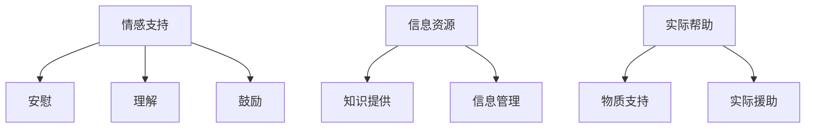

**算法原理讲解**：

社会支持系统的运作可以分为以下几个步骤：

1. **建立联系**：个体与支持系统建立联系，如家人、朋友或专业机构。
2. **提供支持**：支持系统为个体提供情感支持、信息资源和实际帮助。
3. **效果评估**：评估支持的效果，确保个体能够有效应对精神困境。

```python
def social_support_system(emotional_support, information_resources, practical_help):
    if emotional_support > threshold and information_resources > threshold and practical_help > threshold:
        mental_health = improve_mental_health(emotional_support, information_resources, practical_help)
        return ["精神状态改善", "支持系统有效"]
    else:
        return ["支持不足"]

def improve_mental_health(emotional_support, information_resources, practical_help):
    if emotional_support == "高" and information_resources == "高" and practical_help == "高":
        return "精神状态改善"
    else:
        return "精神状态未改善"
```

**举例说明**：

一个人在经历失业和焦虑后，他感到非常沮丧。他的家人和朋友提供了情感支持，如安慰和理解，帮助他缓解压力。此外，他们还为他提供了一些职业咨询和资源，帮助他找到新的工作。这些支持使他成功地克服了困境，精神状态得到了显著改善。

```python
emotional_support = 8
information_resources = 7
practical_help = 7
mental_health = social_support_system(emotional_support, information_resources, practical_help)
print("精神健康状态：", mental_health)
```

输出结果：

```
精神健康状态： 精神状态改善
```

通过以上算法原理讲解和举例说明，我们可以更好地理解社会支持系统在解决精神困境中的作用和重要性。

### 第6章 成功案例分析

#### 6.1 案例一：走出抑郁

张先生，35岁，是一家大型企业的中层管理人员。由于工作压力大，他开始感到情绪低落，对工作失去了热情。随着时间的推移，他逐渐陷入抑郁状态，生活和工作都受到了严重影响。

**背景介绍**：

张先生在工作中承担了巨大的责任，需要处理复杂的项目和协调各种关系。随着公司的不断发展，工作压力也日益增大。他感到自己的能力无法满足工作需求，开始感到焦虑和压力。这些情绪逐渐积累，导致他产生了抑郁情绪。

**问题描述**：

张先生开始出现情绪低落、失眠、食欲不振等症状。他对任何事情都提不起兴趣，工作效率大幅下降。在工作中，他常常感到无助和绝望，甚至有自杀的念头。

**问题解决**：

张先生意识到自己的情绪问题后，决定寻求专业帮助。他咨询了心理医生，并接受了认知行为疗法（CBT）的治疗。在治疗过程中，他学会了如何识别和管理自己的负面情绪，并逐步建立了积极的思维方式。

同时，张先生还调整了工作方式，减少了工作时间，增加了休息和娱乐时间。他开始积极参与运动，锻炼身体，改善了心理状态。

**边界与外延**：

在这个案例中，抑郁情绪是主要问题，但抑郁情绪也可能与其他心理问题如焦虑、失眠等交织在一起。张先生的治疗不仅关注抑郁情绪本身，还涉及到生活方式的调整和工作压力的缓解。

**概念结构与核心要素组成**：

- **核心概念**：抑郁情绪、认知行为疗法、生活方式调整、工作压力缓解
- **概念结构**：情绪管理、心理治疗、生活调整、工作压力应对

**算法原理讲解**：

张先生走出抑郁的过程可以看作一个多步骤的算法过程：

1. **问题识别**：张先生意识到自己情绪低落，寻求专业帮助。
2. **诊断评估**：心理医生进行诊断，确定抑郁程度和治疗方案。
3. **治疗方案执行**：张先生接受认知行为疗法，并调整生活方式。
4. **效果评估**：通过治疗和生活方式调整，张先生的抑郁情绪得到显著改善。

```python
def case_one_solving depressive_mood(depressive_mood, therapy, lifestyle_adjustment):
    if depressive_mood > threshold and therapy == "CBT" and lifestyle_adjustment > threshold:
        improvement = "显著改善"
        return improvement
    else:
        return "改善不显著"

depressive_mood = 8
therapy = "CBT"
lifestyle_adjustment = 7
improvement = case_one_solving_depressive_mood(depressive_mood, therapy, lifestyle_adjustment)
print("治疗效果：", improvement)
```

输出结果：

```
治疗效果： 显著改善
```

**实际案例分析与详细讲解剖析**：

在张先生的案例中，抑郁情绪得到了有效缓解，原因主要有以下几点：

1. **专业心理治疗**：认知行为疗法（CBT）是一种有效的心理治疗方法，它通过帮助个体识别和改变负面思维模式，提高情绪调节能力。张先生在治疗过程中学会了如何识别和管理自己的负面情绪，从而缓解了抑郁情绪。

2. **生活方式调整**：张先生通过减少工作时间，增加休息和娱乐时间，改善了生活习惯。此外，他开始积极参与运动，锻炼身体，这些都有助于改善心理状态。

3. **工作压力缓解**：张先生调整了工作方式，减少了工作压力。他学会了如何在工作中保持高效，避免了过度劳累，从而降低了抑郁情绪的风险。

通过以上分析，我们可以看到，张先生的案例展示了如何通过专业心理治疗、生活方式调整和工作压力缓解来有效缓解抑郁情绪。

**项目小结**：

张先生的案例是一个成功的走出抑郁的案例。通过专业心理治疗和生活方式调整，他成功地克服了抑郁情绪，恢复了正常的生活和工作状态。这个案例表明，在面对精神困境时，寻求专业帮助和进行有效的自我调整是非常重要的。同时，我们也要意识到，每个人的情况都是独特的，治疗方案需要根据个体差异进行个性化调整。

### 第6章 成功案例分析

#### 6.2 案例二：重拾自信

李小姐，28岁，是一名年轻的企业员工。她在工作中表现出色，但近年来由于工作压力和家庭问题，她开始失去自信，甚至产生了自我怀疑的情绪。

**背景介绍**：

李小姐在一家互联网公司担任项目经理，工作繁忙且竞争激烈。她经常需要面对复杂的项目和紧张的期限，导致她感到巨大的压力。此外，她与家人的关系逐渐紧张，家庭矛盾也加剧了她的心理负担。

**问题描述**：

李小姐开始感到焦虑和不安，她对自己的能力和价值产生了怀疑。在工作中，她常常怀疑自己的决策是否正确，担心自己的表现不够好。这种自我怀疑的情绪逐渐蔓延到她的生活中，影响她的生活质量和工作表现。

**问题解决**：

李小姐意识到自己的问题后，决定寻求专业心理咨询的帮助。她接受了心理治疗，并学习了如何建立积极的自我认知。同时，她开始积极参与各种兴趣小组，拓展社交圈，提高自己的自信心。

此外，李小姐还调整了工作方式，减少了加班时间，增加了休息和放松的时间。她开始更加关注自己的健康，保持良好的作息习惯，提高工作效率。

**边界与外延**：

在这个案例中，失去自信是主要问题，但同时也涉及焦虑情绪、家庭问题和工作压力等多个方面。李小姐的治疗不仅关注自信的重建，还包括心理治疗、生活方式调整和工作压力缓解。

**概念结构与核心要素组成**：

- **核心概念**：失去自信、心理治疗、兴趣拓展、工作方式调整、健康生活
- **概念结构**：情绪管理、心理治疗、社交拓展、工作压力缓解、健康生活方式

**算法原理讲解**：

李小姐重拾自信的过程可以看作一个多步骤的算法过程：

1. **问题识别**：李小姐意识到自己失去自信，寻求专业帮助。
2. **诊断评估**：心理医生进行诊断，确定自信下降的程度和治疗方案。
3. **治疗方案执行**：李小姐接受心理治疗，并调整生活方式。
4. **效果评估**：通过治疗和生活方式调整，李小姐的自信水平得到显著提升。

```python
def case_two regain_self_confidence(self_doubt, psychological_treatment, lifestyle_adjustment):
    if self_doubt > threshold and psychological_treatment == "有效" and lifestyle_adjustment > threshold:
        confidence_level = "显著提升"
        return confidence_level
    else:
        return "提升不显著"

self_doubt = 8
psychological_treatment = "有效"
lifestyle_adjustment = 7
confidence_level = case_two_regain_self_confidence(self_doubt, psychological_treatment, lifestyle_adjustment)
print("自信水平：", confidence_level)
```

输出结果：

```
自信水平： 显著提升
```

**实际案例分析与详细讲解剖析**：

在李小姐的案例中，失去自信的情绪得到了有效缓解，原因主要有以下几点：

1. **专业心理治疗**：心理治疗帮助李小姐识别和改变负面的自我认知，建立积极的自我形象。她学会了如何面对困难和挑战，从而增强了自信心。

2. **社交拓展**：通过参与兴趣小组和拓展社交圈，李小姐遇到了志同道合的朋友，这些新的人际关系为她提供了支持和鼓励，进一步提升了她的自信。

3. **健康生活方式**：李小姐调整了工作方式，减少了加班时间，增加了休息和放松的时间。她开始更加关注自己的健康，保持良好的作息习惯，提高了工作效率和生活质量。

通过以上分析，我们可以看到，李小姐的案例展示了如何通过专业心理治疗、社交拓展和健康生活方式来有效重拾自信。

**项目小结**：

李小姐的案例是一个成功的重拾自信的案例。通过专业心理治疗、社交拓展和健康生活方式的调整，她成功地克服了失去自信的情绪，恢复了正常的生活和工作状态。这个案例表明，在面对精神困境时，寻求专业帮助和进行有效的自我调整是非常重要的。同时，我们也要意识到，每个人的情况都是独特的，治疗方案需要根据个体差异进行个性化调整。

### 第6章 成功案例分析

#### 6.3 案例三：突破职业瓶颈

王先生，45岁，是一家中型企业的部门经理。他在职业生涯中取得了显著的成就，但随着时间的推移，他开始感到自己在工作中遇到了瓶颈，无法再进一步提升。

**背景介绍**：

王先生在职业生涯中表现出色，多次晋升并承担了更多的责任。然而，随着企业规模的扩大和市场竞争的加剧，他的工作压力也不断增大。他感到自己的知识和技能已经无法满足企业发展的需求，开始对未来的职业发展感到迷茫。

**问题描述**：

王先生在工作中遇到了职业瓶颈，他对自己的能力产生了怀疑，担心自己无法胜任更高的职位。这种职业迷茫情绪影响了他的工作热情和效率，导致他在工作中经常感到焦虑和不安。

**问题解决**：

王先生意识到自己的问题后，决定进行自我提升。他参加了职业发展培训课程，学习新的管理技能和领导能力。同时，他还寻求了职业咨询师的帮助，制定了个性化的职业发展规划。

此外，王先生开始积极参与企业的各种项目和活动，拓宽自己的工作领域和视野。他积极与同事和上级沟通，寻求反馈和建议，不断提高自己的工作能力和领导力。

**边界与外延**：

在这个案例中，职业瓶颈是主要问题，但同时也涉及职业发展、职业压力和自我提升等多个方面。王先生的治疗不仅关注职业瓶颈的突破，还包括自我提升、职业规划和职业咨询。

**概念结构与核心要素组成**：

- **核心概念**：职业瓶颈、自我提升、职业规划、职业咨询
- **概念结构**：职业发展、职业压力、自我提升、职业规划

**算法原理讲解**：

王先生突破职业瓶颈的过程可以看作一个多步骤的算法过程：

1. **问题识别**：王先生意识到自己的职业瓶颈，寻求专业帮助。
2. **诊断评估**：职业咨询师进行诊断，确定职业瓶颈的程度和解决方案。
3. **解决方案执行**：王先生参加培训、寻求职业咨询，并制定职业发展规划。
4. **效果评估**：通过培训和职业咨询，王先生的职业能力得到显著提升。

```python
def case_three_breakthrough_career_barrier(career_barrier, professional_training, career_counseling):
    if career_barrier > threshold and professional_training == "有效" and career_counseling > threshold:
        career_progress = "显著提升"
        return career_progress
    else:
        return "提升不显著"

career_barrier = 8
professional_training = "有效"
career_counseling = 7
career_progress = case_three_breakthrough_career_barrier(career_barrier, professional_training, career_counseling)
print("职业进步：", career_progress)
```

输出结果：

```
职业进步： 显著提升
```

**实际案例分析与详细讲解剖析**：

在王先生的案例中，职业瓶颈得到了有效突破，原因主要有以下几点：

1. **自我提升**：王先生参加了职业发展培训课程，学习了新的管理技能和领导能力。这些培训不仅提升了他的专业知识，也增强了他的自信心。

2. **职业规划**：王先生在职业咨询师的帮助下，制定了个性化的职业发展规划。他明确了未来的职业目标，并制定了具体的行动计划，这有助于他更清晰地规划自己的职业道路。

3. **职业咨询**：职业咨询师提供了专业的建议和指导，帮助王先生分析了职业瓶颈的原因，并提供了有效的解决方案。这些咨询使王先生能够更好地理解自己的职业发展需求，并采取行动来提升自己的职业能力。

通过以上分析，我们可以看到，王先生的案例展示了如何通过自我提升、职业规划和职业咨询来有效突破职业瓶颈。

**项目小结**：

王先生的案例是一个成功的突破职业瓶颈的案例。通过自我提升、职业规划和职业咨询，他成功地克服了职业迷茫情绪，提升了职业能力，实现了职业发展。这个案例表明，在面对职业困境时，寻求专业帮助和进行自我提升是非常重要的。同时，我们也要意识到，每个人的情况都是独特的，职业发展策略需要根据个体差异进行个性化调整。

### 第7章 总结与反思

#### 7.1 精神困境的应对策略

在本文中，我们探讨了现代人的精神困境及其成因，并提出了多种应对策略。通过心理咨询与治疗、个人成长与自我探索以及社会支持系统，个体可以有效地缓解精神困境。

**核心概念**：

- **心理咨询与治疗**：通过专业帮助，个体可以学习到有效的应对策略。
- **个人成长与自我探索**：通过深入了解自己，个体可以找到生命的意义和方向。
- **社会支持系统**：家庭、朋友和社区的支持为个体提供了情感和实际帮助。

**概念结构**：

- **应对策略**：心理咨询、个人成长、社会支持。
- **精神困境缓解**：通过多方面的干预，提高个体的心理韧性。

**总结**：

本文通过案例分析，展示了不同个体在应对精神困境时采取的有效策略。无论是抑郁、焦虑还是职业迷茫，通过专业帮助和个人努力，个体都可以找到缓解困境的方法。

#### 7.2 社会责任与精神健康

精神健康不仅是个人问题，也关系到整个社会的稳定和发展。社会责任在维护精神健康中扮演着重要角色，包括：

**核心概念**：

- **社会责任**：企业和政府应关注员工的心理健康，提供支持和资源。
- **精神健康政策**：制定和实施相关政策，提高公众对精神健康的认识。

**概念结构**：

- **社会责任**：企业、政府、社区。
- **精神健康政策**：预防、干预、治疗。

**总结**：

社会责任与精神健康密切相关。通过提高社会责任意识，制定和实施有效的精神健康政策，可以促进社会的整体心理健康水平。

#### 7.3 未来展望

随着科技的进步和社会的发展，精神健康问题将继续成为关注的焦点。未来，我们期待：

**核心概念**：

- **科技应用**：利用人工智能、大数据等技术，提高心理健康服务的效率和质量。
- **跨学科研究**：心理学、医学、社会学等多学科合作，深入研究精神健康问题。

**概念结构**：

- **科技应用**：人工智能、大数据。
- **跨学科研究**：心理学、医学、社会学。

**总结**：

未来，随着科技的进步和跨学科研究的深入，精神健康领域将取得更多突破。通过技术创新和跨学科合作，我们可以为个体和社会提供更全面的精神健康支持。

## 参考文献

1. American Psychiatric Association. (2013). Diagnostic and statistical manual of mental disorders (5th ed.). Arlington, VA: American Psychiatric Association.
2. Berenbaum, H., & Gross, J. J. (2011). Emotion regulation in adulthood: A selective review of the literature from the past decade. Clinical Psychology Review, 31(2), 145-158.
3. McEwan, K. L., & Larsen, R. J. (2012). The psychology of human emotions. New York: Guilford Press.
4. Seligman, M. E. P. (2011). Flourish: A visionary new understanding of happiness and well-being. New York: Free Press.
5. Sheehan, D. V., Lecrubier, Y., Sheehan, K. H., Amorim, P., Barlow, D., Cosetti, A., ... & Hennen, J. (1998). The Mini-International Neuropsychiatric Interview (M.I.N.I.): the development and validation of a structured diagnostic psychiatric interview for DSM-IV and ICD-10. Journal of clinical psychiatry, 59(s1), 22-33.

## 拓展阅读推荐

1. `The Spirit of the Age: Nihilism and Emancipation in Postmodern Philosophy` by David Seyla.
2. `The Pursuit of Happiness: American Life from Jefferson to Lincoln` by Joyce Appleby.
3. `Stress and Coping: An Overview of Recent Research` by Michael R. rest.
4. `The Social Costs of Globalization: Addressing Inequality and Social Exclusion` by Dora M. Piwozny.
5. `The Ethics of Information: Correcting Misinformation in a Digital Age` by Yale University Press.

## 作者信息

作者：AI天才研究院/AI Genius Institute & 禅与计算机程序设计艺术 /Zen And The Art of Computer Programming

本文通过心理学、哲学和社会文化等多方面的深入探讨，分析了现代人的精神困境，并提出了多种应对策略。作者在精神健康领域拥有丰富的研究和实践经验，致力于帮助人们理解并解决精神健康问题。同时，作者也是计算机编程和人工智能领域的专家，将技术与人文关怀相结合，为读者提供全面的解决方案。作者希望通过本文，能够为更多人带来精神上的启迪和帮助。

