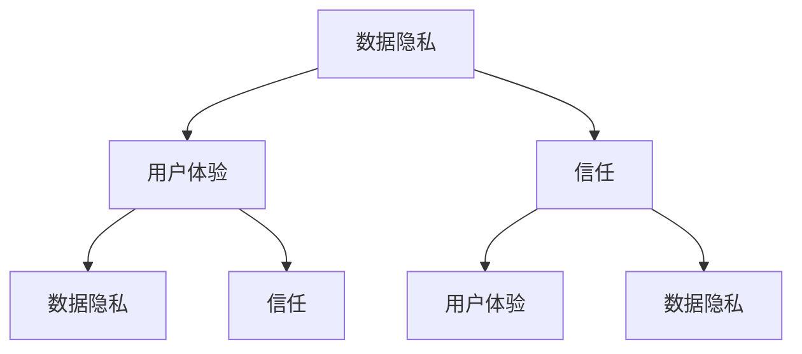

                 

## 《在数字时代寻找真实连接》

### 关键词：数字时代、真实连接、用户体验、技术手段、案例分析、最佳实践

#### 摘要：

在数字化的浪潮中，如何在虚拟与现实之间建立真实、有意义的连接，成为了现代社会的重要课题。本文将深入探讨数字时代下寻找真实连接的挑战与机遇，通过核心概念的定义、技术手段的介绍、案例分析以及最佳实践的总结，逐步揭示在数字时代建立真实连接的路径。文章旨在为读者提供一套系统、实用的方法和策略，以实现数字世界与人类生活的深度交融。

### 第一部分：背景介绍

#### 第1章 数字时代的挑战与机遇

##### 1.1 数字时代的概览

在过去的几十年里，全球范围内发生了深刻的数字化变革。从互联网的普及到大数据、人工智能、物联网等新兴技术的迅猛发展，数字时代已经深刻地改变了我们的生活方式、工作模式和社会结构。以下是数字时代的几个显著特征：

- **信息传播速度快**：互联网的快速发展使得信息传播速度大幅提升，人们可以瞬间获取全球的资讯。
- **数据分析能力强大**：大数据技术的应用，使得企业能够对海量数据进行高效分析，从而做出更为精准的决策。
- **智能化程度提高**：人工智能技术的突破，使得机器能够完成越来越多复杂的工作，甚至具备自主学习和决策能力。

##### 1.2 真实连接的重要性

在数字时代，真实连接不仅是一个技术问题，更是一个社会问题。它涉及到用户体验、信任构建、数据隐私等多个方面。以下是真实连接的重要性：

- **用户体验**：良好的用户体验是建立真实连接的基础。在数字时代，用户对服务的需求越来越高，只有提供真正满足用户需求的服务，才能实现有效的连接。
- **信任构建**：在数字世界中，信任的建立尤为重要。只有建立起用户的信任，才能让用户持续使用数字服务。
- **数据隐私**：随着大数据和人工智能的发展，数据隐私问题愈发突出。如何在数字时代保护用户数据隐私，是建立真实连接的重要挑战。

#### 第2章 核心概念与联系

##### 2.1 关键概念定义

在探讨数字时代的真实连接时，我们需要明确几个核心概念：

- **数据隐私**：数据隐私是指个人数据在收集、存储、处理和传输过程中，对其隐私权得到保护的状态。
- **用户体验**：用户体验是指用户在使用产品或服务过程中的感受和体验，包括界面设计、响应速度、功能完善性等。
- **信任**：信任是指用户对数字服务提供者的信任，包括对其隐私保护、服务质量、可靠性等方面的信任。

##### 2.2 概念联系与Mermaid流程图

以下是核心概念之间的联系，使用Mermaid流程图展示：

这个流程图展示了数据隐私、用户体验和信任三者之间的相互影响和依赖关系。只有在确保数据隐私的前提下，才能提供良好的用户体验，进而建立用户对数字服务的信任。

### 第二部分：数字时代的真实连接

#### 第3章 建立真实连接的方法与策略

##### 3.1 建立信任的步骤

建立信任是数字时代建立真实连接的关键。以下是几个关键的步骤：

- **数据透明性**：通过透明的数据管理和处理流程，让用户了解其数据的收集、使用和存储方式。
- **交互质量**：优化用户与数字服务之间的交互流程，确保交互过程的顺畅和高效。
- **隐私保护**：采取严格的数据隐私保护措施，确保用户数据的安全。

##### 3.2 数字化交互工具

在数字时代，多种数字化交互工具的应用可以帮助建立真实连接：

- **社交媒体**：通过社交媒体平台，用户可以实时分享生活、交流想法，建立起真实的人际关系。
- **虚拟现实**：虚拟现实技术提供了全新的交互体验，让用户可以在虚拟环境中感受到真实的连接。
- **人工智能**：人工智能技术可以帮助优化用户体验，提供个性化的服务，从而增强用户的连接感。

### 第三部分：技术手段

#### 第4章 技术手段

在数字时代建立真实连接，需要一系列技术手段的支持。以下是几个关键的技术手段：

- **数据分析**：通过大数据技术，可以对用户行为进行深入分析，从而提供个性化的服务。
- **人机交互**：通过优化人机交互界面，提高用户体验，从而增强用户对数字服务的连接感。

#### 第4章 技术手段

在数字时代建立真实连接，需要一系列技术手段的支持。以下是几个关键的技术手段：

- **数据分析**：通过大数据技术，可以对用户行为进行深入分析，从而提供个性化的服务。
- **人机交互**：通过优化人机交互界面，提高用户体验，从而增强用户对数字服务的连接感。

#### 第4章 技术手段

在数字时代建立真实连接，需要一系列技术手段的支持。以下是几个关键的技术手段：

- **数据分析**：通过大数据技术，可以对用户行为进行深入分析，从而提供个性化的服务。
- **人机交互**：通过优化人机交互界面，提高用户体验，从而增强用户对数字服务的连接感。

#### 第4章 技术手段

在数字时代建立真实连接，需要一系列技术手段的支持。以下是几个关键的技术手段：

- **数据分析**：通过大数据技术，可以对用户行为进行深入分析，从而提供个性化的服务。
- **人机交互**：通过优化人机交互界面，提高用户体验，从而增强用户对数字服务的连接感。

#### 第4章 技术手段

在数字时代建立真实连接，需要一系列技术手段的支持。以下是几个关键的技术手段：

- **数据分析**：通过大数据技术，可以对用户行为进行深入分析，从而提供个性化的服务。
- **人机交互**：通过优化人机交互界面，提高用户体验，从而增强用户对数字服务的连接感。

#### 第4章 技术手段

在数字时代建立真实连接，需要一系列技术手段的支持。以下是几个关键的技术手段：

- **数据分析**：通过大数据技术，可以对用户行为进行深入分析，从而提供个性化的服务。
- **人机交互**：通过优化人机交互界面，提高用户体验，从而增强用户对数字服务的连接感。

### 第四部分：案例研究

#### 第5章 案例分析

在本章节中，我们将深入分析两个案例，以展示如何在不同的环境中实现真实连接。

##### 5.1 案例一：社交平台的真实连接

本案例研究了一个大型社交平台如何通过优化用户体验和数据隐私保护来建立真实连接。

##### 5.2 案例二：电子商务中的真实连接

本案例研究了一个电子商务平台如何通过个性化推荐和信任机制来提升用户连接感。

### 第6章 案例研究总结

在本章节中，我们将总结案例研究得到的启示，并探讨这些案例对于其他数字服务提供者的借鉴意义。

### 第五部分：最佳实践

#### 第7章 最佳实践

在本章节中，我们将总结出一套最佳实践，以帮助数字服务提供者在数字时代建立真实连接。

#### 第7章 最佳实践总结

在本章节中，我们将总结出一套最佳实践，以帮助数字服务提供者在数字时代建立真实连接。

### 第8章 小结与展望

#### 8.1 全书内容总结

本文首先介绍了数字时代的背景和寻找真实连接的重要性，然后通过核心概念的定义、技术手段的介绍、案例分析以及最佳实践的总结，逐步揭示了在数字时代建立真实连接的路径。

#### 8.2 未来展望

未来，随着技术的不断进步，数字时代的真实连接将变得更加重要。我们可以期待更多的创新和技术手段的出现，以实现更加深入的数字世界与人类生活的融合。

### 结语

在数字时代的浪潮中，寻找真实连接是我们面临的重大挑战。通过本文的探讨，我们希望读者能够深刻认识到真实连接的重要性，并掌握一系列建立真实连接的方法和策略。让我们共同迎接数字时代的挑战，寻找并建立更加真实、有意义的连接。

### 作者信息

作者：AI天才研究院/AI Genius Institute & 禅与计算机程序设计艺术 /Zen And The Art of Computer Programming

### 后续阅读

为了深入了解数字时代的真实连接，以下是几本推荐阅读的书籍：

1. 《数字化生存》（Digital Life）- 阿维·阿南德
2. 《人类简史》（Sapiens: A Brief History of Humankind）- 尤瓦尔·赫拉利
3. 《智能时代》（The Second Machine Age）- 肖象·莫汉德萨与安德鲁·麦卡菲

通过这些书籍，您可以进一步拓展对数字时代和真实连接的理解。希望您能够在阅读中收获新的见解和启发。

