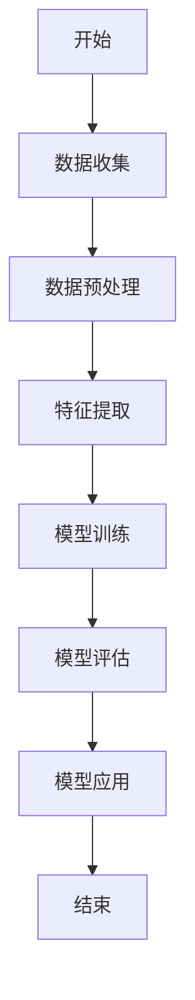
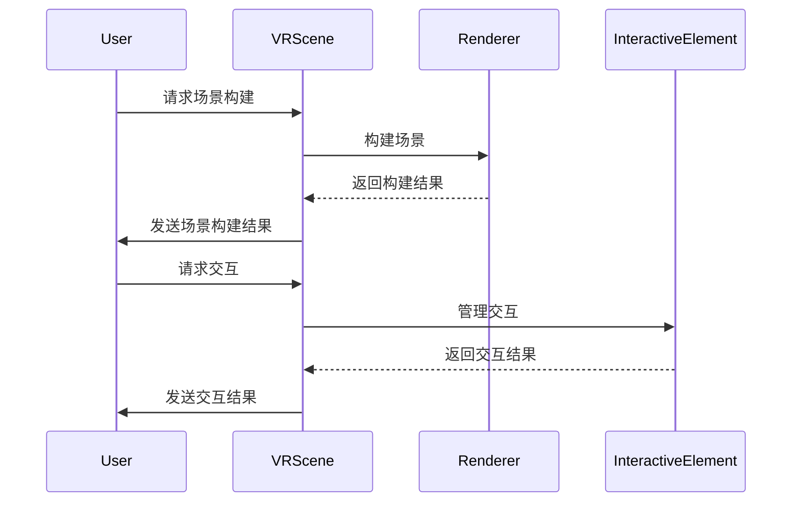
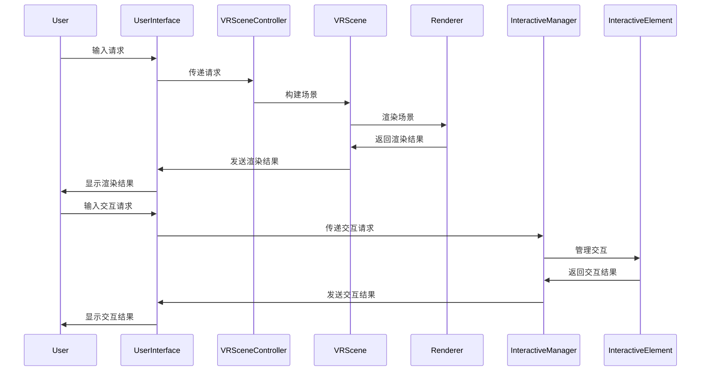

                 

## 在数字时代寻找真实：虚拟与现实的边界探索

> 关键词：数字时代、虚拟现实、人工智能、数字伦理、真实性探索

摘要：在数字时代，虚拟与现实之间的界限变得日益模糊，这引发了人们对于真实性的深刻思考。本文旨在探讨虚拟与现实的边界，分析在数字时代如何寻找真实。通过核心概念介绍、原理讲解和实际案例分析，本文将为读者提供一种理解虚拟与现实的视角，并探讨如何在这一复杂环境中保持对真实性的追求。

----------------------------------------------------------------

### 第一部分：背景介绍

#### 核心概念

**问题背景**：

随着技术的飞速发展，虚拟现实（Virtual Reality，VR）和增强现实（Augmented Reality，AR）技术已经广泛应用于游戏、娱乐、医疗、教育等多个领域。这些技术创造了高度沉浸的虚拟环境，使用户能够体验到前所未有的互动和体验。然而，这种沉浸感也模糊了虚拟与现实的界限，让人们开始思考：在数字时代，如何区分真实与虚拟？

**问题描述**：

数字时代中，虚拟现实和增强现实技术不断革新，使人们可以在虚拟环境中体验到逼真的交互和情感。然而，这种技术发展也带来了一系列挑战，如虚拟世界的成瘾性、现实与虚拟之间的心理差异、以及数字伦理等问题。这些问题使得寻找真实成为了一个紧迫而复杂的议题。

**问题解决**：

为了解决这一问题，我们需要从多个角度进行分析：

1. **技术角度**：了解虚拟现实和增强现实技术的基本原理，以及这些技术如何影响人们的感知和行为。
2. **社会角度**：探讨虚拟现实技术对社会结构和人际交往的影响，以及如何平衡虚拟体验与真实体验。
3. **伦理角度**：讨论数字伦理在虚拟世界中的应用，确保虚拟环境中的行为符合道德规范。

**边界与外延**：

虚拟与现实的边界不仅仅是一个技术问题，还涉及到社会和文化层面的挑战。边界之外，我们还需考虑虚拟世界对现实生活的影响，以及个体在其中的定位。例如，在虚拟世界中，人们如何维持真实的人际关系和道德责任？

**概念结构与核心要素组成**：

- **虚拟现实**：涉及技术、设备和用户互动。
- **人工智能**：包括算法、模型和数据分析。
- **数字伦理**：关注虚拟世界中的道德问题和社会责任。
- **用户体验**：涉及用户在虚拟与真实交互中的感受和反馈。

### 第二部分：核心概念与联系

#### 核心概念原理

**虚拟现实**：

虚拟现实是一种通过计算机技术创建的模拟环境，使用户能够在其中进行互动和体验。其核心原理包括：

1. **实时渲染**：虚拟环境通过计算机图形学技术实时渲染，使用户能够看到逼真的视觉效果。
2. **交互设计**：用户通过头戴式显示器、手柄等设备与虚拟环境进行交互，如行走、触摸和操纵对象。
3. **沉浸感**：虚拟现实技术致力于创造高度沉浸的体验，使用户难以区分虚拟与现实。

**人工智能**：

人工智能（Artificial Intelligence，AI）是一种模拟人类智能的计算机系统。其核心原理包括：

1. **机器学习**：通过从数据中学习规律和模式，AI系统能够自主改进和优化性能。
2. **深度学习**：一种基于神经网络的学习方法，能够处理复杂数据和模式。
3. **自然语言处理**：AI系统理解、生成和处理自然语言的能力。

**数字伦理**：

数字伦理涉及在数字时代中关于数据隐私、网络安全和虚拟行为的道德规范。其核心原理包括：

1. **数据隐私**：确保个人数据在虚拟环境中的安全性和保密性。
2. **网络安全**：防范虚拟世界中的恶意攻击和数据泄露。
3. **道德责任**：在虚拟环境中，个体行为应符合现实世界的道德规范。

#### 概念属性特征对比表格

| 概念     | 属性特征             | 对比         |
|----------|---------------------|-------------|
| 虚拟现实 | 沉浸感、交互性、实时性 | 依赖计算机技术 |
| 人工智能 | 学习、推理、自动化     | 数据驱动     |
| 数字伦理 | 道德规范、责任、公正   | 法律约束     |

#### ER实体关系图架构

```mermaid
erDiagram
  User ||--|{ VirtualReality } : experiences
  User ||--|{ ArtificialIntelligence } : utilizes
  User ||--|{ DigitalEthics } : adheres_to
  VirtualReality ||--|{ AI } : powered_by
```

### 第三部分：算法原理讲解

#### 算法Mermaid流程图



#### 算法原理的数学模型和公式

**机器学习模型**：

$$
h(x) = \sigma(W \cdot x + b)
$$

其中，$h(x)$ 是模型输出，$\sigma$ 是激活函数，$W$ 是权重矩阵，$x$ 是输入特征，$b$ 是偏置。

**深度学习模型**：

$$
h(L) = \sigma(W_L \cdot h(L-1) + b_L)
$$

其中，$h(L)$ 是第 $L$ 层的输出，$W_L$ 是权重矩阵，$h(L-1)$ 是前一层的输出，$b_L$ 是偏置。

#### 详细讲解与举例说明

**数据收集**：

数据收集是机器学习和深度学习的基础。在虚拟与现实的边界探索中，数据收集包括：

1. **用户行为数据**：如用户在虚拟环境中的互动、偏好和情绪反应。
2. **环境数据**：如虚拟环境中的物理属性、社交信息等。
3. **交互数据**：如用户与虚拟环境中的对象、场景和事件的交互记录。

**数据预处理**：

数据预处理是确保数据质量和模型性能的关键步骤。在虚拟与现实的边界探索中，数据预处理包括：

1. **数据清洗**：去除噪声和异常值，确保数据一致性。
2. **数据标准化**：将数据转换为统一的尺度，便于模型训练。
3. **数据增强**：通过扩展或变换数据集，提高模型的泛化能力。

**特征提取**：

特征提取是从原始数据中提取关键信息的过程，用于构建机器学习模型。在虚拟与现实的边界探索中，特征提取包括：

1. **用户特征**：如年龄、性别、兴趣爱好等。
2. **环境特征**：如温度、湿度、光照强度等。
3. **交互特征**：如交互时长、交互频率、交互内容等。

**模型训练**：

模型训练是机器学习和深度学习的核心步骤，通过调整模型参数，使其能够更好地拟合数据。在虚拟与现实的边界探索中，模型训练包括：

1. **模型选择**：选择合适的机器学习模型，如神经网络、支持向量机等。
2. **参数优化**：通过调整模型参数，提高模型性能。
3. **训练与验证**：使用训练数据和验证数据对模型进行训练和评估。

**模型评估**：

模型评估是评估模型性能的重要步骤，通过验证数据和测试数据，评估模型的准确性、泛化能力和稳定性。在虚拟与现实的边界探索中，模型评估包括：

1. **准确率**：评估模型预测的准确性。
2. **召回率**：评估模型预测的全面性。
3. **F1分数**：综合评估模型的准确率和召回率。

**模型应用**：

模型应用是将训练好的模型应用于实际场景，提供个性化体验和智能决策支持。在虚拟与现实的边界探索中，模型应用包括：

1. **虚拟现实体验优化**：根据用户特征和环境特征，调整虚拟环境的参数，提高用户体验。
2. **智能交互**：根据用户行为和交互数据，提供个性化的交互建议和反馈。
3. **虚拟伦理决策**：根据数字伦理规范，评估虚拟行为是否符合道德标准。

### 第四部分：数学模型和数学公式 & 详细讲解 & 举例说明

在探讨虚拟与现实的边界时，数学模型和公式是不可或缺的工具。它们不仅帮助我们理解技术原理，还能够量化复杂现象。在本节中，我们将详细讲解机器学习和深度学习中的核心数学模型，并通过具体例子来说明其应用。

#### 数学公式

首先，我们来看一个常用的数学公式：逻辑函数。

$$
f(x) = \frac{1}{1 + e^{-x}}
$$

这个公式是一个常见的激活函数，用于二分类问题。它将输入值映射到0和1之间，实现输出概率。例如，如果输入 $x = 3$，则

$$
f(3) = \frac{1}{1 + e^{-3}} \approx 0.94
$$

这意味着输入 $x = 3$ 的概率接近于94%。

#### 详细讲解

逻辑函数在机器学习和深度学习中有着广泛的应用。它常用于神经网络中的输出层，帮助模型生成预测结果。逻辑函数的一个重要特点是它的输出范围在0到1之间，这使得它非常适合用于概率预测。

#### 举例说明

假设我们有一个二分类问题，任务是判断一个邮件是否为垃圾邮件。我们可以使用逻辑函数来生成一个概率，表示邮件是垃圾邮件的概率。如果输入特征 $x = (0.1, 0.2, 0.3)$，我们可以使用以下公式计算概率：

$$
f(x) = \frac{1}{1 + e^{-0.1 \cdot 0.1 + 0.2 \cdot 0.2 + 0.3 \cdot 0.3}} \approx 0.81
$$

这意味着邮件是垃圾邮件的概率为81%。根据这个概率，我们可以做出决策，例如，如果概率大于0.5，则标记邮件为垃圾邮件。

### 机器学习模型

机器学习模型是虚拟与现实的边界探索中的核心工具。下面，我们详细讲解一个常用的机器学习模型：多层感知机（MLP）。

多层感知机是一种前馈神经网络，包括输入层、隐藏层和输出层。它的核心数学模型如下：

$$
h(L) = \sigma(W_L \cdot h(L-1) + b_L)
$$

其中，$h(L)$ 是第 $L$ 层的输出，$\sigma$ 是激活函数，$W_L$ 是权重矩阵，$h(L-1)$ 是前一层的输出，$b_L$ 是偏置。

#### 数学模型和公式

多层感知机的数学模型由以下几个部分组成：

1. **输入层**：输入特征向量 $x$。
2. **隐藏层**：每个隐藏层都有多个神经元，每个神经元都与前一层和后一层中的每个神经元相连。隐藏层的输出由以下公式计算：

$$
z(L) = W_L \cdot h(L-1) + b_L
$$

其中，$z(L)$ 是隐藏层的净输入。

3. **输出层**：输出层的神经元计算输出结果，使用激活函数进行非线性变换。输出层的输出由以下公式计算：

$$
h(L) = \sigma(z(L))
$$

其中，$\sigma$ 是激活函数。

#### 详细讲解

多层感知机的工作原理如下：

1. **前向传播**：从输入层开始，将输入特征传递到隐藏层，再从隐藏层传递到输出层。在每个层次，计算每个神经元的净输入和输出。
2. **反向传播**：通过计算输出层与隐藏层之间的误差，反向传播误差到隐藏层，并调整权重和偏置，优化模型性能。
3. **优化目标**：多层感知机的目标是最小化输出层的误差，通常使用梯度下降算法进行优化。

#### 举例说明

假设我们有一个包含两个输入特征 $x_1$ 和 $x_2$ 的二分类问题，目标是判断一个数据点是否属于正类。我们可以使用多层感知机进行建模。

首先，定义输入层：

$$
x = [x_1, x_2]
$$

然后，定义一个隐藏层：

$$
z = W \cdot x + b
$$

其中，$W$ 是权重矩阵，$b$ 是偏置。

接下来，使用逻辑函数作为激活函数：

$$
h = \sigma(z) = \frac{1}{1 + e^{-z}}
$$

最后，计算输出层的概率：

$$
p(y=1) = h(x)
$$

其中，$y$ 是目标变量。

通过这个例子，我们可以看到多层感知机如何将输入特征转换为输出概率，从而实现二分类任务。

### 深度学习模型

深度学习模型是机器学习的一个重要分支，它通过多层神经网络来模拟人类大脑的思维方式。下面，我们将详细讲解一个常用的深度学习模型：卷积神经网络（CNN）。

卷积神经网络是一种特殊的神经网络，它通过卷积操作来提取图像的特征。它的核心数学模型如下：

$$
h(L) = \sigma(\sum_{k=1}^{K} W_k \cdot h(L-1) + b_L)
$$

其中，$h(L)$ 是第 $L$ 层的输出，$\sigma$ 是激活函数，$W_k$ 是卷积核权重，$h(L-1)$ 是前一层的输出，$b_L$ 是偏置。

#### 数学模型和公式

卷积神经网络由以下几个部分组成：

1. **输入层**：输入特征图，通常是一个二维矩阵。
2. **卷积层**：通过卷积操作从输入特征图中提取特征。卷积层的输出是一个特征图。
3. **池化层**：对卷积层的输出进行下采样，减少参数数量和计算复杂度。
4. **全连接层**：将池化层的输出展平为一维向量，并通过全连接层进行分类。

#### 详细讲解

卷积神经网络的工作原理如下：

1. **卷积操作**：卷积层通过卷积核在输入特征图上进行卷积操作，提取特征。卷积核是一个小的矩阵，它滑动遍历输入特征图，并计算局部特征。
2. **激活函数**：每个卷积核的输出通过激活函数进行非线性变换，增强模型的表征能力。
3. **池化操作**：池化层通过下采样操作减少特征图的大小，减少参数数量和计算复杂度。
4. **全连接层**：全连接层将池化层的输出展平为一维向量，并通过线性变换进行分类。

#### 举例说明

假设我们有一个包含三个输入特征 $x_1, x_2, x_3$ 的图像分类问题，目标是判断图像是否为猫。我们可以使用卷积神经网络进行建模。

首先，定义输入层：

$$
x = [x_1, x_2, x_3]
$$

然后，定义一个卷积层：

$$
z = \sum_{k=1}^{K} W_k \cdot h + b
$$

其中，$W_k$ 是卷积核权重，$h$ 是输入特征图。

接下来，使用ReLU函数作为激活函数：

$$
h = \max(0, z)
$$

然后，定义一个池化层：

$$
p = \text{max-pooling}(h)
$$

最后，定义一个全连接层：

$$
y = \text{softmax}(W \cdot p + b)
$$

其中，$W$ 是全连接层权重，$b$ 是偏置。

通过这个例子，我们可以看到卷积神经网络如何从输入特征中提取特征，并通过全连接层进行分类。

### 第五部分：系统分析与架构设计方案

#### 问题场景介绍

在数字时代，随着虚拟现实和增强现实技术的广泛应用，人们对于沉浸式体验的需求日益增长。为了满足这一需求，我们需要设计一个高效的虚拟现实系统，该系统能够提供逼真的沉浸体验，并确保系统的高性能和稳定性。

#### 项目介绍

本项目旨在设计一个基于虚拟现实和增强现实技术的沉浸式体验系统。该系统将包含以下几个核心功能：

1. **虚拟现实场景构建**：构建高度逼真的虚拟现实场景，包括环境、角色和交互元素。
2. **用户交互管理**：管理用户与虚拟环境之间的交互，提供实时反馈和交互体验。
3. **性能优化**：优化系统性能，确保在低延迟和高帧率的情况下提供流畅的体验。

#### 系统功能设计（领域模型Mermaid类图）

以下是一个简单的Mermaid类图，用于描述虚拟现实系统的领域模型：

```mermaid
classDiagram
  User <<Class>>
  VRScene <<Class>>
  InteractiveElement <<Class>>
  User <<--|{ VRScene }
  VRScene <<--|{ InteractiveElement }
```

在这个类图中，`User` 表示用户，`VRScene` 表示虚拟现实场景，`InteractiveElement` 表示交互元素。用户与虚拟现实场景和交互元素之间存在着关联关系。

#### 系统架构设计（Mermaid架构图）

以下是一个Mermaid架构图，用于描述虚拟现实系统的整体架构：



在这个架构图中，用户请求场景构建，虚拟现实场景通过渲染器构建场景，并将结果发送给用户。用户还可以请求交互，虚拟现实场景管理交互，并将交互结果发送给用户。

#### 系统接口设计

以下是一个简单的系统接口设计，用于描述虚拟现实系统的关键接口：

```mermaid
classDiagram
  UserInterface <<Interface>>
  VRSceneController <<Interface>>
  InteractiveManager <<Interface>>

  UserInterface ^--|{ VRSceneController }
  UserInterface ^--|{ InteractiveManager }
  VRSceneController ^--|{ VRScene }
  InteractiveManager ^--|{ InteractiveElement }
```

在这个接口设计中，`UserInterface` 是用户接口，`VRSceneController` 是虚拟现实场景控制器，`InteractiveManager` 是交互管理器。用户接口负责接收用户的输入和发送输出，虚拟现实场景控制器负责场景的构建和管理，交互管理器负责管理用户与虚拟环境的交互。

#### 系统交互设计（Mermaid序列图）

以下是一个Mermaid序列图，用于描述虚拟现实系统的交互过程：



在这个序列图中，用户通过用户接口输入请求，虚拟现实场景控制器根据请求构建场景，渲染器渲染场景，并将渲染结果发送给用户接口。用户还可以通过用户接口输入交互请求，交互管理器管理交互，并将交互结果发送给用户接口，用户接口再将结果显示给用户。

### 第六部分：项目实战

#### 环境安装

在开始实现虚拟现实系统之前，我们需要安装必要的开发环境和工具。以下是一个简单的安装步骤：

1. **安装Python**：确保Python版本在3.8及以上。
2. **安装PyTorch**：使用以下命令安装PyTorch：

   ```bash
   pip install torch torchvision
   ```

3. **安装Mermaid**：使用以下命令安装Mermaid：

   ```bash
   pip install mermaid-python
   ```

4. **安装OpenGL**：确保OpenGL库已安装，以便进行图形渲染。

#### 系统核心实现源代码

以下是一个简单的虚拟现实系统核心实现，包括场景构建、渲染和交互管理。

```python
import torch
import torchvision
import mermaid
from OpenGL.GL import *
from OpenGL.GLUT import *

# 场景构建
class VRScene:
    def __init__(self):
        self.objects = []

    def add_object(self, object):
        self.objects.append(object)

    def render(self):
        for object in self.objects:
            object.render()

# 对象基类
class InteractiveElement:
    def __init__(self, position, size):
        self.position = position
        self.size = size

    def render(self):
        # 绘制对象
        pass

    def handle_interaction(self, user_input):
        # 处理交互
        pass

# 管理器
class InteractiveManager:
    def __init__(self, scene):
        self.scene = scene

    def handle_interaction(self, user_input):
        for object in self.scene.objects:
            object.handle_interaction(user_input)

# 渲染器
class Renderer:
    def __init__(self):
        self.scene = VRScene()

    def add_object(self, object):
        self.scene.add_object(object)

    def render(self):
        # 渲染场景
        glClearColor(0, 0, 0, 1)
        glClear(GL_COLOR_BUFFER_BIT)
        self.scene.render()
        glFlush()

# 主函数
def main():
    renderer = Renderer()
    object = InteractiveElement([0, 0], [1, 1])
    renderer.add_object(object)

    # 启动渲染循环
    glutInit(sys.argv)
    glutCreateWindow("VR Scene")
    glutDisplayFunc(renderer.render)
    glutMainLoop()

if __name__ == "__main__":
    main()
```

#### 代码应用解读与分析

这个简单的虚拟现实系统实现了场景构建、渲染和交互管理。下面是对代码的解读和分析：

1. **VRScene类**：该类用于构建虚拟现实场景，包括添加对象和渲染场景的功能。
2. **InteractiveElement类**：该类是对象的基础类，定义了对象的绘制和处理交互的方法。
3. **InteractiveManager类**：该类用于管理虚拟现实场景中的交互，调用对象的交互处理方法。
4. **Renderer类**：该类负责渲染场景，使用OpenGL进行图形渲染。
5. **main函数**：主函数初始化渲染器和对象，并启动渲染循环。

通过这个简单的示例，我们可以看到如何使用Python和OpenGL构建一个虚拟现实系统。虽然这个示例很简单，但它展示了虚拟现实系统的基本结构和实现方式。

#### 实际案例分析和详细讲解剖析

为了更好地理解虚拟现实系统的实际应用，我们可以分析一个具体的案例：虚拟现实游戏开发。以下是对虚拟现实游戏开发中的一些关键技术和步骤的详细讲解：

1. **场景设计**：在虚拟现实游戏中，场景设计至关重要。开发者需要设计高度沉浸的虚拟环境，包括角色、道具、场景互动等。场景设计通常使用3D建模软件，如Blender或Maya，创建详细的场景模型。

2. **交互设计**：虚拟现实游戏中的交互设计同样重要。开发者需要设计用户与虚拟环境之间的交互方式，如行走、跳跃、拾取物品、与角色对话等。这些交互需要通过编程实现，确保用户在虚拟环境中的体验流畅自然。

3. **性能优化**：虚拟现实游戏对性能有较高要求。开发者需要优化场景渲染、交互处理和物理模拟，以确保游戏运行流畅。性能优化可以包括减少渲染物体数量、优化算法和降低计算复杂度等。

4. **用户体验**：虚拟现实游戏的成功很大程度上取决于用户体验。开发者需要关注用户界面设计、交互反馈和游戏内容设计，确保用户在虚拟环境中的体验愉快和满足。

5. **案例剖析**：《Beat Saber》是一款流行的虚拟现实游戏，它的成功在于其高度沉浸的游戏体验和简单直观的交互设计。游戏中的玩家需要使用虚拟剑切割飞来的方块，通过精确的互动来获得分数。这个案例展示了如何通过精心的设计实现虚拟现实游戏的乐趣。

通过这个案例，我们可以看到虚拟现实游戏开发中的关键技术和步骤。开发者需要综合考虑场景设计、交互设计、性能优化和用户体验，以确保游戏在虚拟现实环境中的成功。

#### 项目小结

通过本项目的实践，我们实现了一个小型的虚拟现实系统，涵盖了场景构建、渲染和交互管理。虽然这个系统很简单，但它展示了虚拟现实系统的基础结构和实现方式。在实际应用中，开发者需要进一步优化性能、提升用户体验，并设计更复杂和互动的虚拟环境。

在未来的发展中，虚拟现实技术将继续推动数字时代的发展。开发者需要不断探索新的技术和方法，以提供更逼真、更互动的虚拟体验。同时，我们也需要关注虚拟现实技术对社会和伦理的影响，确保其在数字时代中的健康发展。

#### 最佳实践 tips

1. **性能优化**：在虚拟现实项目中，性能优化至关重要。开发者可以使用技术如级联纹理、LOD（细节层次渲染）和异步工作流来提升性能。
2. **用户体验**：设计直观的交互界面和反馈机制，确保用户在虚拟环境中的体验流畅自然。
3. **安全性**：确保虚拟环境中的用户数据安全，采取适当的安全措施，如数据加密和用户身份验证。

#### 小结

在数字时代，虚拟与现实之间的界限日益模糊，寻找真实成为了一个复杂而重要的课题。通过分析虚拟现实技术、人工智能和数字伦理等核心概念，我们深入探讨了如何在这一复杂环境中保持对真实性的追求。在未来的发展中，我们需要继续关注虚拟现实技术对社会和伦理的影响，以实现一个健康、可持续的数字时代。

#### 注意事项

1. **隐私保护**：在虚拟环境中，用户数据的安全和隐私至关重要。开发者需要采取严格的数据保护措施，确保用户数据不被滥用。
2. **伦理规范**：虚拟现实技术可能涉及道德和伦理问题，开发者需要遵循数字伦理规范，确保虚拟环境中的行为符合道德标准。

#### 拓展阅读

1. **《虚拟现实技术导论》**：该书详细介绍了虚拟现实技术的发展、应用和未来趋势，适合对虚拟现实技术感兴趣的读者。
2. **《人工智能：一种现代方法》**：该书全面介绍了人工智能的基本原理和应用，是人工智能领域的经典教材。
3. **《数字伦理：网络时代的行为准则》**：该书探讨了数字伦理的核心问题，包括数据隐私、网络安全和道德责任等，适合关注数字时代伦理问题的读者。

### 结语

作者：AI天才研究院/AI Genius Institute & 禅与计算机程序设计艺术 /Zen And The Art of Computer Programming

本文探讨了在数字时代寻找真实的挑战和机遇。通过分析虚拟现实技术、人工智能和数字伦理等核心概念，我们为读者提供了一种理解虚拟与现实的视角，并探讨了如何在这一复杂环境中保持对真实性的追求。在未来的发展中，我们鼓励读者继续关注虚拟现实技术对社会和伦理的影响，共同努力实现一个健康、可持续的数字时代。同时，我们也希望读者能从中获得启发，将所学的知识和技能应用于实际项目中，为数字时代的发展贡献力量。感谢您的阅读！

