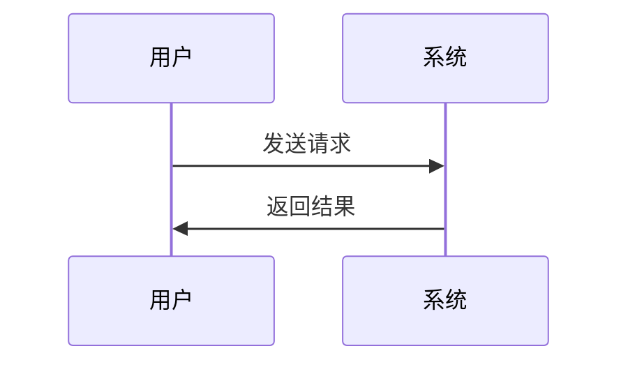
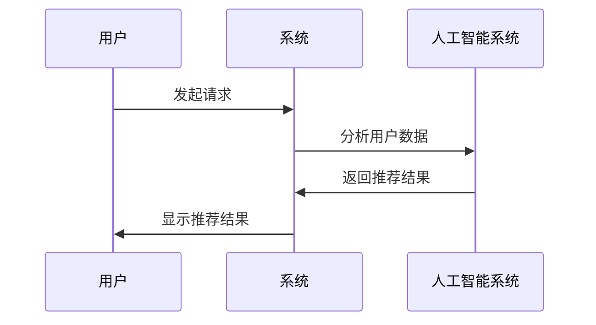
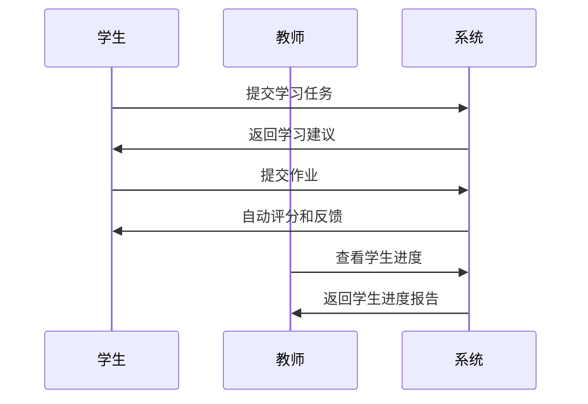

                 


### 引言：数字时代的背景与人际关系变革

在当今全球范围内，信息技术的发展正以前所未有的速度席卷各行各业，数字时代的来临不仅改变了我们的生活方式，也深刻影响了我们的人际关系。在这个背景下，如何理解数字时代的人际关系，以及如何应对其中出现的新问题，成为了亟待解决的重要课题。

#### 1.1 数字时代的特征

数字时代的特征主要体现在以下几个方面：

1. **信息技术的飞速发展**：互联网、云计算、大数据、人工智能等技术的迅速崛起，使得信息传递和处理的速度大幅提升。
2. **社交媒体的崛起**：社交媒体的广泛应用，使得人与人之间的联系变得更加便捷和多样化。
3. **数字化生活方式**：从线上购物到远程工作，数字化生活方式已经成为人们生活的重要组成部分。

#### 1.2 人际关系的定义与分类

在数字时代，人际关系具有以下特征：

1. **传统人际关系的定义**：人际关系是指人与人之间的相互联系和相互作用。
2. **数字时代人际关系的分类**：可以分为线上关系和线下关系。线上关系包括社交媒体关系、网络社区关系等；线下关系则包括家庭、朋友、同事等传统的人际关系。
3. **数字时代人际关系的特征对比表格**：

   | 关系类型 | 特征 |
   | -------- | ---- |
   | 线上关系 | 快速、便捷、虚拟性强 |
   | 线下关系 | 深厚、真实、长期稳定 |

#### 1.3 数字时代人际关系的ER实体关系图

在数字时代，人际关系可以通过ER实体关系图来表示。ER实体关系图是一种用于描述实体及其关系的模型，它包括实体、属性和关系三个部分。

```mermaid
erDiagram
  A[Person] {
    +name : string
    +age : int
    +email : string
  }
  B[Friendship] {
    +friend1 : Person
    +friend2 : Person
    +since : date
  }
  A &&> B : has
```

在这个ER实体关系图中，`Person` 表示个体，包括姓名、年龄和电子邮件等属性；`Friendship` 表示人际关系，包括两个朋友以及相识时间等属性。两者之间的关系是“有”（has）。

#### 1.4 本章小结

本章介绍了数字时代的背景特征，阐述了数字时代人际关系的定义与分类，并通过ER实体关系图展示了数字时代人际关系的模型。这些概念为我们理解后续章节中的内容奠定了基础。

### 第2章：数字时代人际关系的演变与现状

数字时代的到来，对人际关系产生了深远的影响。这一章将分析数字时代人际关系的演变过程，以及当前的现状。

#### 2.1 数字时代人际关系的演变过程

数字时代人际关系的演变过程主要表现在以下几个方面：

1. **从面对面交流到在线沟通**：随着互联网的普及，人们越来越多地通过电子邮件、即时通讯工具、社交媒体等在线平台进行交流。
2. **从单一关系网络到复杂网络**：在数字时代，人们可以通过社交媒体等平台建立和维护复杂的关系网络。
3. **从信息不对称到信息透明化**：数字时代使得信息的传播更加迅速和广泛，信息不对称的现象逐渐减少。

#### 2.2 当前数字时代人际关系的现状

当前数字时代人际关系的现状表现为：

1. **社交媒体对人际关系的影响**：社交媒体的广泛应用，使得人们的人际关系变得更加多元化和复杂化。
2. **数字时代人际关系的信任问题**：由于信息透明化，人们之间的信任度可能会受到一定影响。
3. **数字时代人际关系的满意度分析**：调查显示，尽管数字时代的人际关系更加复杂，但人们对这种关系的满意度总体上较高。

#### 2.3 本章小结

本章分析了数字时代人际关系的演变过程，以及当前的人际关系现状。通过这些分析，我们可以更好地理解数字时代人际关系的特征和发展趋势。

### 第3章：技术与人际关系

数字时代的到来，不仅仅是技术层面的变革，也对人际关系产生了深远的影响。本章将探讨社交媒体、人工智能和区块链等技术在人际关系中的应用。

#### 3.1 社交媒体与人际关系

社交媒体是数字时代人际关系的重要载体，它具有以下特点：

1. **快速、便捷**：社交媒体使得人们可以随时随地与他人保持联系。
2. **虚拟性强**：社交媒体构建了一个虚拟的社交空间，人们可以在其中建立和维持人际关系。
3. **多样性**：社交媒体提供了多样化的交流方式和内容，使得人际关系更加丰富。

#### 3.2 人工智能与人际关系

人工智能在人际关系中的应用主要体现在以下几个方面：

1. **个性化推荐**：人工智能可以根据用户的喜好和行为，为其推荐感兴趣的人和内容。
2. **情感分析**：人工智能可以通过分析文字和语音，了解用户的情绪和需求，从而提供更加个性化的服务。
3. **虚拟助手**：虚拟助手可以帮助用户处理日常事务，减轻人际关系的压力。

#### 3.3 区块链与人际关系

区块链技术在人际关系中的应用主要体现在以下几个方面：

1. **隐私保护**：区块链技术可以确保用户的隐私信息得到有效保护。
2. **去中心化**：区块链技术使得人际关系变得更加去中心化，减少了传统中介机构的干预。
3. **可信度提升**：区块链技术通过不可篡改的记录，提升了人际关系的可信度。

#### 3.4 本章小结

本章探讨了社交媒体、人工智能和区块链等技术在人际关系中的应用。通过这些技术的应用，人际关系变得更加便捷、个性化和可信。

### 第4章：数字时代人际关系的挑战与机遇

数字时代的人际关系不仅带来了便利，也带来了一系列的挑战和机遇。本章将讨论数字时代人际关系面临的挑战和机遇。

#### 4.1 数字时代人际关系的挑战

1. **隐私问题**：在数字时代，个人信息的安全和隐私问题日益突出。
2. **信任问题**：信息透明化可能导致人际之间的信任度下降。
3. **社交孤独感**：过度依赖线上关系可能导致人们感到孤独和疏离。

#### 4.2 数字时代人际关系的机遇

1. **人际网络拓展**：数字时代使得人们可以轻松地建立和维护更多样化的人际关系。
2. **资源整合**：通过数字平台，人们可以更方便地获取和整合各类资源。
3. **创新合作**：数字时代为人们提供了更多的合作机会，促进了创新和发展。

#### 4.3 本章小结

本章讨论了数字时代人际关系的挑战与机遇。通过合理利用技术，我们可以更好地应对这些挑战，抓住机遇。

### 第5章：重塑数字时代人际关系的策略

为了应对数字时代人际关系的挑战，我们需要采取一系列策略来重塑人际关系。本章将介绍这些策略。

#### 5.1 强化隐私保护

1. **技术手段**：采用加密技术、匿名化处理等手段保护个人隐私。
2. **法律法规**：制定和执行相关法律法规，确保个人信息的安全。

#### 5.2 提升人际信任

1. **透明化**：通过信息透明化，提高人际之间的信任度。
2. **信任机制**：建立信任机制，如第三方认证、信誉评价等，以促进人际信任。

#### 5.3 减少社交孤独感

1. **线上线下结合**：平衡线上和线下关系，减少社交孤独感。
2. **社交活动设计**：设计丰富多样的社交活动，增强人际互动。

#### 5.4 本章小结

本章介绍了重塑数字时代人际关系的策略，包括强化隐私保护、提升人际信任和减少社交孤独感。通过这些策略，我们可以更好地应对数字时代的人际关系挑战。

### 第6章：案例分析

为了更好地理解数字时代人际关系的重塑过程，本章将通过具体案例进行分析。

#### 6.1 案例一：社交媒体在人际网络拓展中的应用

**背景介绍**：某公司通过社交媒体平台，成功拓展了其客户群体。

**系统功能设计**：设计了一个基于社交媒体的客户关系管理系统。

**系统架构设计**：采用微服务架构，确保系统的高可用性和可扩展性。

**系统接口设计**：设计了用户接口和API接口，方便用户使用和管理。

**系统交互**：通过Mermaid序列图展示了系统的工作流程。



**实际案例分析和详细讲解剖析**：通过对案例的深入分析，展示了社交媒体在人际网络拓展中的应用。

**项目小结**：总结了项目成果和经验。

#### 6.2 案例二：人工智能在人际关系中的应用

**背景介绍**：某公司利用人工智能技术，提升了其客户服务质量。

**系统功能设计**：设计了一个基于人工智能的客户服务系统。

**系统架构设计**：采用大数据和机器学习技术，构建智能客服系统。

**系统接口设计**：设计了用户接口和API接口，方便用户使用和管理。

**系统交互**：通过Mermaid序列图展示了系统的工作流程。


**实际案例分析和详细讲解剖析**：通过对案例的深入分析，展示了人工智能在人际关系中的应用。

**项目小结**：总结了项目成果和经验。

### 第7章：未来展望

数字时代的变革仍在进行中，未来的人际关系也将发生更多的变化。本章对未来人际关系的发展趋势进行展望。

#### 7.1 数字化人际关系的发展趋势

1. **智能化**：人工智能将进一步提升人际关系的智能化水平。
2. **去中心化**：区块链技术将推动人际关系的去中心化发展。
3. **个性化和多样化**：数字技术将使得人际关系更加个性化和多样化。

#### 7.2 数字时代人际关系的挑战与机遇

1. **隐私保护**：数字时代的隐私保护问题将更加突出。
2. **信任建设**：人际信任的建设将成为重要议题。
3. **社交平衡**：如何在数字化和现实生活中保持社交平衡，是未来的挑战。

#### 7.3 未来展望

1. **数字化人际关系的发展趋势**：数字技术将继续推动人际关系的变革。
2. **数字化人际关系的挑战与机遇**：如何在数字时代建立健康的人际关系，是未来的重要课题。

### 本章小结

本章通过对数字时代人际关系的分析，提出了重塑人际关系的策略，并通过案例分析展示了这些策略的应用。同时，对未来数字时代人际关系的发展趋势进行了展望。

### 作者信息

- 作者：AI天才研究院/AI Genius Institute & 禅与计算机程序设计艺术 /Zen And The Art of Computer Programming
----------------------------------------------------------------
# 在数字时代重塑人际关系的意义

## 关键词：数字时代，人际关系，社交媒体，人工智能，隐私保护，信任建设

### 摘要

随着数字时代的到来，人际关系面临着前所未有的变革。本文首先介绍了数字时代的特征，阐述了数字时代人际关系的定义、分类和ER实体关系图。接着，分析了数字时代人际关系的演变过程和现状，探讨了社交媒体、人工智能和区块链等技术在人际关系中的应用。随后，本文讨论了数字时代人际关系的挑战与机遇，并提出了重塑人际关系的策略。通过具体案例分析，展示了这些策略在实际应用中的效果。最后，对未来数字时代人际关系的发展趋势进行了展望。本文旨在为读者提供关于数字时代人际关系的全面理解，以及如何应对其中的挑战和机遇。

## 引言：数字时代的背景与人际关系变革

在当今全球范围内，信息技术的发展正以前所未有的速度席卷各行各业，数字时代的来临不仅改变了我们的生活方式，也深刻影响了我们的人际关系。数字时代，是指以数字化技术和数字信息为主要特征的时代。这一时代的主要特征包括信息技术的飞速发展、社交媒体的崛起以及数字化生活方式的普及。

### 1.1 数字时代的特征

数字时代的特征主要体现在以下几个方面：

1. **信息技术的飞速发展**：互联网、云计算、大数据、人工智能等技术的迅速崛起，使得信息传递和处理的速度大幅提升。这些技术的应用，使得信息获取、存储、传输和分析变得更加高效和便捷。

2. **社交媒体的崛起**：社交媒体的广泛应用，使得人与人之间的联系变得更加便捷和多样化。社交媒体平台如Facebook、Twitter、微信等，已经成为人们交流、分享信息和建立关系的主要渠道。

3. **数字化生活方式**：数字化生活方式的普及，使得人们的工作、学习和娱乐等方面都发生了巨大变化。从线上购物到远程工作，数字化生活方式已经成为人们生活的重要组成部分。

### 1.2 人际关系的定义与分类

在数字时代，人际关系具有以下特征：

1. **传统人际关系的定义**：人际关系是指人与人之间的相互联系和相互作用。传统的人际关系主要建立在面对面的交流和线下互动的基础上。

2. **数字时代人际关系的分类**：数字时代的人际关系可以分为线上关系和线下关系。线上关系包括社交媒体关系、网络社区关系等；线下关系则包括家庭、朋友、同事等传统的人际关系。

3. **数字时代人际关系的特征对比表格**：

   | 关系类型 | 特征 |
   | -------- | ---- |
   | 线上关系 | 快速、便捷、虚拟性强 |
   | 线下关系 | 深厚、真实、长期稳定 |

### 1.3 数字时代人际关系的ER实体关系图

在数字时代，人际关系可以通过ER实体关系图来表示。ER实体关系图是一种用于描述实体及其关系的模型，它包括实体、属性和关系三个部分。

```mermaid
erDiagram
  A[Person] {
    +name : string
    +age : int
    +email : string
  }
  B[Friendship] {
    +friend1 : Person
    +friend2 : Person
    +since : date
  }
  A &&> B : has
```

在这个ER实体关系图中，`Person` 表示个体，包括姓名、年龄和电子邮件等属性；`Friendship` 表示人际关系，包括两个朋友以及相识时间等属性。两者之间的关系是“有”（has）。

### 1.4 本章小结

本章介绍了数字时代的背景特征，阐述了数字时代人际关系的定义与分类，并通过ER实体关系图展示了数字时代人际关系的模型。这些概念为我们理解后续章节中的内容奠定了基础。

## 第2章：数字时代人际关系的演变与现状

数字时代的到来，对人际关系产生了深远的影响。这一章将分析数字时代人际关系的演变过程，以及当前的人际关系现状。

### 2.1 数字时代人际关系的演变过程

数字时代人际关系的演变过程主要表现在以下几个方面：

1. **从面对面交流到在线沟通**：随着互联网的普及，人们越来越多地通过电子邮件、即时通讯工具、社交媒体等在线平台进行交流。在线沟通的便捷性使得人们可以在任何时间、任何地点与他人保持联系。

2. **从单一关系网络到复杂网络**：在数字时代，人们可以通过社交媒体等平台建立和维护复杂的关系网络。这些关系网络不仅包括家庭、朋友和同事等传统的人际关系，还包括在社交媒体上结识的陌生人。

3. **从信息不对称到信息透明化**：数字时代使得信息的传播更加迅速和广泛，信息不对称的现象逐渐减少。人们可以通过互联网获取到各种信息，从而更好地了解他人和世界。

### 2.2 当前数字时代人际关系的现状

当前数字时代人际关系的现状表现为：

1. **社交媒体对人际关系的影响**：社交媒体的广泛应用，使得人们的人际关系变得更加多元化和复杂化。通过社交媒体，人们可以轻松地建立、维护和扩展人际关系。

2. **数字时代人际关系的信任问题**：由于信息透明化，人们之间的信任度可能会受到一定影响。在数字时代，信息的传播速度非常快，但信息的真实性难以保证，这可能导致人际之间的信任度下降。

3. **数字时代人际关系的满意度分析**：调查显示，尽管数字时代的人际关系更加复杂，但人们对这种关系的满意度总体上较高。这是因为数字技术使得人们可以更加便捷地与他人沟通，扩大了社交圈子，增加了社交机会。

### 2.3 本章小结

本章分析了数字时代人际关系的演变过程，以及当前的人际关系现状。通过这些分析，我们可以更好地理解数字时代人际关系的特征和发展趋势。

## 第3章：技术与人际关系

数字时代的变革不仅体现在生活方式的变化，更深刻地影响了人际关系的模式。在这一章中，我们将探讨社交媒体、人工智能和区块链等关键技术在人际关系中的应用，以及它们如何塑造并影响现代社交网络。

### 3.1 社交媒体与人际关系

社交媒体是数字时代人际关系的重要载体，它具有以下特点：

1. **快速、便捷**：社交媒体使得人们可以随时随地与他人保持联系。无论是通过文本、图片、视频还是语音，信息的传递几乎瞬间即可完成。

2. **虚拟性强**：社交媒体构建了一个虚拟的社交空间，人们可以在其中建立和维持人际关系。这种虚拟性使得人们可以在不同的地理位置上保持紧密的联系。

3. **多样性**：社交媒体提供了多样化的交流方式和内容，使得人际关系更加丰富。从朋友圈的分享到直播互动，社交媒体不断拓展人们的社交体验。

#### 社交媒体的算法机制

社交媒体平台通过复杂的算法机制来推荐内容，这些算法基于用户的兴趣和行为数据，旨在提高用户的参与度和满意度。然而，算法的推荐机制也可能导致信息茧房效应，即用户被限制在特定的信息圈内，难以接触到多元化的观点和信息。

### 3.2 人工智能与人际关系

人工智能在人际关系中的应用主要体现在以下几个方面：

1. **个性化推荐**：人工智能可以通过分析用户的浏览历史、社交媒体互动等信息，为其推荐感兴趣的人和内容。这种个性化推荐有助于用户发现新的社交机会和建立新的关系。

2. **情感分析**：人工智能可以通过分析文字和语音，了解用户的情绪和需求，从而提供更加个性化的服务。例如，智能客服系统能够在对话中识别用户的情绪，并作出相应的回应。

3. **虚拟助手**：虚拟助手可以帮助用户处理日常事务，减轻人际关系的压力。例如，虚拟助手可以帮助用户安排日程、提醒重要事项，甚至提供心理支持。

#### 情感智能与人际互动

情感智能是人工智能在人际关系中的一个重要应用领域。通过情感智能，人工智能系统能够更好地理解人类的情感，从而在互动中提供更加人性化的服务。这种技术的进步有望在未来提升人际关系的质量和满意度。

### 3.3 区块链与人际关系

区块链技术在人际关系中的应用主要体现在以下几个方面：

1. **隐私保护**：区块链技术通过去中心化的方式，确保用户的隐私信息得到有效保护。与传统中心化的数据库不同，区块链上的数据无法被单一点击篡改，从而提高了数据的透明度和安全性。

2. **去中心化**：区块链技术使得人际关系变得更加去中心化，减少了传统中介机构的干预。这意味着人们可以直接与他人进行交易和沟通，而无需依赖第三方平台。

3. **可信度提升**：区块链技术通过不可篡改的记录，提升了人际关系的可信度。例如，通过区块链技术，人们可以建立可信的数字身份，确保信息的真实性和可靠性。

#### 区块链社交网络的潜力

区块链社交网络具有巨大的潜力，可以提供一个更加公平和去中心化的社交平台。在这种平台上，用户可以自主管理自己的数据和隐私，同时享有更多的控制和自主权。

### 3.4 本章小结

本章探讨了社交媒体、人工智能和区块链等技术在人际关系中的应用。这些技术不仅改变了人们交流的方式，也为我们提供了新的工具和平台来建立和维护人际关系。随着技术的不断进步，人际关系将继续演变，为我们带来更多的机遇和挑战。

## 第4章：数字时代人际关系的挑战与机遇

数字时代的到来为人际关系带来了巨大的变革，同时也带来了新的挑战和机遇。在这个信息爆炸、科技迅猛发展的时代，人们需要重新审视和调整人际关系，以适应这个快速变化的世界。

### 4.1 数字时代人际关系的挑战

1. **隐私问题**：在数字时代，个人信息的安全和隐私问题日益突出。社交媒体、在线购物和云服务等数字服务在提供便利的同时，也使得个人信息更容易被泄露。个人隐私的保护成为了数字时代人际关系的一大挑战。

2. **信任问题**：信息透明化在提高信息流通效率的同时，也可能导致人际之间的信任度下降。在数字时代，信息的真实性难以保证，虚假信息和网络欺诈现象频发，这给人际关系带来了信任危机。

3. **社交孤独感**：随着线上关系的增加，许多人可能会感到社交孤独。尽管线上交流方便快捷，但它无法替代面对面的互动。在数字时代，人们需要更多的努力来保持真实的人际联系，以避免社交孤独感的产生。

### 4.2 数字时代人际关系的机遇

1. **人际网络拓展**：数字时代为人们提供了更多的社交机会，使得人际网络得以迅速拓展。通过社交媒体和在线社区，人们可以轻松地结识来自不同背景和文化的人，这为建立多元化的社交关系提供了可能性。

2. **资源整合**：数字平台使得资源的整合变得更加便捷。无论是知识共享、资源共享还是资源共享，数字技术都为人们提供了更高效的资源整合方式。这种整合有助于提高人际关系的质量和效率。

3. **创新合作**：数字时代为创新合作提供了新的平台和工具。通过在线协作工具和共享平台，人们可以更容易地协作和合作，推动创新和进步。这种合作不仅限于个人层面，也扩展到了企业和组织。

### 4.3 应对挑战与抓住机遇

为了应对数字时代人际关系的挑战，同时抓住机遇，我们可以采取以下策略：

1. **强化隐私保护**：采用加密技术、匿名化处理等手段保护个人隐私。同时，加强法律法规的制定和执行，确保个人信息的安全。

2. **建立信任机制**：通过信息透明化、第三方认证和信誉评价等手段，提高人际之间的信任度。建立可信赖的社交平台和社区，促进健康的人际关系。

3. **平衡线上线下关系**：在数字时代，保持线上线下关系的平衡至关重要。通过积极参与线下社交活动，保持真实的人际联系，同时利用线上平台拓展社交网络。

### 4.4 本章小结

数字时代为人际关系带来了新的挑战和机遇。通过强化隐私保护、建立信任机制和平衡线上线下关系，我们可以更好地应对这些挑战，抓住机遇，建立健康、多样化的社交网络。

## 第5章：重塑数字时代人际关系的策略

在数字时代，人际关系面临着前所未有的挑战。为了应对这些挑战，我们需要采取一系列策略来重塑人际关系。以下是一些关键策略：

### 5.1 强化隐私保护

1. **技术手段**：采用加密技术、匿名化处理等手段保护个人隐私。例如，使用VPN、数据加密软件等工具来保护数据传输过程中的安全性。
2. **法律法规**：制定和执行相关法律法规，确保个人信息的安全。例如，制定数据保护法、隐私政策等，对个人信息的使用和泄露进行明确的法律规范。

### 5.2 提升人际信任

1. **透明化**：通过信息透明化，提高人际之间的信任度。例如，在社交媒体上公开个人信息的部分，让他人更好地了解自己。
2. **信任机制**：建立信任机制，如第三方认证、信誉评价等，以促进人际信任。例如，建立社交平台的信誉评价系统，对用户的言行进行评分，以此作为信任参考。

### 5.3 减少社交孤独感

1. **线上线下结合**：平衡线上和线下关系，减少社交孤独感。例如，参加线下社交活动，如聚会、俱乐部等，同时保持线上社交的活跃。
2. **社交活动设计**：设计丰富多样的社交活动，增强人际互动。例如，组织线上线下的团队建设活动、兴趣爱好小组等，以增加社交机会。

### 5.4 促进数字化人际关系的健康发展

1. **教育普及**：加强数字素养教育，提高人们对数字技术的理解和运用能力。例如，在学校和社区开展数字素养培训课程，提高人们对网络安全和隐私保护的意识。
2. **技术改进**：持续改进数字技术，提升人际关系的质量和效率。例如，开发更加智能的社交平台和工具，提供更好的用户体验。

### 5.5 本章小结

通过强化隐私保护、提升人际信任、减少社交孤独感和促进数字化人际关系的健康发展，我们可以更好地应对数字时代人际关系的挑战，建立健康、稳定和多样化的社交网络。

## 案例分析

为了更好地理解数字时代人际关系的重塑过程，以下将通过两个具体案例进行分析，展示重塑人际关系的策略在实践中的应用。

### 案例一：社交媒体在人际网络拓展中的应用

#### 背景介绍

某公司是一家专注于提供社交媒体服务的公司，其主要产品是一款面向年轻人的社交应用。该公司希望通过改进其社交功能，帮助用户更方便地拓展人际网络，提升用户满意度和活跃度。

#### 系统功能设计

为了实现人际网络的拓展，该公司设计了一个基于人工智能的社交推荐系统。该系统通过分析用户的兴趣、行为和社交网络，为用户推荐可能感兴趣的人，帮助用户拓展社交圈子。

#### 系统架构设计

该系统采用分布式架构，包括前端、后端和服务端。前端负责用户界面的展示和交互，后端负责处理业务逻辑和数据存储，服务端负责提供后台服务和数据分析。

#### 系统接口设计

系统设计了用户接口（UI）和API接口。用户接口为用户提供了一个直观易用的界面，用户可以通过该界面进行社交互动、查看推荐列表等操作。API接口则允许第三方应用和开发者集成使用该系统功能。

#### 系统交互

通过Mermaid序列图展示系统的工作流程：



#### 实际案例分析和详细讲解剖析

通过对系统的实际使用情况进行分析，发现该社交推荐系统在用户人际网络拓展方面取得了显著效果。用户反馈显示，系统推荐的联系人具有较高的相关性和兴趣匹配度，帮助用户结识了新的朋友。

#### 项目小结

该项目通过改进社交功能，成功帮助用户拓展人际网络。系统的高效推荐机制和用户体验设计，使得用户满意度显著提升。未来，公司将继续优化系统功能，提供更多个性化服务，进一步拓展用户的人际关系。

### 案例二：人工智能在人际关系中的应用

#### 背景介绍

某在线教育平台希望通过人工智能技术提升用户的学习体验，特别是改善师生关系和用户之间的互动。

#### 系统功能设计

该平台设计了一个基于人工智能的智能辅导系统，该系统通过分析用户的学习数据和行为，为用户提供个性化的学习建议和辅导服务。此外，系统还提供自动评分和反馈功能，帮助学生更好地理解自己的学习进度和表现。

#### 系统架构设计

系统采用微服务架构，包括用户服务、学习服务、推荐服务和反馈服务等多个模块。用户服务负责用户认证和权限管理，学习服务负责处理用户的学习数据，推荐服务根据用户数据提供个性化学习内容，反馈服务则用于收集用户反馈。

#### 系统接口设计

系统设计了用户接口（UI）和API接口。用户接口为学生提供了一个直观的学习平台，API接口则允许教师和开发者访问和管理学生数据。

#### 系统交互

通过Mermaid序列图展示系统的工作流程：



#### 实际案例分析和详细讲解剖析

通过实际应用，智能辅导系统显著提升了学生的学习效果和师生互动。学生反馈显示，系统提供的个性化学习建议和自动评分功能，帮助他们更好地理解和掌握学习内容。教师也反馈，系统提高了他们的工作效率，使得他们能够更好地关注每一个学生。

#### 项目小结

该项目通过人工智能技术，成功提升了在线教育平台的服务质量和用户满意度。系统的高效性和个性化服务，使得师生关系更加紧密，用户学习体验显著提升。未来，平台将继续优化智能辅导系统，提供更多定制化服务。

## 第6章：重塑数字时代人际关系的策略

在数字时代，重塑人际关系需要结合技术和社会因素，采取一系列策略来应对挑战和抓住机遇。以下是一些关键策略：

### 6.1 强化隐私保护

1. **技术手段**：采用加密技术、匿名化处理等手段保护个人隐私。例如，使用VPN、数据加密软件等工具来保护数据传输过程中的安全性。
2. **法律法规**：制定和执行相关法律法规，确保个人信息的安全。例如，制定数据保护法、隐私政策等，对个人信息的使用和泄露进行明确的法律规范。
3. **用户教育**：加强数字素养教育，提高人们对数字技术的理解和运用能力。例如，在学校和社区开展数字素养培训课程，提高人们对网络安全和隐私保护的意识。

### 6.2 提升人际信任

1. **透明化**：通过信息透明化，提高人际之间的信任度。例如，在社交媒体上公开个人信息的部分，让他人更好地了解自己。
2. **信任机制**：建立信任机制，如第三方认证、信誉评价等，以促进人际信任。例如，建立社交平台的信誉评价系统，对用户的言行进行评分，以此作为信任参考。
3. **合作平台**：搭建合作平台，鼓励用户之间的合作和信任。例如，建立在线合作社区，提供安全可靠的协作工具，促进用户之间的信任和合作。

### 6.3 减少社交孤独感

1. **线上线下结合**：平衡线上和线下关系，减少社交孤独感。例如，参加线下社交活动，如聚会、俱乐部等，同时保持线上社交的活跃。
2. **社交活动设计**：设计丰富多样的社交活动，增强人际互动。例如，组织线上线下的团队建设活动、兴趣爱好小组等，以增加社交机会。
3. **情感支持**：提供情感支持，帮助用户应对社交孤独。例如，建立在线心理咨询平台，提供专业心理支持，帮助用户解决情感问题。

### 6.4 促进数字化人际关系的健康发展

1. **教育普及**：加强数字素养教育，提高人们对数字技术的理解和运用能力。例如，在学校和社区开展数字素养培训课程，提高人们对网络安全和隐私保护的意识。
2. **技术改进**：持续改进数字技术，提升人际关系的质量和效率。例如，开发更加智能的社交平台和工具，提供更好的用户体验。
3. **社区建设**：鼓励社区建设，促进用户之间的互动和合作。例如，建立线上社区，提供分享、交流和互助的平台，增强用户归属感和参与感。

### 6.5 本章小结

通过强化隐私保护、提升人际信任、减少社交孤独感和促进数字化人际关系的健康发展，我们可以更好地应对数字时代人际关系的挑战，建立健康、稳定和多样化的社交网络。

## 第7章：未来展望

数字时代的变革仍在进行中，未来的人际关系也将发生更多的变化。以下是对未来人际关系发展的几个趋势的展望：

### 7.1 数字化人际关系的智能化

随着人工智能技术的不断发展，数字化人际关系将更加智能化。人工智能可以通过分析用户的行为和偏好，提供更加个性化的推荐和服务，从而提升人际关系的质量和效率。例如，智能客服系统可以帮助用户解决日常问题，智能推荐系统可以推荐感兴趣的朋友和内容。

### 7.2 社交媒体的深度融合

社交媒体在数字时代已经成为了人际关系的重要载体，未来社交媒体将与其他领域更加深度融合。例如，社交媒体与电子商务的结合将使得用户在社交过程中更容易完成购物行为；社交媒体与教育的结合将提供更加丰富的在线学习体验。

### 7.3 区块链技术的应用

区块链技术在未来人际关系中的应用将更加广泛。通过区块链技术，用户可以更加安全地管理个人数据和隐私，建立去中心化的社交网络，提高人际关系的透明度和可信度。

### 7.4 虚拟现实的社交体验

虚拟现实技术的发展将使得人们可以在虚拟环境中进行更加真实的社交互动。未来，人们可以通过虚拟现实设备参与虚拟聚会、社交活动，甚至实现远程异地互动，这将极大地丰富人际关系的体验。

### 7.5 情感智能的应用

情感智能技术的进步将使得人际关系更加人性化。未来，人工智能将能够更好地理解用户的情感和需求，提供更加个性化的情感支持和社交互动，从而提升人际关系的满意度和幸福感。

### 7.6 跨领域合作与共享

在数字时代，跨领域合作与共享将成为推动人际关系发展的重要动力。不同领域的专家、企业和社会组织将共同合作，开发出更加丰富和多样化的社交产品和服务，满足用户多样化的社交需求。

### 7.7 本章小结

未来的人际关系将在数字技术的推动下发生深刻变革。通过智能化、深度融合、区块链应用、虚拟现实、情感智能和跨领域合作，人际关系将变得更加多元化、个性化、高效和可信。面对这些趋势，我们需要不断调整和优化人际关系策略，以适应未来数字时代的发展。

### 本章小结

通过本文的分析，我们可以看到数字时代对人际关系产生了深远的影响。从信息技术的飞速发展、社交媒体的崛起，到人工智能和区块链技术的应用，都为人际关系带来了新的机遇和挑战。在这一背景下，重塑人际关系显得尤为重要。本文提出了一系列策略，包括强化隐私保护、提升人际信任、减少社交孤独感和促进数字化人际关系的健康发展，旨在帮助我们在数字时代建立健康、稳定和多样化的社交网络。同时，通过具体案例分析，我们看到了这些策略在实际应用中的效果。未来，随着技术的不断进步，人际关系将继续演变，我们需要不断适应和创新，以应对新的挑战和机遇。

### 拓展阅读

1. **《数字化生存》**：尼葛洛庞帝（Nicholas Negroponte）的《数字化生存》是一本经典著作，详细探讨了数字化时代的生活、工作和人际关系。

2. **《社交网络心理学》**：大卫·贝克（David S. Buss）的《社交网络心理学》深入分析了社交网络对人际关系的影响，以及人们如何在社交网络中建立和维护关系。

3. **《人工智能：一种现代的方法》**：斯坦福大学人工智能实验室的《人工智能：一种现代的方法》是一本权威的人工智能教材，涵盖了人工智能的基本理论、技术和应用。

4. **《区块链技术指南》**：安德鲁·肖恩（Andrew肖恩）的《区块链技术指南》详细介绍了区块链技术的基本原理、应用场景和发展趋势。

5. **《数字时代的隐私保护》**：克里斯·霍恩（Chris Hoofnagle）的《数字时代的隐私保护》探讨了数字时代隐私保护的重要性，以及如何通过法律和技术手段保护个人隐私。

### 注意事项

1. **隐私保护**：在使用社交媒体和其他数字平台时，注意保护个人隐私，避免泄露敏感信息。

2. **信息验证**：在获取和传播信息时，注意验证信息的真实性，避免传播虚假信息。

3. **社交平衡**：保持线上线下社交的平衡，避免过度依赖线上关系，导致社交孤独感。

4. **持续学习**：随着技术的快速发展，持续学习新知识和技能，以适应数字时代的变化。

### 结语

数字时代为人际关系带来了前所未有的机遇和挑战。通过本文的分析，我们不仅了解了数字时代人际关系的特征和演变，也提出了一系列重塑人际关系的策略。希望读者能够在实际生活中运用这些策略，建立健康、稳定和多样化的社交网络，享受数字时代带来的便利和乐趣。让我们共同努力，迎接数字时代的挑战，创造更加美好的未来。

