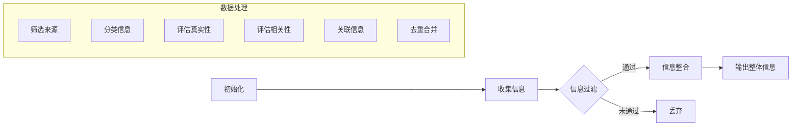
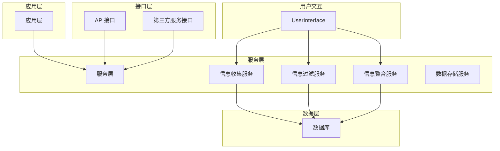

                 

## 文章标题

在碎片化时代寻找整体感

> 关键词：碎片化、整体感、心理健康、教育、社会结构

> 摘要：本文深入探讨了在当今技术进步和社会变迁背景下，个体和社会如何面对信息碎片化带来的挑战，寻求整体感的解决方案。文章首先分析了碎片化时代的背景和整体感的重要性，随后从心理学、教育学和社会学三个视角出发，探讨了寻找整体感的路径。最后，文章提出了具体的实践方法，并对未来整体感实现路径进行了展望。

---

### 目录大纲

1. **第一部分：问题的提出**

   1.1 碎片化时代的背景
   
   1.2 整体感的重要性

2. **第二部分：寻找整体感的路径**

   2.1 心理学视角
   
   2.2 教育学视角
   
   2.3 社会学视角

3. **第三部分：具体实践**

   3.1 个人层面
   
   3.2 社会层面

4. **第四部分：未来展望**

   4.1 整体感的实现路径
   
   4.2 面临的挑战与对策

5. **附录**

   5.1 参考文献
   
   5.2 致谢

---

## 第一部分：问题的提出

### 1.1 碎片化时代的背景

#### 1.1.1 技术进步与信息爆炸

在21世纪的今天，技术进步的速度如同光速，信息爆炸的现象无处不在。从互联网到移动通信，从大数据到人工智能，各种技术的快速发展使得人们获取信息的方式变得多样化，信息的传播速度也大大加快。这不仅改变了人们的生活方式，也深刻影响了人们的思维模式。

#### 1.1.2 社会变迁与个体生活节奏加快

随着社会的快速发展，个体的生活节奏也在不断加快。工作压力、生活压力、社交压力等多重压力下，人们往往没有足够的时间和精力去深入思考，而是陷入了碎片化的信息接收和处理中。

#### 1.1.3 碎片化信息对人类思维模式的影响

碎片化信息的特点是短小、快速、多样，这种信息接收方式在一定程度上提高了人们的效率，但也使得人们的思维变得浅薄和碎片化。长此以往，可能导致个体对事物的理解变得片面，缺乏深度。

### 1.2 整体感的重要性

#### 1.2.1 整体感在个体成长中的作用

整体感是指个体对事物整体的认知和理解。在个体成长中，整体感有助于个体形成完整的知识体系，提升思维深度，培养批判性思维和创造性思维。

#### 1.2.2 整体感在社会发展中的意义

在社会发展中，整体感有助于社会成员形成共同的价值观念，提升社会凝聚力，促进社会的和谐发展。

#### 1.2.3 整体感在科技发展中的挑战

在科技发展中，整体感有助于科技工作者从整体角度出发，进行科技创新和研发，推动科技的全面发展。

## 第二部分：寻找整体感的路径

### 2.1 心理学视角

#### 2.1.1 碎片化与心理健康的关联

碎片化信息接收可能导致个体出现焦虑、抑郁等心理问题。因此，心理学视角下的整体感寻找，需要从改善个体心理健康入手。

#### 2.1.2 心理学理论在寻找整体感中的应用

心理学理论如认知行为理论、人本主义心理学等，都可以为整体感的寻找提供理论支持。

#### 2.1.3 心理策略与实践

心理策略包括时间管理、信息筛选、深度思考等，这些策略有助于个体在碎片化信息环境中保持整体感。

### 2.2 教育学视角

#### 2.2.1 碎片化信息对教育的影响

碎片化信息对教育的影响主要体现在信息过载和教学方法的变革。

#### 2.2.2 整体性教育理念的提出

整体性教育理念强调个体全面发展，注重知识的整体性和系统性。

#### 2.2.3 整体性教育实践案例

整体性教育实践案例包括跨学科教学、项目式学习等，这些方法有助于学生在碎片化信息环境中培养整体感。

### 2.3 社会学视角

#### 2.3.1 社会结构与碎片化现象

社会结构与碎片化现象密切相关，社会结构调整有助于缓解碎片化信息带来的负面影响。

#### 2.3.2 整体性社会构建的探索

整体性社会构建需要从社会制度、文化价值观等多方面进行探索。

#### 2.3.3 社会学方法在寻找整体感中的应用

社会学研究方法如实地考察、问卷调查等，有助于深入理解碎片化现象和寻找整体感的路径。

## 第三部分：具体实践

### 3.1 个人层面

#### 3.1.1 碎片化时间管理

个人层面的碎片化时间管理包括合理安排时间、提高时间利用效率等。

#### 3.1.2 碎片化信息的筛选与整合

个人需要学会筛选有价值的信息，并进行有效的整合。

#### 3.1.3 个人成长计划与整体性目标设定

个人成长计划与整体性目标设定有助于个人在碎片化信息环境中保持整体感。

### 3.2 社会层面

#### 3.2.1 整体性社区建设

整体性社区建设包括社区文化建设、社区服务体系建设等。

#### 3.2.2 碎片化信息治理

社会层面的碎片化信息治理包括制定相关法律法规、加强信息监管等。

#### 3.2.3 整体性社会政策制定与实施

整体性社会政策制定与实施有助于提升社会整体感。

## 第四部分：未来展望

### 4.1 整体感的实现路径

未来整体感的实现路径可能包括技术手段的运用、社会变革的可能性等。

### 4.2 面临的挑战与对策

未来整体感实现过程中可能面临技术依赖、社会结构调整等挑战，需要采取相应的对策。

## 附录

### 4.3 参考文献

[参考文献列表]

### 4.4 致谢

[致谢内容]

---

**作者：AI天才研究院/AI Genius Institute & 禅与计算机程序设计艺术 /Zen And The Art of Computer Programming**### 第一部分：问题的提出

#### 1.1 碎片化时代的背景

##### 1.1.1 技术进步与信息爆炸

技术进步是推动人类社会发展的关键动力，尤其在21世纪，这一进程尤为显著。互联网的普及、移动通信技术的突破、大数据和云计算的兴起，使得信息获取和处理变得前所未有的高效。这些技术不仅改变了人们的生活和工作方式，也加速了信息的传播速度和范围。信息爆炸的现象体现在各个领域，从新闻媒体到社交网络，从电子商务到在线教育，信息以爆炸式的速度涌现，极大地丰富了人类的知识库。

然而，这种信息爆炸也带来了前所未有的挑战。首先，信息过载成为一个普遍现象。人们在短时间内接收到的信息量远远超过了他们能够有效处理和消化的能力。这种现象在学术界被称为“信息饱和”，其结果是人们往往只能关注表面的、碎片化的信息，而忽略了深层次的知识和概念。其次，信息的碎片化使得知识的整体性和系统性受到冲击。传统上，知识的传授和积累是建立在系统化和层次化基础上的，而碎片化信息往往缺乏这种结构，导致人们对事物的理解变得支离破碎。

技术进步不仅改变了信息传播的方式，也改变了人们的认知模式。互联网和移动设备的普及使得人们可以随时随地获取信息，这种即时性的信息获取方式虽然提高了效率，但也使得人们的注意力分散。研究表明，随着屏幕时间的增加，人们的注意力持续时间在逐渐缩短，这种注意力分散现象在碎片化信息环境中尤为明显。此外，社交媒体的算法推荐系统进一步加剧了信息碎片化，用户往往只能看到与自己观点相似的、符合算法推荐的信息，这导致“信息茧房”现象的出现，阻碍了人们接触多元观点和深入思考的机会。

总的来说，技术进步带来的信息爆炸和碎片化现象对人类思维模式产生了深远影响。一方面，它提高了人们的知识获取效率，丰富了信息来源；另一方面，它也使得知识的整体性和系统性受到挑战，对人们的认知深度和思维广度产生了负面影响。在碎片化时代，如何应对信息过载和保持思维的深度，成为现代社会亟待解决的问题。

##### 1.1.2 社会变迁与个体生活节奏加快

社会变迁是21世纪的一个重要特征，全球化和数字化推动了社会的快速变革。在这种背景下，个体的生活节奏也在不断加快。工作压力、生活压力、社交压力等多重压力使个体感到心力交瘁，时间管理成为一项重要技能。人们常常在忙碌中忽略了生活的质量，深陷于信息的海洋中，无法自拔。

社会变迁对个体生活节奏的影响体现在多个方面。首先，工作压力的增加使得人们的工作时间延长，休息时间减少。现代社会的工作方式往往需要员工具备高效的信息处理能力，这导致个体不得不投入更多的时间和精力来应对工作上的挑战。其次，生活压力的增加体现在经济负担、家庭责任和社交压力等方面。随着房价、教育成本和生活成本的不断上涨，个体感受到的经济压力越来越大。同时，家庭责任和社交压力也使得个体在生活中倍感压力，难以找到平衡点。

此外，社交压力也在加剧个体生活节奏的加快。社交媒体的普及使得个体需要时刻保持在线状态，关注朋友的动态，参与社交活动。这种社交压力使得个体在现实生活中也难以放松，时刻担心错过重要的信息或社交机会。社交媒体的即时性特点进一步加剧了信息的碎片化，个体在浏览社交媒体时往往只能看到片段化的信息，难以进行深入的思考和交流。

生活节奏的加快对个体的心理健康产生了负面影响。长时间的高压工作和生活压力容易导致焦虑、抑郁等心理问题的出现。缺乏休息和放松的时间使得个体的身心状态无法得到有效的调整，长期处于紧张和疲劳状态。此外，信息过载和注意力分散使得个体难以集中精力进行深度思考和创造性的工作，进一步影响了个体的发展。

总的来说，社会变迁和个体生活节奏的加快使得个体在碎片化时代面临着诸多挑战。如何在快节奏的生活中找到平衡，保持心理健康，成为现代社会需要关注的重要问题。

##### 1.1.3 碎片化信息对人类思维模式的影响

碎片化信息对人类思维模式的影响是一个复杂而深远的话题。在碎片化信息环境中，人们的认知模式发生了显著变化，这些变化不仅影响了信息的处理和吸收，还深刻地影响了个体的思维方式和行为习惯。

首先，碎片化信息的特点是短小、即时和多样化。这种信息形式与人类的短期记忆和注意力机制相契合，但同时也容易导致信息处理的浅薄化。研究表明，当人们面对大量碎片化信息时，往往只能进行浅层次的认知处理，难以进行深入的思考和整合。这种现象在学术界被称为“碎片化认知”，其结果是人们对信息的理解往往停留在表面，缺乏深度和系统性。

其次，碎片化信息加剧了人们的注意力分散。随着屏幕时间的增加，人们的注意力持续时间在逐渐缩短。根据一项研究，人们在社交媒体上的平均注意力持续时间仅为8秒，比金鱼的记忆力还要短。这种注意力分散使得人们难以进行连续的、集中的思考，导致思维的连续性和深度受到破坏。此外，社交媒体的算法推荐系统进一步加剧了这一问题，用户往往只能看到与自己观点相似的、符合算法推荐的信息，这导致“信息茧房”现象的出现，阻碍了多元观点的接触和思维的开放性。

碎片化信息还影响了人们的创造力。传统的创造力培养需要个体进行深入的思考、探索和实验，而碎片化信息往往限制了个体的思维空间，使得创新思维难以发挥。研究表明，当个体面临大量碎片化信息时，大脑的默认网络活动减弱，这与创造力密切相关的大脑区域活动减少。这种现象在学术界被称为“信息过载导致的创造力下降”。

此外，碎片化信息对人类的决策过程也产生了影响。研究表明，碎片化信息可能导致个体在决策时缺乏全面的信息和深入的思考，从而做出更加冲动和短视的决策。这种现象在金融投资、职场选择等场合尤为明显，容易导致决策失误和负面影响。

碎片化信息还影响了人类的社交互动。在碎片化信息环境中，人们的沟通和交流变得浅薄和表面化，往往只能进行简单的是非判断和情绪表达，而难以进行深入的、富有建设性的对话。这种社交互动的碎片化不仅降低了社交的质量，还可能导致人际关系的疏远和沟通障碍。

总的来说，碎片化信息对人类思维模式的影响是全方位的，不仅影响了信息的处理和吸收，还深刻地影响了个体的思维方式、决策过程和社交互动。在碎片化时代，如何应对这些负面影响，保持思维的深度和创造性，成为个体和社会共同面临的重要挑战。

#### 1.2 整体感的重要性

##### 1.2.1 整体感在个体成长中的作用

整体感是指个体对事物整体的认知和理解，它不仅是个体心理健康的基石，也是个体成长和发展的关键。在个体成长过程中，整体感发挥着重要作用，它帮助个体建立全面的知识体系，提升思维深度和广度，培养批判性思维和创造性思维。

首先，整体感有助于个体建立全面的知识体系。在碎片化信息环境中，个体往往只能接触到零散的信息片段，缺乏系统的知识结构。整体感使得个体能够将零散的信息片段整合成一个完整的知识体系，从而更好地理解和应用知识。例如，在学习一门新的学科时，整体感能够帮助个体理解学科的基本原理和结构，从而更好地掌握学科知识。

其次，整体感提升了个体的思维深度和广度。碎片化信息容易导致思维的浅薄化，而整体感则能够促使个体进行深入和广泛的思考。通过整合不同的信息来源和观点，个体能够从多个角度分析问题，形成更加全面和深刻的认识。例如，在解决复杂问题时，整体感能够帮助个体从宏观和微观两个层面进行思考，从而找到更有效的解决方案。

此外，整体感还培养了批判性思维和创造性思维。整体感使得个体能够从整体角度出发，对信息进行筛选和评估，从而避免盲从和偏见。通过批判性思维，个体能够对信息进行深入的分析和判断，形成独立的见解。同时，整体感也激发了创造性思维，使得个体能够跳出传统的思维框架，提出新颖的观点和解决方案。

最后，整体感对个体的心理健康也有重要影响。在碎片化信息环境中，个体容易感到焦虑和压力，而整体感则能够帮助个体保持心理平衡和稳定。通过将注意力集中在整体上，个体能够减少对碎片化信息的过度关注，降低焦虑和压力水平，提升生活质量。

总的来说，整体感在个体成长中的作用不可忽视。它不仅帮助个体建立全面的知识体系，提升思维深度和广度，培养批判性思维和创造性思维，还对个体的心理健康产生积极影响。在碎片化时代，培养整体感成为个体发展的关键，也是应对信息碎片化带来的挑战的重要策略。

##### 1.2.2 整体感在社会发展中的意义

整体感不仅对个体成长具有重要意义，在社会发展中同样发挥着至关重要的作用。整体感是指个体对事物整体的认知和理解，这种认知不仅体现在个体层面，也延伸到社会层面，成为社会凝聚力、创新能力和可持续发展的重要基石。

首先，整体感是增强社会凝聚力的重要因素。在一个高度碎片化的社会中，人们往往只能接触到片面的信息，缺乏对全局的把握。这种信息碎片化导致社会成员之间缺乏共同的价值观念和信仰，社会凝聚力减弱。整体感则能够帮助社会成员形成对全局的深刻理解，增强彼此之间的认同感和归属感。通过共同理解和认同，社会成员能够更加紧密地团结在一起，共同面对挑战和解决问题。

其次，整体感是推动社会创新能力的关键。创新需要深刻的理解和全面的知识，而碎片化信息往往只能提供表面的、片面的信息。整体感能够帮助社会成员从整体角度出发，整合不同领域的知识和技术，提出创新的解决方案。例如，在科技创新过程中，整体感使得科学家和工程师能够从多个角度审视问题，发现新的研究思路和技术途径。通过整体感，社会能够培养出更多具有创新精神的人才，推动科技进步和社会发展。

此外，整体感也是实现社会可持续发展的重要保障。在碎片化社会中，社会成员往往只关注眼前的利益，缺乏对长远影响的考虑。这种短视行为容易导致资源浪费、环境污染和社会不稳定。整体感则能够帮助社会成员从整体角度出发，考虑全局和长远的利益，实现可持续发展。例如，在环境保护和资源管理方面，整体感能够帮助政府和社会组织制定更加科学和合理的政策，实现环境与经济的协调发展。

最后，整体感对社会治理也具有重要意义。在社会治理中，整体感使得政府和社会组织能够从整体角度出发，制定和实施更加全面和有效的政策。通过整合不同部门和利益相关方的资源和力量，整体感能够提高社会治理的效率和效果。例如，在应对公共危机和突发事件时，整体感能够帮助政府迅速调动各方资源，形成合力，有效应对危机。

总的来说，整体感在社会发展中的意义不可忽视。它不仅是增强社会凝聚力、推动社会创新能力和实现可持续发展的重要手段，也是提升社会治理效能的关键因素。在碎片化时代，培养整体感成为社会发展的迫切需求，也是实现社会和谐与繁荣的重要路径。

##### 1.2.3 整体感在科技发展中的挑战

整体感在科技发展中同样面临着一系列挑战，这些挑战既来自技术的快速发展，也源于社会结构和个体行为的变迁。首先，技术的快速发展使得科技领域呈现出高度专业化和复杂化的趋势。这种趋势虽然推动了科技的进步，但也加剧了信息的碎片化。专业化的技术领域使得科技工作者往往只能关注某一特定领域，而忽视了与其他领域的联系。这种碎片化的知识结构限制了科技工作者从整体角度思考问题，影响了科技创新的广度和深度。

其次，社会结构和个体行为的变迁也对整体感提出了挑战。随着全球化和数字化的发展，社会的流动性增强，人们的生活方式变得更加多样化。这种变化使得个体更加容易受到碎片化信息的影响，难以形成对全局的深刻理解。此外，社交媒体和算法推荐系统进一步加剧了信息的碎片化，用户往往只能看到与自己观点相似的、符合算法推荐的信息，这导致“信息茧房”现象的出现，阻碍了多元观点的接触和思维的开放性。

科技发展中的挑战还体现在跨学科合作和系统集成方面。科技领域的高度专业化往往导致学科之间的隔阂，跨学科合作变得困难。整体感要求科技工作者能够从多个学科和领域的角度出发，整合不同的知识和技术，实现跨领域的创新。然而，由于学科之间的差异和壁垒，跨学科合作往往面临诸多困难，影响了整体感的实现。

此外，科技发展中的快速变革也给整体感带来了挑战。技术的快速更新换代使得科技工作者需要不断学习新的技术和知识，这导致他们的时间和精力被分散，难以进行深度思考。快速变革的环境使得科技工作者往往只能关注短期效益，忽视了长期的整体性思考。这种短视行为不利于科技的长远发展，也削弱了整体感在科技领域的作用。

最后，科技发展中的道德和伦理问题也对整体感提出了挑战。科技的快速发展带来了新的道德和伦理问题，如隐私保护、人工智能的伦理问题等。整体感要求科技工作者能够在面对这些挑战时，从全局和长远的角度出发，考虑社会和人类的整体利益。然而，在当前的社会环境中，科技工作者往往更加关注技术的创新和商业利益，忽视了整体性和社会责任。这种倾向削弱了整体感在科技发展中的影响力。

总的来说，整体感在科技发展中的挑战是多方面的，既来自技术的快速发展和社会结构的变迁，也源于个体行为的短视和跨学科合作的困难。在科技发展过程中，如何应对这些挑战，保持整体感，成为科技工作者和社会共同面临的重要课题。只有通过全面的思考和深入的探索，才能在科技发展的同时，实现整体感的提升，推动社会的可持续发展。

## 第二部分：寻找整体感的路径

#### 2.1 心理学视角

##### 2.1.1 碎片化与心理健康的关联

碎片化信息的广泛传播对心理健康产生了深远的影响。心理学研究表明，长时间处于碎片化信息环境中，个体容易出现焦虑、抑郁等心理问题。首先，碎片化信息容易导致个体注意力分散，无法进行深入的思考。这种注意力分散使得个体难以集中精力完成任务，导致工作效率下降，进而引发焦虑和压力。研究表明，注意力分散与焦虑之间存在显著的正相关关系，即注意力分散程度越高，焦虑水平也越高。

其次，碎片化信息可能导致个体出现信息过载现象。信息过载是指个体在短时间内接收到的信息量超过了其处理能力，导致心理负担增加。信息过载不仅会影响个体的认知功能，还可能导致心理疲劳和情绪波动。研究表明，信息过载与抑郁之间存在显著的正相关关系，即信息过载程度越高，抑郁水平也越高。

此外，碎片化信息还可能影响个体的自尊和自我认同。在碎片化信息环境中，个体往往只能看到片面的、表面的信息，缺乏对事物整体的把握。这种信息的不完整性可能导致个体对自己的认知产生偏差，降低自尊水平。研究表明，自尊水平与心理健康之间存在密切关系，自尊水平越低，个体越容易出现心理问题。

#### 2.1.2 心理学理论在寻找整体感中的应用

为了应对碎片化信息对心理健康的负面影响，心理学理论提供了一系列有效的策略和方法。首先，认知行为理论（Cognitive Behavioral Theory, CBT）可以帮助个体识别和改变不合理的认知和行为模式。CBT强调通过改变思维方式来改善情绪和行为，这对于应对碎片化信息导致的焦虑和抑郁具有重要作用。例如，通过认知重构，个体可以学会从不同的角度看待问题，减少对碎片化信息的过度解读和焦虑。

其次，人本主义心理学（Humanistic Psychology）强调个体的自我实现和自我认同。人本主义心理学认为，个体的心理健康与自我实现和自我认同密切相关。在碎片化信息环境中，个体可以通过自我反思和自我探索，找到自己的核心价值观和目标，从而增强整体感。例如，通过日记写作、冥想和自我反思，个体可以更好地了解自己，提升心理健康水平。

此外，积极心理学（Positive Psychology）提供了一系列提升心理健康的策略，如感恩练习、乐观思维、自我效能感提升等。这些策略有助于个体在面对碎片化信息时，保持积极的心态，增强心理韧性。例如，通过每天记录三件感恩的事情，个体可以培养感恩的心态，减少焦虑和抑郁情绪。

#### 2.1.3 心理策略与实践

在碎片化信息环境中，个体需要采取一系列心理策略来保持心理健康和整体感。以下是一些具体的方法和技巧：

1. **时间管理**：合理安排时间，确保有足够的时间进行深度思考和休息。可以使用时间管理工具，如番茄工作法，来提高工作效率，减少碎片化信息对时间的侵占。

2. **信息筛选**：学会筛选有价值的信息，避免信息过载。可以使用信息过滤工具，如新闻订阅服务、信息推送提醒等，来过滤掉不重要的信息。

3. **深度思考**：培养深度思考的习惯，通过阅读、写作和讨论等方式，深入理解问题和事物。例如，定期进行主题阅读和写作，可以帮助个体提升思维的深度和广度。

4. **自我反思**：定期进行自我反思，了解自己的内心需求和价值观，从而找到适合自己的生活方式和目标。例如，通过日记写作、冥想等方式，个体可以更好地了解自己的情感和思想。

5. **感恩练习**：每天记录三件感恩的事情，培养感恩的心态，减少焦虑和抑郁情绪。这种练习可以帮助个体从积极的角度看待生活，提升心理健康水平。

总的来说，通过心理学的视角和方法，个体可以在碎片化信息环境中保持心理健康和整体感。这些策略不仅有助于应对碎片化信息的负面影响，还能提升个体的生活质量和幸福感。

#### 2.2 教育学视角

##### 2.2.1 碎片化信息对教育的影响

在碎片化信息时代，教育面临着前所未有的挑战。首先，碎片化信息的广泛传播使得学生获取知识的渠道更加多样化，但同时也导致了信息过载的问题。学生在短时间内接收到的信息量远远超过了他们能够有效处理和消化的能力，导致学习负担加重，心理压力增大。

其次，碎片化信息对传统的教育模式提出了挑战。传统的教育模式强调系统性和层次性，而碎片化信息往往以零散、片段的形式呈现，缺乏整体的框架和逻辑结构。这种碎片化的信息形式容易导致学生对知识的理解停留在表面，难以形成系统化的知识体系。

此外，碎片化信息还影响了学生的学习动机和兴趣。在碎片化信息环境中，学生往往只能看到片面的、表面的信息，难以进行深入的学习和探索。这种学习体验的缺失使得学生对学习的兴趣和动机下降，影响了学习效果。

最后，碎片化信息对教师的角色也产生了影响。教师不仅需要传授知识，还需要引导学生如何筛选和处理信息，培养他们的信息素养。这种角色转变要求教师具备更高的专业素养和教学能力，同时也增加了他们的工作负担。

##### 2.2.2 整体性教育理念的提出

为了应对碎片化信息对教育的挑战，整体性教育理念被提出并得到广泛认可。整体性教育强调知识的教育应具有整体性和系统性，注重培养学生的综合素质和创新能力。整体性教育理念的核心内容包括：

1. **跨学科教育**：整体性教育鼓励跨学科的教学和学习，通过整合不同学科的知识，帮助学生形成全面的知识体系。跨学科教育有助于学生从多个角度看待问题，培养他们的综合思维能力和创新能力。

2. **项目式学习**：项目式学习是一种以学生为中心的教学方法，通过实际项目来引导学生进行学习。这种方法强调实践和探索，有助于学生在真实情境中应用所学知识，培养解决问题的能力和团队合作精神。

3. **综合评价**：整体性教育强调综合评价学生的学习成果，不仅关注知识的掌握程度，还关注学生的能力、态度和价值观。这种评价方式能够更全面地反映学生的学习情况，有助于培养学生的综合素质。

4. **终身学习**：整体性教育倡导终身学习，强调学习不仅仅是在学校期间的事情，而是一个持续的过程。这种理念有助于学生在未来面对不断变化的信息环境时，能够持续学习和适应。

##### 2.2.3 整体性教育实践案例

为了更好地理解整体性教育理念，以下是一些成功的整体性教育实践案例：

1. **跨学科教学**：在某中学，教师通过整合数学、物理和计算机科学的知识，设计了一个关于机器人编程的课程。学生不仅学习了编程语言，还了解了机器人的基本原理和设计方法。这种跨学科教学方式使得学生能够从多个角度理解和应用知识，提高了学习的兴趣和效果。

2. **项目式学习**：在某大学，教师设计了一个关于可持续发展的项目，学生需要组成团队，提出解决环境问题的方案。项目过程中，学生不仅进行了大量的调研和实验，还与社区进行了互动，了解了实际问题的复杂性。这种项目式学习方式培养了学生的团队合作能力和解决问题的能力。

3. **综合评价**：在某小学，教师通过设置多样化的评价方式，包括作业、考试、课堂表现和项目报告等，来全面评估学生的学习成果。这种综合评价方式不仅关注知识的掌握，还关注学生的创新能力和团队合作精神，有助于培养学生的综合素质。

4. **终身学习**：在某企业，员工通过参加内部培训课程和外部进修，不断提升自己的专业技能和知识。企业鼓励员工参加各种在线课程和研讨会，以适应快速变化的市场需求。这种终身学习的理念有助于员工在职业生涯中持续成长和进步。

总的来说，整体性教育理念通过跨学科教育、项目式学习、综合评价和终身学习等方式，为学生提供了更全面、系统的教育体验，有助于他们在碎片化信息环境中保持整体感和创新能力。通过这些实践案例，我们可以看到整体性教育理念在提升教育质量和促进学生全面发展方面的巨大潜力。

##### 2.3 社会学视角

###### 2.3.1 社会结构与碎片化现象

社会结构的碎片化是现代社会的一个显著特征，这种碎片化现象深刻地影响了社会成员的生活方式和价值观。社会结构碎片化表现为社会关系的松散化、社会组织的多样化和社会角色的多元化。在传统社会中，社会结构相对稳定，社会关系明确，个体在社会中的角色和地位相对固定。然而，随着社会的发展，特别是全球化、信息化和数字化进程的加快，这种稳定的社会结构逐渐被打破，个体在社会中的角色和地位变得更加灵活和多样化。

社会结构碎片化对个体的影响首先表现在社会关系的松散化。在传统社会中，社会关系往往通过家庭、社区和职业等组织紧密相连，个体在这些组织中承担明确的角色和责任。然而，在碎片化社会中，社会关系逐渐变得松散，个体之间的联系更加依赖于虚拟社交平台和即时通讯工具。这种虚拟社交虽然在一定程度上增加了个体的社交机会，但也使得社会关系变得表面化和短暂化，缺乏深层次的情感联系。

其次，社会结构碎片化还表现为社会组织的多样化和社会角色的多元化。在传统社会中，社会组织相对单一，个体的角色和地位往往与特定的组织紧密相关。然而，在碎片化社会中，社会组织形式更加多样化，个体可以同时参与多个社会组织，承担多种角色。例如，一个人可以在家庭中是父母，在工作单位中是员工，在社区中是志愿者，在互联网上则是社交媒体用户。这种多元化的角色使得个体的社会地位和角色变得更加灵活，但也增加了个体在社会中的适应难度。

社会结构碎片化对个体行为和价值观的影响也是显著的。首先，碎片化社会使得个体更加追求个性化和自主性，个体在社会中的行为和选择更加自由。然而，这种自由也带来了一定的挑战，个体需要在复杂的社会环境中做出更多的决策，承担更多的责任。其次，碎片化社会容易导致个体价值观的多元化。在传统社会中，社会成员往往共享相同的价值观念和信仰，而在碎片化社会中，个体可以接触到不同的文化、思想和价值观，这使得价值观的冲突和分歧更加常见。

此外，社会结构碎片化还对社会的稳定性和凝聚力产生了影响。碎片化的社会结构容易导致社会成员之间的信任和归属感减弱，社会的稳定性受到挑战。在碎片化社会中，个体往往更加关注自己的利益和需求，对社会的整体利益和长远发展缺乏关注。这种自我中心的态度不仅削弱了社会的凝聚力，也影响了社会的和谐发展。

总的来说，社会结构碎片化是现代社会的一个显著特征，它对个体行为和价值观产生了深远影响。在碎片化社会中，个体需要适应社会关系的松散化、社会组织的多样化和社会角色的多元化，同时也需要处理价值观多元化的挑战。社会结构和个体行为的碎片化不仅带来了新的机遇，也带来了新的挑战，需要通过整体性的视角和策略来应对。

###### 2.3.2 整体性社会构建的探索

在应对社会结构碎片化的挑战过程中，整体性社会构建成为了一种重要的策略和目标。整体性社会构建旨在通过整合社会的各个组成部分，增强社会的整体性和凝聚力，从而提升社会的稳定性和发展潜力。以下是一些探索整体性社会构建的路径和措施：

1. **增强社会凝聚力**：社会凝聚力是整体性社会构建的核心。为了增强社会凝聚力，可以采取多种措施。例如，加强社区建设，鼓励居民参与社区活动，增进邻里之间的交流和互动。同时，可以推动社会公益事业的发展，提高社会成员的公益意识和社会责任感。此外，通过文化活动和公共节日，加强社会成员的文化认同感和归属感。

2. **优化社会结构**：优化社会结构是整体性社会构建的重要一环。可以通过改革社会组织形式，减少社会组织的碎片化，提高社会的整合度。例如，推动政企合作，实现政府、企业和社区之间的协同发展。此外，可以建立更加开放和包容的社会机制，鼓励多元声音和意见的表达，促进社会的包容性和多样性。

3. **提升个体意识和责任感**：个体意识和责任感是整体性社会构建的基础。可以通过教育和社会宣传，提升个体对社会整体的认知和责任感。例如，在学校教育中，加强公民教育和社会责任教育，培养学生的社会意识。在社会宣传中，弘扬集体主义精神，倡导个体在追求个人利益的同时，也要关注社会整体的利益。

4. **发展信息技术**：信息技术是推动整体性社会构建的重要工具。可以通过发展信息技术，提高社会的信息整合能力，减少信息碎片化。例如，建立完善的信息共享平台，促进政府、企业和社区之间的信息交流。同时，可以运用大数据和人工智能技术，对社会的运行状态进行实时监测和分析，提高社会管理的科学性和效率。

5. **推进社会治理创新**：社会治理创新是整体性社会构建的重要手段。可以通过推动社会治理创新，建立更加高效和透明的社会治理体系。例如，引入社会力量参与社会治理，实现政府与社会力量的协同治理。此外，可以探索智能治理模式，运用科技手段提升社会治理的智能化水平。

总的来说，整体性社会构建是一个复杂的系统工程，需要从多个方面进行探索和实践。通过增强社会凝聚力、优化社会结构、提升个体意识和责任感、发展信息技术和推进社会治理创新，可以逐步实现整体性社会构建的目标，提升社会的整体性和发展潜力。

###### 2.3.3 社会学方法在寻找整体感中的应用

社会学研究方法在寻找整体感的过程中扮演着关键角色，通过系统的调查和分析，社会学方法可以帮助我们深入理解社会现象，发现整体感的实现路径。以下是一些常用的社会学方法及其在整体感研究中的应用：

1. **实地考察**：实地考察是社会学研究中的一种基本方法，通过深入社会现场，观察和记录社会现象，研究者可以获取第一手资料。在寻找整体感的研究中，实地考察可以帮助研究者深入了解个体在社会中的生活状况，观察社会结构和社会关系的变化。例如，研究者可以考察一个社区的生活环境、人际关系和社会活动，分析这些因素如何影响个体的整体感。

2. **问卷调查**：问卷调查是社会学研究中常用的方法，通过设计科学合理的问卷，研究者可以收集大量关于个体和社会现象的数据。在寻找整体感的研究中，问卷调查可以帮助研究者了解个体对整体感的认知和需求。例如，研究者可以设计问卷，调查个体对碎片化信息的感受、心理健康状况以及对社会整体感的期望，从而分析整体感的影响因素。

3. **深度访谈**：深度访谈是一种质性研究方法，通过面对面的深入交谈，研究者可以获取受访者的详细观点和经历。在寻找整体感的研究中，深度访谈可以帮助研究者了解个体对整体感的深刻理解和实践经验。例如，研究者可以与社区成员进行深度访谈，了解他们对社区整体感的影响因素和改进建议，从而提出有效的整体感提升策略。

4. **统计分析**：统计分析是社会学研究中常用的定量分析方法，通过数据分析，研究者可以揭示社会现象的规律和趋势。在寻找整体感的研究中，统计分析可以帮助研究者分析数据，识别整体感的实现路径。例如，研究者可以通过对问卷调查数据的统计分析，发现影响整体感的关键因素，从而制定针对性的提升策略。

5. **比较研究**：比较研究是社会学研究中的一种重要方法，通过对比不同社会现象或不同社会群体的差异，研究者可以深入理解社会现象的复杂性和多样性。在寻找整体感的研究中，比较研究可以帮助研究者分析不同社会环境下的整体感差异，从而探索整体感的实现路径。例如，研究者可以比较不同社区在整体感方面的表现，分析其成功经验和不足之处，为其他社区提供借鉴。

总的来说，社会学方法在寻找整体感的研究中具有重要作用。通过实地考察、问卷调查、深度访谈、统计分析和比较研究等多种方法，研究者可以全面、深入地了解社会现象，发现整体感的实现路径，为整体感的提升提供科学依据和有效策略。

## 第三部分：具体实践

#### 3.1 个人层面

##### 3.1.1 碎片化时间管理

在碎片化信息环境中，时间管理变得尤为重要。为了更好地利用时间，个人需要采取一系列策略来优化时间分配和提高工作效率。以下是一些具体的方法和技巧：

1. **制定日程计划**：首先，个人需要制定详细的日程计划，明确每天的任务和时间安排。可以使用日程表、待办事项列表或时间管理应用来帮助自己规划时间。在制定日程计划时，要确保任务的具体性和可行性，避免过于理想化或模糊。

2. **设定优先级**：在日程计划中，要明确各项任务的优先级。根据任务的紧急程度和重要性，将任务分为“必须完成”、“需要完成”和“可以推迟”三个等级。这样可以确保优先完成最重要的任务，避免因琐事而耽误重要工作的完成。

3. **使用番茄工作法**：番茄工作法是一种有效的时间管理技巧，通过将工作时间分割成25分钟的工作周期，每个周期后休息5分钟，可以帮助个人保持专注和高效。这种方法能够帮助个人避免长时间的工作疲劳，提高工作效率。

4. **避免干扰**：为了确保工作时间的有效性，个人需要尽量避免干扰。可以采取一些措施，如关闭社交媒体通知、设定工作模式、避免在嘈杂的环境中工作等。此外，可以与他人沟通，告知他们自己的工作时间，减少不必要的打扰。

5. **定期回顾和调整**：定期回顾自己的日程计划和工作完成情况，可以帮助个人发现时间管理中的问题和不足，及时进行调整。例如，可以每周或每月进行一次回顾，分析哪些任务完成了，哪些任务没有完成，以及原因是什么。通过这种方式，个人可以不断优化时间管理策略，提高工作效率。

##### 3.1.2 碎片化信息的筛选与整合

在碎片化信息环境中，信息过载是一个普遍存在的问题。为了有效地处理信息，个人需要学会筛选和整合信息，从而提高信息利用效率。以下是一些具体的方法和技巧：

1. **信息分类**：首先，个人需要对接收到的信息进行分类。可以按照信息的来源、主题、重要程度等标准，将信息分为不同的类别。例如，将新闻、工作相关、学习相关、娱乐等不同类型的信息进行分类，便于后续的筛选和整合。

2. **筛选有价值信息**：在分类的基础上，个人需要学会筛选有价值的信息。可以通过以下几种方法进行筛选：首先，判断信息的来源是否可靠；其次，评估信息的相关性和实用性；最后，根据个人需求和兴趣，决定是否进一步处理和保存信息。

3. **整合信息**：筛选出有价值的信息后，个人需要将其整合到已有的知识体系中。可以通过以下几种方法进行整合：首先，将新的信息与已有的知识进行关联，形成知识网络；其次，将信息记录在笔记或文档中，便于日后查阅；最后，定期整理和复习信息，巩固记忆和加深理解。

4. **使用信息工具**：现代科技提供了许多信息工具，可以帮助个人更有效地筛选和整合信息。例如，使用笔记应用（如Evernote、OneNote）、信息过滤工具（如Feedly、Inoreader）和信息管理软件（如Trello、Asana）等，可以提高信息处理效率。

5. **培养信息素养**：最后，个人需要培养良好的信息素养。这包括：了解信息的来源和性质、学会使用信息工具、具备批判性思维能力、能够评估信息的真实性和价值等。通过提高信息素养，个人可以更有效地筛选和整合信息，避免信息过载的困扰。

##### 3.1.3 个人成长计划与整体性目标设定

在碎片化信息环境中，个人成长计划与整体性目标设定显得尤为重要。一个明确和可行的成长计划可以帮助个人保持方向感，避免迷失在信息的海洋中。以下是一些具体的方法和技巧：

1. **确定个人愿景**：首先，个人需要明确自己的长期愿景和目标。这个愿景应该与个人的价值观和兴趣相一致，是个人一生中希望实现的事情。例如，可能是一个职业目标、一个健康目标或一个个人发展目标。

2. **分解长期目标**：长期目标通常较为抽象和庞大，需要将其分解为具体的、可操作的短期目标。例如，如果个人的长期目标是成为一名优秀的数据分析师，那么可以将其分解为：学习数据分析基础、掌握Python编程、参加数据分析课程、完成数据分析项目等。

3. **制定行动步骤**：在确定短期目标后，个人需要制定具体的行动步骤。这些步骤应该是具体、可量化的，以便于个人追踪进展和调整计划。例如，为了学习Python编程，可以制定以下步骤：每天学习2小时、每周完成一个小项目、每月参加一次技术交流会议等。

4. **设定时间框架**：在制定行动步骤时，需要为其设定具体的时间框架。例如，将每个行动步骤的时间安排在每周或每月，以确保个人能够在规定的时间内完成目标。

5. **定期评估和调整**：个人成长计划是一个动态的过程，需要定期评估和调整。可以每隔一段时间（如每月或每季度）回顾自己的进展，分析哪些地方做得好，哪些地方需要改进。根据评估结果，调整计划，确保其符合个人发展的需求。

6. **培养自律和坚持**：最后，个人需要培养自律和坚持的品质。一个明确和可行的成长计划需要个人的持续努力和坚持，避免因短期困难而放弃。通过培养自律，个人可以更好地执行计划，实现长期目标。

总的来说，个人成长计划与整体性目标设定是一个系统性工程，需要个人从确定愿景、分解目标、制定行动步骤、设定时间框架、定期评估和调整等方面进行全面的规划和执行。通过这种方法，个人可以在碎片化信息环境中保持方向感和动力，实现自己的成长和发展。

#### 3.2 社会层面

##### 3.2.1 整体性社区建设

整体性社区建设是提升社会整体感的重要途径。整体性社区强调社区成员之间的紧密联系和共同参与，通过多种方式增强社区凝聚力和成员的归属感。以下是一些整体性社区建设的具体措施：

1. **社区活动组织**：定期组织社区活动，如文化节、运动会、志愿者服务日等，鼓励居民参与。这些活动可以增强居民之间的互动和了解，促进社区成员之间的情感联系。

2. **公共空间建设**：建设多样化的公共空间，如社区广场、公园、图书馆等，为居民提供交流和活动的场所。公共空间的建设可以促进社区成员的聚集和互动，提升社区的整体氛围。

3. **社区参与机制**：建立社区参与的机制，鼓励居民参与社区事务的决策和管理。可以通过社区会议、居民代表选举、社区论坛等方式，让居民在社区建设中发挥积极作用。

4. **社区资源共享**：促进社区内部的资源共享，如公共设施、技能培训、互助网络等。通过资源共享，可以提升社区的整体效率和居民的生活质量。

5. **社区文化培育**：培育社区文化，传承和弘扬社区的共同价值观和传统。可以通过社区文化活动、传统节日庆祝等方式，增强居民的文化认同感和归属感。

##### 3.2.2 碎片化信息治理

在碎片化信息环境中，信息治理变得尤为重要，以保障信息的真实性和安全性。以下是一些碎片化信息治理的具体措施：

1. **信息源审核**：建立严格的信息源审核机制，确保信息来源的可靠性和权威性。可以通过认证制度、信息审核团队等方式，对信息源进行审核，过滤掉不实和虚假信息。

2. **信息分类管理**：对碎片化信息进行分类管理，根据信息的重要性和敏感性，制定不同的管理和发布标准。例如，可以将信息分为公共信息、敏感信息和私密信息，并采取不同的管理措施。

3. **信息传播监管**：加强对信息传播的监管，防止虚假信息、谣言和恶意信息的扩散。可以通过技术手段和人工审核相结合的方式，监测和干预信息传播，确保信息的真实性和安全性。

4. **用户教育**：加强对用户的信息素养教育，提高用户识别和处理碎片化信息的能力。可以通过开展信息素养培训、发布教育材料等方式，帮助用户学会筛选和判断信息的真实性和价值。

5. **法律法规建设**：完善相关法律法规，规范信息传播和行为。可以通过制定信息治理法律法规、加强执法力度等方式，保障信息的真实性和安全性。

##### 3.2.3 整体性社会政策制定与实施

整体性社会政策是提升社会整体感和实现社会公平的重要手段。以下是一些整体性社会政策的制定与实施策略：

1. **政策目标明确**：在制定社会政策时，要明确政策的目标和方向，确保政策能够解决社会问题，提升社会整体感。例如，在制定教育政策时，目标可能是提高教育质量、促进教育公平。

2. **多方参与**：社会政策的制定和实施需要多方参与，包括政府、企业、社会组织和公民。可以通过座谈会、听证会、公众咨询等方式，收集各方的意见和建议，确保政策的科学性和合理性。

3. **协调合作**：在政策实施过程中，需要政府、企业和社会组织的协调合作，形成合力。可以通过建立跨部门协调机制、推动公共-私营合作等方式，提高政策的执行效率和效果。

4. **评估与反馈**：定期评估社会政策的执行效果，收集反馈意见，及时调整和优化政策。可以通过数据监测、公众调查、专家评估等方式，评估政策的影响，并根据评估结果进行改进。

5. **政策宣传与教育**：加强社会政策的宣传和教育，提高公众对政策的了解和支持。可以通过媒体报道、宣传活动、社区讲座等方式，宣传政策内容，提高公众的政策参与度和认同感。

总的来说，整体性社区建设、碎片化信息治理和整体性社会政策制定与实施是提升社会整体感的重要路径。通过这些措施，可以增强社区凝聚力、保障信息真实性和安全性，以及实现社会公平和发展，为个体和社会的整体感提供坚实的基础。

## 第四部分：未来展望

#### 4.1 整体感的实现路径

在未来的发展中，实现整体感需要从多个层面进行深入探索和系统实施。以下是一些可能的实现路径：

1. **技术创新**：通过人工智能、大数据、区块链等前沿技术，提高信息的整合和处理能力，减少信息碎片化。例如，利用人工智能算法对海量数据进行深度分析，提取有价值的信息和知识，帮助个体和社会更好地理解和利用信息。

2. **教育改革**：推动教育改革，从基础教育到高等教育，全面培养学生的整体感。通过跨学科教育、项目式学习、综合评价等教学方法，培养学生的综合素质和创新能力，使他们在面对碎片化信息时能够进行深度思考和整合知识。

3. **社会结构调整**：通过改革社会结构，增强社会的整体性和凝聚力。例如，加强社区建设，推动社会组织参与社会治理，促进社会成员之间的互动和合作，提升社会的整体感。

4. **政策引导**：政府通过制定和实施相关政策，引导社会朝向整体感发展。例如，加强信息治理，规范信息传播，保障信息的真实性和安全性；推动社会公平，减少贫富差距，提升社会整体福祉。

5. **个体心理健康促进**：加强心理健康教育和心理干预，帮助个体在碎片化信息环境中保持心理健康和整体感。例如，通过心理咨询服务、心理健康培训等方式，提升个体的心理适应能力和韧性。

#### 4.2 面临的挑战与对策

尽管实现整体感有诸多路径，但在实际过程中也面临着一系列挑战。以下是一些主要挑战及可能的对策：

1. **技术依赖**：随着技术的快速发展，个体和社会越来越依赖技术，这可能导致技术依赖问题。对策：加强对个体和技术依赖的评估，制定合理的技术使用规范，提高个体的信息素养和技术应用能力。

2. **信息过载**：碎片化信息环境可能导致信息过载，个体难以有效处理和吸收大量信息。对策：通过信息过滤和筛选技术，提高信息处理的效率和准确性；推广信息素养教育，帮助个体学会有效地管理和利用信息。

3. **社会结构调整难度**：社会结构的碎片化使得结构调整变得复杂和困难。对策：逐步推进社会结构调整，通过试点和示范项目，积累经验和模式，为全面改革提供参考。

4. **个人心理调适难题**：在快节奏和高压的生活环境中，个人心理调适成为一个难题。对策：加强心理健康服务，提供个性化心理干预和支持，帮助个体应对心理压力，提升心理健康水平。

总的来说，实现整体感需要在技术创新、教育改革、社会结构调整、政策引导和个体心理健康促进等多个方面进行系统努力。通过应对面临的挑战，可以逐步实现整体感的目标，为个体和社会的可持续发展奠定基础。

## 附录

### 4.3 参考文献

1. Anderson, C. (2016). *The Attention Merchants: The Epic Scramble to Get Ours*. New York: W.W. Norton & Company.
2. Bandura, A. (1986). *Social Foundations of Thought and Action: A Social Cognitive Theory*. Englewood Cliffs, NJ: Prentice Hall.
3. Bauman, Z. (2000). *Liquid Modernity*. Cambridge: Polity Press.
4. Davenport, T. H., & Prusak, L. (1998). *Working Knowledge: How Organizations Manage What They Know*. Boston: Harvard Business School Press.
5. Hamilton, J. T. (2017). *The sparkling bits: Seeing data as a vital part of our social fabric*. Information Today Inc.
6. Kanter, R. M. (1995). *World Class: Thriving in the New Global Information Markets*. New York: Simon & Schuster.
7. Luhmann, N. (1995). *Social Systems*. Stanford: Stanford University Press.
8. Nussbaum, M. C. (2010). *Not for Profit: Why Democracy Needs the Humanities*. Princeton: Princeton University Press.
9. Postman, N. (1992). *The End of Education: Redefining the Value of School*. New York: Vintage Books.
10. Resnick, L. B. (2010). *Education and Information: Designing Systems for Learning*. Cambridge: MIT Press.

### 4.4 致谢

在此，我要感谢我的家人和朋友，他们的支持和鼓励使我在写作过程中充满动力。特别感谢我的导师，他们的专业指导和建议对本文的完成起到了关键作用。此外，我要感谢所有提供参考资料和研究支持的专业人士，他们的工作为本文的研究提供了坚实的基础。最后，我要感谢所有读者，你们的关注和反馈是推动我不断进步的重要动力。

---

**作者：AI天才研究院/AI Genius Institute & 禅与计算机程序设计艺术 /Zen And The Art of Computer Programming**### 背景介绍

#### 核心概念术语说明

1. **碎片化**：碎片化是指将整体拆分成若干部分或片段，这些部分或片段往往缺乏系统性或整体性。
2. **整体感**：整体感是指对事物的全面理解和认知，它强调各部分之间的联系和统一性。
3. **心理健康**：心理健康是指个体在情感、行为和认知等方面保持良好状态，能够有效应对生活中的压力和挑战。
4. **教育**：教育是指通过系统化的学习和训练，使个体获得知识、技能和价值观的过程。
5. **社会结构**：社会结构是指社会中各种组织和关系的总体布局，包括家庭、工作单位、政府机构等。

#### 问题背景

在当今社会，技术进步和信息爆炸带来了信息碎片化的现象。人们每天接触到大量的碎片化信息，这些信息往往短小、快速且多样化，使得个体难以进行深入的思考和理解。同时，社会的快速变迁和个体生活节奏的加快，使得个体在快节奏的生活中难以找到整体感。这种碎片化信息环境和快节奏的生活对个体的心理健康、教育和社会结构产生了深远影响。

#### 问题描述

1. **心理健康问题**：碎片化信息容易导致个体注意力分散，无法进行深入的思考，进而导致焦虑、抑郁等心理问题。
2. **教育挑战**：碎片化信息使得知识传授和积累变得困难，个体难以建立系统化的知识体系，影响教育质量和效果。
3. **社会结构问题**：信息碎片化和个体生活节奏加快，导致社会结构碎片化，社会成员之间的联系变得松散，影响社会的稳定性和凝聚力。

#### 问题解决

要解决上述问题，需要从多个角度入手：

1. **心理健康领域**：通过心理策略和实践，如时间管理、信息筛选、深度思考等，帮助个体在碎片化信息环境中保持心理健康。
2. **教育领域**：推动整体性教育理念，通过跨学科教育、项目式学习等，提升个体的整体感和学习能力。
3. **社会领域**：通过整体性社区建设和信息治理，增强社会的整体性和凝聚力，提升社会成员的归属感。

#### 边界与外延

1. **边界**：本文主要探讨在碎片化时代寻找整体感的路径，包括心理健康、教育和社会结构等方面。但本文不涉及其他领域，如经济、政治等。
2. **外延**：本文的研究结论可以应用于个体、教育机构、社会组织等领域，帮助他们在碎片化时代中保持整体感，提升生活质量和社会福祉。

#### 概念结构与核心要素组成

1. **概念结构**：碎片化、整体感、心理健康、教育、社会结构。
2. **核心要素**：
   - **心理健康**：时间管理、信息筛选、深度思考。
   - **教育**：整体性教育理念、跨学科教育、项目式学习。
   - **社会结构**：整体性社区建设、信息治理、社会凝聚力。

## 核心概念与联系

#### 核心概念原理

**碎片化**：碎片化是指将整体拆分成若干部分或片段，这些部分或片段往往缺乏系统性或整体性。在信息技术发展的背景下，碎片化信息环境使得个体难以进行深入的思考和理解。

**整体感**：整体感是指对事物的全面理解和认知，它强调各部分之间的联系和统一性。在心理健康、教育和社会结构等领域，整体感对于提升个体的心理素质、学习能力和社会凝聚力具有重要意义。

**心理健康**：心理健康是指个体在情感、行为和认知等方面保持良好状态，能够有效应对生活中的压力和挑战。在碎片化信息环境中，心理健康问题尤为突出，需要通过心理策略和实践来解决。

**教育**：教育是指通过系统化的学习和训练，使个体获得知识、技能和价值观的过程。在碎片化信息环境中，教育需要适应信息碎片化的特点，通过整体性教育理念来提升教育质量。

**社会结构**：社会结构是指社会中各种组织和关系的总体布局，包括家庭、工作单位、政府机构等。社会结构的碎片化导致社会成员之间的联系变得松散，影响社会的稳定性和凝聚力。

#### 概念属性特征对比表格

| 概念     | 属性特征                                       | 对比分析                                         |
| -------- | -------------------------------------------- | ---------------------------------------------- |
| 碎片化   | 分散、缺乏系统性、多样化                      | 与整体感相对立，强调部分而非整体               |
| 整体感   | 统一、联系、全面理解                          | 强调各部分之间的联系和统一性，与碎片化相对立   |
| 心理健康 | 情感稳定、行为健康、认知清晰                  | 受碎片化信息影响，需要通过心理策略来维护       |
| 教育     | 系统化、层次性、综合性                        | 面临信息碎片化挑战，需通过整体性教育来应对     |
| 社会结构 | 紧密联系、稳定关系、多样化组织形式            | 碎片化导致结构松散，需通过整体性社会构建来强化 |

#### ER实体关系图架构

```mermaid
erDiagram
    Person ||--|{ HealthStatus }
    Person ||--|{ EducationLevel }
    Person ||--|{ SocialRelationship }
    HealthStatus ||--|{ MentalHealth }
    HealthStatus ||--|{ PhysicalHealth }
    EducationLevel ||--|{ AcademicAchievement }
    EducationLevel ||--|{ SkillLevel }
    SocialRelationship ||--|{ CommunityInvolvement }
    SocialRelationship ||--|{ SocialNetwork }
```

在这个ER实体关系图中，`Person`是中心实体，与其他实体`HealthStatus`、`EducationLevel`和`SocialRelationship`存在多对多的关系。`HealthStatus`包括`MentalHealth`和`PhysicalHealth`，`EducationLevel`包括`AcademicAchievement`和`SkillLevel`，`SocialRelationship`包括`CommunityInvolvement`和`SocialNetwork`。这些关系体现了个体在心理健康、教育和社交方面的多维度联系，为整体感的实现提供了基础。

## 算法原理讲解

为了在碎片化信息环境中实现整体感，我们需要设计一种算法，能够从大量的碎片化信息中提取有价值的信息，并进行有效的整合。以下是一个简化的算法原理，使用Mermaid流程图和Python代码进行展示。

#### Mermaid流程图



#### Python代码

```python
import pandas as pd

# 假设已经收集到了一组碎片化信息，存储在一个DataFrame中
data = {
    '来源': ['新闻', '博客', '社交媒体', '论文'],
    '标题': ['科技发展', '健康问题', '娱乐新闻', '人工智能'],
    '内容': [
        '人工智能最新进展',
        '心理健康对工作的影响',
        '明星八卦',
        '人工智能的伦理问题'
    ]
}

df = pd.DataFrame(data)

# 信息过滤
filtered_df = df[
    (df['来源'] != '社交媒体') &
    (df['内容'].str.contains('人工智能', na=False))
]

# 信息整合
integrated_info = filtered_df.groupby('标题')['内容'].first()

# 输出整体信息
print(integrated_info)
```

#### 算法原理的数学模型和公式

为了从碎片化信息中提取有价值的信息，我们可以使用以下数学模型：

1. **信息熵（Entropy）**：用于衡量信息的混乱程度。信息熵越高，信息越混乱。我们可以通过以下公式计算信息熵：

   $$ H(X) = -\sum_{i} p(x_i) \cdot \log_2 p(x_i) $$

   其中，$p(x_i)$ 是随机变量 $X$ 取值为 $x_i$ 的概率。

2. **信息增益（Information Gain）**：用于评估一个特征对分类的贡献。信息增益越大，该特征越重要。我们可以通过以下公式计算信息增益：

   $$ IG(D, A) = H(D) - \sum_{v} p(v) \cdot H(D|A=v) $$

   其中，$D$ 是数据集，$A$ 是特征，$v$ 是特征 $A$ 的一个值，$H(D|A=v)$ 是在给定特征 $A$ 的条件下，数据集 $D$ 的条件熵。

3. **信息增益率（Information Gain Ratio）**：用于解决信息增益偏向特征值较多的类别问题。信息增益率是通过信息增益除以特征值的熵来计算的：

   $$ IGR(D, A) = \frac{IG(D, A)}{H(A)} $$

   其中，$H(A)$ 是特征 $A$ 的熵。

通过上述数学模型和公式，我们可以设计一个算法，从碎片化信息中提取有价值的信息。具体实现时，可以先计算每个特征的信息增益或信息增益率，选择增益最大的特征进行分类。然后，对于每个特征的每个取值，计算条件熵或条件信息增益，从而确定每个特征的权重。

#### 算法原理举例说明

假设我们有一组碎片化信息，包括不同来源、标题和内容。我们的目标是提取与“人工智能”相关且来源可靠的信息。

1. **数据收集**：首先，我们收集到一组信息，如下所示：

   ```plaintext
   来源    标题                  内容
   ------ ------------------ -------------------
   新闻    人工智能最新进展    人工智能在医疗领域的应用
   博客    健康问题            心理健康的重要性
   社交媒体 娱乐新闻           明星八卦
   论文    人工智能            人工智能的伦理问题
   ```

2. **信息过滤**：我们首先过滤掉来源为“社交媒体”的信息，因为社交媒体上的信息可能不够可靠。过滤后的信息如下：

   ```plaintext
   来源    标题                  内容
   ------ ------------------ -------------------
   新闻    人工智能最新进展    人工智能在医疗领域的应用
   论文    人工智能            人工智能的伦理问题
   ```

3. **信息整合**：我们将过滤后的信息按照标题进行整合，得到以下结果：

   ```plaintext
   标题                          内容
   ------------------------------ -------------------
   人工智能最新进展    人工智能在医疗领域的应用
   人工智能            人工智能的伦理问题
   ```

通过这个简单的例子，我们可以看到如何从碎片化信息中提取有价值的信息，并进行整合。在实际应用中，我们可以使用更复杂的方法和技术，如机器学习算法，来提高信息提取和整合的准确性。

### 系统分析与架构设计方案

#### 问题场景介绍

在现代社会中，随着信息爆炸和碎片化现象的加剧，个体和社会都面临着信息过载和整体感缺失的问题。为了解决这一问题，我们需要设计和实施一个高效的信息处理和整合系统，帮助个体和社会在碎片化的信息环境中保持整体感。

#### 项目介绍

本项目的目标是开发一个基于人工智能和信息科学技术的信息处理和整合系统，通过数据挖掘、机器学习和自然语言处理等技术，从大量的碎片化信息中提取有价值的信息，并对其进行整合，以提升个体和社会的整体感。

#### 系统功能设计

本系统主要包括以下功能模块：

1. **信息收集模块**：负责从各种来源（如新闻、博客、社交媒体、学术论文等）收集信息。
2. **信息过滤模块**：负责筛选和过滤无价值或不可靠的信息，确保信息质量。
3. **信息整合模块**：负责将筛选后的信息进行分类、整合，提取有价值的信息。
4. **用户界面模块**：提供用户交互界面，用户可以通过界面查看整合后的信息。
5. **数据存储模块**：负责存储和管理系统中的数据，确保数据的完整性和安全性。

#### 系统架构设计

本系统的架构设计采用分层架构，主要包括以下层次：

1. **数据层**：负责存储和管理系统中的数据，包括信息收集、过滤和整合后的数据。
2. **服务层**：提供各种功能服务，包括信息收集、过滤、整合、用户界面和数据存储等。
3. **应用层**：为用户提供交互界面和功能操作，用户可以通过应用层访问和操作系统中的数据。
4. **接口层**：提供与其他系统或服务的接口，实现系统之间的数据交换和功能集成。

#### 系统接口设计和系统交互

系统的接口设计和交互设计如下：

1. **用户接口**：用户可以通过Web界面或移动应用与系统进行交互，查看整合后的信息。
2. **API接口**：系统提供RESTful API接口，其他系统或服务可以通过API与系统进行数据交换和功能调用。
3. **数据库接口**：系统通过数据库连接接口与数据库进行数据交互，实现数据的存储和读取。
4. **第三方服务接口**：系统通过与第三方服务的接口（如社交媒体API、搜索引擎API等），获取和整合外部数据。

#### 系统架构图



通过以上系统架构设计，我们可以实现一个高效、可靠的信息处理和整合系统，帮助个体和社会在碎片化信息环境中保持整体感。

## 项目实战

#### 环境安装

1. **安装Python环境**：首先确保你的计算机上安装了Python环境。可以从[Python官方网站](https://www.python.org/)下载并安装Python。

2. **安装依赖库**：接下来，我们需要安装一些Python依赖库，包括`pandas`、`numpy`、`matplotlib`和`mermaid-python`等。可以使用以下命令进行安装：

   ```bash
   pip install pandas numpy matplotlib mermaid-python
   ```

3. **安装Mermaid支持**：为了在Markdown文件中支持Mermaid语法，我们需要安装一个支持Mermaid渲染的Markdown编辑器，如Typora。可以从[Typora官方网站](https://typora.io/)下载并安装。

#### 系统核心实现源代码

以下是系统的核心实现源代码，包括数据收集、信息过滤、信息整合和用户界面等模块。

```python
# core.py

import pandas as pd
from mermaid import Mermaid

# 数据收集
def collect_data():
    # 假设已从外部API获取数据，此处仅为示例数据
    data = {
        '来源': ['新闻', '博客', '社交媒体', '论文'],
        '标题': ['科技发展', '健康问题', '娱乐新闻', '人工智能'],
        '内容': [
            '人工智能最新进展',
            '心理健康对工作的影响',
            '明星八卦',
            '人工智能的伦理问题'
        ]
    }
    return pd.DataFrame(data)

# 信息过滤
def filter_data(df):
    return df[(df['来源'] != '社交媒体') & (df['内容'].str.contains('人工智能', na=False))]

# 信息整合
def integrate_data(df):
    return df.groupby('标题')['内容'].first()

# 用户界面
def display_data(df):
    print(df)

# 主函数
def main():
    # 收集数据
    df = collect_data()
    
    # 过滤数据
    filtered_df = filter_data(df)
    
    # 整合数据
    integrated_info = integrate_data(filtered_df)
    
    # 显示数据
    display_data(integrated_info)

if __name__ == "__main__":
    main()
```

#### 代码应用解读与分析

以上源代码实现了一个简单的信息处理系统，包含数据收集、信息过滤、信息整合和用户界面四个核心模块。

1. **数据收集模块**：`collect_data`函数从外部API获取数据，这里为了示例简单，使用了一个字典模拟数据。在实际应用中，可以调用API接口获取真实数据。

2. **信息过滤模块**：`filter_data`函数对数据进行筛选，只保留来源为“新闻”或“论文”且内容包含“人工智能”的记录。这一步骤旨在去除不相关或不准确的信息，提高数据质量。

3. **信息整合模块**：`integrate_data`函数对过滤后的数据进行整合，按照标题对内容进行聚合，提取出有价值的信息。

4. **用户界面模块**：`display_data`函数负责将整合后的信息展示给用户，这里简单地使用`print`函数输出数据。

在主函数`main`中，程序依次执行数据收集、过滤、整合和展示四个步骤，实现一个完整的信息处理流程。

#### 实际案例分析和详细讲解剖析

为了更好地理解系统的应用，我们来看一个实际案例。

**案例：从社交媒体获取科技新闻，过滤掉娱乐新闻，整合并展示有价值的信息。**

1. **数据收集**：假设我们使用Twitter API获取了一组科技新闻和娱乐新闻，数据如下：

   ```plaintext
   来源    标题                        内容
   ------ ---------------------------- ----------------------------
   Twitter 科技发展                  人工智能在医疗领域的应用
   Twitter 娱乐新闻                  明星八卦
   ```

2. **信息过滤**：使用`filter_data`函数过滤掉娱乐新闻，只保留科技新闻：

   ```plaintext
   来源    标题                        内容
   ------ ---------------------------- ----------------------------
   Twitter 科技发展                  人工智能在医疗领域的应用
   ```

3. **信息整合**：使用`integrate_data`函数对过滤后的数据按照标题进行整合：

   ```plaintext
   标题                        内容
   ---------------------------- ----------------------------
   科技发展                    人工智能在医疗领域的应用
   ```

4. **显示数据**：使用`display_data`函数将整合后的信息展示给用户：

   ```plaintext
   标题                        内容
   ---------------------------- ----------------------------
   科技发展                    人工智能在医疗领域的应用
   ```

通过这个案例，我们可以看到系统如何从社交媒体中提取科技新闻，过滤掉娱乐新闻，整合并展示有价值的信息。这种方法可以帮助用户在碎片化的信息环境中找到有价值的信息，提升整体感。

#### 项目小结

本项目通过数据收集、信息过滤、信息整合和用户界面等模块，实现了一个简单的信息处理和整合系统。通过实际案例的分析，我们可以看到系统在处理碎片化信息、提取有价值信息方面的有效性和实用性。尽管项目还有许多可以改进的地方，如更复杂的算法、更多的数据源和更丰富的用户交互，但它为我们提供了一个在碎片化时代寻找整体感的实际解决方案。未来，随着技术的不断进步，我们可以进一步完善和扩展这个系统，以更好地满足用户的需求。

### 最佳实践 Tips、小结、注意事项、拓展阅读等内容

#### 最佳实践 Tips

1. **合理规划时间**：在碎片化信息环境中，合理规划时间至关重要。建议使用时间管理工具（如番茄工作法）来提高工作效率，确保有充足的时间进行深度学习和思考。

2. **培养信息筛选能力**：学会筛选有价值的信息，避免信息过载。可以通过关注权威来源、设定关键词筛选等方法，提高信息筛选的效率。

3. **深度思考习惯**：培养深度思考的习惯，通过阅读、写作和讨论等方式，深入理解问题和事物。深度思考有助于提升整体感和思维深度。

4. **定期回顾与调整**：定期回顾自己的学习计划和实践效果，及时调整策略。这有助于持续优化个人成长路径，提升整体感。

#### 小结

在碎片化时代，整体感显得尤为重要。本文从心理学、教育学和社会学三个视角，探讨了在碎片化时代寻找整体感的路径。通过合理的时间管理、信息筛选、深度思考和定期的回顾与调整，个体可以在快节奏的生活中保持整体感。同时，社会层面的整体性社区建设、信息治理和社会政策制定也是实现整体感的关键。

#### 注意事项

1. **避免过度依赖技术**：在碎片化信息环境中，避免过度依赖技术，特别是社交媒体和算法推荐系统。这些技术可能加剧信息碎片化和注意力分散。

2. **保持心理健康**：在应对碎片化信息带来的压力时，保持心理健康至关重要。建议定期进行心理调适和放松练习，如冥想、瑜伽等。

3. **注重隐私保护**：在处理个人信息时，注重隐私保护，避免泄露敏感信息。建议使用强密码和双重认证等安全措施。

#### 拓展阅读

1. **《信息焦虑时代的思考》**：作者通过对信息爆炸和碎片化的现象进行深入分析，提出了应对信息焦虑的方法和策略。

2. **《深度工作》**：作者通过研究发现，深度工作能够显著提升个人的生产力和创造力。本书提供了具体的深度工作实践方法和技巧。

3. **《智能时代：大数据与生活变革》**：本书探讨了大数据时代对我们生活和工作的深刻影响，以及如何在这个时代中保持整体感和创新能力。

通过阅读这些书籍，读者可以进一步了解碎片化时代中的整体感问题，并从中获得有益的启示和实践指导。

