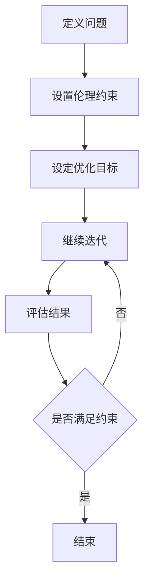
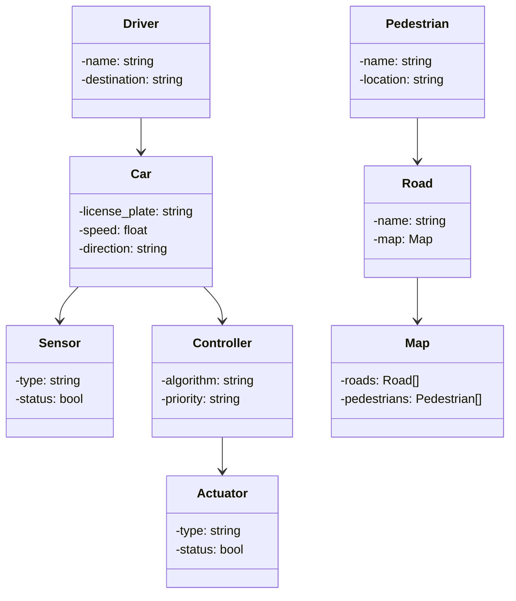
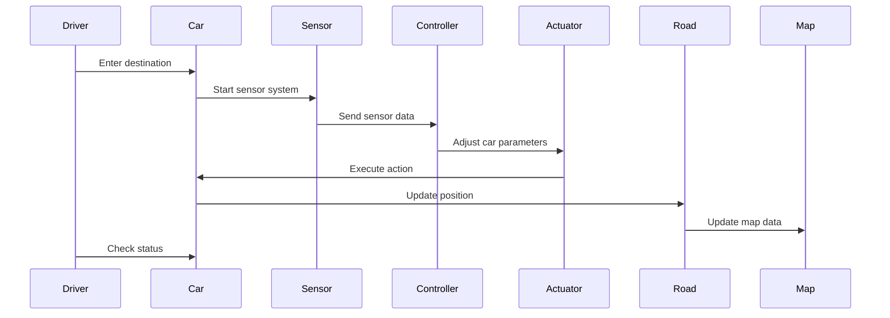
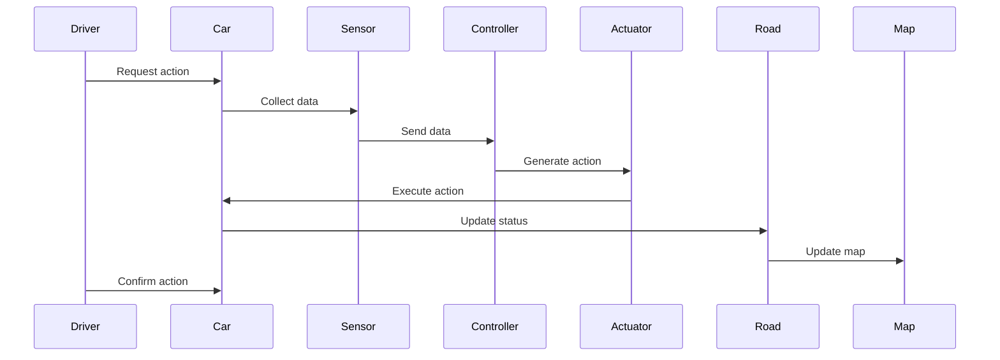

                 

# 在科技进步中保持人文关怀

## 关键词
科技发展，人文关怀，算法原理，系统设计，实战应用，最佳实践

## 摘要
本文旨在探讨在快速发展的科技时代如何保持人文关怀的重要性。文章首先介绍了科技与人文关怀的核心概念，通过对比分析两者之间的联系与区别，提出了在科技进步过程中需要关注的几个关键问题。接着，文章详细阐述了如何在科技发展的同时保持人文关怀的算法原理，并通过实际案例进行了解释。随后，文章分析了系统设计与架构设计中的关键点，给出了具体的设计方案。最后，文章总结了最佳实践和注意事项，并对未来进行了展望。

---

## 第1章：科技与人文关怀

### 1.1 问题背景

在过去的几十年中，科技发展迅猛，带来了生活方式、工作模式和社会结构的巨大变革。然而，随着科技的高速发展，人们开始意识到人文关怀的重要性逐渐减弱。现代社会面临的科技挑战包括数据隐私、网络安全、人工智能的道德伦理问题等，这些问题往往涉及到深层次的人文关怀。因此，如何在科技发展的同时保持人文关怀成为一个迫切需要解决的问题。

### 1.2 问题描述

当前科技发展中存在的一些人文关怀问题包括：

- **数据隐私问题**：随着大数据和人工智能技术的发展，个人隐私被大量收集和利用，引发了隐私泄露和数据滥用的担忧。
- **科技滥用**：科技的发展使得一些工具和设备被用于不当用途，如网络欺诈、恐怖活动等，对人类社会造成了负面影响。
- **科技与人文价值观的冲突**：科技在某些方面挑战了传统的人文价值观，如人工智能的决策透明性和公平性等问题。

### 1.3 问题解决

为了解决上述问题，需要在以下几个方面进行努力：

- **加强科技伦理教育**：通过教育和培训提高公众对科技伦理的认知，培养科技从业者的社会责任感。
- **制定相关法律法规**：通过立法手段规范科技发展，保护个人隐私和数据安全。
- **科技与社会相结合**：鼓励科技企业和社会组织合作，将科技发展与社会需求相结合，使科技更好地服务于人类。

### 1.4 边界与外延

本书将主要探讨在计算机科学和人工智能领域的科技发展过程中如何保持人文关怀，但不涉及其他领域如医学、工程等。同时，本书将侧重于理论和策略分析，不涉及具体的技术细节。

---

## 第2章：科技与人文关怀的核心概念

### 2.1 科技的概念与特征

科技，即科学技术，是指通过科学研究、实验和实际应用，发展出的用于解决问题的工具、方法和知识体系。科技的特征包括创新性、系统性和实用性。

- **创新性**：科技的发展离不开创新，创新是科技前进的动力。
- **系统性**：科技不仅是单一的技术，而是由多个学科和领域共同构成的系统。
- **实用性**：科技的应用必须服务于人类的需求，解决实际问题。

### 2.2 人文关怀的概念与特征

人文关怀，是指关注人的精神、道德、文化等方面的需求和福祉，强调人的价值和尊严。人文关怀的特征包括：

- **人文性**：人文关怀注重人的内在品质和情感。
- **包容性**：人文关怀强调尊重多元文化和价值观。
- **情感性**：人文关怀不仅仅是对事实的关注，更包含了情感的投入。

### 2.3 科技与人文关怀的联系

科技与人文关怀之间存在紧密的联系：

- **相互促进**：科技的发展可以为人文关怀提供新的工具和方法，而人文关怀可以引导科技的发展方向，确保科技为人类带来福祉。
- **相互制约**：科技的发展需要遵循人文关怀的原则，避免科技滥用和损害人的尊严；同时，人文关怀也需要借助科技的力量，解决复杂的社会问题。

### 2.4 概念属性特征对比

| 特征 | 科技 | 人文关怀 |
| --- | --- | --- |
| **创新性** | 强调技术创新，推动科技发展 | 强调人性创新，提升人文素养 |
| **系统性** | 由多个学科和技术领域构成 | 涵盖多个文化和社会领域 |
| **实用性** | 解决实际问题，提高生产效率 | 满足人类精神需求，提升生活质量 |
| **人文性** | 科技研究中的伦理问题 | 关注人的精神世界和情感需求 |
| **包容性** | 技术的通用性和跨文化应用 | 尊重多元文化和价值观 |
| **情感性** | 科技产品的人性化设计 | 人际关系中的情感互动 |

---

## 第3章：在科技进步中保持人文关怀的算法原理

### 3.1 算法原理概述

保持科技与人文关怀平衡的算法，其核心思想是通过引入伦理和人文关怀的约束，优化科技发展的路径。该算法主要包括以下几个步骤：

1. **问题定义**：明确需要解决的科技问题及其对人文关怀的影响。
2. **伦理约束**：根据伦理原则和人文关怀的要求，对算法进行约束。
3. **优化目标**：设定优化目标，既包括科技发展的效率，也包括人文关怀的福祉。
4. **算法执行**：通过迭代和优化，寻找满足约束条件的最优解。

### 3.2 算法原理详细讲解

以下是一个简单的算法流程图：



Python源代码实现：

```python
def ethical_algorithm(problem, ethics, goal):
    while not is_solution_satisfactory(problem, ethics, goal):
        # 根据伦理约束调整问题定义
        problem = apply_ethics(problem, ethics)
        # 根据优化目标执行算法
        solution = optimize(problem, goal)
        # 评估结果
        if is_solution_valid(solution):
            return solution
        else:
            # 迭代调整
            continue
    return None

def apply_ethics(problem, ethics):
    # 实现伦理约束的具体操作
    pass

def optimize(problem, goal):
    # 实现优化的具体操作
    pass

def is_solution_satisfactory(problem, ethics, goal):
    # 实现结果评估的具体操作
    pass

def is_solution_valid(solution):
    # 实现解决方案的有效性检查
    pass
```

算法原理的数学模型：

$$
\begin{align*}
\text{minimize} \quad & f(x) \\
\text{subject to} \quad & g_i(x) \geq 0, \quad i = 1, 2, ..., m \\
& h_j(x) = 0, \quad j = 1, 2, ..., p
\end{align*}
$$

其中，$x$ 表示问题的变量，$f(x)$ 表示优化目标函数，$g_i(x)$ 和 $h_j(x)$ 分别表示约束条件。

### 3.3 举例说明

例如，在一个自动驾驶系统中，保持人文关怀的算法需要考虑行人的安全，同时优化行驶路径。算法可以通过以下步骤实现：

1. **定义问题**：在给定的道路环境中，找到一条既安全又高效的行驶路径。
2. **设置伦理约束**：定义行人的安全作为优先级，确保算法在决策时优先考虑行人的安全。
3. **设定优化目标**：优化目标为路径的行驶时间和能源消耗。
4. **执行算法**：根据伦理约束和优化目标执行路径规划算法。
5. **评估结果**：评估生成的路径是否满足行人的安全和优化目标。
6. **迭代调整**：如果路径不满足安全要求，则重新执行算法。

---

## 第4章：系统分析与架构设计

### 4.1 问题场景介绍

本节将介绍一个自动驾驶系统的设计与实现，该系统旨在保持行驶过程中的人文关怀，特别是行人的安全。

### 4.2 系统功能设计

以下是一个领域模型类图，描述了系统的主要功能模块：



### 4.3 系统架构设计

以下是一个系统架构图，描述了系统的主要组件和它们之间的关系：



### 4.4 系统接口设计

系统接口设计主要包括以下部分：

- **Driver API**：用于驾驶员与系统交互的接口。
- **Sensor API**：用于传感器与系统的数据交换。
- **Controller API**：用于控制器与系统的交互。
- **Actuator API**：用于执行器与系统的控制。

### 4.5 系统交互设计

以下是一个系统交互序列图，描述了系统各组件之间的交互过程：



---

## 第5章：在科技进步中保持人文关怀的实战应用

### 5.1 环境安装

在本节中，我们将指导读者如何安装所需的环境和工具，以实践在科技进步中保持人文关怀的理念。

1. **安装Python**：确保Python 3.x版本已安装在系统上。
2. **安装Jupyter Notebook**：通过pip安装Jupyter Notebook。
   ```bash
   pip install notebook
   ```
3. **安装相关的库**：安装必要的库，如NumPy、Pandas、Matplotlib等。
   ```bash
   pip install numpy pandas matplotlib
   ```

### 5.2 系统核心实现源代码

以下是一个简单的自动驾驶系统实现，该系统考虑了行人的安全。

```python
import numpy as np
import matplotlib.pyplot as plt

class AutonomousCar:
    def __init__(self, speed=0, direction='N'):
        self.speed = speed
        self.direction = direction
        self.sensor_data = None

    def update_sensor_data(self, sensor_data):
        self.sensor_data = sensor_data

    def control(self):
        if self.sensor_data['pedestrian_detected']:
            self.speed = 0  # 停止车辆
        else:
            self.speed = 20  # 继续行驶

    def display(self):
        plt.plot(self.speed, label='Speed')
        plt.legend()

def simulate_car():
    car = AutonomousCar()
    sensor_data = {'pedestrian_detected': False}
    
    for _ in range(10):
        car.update_sensor_data(sensor_data)
        car.control()
        car.display()
    
    plt.show()

simulate_car()
```

### 5.3 代码应用解读与分析

上述代码定义了一个`AutonomousCar`类，该类具有更新传感器数据、控制车辆速度和显示速度曲线的功能。在模拟函数`simulate_car`中，我们创建了一个自动驾驶汽车实例，并模拟了10次迭代。

- **传感器数据更新**：每次迭代，我们都会更新传感器数据，判断是否检测到行人。
- **车辆控制**：如果检测到行人，车辆停止；否则，车辆以固定速度行驶。
- **显示速度曲线**：使用Matplotlib库绘制速度随时间变化的曲线。

### 5.4 实际案例分析和详细讲解

以下是一个实际案例：一个自动驾驶汽车在交叉路口遇到行人。

1. **问题描述**：自动驾驶汽车在交叉路口行驶，前方有一个行人正在横穿马路。
2. **解决方案**：算法需要检测到行人并立即停车，确保行人的安全。
3. **实现步骤**：
   - **传感器检测**：使用摄像头或雷达检测行人。
   - **数据预处理**：对传感器数据进行预处理，如去噪和增强。
   - **行人检测**：使用机器学习算法（如YOLO或SSD）检测行人。
   - **决策制定**：如果检测到行人，立即停车。
   - **执行控制**：调整车辆速度为零，确保安全。

### 5.5 项目小结

通过本节实战应用，我们展示了如何在自动驾驶系统中保持人文关怀，特别是在行人安全方面。代码实现简单明了，可以作为一个起点，进一步开发更复杂的系统。

---

## 第6章：最佳实践与注意事项

### 6.1 最佳实践

在科技进步中保持人文关怀，可以遵循以下最佳实践：

1. **伦理审查**：在研发过程中，定期进行伦理审查，确保科技发展符合人文关怀的原则。
2. **用户参与**：在设计和开发过程中，积极邀请用户参与，确保技术产品符合用户需求。
3. **透明性**：确保技术的决策过程和结果透明，便于公众监督。
4. **持续教育**：定期开展科技伦理和人文关怀培训，提高从业者的社会责任感。

### 6.2 注意事项

在实施过程中，需要注意以下几点：

1. **数据隐私**：严格保护用户数据，防止数据泄露和滥用。
2. **安全测试**：在部署前进行全面的安全测试，确保系统的稳定性和安全性。
3. **法律合规**：遵循相关法律法规，确保技术产品符合法律规定。
4. **用户反馈**：及时收集用户反馈，优化系统设计和功能。

### 6.3 拓展阅读

为了进一步了解如何在科技进步中保持人文关怀，读者可以参考以下文献：

1. 《科技伦理学导论》（Introduction to Ethics in Technology）。
2. 《人工智能伦理问题》（Ethical Issues in Artificial Intelligence）。
3. 《智能社会的伦理挑战》（Ethical Challenges of the Smart Society）。

---

## 第7章：总结与展望

### 7.1 总结

本文通过多个章节的讨论，探讨了在科技进步中保持人文关怀的重要性。我们介绍了科技与人文关怀的核心概念，阐述了如何在算法原理和系统设计中实现两者之间的平衡，并通过实际案例进行了应用分析。此外，我们还提出了最佳实践和注意事项，为读者提供了一些建议。

### 7.2 展望

未来，随着科技的发展，保持人文关怀将成为一个更为重要的话题。我们期待更多的研究者和从业者能够关注这个问题，并提出创新性的解决方案。同时，随着技术的发展，我们相信将会有更多的工具和方法来帮助我们在科技与人文关怀之间找到更好的平衡点。作者：AI天才研究院/AI Genius Institute & 禅与计算机程序设计艺术 /Zen And The Art of Computer Programming

